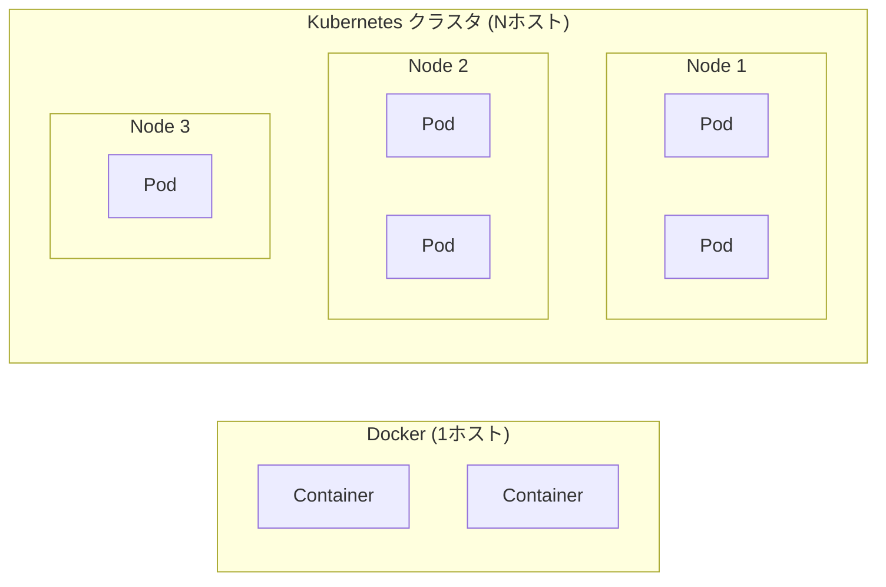

# Kubernetesとは
{: .no_toc }

## 目次
{: .no_toc .text-delta }

1. TOC
{:toc}

---

## Kubernetesとは？

**Kubernetes** (k8s) は、コンテナ化されたアプリケーションのデプロイ、スケーリング、運用を自動化する **コンテナオーケストレーションプラットフォーム** です。
Google が社内で運用していた Borg の知見をもとに 2014 年に OSS として公開され、現在は CNCF (Cloud Native Computing Foundation) によって運営されています。

Docker が「1台のホスト上でコンテナを動かす」ための技術だとすると、Kubernetes は「**多数のホストで構成されたクラスタ上で、多数のコンテナを協調動作させる**」ための技術です。



## なぜKubernetesを使うのか

Docker でコンテナを動かせるようになった後、本番運用に進むと必ず以下の課題に直面します。
Kubernetes は、これらをまとめて解決するために存在します。

### 1. 自己修復 (Self-healing)

サーバーが落ちる、コンテナがクラッシュする、メモリリークで応答しなくなる ─ これらは本番環境で **必ず起きます**。

Kubernetes は宣言的に「Web アプリのレプリカは常に3つ動いていてほしい」と書いておくと、

- コンテナがクラッシュすれば自動で再起動
- ノード自体が落ちれば、別のノードに Pod を移して再起動
- ヘルスチェック失敗時はトラフィックを流さず再起動

を、人間が介入せず実行してくれます。

### 2. スケーリング

トラフィックは時間帯やキャンペーンで大きく変動します。
Kubernetes は手動でも自動でも、レプリカ数を瞬時に変更できます。

```bash
# 手動スケール
kubectl scale deployment web --replicas=10

# 自動スケール (CPU使用率70%超で最大20個まで)
kubectl autoscale deployment web --min=3 --max=20 --cpu-percent=70
```

ノード自体が足りなくなれば **Cluster Autoscaler** がノードを増やすこともできます(ローカル環境では VM 増設に相当)。

### 3. 宣言的な構成管理 (Declarative Configuration)

Kubernetes 操作の中心は **「あるべき状態 (Desired State) を YAML で宣言する」** ことです。

```yaml
apiVersion: apps/v1
kind: Deployment
metadata:
  name: web
spec:
  replicas: 3
  selector:
    matchLabels:
      app: web
  template:
    metadata:
      labels:
        app: web
    spec:
      containers:
      - name: web
        image: nginx:1.27
```

「nginx:1.27 のレプリカが 3 つ動いているべき」と宣言するだけで、現状と比較して差分を埋め続けるのが Kubernetes です。
これは **手続き型(動かす手順を書く)** ではなく **宣言型(あるべき姿を書く)** のアプローチで、Git で構成管理しやすく、後の **GitOps** へ繋がる重要な考え方です。

### 4. ポータビリティとエコシステム

Kubernetes API は事実上の業界標準で、AWS EKS / GCP GKE / Azure AKS / オンプレ kubeadm のすべてが同じ `kubectl` と YAML で操作できます。
さらに CNCF Landscape にあるように **数百のツール (Helm、Argo CD、Prometheus、Istio、…)** が Kubernetes 前提で作られており、組み合わせて高度な運用基盤を作れます。

### 5. リソースの効率的な利用 (Bin Packing)

Kubernetes のスケジューラは各 Pod のリソース要求を見て、ノードに **詰め込むように配置** します。
従来「1サーバー=1アプリ」で動かしていた場合と比べ、ハードウェアの利用効率を大幅に上げられます。

## Kubernetesが解決しないもの

一方で、Kubernetes は **何でもしてくれる魔法ではありません**。次のことは Kubernetes 自体は提供しません。

- アプリケーションのビルドや CI(別途 GitHub Actions、Argo Workflows などが必要)
- 永続データそのものの管理(別途 RDS のような DB か、Operator が必要)
- アプリケーションレベルの機能(認証、ロギング、メッセージング、…)
- 設定や Secret の値そのもの(空き箱は提供するが中身は人が用意)

「Kubernetes は **プラットフォームを作るためのプラットフォーム**」とよく言われます。
**何を Kubernetes にやらせ、何を別の仕組みでやるか** の見極めが、実サービス提供では非常に重要です。

{: .important }
本教材ではマネージド K8s(EKS/GKE/AKS)を使わず、Minikube と kubeadm でローカル完結します。
ただし、ここで学ぶ概念や YAML はそのままマネージドでも通用します。**「自分で組めるからこそ、マネージドのありがたみが分かる」** という順番で進めます。

## チェックポイント

- [ ] 自分の言葉で「なぜ Docker だけでは足りないのか」を説明できる
- [ ] 「宣言的構成管理」とは何か、命令型との違いを説明できる
- [ ] Kubernetes が **やってくれないこと** を 2 つ以上挙げられる
