# Kubernetesとは
{: .no_toc }

## 目次
{: .no_toc .text-delta }

1. TOC
{:toc}

---

## このページのゴール

このページを読み終えると、以下を **自分の言葉で説明できる** ようになります。

- Kubernetes が「何を解決するために生まれたのか」 ─ 背景と歴史的経緯
- なぜ「コンテナ」だけでは本番運用に不足し、「コンテナオーケストレーション」が必要なのか
- Kubernetes の根本にある **設計思想** (宣言的構成、コントロールループ、APIファースト)
- Kubernetes が **やってくれること / やってくれないこと** の境界線
- マネージド K8s (EKS/GKE/AKS) と自前構築 (kubeadm) の違いと、本教材で自前構築を選ぶ理由

このページは概念の章なので、まだ手を動かす必要はありません。読み物として進めてください。

---

## 1. Kubernetes が生まれるまでの歴史的背景

Kubernetes を理解する近道は、**「なぜこれが必要になったのか」** を歴史的経緯から押さえることです。
解決すべき課題が変遷してきた結果、必然として生まれたのが Kubernetes だからです。

### 1-1. 物理サーバ時代 (〜2000年代前半)

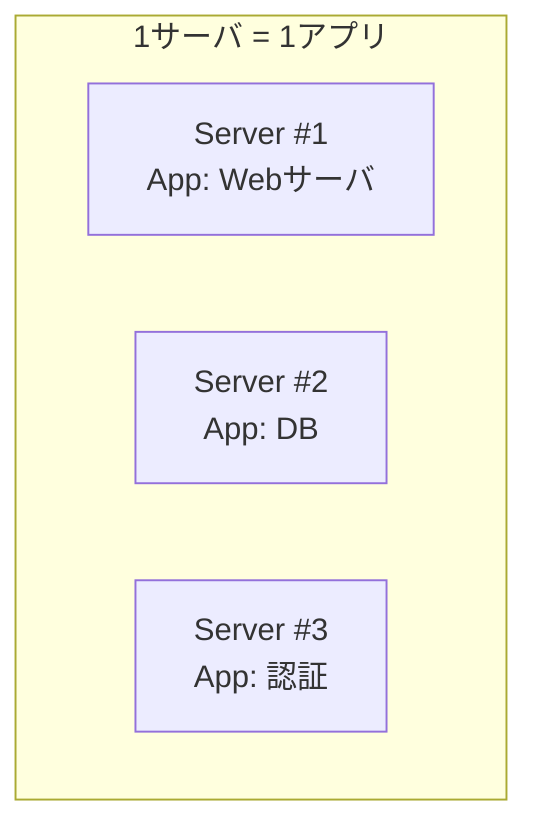

**当時の運用**:

- 1つの物理サーバに、1つの主要アプリを動かす
- 新しいアプリを動かすには新しい物理サーバを発注 → 数週間〜数ヶ月待ち
- リソース利用率は平均 5〜15%(ピーク用に余裕を持たせるため)
- 設定変更はサーバに SSH してファイルを直接編集

**主な問題**:

| 問題 | 内容 |
|------|------|
| リソース浪費 | サーバの95%は遊んでいる |
| 調達リードタイム | 新サーバが届くまで業務が止まる |
| スノーフレーク化 | 各サーバが独自設定で「あの人にしか直せない」状態に |
| 障害復旧が遅い | サーバ故障で構築から作り直し、数時間〜数日 |

### 1-2. 仮想化 (VM) の普及 (2000年代中盤〜)

VMware ESX (2001), Xen (2003), KVM (2007) の登場で **物理サーバ1台に複数のVMを載せる** 時代に。

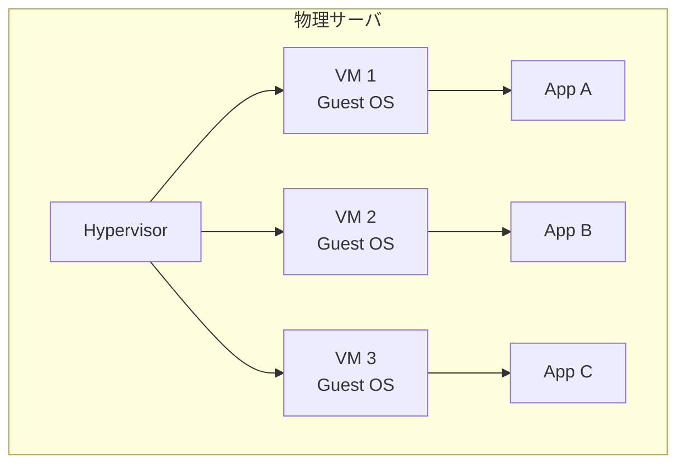

**改善された点**:

- 1物理サーバに複数アプリを集約 → リソース利用率向上(20〜40%)
- VM のコピー・スナップショットで「環境構築の時間」が短縮
- 障害時に別ホストに VM を移動可能 (vMotion / Live Migration)

**しかし新たな問題**:

| 問題 | 内容 |
|------|------|
| Guest OS のオーバーヘッド | VM ごとに OS が必要、メモリ数百MB〜数GB が OS に消える |
| 起動時間 | VM 起動に数十秒〜数分。スケールが遅い |
| イメージサイズ | OS 込みで数GB〜数十GB、配布に時間がかかる |
| 「アプリ + 環境」の一体配布が難しい | OSパッケージと依存関係の管理は依然として複雑 |

### 1-3. Docker (コンテナ) の登場 (2013年〜)

Docker は **Linux カーネルの namespace と cgroups を使い**、VM より軽量な隔離を実現しました。

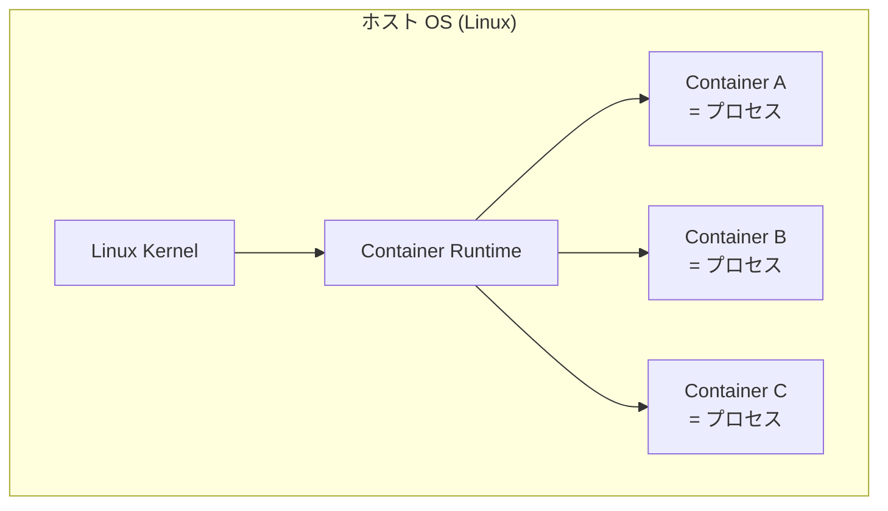

**革命的だった点**:

- VM と違い **OS を重ねない**(カーネル共有)→ 起動 1 秒以下、メモリ数十MB〜
- **Dockerfile** で「OSと依存ライブラリとアプリ」を1つのイメージに固める
- イメージは **どこでも同じように動く**(開発者のラップトップでも本番でも)
- レイヤー型ファイルシステムで、差分だけpush/pullできる効率性

しかし Docker 単体では、まだ本番運用に **致命的に足りない要素** がありました。それが Kubernetes が解決する領域です。

### 1-4. Google 内部の Borg (2003年〜・非公開)

Google は実は 2003年から **Borg** という社内システムでコンテナ的なものを大規模運用していました。

- 全 Google サービス(検索、Gmail、YouTube、広告、…)が Borg 上で動く
- 1万台規模のクラスタ多数、合計数百万コンテナ
- ジョブをマシンに割り当て、リソースを管理し、障害時に再起動する司令塔

Borg は社内ツールでしたが、その思想と設計が後の Kubernetes の元になります。

主要論文(2015年公開、いずれも一読の価値あり):

- ["Large-scale cluster management at Google with Borg"](https://research.google/pubs/pub43438/) (Verma et al., EuroSys 2015)
- ["Borg, Omega, and Kubernetes"](https://research.google/pubs/pub44843/) (Burns et al., ACM Queue 2016)

### 1-5. Kubernetes の誕生 (2014年6月)

Google の Joe Beda、Brendan Burns、Craig McLuckie の3名が、Borg の経験を OSS として世に出すプロジェクトを開始。

- **2014年6月**: GitHub で v0.1 公開
- **2015年7月**: Kubernetes 1.0 リリース、同時に **CNCF (Cloud Native Computing Foundation)** 設立、Kubernetes は CNCF の最初のプロジェクトに
- **2018年3月**: CNCF Graduated プロジェクト第1号(成熟認定)
- **現在**: 4ヶ月ごとにマイナーリリース、世界中で本番運用

「Kubernetes」という名前はギリシャ語で **「操舵手 (Helmsman)」** の意味。
Docker の船の上で **コンテナを操舵する人** という比喩です。

略称 **k8s** は「K + 8文字 + s」の表記法から。"i18n" (internationalization) と同じ。

### 1-6. なぜ Borg ではなく Kubernetes が広まったか

Borg は Google 社内に最適化されすぎていました。Kubernetes は OSS として汎用設計され、

- 拡張性 (Custom Resources、Webhook で機能追加可能)
- API の汎用性 (REST + Watch のシンプルな設計)
- ベンダー中立 (CNCF の傘下、特定企業に縛られない)

を兼ね備えたことで、爆発的に広まりました。
2024年時点で、世界の **本番サーバの相当数** が Kubernetes 上で動いています。

---

## 2. Kubernetes とは何か (定義)

ここでようやく定義します。

> **Kubernetes** は、コンテナ化されたアプリケーションのデプロイ、スケーリング、運用を自動化する、**オープンソースのコンテナオーケストレーションプラットフォーム** である。

3つのキーワードを分解しましょう。

### 2-1. 「オーケストレーション」とは

オーケストラ(管弦楽団)では、たくさんの楽器奏者を **指揮者** がまとめて1つの楽曲を演奏します。
コンピューティングのオーケストレーションも同じで:

- 楽器奏者 = コンテナ
- 指揮者 = Kubernetes
- 楽曲 = サービス全体(マイクロサービスの集合体)

数百〜数千のコンテナを協調動作させ、1つの「アプリケーション」として振る舞わせるのが Kubernetes の役目です。

### 2-2. 「プラットフォーム」とは

Kubernetes は **「上にプラットフォームを作るためのプラットフォーム」**(platform for platforms)とよく言われます。

これは「Kubernetes 単体で何でもできる」のではなく、

- Kubernetes の上に CI/CD ツール (Argo CD)、観測基盤 (Prometheus)、Service Mesh (Istio) などを組み合わせて、**自社専用のアプリケーション運用基盤を組み立てる** ための土台

という意味です。本教材を通して、この「組み立て」を実際に体験します。

### 2-3. 「OSS で CNCF 中立」が意味するもの

Kubernetes は特定企業のものではなく、

- ソースコードは [GitHub kubernetes/kubernetes](https://github.com/kubernetes/kubernetes) で誰でも読める
- 仕様は CNCF が管理し、特定ベンダーが勝手に変更できない
- AWS / GCP / Azure / Oracle / Alibaba 等、すべてのクラウド事業者が同じ Kubernetes API を提供

つまり **「ベンダーロックインが小さい」** のが大きな特徴。
EKS で動いていたアプリを GKE に持っていく(あるいはその逆、オンプレ kubeadm に持っていく)のも、原理的には YAML をそのまま流すだけで済みます。

---

## 3. Docker と Kubernetes ─ 何がどう違うのか

最初の混乱ポイントです。

### 3-1. Docker と Kubernetes は競合関係ではない

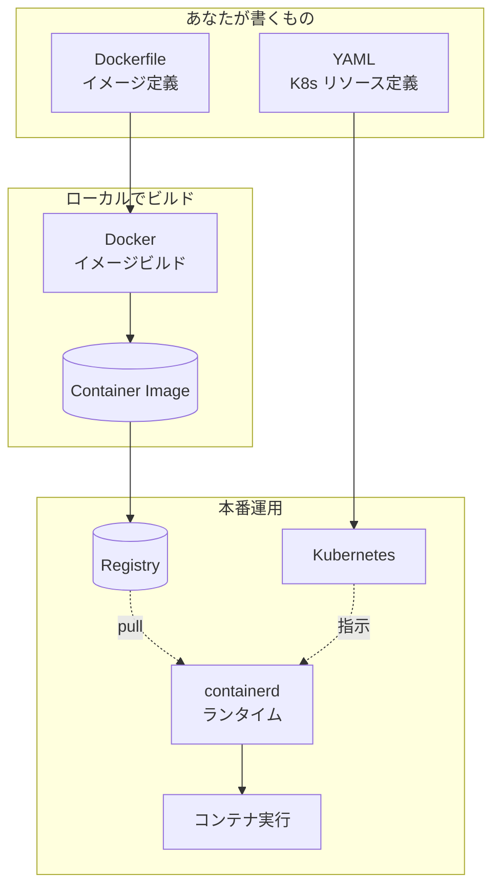

役割を整理すると:

| レイヤー | 担当ツール | 役割 |
|----------|-----------|------|
| イメージ定義 | Dockerfile | アプリの実行環境定義 |
| イメージビルド | Docker, BuildKit, Podman, kaniko | Dockerfile からイメージ生成 |
| イメージ保管 | Docker Hub, GHCR, ECR, GCR, Harbor | イメージレジストリ |
| コンテナ実行 | containerd, CRI-O, Docker Engine | ノード上で実コンテナを起動 |
| オーケストレーション | Kubernetes, Nomad, Docker Swarm | 多ノード・多コンテナの協調制御 |

**つまり Docker と Kubernetes は層が違う**ため、競合ではなく補完関係です。

### 3-2. 「Kubernetes が Docker を捨てた」騒動 (2020-2022)

歴史的にちょっとややこしい経緯があったので押さえておきましょう。

- 2020年12月: Kubernetes 1.20 が「**dockershim を将来削除する**」と発表
- 2022年5月: Kubernetes 1.24 で実際に **dockershim 削除**

この時、SNSで「**Kubernetes が Docker を捨てた!**」と大騒ぎになりました。
しかし、これは正確ではありません。

正しくは:

- ノードのコンテナ **ランタイム** として、Docker Engine を直接使うのを止めた
- 代わりに `containerd` や `CRI-O` を使う(これは Kubernetes 標準仕様 CRI に準拠)
- **Docker でビルドしたイメージは、引き続きそのまま使える**(イメージは OCI 標準形式)

つまり「Docker でイメージを作り、Kubernetes (上の containerd) で動かす」というワークフローは何も変わっていません。

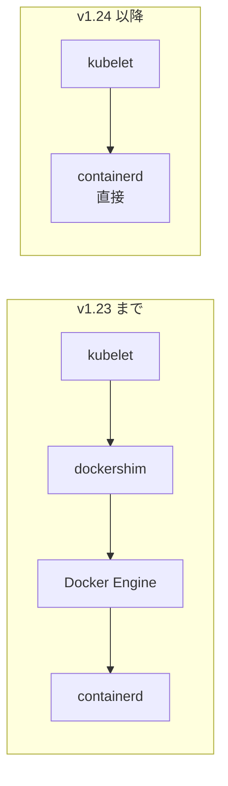

dockershim は kubelet と Docker Engine の間の **互換レイヤー** で、Kubernetes プロジェクトが個別にメンテナンスする必要があり負担になっていました。
一方 containerd は Docker Engine の中核ライブラリでもあり、CRI に直接対応しているため、互換レイヤーを挟む必要がなく **シンプル・高速** です。

### 3-3. 比較まとめ

| 観点 | Docker (単独) | Kubernetes |
|------|---------------|------------|
| 主な用途 | 1ホスト上のコンテナ実行 | 多数ホスト上のコンテナ協調 |
| ホスト数 | 1台 | 数台〜数千台 |
| コンテナ数 | 数十まで現実的 | 数千〜数十万 |
| 自動再起動 | 可能 (`--restart=always`) | 可能、かつノード障害も自動対応 |
| ローリング更新 | docker compose で limited | 標準機能 |
| サービスディスカバリ | network alias程度 | DNS + Service の本格機能 |
| 設定管理 | env / volume mount | ConfigMap / Secret |
| ヘルスチェック | HEALTHCHECK | Liveness / Readiness / Startup Probe |
| 学習コスト | 低 | 高(本教材の動機) |

「**まず Docker でアプリを動かせるようになり、規模が大きくなったら Kubernetes**」という順序で学ぶのが自然です。

---

## 4. なぜ Kubernetes が必要なのか ─ Docker だけでは足りない6つの壁

Docker が動いている環境で、本番運用を始めると必ずぶつかる壁があります。
**Kubernetes はこれらすべてを統合的に解決** します。

### 壁1: コンテナが死ぬ

本番環境では必ず起こります。

| 原因 | 頻度 |
|------|------|
| アプリのバグ | しばしば |
| メモリリーク → OOM Kill | 数日〜数週間に1回 |
| ネットワーク一時障害 | 不定期 |
| ディスク満杯 | 月単位 |
| ノード自体の故障 | 年単位 |

#### Docker 単体だと

`docker run --restart=always` で同一ホスト上の自動再起動はできます。
しかし **ホスト自体が落ちたら手動で別ホストに引っ越し** が必要。深夜の障害対応で疲弊する原因 No.1。

#### Kubernetes だと

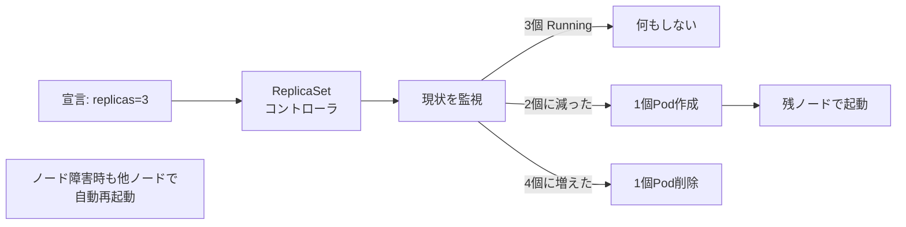

Pod が落ちる/ノードが落ちるのに **人間の介入なし** で対応します。これが **自己修復 (Self-healing)** の原理。

設定例:

```yaml
spec:
  replicas: 3   # 常に3個動いていてほしい
```

Kubernetes は数秒間隔で「現在の数」と「あるべき数」を比較し、差分を埋めます。これが **コントロールループ** という Kubernetes 設計の核(後述)。

### 壁2: トラフィックの変動

本番アプリのトラフィックは時間帯・キャンペーン・テレビ放映など多くの要因で変動します。

#### Docker 単体だと

- ピーク用に多めに用意 → 通常時はアイドル(コスト浪費)
- 通常時に合わせる → ピーク時に落ちる

#### Kubernetes だと

3層の自動スケール機構があります。

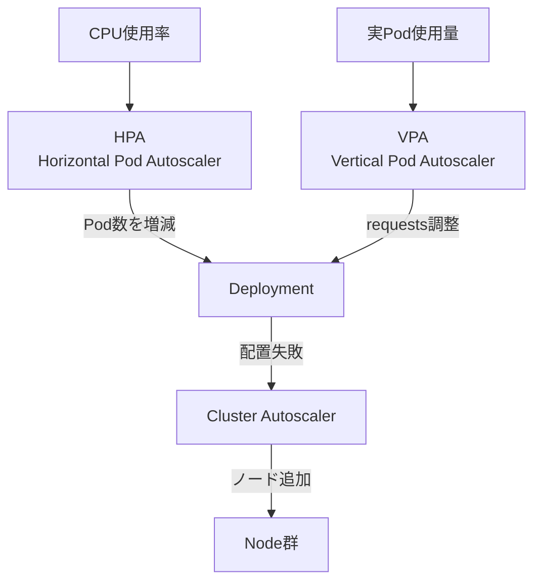

| スケーラ | 対象 | 何が変わるか |
|----------|------|--------------|
| HPA | Pod の `replicas` | Pod 数(横方向) |
| VPA | Pod の `resources.requests` | 1Podのサイズ(縦方向) |
| Cluster Autoscaler | ノード数 | クラスタ全体のキャパ |

これにより、**トラフィック2倍 → 数分で Pod 数2倍、トラフィック半減 → 数分で Pod 半減** が自動で起こります。
クラウドで使えば、ピーク時だけ料金が増え、通常時は最低限のリソースだけ ─ **金銭的なメリットも大きい**。

### 壁3: デプロイの安全性

新バージョンをリリースするとき:

#### Docker 単体だと

- 全部一気に置き換える → バグがあると全ユーザーに影響
- 1台ずつ手動置換 → 時間かかる、ミスしやすい
- Blue-Green 等を組むには自前で大量のシェルスクリプトが必要

#### Kubernetes だと

```yaml
strategy:
  type: RollingUpdate
  rollingUpdate:
    maxSurge: 25%        # 同時に増やせる新Pod の上限
    maxUnavailable: 25%  # 同時に減らせる旧Pod の上限
```

これだけ書けば:

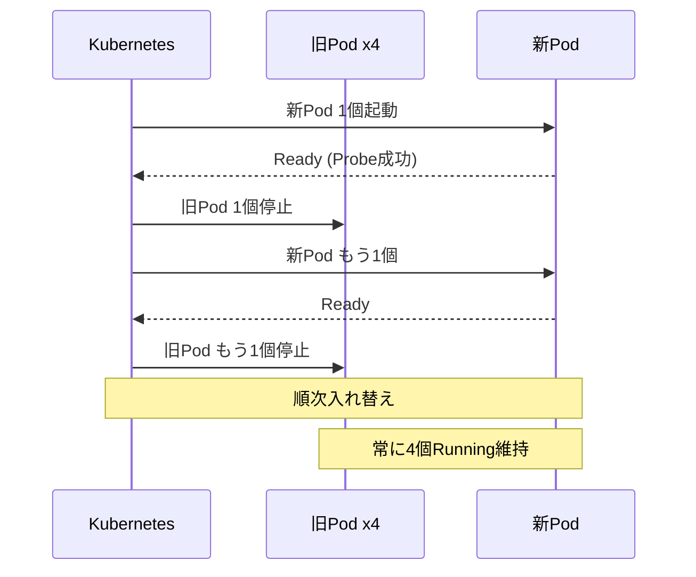

しかも `kubectl rollout undo` で **1コマンドで前バージョンに巻き戻し** が可能です。
さらに進んだ Argo Rollouts を使えば、カナリアリリース(1% → 10% → 50% → 100%)も標準YAMLで定義できます。

### 壁4: 設定とシークレットの管理

「devとprodでDB接続先が違う」「APIキーは環境ごとに違う」をどう扱うか。

#### Docker 単体だと

- イメージにベイク(焼き込み)してしまう → 環境ごとに別イメージで非効率
- env で渡す → docker-compose ファイル管理、シークレットがファイルに平文…
- volume マウント → ファイルパスのドキュメント化と管理が大変

#### Kubernetes だと

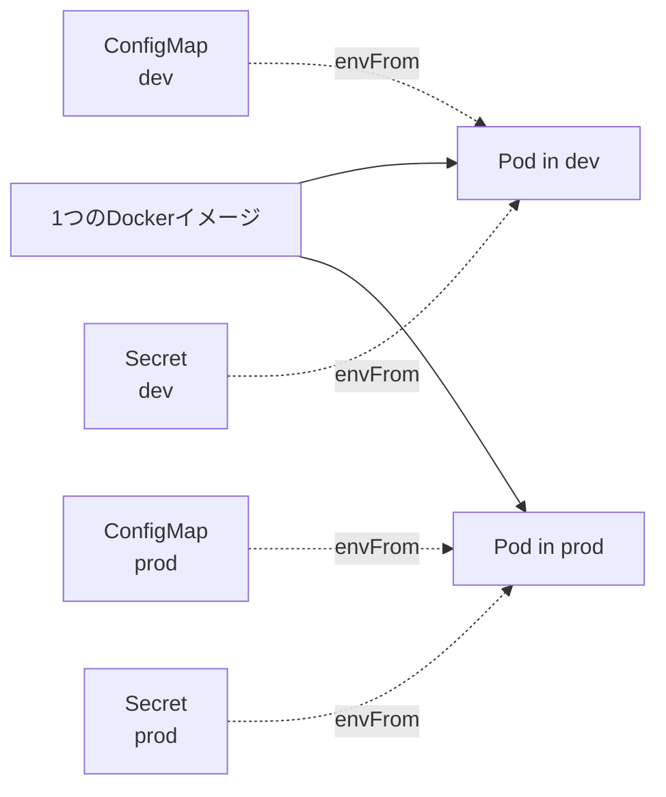

**イメージは環境共通、設定だけ環境ごとに違うものを注入** する形が綺麗に取れます。
これは [12-Factor App](https://12factor.net/ja/config) の原則 III「設定を環境変数に格納する」に完全準拠しています。

### 壁5: 多数のサービス間通信

マイクロサービス化が進むと、サービス数は数十〜数百になります。

#### Docker 単体だと

- どのコンテナがどの IP か?
- IP は再起動で変わる(動的)
- ロードバランシングは?
- TLS 証明書は?
- これら全部を自前 Nginx 設定で管理 → 破綻

#### Kubernetes だと

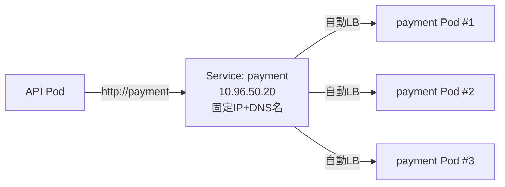

`payment` という名前で呼ぶだけで、自動的に背後の Pod 群にロードバランス。
Pod が再起動しても、Pod が増減しても、呼び出し側のコードは何も変わらない。

これは **サービスディスカバリ + L4ロードバランサ** の機能を、Kubernetes が標準提供しているからです。

### 壁6: 永続データの扱い

ステートフルなアプリ(DB、キュー、ストレージ)では、コンテナが死んでもデータは消えてはいけません。

#### Docker 単体だと

- `docker run -v /host/path:/container/path` → ホスト固定で他ホストに移せない
- 別ホストに移すたびにデータ移行が必要

#### Kubernetes だと

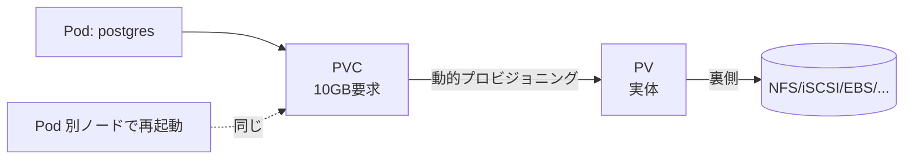

**Pod とストレージが分離** されているので、Pod が別ノードで再起動してもデータは付いてきます。

---

## 5. Kubernetes の根本にある設計思想

Kubernetes を「単なるツール」として暗記するのではなく、**設計思想** を理解しておくと、応用が効くようになります。

### 5-1. 宣言的構成 (Declarative Configuration)

最も重要な思想です。

#### 命令型 (Imperative)

「**どう動かすか**」の手順を書きます。

```bash
# 命令型(Docker的)
docker run -d --name web1 nginx
docker run -d --name web2 nginx
docker run -d --name web3 nginx
# 1個落ちたら手動で再起動
docker run -d --name web2 nginx
```

#### 宣言型 (Declarative)

「**どうあってほしいか**」の結果を書きます。

```yaml
# 宣言型(Kubernetes的)
spec:
  replicas: 3
```

「3個動いていてほしい」とだけ書く。**どうやって3個に保つかは Kubernetes が考える**。

#### なぜ宣言型が優れるのか

| 観点 | 命令型 | 宣言型 |
|------|--------|--------|
| 失敗時の対応 | 続きの手順を書く必要 | 自動的に再収束 |
| Git管理 | 履歴が散らばる | YAML ファイル = 現在の状態 |
| 複数人での運用 | 競合や順序問題 | YAML マージで済む |
| ロールバック | 逆順手順を書く | 古いYAMLをapplyするだけ |
| 監査 | 操作ログを追う | YAML の git log を見るだけ |

これは [GitOps](https://www.weave.works/technologies/gitops/) という後の運用モデルにも直結します(8章で扱う)。

### 5-2. コントロールループ (Reconciliation Loop)

Kubernetes の挙動は「**現状と目標の差分を埋め続ける**」というループです。

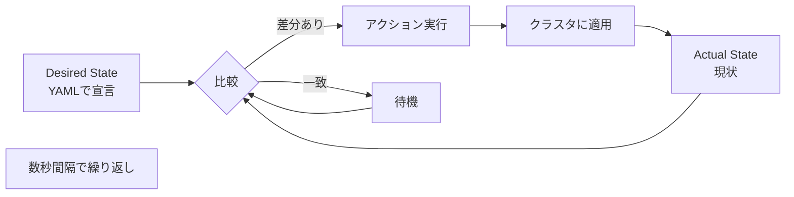

これは制御工学の **PID制御** に似た発想です。
温度センサが目標温度との差を検出し、ヒーター/クーラーを制御するのと同じ。

#### 具体例: Pod が1個落ちたとき

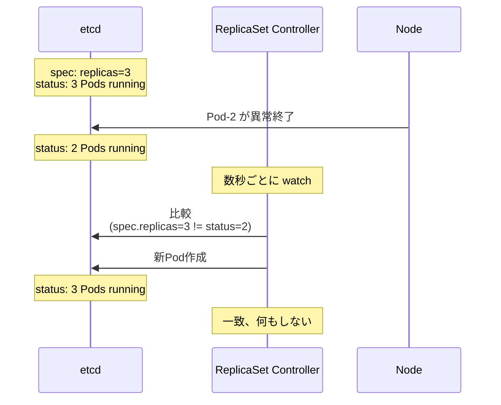

これが「自己修復」の正体。**特別な仕組みがあるのではなく、コントロールループが回り続けているだけ**。

### 5-3. API ファースト

Kubernetes のすべての操作は **REST API 経由** で行われます。
`kubectl` も Argo CD もダッシュボードも、内部的には全員 API Server を叩いているだけです。

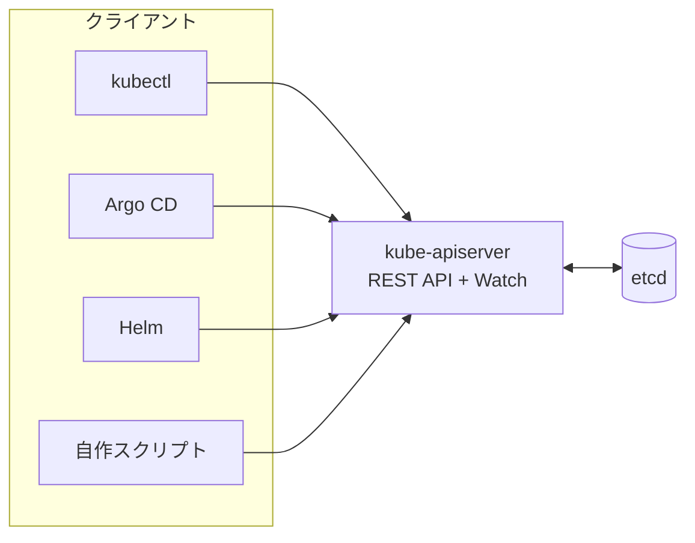

これにより:

- どんな言語からも操作可能(公式SDKは Go, Python, Java, JavaScript, …)
- 拡張も同じ仕組み(Custom Resource Definition で新しい API を追加できる)
- コマンドラインツールが乱立してもAPIは1つに統一されている

### 5-4. Watch ベースのイベント駆動

API Server には **Watch** という長期接続機能があり、コントローラ達は「変更があったら教えて」と Watch しています。

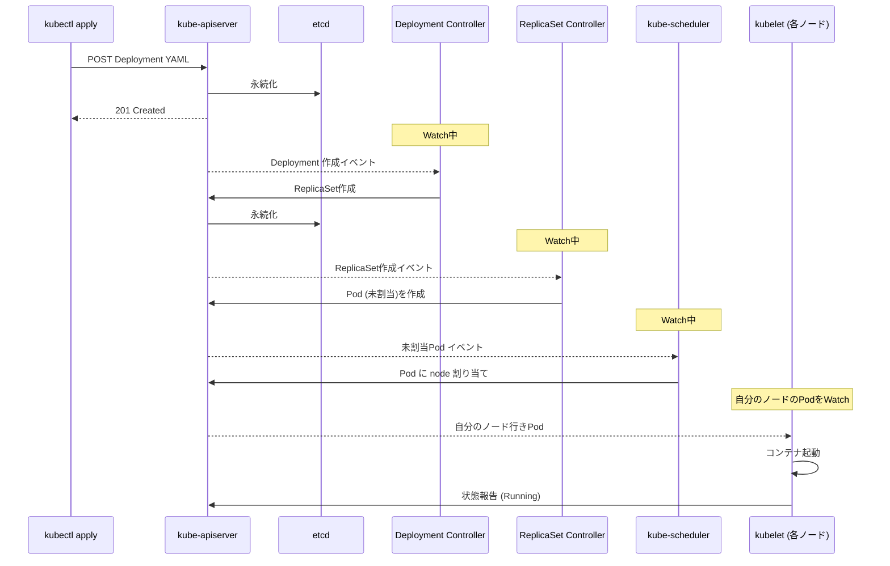

ポイント: **コンポーネント同士は直接通信せず、全員 API Server を見ている**。
これが Kubernetes の **拡張性** と **モジュラリティ** の根源です。

### 5-5. ラベルとセレクタによる疎結合

Kubernetes の各リソース(Pod, Service, Deployment)は **ラベル** という Key-Value で結びつきます。

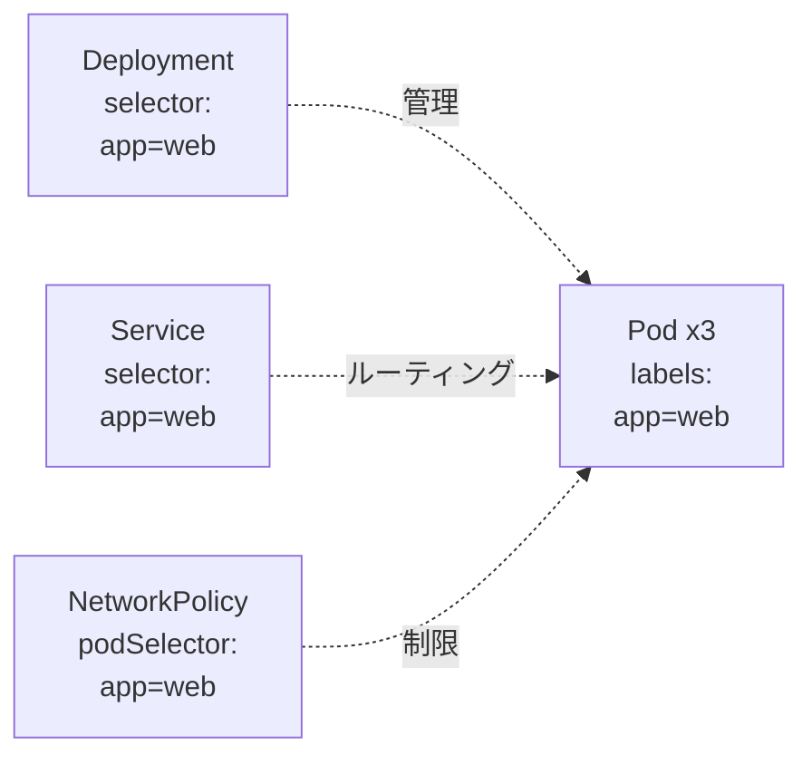

Pod は「自分が誰の管理下か」を知りません。**ラベルで照合して自動的に紐づく** だけ。
これにより:

- 後から別のリソースが Pod を見つけて連携できる(疎結合)
- ラベルを書き換えるだけで管理対象から外せる
- Pod の数が増減しても、紐付け定義は変わらない

### 5-6. 不変性 (Immutability)

Kubernetes の Pod は基本的に **使い捨て** で、稼働中の Pod を編集しません。

| 古いやり方 (Pet) | Kubernetes 流 (Cattle) |
|-----------------|------------------------|
| サーバに SSH して設定変更 | 新しいイメージをデプロイ |
| サーバが落ちたら大事に修復 | Pod が落ちたら新しいの作る |
| サーバごとに名前付けて愛着 | Pod は番号、消えても気にしない |

「Pets vs Cattle」(ペット vs 家畜)という有名な比喩があります。Kubernetes は完全に Cattle 思想です。

これは Docker 入門で出てきた **Immutable Infrastructure** をさらに徹底したものです。

---

## 6. Kubernetes を構成するコンポーネント (概要)

ここでは「全体像」だけ。各コンポーネントの詳細は第2章で扱います。

### 6-1. クラスタの2つの面

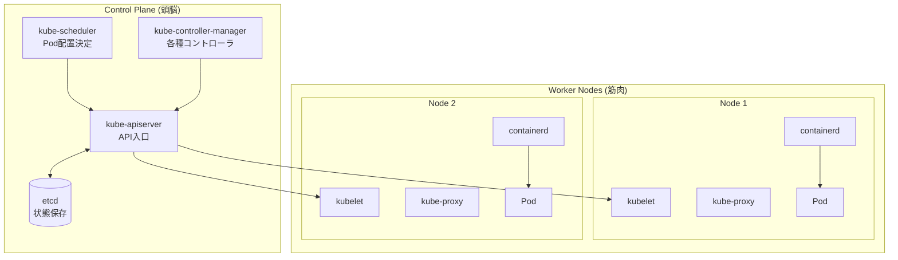

| コンポーネント | 担当 | 例えるなら |
|----------------|------|-------------|
| kube-apiserver | API 入口 | 受付窓口 |
| etcd | 状態保存 | 倉庫の在庫台帳 |
| kube-scheduler | Pod 配置決定 | 配送センターの仕分け係 |
| kube-controller-manager | 各種コントローラ | 各部署の管理職 |
| kubelet | 各ノードのエージェント | 現場作業員 |
| kube-proxy | Service ルーティング | 構内案内員 |
| containerd | コンテナ実行 | 機械を動かす職人 |

### 6-2. なぜこういう設計か

**単一障害点を減らすため**。

- API Server は複数台で冗長化可能
- etcd は3台または5台のクォーラム構成
- スケジューラやコントローラはリーダー選出方式で冗長
- Worker は何台でも横にスケール

これによりクラスタ全体は **どれか1台が落ちてもサービスを継続できる** 高可用性を持ちます。

第7章 [kubeadm で自前クラスタ構築]({{ '/07-production/kubeadm/' | relative_url }}) で、この HA 構成を実際に手で組みます。

---

## 7. Kubernetes が「やってくれないこと」

Kubernetes は強力ですが、**何でもしてくれる魔法ではありません**。よくある誤解を解いておきます。

### 7-1. やってくれないことリスト

| 役割 | Kubernetes自身 | 別途必要なもの |
|------|----------------|----------------|
| アプリのソースコード管理 | ✗ | Git |
| アプリのビルド・テスト | ✗ | GitHub Actions / Jenkins |
| イメージの脆弱性スキャン | ✗ | Trivy / Snyk |
| イメージの保管 | ✗ | Container Registry |
| 永続データの本格運用 | △ (空の枠だけ) | DB管理者 / Operator |
| 認証・認可(アプリ側) | ✗ | OAuth / OIDC ライブラリ |
| メトリクス収集 | ✗ | Prometheus |
| ログ集約 | ✗ | Loki / ELK / Splunk |
| アラート通知 | ✗ | Alertmanager / PagerDuty |
| 設定値そのもの | ✗ | 人間が用意 |
| パスワード・トークンの実体 | ✗ | Vault / AWS Secrets Manager |
| サービスメッシュ | ✗ | Istio / Linkerd |
| TLS証明書の自動発行 | ✗ | cert-manager |

### 7-2. 「Kubernetes はプラットフォームを作るためのプラットフォーム」の意味

つまり:

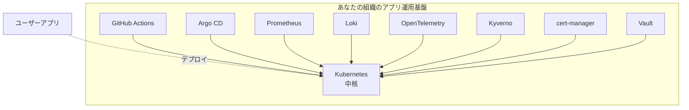

Kubernetes を **核** に、周辺ツールを **組み合わせ** て、自社の運用基盤を作る。
本教材では、この「組み立て」を Minikube → kubeadm → 各種ツールの順に **すべてローカル PC 上で** 体験します。

---

## 8. マネージド K8s vs 自前構築

Kubernetes を使う方法は2つあります。

### 8-1. マネージド K8s

クラウド事業者が Control Plane を運用してくれるサービス。

| サービス | 提供元 |
|----------|--------|
| **EKS** (Elastic Kubernetes Service) | AWS |
| **GKE** (Google Kubernetes Engine) | Google Cloud |
| **AKS** (Azure Kubernetes Service) | Microsoft Azure |
| **OKE** | Oracle Cloud |
| **Linode Kubernetes Engine** | Akamai |
| **DigitalOcean Kubernetes** | DigitalOcean |

**メリット**:
- Control Plane の運用を任せられる(etcdバックアップ、アップグレード等)
- ノードを増やすのも管理画面から1分
- IAM/ロギング/モニタリングがクラウドサービスと統合

**デメリット**:
- 月額費用がかかる(Control Plane だけで $0.10/時間 × 24h × 30日 ≒ $72/月)
- ベンダー固有の制約や癖がある
- 「ブラックボックス」で動いている内部が見えない

### 8-2. 自前構築 (kubeadm / Rancher / k0s)

自分で Control Plane も Worker も用意する方式。

| ツール | 特徴 |
|--------|------|
| **kubeadm** | Kubernetes 公式の標準ツール。本教材で使用 |
| **kubespray** | Ansible で複数台一括構築 |
| **Rancher** | UI付き、マルチクラスタ管理 |
| **k0s** | バイナリ1個で動くシンプル実装 |
| **k3s** | エッジ向け軽量版 |
| **Talos** | Kubernetes専用OS |

**メリット**:
- 費用なし(自宅PC運用なら)
- 内部が完全に見える(学習に最適)
- 自由度が高い

**デメリット**:
- 全部自分で運用(etcdバックアップ、アップグレード、証明書ローテ等)
- 障害時に自力で復旧
- 学習コストが高い

### 8-3. 本教材で「自前構築」を選ぶ理由

世の K8s 入門は **マネージド前提** で書かれていることが多い。
しかし、マネージドだけ使っていると:

- 「なぜ etcd が3台なのか」が見えない(マネージドが隠してくれる)
- 「kubeadm init で何が起きるか」がブラックボックス
- 「ノードのカーネル設定」を意識する機会がない
- 「証明書はどう発行・更新されているか」が分からない

これらは **本番運用で必ず効く知識** で、自前で組まないと身につきません。

> **「自分で組めるからこそ、マネージドのありがたみが分かる」**

これが本教材の哲学です。本教材で学んだ知識は、**そのままマネージドK8sにも応用できます**(YAMLや概念は完全互換)。

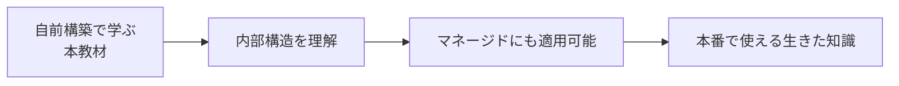

---

## 9. Kubernetes リリースサイクル

教材で扱うバージョンを決めるために、リリースサイクルを押さえておきましょう。

### 9-1. リリース頻度

- マイナーバージョン: **約4ヶ月ごと** (年3回)
- パッチバージョン: マイナー内で随時

### 9-2. サポート期間

各マイナーバージョンは:

- 1年間の通常サポート + 2ヶ月のメンテナンス + 4ヶ月の追加サポート ≒ **約14ヶ月**

つまり、本番運用するなら **半年〜1年に1回はマイナーアップグレード** が必要。

### 9-3. 本教材で使うバージョン

本教材は **v1.30** を基準としています(2024年4月リリース)。

```bash
kubeadm version
# kubeadm version: &version.Info{Major:"1", Minor:"30", ...}
```

新しいバージョンが出ても、本教材の内容の95%以上はそのまま通用します(Kubernetesの基本設計は安定的)。
マイナーバージョン差で消える/変わる API は、第7章の **アップグレード** 節で扱います。

---

## 10. このページのまとめと次へ

### 10-1. 学んだこと

- Kubernetes は **コンテナの群れを統治する** プラットフォーム
- 物理 → VM → Docker → Kubernetes と **抽象化のレイヤー** が進化してきた経緯
- 中心思想は **宣言型構成 + コントロールループ + APIファースト**
- 6つの壁(死、変動、デプロイ、設定、通信、永続)をまとめて解決
- 「やってくれないこと」も多く、周辺ツールとの組み合わせで運用基盤を作る
- マネージドと自前構築の違い、本教材は **自前構築で内部理解を重視**

### 10-2. もう少し深く知りたい人への参考リンク

- 公式ドキュメント: <https://kubernetes.io/docs/concepts/overview/>
- Borg 論文: ["Large-scale cluster management at Google with Borg"](https://research.google/pubs/pub43438/)
- Kubernetes 設計者の解説: ["Borg, Omega, and Kubernetes"](https://research.google/pubs/pub44843/)
- 12-Factor App: <https://12factor.net/ja/>
- CNCF Landscape: <https://landscape.cncf.io/>

### 10-3. チェックポイント

このページを読み終えた後、以下を **自分の言葉で** 説明できるか確認してください。
答えに詰まる項目があれば、関連する章へ戻って読み直しましょう。

- [ ] Kubernetes が解決した、Docker だけでは足りなかった6つの壁を全部挙げられる
- [ ] 宣言型と命令型の違いを、料理レシピ以外の例えで説明できる
- [ ] コントロールループとは何か、Pod が落ちたとき何が起きるかを順を追って説明できる
- [ ] Kubernetes と Docker が **競合関係にない** ことを、レイヤー図を描いて説明できる
- [ ] dockershim が削除されても、Docker でビルドしたイメージは使えると言える
- [ ] マネージドと自前構築の違いを5つ以上挙げられる
- [ ] Kubernetes が **やってくれないこと** を5つ以上挙げられる
- [ ] etcd が3台必要な理由を「クォーラム」という言葉を使って説明できる

すべてチェックできたら、次に進みましょう。

→ [VM・Docker・Kubernetes (詳細比較)]({{ '/01-introduction/vm-docker-k8s/' | relative_url }})
