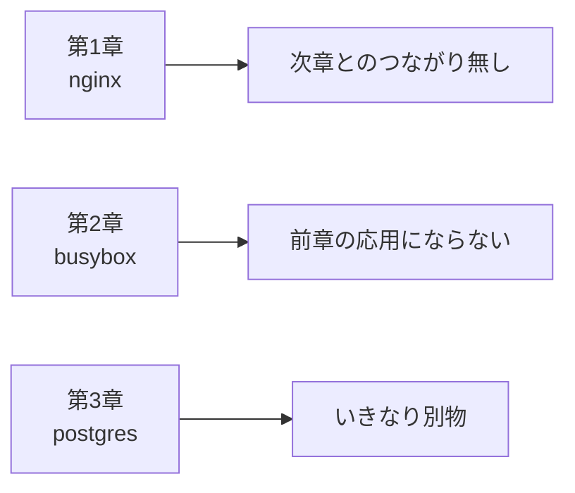
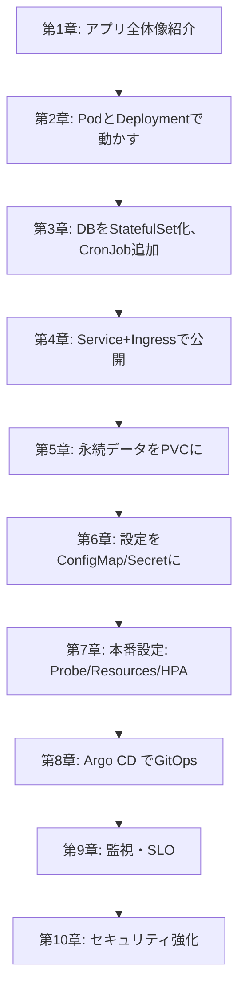
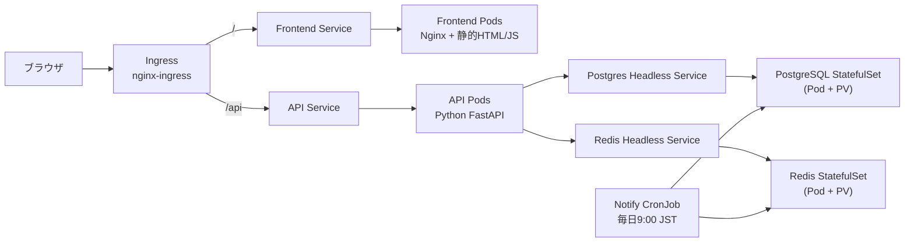
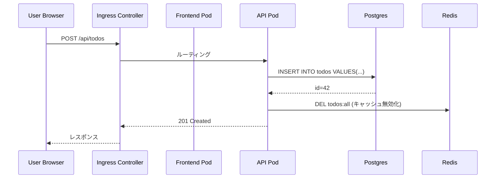

# サンプルアプリ「ミニTODO」
{: .no_toc }

## 目次
{: .no_toc .text-delta }

1. TOC
{:toc}

---

## このページのゴール

教材を通じて使う **サンプルアプリの全体像** を把握します。

このページを読み終えると、以下を理解できます。

- なぜ「サンプルアプリ」を1つに固定して全章で使い回すのか(設計判断の根拠)
- ミニTODOの構成、各コンポーネントの役割
- 章を通じてどう段階的に拡張するか
- このアプリで学べる Kubernetes 機能のカバー範囲
- なぜ Python (FastAPI) + PostgreSQL を選んだか(技術選定の根拠)

---

## 1. なぜサンプルアプリを1つに固定するか

### 1-1. 章ごとに違うサンプルだと起きる問題

多くの Kubernetes 入門書・教材では、章ごとに違うアプリ(nginx, redis, mariadb...)を使います。
これには問題があります。



問題点:

- 各章の内容が **断片的** で、現実のアプリ運用との距離が遠い
- 「Pod を立てる」「Service を作る」が **個別操作** に終わり、統合的な理解にならない
- 「自分のアプリで応用する」イメージが湧きにくい

### 1-2. 1つのアプリを段階的に拡張する利点



- 章を進めるごとに **同じアプリが少しずつ強くなる**
- 「**実際のアプリの育て方**」に近い経験
- 第10章まで進めると **本番運用に耐えるアプリ完成形** が手元に残る

「学んだことが繋がる」感覚は、断片的な教材では得られない強み。

### 1-3. なぜ「TODOアプリ」か

TODOアプリは入門ではありがちな題材ですが、選んだ理由は:

| 要素 | TODO で表現できる Kubernetes 概念 |
|------|----------------------------------|
| Web UI(フロントエンド) | Deployment, Service, Ingress, ConfigMap |
| API(バックエンド) | Probe, Resources, HPA, Secret |
| DB(状態保持) | StatefulSet, PV/PVC, StorageClass |
| キャッシュ | StatefulSet, Headless Service |
| 通知バッチ | CronJob, Job |
| 認証(将来拡張) | Ingress + cert-manager + 認証ミドルウェア |
| 観測 | Prometheus exporter, ログ JSON化 |

**シンプルだが、必要な要素を一通り盛り込める**。教育目的に最適です。

---

## 2. アーキテクチャ

### 2-1. 完成形(第10章時点)



### 2-2. データフロー(典型操作)

「ユーザーが TODO を新規登録するとき」を例に。



各ステップが、Kubernetes のリソースで何をしているかが見えます。

### 2-3. 各コンポーネントの詳細

| コンポーネント | 言語/技術 | 役割 | K8s リソース |
|---------------|-----------|------|--------------|
| **Frontend** | HTML + JS + Nginx | UI 提供、APIへリクエスト送信 | Deployment + Service |
| **API** | Python 3.12 / FastAPI | REST API、ビジネスロジック | Deployment + Service + HPA |
| **DB** | PostgreSQL 16 | データ永続化 | StatefulSet + PVC + Headless Service |
| **Cache/Queue** | Redis 7 | 高速応答キャッシュ、通知ジョブのキュー | StatefulSet + PVC + Headless Service |
| **Worker** | Python 3.12 | 通知バッチ(完了タスクの集計など) | CronJob |
| **Public入口** | NGINX Ingress Controller | L7ルーティング、TLS終端 | Ingress |

---

## 3. なぜこの技術スタックか

### 3-1. Python (FastAPI) を選んだ理由

#### Python の選択肢

API バックエンドに Python を選ぶ Kubernetes 教材は実はあまり多くありません(Go / Node.js が多い)。
教材として Python を選んだ理由:

| 言語 | 選んだ場合の利点 | 教材としての懸念 |
|------|----------------|----------------|
| **Python** (本教材) | 読みやすい、学習者が多い | コンテナイメージがやや大きい |
| Go | 起動速い、本番向け | 文法が初心者には硬い |
| Node.js | フロントとの一体感 | 非同期パターンの理解が前提 |
| Java | 企業に多い | 起動が遅い、メモリ食う |

教材は **読んで理解できる** が最優先なので、Python を採用。

#### FastAPI の選択肢

Pythonのウェブフレームワークの中で:

| フレームワーク | 特徴 |
|---------------|------|
| **FastAPI** (本教材) | 型ヒントベース、OpenAPI自動生成、async対応、軽量 |
| Flask | 老舗、最小、自由度高い |
| Django | フルスタック、管理画面付属、重い |

FastAPI を選んだ理由:

- **型安全**: Pydantic で型定義 → ランタイムエラーを激減
- **OpenAPI (Swagger UI) を自動生成** → API ドキュメントが勝手に出る
- **async**: 非同期I/O対応で、DB待ちの間もリクエスト捌ける
- **モダンな書き方**: `@app.get("/...")` デコレータが直感的

### 3-2. PostgreSQL を選んだ理由

#### DB の選択肢

| DB | 選択時の特徴 |
|----|-------------|
| **PostgreSQL** (本教材) | 機能豊富、SQL標準準拠、JSON対応、運用情報が豊富 |
| MySQL/MariaDB | 普及、軽い | レプリケーション設定がやや独特 |
| MongoDB | スキーマレス | TODO程度のシンプルさには合わない |
| SQLite | 単独DB、軽い | マルチPodでは使えない |

PostgreSQL の選定理由:

- **CloudNativePG** という優れた Operator があり、第12章で紹介
- レプリケーションや WAL バックアップの仕組みが透明
- 教材の StatefulSet ハンズオンに最適

### 3-3. Redis を選んだ理由

「TODOにキャッシュ要る?」と思うかもしれません。
キャッシュは教材として:

- StatefulSet を **DB以外で** も体験する素材
- Headless Service の使い分け体験
- 後の章で キュー(Pub/Sub)としても使える可能性

実用としても、フロント直前で N+1 問題的なリクエストを軽減する効果があります。

---

## 4. ディレクトリ構成

```
sample-app/
├── frontend/                    # 静的Webフロントエンド
│   ├── Dockerfile
│   ├── nginx.conf
│   └── public/
│       └── index.html
│
├── api/                          # FastAPI バックエンド
│   ├── Dockerfile
│   ├── pyproject.toml
│   └── app/
│       ├── __init__.py
│       ├── main.py              # エンドポイント定義
│       ├── db.py                # SQLAlchemy ORM
│       └── models.py            # Pydantic モデル
│
├── worker/                       # 通知バッチ
│   ├── Dockerfile
│   └── notify.py
│
└── k8s/                          # Kubernetesマニフェスト(章ごと)
    ├── 02-basic/                # 第2章: 基本リソースのみ
    │   └── all.yaml
    ├── 03-stateful/             # 第3章: StatefulSet/CronJob/Init
    │   └── all.yaml
    ├── 06-configmap-secret/     # 第6章: ConfigMap/Secret分離
    │   └── all.yaml
    ├── 07-helm/
    │   └── todo-chart/          # 第7章: Helm化
    │       ├── Chart.yaml
    │       ├── values.yaml
    │       └── templates/
    ├── 07-kustomize/            # 第7章: Kustomize化
    │   ├── base/
    │   └── overlays/
    │       ├── dev/
    │       └── prod/
    └── 08-argocd/               # 第8章: Argo CD/Rollout
        ├── root.yaml
        ├── applicationset-todo.yaml
        ├── cluster-tools.yaml
        └── rollout-todo-api.yaml
```

### 4-1. 章ごとに別ディレクトリにする理由

教材の各章で **同じリソースを段階的に進化** させていくため、章のスナップショットを残しておくと:

- 「第3章まで戻ってやり直し」が簡単
- 章ごとの差分を比較学習できる
- 実環境では Git の branch/tag で表現するもの

---

## 5. API 仕様

### 5-1. エンドポイント一覧

| Method | Path | 説明 | 用途 |
|--------|------|------|------|
| `GET` | `/healthz` | Liveness 用ヘルスチェック | アプリ自体の生存確認 |
| `GET` | `/readyz` | Readiness 用 | DB/Redis 到達まで含めた準備完了確認 |
| `GET` | `/metrics` | Prometheus メトリクス | RED指標 |
| `GET` | `/todos` | TODO 一覧 | 取得 |
| `POST` | `/todos` | TODO 作成 | `{"title": "..."}` |
| `PATCH` | `/todos/{id}` | TODO 更新 | `{"done": true}` |
| `DELETE` | `/todos/{id}` | TODO 削除 | |

### 5-2. なぜ `/healthz` と `/readyz` を分けるか

これは **本番運用での超重要ポイント**。第7章 [Probe]({{ '/07-production/probe/' | relative_url }}) で詳しくやりますが、概要だけ:

- **Liveness Probe**: 「アプリ自身が生きているか」 → 失敗すると **コンテナ再起動**
- **Readiness Probe**: 「依存先まで含めて準備できたか」 → 失敗すると **Service から外れる(再起動はしない)**

両方を同じエンドポイントにすると:

```
DB が一時的にダウン
 → /readyz失敗 = /healthz 失敗 (両方同じなら)
 → Liveness判定失敗 → コンテナ再起動
 → 起動してもDBダメ → また再起動
 → CrashLoopBackOff
```

これを **正しく分ける** と:

```
DB が一時的にダウン
 → /readyz失敗 → Serviceから外れる(他のPodに振り分け)
 → /healthz は成功 → コンテナは再起動しない
 → DB復旧 → /readyz 成功 → トラフィック再開
```

サンプルアプリは **正しい設計の見本** として最初からこの分離を実装しています。

### 5-3. Prometheus メトリクスの設計

サンプルアプリは **RED メソッド** に従って3種類のメトリクスを公開しています。

| メトリクス | 種類 | 用途 |
|-----------|------|------|
| `http_requests_total{method,path,code}` | Counter | リクエスト数(R: Rate) |
| `http_requests_total{code=~"5.."}` から計算 | Counter | エラー率(E: Errors) |
| `http_request_duration_seconds{method,path}` | Histogram | レイテンシ(D: Duration) |

第9章 [メトリクス]({{ '/09-observability/metrics/' | relative_url }}) で Prometheus と組み合わせます。

---

## 6. 章ごとの拡張ステップ詳細

### 6-1. 章を通じた進化の全体像

```mermaid
gantt
    title サンプルアプリの章ごとの進化
    dateFormat X
    axisFormat %s
    
    section 第2章
    基本構成: 0, 2
    section 第3章
    StatefulSet/CronJob: 2, 3
    section 第4章
    Service+Ingress: 3, 4
    section 第5章
    PV/PVC: 4, 5
    section 第6章
    ConfigMap/Secret: 5, 6
    section 第7章
    Probe/HPA/Helm: 6, 7
    section 第8章
    GitOps/Canary: 7, 8
    section 第9章
    監視/SLO: 8, 9
    section 第10章
    セキュリティ: 9, 10
```



### 6-2. 各章での具体的な変化

#### 第2章: 動かしてみる

```yaml
# 最小限: Pod + Service だけ
apiVersion: apps/v1
kind: Deployment
metadata:
  name: todo-api
spec:
  replicas: 2
  selector:
    matchLabels:
      app.kubernetes.io/name: todo-api
  template:
    spec:
      containers:
      - name: api
        image: 192.168.56.10:5000/todo-api:0.1.0
        env:
        - name: DB_PASSWORD
          value: changeme    # ← ここがまずい (6章で改善)
```

ポイント:
- まだ機密が平文
- 永続化なし(再起動でデータ消える)
- Probe無し
- **動いたら勝ち** の最小構成

#### 第3章: ステートを正しく扱う

DB を Deployment から StatefulSet へ昇格:

```yaml
# Postgres を StatefulSet 化
apiVersion: apps/v1
kind: StatefulSet
metadata:
  name: postgres
spec:
  serviceName: postgres
  replicas: 1
  template:
    spec:
      containers:
      - name: postgres
        image: postgres:16
        volumeMounts:
        - name: data
          mountPath: /var/lib/postgresql/data
  volumeClaimTemplates:
  - metadata:
      name: data
    spec:
      accessModes: [ReadWriteOnce]
      resources:
        requests:
          storage: 5Gi
```

通知 CronJob も追加:

```yaml
apiVersion: batch/v1
kind: CronJob
metadata:
  name: todo-notify
spec:
  schedule: "0 9 * * *"
  jobTemplate:
    spec:
      template:
        spec:
          restartPolicy: OnFailure
          containers:
          - name: notify
            image: 192.168.56.10:5000/todo-worker:0.1.0
```

#### 第4章: 公開と隔離

Ingress で外部公開:

```yaml
apiVersion: networking.k8s.io/v1
kind: Ingress
metadata:
  name: todo
spec:
  ingressClassName: nginx
  rules:
  - host: todo.local
    http:
      paths:
      - path: /api
        pathType: Prefix
        backend:
          service:
            name: todo-api
            port: {number: 80}
      - path: /
        pathType: Prefix
        backend:
          service:
            name: todo-frontend
            port: {number: 80}
```

NetworkPolicy で内部通信制限:

```yaml
apiVersion: networking.k8s.io/v1
kind: NetworkPolicy
metadata:
  name: postgres-allow-from-api-only
spec:
  podSelector:
    matchLabels:
      app.kubernetes.io/name: postgres
  ingress:
  - from:
    - podSelector:
        matchLabels:
          app.kubernetes.io/name: todo-api
    ports:
    - port: 5432
```

「フロントエンドから直接DBに繋がる事故」を構造的に防ぐ。

#### 第6章: 設定の分離

ConfigMap と Secret に分離:

```yaml
apiVersion: v1
kind: ConfigMap
metadata:
  name: todo-config
data:
  LOG_LEVEL: info
  DB_HOST: postgres
  DB_PORT: "5432"
---
apiVersion: v1
kind: Secret
metadata:
  name: todo-secret
type: Opaque
stringData:
  DB_PASSWORD: changeme    # 第10章でVault連携に進化
```

Pod は `envFrom` で読む:

```yaml
spec:
  containers:
  - name: api
    envFrom:
    - configMapRef: {name: todo-config}
    - secretRef:    {name: todo-secret}
```

#### 第7章: 本番化(最大の変化)

```yaml
spec:
  containers:
  - name: api
    image: 192.168.56.10:5000/todo-api:0.1.0
    
    # Probe 適切に設定
    startupProbe:
      httpGet: {path: /healthz, port: 8000}
      failureThreshold: 30
    readinessProbe:
      httpGet: {path: /readyz, port: 8000}
    livenessProbe:
      httpGet: {path: /healthz, port: 8000}
    
    # リソース管理
    resources:
      requests: {cpu: 100m, memory: 128Mi}
      limits:   {memory: 256Mi}
```

PodDisruptionBudget も追加:

```yaml
apiVersion: policy/v1
kind: PodDisruptionBudget
metadata:
  name: todo-api
spec:
  minAvailable: 2    # ノードdrain時も最低2個維持
```

HPA で自動スケール:

```yaml
apiVersion: autoscaling/v2
kind: HorizontalPodAutoscaler
metadata:
  name: todo-api
spec:
  minReplicas: 3
  maxReplicas: 10
  metrics:
  - type: Resource
    resource:
      name: cpu
      target:
        averageUtilization: 70
```

ここまで来ると、ようやく **本番運用に耐える** 構成。

#### 第8章: GitOps

Argo CD でデプロイを自動化:

```yaml
apiVersion: argoproj.io/v1alpha1
kind: Application
metadata:
  name: todo-prod
spec:
  source:
    repoURL: https://github.com/<USER>/todo-manifests
    path: overlays/prod
  destination:
    server: https://kubernetes.default.svc
    namespace: todo-prod
  syncPolicy:
    automated:
      prune: true
      selfHeal: true
```

これで「Git にマージ → 本番反映」が完成。

#### 第9章: 監視

```yaml
apiVersion: monitoring.coreos.com/v1
kind: ServiceMonitor
metadata:
  name: todo-api
spec:
  selector:
    matchLabels:
      app.kubernetes.io/name: todo-api
  endpoints:
  - port: http
    path: /metrics
```

SLO も定義:

```yaml
apiVersion: monitoring.coreos.com/v1
kind: PrometheusRule
metadata:
  name: todo-api-slo
spec:
  groups:
  - name: slo
    rules:
    - alert: TodoApiHighErrorRate
      expr: |
        sum(rate(http_requests_total{job="todo-api",code=~"5.."}[5m]))
        / sum(rate(http_requests_total{job="todo-api"}[5m]))
        > 0.001
      for: 5m
```

#### 第10章: セキュリティ強化

- ServiceAccountを最小権限で
- Pod Security Standards を `restricted` 適用
- Trivy でイメージスキャン
- Secret を External Secrets Operator + Vault 連携

第10章まで進むと、教材を通じて作ったアプリが **本番デプロイ可能なレベル** に達します。

---

## 7. ローカルでビルド・実行する基本

### 7-1. Docker でビルド

```bash
cd sample-app/api
docker build -t todo-api:dev .
```

### 7-2. Minikube クラスタで動かす

#### A. ローカルレジストリを使わない (Minikube内Docker利用)

```bash
# Minikube 内の Docker デーモンを使うように環境設定
eval $(minikube docker-env)         # Linux/Mac
minikube docker-env | Invoke-Expression  # PowerShell

# その状態でビルド (Minikube内に直接保存される)
cd sample-app/api
docker build -t todo-api:dev .

# Pod の image: todo-api:dev / imagePullPolicy: Never で動く
```

これは Minikube ハンズオン用の手軽な方法。

#### B. ローカルレジストリ経由(本格構築用)

```bash
# 第7章で立てるローカルレジストリへ
docker build -t 192.168.56.10:5000/todo-api:0.1.0 .
docker push 192.168.56.10:5000/todo-api:0.1.0

# Pod の image: 192.168.56.10:5000/todo-api:0.1.0 で動く
```

---

## 8. このページのまとめと次へ

### 8-1. 学んだこと

- 全章で **同じアプリを段階的に拡張** する設計の意義
- ミニTODOの構成: Frontend(Nginx) + API(FastAPI) + DB(Postgres) + Cache(Redis) + 通知(Worker)
- 各技術選定の根拠
- API 設計のポイント(`/healthz` と `/readyz` の分離)
- 章ごとの拡張ステップの全体像

### 8-2. チェックポイント

- [ ] アプリの全体像と各コンポーネントが何をするか説明できる
- [ ] どの章で何が追加されるか流れがイメージできる
- [ ] `/healthz` と `/readyz` を分ける理由を Probe の挙動から説明できる
- [ ] Python+FastAPI を選んだ理由を3つ挙げられる
- [ ] このアプリで体験する Kubernetes 機能を5つ以上列挙できる

### 8-3. 次に進む

→ [Hello Kubernetes!]({{ '/01-introduction/hello-k8s/' | relative_url }}) で実際に Pod を立ち上げてみます。
