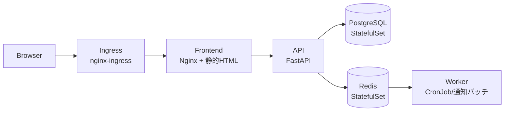

# サンプルアプリ「ミニTODO」
{: .no_toc }

## 目次
{: .no_toc .text-delta }

1. TOC
{:toc}

---

本教材では、章を通じて1つのアプリを段階的に拡張していきます。
題材は **ミニTODOサービス** ─ シンプルだが、本番運用で使う K8s 機能を一通り当てられる規模感です。

## アーキテクチャ(最終形)



| コンポーネント | 技術 | K8sリソース |
|---|---|---|
| Frontend | Nginx + 静的HTML/JS | Deployment + Service |
| API | Python (FastAPI) | Deployment + Service + HPA |
| DB | PostgreSQL 16 | StatefulSet + PV/PVC + Headless Service |
| Cache/Queue | Redis 7 | StatefulSet + Headless Service |
| Worker | Pythonバッチ | CronJob |
| 公開 | Ingress (NGINX Ingress) | Ingress |
| 設定 | 環境変数 | ConfigMap + Secret |
| 監視 | Prometheus exporters | ServiceMonitor |

## 教材における拡張ステップ

各章で次のように段階的に肉付けしていきます。

| 章 | やること |
|----|---|
| 02 | Frontend を Pod / Deployment で動かす |
| 03 | DB を StatefulSet に、通知 CronJob を追加 |
| 04 | Service と Ingress で外部公開、NetworkPolicy で内部制限 |
| 05 | DB の永続化を PV/PVC に、StorageClass で動的プロビジョニング |
| 06 | 設定値を ConfigMap、DBパスワードを Secret に分離 |
| 07 | Probe / リソース制限 / HPA / PodDisruptionBudget、Helm化、Kustomize化 |
| 08 | GitHub Actions でビルド → Argo CD で GitOps デプロイ、カナリアリリース |
| 09 | Prometheus でメトリクス、Loki でログ、OpenTelemetry でトレース、SLO 設定 |
| 10 | RBAC、Pod Security Standards、Trivy でイメージスキャン、External Secrets |
| 11 | 障害注入と対応、ポストモーテム、DR、クラスタアップグレード |

## ディレクトリ構成

リポジトリの `sample-app/` 以下に置きます。

```
sample-app/
├── frontend/
│   ├── Dockerfile
│   ├── nginx.conf
│   └── public/
│       └── index.html
├── api/
│   ├── Dockerfile
│   ├── pyproject.toml
│   └── app/
│       ├── main.py
│       ├── db.py
│       └── models.py
├── worker/
│   ├── Dockerfile
│   └── notify.py
└── k8s/                   # マニフェスト一式 (章ごとにバリエーションあり)
    ├── 02-basic/
    ├── 03-stateful/
    ├── 06-configmap-secret/
    ├── 07-helm/
    │   └── todo-chart/
    ├── 07-kustomize/
    │   ├── base/
    │   └── overlays/
    └── 08-argocd/
```

## ローカルでのビルドと実行

```bash
cd sample-app/api
docker build -t 192.168.56.10:5000/todo-api:0.1.0 .
docker push 192.168.56.10:5000/todo-api:0.1.0

cd ../frontend
docker build -t 192.168.56.10:5000/todo-frontend:0.1.0 .
docker push 192.168.56.10:5000/todo-frontend:0.1.0
```

Minikube 環境では、Minikube 内の Docker デーモンを使うと push なしで使えます。

```bash
eval $(minikube docker-env)
docker build -t todo-api:0.1.0 .
# Pod の image: todo-api:0.1.0 / imagePullPolicy: Never で動く
```

{: .tip }
小さなアプリですが、章を通じて **同じアプリが少しずつ強くなっていく** 体験は、K8sの理解を直感的にしてくれます。
1つ作って動かしてみる、を必ずやりながら進めてください。

## チェックポイント

- [ ] アプリの全体像と各コンポーネントが何をするのか言える
- [ ] どの章で何が追加されるのか流れがイメージできる
- [ ] サンプルアプリのソースを clone してビルドできる
