# 学習環境の準備 ② kubeadm/VMware編 概要
{: .no_toc }

## 目次
{: .no_toc .text-delta }

1. TOC
{:toc}

---

## このページのゴール

第7章以降の本格運用ハンズオンで使う、**VMware Workstation 上の HA 構成 Kubernetes クラスタ** の全体像を理解します。

このページは「**何を作るか**」の概要設計ドキュメントです。
具体的なコマンド・手順は [第7章 kubeadmで自前クラスタ構築 (HA・完全手順)]({{ '/07-production/kubeadm/' | relative_url }}) で扱います。

このページを読み終えると、以下を説明できるようになります。

- なぜ Minikube だけでは本番運用相当の学習に不足するのか
- HA (High Availability) 構成とは何で、なぜそれが必要か
- 7台VMの各役割と相互作用
- ネットワーク・ストレージの全体設計
- 第7章の手順で何をすることになるか

{: .note }
本ページは **読み物** です。第6章まで Minikube で進めてから、第7章で本格構築に着手する流れがおすすめです。

---

## 1. なぜ Minikube ではダメなのか

第6章までの内容は Minikube で十分カバーできます。
しかし第7章以降で扱う **本番運用** の概念には、Minikube では体験できないものがあります。

### 1-1. Minikube の限界

| 観点 | Minikube | 本格構成 |
|------|----------|----------|
| ノード数 | 1 (またはマルチノードでも仮想ネット上の擬似) | 7(マスター3+ワーカー3+LB1+NFS1) |
| Control Plane の冗長 | ✗ (1台のみ) | ◯ (3台で HA) |
| ノード障害シミュレーション | △(stopコマンド程度) | ◯(VMの強制停止で本物相当) |
| etcd | 単一インスタンス | 3ノードクォーラム |
| ネットワーク分離テスト | 限定的 | NetworkPolicyの動作を本格的に検証可能 |
| LoadBalancer Service | tunnel経由で擬似的 | MetalLB で本物相当 |
| ノードの差別化 | 困難 (全ノード同一) | nodeSelector/Taint で実用的に分離 |
| 永続ストレージ | 単一ホストのpath | NFS / 分散ストレージ |
| アップグレード手順の体験 | 完全な再構築のみ | 1台ずつローリング体験 |
| 本番に近い経験度 | 30% | 90% |

### 1-2. 学べないことの具体例

#### 例1: PodDisruptionBudget の動作

「同時に何個まで Pod が落ちてOKか」を宣言する PDB は、複数ノードの drain で初めて意味を持ちます。

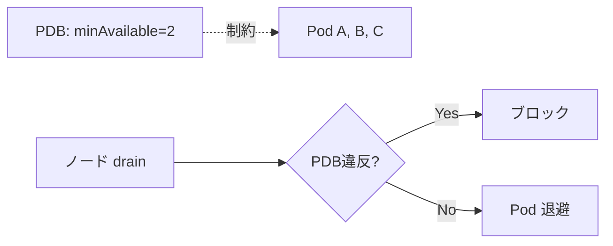

Minikube では1ノードしかないので、ノードを drain する経験ができません。

#### 例2: etcd フェイルオーバー

3台etcdの1台を落としても、残り2台でクォーラムが維持されてクラスタが動き続ける ─ これは1台etcdでは絶対に体験できません。

#### 例3: クラスタアップグレード

本番クラスタを Kubernetes v1.30 → v1.31 に上げる時、

```
cp1 (v1.30) ─ cp2 (v1.30) ─ cp3 (v1.30) ─ w1, w2, w3
   ↓ 1台ずつ
cp1 (v1.31) ─ cp2 (v1.30) ─ cp3 (v1.30) ─ w1, w2, w3
   ↓
cp1 (v1.31) ─ cp2 (v1.31) ─ cp3 (v1.30) ─ w1, w2, w3
   ...
```

このローリングアップグレードを体験するには複数ノードが必須。

#### 例4: 災害復旧 (DR)

etcd スナップショットからのリストアを実機で試すには、本物の3台etcd構成が必要です。

---

## 2. HA (High Availability) 構成とは

「**1台が落ちても、サービス全体は動き続ける**」ように冗長化された構成のこと。

### 2-1. シングルポイント・オブ・フェイラー (SPOF) の排除

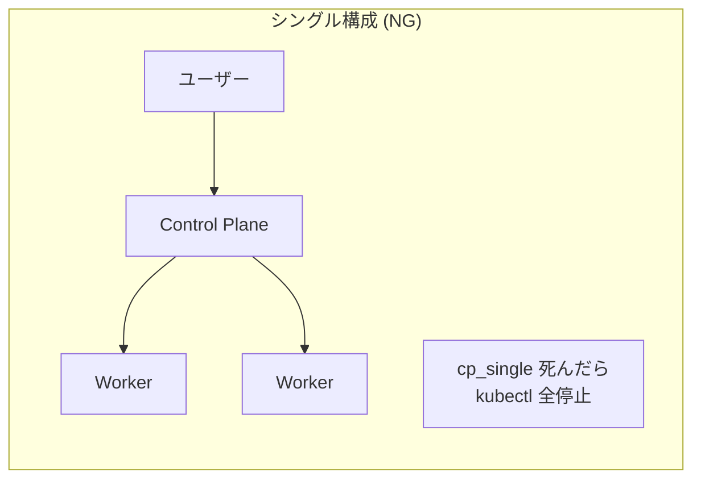

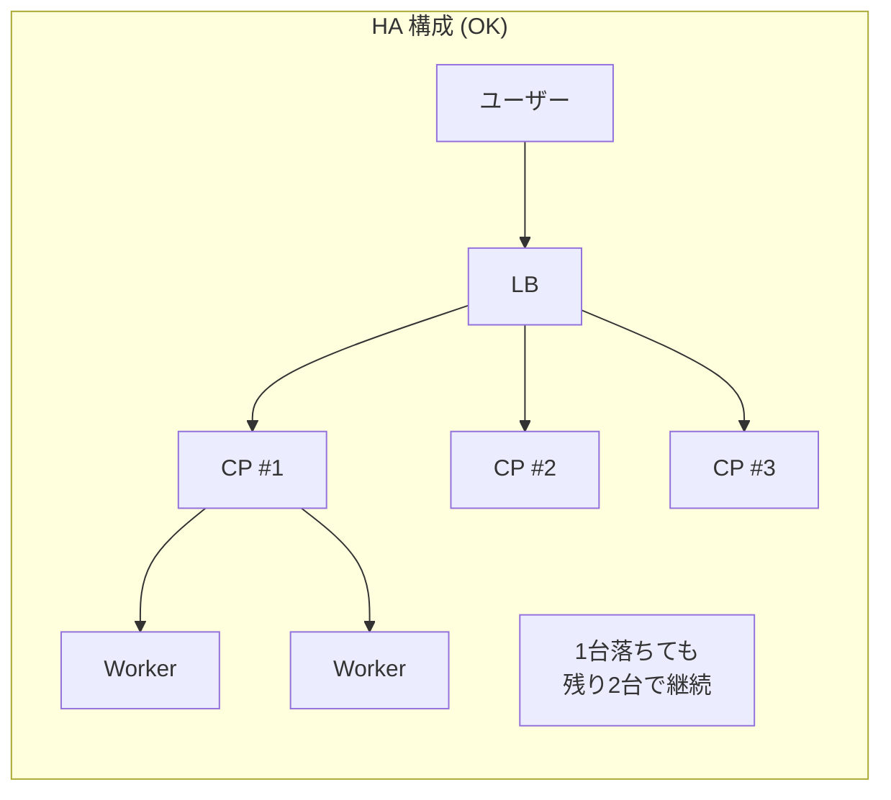

### 2-2. HA で守るべきもの

Kubernetes クラスタには複数の重要なコンポーネントがあり、それぞれ冗長化方式が違います。

| コンポーネント | 冗長化方式 | 何台必要 |
|---------------|----------|---------|
| **kube-apiserver** | 全台アクティブ、LBで分散 | 2台以上(本教材は3台) |
| **etcd** | クォーラム(過半数で書込) | 3台または5台(必ず奇数) |
| **kube-controller-manager** | リーダー選出(1台アクティブ、他はスタンバイ) | 2台以上 |
| **kube-scheduler** | リーダー選出 | 2台以上 |
| **kubelet (Worker)** | 全台アクティブ | 障害許容数+1 |

### 2-3. なぜ etcd は3台または5台か (奇数)

etcd は **Raft合意アルゴリズム** で動きます。

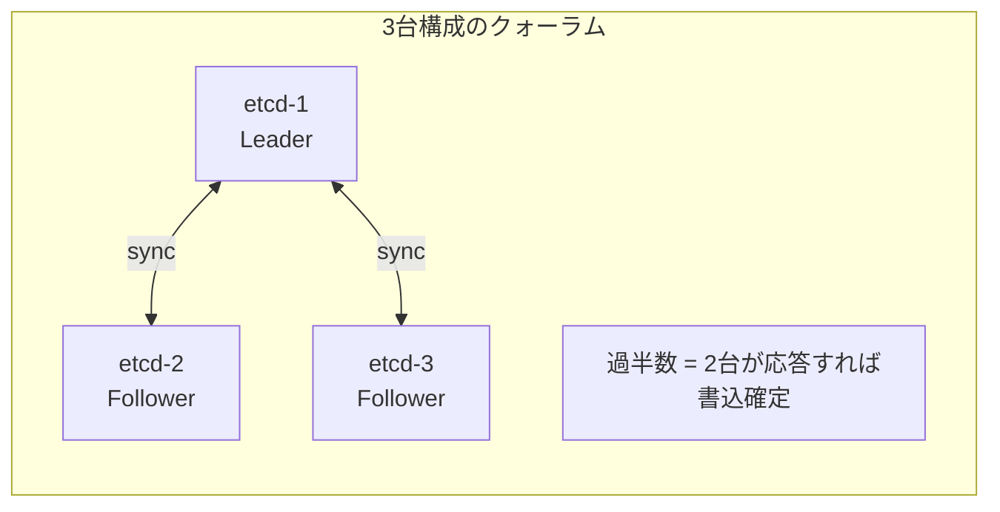

**書き込みには過半数の合意が必要**:

| 構成台数 | 書き込み合意必要数 | 許容できる障害台数 |
|---------|-------------------|-------------------|
| 1台 | 1 | 0 (= HAでない) |
| 2台 | 2 | 0 (1台落ちると書けない、HAにならない) |
| 3台 | 2 | 1 |
| 4台 | 3 | 1 (3台と同じ! コスパ悪) |
| 5台 | 3 | 2 |
| 6台 | 4 | 2 (5台と同じ! コスパ悪) |
| 7台 | 4 | 3 |

**奇数推奨** の理由は、偶数だと「**1台多い分のコスト効果が無い**」から。

本教材では学習用に3台。本番でクリティカルなクラスタは5台、ハイパースケールは7台もあり。

### 2-4. ロードバランサ (HAProxy + keepalived) の役割

#### kubectl はどの apiserver に繋がるか

シングル構成なら `https://192.168.56.11:6443` のように特定IPで指定。
でも HA 構成だと、どれが落ちているか分からない。

そこで **VIP (Virtual IP)** という仮想的な代表IP を使います。

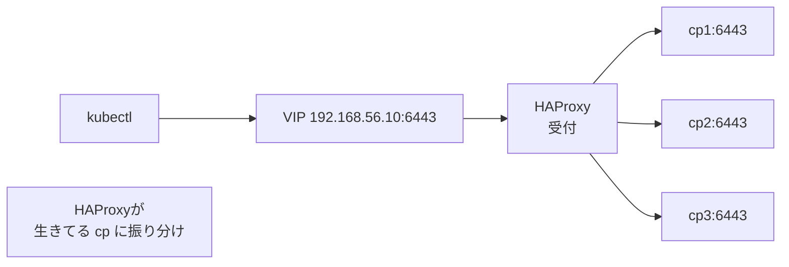

| 役割 | コンポーネント |
|------|----------------|
| VIP の保持 | keepalived (本教材ではホスト固定IPで代替) |
| TCP の振り分け | HAProxy |
| 動作チェック | HAProxy の health check |

LB自体の冗長化(LBが落ちたら?)も考えると、本格本番では LB も2台以上で keepalived の VRRPによる切替を入れます。
本教材では学習用に1台で進めます。

---

## 3. 全体構成図

実際に作るクラスタの全体像です。

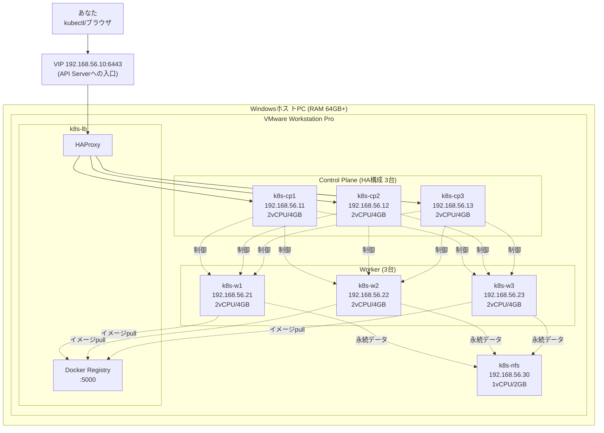

### 3-1. リソース総量

| 項目 | 量 |
|------|-----|
| VM 台数 | 8 (LB1+CP3+W3+NFS1) |
| 合計 vCPU | 12 (オーバーコミット可、物理4コアでも動作) |
| 合計 RAM | 27 GB |
| 合計 Disk | 約 250 GB (シンプロビジョニングで実消費は半分以下) |

ホスト PC が 64GB あれば動きます。128GB あれば全く問題なく余裕。

### 3-2. オーバーコミットについて

ホスト PC のCPUコアより多くの vCPU を割り当てても動きます(オーバーコミット)。
学習用なら通常のコア数の 2〜3倍まで割り当てて問題ありません。

ただしすべてのVMが同時に100%CPU使用すると、ホスト全体がフリーズリスクがあるので、**本格負荷テストには不向き** です。

---

## 4. 各VMの役割を詳しく

### 4-1. k8s-lb (LoadBalancer + Registry)

#### 担当する役割

1. **HAProxy**: 3台の Control Plane への TCP ロードバランサ
2. **Docker Registry**: コンテナイメージ置き場 (`192.168.56.10:5000`)

#### なぜ Registry も同居させるか

教材ではビルドしたコンテナイメージを各ノードから pull する必要があります。
クラウドにイメージを置いてもいいですが:

- 通信料がかかる(ビルド毎にPush・nodeごとにpull)
- ネットの遅延がノード起動を遅らせる
- 「ローカル完結」の方針に反する

社内Wi-Fi環境でも完結させるため、**ローカルにレジストリを立てる** のが本教材の選択。

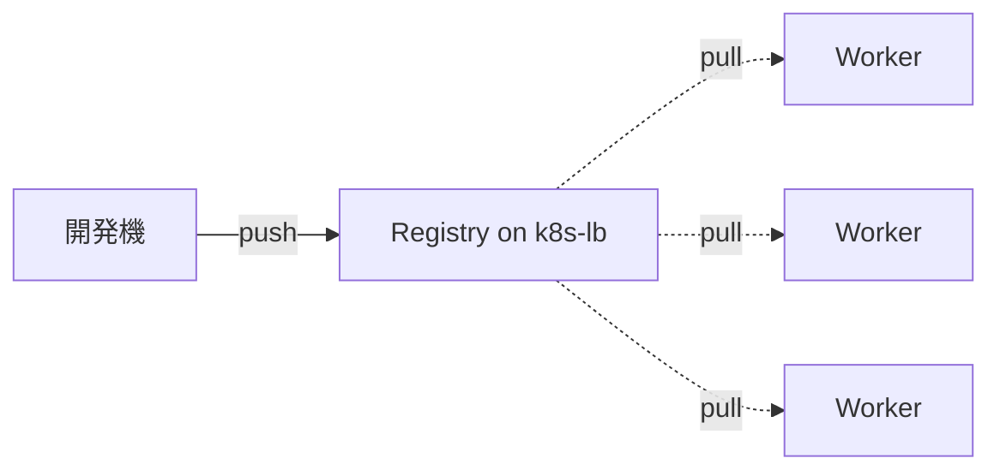

#### 簡易冗長化を妥協

本格的には LB 自体も2台で keepalived 構成にしますが、本教材では k8s-lb は1台です。

理由:
- LB を冗長化すると VM 数が増えてホスト負荷が大きい
- LB が落ちる = `kubectl` が一時使えないだけ(ノード上の Pod は引き続き動く)
- 学習用としては許容できるリスク

本番運用で同様のセットアップを組む場合は、k8s-lb を2台用意して keepalived の VRRP で VIP 切り替えを実装してください。

### 4-2. k8s-cp1, k8s-cp2, k8s-cp3 (Control Plane HA)

#### 各 Control Plane で動くコンポーネント

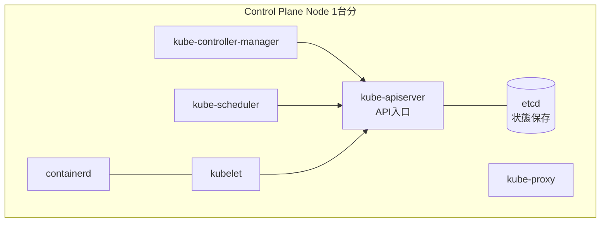

#### 各コンポーネントの動作

| コンポーネント | 動作モード |
|---------------|----------|
| **kube-apiserver** | 全台アクティブ。LB が振り分け |
| **etcd** | 3台クラスタでクォーラム。リーダー選出あり |
| **kube-controller-manager** | リーダー1台のみがアクティブ。他は待機 |
| **kube-scheduler** | リーダー1台のみがアクティブ。他は待機 |

apiserver はステートレスなので全台アクティブ可能。
controller-manager と scheduler は「**1人で決定するべき** 」性質(複数台が同時にPod作成判断したら矛盾)なので、リーダー選出になっています。

#### リーダー選出の仕組み

Kubernetes の Lease オブジェクトで実装。

```bash
kubectl get lease -n kube-system
```

期待される出力(本教材構築後):

```
NAME                                         HOLDER          AGE
kube-controller-manager                      k8s-cp2_xxxxx   5m
kube-scheduler                               k8s-cp1_xxxxx   5m
```

`HOLDER` 欄が現在のリーダー。リーダーが落ちたら自動で次のリーダーが引き継ぐ。

#### Control Plane に Pod は配置すべきか

デフォルトではマスターノードに `node-role.kubernetes.io/control-plane:NoSchedule` Taint が付いていて、ユーザーアプリの Pod は配置されません。

ただ、リソースが余っているなら Toleration を入れて Pod を許可することもできます(本教材では学習用にデフォルトのまま)。

### 4-3. k8s-w1, k8s-w2, k8s-w3 (Worker)

#### Worker で動くコンポーネント

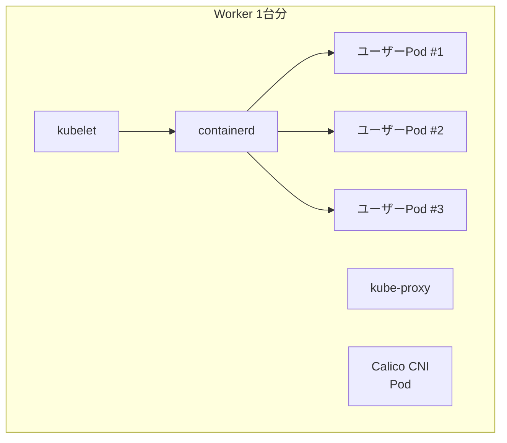

#### なぜ3台か

| 観点 | 必要性 |
|------|--------|
| podAntiAffinity の検証 | Pod を別ノードに分散させて HA 検証するには複数ノード |
| ノード障害シミュ | 1台落としても残り2台で動くことを確認 |
| 教材ハンズオン | カーネルアップデートのローリング更新を体験 |

3台あれば、**1台drainして残り2台で動く** という基本パターンが体験できます。
4台目以降は学習効果がそれほど増えません(3台と本質は変わらない)。

### 4-4. k8s-nfs (NFS サーバ)

#### 役割

Pod の永続データ用 NFS サーバ。
PostgreSQL や Redis のデータを置きます。

#### なぜ NFS か

オンプレで複数ノードからアクセスできる共有ストレージとして:

| 選択肢 | 利点 | 欠点 |
|--------|------|------|
| **NFS** | 設定が簡単、Linuxで標準 | 性能はそれなり |
| **iSCSI** | ブロックレベル、高速 | 単一ノード接続(RWO限定) |
| **Ceph** | 分散・高可用、本物の本番ストレージ | 構築が複雑 |
| **MinIO** | S3互換オブジェクト | ブロック/ファイル用途には不向き |
| **local-path** | 単一ノード固定、最速 | Pod が別ノードに移ると消える |

学習用には NFS が **手軽さと現実性のバランスがベスト**。
本番では Ceph や商用ストレージ、クラウドなら EFS/EBS 等を検討します。

#### NFS の弱点を理解しておく

NFS はファイルロックや権限の挙動が、ローカルファイルシステムと微妙に違います。
- 一部のDBでは推奨されないことがある(PostgreSQL は OK だが MySQL は調査要)
- Pod の `fsGroup` 指定との相性問題
- ロックエラー(`flock`)が起きやすい

商用本番では Ceph や CSI 対応の高機能ストレージを使うのが一般的。
本教材は学習用と割り切って NFS を使います。

---

## 5. ネットワーク設計

### 5-1. VMware Workstation の Host-only ネットワーク

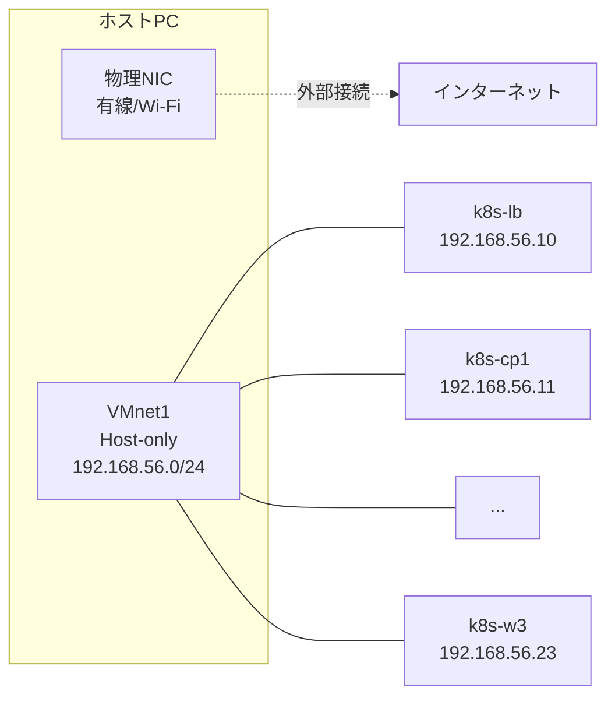

#### ネットワークタイプの選択

VMware Workstation では3種類のネットワーク:

| タイプ | 説明 | 用途 |
|--------|------|------|
| **Bridged** | 物理NICに直結、外部から見える | 本物の社内サーバ感 |
| **NAT** | ホスト経由で外部出るがVM同士は通信不可 | 単独VMのインターネット利用 |
| **Host-only** | ホストとVMのみが通信可能 | 教育用、外部隔離 |

本教材は **Host-only** を採用。理由:

- ホストPCの実IPと干渉しない(社内DHCPの影響受けない)
- 外部から見えないので安全(セキュリティ・誤公開の懸念なし)
- IPアドレスを自分で固定できる

ただし VM からインターネットに出るには別途 NAT セカンダリNIC が必要。
本教材では Ubuntu のセットアップ時に `ens33` を Host-only、`ens34` を NAT で持たせる構成にします(7章で詳述)。

### 5-2. Pod ネットワーク (Calico CNI)

Pod 自体は別の IP を持ちます。
Calico は **VXLAN** または **IP-in-IP** のトンネル方式で、ノードを跨いだ Pod 通信を実現します。

```mermaid
flowchart LR
    subgraph w1["k8s-w1<br>192.168.56.21"]
        p1["Pod A<br>10.244.1.5"]
    end
    subgraph w2["k8s-w2<br>192.168.56.22"]
        p2["Pod B<br>10.244.2.7"]
    end
    p1 -.|VXLANカプセル化| w1
    w1 -.通常IP通信.- w2
    w2 -.|VXLANデカプセル化| p2
```

CIDR の使い分け:

| ネットワーク | CIDR | 用途 |
|-------------|------|------|
| ノードネットワーク | 192.168.56.0/24 | VM同士の通信 |
| Podネットワーク | 10.244.0.0/16 | Pod 同士の通信 |
| Serviceネットワーク | 10.96.0.0/12 (デフォルト) | Service の ClusterIP |

これらは互いに重ならない範囲を選びます。教材では上記の通り。

### 5-3. MetalLB (LoadBalancer Service用)

オンプレでは標準で LoadBalancer Service が機能しません(クラウドベンダの API が無いから)。
**MetalLB** がその代わりを務めます。

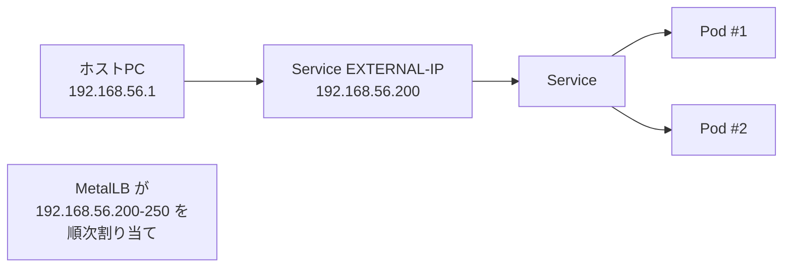

MetalLB の動作モード:

| モード | 説明 | 適用シーン |
|--------|------|----------|
| **L2 (本教材採用)** | ARP応答で代替 | 単一ネットワーク・小規模 |
| **BGP** | ルーターと BGP 合意 | 大規模・複数ネットワーク |

教材では IP プールを `192.168.56.200-250` で確保。

---

## 6. ストレージ設計

### 6-1. 全体図

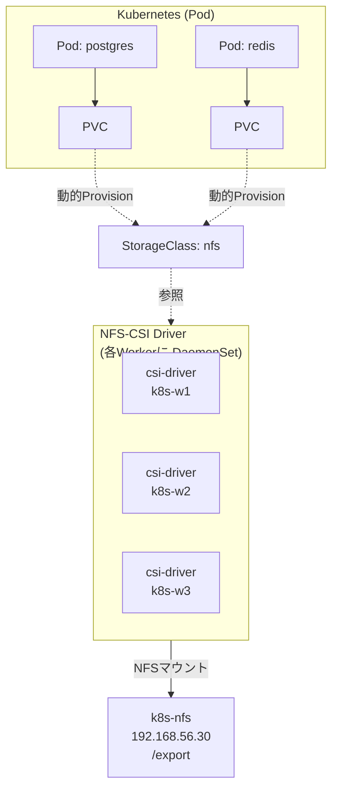

### 6-2. なぜ NFS-CSI を使うか

CSI = **Container Storage Interface**。Kubernetes 標準のストレージプラグイン仕組み。

`nfs.csi.k8s.io` ドライバは:
- StorageClass で動的に PV を作る
- Pod から PVC でマウント
- ボリューム拡張も可能

**これが無いとき**は、NFS の path を `hostPath` でマウントするしか方法がなく、可搬性も自動化もできません。

### 6-3. デフォルト StorageClass

```yaml
apiVersion: storage.k8s.io/v1
kind: StorageClass
metadata:
  name: nfs
  annotations:
    storageclass.kubernetes.io/is-default-class: "true"   # ← デフォルト指定
provisioner: nfs.csi.k8s.io
parameters:
  server: 192.168.56.30
  share: /export
reclaimPolicy: Retain
volumeBindingMode: Immediate
allowVolumeExpansion: true
```

ポイント:

- `is-default-class: "true"`: PVC が `storageClassName` 省略すると自動でこれが使われる
- `reclaimPolicy: Retain`: PVC削除しても PV と実データは残る(誤削除防止)
- `allowVolumeExpansion: true`: 容量を後から増やせる

---

## 7. 構築の全体フロー

第7章で実行する 14 のステップを俯瞰します。

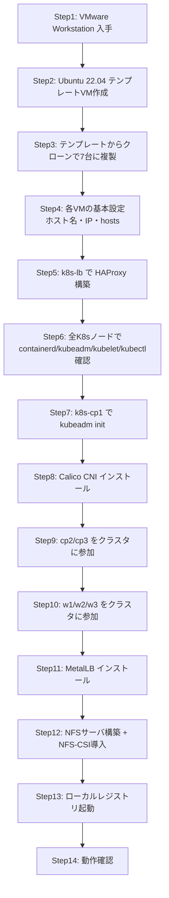

各ステップの所要時間目安(初回):

| Step | 所要時間 |
|------|---------|
| 1 | 30分 |
| 2 | 1〜2時間 |
| 3 | 30分 |
| 4 | 1時間 |
| 5 | 30分 |
| 6 | 確認のみ・10分 |
| 7 | 30分(失敗してリトライしがち) |
| 8 | 30分 |
| 9 | 30分 |
| 10 | 30分 |
| 11 | 30分 |
| 12 | 1時間 |
| 13 | 30分 |
| 14 | 30分 |

合計 8〜16 時間(初回・トラブル含む)。
慣れれば全工程を **2〜3時間で再構築** できるようになります。

---

## 8. 必要なソフトウェア

事前に準備しておくもの:

### 8-1. VMware Workstation Pro 17 以降

- 公式サイト: <https://www.vmware.com/products/workstation-pro.html>
- 30日試用版あり、それ以降は購入が必要(個人ライセンス あり)
- VMware Workstation Player は機能制限が多いので **Pro 推奨**

### 8-2. Ubuntu 22.04 LTS Server

- ダウンロード: <https://ubuntu.com/download/server>
- ISO ファイル(約 1.5GB)
- LTS (Long Term Support) なので2027年4月までセキュリティアップデートあり

#### なぜ Ubuntu?

| ディストリビューション | 利点 | 欠点 |
|------------------------|------|------|
| **Ubuntu** (本教材) | 情報が多い、apt の使い勝手良い | RHEL系の現場に行くと差を感じる |
| RHEL/CentOS Stream | 大企業の本番でよく使われる | パッケージ管理がやや複雑 |
| Rocky Linux / AlmaLinux | RHEL互換、無料 | コミュニティがUbuntuより小さい |
| Debian | 安定 | 新しいパッケージが入りにくい |

教材としては **情報量・初心者親和性** で Ubuntu 採用。
業務で RHEL系を使うことになっても、概念は同じなのでこの教材の知識で対応可能です。

### 8-3. ホストPCのスペック

- **CPU**: VT-x / AMD-V 対応(2010年以降ならほぼ全部)、できればコア数 4以上
- **RAM**: 64GB(推奨)、最低 32GB
- **ディスク**: NVMe SSD で 250GB以上空き
- **OS**: Windows 10 / 11 Pro 推奨(Hyper-V 等の機能のため)

---

## 9. このページのまとめ

### 9-1. 把握しておくべきこと

- なぜ Minikube だけでは不足するか(本番運用の経験ができない)
- HA構成の意味と etcd 3台の必然性
- 7台VMの各役割
- ネットワーク `192.168.56.0/24` Host-only
- ストレージは NFS-CSI で動的プロビジョニング
- 構築は14ステップで合計8〜16時間

### 9-2. チェックポイント

- [ ] Minikube だけでは学習できないことを 3 つ以上挙げられる
- [ ] HA構成のControl Plane が3台必要な理由を「クォーラム」を使って説明できる
- [ ] 7台VMの構成と各役割をスケッチできる
- [ ] ネットワーク `192.168.56.0/24` 内の各VMのIPを暗記している
- [ ] MetalLB が必要な理由(オンプレでは LoadBalancer Service が標準で動かない)を言える

### 9-3. 進め方の推奨

第6章までは Minikube で進めます。第7章に入る時点で、以下のいずれかを選んでください:

#### A. 第7章の冒頭でこの本格構築に着手

- **メリット**: 第7章以降のすべての章でこの本格クラスタを使える
- **デメリット**: 8〜16時間のセットアップ時間が必要

#### B. しばらく Minikube で第7章前半を進め、後半で構築

- **メリット**: 学習が止まらず進む
- **デメリット**: 一部の章(SRE/DR等)は本格クラスタが必須

#### C. 一気に構築せず、必要な範囲だけ部分構築

- **メリット**: 段階的に組み立てる経験
- **デメリット**: 教材の前提と合わなくなる箇所が出る

**推奨は A** ですが、時間に余裕がない方は B でも OK です。

→ 次は [サンプルアプリ「ミニTODO」]({{ '/01-introduction/sample-app/' | relative_url }}) で、教材を通して使うアプリの全体像を確認します。
