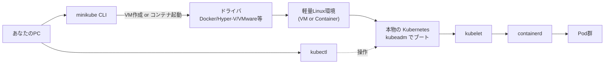
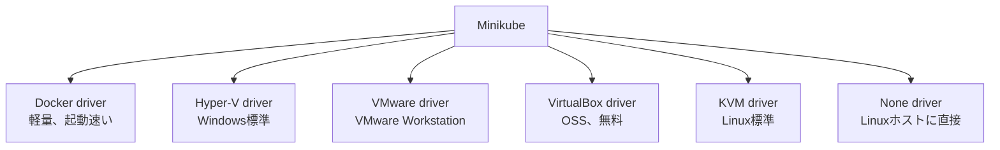
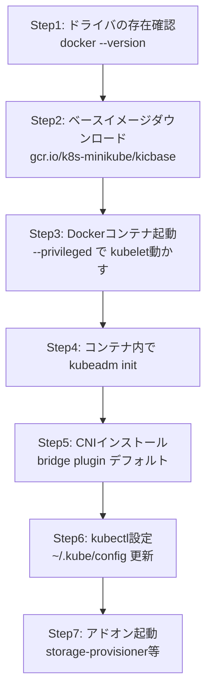
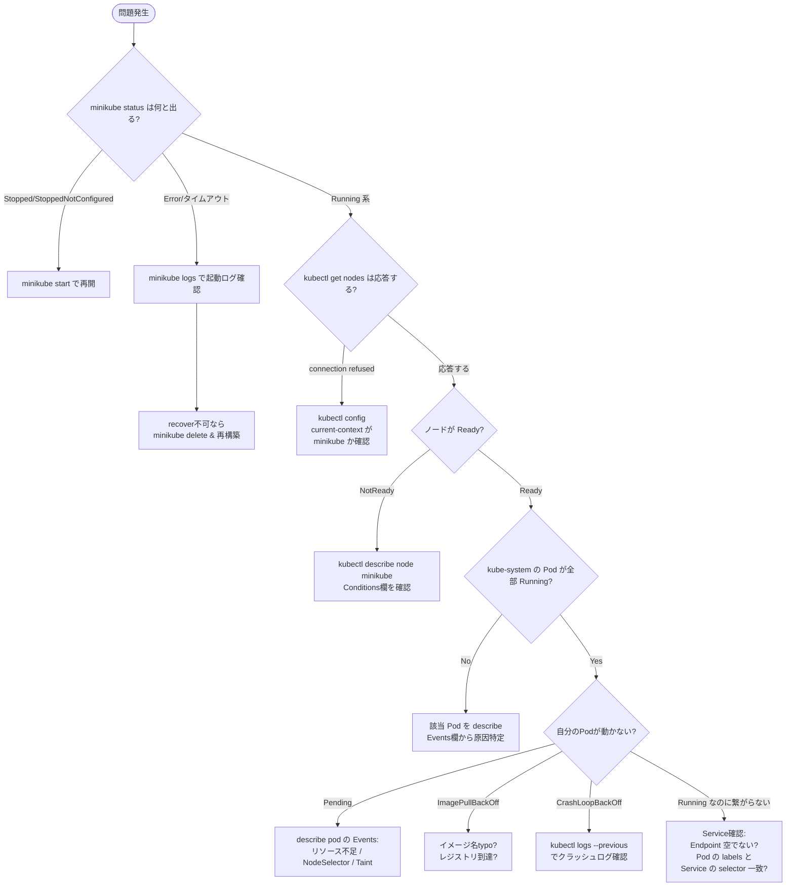

# 学習環境の準備 ① Minikube編 (完全手順)
{: .no_toc }

## 目次
{: .no_toc .text-delta }

1. TOC
{:toc}

---

## このページのゴール

第1〜6章のハンズオンで使う **Minikube** を、自分の PC にセットアップします。

このページを読み終えると以下ができるようになります。

- なぜ「ローカル開発用 Kubernetes」が必要なのかを理解する
- Minikube・kind・k3d の違いと選び方を判断できる
- Docker Desktop / Minikube / kubectl / Helm をインストールできる
- Minikube の起動オプションの意味を理解して、目的に応じた構成で起動できる
- 起動後の状態を多角的に確認できる
- 一般的な失敗ケースを自分で診断・復旧できる

所要時間: 30〜60分(初回ダウンロードを含む)。

---

## 1. ローカル Kubernetes の選択肢

実は Kubernetes をローカル PC で動かすツールは **複数あります**。なぜ Minikube を選ぶのか、まず比較から。

### 1-1. ツール比較

| ツール | 特徴 | 主な用途 | 公式 |
|--------|------|---------|------|
| **Minikube** | 公式ツール、機能が豊富、アドオン多数 | 学習、開発 | <https://minikube.sigs.k8s.io/> |
| **kind** | Docker内にクラスタ、CI/CDで使いやすい | CI、自動テスト | <https://kind.sigs.k8s.io/> |
| **k3d** | k3s をDockerで動かす、軽量 | 軽量学習、エッジ | <https://k3d.io/> |
| **Docker Desktop** | Docker Desktop の組込機能 | 簡易動作確認 | (Docker Desktop に内蔵) |
| **kubeadm** | 本物の構築ツール、本教材7章で使用 | 本格構築・本番 | <https://kubernetes.io/docs/setup/production-environment/tools/kubeadm/> |
| **Lima + nerdctl** | Mac中心、軽量 | Mac開発者向け | <https://lima-vm.io/> |

### 1-2. なぜ本教材は Minikube を選ぶか

**理由1: 公式 (Kubernetes SIG-cluster-lifecycle が管理)**

Minikubeは Kubernetes プロジェクト公式のツールで、長期メンテナンスが保証されています。

**理由2: 機能が最も充実**

Ingress、metrics-server、dashboard、registry など、学習に必要なアドオンが豊富。

**理由3: 単純なデモから本格的な機能(マルチノード、複数プロファイル)まで対応**

```bash
# 1ノード簡易クラスタ
minikube start

# マルチノードクラスタ(本教材後半でも体験可)
minikube start --nodes=3

# 別プロファイルで複数クラスタ並行運用
minikube start -p test-1
minikube start -p test-2
```

**理由4: ドライバの選択肢が広い**

Docker / Hyper-V / VMware / VirtualBox / Podman / KVM / Parallels など、さまざまな仮想化技術に対応。

### 1-3. なぜ kind や k3d ではないのか

| ツール | 弱点(本教材の用途で) |
|--------|---------------------|
| kind | アドオン少なめ、Ingress 等を自前で入れる必要 |
| k3d | k3s 互換だが標準 K8s と微妙な差(Helm controller同梱等) |
| Docker Desktop | バージョン制御が弱い、複数構成困難 |

**結論**: 学習・教材用途には Minikube が最適。
ただし、CI に使うなら kind の方が起動が速くおすすめ、と用途によって使い分けるのが正解。

---

## 2. Minikube の動作原理

セットアップに入る前に、Minikube が何をしているかを理解しておきましょう。

### 2-1. Minikube は何をしているか



つまり Minikube の本質は:

1. PC上に **「軽量な Linux 環境」** を1個作る(VM or Docker コンテナ)
2. その中で **本物の Kubernetes** (kubeadm) を起動
3. PC の `~/.kube/config` を更新して、kubectl がそれを向くように設定

「**Kubernetes が独自実装** ではなく、**本物の Kubernetes をローカルで起動するためのラッパー** 」というのがポイント。
学んだ操作・YAML はそのままマネージドK8sでも通用します。

### 2-2. ドライバの選び方

Minikube はサンドボックス環境(K8sを動かす場所)を作るのに **複数の方式** をサポートしています。



| ドライバ | OS | 利点 | 欠点 |
|---------|-----|------|------|
| **docker** | Win/Mac/Linux | 起動2分、軽い、本教材推奨 | カーネル機能の差で一部制約 |
| **hyperv** | Windows Pro+ | フルVM、本物に近い | 起動遅い、設定面倒 |
| **vmware** | Win/Mac | 既にVMware使っているなら | ライセンス必要 |
| **virtualbox** | Win/Mac/Linux | 無料、設定簡単 | 性能やや劣る、Hyper-Vと共存問題 |
| **kvm2** | Linux | 高速、Linuxネイティブ | Linux限定 |
| **none** | Linux | ネスト無し最速 | ホストOS汚染リスク、本番に不向き |

**本教材では Docker driver を採用**。理由:

- 全OS共通の手順
- 起動が圧倒的に速い(初回 5分、2回目以降 30秒)
- Hyper-V/VirtualBox との競合問題が起きにくい
- リソース消費が少ない

---

## 3. 必要なリソース

| 項目 | 最小 | 推奨 | 本教材想定 |
|------|------|------|-----------|
| RAM | 4GB | 8GB | 16GB+ |
| 空きディスク | 20GB | 40GB | 100GB |
| CPU | 2コア | 4コア | 4コア+ |
| OS | Win10 64bit / macOS 11+ / Ubuntu 20.04+ | 最新版 | 最新版 |

### 3-1. なぜこれだけ必要か

| リソース | 用途 |
|---------|------|
| Minikube ベースイメージ | 約 1GB (初回ダウンロード) |
| 起動時の Docker コンテナ | 約 4GB ディスク |
| Pod 用イメージのキャッシュ | アプリ数に応じて 2〜10GB |
| 起動した Minikube の RAM 使用量 | 1.5〜2GB(K8sだけで) |
| アプリ Pod の RAM 使用量 | 数百MB〜 |

ホストPC 8GB あればミニマム動きますが、Web ブラウザや IDE と並行使用するなら 16GB 以上が快適。

---

## 4. Step 1: 前提ソフトウェアのインストール

OS別に手順が異なります。**該当する OS の手順だけ** を実行してください。

### 4-A. Windows の場合

#### 4-A-1. WSL2 を有効化

##### 何をするか

WSL2 (Windows Subsystem for Linux 2) は、Windows上でLinuxバイナリを実行する仕組みです。
Docker Desktop は WSL2 をバックエンドとして使うため、先に有効化が必要。

WSL2 の中身は実は **軽量Hyper-VベースのLinux VM** ですが、Microsoft が深く統合しているため意識する必要はほぼありません。

##### 手順

PowerShell を **管理者権限** で開きます:

1. スタートメニューで `PowerShell` と入力
2. 「Windows PowerShell」を **右クリック** →「**管理者として実行**」
3. UACで「はい」

```powershell
wsl --install
```

##### コマンドの意味

このコマンドが裏で実行する処理:

1. Windows の機能「Linux 用 Windows サブシステム」を有効化(再起動必要な機能変更)
2. 「仮想マシン プラットフォーム」を有効化(Hyper-V系の機能)
3. 既定のディストリビューション(Ubuntu)をダウンロードしてインストール
4. WSL のデフォルトバージョンを 2 に設定

##### 期待される出力

```
インストール中: 仮想マシン プラットフォーム
仮想マシン プラットフォーム はインストールされました。
インストール中: Linux 用 Windows サブシステム
Linux 用 Windows サブシステム はインストールされました。
ダウンロード中: Linux 用 Windows サブシステム Linux カーネル
インストール中: Linux 用 Windows サブシステム Linux カーネル
Linux 用 Windows サブシステム Linux カーネル はインストールされました。
ダウンロード中: Ubuntu
インストール中: Ubuntu
Ubuntu はインストールされました。
要求された操作は正常に終了しました。次のシステムの再起動後に変更が有効になります。
```

##### **重要: PCを再起動**

再起動しないとWSL2が有効になりません。再起動後、自動でUbuntuセットアップ画面が立ち上がるので、ユーザー名とパスワードを設定。

##### 確認

再起動後、PowerShellで:

```powershell
wsl --status
```

期待される出力:

```
既定のバージョン: 2

既定のディストリビューション: Ubuntu
```

##### `--status` の意味

`wsl` は WSL の管理コマンド、`--status` は現状の設定を表示するオプション。
`既定のバージョン: 2` でなければ:

```powershell
wsl --set-default-version 2
```

を実行。

##### トラブル事例集

| エラーメッセージ | 原因 | 対処 |
|------------------|------|------|
| `WSL 2 ではカーネルコンポーネントの更新が必要です` | カーネル更新が古い | <https://aka.ms/wsl2kernel> から MSI を実行 |
| `Hyper-V を有効にすることに失敗しました` | Windows Home + 仮想化未有効 | BIOS で VT-x/AMD-V 有効化 |
| `仮想マシン プラットフォーム は無効です` | 機能未有効 | `dism.exe /online /enable-feature /featurename:VirtualMachinePlatform /all /norestart` |
| 動作するが Ubuntu が起動しない | Microsoft Store からの取得失敗 | `wsl --install -d Ubuntu` で手動インストール |

#### 4-A-2. Docker Desktop のインストール

##### Docker Desktop とは

Docker Desktop は、

- Windows/Mac で Linux コンテナを動かすための統合パッケージ
- 内部で軽量Linux VM (Windowsだと WSL2バックエンド)を動かす
- GUI、CLI、Kubernetes機能、ボリューム管理などを統合提供

商用利用について:
- **個人利用** または **小規模事業者(従業員250名未満かつ年商1000万ドル未満)**: 無料
- **大企業**: 有料サブスクリプション必要(Pro/Team/Business)
- 教育機関・OSSプロジェクトは無料

業務PCでお使いの場合は、自社のライセンス状況を確認してください。

##### インストール手順

1. <https://www.docker.com/products/docker-desktop/> にアクセス
2. 「Download for Windows」をクリック
3. ダウンロードした `Docker Desktop Installer.exe` を実行

インストール時のチェックボックス:

- ☑ **Use WSL 2 instead of Hyper-V (recommended)** ← **必ずチェック**(WSL2バックエンド)
- ☑ Add shortcut to desktop ← お好みで

「OK」を押すとインストール開始。3〜5分かかります。

完了画面で「**Close and restart**」(再ログインが必要)。

#### 4-A-3. Docker Desktop の初期設定

再ログイン後、自動で Docker Desktop が起動。

初回画面:
- 利用規約に同意
- (任意)アカウント作成 → スキップ可能

タスクトレイに **クジラのアイコン** が表示されたら起動完了。
クジラの動きが止まったら準備完了。

##### 設定確認

PowerShellで:

```powershell
docker version
```

##### コマンドの意味

`docker version` は Docker Engine のクライアント版とサーバ版両方のバージョンを表示。
`Server` が表示されないなら、Docker Engine 接続失敗を意味する。

##### 期待される出力

```
Client:
 Cloud integration: v1.0.x
 Version:           27.x.x
 API version:       1.46
 Go version:        go1.21.x
 OS/Arch:           windows/amd64
 Context:           default

Server: Docker Desktop 4.34.x
 Engine:
  Version:          27.x.x
  API version:      1.46
  Go version:       go1.21.x
  OS/Arch:          linux/amd64
  Experimental:     false
 ...
```

`Server` のセクションが表示されればOK。

##### トラブル事例集

| 症状 | 確認 | 対処 |
|------|------|------|
| `Cannot connect to the Docker daemon` | クジラのアイコンが動いている? | 起動中なら30秒〜2分待つ |
| `Cannot connect ...` (待っても動かない) | エラーログ | クジラ右クリック → Troubleshoot → Restart |
| WSL2 統合が外れている | Settings → Resources → WSL Integration | Ubuntu のスイッチをON |
| ファイル共有エラー | Settings → Resources → File Sharing | プロジェクトフォルダのドライブを許可 |

#### 4-A-4. Minikube / kubectl / Helm のインストール

##### winget による一括インストール

PowerShellを **管理者権限** で:

```powershell
winget install --id=Kubernetes.minikube -e
winget install --id=Kubernetes.kubectl -e
winget install --id=Helm.Helm -e
```

##### コマンドの意味

`winget` は Windows Package Manager (Windows 10 ver.2004以降標準)。
- `install`: パッケージインストール
- `--id=Kubernetes.minikube`: パッケージID指定(検索より確実)
- `-e` または `--exact`: 完全一致(類似名で誤インストールを防ぐ)

##### 期待される出力(各コマンド)

```
Found Kubernetes Minikube [Kubernetes.minikube] バージョン 1.34.0
このアプリケーションは所有者からライセンス供与されます。
Microsoft はサードパーティのパッケージに対して責任を負わず、ライセンスも付与しません。
ダウンロード中 https://github.com/kubernetes/minikube/releases/...
  ██████████████████████████████  82.4 MB / 82.4 MB
インストーラー ハッシュが正常に検証されました
パッケージのインストールを開始しています...
インストールが完了しました
```

##### Chocolatey 代替手順

`winget` が使えない環境(Windows 10 旧版、企業ポリシー等)では Chocolatey:

```powershell
# Chocolatey 未導入なら先にインストール
Set-ExecutionPolicy Bypass -Scope Process -Force
[System.Net.ServicePointManager]::SecurityProtocol = `
  [System.Net.ServicePointManager]::SecurityProtocol -bor 3072
iex ((New-Object System.Net.WebClient).DownloadString('https://community.chocolatey.org/install.ps1'))

# ツール導入
choco install minikube kubernetes-cli kubernetes-helm -y
```

##### scoop 代替手順

開発者に好まれる軽量パッケージマネージャ scoop でも:

```powershell
# scoop 未導入なら
Set-ExecutionPolicy -ExecutionPolicy RemoteSigned -Scope CurrentUser
Invoke-RestMethod -Uri https://get.scoop.sh | Invoke-Expression

scoop install minikube kubectl helm
```

##### バイナリ直接ダウンロード代替

ネットワーク制約等でパッケージマネージャが使えない場合:

1. <https://github.com/kubernetes/minikube/releases/latest> から `minikube-windows-amd64.exe` をダウンロード
2. 適当なフォルダ(例: `C:\bin\`)に置いて `minikube.exe` にリネーム
3. PATH に追加(システム環境変数を編集)
4. kubectl も同様に <https://kubernetes.io/docs/tasks/tools/install-kubectl-windows/>

##### インストール確認

**新しい PowerShell ウィンドウを開いて**(PATH更新のため):

```powershell
minikube version
kubectl version --client
helm version
```

##### 期待される出力

```
minikube version: v1.34.0
commit: abcdef1234...

Client Version: v1.31.0
Kustomize Version: v5.4.x

version.BuildInfo{Version:"v3.16.x", GitCommit:"...", GitTreeState:"clean", GoVersion:"go1.22.x"}
```

3つともバージョンが表示されればOK。

### 4-B. macOS の場合

#### 4-B-1. Homebrew のインストール

未導入なら:

```bash
/bin/bash -c "$(curl -fsSL https://raw.githubusercontent.com/Homebrew/install/HEAD/install.sh)"
```

##### コマンドの意味

- `bash -c "..."` は引数の文字列をシェルコマンドとして実行
- `curl -fsSL <URL>` の意味:
  - `-f` (failure): HTTPエラー時に exit code != 0
  - `-s` (silent): 進捗表示を抑制
  - `-S` (show errors): silentでもエラーは表示
  - `-L` (location): リダイレクト追従

組み合わせで「エラー時に確実に失敗する curl」が定形になっている。

確認:

```bash
brew --version
```

#### 4-B-2. Docker Desktop のインストール

```bash
brew install --cask docker
```

`--cask` は GUI アプリ向けのインストール先(Applications フォルダ)を指定。

インストール後、**Applications フォルダから手動起動**。
Docker.app をクリック → メニューバーにクジラアイコンが表示されたら起動完了。

#### 4-B-3. CLI ツール

```bash
brew install minikube kubectl helm
```

確認:

```bash
docker version
minikube version
kubectl version --client
helm version
```

### 4-C. Linux (Ubuntu 22.04) の場合

#### 4-C-1. Docker Engine のインストール

##### 公式リポジトリ追加

```bash
sudo apt-get update
sudo apt-get install -y ca-certificates curl
sudo install -m 0755 -d /etc/apt/keyrings
sudo curl -fsSL https://download.docker.com/linux/ubuntu/gpg \
  -o /etc/apt/keyrings/docker.asc
sudo chmod a+r /etc/apt/keyrings/docker.asc
```

##### コマンドの意味

- `apt-get update`: パッケージリスト更新
- `install -m 0755 -d <DIR>`: 指定モードでディレクトリ作成 (`-d`: directory)
- `curl ... -o <FILE>`: 出力ファイル指定
- `chmod a+r`: 全ユーザに読み取り権限付与

##### リポジトリ登録

```bash
echo "deb [arch=$(dpkg --print-architecture) signed-by=/etc/apt/keyrings/docker.asc] \
  https://download.docker.com/linux/ubuntu $(. /etc/os-release && echo $VERSION_CODENAME) stable" \
  | sudo tee /etc/apt/sources.list.d/docker.list > /dev/null
```

##### コマンド分解

- `dpkg --print-architecture`: アーキテクチャ取得 (`amd64` 等)
- `. /etc/os-release && echo $VERSION_CODENAME`: 現在のUbuntuコードネーム取得 (`jammy` 等)
- `tee <FILE>`: 標準入力をファイルに書き込み(`>` よりsudoとの相性が良い)

##### Docker パッケージ群インストール

```bash
sudo apt-get update
sudo apt-get install -y docker-ce docker-ce-cli containerd.io
```

##### Docker グループに追加

```bash
sudo usermod -aG docker $USER
```

`-a -G docker`: docker グループに追加 (-a で既存グループに追加・上書きしない)

**重要**: グループ反映には **一旦ログアウト・再ログイン** が必要。

##### 確認

ログアウト後の新ターミナルで:

```bash
docker run hello-world
```

期待される出力(抜粋):

```
Hello from Docker!
This message shows that your installation appears to be working correctly.
```

#### 4-C-2. Minikube インストール

```bash
curl -LO https://storage.googleapis.com/minikube/releases/latest/minikube-linux-amd64
sudo install minikube-linux-amd64 /usr/local/bin/minikube
rm minikube-linux-amd64
```

##### コマンド分解

- `curl -LO <URL>`: Location追従しつつ、URLのファイル名そのままで保存
- `install`: cp + chmod + chown を1コマンドで(ファイルコピー & 適切な権限設定)
- `/usr/local/bin/`: 通常のユーザがインストールするバイナリの標準的な場所(PATH に含まれる)

#### 4-C-3. kubectl インストール

```bash
curl -LO "https://dl.k8s.io/release/$(curl -L -s https://dl.k8s.io/release/stable.txt)/bin/linux/amd64/kubectl"
sudo install -o root -g root -m 0755 kubectl /usr/local/bin/kubectl
rm kubectl
```

`$(curl ... stable.txt)`: 最新stable版のバージョン番号を動的取得 (`v1.31.x` など)

#### 4-C-4. Helm インストール

```bash
curl https://raw.githubusercontent.com/helm/helm/main/scripts/get-helm-3 | bash
```

公式の自動セットアップスクリプト。実行内容を読みたい場合は `| bash` を外して内容を確認できる。

---

## 5. Step 2: Minikube クラスタの起動

ここから OS 共通の手順です。

### 5-1. クラスタを起動

```powershell
minikube start --driver=docker --cpus=2 --memory=4096 --kubernetes-version=v1.30.0
```

#### コマンドの各オプション

| オプション | 意味 | 取りうる値 | 推奨 |
|-----------|------|-----------|------|
| `--driver` | サンドボックス環境のドライバ | docker, hyperv, virtualbox, kvm2, vmware, podman, none | **docker**(本教材) |
| `--cpus` | クラスタに割り当てるvCPU数 | 1〜物理コア数 | 2(最小)、4(快適) |
| `--memory` | クラスタに割り当てるメモリ(MB) | 1800以上 | 4096(最小)、8192(余裕) |
| `--kubernetes-version` | K8sバージョン | v1.x.x | **v1.30.0**(本教材) |
| `--nodes` | ノード数(マルチノード時) | 1+ | 1(初回) |
| `--disk-size` | ディスクサイズ | 1g以上 | 20g (デフォルト) |
| `--container-runtime` | コンテナランタイム | containerd, docker, cri-o | **containerd** (デフォルト) |

#### より詳しい指定例

##### マルチノードクラスタ

```powershell
minikube start --driver=docker --nodes=3 --cpus=2 --memory=2048 \
  --kubernetes-version=v1.30.0
```

3ノード(Control Plane 1 + Worker 2)で起動。podAntiAffinity やスケジューリングの実験に便利。

##### プロファイル分け

```powershell
# 本教材用
minikube start -p k8s-tutorial --driver=docker --cpus=2 --memory=4096

# 別案件のテスト用
minikube start -p test-old-version --driver=docker --kubernetes-version=v1.28.0
```

`-p <name>` で別クラスタとして並行運用。

#### 何が起きるか(内部動作)

Minikube が内部で実行する処理:



所要時間: 初回 5〜10 分(ベースイメージダウンロード)、2回目以降 1〜2 分。

#### 期待される出力(全文)

```
😄  Microsoft Windows 11 Pro 上の minikube v1.34.0
✨  ユーザーの設定に基づいて docker ドライバを使用します
📌  Using Docker Desktop driver with root privileges
👍  Starting "minikube" primary control-plane node in "minikube" cluster
🚜  Pulling base image v0.0.45 ...
💾  Kubernetes v1.30.0 のダウンロード準備中
    > preloaded-images-k8s-v18-v1...:  393.20 MiB / 393.20 MiB  100.00% 12.34 MiB
    > gcr.io/k8s-minikube/kicbase...:  483.34 MiB / 483.34 MiB  100.00% 9.87 MiB
🔥  docker container (CPUs=2, Memory=4096MB) を作成しています...
🐳  Docker 27.2.0 で Kubernetes v1.30.0 を準備しています...
    ▪ 証明書と鍵を作成しています...
    ▪ コントロールプレーンを起動しています...
    ▪ RBAC のルールを設定中です...
🔗  bridge CNI (Container Networking Interface) プラグインを設定中です...
🔎  Kubernetes コンポーネントを検証しています...
    ▪ gcr.io/k8s-minikube/storage-provisioner:v5 イメージを使用しています
🌟  有効なアドオン: storage-provisioner, default-storageclass
🏄  完了しました! kubectl が "minikube" クラスタおよび "default" ネームスペースを使用するよう設定されました
```

最後の `🏄 完了しました!` が表示されたら成功。

#### 出力の各行の意味

| 行 | 意味 |
|----|------|
| `Microsoft Windows 11 Pro 上の minikube v1.34.0` | OS環境とMinikubeバージョン |
| `docker ドライバを使用します` | 選択されたドライバ確認 |
| `Pulling base image v0.0.45` | サンドボックスのベースイメージ取得 |
| `preloaded-images...` | K8s関連イメージのプリロード |
| `docker container (CPUs=2, Memory=4096MB) を作成しています` | Docker内に Minikube コンテナ起動 |
| `Docker 27.2.0 で Kubernetes v1.30.0 を準備しています` | コンテナ内部の Docker(注: Minikubeコンテナ内に Docker と containerd が両方ある) |
| `証明書と鍵を作成しています` | etcd/kubelet 用の TLS 証明書生成 |
| `コントロールプレーンを起動しています` | apiserver/scheduler/controller-manager 起動 |
| `RBAC のルールを設定中です` | デフォルトのClusterRoleBinding等を作成 |
| `bridge CNI` | Pod間通信のためのCNIプラグイン設定 |
| `有効なアドオン: storage-provisioner, default-storageclass` | デフォルトで有効化されたアドオン |

#### トラブル事例集

##### A. `Exiting due to PROVIDER_DOCKER_NOT_FOUND`

```
❌  Exiting due to PROVIDER_DOCKER_NOT_FOUND: The driver 'docker' is not healthy
```

**原因**: Docker Desktop が起動していない、または不調。

**確認**:
```powershell
docker version
```

`Server` の項目が出ない → Docker Desktop が動いていない。

**対処**:
- タスクトレイのクジラアイコンをクリック
- 起動中なら2分待つ
- 起動しないなら Docker Desktop を再インストール

##### B. `Exiting due to GUEST_PROVISION_CONTAINER_EXITED`

```
❌  Exiting due to GUEST_PROVISION_CONTAINER_EXITED: Docker container exited
```

**原因**: 多くの場合メモリ不足。

**確認**:
```powershell
docker stats
```

または Windows のタスクマネージャーで「Vmmem」プロセスのメモリ。

**対処**:
- メモリを下げて再試行: `--memory=2048`
- 他のアプリ(ブラウザのタブ等)を閉じる
- WSL2 のメモリ上限を `%USERPROFILE%\.wslconfig` で調整:

```
[wsl2]
memory=8GB
processors=4
```

##### C. 途中で長時間止まる

```
🔥  docker container (CPUs=2, Memory=4096MB) を作成しています...
(5分以上進まない)
```

**原因**: ネットワーク・レジストリ遅延、またはダウンロードリトライ中。

**対処**:
- そのまま 10 分待つ(初回は時間がかかる)
- それ以上ダメなら Ctrl+C → `minikube delete` → `minikube start` 再試行
- 別プロキシ環境なら `HTTPS_PROXY` 環境変数を設定してから

##### D. 証明書エラー

```
✗  証明書と鍵を作成しています...
error: certificate has expired or is not yet valid
```

**原因**: PCの時刻ずれ。

**対処**:
- Windows: 設定 → 時刻と言語 → 「自動的に時刻を設定する」がオン
- macOS: システム設定 → 一般 → 日付と時刻 → 「自動的に設定」
- Linux: `sudo timedatectl set-ntp true`

### 5-2. クラスタの状態を確認

#### `minikube status`

```powershell
minikube status
```

##### コマンドの意味

Minikube のコンポーネント(VM, kubelet, apiserver, kubeconfig)の状態を表示。

##### 期待される出力

```
minikube
type: Control Plane
host: Running
kubelet: Running
apiserver: Running
kubeconfig: Configured
```

##### 各行の意味

| 項目 | 意味 |
|------|------|
| `host: Running` | サンドボックス(Docker container)が動作中 |
| `kubelet: Running` | ノードエージェントが動作中 |
| `apiserver: Running` | API Server がリクエスト受付中 |
| `kubeconfig: Configured` | `~/.kube/config` が更新済み |

5項目すべてが `Running` または `Configured` ならOK。

##### 異常時のパターン

| 出力 | 意味 |
|------|------|
| `host: Stopped` | コンテナが停止している → `minikube start` で復活 |
| `apiserver: Not Found` | apiserver クラッシュ → `minikube logs` で確認 |
| `kubeconfig: Misconfigured` | kubeconfig が不整合 → `minikube update-context` |

### 5-3. kubectl で繋がることを確認

#### `kubectl get nodes`

```powershell
kubectl get nodes
```

##### コマンドの意味

- `kubectl`: Kubernetes 操作 CLI
- `get`: リソース取得(取得系操作)
- `nodes`: 取得対象のリソース種別(`node` でも可)

##### 期待される出力

```
NAME       STATUS   ROLES           AGE   VERSION
minikube   Ready    control-plane   2m    v1.30.0
```

##### 各カラムの意味

| カラム | 意味 |
|--------|------|
| **NAME** | ノード名(MinikubeデフォルトはVM/コンテナ名と同じ) |
| **STATUS** | `Ready` (正常) / `NotReady` / `Unknown` |
| **ROLES** | `control-plane` / `<none>` (Worker専用) |
| **AGE** | クラスタ参加時からの経過時間 |
| **VERSION** | kubelet バージョン |

`Ready` になるのに数十秒かかる場合あり。`-w` で監視可能:

```powershell
kubectl get nodes -w
```

`Ctrl+C` で抜ける。

#### `--output` オプションで詳細表示

```powershell
kubectl get nodes -o wide
```

##### 何が変わるか

`-o wide` で追加カラム表示:

```
NAME       STATUS   ROLES           AGE   VERSION   INTERNAL-IP   EXTERNAL-IP   OS-IMAGE             KERNEL-VERSION    CONTAINER-RUNTIME
minikube   Ready    control-plane   3m    v1.30.0   192.168.49.2  <none>        Ubuntu 22.04.4 LTS   5.15.146.1...     containerd://1.7.x
```

新たに見える情報:
- `INTERNAL-IP`: Pod 間通信に使う IP
- `OS-IMAGE`: ノードのOSイメージ
- `KERNEL-VERSION`: ノードのLinuxカーネル
- `CONTAINER-RUNTIME`: 使われているCRIランタイム

#### `--output=yaml` でフルスペック表示

```powershell
kubectl get node minikube -o yaml
```

ノードの内部スペック(リソース、状態、アノテーション等)が全て YAML 形式で出ます。
学習中は時々これを開いて「**Kubernetes はノードを内部でどう表現しているか**」を観察すると理解が深まります。

##### トラブル事例集

| エラー | 原因 | 対処 |
|--------|------|------|
| `connection to the server localhost:8080 was refused` | kubeconfig がデフォルト | `kubectl config use-context minikube` |
| `Unable to connect to the server` | クラスタ停止 | `minikube status` で確認、必要なら `minikube start` |
| `STATUS: NotReady` (1分以上) | CNI起動失敗等 | `kubectl describe node minikube` の Conditions 欄 |
| `STATUS: Unknown` | kubelet通信不可 | `minikube logs` でログ確認 |

### 5-4. システム Pod の確認

Kubernetes 自体を動かす Pod が `kube-system` 名前空間で動いています。

```powershell
kubectl get pods -n kube-system
```

##### コマンドの意味

- `pods`: Pod リソース取得
- `-n kube-system`: namespace 指定 (`--namespace=kube-system` の短縮形)

##### 期待される出力

```
NAME                               READY   STATUS    RESTARTS   AGE
coredns-7db6d8ff4d-xxxxx           1/1     Running   0          3m
etcd-minikube                      1/1     Running   0          3m
kube-apiserver-minikube            1/1     Running   0          3m
kube-controller-manager-minikube   1/1     Running   0          3m
kube-proxy-yyyyy                   1/1     Running   0          3m
kube-scheduler-minikube            1/1     Running   0          3m
storage-provisioner                1/1     Running   0          3m
```

##### 各 Pod の役割と動作

| Pod | 役割 | 不在時に起きること |
|-----|------|-------------------|
| **coredns** | クラスタ内 DNS サーバー | Pod が `payment` のような名前で他Service呼べなくなる |
| **etcd** | クラスタ全状態を保存する KVS | クラスタの記憶喪失 → 全リソース消える |
| **kube-apiserver** | クラスタの API 入口 | kubectl が応答しなくなる、コントローラ達も止まる |
| **kube-controller-manager** | 各種コントローラの本体 | Deployment が ReplicaSet 作らなくなる、Pod数維持されない |
| **kube-proxy** | Service の通信ルーティング | Service の ClusterIP が機能停止 |
| **kube-scheduler** | Pod 配置決定 | 新規 Pod が Pending のまま動かない |
| **storage-provisioner** | PV の動的プロビジョニング | PVC が Pending のまま PV が作られない |

##### `READY: 1/1` の意味

`X/Y` の形式:
- Y = Pod 内のコンテナ総数
- X = Ready なコンテナ数

`1/1` は「1個中1個Ready」で正常。`0/1` は起動中またはProbe失敗。

##### `RESTARTS: 0` の意味

コンテナの再起動回数。0 が理想。1以上はクラッシュしている可能性あり、`kubectl logs <pod> --previous` で前回ログを確認。

##### より詳しい情報

```powershell
kubectl describe pod <Pod名> -n kube-system
```

`Events` セクションに最近の出来事(起動、Probe失敗等)が表示される。トラブル時の第一手。

##### トラブル事例集

| 症状 | 確認 | 対処 |
|------|------|------|
| `Pending`のまま | `describe pod` の Events | リソース不足、ノードのTaint等 |
| `ContainerCreating` (長時間) | 同上 | イメージ pull中、Volume mount失敗 |
| `ImagePullBackOff` | イメージ名typo、レジストリ到達不可 | `minikube ssh` してネットワーク確認 |
| `CrashLoopBackOff` | `logs --previous` | アプリ自体がクラッシュ |

---

## 6. Step 3: 必須アドオンを有効化

Minikube は素の状態だとミニマムです。教材で必要なアドオンを足します。

### 6-1. Ingress アドオン

#### Ingress とは(後章で詳しく扱うが概要)

Pod へのHTTP/HTTPSルーティング機能。「ホスト名 + パスで振り分け」を可能に。
第4章 [Ingress]({{ '/04-networking/ingress/' | relative_url }}) で本格的に使います。

#### 有効化

```powershell
minikube addons enable ingress
```

##### 内部動作

1. Minikube が `nginx-ingress-controller` の Helm インストールを実行
2. `ingress-nginx` 名前空間に Pod を作成
3. NodePort または LoadBalancer Service として公開

##### 期待される出力

```
💡  ingress is an addon maintained by Kubernetes. For any concerns contact minikube on GitHub.
You can view the list of minikube maintainers at: https://github.com/kubernetes/minikube/blob/master/OWNERS
    ▪ Using image registry.k8s.io/ingress-nginx/controller:v1.11.x
    ▪ Using image registry.k8s.io/ingress-nginx/kube-webhook-certgen:v1.4.x
    ▪ Using image registry.k8s.io/ingress-nginx/kube-webhook-certgen:v1.4.x
🔎  Verifying ingress addon...
🌟  ingress アドオンが有効になりました
```

##### 確認

```powershell
kubectl get pods -n ingress-nginx
```

期待される出力:

```
NAME                                        READY   STATUS      RESTARTS   AGE
ingress-nginx-admission-create-xxxxx        0/1     Completed   0          1m
ingress-nginx-admission-patch-xxxxx         0/1     Completed   0          1m
ingress-nginx-controller-xxxxxxxxx-xxxxx    1/1     Running     0          1m
```

`controller` が `Running` ならOK。`admission-*` は1回限りの Job で `Completed` が正常。

### 6-2. metrics-server アドオン

#### metrics-server とは

ノードや Pod の **CPU/メモリ使用量** を集計してAPIで提供するコンポーネント。

- `kubectl top` の動作に必須
- HorizontalPodAutoscaler (HPA) の動作に必須
- ダッシュボード等の可視化に必須

#### 有効化

```powershell
minikube addons enable metrics-server
```

##### 内部動作

1. metrics-server Deployment を `kube-system` に作成
2. `metrics.k8s.io/v1beta1` API を登録(Aggregation Layer 経由)
3. 各ノードの kubelet から定期的にメトリクス収集

##### 動作確認

数十秒待ってから:

```powershell
kubectl top nodes
```

期待される出力:

```
NAME       CPU(cores)   CPU%   MEMORY(bytes)   MEMORY%
minikube   150m         7%     900Mi           23%
```

##### `kubectl top pods`

```powershell
kubectl top pods -A
```

`-A` は `--all-namespaces` の短縮形。全 namespace の Pod を表示。

期待される出力:

```
NAMESPACE       NAME                               CPU(cores)   MEMORY(bytes)
ingress-nginx   ingress-nginx-controller-...       3m           74Mi
kube-system     coredns-7db6d8ff4d-xxxxx           2m           15Mi
kube-system     etcd-minikube                      30m          50Mi
...
```

##### トラブル事例集

| エラー | 原因 | 対処 |
|--------|------|------|
| `Metrics API not available` | metrics-server まだ起動中 | 30〜60秒待つ |
| `error: metrics not available yet` | TLS 検証エラー | Minikubeなら通常は自動修正される。手動でなら `kubectl edit deploy metrics-server -n kube-system` で `--kubelet-insecure-tls` 追加 |
| 値が出ない (Pod は Running) | kubelet 設定 | Minikubeでは通常問題ないが、生kubeadmだと別途設定要 |

### 6-3. その他のアドオン(任意)

#### dashboard

```powershell
minikube addons enable dashboard
minikube dashboard
```

ブラウザで Kubernetes 公式 Web UI が開く。リソースを GUI で確認できる。
ただし学習用には kubectl の方が早いので、初心者は無理に使わなくて良い。

#### registry

```powershell
minikube addons enable registry
```

Minikube 内に Docker レジストリを起動。ローカルでビルドしたイメージを push できる。

#### gvisor

Pod のサンドボックス強化(性能と引き換えにセキュリティ向上)。学習用には不要。

### 6-4. アドオン一覧表示

```powershell
minikube addons list
```

期待される出力(抜粋):

```
|-----------------------------|----------|--------------|
|         ADDON NAME          | PROFILE  |    STATUS    |
|-----------------------------|----------|--------------|
| dashboard                   | minikube | disabled     |
| default-storageclass        | minikube | enabled      |
| ingress                     | minikube | enabled      |
| metrics-server              | minikube | enabled      |
| storage-provisioner         | minikube | enabled      |
|-----------------------------|----------|--------------|
```

---

## 7. Step 4: 動作確認 (Hello World)

簡単な Pod を起動してクラスタ全体が動くか確認します。

### 7-1. Pod を1つ起動

```powershell
kubectl run hello --image=nginx:1.27 --port=80
```

##### コマンド分解

- `kubectl run`: Pod を直接作成(命令型)
- `<NAME>`: Pod 名(`hello`)
- `--image=<IMAGE>`: コンテナイメージ
- `--port=80`: コンテナがlistenするポート(documentation目的、開放はService必要)

実運用では `kubectl run` ではなく Deployment(後述)を使うが、サクッと動かすには便利。

##### 期待される出力

```
pod/hello created
```

### 7-2. Pod の状態を確認

```powershell
kubectl get pods
```

期待される出力(初期は ContainerCreating):

```
NAME    READY   STATUS              RESTARTS   AGE
hello   0/1     ContainerCreating   0          5s
```

10〜30 秒後:

```
NAME    READY   STATUS    RESTARTS   AGE
hello   1/1     Running   0          25s
```

### 7-3. ログを見る

```powershell
kubectl logs hello
```

期待される出力(nginx の起動ログ):

```
/docker-entrypoint.sh: /docker-entrypoint.d/ is not empty, will attempt to perform configuration
/docker-entrypoint.sh: Looking for shell scripts in /docker-entrypoint.d/
/docker-entrypoint.sh: Launching /docker-entrypoint.d/10-listen-on-ipv6-by-default.sh
10-listen-on-ipv6-by-default.sh: info: Getting the checksum of /etc/nginx/conf.d/default.conf
10-listen-on-ipv6-by-default.sh: info: Enabled listen on IPv6 in /etc/nginx/conf.d/default.conf
/docker-entrypoint.sh: Configuration complete; ready for start up
2026/05/01 12:00:00 [notice] 1#1: nginx/1.27.x
2026/05/01 12:00:00 [notice] 1#1: built by gcc ...
2026/05/01 12:00:00 [notice] 1#1: OS: Linux ...
2026/05/01 12:00:00 [notice] 1#1: getrlimit(RLIMIT_NOFILE): 1048576:1048576
2026/05/01 12:00:00 [notice] 1#1: start worker processes
```

##### `--follow` でリアルタイム監視

```powershell
kubectl logs hello -f
```

`-f` (`--follow`) で tail -f のようにストリーム表示。`Ctrl+C` で抜ける。

### 7-4. Pod の詳細を見る

```powershell
kubectl describe pod hello
```

期待される出力(抜粋):

```
Name:             hello
Namespace:        default
Priority:         0
Service Account:  default
Node:             minikube/192.168.49.2
Start Time:       Wed, 01 May 2026 12:00:00 +0900
Labels:           run=hello
Annotations:      <none>
Status:           Running
IP:               10.244.0.10
IPs:
  IP:  10.244.0.10
Containers:
  hello:
    Container ID:  containerd://abc123...
    Image:         nginx:1.27
    Image ID:      docker.io/library/nginx@sha256:xxx
    Port:          80/TCP
    Host Port:     0/TCP
    State:         Running
      Started:     Wed, 01 May 2026 12:00:30 +0900
    Ready:         True
    Restart Count: 0
    Environment:   <none>
    Mounts:
      /var/run/secrets/kubernetes.io/serviceaccount from kube-api-access-xxxxx (ro)
Conditions:
  Type              Status
  Initialized       True
  Ready             True
  ContainersReady   True
  PodScheduled      True
Events:
  Type    Reason     Age   From               Message
  ----    ------     ----  ----               -------
  Normal  Scheduled  60s   default-scheduler  Successfully assigned default/hello to minikube
  Normal  Pulling    59s   kubelet            Pulling image "nginx:1.27"
  Normal  Pulled     30s   kubelet            Successfully pulled image "nginx:1.27" in 28.5s
  Normal  Created    30s   kubelet            Created container hello
  Normal  Started    30s   kubelet            Started container hello
```

##### `Events` 欄の重要性

トラブル時の第一手。Pod に関する最近の出来事が時系列で並ぶ。

| Reason | 意味 |
|--------|------|
| `Scheduled` | Pod がノードに割り当てられた |
| `Pulling` | イメージ pull 開始 |
| `Pulled` | イメージ pull 完了 |
| `Created` | コンテナ作成 |
| `Started` | コンテナ起動 |
| `BackOff` | 再試行のバックオフ中 |
| `Failed` | 起動失敗 |
| `OOMKilled` | メモリ不足で殺された |
| `Unhealthy` | Probe 失敗 |

### 7-5. ブラウザでアクセス

#### Service を作る

```powershell
kubectl expose pod hello --type=NodePort --port=80
```

##### コマンド分解

- `kubectl expose <RESOURCE> <NAME>`: Pod/Deployment 等を Service で公開
- `--type=NodePort`: 各ノードのポートで外部公開する Service タイプ
- `--port=80`: Service の listen ポート

##### 期待される出力

```
service/hello exposed
```

#### Service を確認

```powershell
kubectl get services
```

期待される出力:

```
NAME         TYPE        CLUSTER-IP      EXTERNAL-IP   PORT(S)        AGE
hello        NodePort    10.96.123.45    <none>        80:30432/TCP   10s
kubernetes   ClusterIP   10.96.0.1       <none>        443/TCP        1h
```

##### カラムの意味

| カラム | 意味 |
|--------|------|
| **TYPE** | Service種別(ClusterIP/NodePort/LoadBalancer) |
| **CLUSTER-IP** | クラスタ内からアクセスする仮想IP |
| **EXTERNAL-IP** | 外部から見えるIP (NodePortは `<none>`、LoadBalancerだと割当) |
| **PORT(S)** | `内側ポート:外側ポート/プロトコル` |

`80:30432/TCP` は「Service内部は80番、ノードの30432番から到達可能」という意味。

#### Minikube 専用の便利コマンド

```powershell
minikube service hello --url
```

期待される出力:

```
http://127.0.0.1:50012
```

(数字部分は実行ごとに変わる)

##### 内部動作

Minikube が Docker driver の場合、ノードのポートが直接アクセス可能ではないため、Minikube が **トンネル** を作って `127.0.0.1` の任意ポートに転送している。

#### ブラウザまたは curl で確認

PowerShell:

```powershell
curl http://127.0.0.1:50012
```

または `Invoke-WebRequest`:

```powershell
(Invoke-WebRequest -Uri http://127.0.0.1:50012).Content
```

期待される出力(抜粋):

```html
<!DOCTYPE html>
<html>
<head>
<title>Welcome to nginx!</title>
<style>
html { color-scheme: light dark; }
body { width: 35em; margin: 0 auto;
font-family: Tahoma, Verdana, Arial, sans-serif; }
</style>
</head>
<body>
<h1>Welcome to nginx!</h1>
...
```

「Welcome to nginx!」が見えれば、

- Pod が動いている
- Service が機能している
- ネットワークが正しい

の3点がすべて確認できたことになります。

### 7-6. お片付け

```powershell
kubectl delete pod hello
kubectl delete service hello
```

期待される出力:

```
pod "hello" deleted
service "hello" deleted
```

または1コマンドで:

```powershell
kubectl delete pod,service hello
```

##### 一括削除のテクニック

```powershell
# default namespace の全リソース
kubectl delete all --all

# ラベル指定
kubectl delete all -l app=hello
```

`all` は典型的なリソース(Pod, Service, Deployment等)を一括対象に。
ConfigMap, Secret, PVC等は別途指定要。

---

## 8. Step 5: クラスタの停止と再開

毎回起動しっぱなしにする必要はありません。

### 8-1. 停止

```powershell
minikube stop
```

##### 内部動作

Docker コンテナを `docker stop` で停止。
データ(etcd含む)はディスクに残ったまま。

##### 期待される出力

```
✋  "minikube" ノードを停止しています...
🛑  SSH 経由で「minikube」の電源を切っています...
🛑  1 台のノードが停止しました。
```

### 8-2. 再開

```powershell
minikube start
```

(オプションは省略可。初回起動時の値を記憶している)

##### 期待される出力

```
😄  Microsoft Windows 11 Pro 上の minikube v1.34.0
✨  既存のプロファイルに基づいて docker ドライバを使用します
🏃  既存の minikube ノードを更新しています...
🐳  既存の Kubernetes v1.30.0 を準備しています...
🔗  bridge CNI ...
🔎  Kubernetes コンポーネントを検証しています...
🌟  有効なアドオン: storage-provisioner, default-storageclass, metrics-server, ingress
🏄  完了しました!
```

初回より速く(30秒〜2分)。

### 8-3. 完全削除

クラスタを破棄して最初からやり直したい時:

```powershell
minikube delete
```

##### 内部動作

- Docker コンテナを削除
- ローカルキャッシュ削除
- kubeconfig からエントリ削除

##### 期待される出力

```
🔥  docker の "minikube" を削除しています...
🔥  /home/user/.minikube を削除しています...
💀  クラスター "minikube" の全トレースを削除しました。
```

`minikube start` で完全に新しいクラスタを作れる。

### 8-4. プロファイル管理

#### プロファイル一覧

```powershell
minikube profile list
```

期待される出力:

```
|----------|-----------|---------|--------------|------|---------|---------|---------|----------------|--------------------|
| Profile  | VM Driver | Runtime | IP           | Port | Version | Status  | Nodes   | Active Profile | Active Kubecontext |
|----------|-----------|---------|--------------|------|---------|---------|---------|----------------|--------------------|
| minikube | docker    | container... | 192.168.49.2 | 8443 | v1.30.0 | Running | 1       | *              | *                  |
|----------|-----------|---------|--------------|------|---------|---------|---------|----------------|--------------------|
```

#### プロファイル切替

```powershell
minikube profile <name>
```

#### プロファイル削除

```powershell
minikube delete -p <name>
```

---

## 9. トラブルシューティング ─ 調査フローチャート

問題発生時に何をすればよいかを体系化します。



### 9-1. よくある問題TOP10と対処

#### 1. `minikube start` が失敗

```
❌  Exiting due to ...
```

**確認順**:
1. `docker version` で Docker Desktop が動いているか
2. `wsl --status` で WSL2 が有効か(Windowsの場合)
3. ホスト PC のメモリ・ディスク空き
4. 完全リセット: `minikube delete` → `minikube start`

#### 2. kubectl が応答しない

```
The connection to the server X was refused
```

**対処**:

```powershell
# 現在のコンテキスト確認
kubectl config current-context

# Minikubeに切り替え
kubectl config use-context minikube

# それでもダメなら kubeconfig を再生成
minikube update-context
```

#### 3. メモリ不足で起動しない

```
ERROR: ... not enough memory
```

**対処**:

```powershell
minikube delete
minikube start --driver=docker --memory=2048
```

WSL2 全体のメモリを増やす場合、`%USERPROFILE%\.wslconfig`:

```ini
[wsl2]
memory=8GB
processors=4
swap=4GB
```

その後 `wsl --shutdown` で WSL を再起動。

#### 4. Pod が `Pending` のまま

**対処**:

```powershell
kubectl describe pod <Pod名>
```

Events 欄を読む。よくある:
- `Insufficient cpu/memory`: リソース不足 → Pod の resources 減らすかノード追加
- `node(s) had taint that the pod didn't tolerate`: Taint 関係 → Toleration 追加
- `pvc-name not found`: PVC 不在 → 先に PVC 作成

#### 5. Pod が `ImagePullBackOff`

**確認**:

```powershell
kubectl describe pod <Pod名>
```

Events に詳細エラーが出る。

| エラー | 原因 |
|--------|------|
| `manifest unknown` | イメージタグ存在しない、typo |
| `denied: requested access to ...` | プライベートレジストリで認証なし |
| `connect: no route to host` | レジストリへ到達不可 |

##### Minikube内のネットワーク確認

```powershell
minikube ssh
# Minikubeコンテナ内で
docker pull nginx:1.27
exit
```

#### 6. Pod が `CrashLoopBackOff`

**確認**:

```powershell
kubectl logs <Pod名> --previous
```

`--previous` (`-p`) で1つ前(クラッシュした方)のログ取得。

最頻出原因:
- 起動コマンド間違い
- 必要な環境変数が欠落
- 依存(DB等)に到達不可
- Liveness Probe が厳しすぎ

#### 7. Service 経由で Pod につながらない

**確認**:

```powershell
# Endpoints が空でないか
kubectl get endpoints <Service名>

# 結果例:
# NAME    ENDPOINTS                AGE
# hello   10.244.0.10:80           1m   ← OK
# hello   <none>                   1m   ← ←問題
```

`<none>` の場合:
- Pod の labels と Service の selector が一致していない
- Pod が Ready でない

#### 8. Storage 関係のエラー

```
PersistentVolumeClaim is not bound
```

**確認**:

```powershell
kubectl get pvc
kubectl get pv
kubectl get sc
```

Minikube は `default-storageclass` アドオンが有効なら自動的に PV を作る。
無効なら有効化:

```powershell
minikube addons enable default-storageclass
minikube addons enable storage-provisioner
```

#### 9. アドオン有効化が失敗

```
Error enabling addon ...
```

**対処**:

```powershell
# 現状確認
minikube addons list

# 個別に reset
minikube addons disable <addon名>
minikube addons enable <addon名>
```

#### 10. PCのスリープ後に動かない

スリープから復帰後、Docker Desktop や Minikube が応答しないことがある。

**対処**:

```powershell
# Docker Desktop の再起動 (タスクトレイ → Restart)
# または PowerShell から
docker context use desktop-linux
docker version

# それでもダメなら
minikube stop
minikube start
```

### 9-2. 完全リセット

何をやってもダメなとき:

```powershell
# 1. Minikube完全削除
minikube delete --all --purge

# 2. Docker キャッシュ全削除(他のコンテナも消えるので注意)
docker system prune -a --volumes

# 3. WSL2 リセット (Windows、最終手段)
wsl --shutdown
# その後 Docker Desktop を再起動

# 4. Minikube再起動
minikube start --driver=docker --cpus=2 --memory=4096 --kubernetes-version=v1.30.0
```

---

## 10. Minikube の便利コマンド集

| コマンド | 説明 |
|----------|------|
| `minikube start` | クラスタ起動 |
| `minikube start --nodes=3` | マルチノードで起動 |
| `minikube start -p test` | 別プロファイルで起動 |
| `minikube stop` | クラスタ停止(状態保存) |
| `minikube pause` | クラスタ一時停止(より軽い) |
| `minikube unpause` | 復帰 |
| `minikube delete` | クラスタ破棄 |
| `minikube status` | 状態確認 |
| `minikube ssh` | クラスタVMにログイン |
| `minikube ssh -n <node>` | 特定ノード(マルチノード時) |
| `minikube logs` | クラスタ内コンポーネントのログ |
| `minikube ip` | クラスタの IP 表示 |
| `minikube dashboard` | Web UI を開く |
| `minikube service <名>` | Service にブラウザでアクセス |
| `minikube service <名> --url` | URL のみ表示 |
| `minikube tunnel` | LoadBalancer 用トンネル(別端末で常駐) |
| `minikube addons list` | アドオン一覧 |
| `minikube addons enable <名>` | アドオン有効化 |
| `minikube addons disable <名>` | アドオン無効化 |
| `minikube addons configure <名>` | アドオン設定 |
| `minikube cache add <image>` | イメージキャッシュ |
| `minikube image load <image>` | ローカルイメージ転送 |
| `minikube docker-env` | クラスタ内Dockerデーモンを使う設定 |
| `minikube version` | バージョン確認 |
| `minikube update-check` | 更新確認 |

### 11-1. シェル統合(タブ補完)

PowerShell:

```powershell
minikube completion powershell | Out-String | Invoke-Expression
```

bash:

```bash
source <(minikube completion bash)
```

zsh:

```bash
source <(minikube completion zsh)
```

これらを `.bashrc` 等に書いておくと毎回有効。

### 11-2. kubectl alias と補完

```bash
# alias
alias k=kubectl

# 補完(bash)
source <(kubectl completion bash)
complete -F __start_kubectl k

# alias込みで補完
```

PowerShell:

```powershell
Set-Alias -Name k -Value kubectl
```

---

## 11. このページのまとめと次へ

### 11-1. 学んだこと

- Minikube は **本物の Kubernetes をローカルで起動するラッパー** で、kind/k3d 等の選択肢の中で機能性のバランスが最も良い
- ドライバ(Docker / Hyper-V / VMware等)が選べ、本教材は Docker を採用
- 1コマンドごとに「何が起きるか」「期待される出力」「失敗時の確認」を押さえた
- アドオンで Ingress や metrics-server を有効化、第4章以降で必要になる
- トラブル時はまず `minikube status` → `kubectl get nodes` → `kubectl describe` の順で調査
- 完全リセット手順を覚えておくと、いざというときに復旧が早い

### 11-2. チェックポイント

以下が **すべてできる** 状態にしてから次の章へ進んでください。

- [ ] `minikube status` で 5 行すべて Running/Configured と表示される
- [ ] `kubectl get nodes` で minikube ノードが `Ready` で表示される
- [ ] `kubectl get pods -n kube-system` で 7 つの Pod が全て `Running` で表示される
- [ ] `minikube addons list` で `ingress` と `metrics-server` が `enabled` になっている
- [ ] `kubectl top nodes` で CPU と Memory の使用量が表示される
- [ ] Hello World の nginx を起動して、ブラウザで「Welcome to nginx!」が見られた
- [ ] `minikube stop` → `minikube start` で再起動できた
- [ ] `kubectl describe pod` の Events欄でPodのイベントを確認できた

### 11-3. 次に進む

→ [学習環境の準備 ② kubeadm/VMware編 概要]({{ '/01-introduction/setup-kubeadm-overview/' | relative_url }})

(章7まで進んでから kubeadm パートに本格着手する流れでも構いません。第6章までは Minikube だけで完了します)
