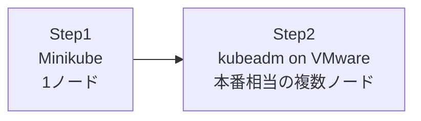

# 学習環境の準備
{: .no_toc }

## 目次
{: .no_toc .text-delta }

1. TOC
{:toc}

---

本教材ではローカルマシンだけで全章を完了します。
学習の進度に応じて **2 段階の環境** を使い分けます。



| 段階 | 用途 | リソース目安 |
|------|------|----------------|
| **Step1: Minikube** | 1〜6章の基礎リソース・ワークロード・ネットワーク・ストレージ・設定 | 4〜8GB RAM |
| **Step2: kubeadm on VMware** | 7章以降の本番運用、CI/CD、可観測性、セキュリティ、SRE | VM 4台、合計 16〜24GB RAM |

ホストPC が 128GB あるので、Step2 は VM 6 台構成(マスター3 + ワーカー3)で **HA構成のkubeadmクラスタ** まで組めます。本教材でも HA 構成での構築を扱います。

## Step1: Minikube の準備

### 必要なソフトウェア

ホスト OS を問わず、以下を入れます。

- **Docker Desktop** または **Docker Engine** (イメージビルド用)
- **Minikube** (ローカル K8s クラスタ)
- **kubectl** (K8s 操作の CLI)
- **Helm** (パッケージマネージャ、後の章で使用)

#### Windows

PowerShell を **管理者権限で** 起動して実行します。
パッケージマネージャの **Chocolatey** か **winget** を使うのが楽です。

**winget (Windows 10/11 標準)**

```powershell
winget install --id=Docker.DockerDesktop -e
winget install --id=Kubernetes.minikube -e
winget install --id=Kubernetes.kubectl -e
winget install --id=Helm.Helm -e
```

**Chocolatey**

```powershell
# Chocolatey未導入なら
Set-ExecutionPolicy Bypass -Scope Process -Force
[System.Net.ServicePointManager]::SecurityProtocol = `
  [System.Net.ServicePointManager]::SecurityProtocol -bor 3072
iex ((New-Object System.Net.WebClient).DownloadString('https://community.chocolatey.org/install.ps1'))

# ツール導入
choco install docker-desktop minikube kubernetes-cli kubernetes-helm -y
```

インストール後、**PCを一度再起動** してください(Docker Desktop の WSL2 連携を有効にするため)。

{: .note }
Docker Desktop は WSL2 バックエンドで動かすのが推奨です。インストール時に「Use WSL 2 instead of Hyper-V」にチェック。
WSL2 自体が未導入なら、PowerShell管理者で `wsl --install` を先に実行してください。

#### macOS / Linux (Homebrew)

```bash
brew install minikube kubectl helm
# Dockerは別途 Docker Desktop or Docker Engine を導入
```

### Minikubeの起動

```bash
minikube start --driver=docker --cpus=4 --memory=8192 --kubernetes-version=v1.30.0
minikube status
kubectl get nodes
```

成功するとこう表示されます。

```
NAME       STATUS   ROLES           AGE   VERSION
minikube   Ready    control-plane   30s   v1.30.0
```

### Minikubeの便利機能

```bash
minikube dashboard                       # ダッシュボード
minikube service <service-name> --url    # Service URL取得
minikube addons enable ingress           # アドオン有効化
minikube stop                            # 停止
minikube delete                          # 削除
```

## Step2: VMware Workstation で kubeadm クラスタを組む

ここが本教材の **山場** です。
マネージド K8s だけ使っていると見えてこない、コントロールプレーン・etcd・CNI・kubelet の関係が、自分で組むと一気に腑に落ちます。

### VM 構成 (HA構成 推奨)

ホスト PC のメモリが 128GB あるので、潤沢に組みます。

| 役割 | 台数 | vCPU | RAM | Disk |
|------|------|------|-----|------|
| Control Plane | 3 (HA) | 2 | 4GB | 40GB |
| Worker | 3 | 2 | 4GB | 40GB |
| LB (HAProxy + keepalived) | 1 | 1 | 1GB | 20GB |
| (任意) NFSサーバ | 1 | 1 | 2GB | 50GB |

### ネットワーク設計

VMware Workstation の「カスタム VMnet (Host-only)」で、すべての VM を同じセグメントに置きます。

| ホスト名 | IP | 役割 |
|----------|-----|------|
| k8s-lb | 192.168.56.10 | API Server VIP は 192.168.56.10 |
| k8s-cp1 | 192.168.56.11 | Control Plane #1 |
| k8s-cp2 | 192.168.56.12 | Control Plane #2 |
| k8s-cp3 | 192.168.56.13 | Control Plane #3 |
| k8s-w1 | 192.168.56.21 | Worker #1 |
| k8s-w2 | 192.168.56.22 | Worker #2 |
| k8s-w3 | 192.168.56.23 | Worker #3 |
| k8s-nfs | 192.168.56.30 | NFSサーバ (任意) |

### Ubuntu VMテンプレートの初期設定

各 VM 共通で実行する初期設定です。詳細は 7 章 [kubeadmで自前クラスタ構築]({{ '/07-production/kubeadm/' | relative_url }}) で扱いますが、ここでは骨子だけ示します。

```bash
# Swap 無効化 (kubelet が嫌うため必須)
sudo swapoff -a
sudo sed -i '/ swap / s/^\(.*\)$/#\1/g' /etc/fstab

# カーネルモジュール
cat <<EOF | sudo tee /etc/modules-load.d/k8s.conf
overlay
br_netfilter
EOF
sudo modprobe overlay
sudo modprobe br_netfilter

# sysctl
cat <<EOF | sudo tee /etc/sysctl.d/k8s.conf
net.bridge.bridge-nf-call-iptables  = 1
net.bridge.bridge-nf-call-ip6tables = 1
net.ipv4.ip_forward                 = 1
EOF
sudo sysctl --system
```

VMware の **テンプレート → リンククローン** 機能を使うとディスク領域が節約できて便利です。
テンプレートをこの状態でクローンしておけば、7台分の準備が一気に終わります。

### VMware Workstation の Tips

- **スナップショット** を取りながら進める。失敗してもロールバックすれば学び直せます
- **共有フォルダ** (Shared Folders) で `/host` にホストPCのファイルを見せると、YAMLの編集が楽
- **メモリ予約** (Reserve all guest memory) は本番感を出すならオン、ホスト PC を他用途と兼用するならオフ
- **CPU 仮想化機能 (VT-x/AMD-V) のパススルー** を有効化(BIOSとVMの両方)

### Windowsホスト特有の注意

- **Hyper-V と WSL2 と VMware Workstation の共存**: VMware Workstation 16.x 以降は Hyper-V/WSL2 と共存できますが、Workstation Pro 17 以降を推奨
- **メモリ予約**: Windows は他のアプリでメモリを潤沢に使うので、VM 用 RAM は「ホスト全体の60%」程度に抑える(128GB なら 80GB ほど)
- **VM の保存場所**: NVMe SSD 上に置くこと。HDD だと etcd の I/O が遅すぎてクラスタが安定しません
- **ファイル共有**: Windows ホスト上の YAML を VM に渡すなら、Shared Folders、または **VS Code Remote-SSH 拡張** で VM に直接接続して編集するのが快適
- **改行コード**: Windows の改行 (CRLF) のままシェルスクリプトを VM 上で実行すると `\r` で死ぬので、`.gitattributes` で `* text=auto eol=lf` を設定するか、エディタで LF 保存
- **VMware Workstation Player は HA 構成に不向き**: VM 数の制限や自動起動機能がない場合があるので、Workstation Pro を推奨

### コンテナランタイム + kubeadm のインストール

(7 章で詳細に扱うため、ここでは抜粋)

```bash
sudo apt-get update && sudo apt-get install -y containerd
sudo mkdir -p /etc/containerd
containerd config default | sudo tee /etc/containerd/config.toml
sudo sed -i 's/SystemdCgroup = false/SystemdCgroup = true/' /etc/containerd/config.toml
sudo systemctl restart containerd

curl -fsSL https://pkgs.k8s.io/core:/stable:/v1.30/deb/Release.key | \
  sudo gpg --dearmor -o /etc/apt/keyrings/kubernetes-apt-keyring.gpg
echo 'deb [signed-by=/etc/apt/keyrings/kubernetes-apt-keyring.gpg] \
  https://pkgs.k8s.io/core:/stable:/v1.30/deb/ /' | \
  sudo tee /etc/apt/sources.list.d/kubernetes.list
sudo apt-get update
sudo apt-get install -y kubelet kubeadm kubectl
sudo apt-mark hold kubelet kubeadm kubectl
```

### イメージレジストリをローカルに用意する

クラウドを使わない方針なので、コンテナイメージはローカルレジストリに置きます。
シンプルにDocker Hub互換のレジストリを 1 台用意するパターンを採用します。

```bash
# どこかのVM (例: k8s-lb)上で
docker run -d --restart=always --name registry -p 5000:5000 \
  -v /var/lib/registry:/var/lib/registry \
  registry:2
```

各ノードからは `192.168.56.10:5000` で push/pull できます(HTTP使用なので `containerd` 設定で `insecure_registries` を許可)。

## 動作確認

ここまでで Minikube が動いていれば、最後に確認だけ。

```bash
kubectl version --client
kubectl get nodes
kubectl get pods -A
```

`kube-system` に CoreDNS や kube-proxy が Running なら OK です。

## チェックポイント

- [ ] Minikube を起動して `kubectl get nodes` が通る
- [ ] `kubectl get pods -A` で `kube-system` の Pod がすべて Running になる
- [ ] VMware Workstation の Ubuntu VM テンプレートを 1 台用意できた(本格構築は 7 章)
- [ ] ローカルレジストリ用の VM を 1 台立てる構成がイメージできる
