# VM・Docker・Kubernetes
{: .no_toc }

## 目次
{: .no_toc .text-delta }

1. TOC
{:toc}

---

## このページのゴール

VM・Docker・Kubernetes は「仮想化」という共通の文脈で語られますが、それぞれが **抽象化するレイヤーが違います**。
このページでは:

- 物理サーバ・VM・コンテナの **隔離技術の違い** を、Linuxカーネルレベルから理解する
- Docker と containerd と CRI と Kubernetes の関係を **歴史的経緯ごと** に押さえる
- Pod・コンテナ・Linux プロセスの関係を Linux 機能(namespace, cgroups)と紐付けて理解する
- 「**いつVMで、いつコンテナで、いつKubernetesか**」を判断できるようになる
- 「Pod が使い捨て」という考え方の背景にある **Immutable Infrastructure** の思想を理解する

理論編なのでまだ手を動かしません。後の章でこれらを実際に触ります。

---

## 1. 隔離技術の歴史 ─ なぜ仮想化が必要なのか

### 1-1. 物理サーバ時代の問題

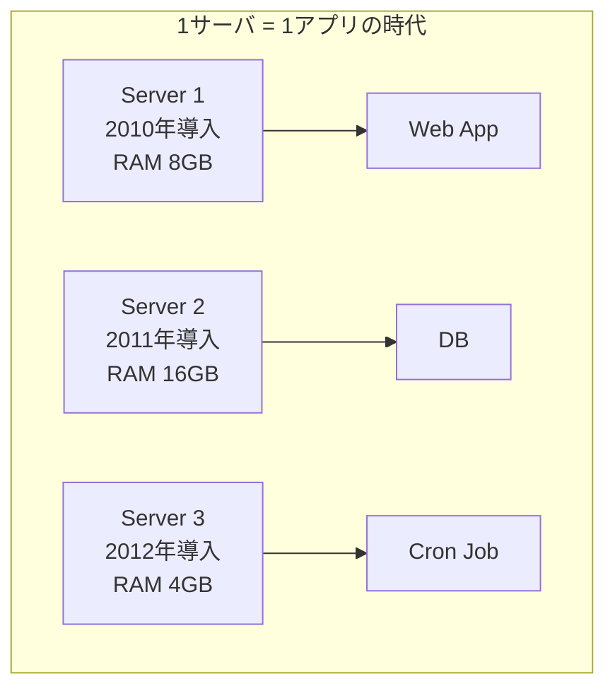

なぜ1サーバ1アプリだったのか?

**理由1: アプリ間の干渉問題**

サーバAでメモリリークが起きたら、同居しているサーバBのアプリも巻き添えで落ちる。
そのため運用者は「**信頼できないものは同居させない**」というルールを徹底していました。

**理由2: 設定の干渉**

PHP 5系を使う Web アプリと、PHP 7系を使う Web アプリは同居できない(共有ライブラリの依存)。
1サーバに1アプリにしておけば、アプリごとに自由に環境を選べる。

**理由3: 障害切り分けの容易さ**

「サーバBが重いのは、サーバBのアプリのせい」と即断できる。複数アプリ同居だと原因切り分けに時間がかかる。

**結果として**:

- リソース利用率は平均 **5〜15%** (ピーク用に余裕を持たせるため)
- 100台のサーバを買って、平均的に使われているのは10台分相当
- データセンターの電気代の大半が「使われていない CPU」に消費される

### 1-2. ハードウェア仮想化 (VM) の登場

VMware ESX (2001), Xen (2003), KVM (2007) などが、1台の物理サーバ上に **完全な仮想マシン** を作る技術を提供しました。

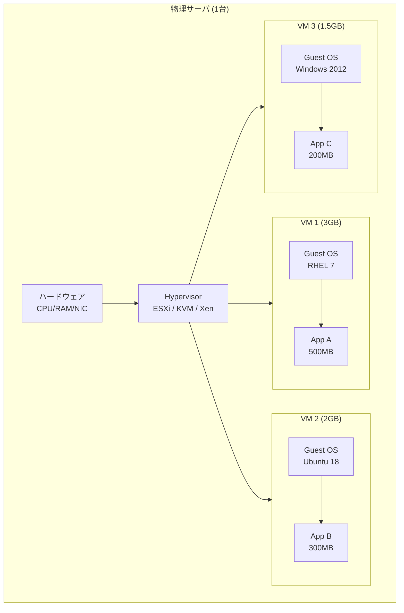

#### Hypervisor の仕組み

CPU の **VT-x (Intel) / AMD-V (AMD)** といったハードウェア機能を使って、Guest OS が「自分は専用ハードウェアで動いている」と錯覚させる。

- メモリは Hypervisor が **EPT (Extended Page Tables)** で各 VM に分割
- CPU は Hypervisor が **タイムスライス** で配分
- ディスク・ネットは仮想デバイスで提供

Hypervisor には2タイプあります:

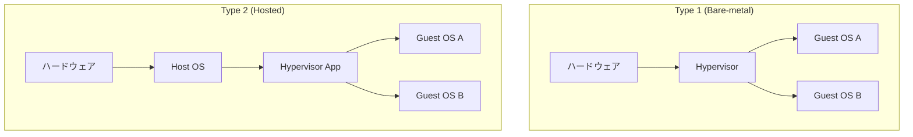

| 種類 | 例 | 用途 |
|------|------|------|
| Type 1 | VMware ESXi, Xen, KVM, Hyper-V | データセンター本格運用 |
| Type 2 | VMware Workstation, VirtualBox | 開発者のラップトップ |

本教材では **VMware Workstation (Type 2)** を使います。これは Windows ホスト上で複数の VM を動かして Kubernetes クラスタを組むため。

#### VM の利点

| 利点 | 内容 |
|------|------|
| 強い隔離 | カーネルが別、メモリ空間が完全分離 |
| OS の選択自由 | Linux と Windows を同居可能 |
| 既存資産との互換性 | 既存アプリをそのまま VM に持ち込める |
| ライブマイグレーション | 動作中の VM を別物理ホストに移動 |

#### VM の欠点

| 欠点 | 内容 |
|------|------|
| OS分のオーバーヘッド | Guest OS だけで数百MB〜数GBのメモリ |
| 起動時間 | 数十秒〜数分(BIOS → kernel → init → アプリ) |
| イメージサイズ | OS込みで数GB〜数十GB |
| 「VMの中の環境構築」は依然必要 | OS、ライブラリ、設定…結局これが大変 |

リソース効率は物理時代より格段に良くなりましたが、**「アプリを軽快にデプロイ」** という点ではまだ重い。

### 1-3. コンテナ ─ OSレベル仮想化

コンテナの基本思想は「**OS は1つで十分、プロセスだけ分離すればいい**」というものです。

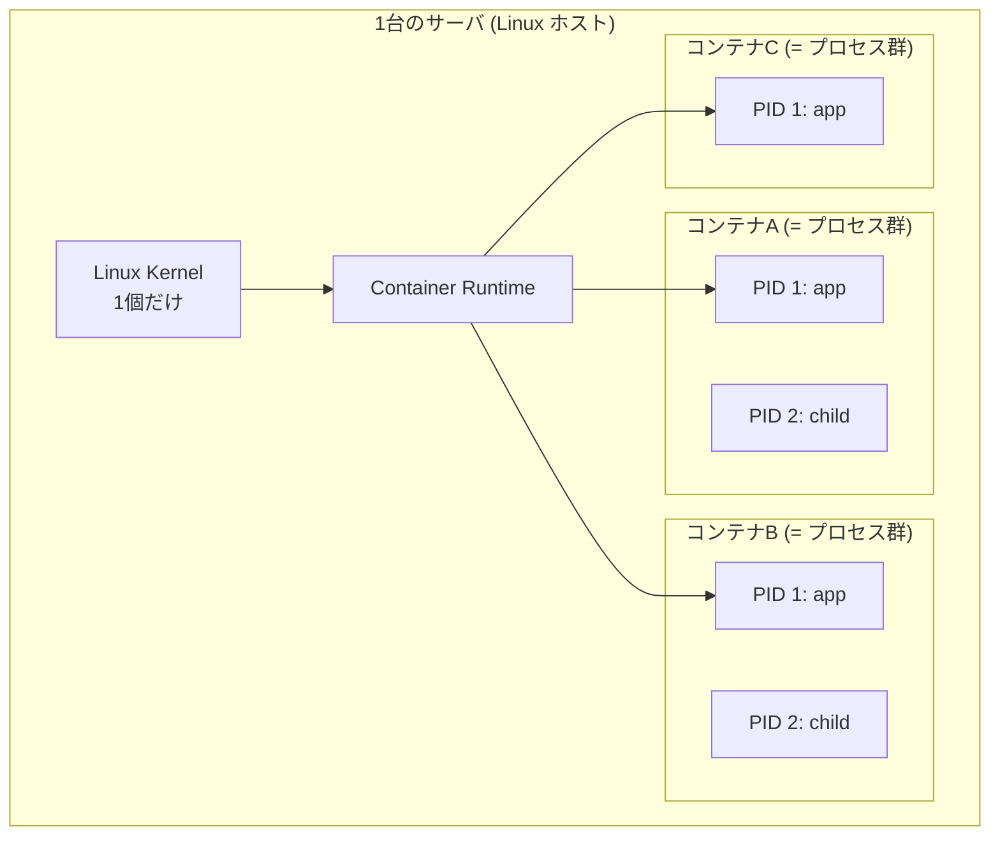

「コンテナの中で `ps` を打つと自分のプロセスしか見えない」のは、**namespace** という Linux カーネル機能で見え方を分離しているから。
実際のホストOSから見れば、すべて同じカーネルの上の **ただのプロセス** です。

### 1-4. コンテナを支える Linux カーネル機能

コンテナは魔法ではなく、**Linux カーネルの既存機能の組み合わせ** で実現されています。
これを知っておくと「なぜそうなるのか」が腑に落ちます。

#### 1-4-1. namespace (名前空間) ─ 見える世界を分離

Linux には **8種類の namespace** があり、それぞれ別のリソースを分離します。

| namespace | 分離するもの | 効果 |
|-----------|--------------|------|
| **PID** | プロセスID空間 | コンテナ内では PID 1 から始まる |
| **NET** | ネットワークスタック | 独自の IP アドレス・ポート空間 |
| **MNT** | マウントポイント | 独自のファイルシステム見え方 |
| **UTS** | ホスト名 / ドメイン名 | コンテナごとに hostname を持てる |
| **IPC** | プロセス間通信 (SysV IPC, POSIX キュー) | shmget 等が分離 |
| **USER** | UID/GID | コンテナ内 root がホストの一般ユーザーにマップ |
| **CGROUP** | cgroup 階層の見え方 | (cgroup v2で重要) |
| **TIME** | (Linux 5.6+) システムクロック | 一部用途で使用 |

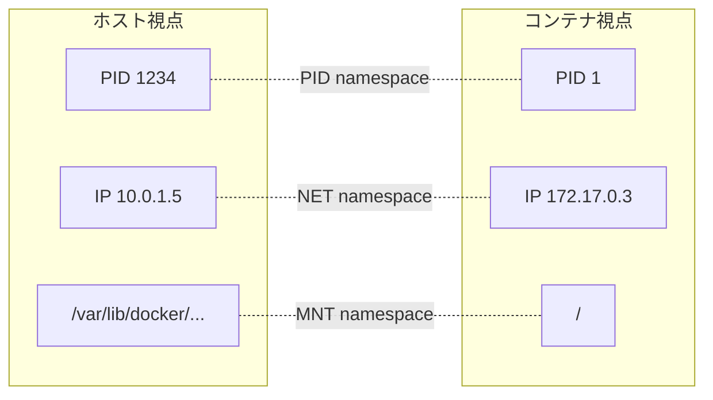

実例: コンテナ内で `ps aux` を打つと自分のプロセスしか見えませんが、ホストから `ps aux` で見るとコンテナのプロセスも他のプロセスと一緒に並んで見えます。
**実体は同じ Linux のプロセス**で、見え方だけが違うのです。

#### 1-4-2. cgroups (Control Groups) ─ リソース上限を設定

namespace が「見える世界」を分けるのに対し、cgroups は **「使えるリソースを制限」** します。

| サブシステム | 制限できるもの |
|--------------|----------------|
| cpu | CPU 使用率の上限・優先度 |
| memory | メモリ使用量の上限(超過で OOM Kill) |
| blkio | ブロックI/O 帯域 |
| pids | プロセス数 |
| net_cls | ネットワーク帯域(qdisc 連携) |
| devices | 使えるデバイス制限 |

これが Kubernetes の `resources.limits` の正体です:

```yaml
resources:
  requests:
    cpu: 100m       # 0.1 vCPU を要求
    memory: 128Mi
  limits:
    cpu: 500m       # 最大 0.5 vCPU まで使える
    memory: 256Mi   # 256Mi 超えで OOM Kill
```

これらの値は最終的に `/sys/fs/cgroup/...` 配下のファイルに書き込まれ、Linux カーネルがリソースを実際に制限します。

#### 1-4-3. capabilities ─ root 権限の細分化

Linux の root 権限は本来 **「全部できる」** という巨大な権限ですが、これを **38種類** の capabilities に細分化できます。

| capability | 内容 |
|------------|------|
| CAP_NET_BIND_SERVICE | 1024未満のポートを bind |
| CAP_SYS_ADMIN | システム管理操作 (mount等) |
| CAP_SYS_TIME | システム時刻変更 |
| CAP_NET_ADMIN | ネットワーク設定変更 |
| CAP_DAC_OVERRIDE | ファイル権限を無視 |

コンテナはデフォルトで **危険な capability を drop** してから起動されます。
Kubernetes の Pod Security Standards で「`drop: [ALL]` してから必要な分だけ追加」がベストプラクティスとされる根拠です(10章で扱う)。

#### 1-4-4. seccomp ─ システムコール制限

`seccomp-bpf` で **どのシステムコールを呼んでよいか** を BPF プログラムで制限可能。
たとえば「このコンテナは `mount` シスコールを呼んだら強制終了」のような設定ができます。

Kubernetes では:

```yaml
spec:
  securityContext:
    seccompProfile:
      type: RuntimeDefault   # ランタイム既定の制限
```

#### 1-4-5. union filesystem (overlay) ─ レイヤー型ファイルシステム

Docker イメージは **複数のレイヤー** からできていて、これを overlay filesystem で重ねて1つのルートディレクトリに見せます。

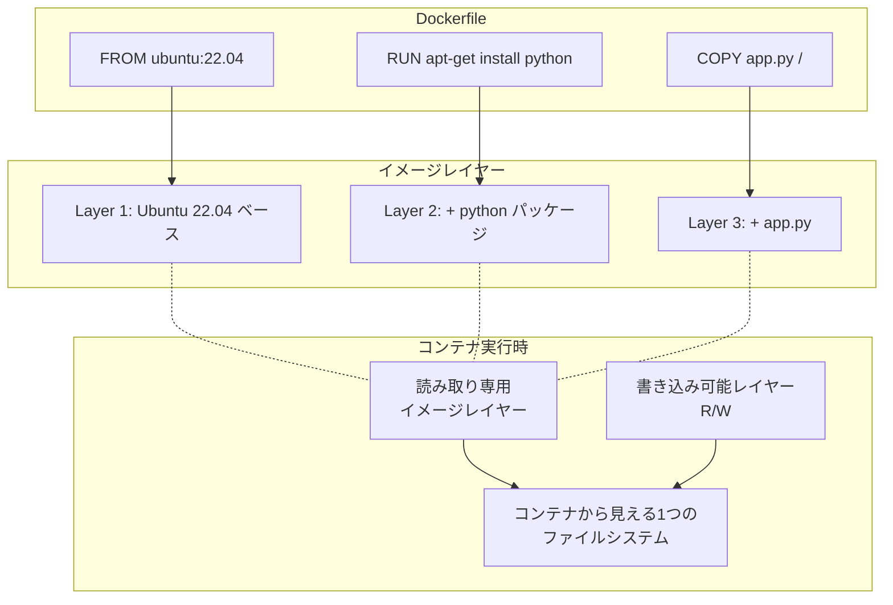

**利点**:
- 同じベースを使うコンテナ間で共有 → ディスク節約
- 差分だけ push/pull → 高速転送
- 不変性 → ベースは絶対変わらない

### 1-5. なぜコンテナが「軽い」のか

VM と比較した「軽さ」の正体:

| 観点 | VM | コンテナ | 理由 |
|------|------|----------|------|
| 起動時間 | 30秒〜2分 | 0.1〜1秒 | VMはBIOS→kernel→initが必要、コンテナはプロセス起動だけ |
| メモリ常駐 | 数百MB〜 | 数MB〜 | OSが要らない |
| イメージサイズ | 数GB〜 | 数十MB〜 | 差分だけ持てる |
| 1ホストあたりの密度 | 数十 | 数百〜千 | 上記の合算結果 |
| 隔離の強さ | 強(別カーネル) | 中(共有カーネル) | トレードオフ |

「**強い隔離が必要な場面ではVM、密度と速度が必要ならコンテナ**」が基本原則です。

---

## 2. 物理 / VM / コンテナの比較表

ここまでをまとめて表で:

| 観点 | 物理サーバ | VM | コンテナ |
|------|------------|------|----------|
| 隔離単位 | 物理マシン | 仮想マシン | プロセス群 |
| OS | 1つ(専有) | 各VMに1つずつ | 1つを共有 |
| カーネル | 1つ | 各VMに別々 | 1つを共有 |
| 起動時間 | 数分(BIOS等) | 数十秒 | 1秒以下 |
| オーバーヘッド | なし | 大(OS分) | 小 |
| 隔離強度 | 物理的(完全) | 仮想化により強 | カーネル機能による中 |
| 1台あたり数 | 1 | 数十 | 数百〜千 |
| ホスト故障時 | 全停止 | ライブマイグレ可 | 別ホストで再起動 |
| OS自由度 | 自由 | 自由(Win/Lin混在可) | ホストカーネル準拠(同じ系列) |
| 主用途 | DB専用、HPC | レガシー、Win/Lin混在 | クラウドネイティブ、マイクロサービス |

---

## 3. コンテナランタイムの世界 ─ Docker, containerd, CRI-O, runc

「Docker 以外にも色々あるらしい」と感じている方への解説です。

### 3-1. ランタイムの階層

コンテナランタイムは **2階層** に分かれています。

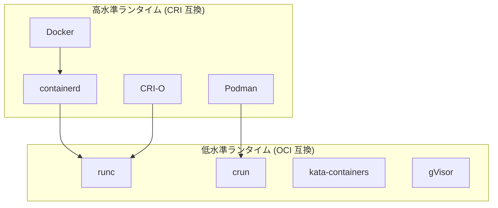

#### 高水準ランタイム

「イメージのpull、コンテナのライフサイクル管理」を担当。
人間や Kubernetes と直接やり取りする側。

| ランタイム | 開発元 | 特徴 |
|-----------|--------|------|
| Docker (Engine) | Docker社 | 最初に普及。CLIも含む全部入り |
| containerd | CNCF | Docker から分離、Kubernetes 標準 |
| CRI-O | Red Hat | Kubernetes 専用、軽量 |
| Podman | Red Hat | デーモンレス、Docker互換CLI |

#### 低水準ランタイム

実際にコンテナプロセスを起動するエンジン。OCI ランタイム仕様に準拠。

| ランタイム | 特徴 |
|-----------|------|
| runc | OCI 標準実装、ほぼ全環境で使用 |
| crun | runc を C で再実装、軽量・高速 |
| kata-containers | 各コンテナを軽量VMでラップ、強い隔離 |
| gVisor | Google製、ユーザー空間カーネルで防御 |

### 3-2. CRI (Container Runtime Interface)

Kubernetes 1.5 (2016年) で導入された、kubelet とランタイムの **標準インターフェース** です。

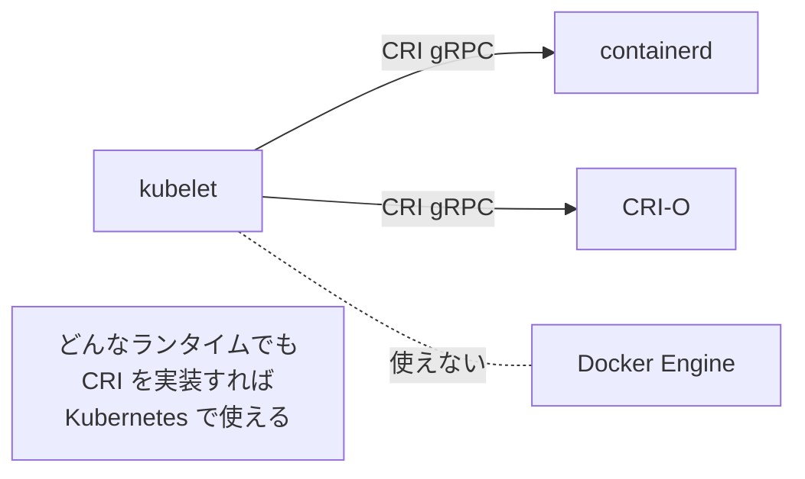

「kubelet が containerd でも CRI-O でも動く」というのは、間に **CRI** という抽象層があるからです。
Kubernetes プロジェクトはこれによって「ランタイムの選択肢を維持しながらメンテナンス負荷を下げる」ことに成功しました。

### 3-3. なぜ Docker 自体は CRI 非対応だったのか

Docker Engine は CRI が登場する **3年前** から存在していたため、独自プロトコル(Docker API)で kubelet と通信していました。
Kubernetes プロジェクトは「dockershim」という変換器を内蔵して対応していましたが:

- メンテナンス負担
- 二重ホップによるパフォーマンス低下
- 機能差(kubelet が要求する一部機能が Docker にない)

の問題があり、2022年 Kubernetes 1.24 で **dockershim 削除** に至りました。

### 3-4. dockershim 削除後の世界

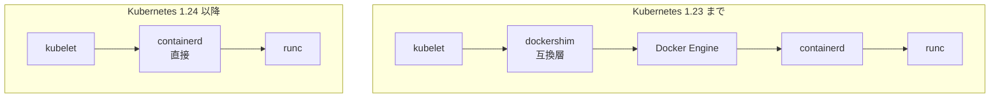

ノード上に Docker Engine をインストールする必要が **なくなりました**(containerd だけあれば十分)。
これは:

- ノードの依存関係が減ってシンプル
- メモリ使用量が削減(Docker のデーモンが不要)
- セキュリティアタックサーフェス縮小

という利点があります。

ただし、**Docker でビルドしたイメージは普通に使える** 点は変わりません。Docker と containerd は OCI イメージ仕様を共有しています。

### 3-5. 開発者の体験は変わったか

ほとんど変わりません:

```bash
# 以前(Kubernetes 1.23以前 + Docker)
docker build -t myapp:1.0 .
docker push registry/myapp:1.0
kubectl set image deploy/web app=registry/myapp:1.0

# 現在(Kubernetes 1.24以降 + containerd ノード)
docker build -t myapp:1.0 .            # ← 開発者ローカルで Docker は使える
docker push registry/myapp:1.0
kubectl set image deploy/web app=registry/myapp:1.0
```

開発者ラップトップでは Docker Desktop を使い続けて構いません。**「Kubernetesのワーカーノードでは containerd」「開発者は Docker」** が現代的な構成です。

### 3-6. 本教材での選択

| レイヤー | 採用 | 理由 |
|----------|------|------|
| 開発者ホスト | Docker Desktop | 普及度・Minikube連携 |
| Minikube | Docker driver | クロスプラットフォーム |
| kubeadm Worker | containerd | Kubernetes 標準 |
| 低水準 | runc | デフォルト |

---

## 4. Pod とコンテナの関係 (重要)

ここは **Kubernetes 初心者が必ず混乱するポイント** なので、しっかり押さえましょう。

### 4-1. Pod とは「コンテナのグループ」

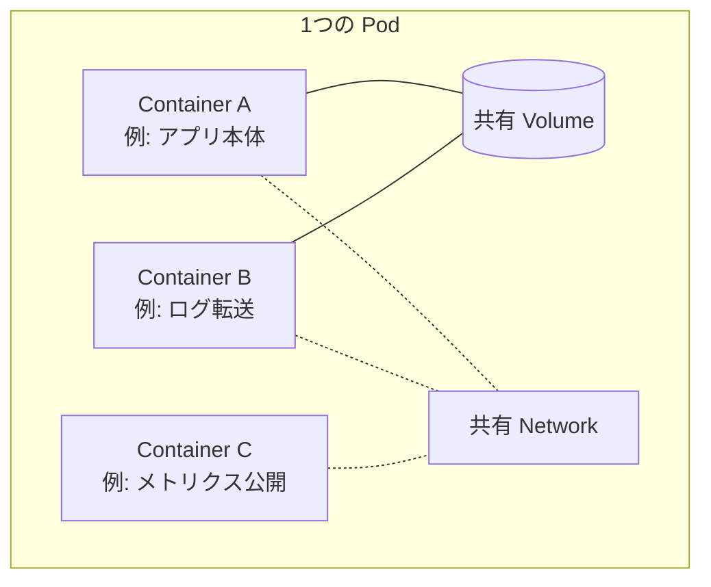

Pod 内のコンテナは:

- **同じノードで動く** (絶対に別ノードに分かれない)
- **同じ IP アドレスを共有** する(ポートだけ違う)
- **localhost で互いに通信** できる
- **同じボリュームをマウント** できる
- **ライフサイクルが連動** する(Pod 全体として起動・停止)

### 4-2. なぜコンテナを束ねる Pod が必要なのか

「1コンテナ = 1Pod じゃダメなの?」という疑問が出ます。

実は **ほとんどのケースで 1Pod = 1Container で運用** されています。
しかし、**密結合な複数コンテナを必ず一緒にデプロイしたい** ケースがあり、その単位として Pod が定義されています。

#### 典型的な複数コンテナPodパターン

##### Sidecar パターン

メインコンテナを補助する役のコンテナを同居:

```yaml
spec:
  containers:
  - name: app
    image: myapp
    volumeMounts:
    - name: logs
      mountPath: /var/log/app
  - name: log-shipper
    image: fluent-bit
    volumeMounts:
    - name: logs
      mountPath: /var/log/app
      readOnly: true
  volumes:
  - name: logs
    emptyDir: {}
```

メインアプリが `/var/log/app/` に書いたログを、サイドカーが読んで外部に転送。

##### Ambassador パターン

外部接続をプロキシ役で代理:

```yaml
spec:
  containers:
  - name: app
    image: myapp
    env:
    - name: DB_HOST
      value: localhost     # ← localhost に繋ぐ
    - name: DB_PORT
      value: "3306"
  - name: db-proxy
    image: mysql-proxy
    # localhost:3306 で受けて、リモートDBに転送
    # TLSも処理
```

##### Adapter パターン

メインアプリの出力を変換:

```yaml
spec:
  containers:
  - name: app
    image: legacy-app   # 古い形式でメトリクス出力
  - name: prometheus-adapter
    image: my-adapter   # それを Prometheus 形式に変換
```

### 4-3. なぜ Linux 視点では Pod は「1つの単位」なのか

Pod 内のコンテナが network namespace と IPC namespace を **共有** しているからです。

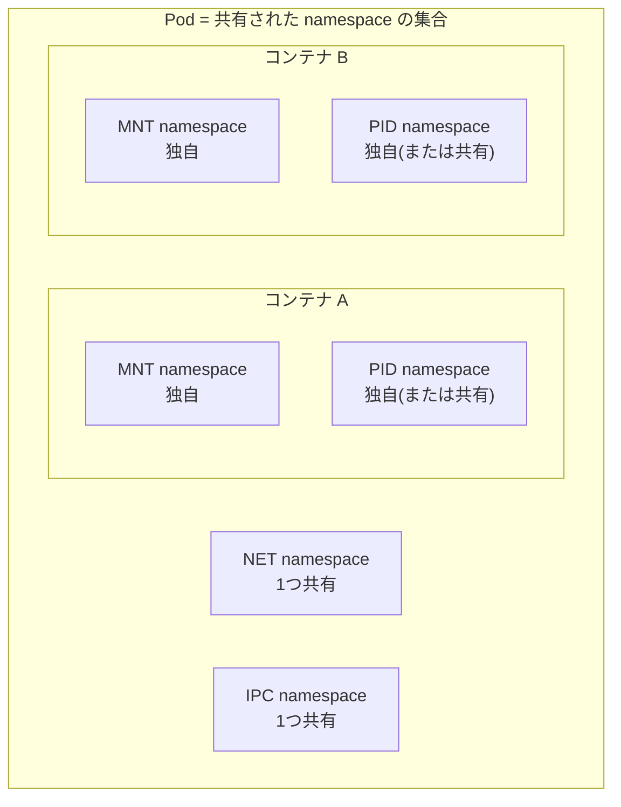

**Pod 内では NET と IPC は共有、MNT は別** がデフォルト。
これにより:
- 同 Pod のコンテナは localhost で通信(NET 共有)
- 同 Pod のコンテナは MNT が別なので、それぞれ独自イメージを使える
- volumes に書けば両者がマウントできる

### 4-4. Pause コンテナという裏方

実は Pod 起動時、Kubernetes は必ず **`pause`** という小さなコンテナを最初に立てています。

```bash
# ノードで crictl ps を打つと
CONTAINER ID  IMAGE                     POD
abc123        nginx:1.27                web-pod
def456        registry.k8s.io/pause:3.9 web-pod   ← これが pause
```

役割:
- Pod の namespace の **オーナー** として君臨
- 他のコンテナが namespace に join する基準点
- メインコンテナが落ちても namespace を保持

`pause` イメージは数百KBで、ほぼ何もしない `pause()` システムコールを呼んで寝ているだけ。

これが Pod の「容器」の正体です。

### 4-5. Pod は「使い捨て」が原則

Kubernetes の Pod には **不変性** という設計原則があります。

| 古い思想 (Pet) | Kubernetes 流 (Cattle) |
|---------------|------------------------|
| サーバに名前を付ける(taro, hanako) | Pod は番号(`web-7d4f8c-x2k9p`) |
| 1台ごとに大事に育てる | 落ちたら新しいの作る |
| 設定変更は SSH で | 新しいイメージをデプロイ |
| 障害復旧は人手で | コントローラが自動再作成 |

#### 不変性を支える原則

1. **永続データは Pod の外**
   - `emptyDir` は Pod 削除で消える
   - `persistentVolumeClaim` で外部ストレージにマウント
   - Pod が消えても PV は残る
2. **設定は外から注入**
   - イメージに焼き込まない
   - ConfigMap / Secret から環境変数や設定ファイルとして渡す
3. **変更はイメージの再ビルド**
   - 稼働中の Pod を編集しない
   - 新イメージを push → Deployment 更新 → 旧Pod捨て、新Pod作成

#### なぜ不変性が重要か

| 利点 | 内容 |
|------|------|
| 再現性 | どの環境でも同じ動き |
| ロールバック容易 | 古いイメージに戻すだけ |
| 並列スケール | 同じイメージを複製するだけ |
| 障害切り分け容易 | 「Pod の中の状態」が予測可能 |
| GitOps 適合 | YAML が「真実の源泉」になる |

これは **Immutable Infrastructure** という思想で、Docker からさらに徹底されたものです。

---

## 5. ネットワークモデルの違い

VM とコンテナでネットワーク扱いが大きく違います。

### 5-1. VM のネットワーク

VM には実機のように **仮想 NIC** が割り当てられ、ホスト OS の Bridge 経由で外部と通信します。

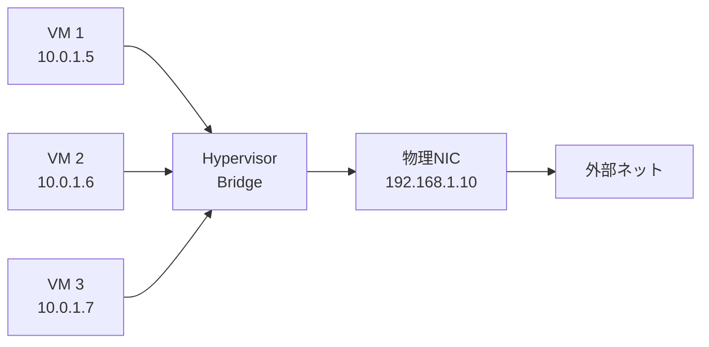

VM 同士は同じセグメントなら直接通信、異なるなら Hypervisor がルーティング。
ほぼ「物理サーバが3台ある」のと同じ感覚で扱えます。

### 5-2. Docker のネットワーク

Docker はデフォルトで `docker0` という Bridge を作り、コンテナはそこに接続:

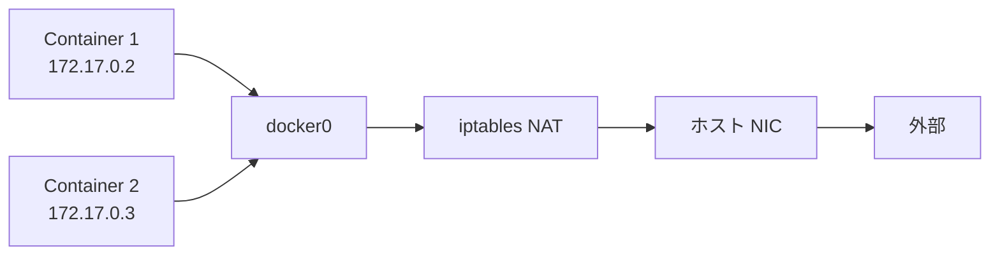

特徴:
- コンテナの IP は **ホストからしか見えない** プライベート IP
- 外部に出る時は **NAT 変換**
- `-p 8080:80` で **ポートフォワード** が必要

「外部からコンテナにアクセスするには、ホストのポートを公開する」という、ちょっと面倒な構造。

### 5-3. Kubernetes のネットワーク

Kubernetes は **「すべての Pod に一意な IP を割り当て、すべての Pod が直接通信できる」** を要件にしています。
これを実装するのが **CNI (Container Network Interface)** プラグイン。

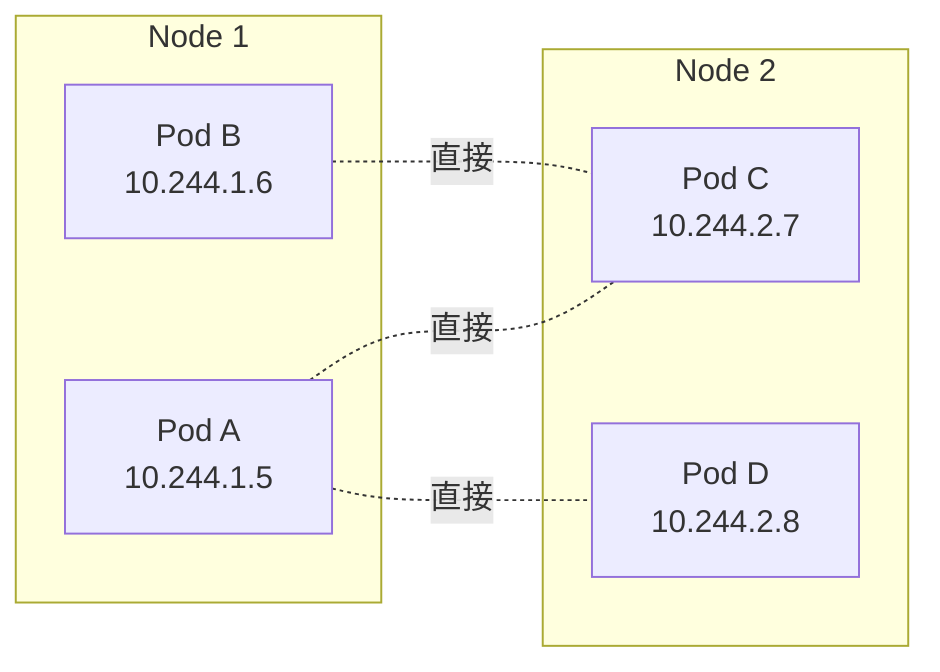

ポイント:

- **NAT なし** : Pod IP のまま通信可
- **ノードをまたいで** Pod が直接通信
- **Pod IP は変わる** (再起動で別IP)が、Service が安定したエンドポイントを提供

代表的な CNI:

| CNI | 特徴 |
|-----|------|
| **Calico** | BGP 又は VXLAN、NetworkPolicy 強い |
| **Cilium** | eBPF 使用、観測性が強い |
| **Flannel** | シンプル、機能控えめ |
| **Weave Net** | 暗号化標準対応 |

本教材では **Calico** を採用(NetworkPolicy 必須なので)。

---

## 6. ストレージモデルの違い

### 6-1. VM のストレージ

VM には **仮想ディスク** が紐付き、Hypervisor が裏で実体ディスク(ファイル / SAN / Ceph 等)に変換します。
Guest OS から見れば普通のディスク。

```
Guest OS → /dev/sda → 仮想ディスク .vmdk ファイル → ホストディスク
```

VM が止まってもディスクは残り、別 VM にマウントもできる。

### 6-2. Docker のストレージ

Docker のコンテナは **デフォルトで使い捨てファイルシステム**(コンテナ削除でデータ消失)。

```bash
# データを残したい場合は明示的に Volume をマウント
docker run -v mydata:/var/lib/postgresql/data postgres:16
```

ボリュームの種類:

| 種類 | 例 | 永続性 |
|------|-----|--------|
| ホストパスマウント | `-v /host/path:/cont/path` | ホストに残る |
| 名前付きボリューム | `-v mydata:/path` | Docker管理領域 |
| tmpfs | `--tmpfs /tmp` | メモリ上、揮発 |

### 6-3. Kubernetes のストレージ

Kubernetes は「**ストレージプロバイダの違いを抽象化** する」のが目的。

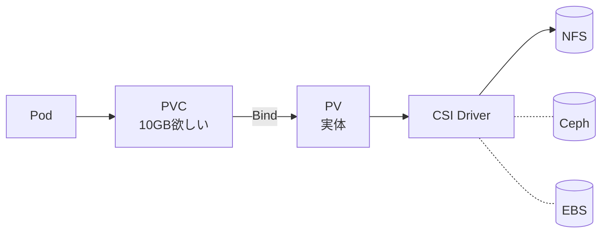

| リソース | 役割 |
|---------|------|
| PV (PersistentVolume) | ストレージの実体への参照 |
| PVC (PersistentVolumeClaim) | Pod が「これだけ欲しい」と要求 |
| StorageClass | 動的プロビジョニングの設定 |
| CSI Driver | 各種ストレージの統一インターフェース |

これにより、Pod の YAML は「PVC で 10GB 要求」とだけ書けば、裏側が NFS だろうが Ceph だろうが EBS だろうが、同じように動きます。
詳細は5章で。

---

## 7. アプリケーションのライフサイクル比較

| 段階 | 物理サーバ | VM | Docker単体 | Kubernetes |
|------|------------|------|------------|------------|
| 環境準備 | OSインストール | VMテンプレートからクローン | イメージ pull | YAML apply |
| 起動 | 数分(BIOS〜) | 数十秒(Guest起動) | 1秒以下 | 1秒以下(Pod) |
| デプロイ | rsync, scp | VM置換 | コンテナ再作成 | ローリングアップデート |
| ロールバック | バックアップから復元 | スナップショット復元 | 旧イメージ起動 | `kubectl rollout undo` |
| スケール | サーバ手配 | VM クローン作成 | docker compose scale | replicas 変更 |
| 障害復旧 | 手動 | 手動 or HA構成 | restart=always | 自動再作成 |
| 設定変更 | SSH 編集 | SSH or テンプレ更新 | env 再起動 | ConfigMap更新 → 再起動 |

ライフサイクル全体で「**人間の介入が減り、自動化が進む**」のが Kubernetes 化の本質です。

---

## 8. いつ何を使うか ─ 判断基準

### 8-1. VM が向くケース

- **強い隔離** が要求される(マルチテナント、コンプラ要件)
- **Linux と Windows の混在** が必要
- **レガシーアプリ** で OS バージョン固定されている
- **カーネルレベル操作** が必要(専用ドライバ、ハイパーバイザレベルのフック)
- データセンター運用、エッジコンピューティング

### 8-2. Docker(単独)が向くケース

- **個人開発・学習** 環境
- **小規模ステートレスアプリ**(1〜数台で完結)
- **CI/CDのビルド環境**
- **試作・検証**

### 8-3. Kubernetes が向くケース

- **マイクロサービス** 構成(数十のサービス)
- **本番運用** で高可用性が要件
- **トラフィック変動が大きい** ECサイト等
- **複数チーム** で共有インフラ
- **DevOps / SRE** 体制を作りたい

### 8-4. 「過剰投資」を避ける視点

「とりあえず Kubernetes」は **アンチパターン** です。

| アプリ規模 | 推奨 |
|-----------|------|
| 1サービス、月数千リクエスト | Docker / VPS |
| 数サービス、月数万リクエスト | Docker Compose / マネージドコンテナ (ECS Fargate) |
| 10以上サービス、月数百万リクエスト | Kubernetes |

ただし「**学習投資**」としての Kubernetes はキャリア観点で価値が高いので、本教材で勉強する価値は十分あります。

---

## 9. 本教材での三段階構成

本教材では **3階層の仮想化** を駆使します。

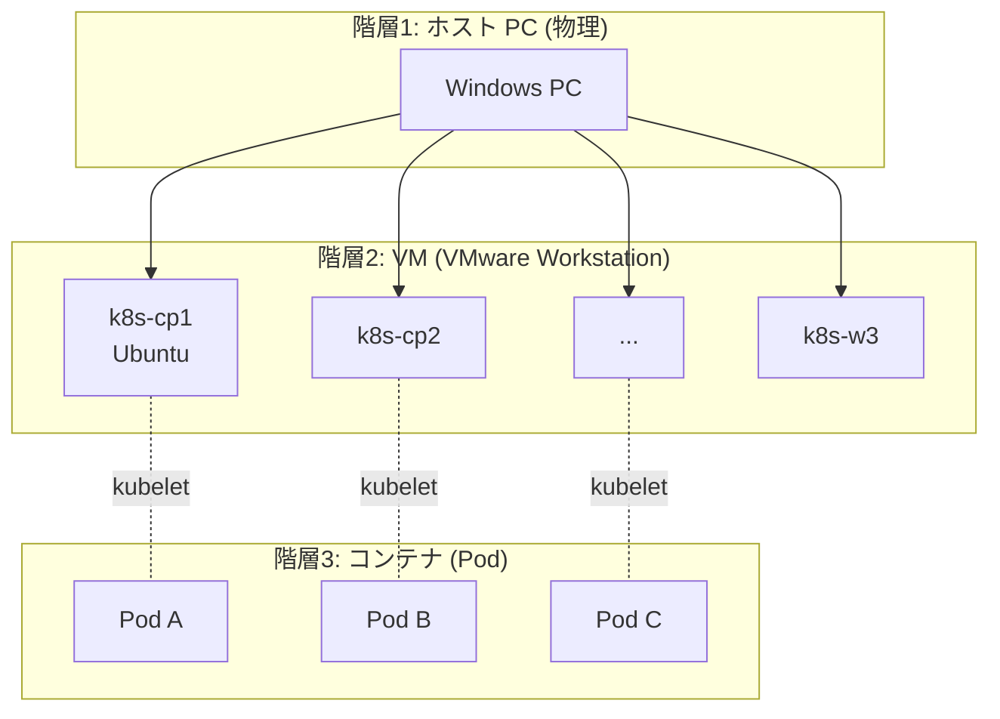

なぜこんなに重ねるのか?

**理由1: 本番に近い経験**

本番では複数の物理ホストに Kubernetes クラスタが分散している。これを再現するには複数 VM が必要。

**理由2: 障害シミュレーション**

「VMを1台シャットダウン → ノード障害」という練習が手元でできる。物理サーバを引っこ抜くわけにはいかない。

**理由3: クラウドを使わない**

EKS/GKE で立てれば一瞬ですが、本教材の方針は「クラウドに頼らずローカル完結」。
理由は1.1で説明した通り、内部理解を重視するため。

---

## 10. このページのまとめ

### 10-1. 学んだこと

- 隔離技術は **物理 → VM → コンテナ** と進化、それぞれ抽象化する層が違う
- コンテナは **Linux カーネル機能(namespace, cgroups, capabilities, seccomp, overlay)の組み合わせ**で実現
- Pod は「**密結合な複数コンテナの単位**」で、namespace の共有粒度が定義
- Pod は **使い捨て**(Cattle 思想)、永続データと設定は外出し
- Docker と containerd と CRI-O の関係、dockershim 削除の経緯
- Kubernetes のネットワーク・ストレージ・ライフサイクルの特徴
- どれをいつ使うかの判断基準

### 10-2. チェックポイント

- [ ] VM とコンテナの隔離強度の違いを Linux カーネルレベルで説明できる
- [ ] namespace と cgroups の役割の違いを言える
- [ ] Pod が「コンテナの上の抽象」である理由を pause コンテナを含めて説明できる
- [ ] dockershim 削除後でも、Docker でビルドしたイメージが使える理由
- [ ] Kubernetes と Docker が **競合関係にない** ことをレイヤー図で説明できる
- [ ] Cattle 思想と Pet 思想の違い、なぜ Cattle が望ましいか言える
- [ ] CNI (Container Network Interface) の役割を言える
- [ ] 「とりあえず Kubernetes」がアンチパターンになる理由

→ 次は [学習環境の準備 ① Minikube編]({{ '/01-introduction/setup-minikube/' | relative_url }})
