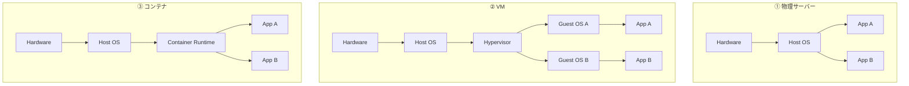
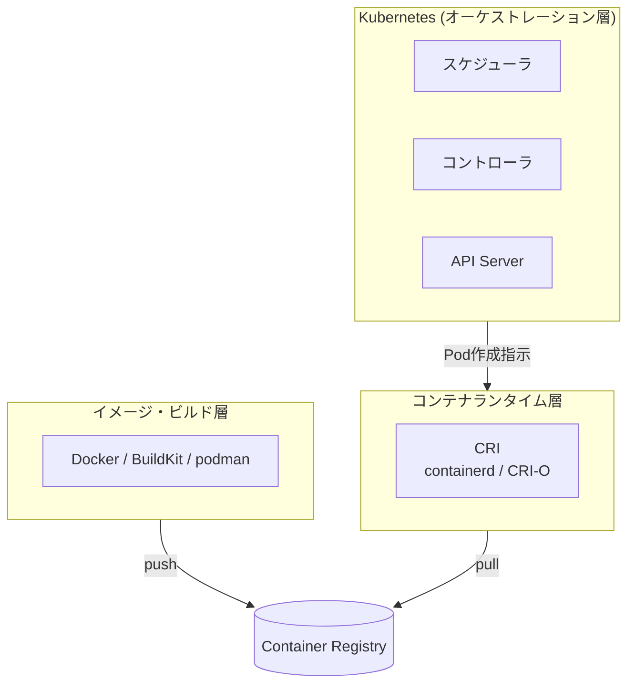
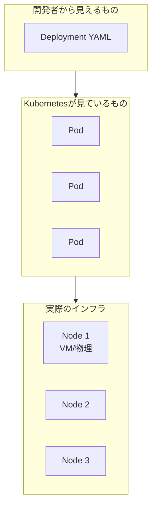

# VM・Docker・Kubernetes
{: .no_toc }

## 目次
{: .no_toc .text-delta }

1. TOC
{:toc}

---

VM・Docker・Kubernetes はそれぞれ「仮想化」と呼ばれる文脈で語られますが、扱う **抽象化のレイヤー** が異なります。
本章ではこの3者の階層関係を整理します。

## 物理サーバー / VM / コンテナ

| 観点 | 物理 | VM | コンテナ |
|------|------|------|----------|
| 隔離単位 | 物理マシン | 仮想マシン (Guest OS込) | プロセス |
| 起動時間 | 数分〜 | 数十秒〜数分 | 数秒以下 |
| オーバーヘッド | なし | 大 (OS分の重複) | 小 |
| 分離強度 | 強 | 強 | 中 (カーネル共有) |
| 1台あたりの密度 | 低 | 中 | 高 |

VM は OS ごと丸ごと仮想化するため重いですが、**カーネルレベルで分離されている** 強みがあります。
コンテナは Linux カーネルの機能 (namespace、cgroups) を使って **1プロセスを隔離する** だけなので軽量ですが、**カーネルは共有** しています。

{: .note }
本教材では VMware Workstation を使って Ubuntu の VM を 4 台立て、その VM の上で kubeadm で Kubernetes クラスタを構築します。
つまり「VM の中でコンテナを動かす」という二重の仮想化構成になります。学習目的としては、各レイヤーの役割が手で触れて理解できる絶好の機会です。

## Docker と Kubernetes の関係

Docker と Kubernetes は競合関係ではなく、**役割が違います**。

役割を整理すると:

- **Docker**: イメージのビルドとローカル実行 (`docker build`, `docker run`)
- **コンテナランタイム**: ノード上で実際にコンテナを起動 (`containerd`, `CRI-O`)
- **Kubernetes**: 多数のノードと多数のコンテナを協調動作させる制御層

{: .note }
かつて Kubernetes はノード上で Docker Engine をランタイムとして利用していましたが、v1.24 以降は **dockershim が削除** され、ランタイムは `containerd` などが直接使われるのが標準です。
ただし **「Docker で作ったイメージが使えない」わけではありません**。Docker が作るイメージは OCI 標準フォーマットなので、`containerd` でもそのまま動きます。

## Kubernetes が抽象化するもの

Kubernetes は VM や Docker よりさらに上のレイヤーで、**「クラスタ」という概念ごと** 抽象化します。

開発者は「どのノードで動くか」を意識する必要がなくなります。
これは **クラウドネイティブ** という考え方の中核で、ハードウェアや VM の個別性を意識せずアプリを書ける、大きな利点です。

## Immutable Infrastructure と Kubernetes

Docker 入門で出てきた **Immutable Infrastructure** の考え方は、Kubernetes でさらに徹底されます。

- Pod は基本的に **使い捨て** (殺されて再作成されることが前提)
- 永続データは Pod の外 (PersistentVolume) に置く
- 設定は ConfigMap / Secret として注入する
- 変更は **新しいイメージをデプロイする** ことで行い、稼働中の Pod は弄らない

「動いているサーバーに SSH して設定を変える」という従来運用は、Kubernetes ではアンチパターンです。

## チェックポイント

- [ ] VM とコンテナの分離強度の違いを説明できる
- [ ] Kubernetes と Docker Engine が排他関係でないことを説明できる
- [ ] Pod が「使い捨て」であることの利点と注意点を挙げられる
