# クラスタアーキテクチャ
{: .no_toc }

## 目次
{: .no_toc .text-delta }

1. TOC
{:toc}

---

## このページのゴール

このページを読み終えると、以下を **自分の言葉で説明できる** ようになります。

- Kubernetes クラスタを構成する **コントロールプレーン(Control Plane)** と **ノード(Worker Node)** の役割分担、そしてなぜそう分かれているのか
- `kube-apiserver` / `etcd` / `kube-scheduler` / `kube-controller-manager` がそれぞれ何を担い、なぜ独立プロセスに分かれているのか(歴史的経緯を含めて)
- ノード側の `kubelet` / `kube-proxy` / コンテナランタイム / CNI / CSI プラグインの役割と、それぞれの **標準化された境界(CRI / CNI / CSI)** の意味
- `kubectl apply` 1 回で API Server → etcd → コントローラ → スケジューラ → kubelet → コンテナランタイムを順に流れていく **リクエストパスの全体像**
- 各コンポーネントの障害が、クラスタ全体の挙動にどう波及するか(API Server が落ちたら? etcd が遅延したら? kubelet が一時停止したら?)
- トラブル時にどのコンポーネントのログ・メトリクスを最初に見るべきか、調査フローを 1 つ持っている

---

## なぜ Kubernetes は「分散したコンポーネントの集合」なのか

Kubernetes クラスタは、単一のバイナリではなく **多数の独立プロセス** から構成されます。これは設計上の選択であり、歴史的な経緯と技術的な根拠があります。

### モノリシックなオーケストレータの限界

第1章で触れたように、Kubernetes の祖先は Google 社内のクラスタマネージャ **Borg**(2003 年〜)です。Borg は単一の中央スケジューラ "BorgMaster" を中心とした構造でしたが、Google は次のステップとして研究プロジェクト **Omega**(2013 年論文 "Omega: flexible, scalable schedulers for large compute clusters", EuroSys 2013)を発表しました。Omega 論文の核心は次の主張でした。

- 中央集権的な単一プロセスにスケジューラ・コントローラ・状態管理をすべて押し込むと、機能追加のたびに肥大化し、テストもデプロイも困難になる
- **共有された一貫性のあるストア** を中心に置き、その周りで複数のコントローラが楽観的並行制御で動く方が、機能ごとの独立進化と全体スループットの両方が伸びる

Kubernetes はこの方針を引き継ぎ、次のような構造になりました。

- 一貫性のあるストアとして **etcd** を採用
- すべてのリクエストの入口として **kube-apiserver** を置き、認証・認可・Admission・スキーマ検証を集約
- スケジューリング、レプリカ数管理、ノード監視など個別のロジックは、**それぞれ独立したコントローラ** として分離
- どのコンポーネントも etcd に直接アクセスせず、必ず API Server を経由

この **「API Server というハブを中心に、個別の責任を持ったスポークが並ぶ」** 構造が、Kubernetes 設計の中核です。Operator パターン、Admission Webhook、Custom Controller など後発の拡張機能はすべて、この構造に「新しいスポークを増やす」形で実現されています。

### マイクロサービスとしてのコントロールプレーン

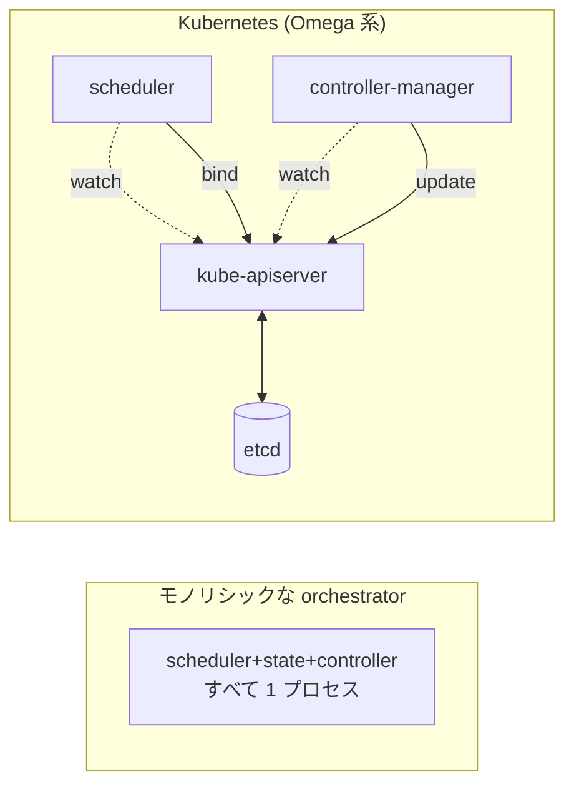

モノリシックな設計では「スケジューラを差し替える」「新しい種類のコントローラを足す」たびに本体を再ビルドする必要がありました。Kubernetes ではこれらが独立したプロセスなので、**運用中のクラスタでスケジューラを別実装に差し替える** ことすらできます(`--scheduler-name` で複数共存も可能)。Karpenter / Volcano / kube-batch のような専用スケジューラがこの形で共存できるのは、この設計の直接の恩恵です。

### 設計原則: ハブ&スポーク

Kubernetes のコンポーネント間通信ルールは、シンプルに次の 3 行で表せます。

1. **kubectl / 利用者 / コントローラ** はすべて kube-apiserver に話しかける
2. **kube-apiserver** だけが etcd と話す
3. **kubelet** は自ノードの状態を kube-apiserver に報告する

この単純さが、コンポーネントを足したいときの自由度に直結します。新しいコントローラを書きたければ「kube-apiserver を watch する Go プロセス」を 1 つ動かすだけで済みます。

---

## 全体アーキテクチャ

クラスタを上から眺めるとこうなります。

```mermaid
flowchart TB
    user[利用者 / kubectl / CI]
    subgraph CP["Control Plane (k8s-cp1, cp2, cp3 など複数台でHA)"]
        api[kube-apiserver]
        etcd[(etcd<br>Raftで複製)]
        sched[kube-scheduler]
        cm[kube-controller-manager]
        ccm[cloud-controller-manager<br>(クラウド環境のみ)]
    end
    subgraph N1["Worker Node 1"]
        kubelet1[kubelet]
        proxy1[kube-proxy]
        cri1[containerd]
        pod1[Pod...]
    end
    subgraph N2["Worker Node 2"]
        kubelet2[kubelet]
        proxy2[kube-proxy]
        cri2[containerd]
        pod2[Pod...]
    end
    subgraph N3["Worker Node N"]
        kubelet3[kubelet]
        proxy3[kube-proxy]
        cri3[containerd]
        pod3[Pod...]
    end
    user -->|HTTPS| api
    api <--> etcd
    sched -. watch .-> api
    cm -. watch .-> api
    ccm -. watch .-> api
    api -. watch / status .-> kubelet1
    api -. watch / status .-> kubelet2
    api -. watch / status .-> kubelet3
    kubelet1 --> cri1 --> pod1
    kubelet2 --> cri2 --> pod2
    kubelet3 --> cri3 --> pod3
```

### Control Plane と Worker Node の役割分担

| レイヤ | 主な役割 | 主なコンポーネント |
|---|---|---|
| Control Plane | クラスタ全体の **意思決定**(どこに何を置くか、何個動かすか、誰の権限はどこまでか) | kube-apiserver / etcd / scheduler / controller-manager |
| Worker Node | 実際にコンテナを **動かす**(指示通りに実行・観測・報告する) | kubelet / kube-proxy / コンテナランタイム / CNI / CSI |

「考える」と「動かす」がきれいに分かれているのがポイントです。Worker Node は Control Plane を信じて動くだけで、自分で意思決定はしません。だからこそ、Worker Node の追加・削除は Control Plane 側の設定変更なしで可能(`kubeadm join` / `kubectl drain && delete node`)になります。

### 「マスター(Master)」という用語について

歴史的に Control Plane は "master" と呼ばれていました。現在は包括性・正確性の観点から **Control Plane** が公式用語です(`master` ロールラベルも 2020 年に `control-plane` に置き換えられました)。本教材でも **Control Plane** で統一します。

```bash
# 現在のロールラベルを確認
kubectl get nodes -o wide
# ROLES 列に "control-plane" と出るのが正解。"master" は古い表記
```

各列の意味:
- `NAME` : ノード名
- `STATUS` : `Ready` / `NotReady` / `Unknown`
- `ROLES` : `control-plane` / `<none>`(Worker)
- `AGE` : クラスタへの参加経過時間
- `VERSION` : kubelet のバージョン
- `INTERNAL-IP` : クラスタ内通信に使う IP
- `OS-IMAGE` / `KERNEL-VERSION` / `CONTAINER-RUNTIME` : ノード OS とランタイム

---

## コントロールプレーンの構成要素

### kube-apiserver

**クラスタへの唯一の入口** です。`kubectl`、コントローラ、kubelet、すべてここと HTTPS で通信します。受け取ったリクエストを次の順で処理し、最終的に etcd に保存します。

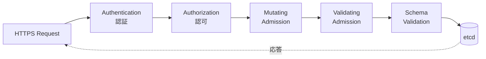

各ステージの責任:

- **Authentication(認証)** : リクエスト送信者が「誰なのか」を確定する。証明書(client cert)/ Bearer Token / Service Account Token / OIDC など複数方式に対応。Kubernetes 自身はユーザーアカウントの DB を持たず、外部 IdP を信頼するモデル
- **Authorization(認可)** : その人が「何をしてよいか」を判定する。RBAC が標準。Role / ClusterRole / RoleBinding / ClusterRoleBinding をチェック。`Node` 認可(kubelet 専用)・`ABAC`(歴史的)・`Webhook`(外部判定)も併用可
- **Mutating Admission** : リクエストを **書き換える** プラグイン群。例: `DefaultStorageClass` が PVC に既定 StorageClass を埋める、サイドカー注入(Istio や Linkerd)、`PodNodeSelector` が Namespace 既定の nodeSelector を Pod に挿す
- **Validating Admission** : リクエストを **拒否する** プラグイン群。例: `LimitRanger` が `resources` 不足を弾く、`PodSecurity` が特権 Pod を拒否、`ResourceQuota` が Namespace 上限を超えたリクエストを拒否
- **Schema Validation** : OpenAPI スキーマと照合し、未知のフィールドや型違反をはじく
- **etcd 永続化** : 検証を通ったオブジェクトを etcd に保存。これで初めて「リソースが存在する」状態になる

#### なぜ kube-apiserver は「ステートレス」と呼ばれるか

kube-apiserver は自分自身に状態を持ちません。**全ての永続状態は etcd 側にあり**、API Server は等価なインスタンスを 3 台でも 5 台でも並べられます。これが HA 構成(本教材の k8s-cp1/cp2/cp3 が並列で同等の役割を持つ)を可能にしています。クライアント(kubectl 等)は HAProxy や VIP 経由で任意の API Server に到達すれば、同じ結果が返ってきます。

API Server 自体は **書き込みキャッシュ** と **watch キャッシュ** を持つので、厳密に言えば完全ステートレスではありませんが、これらは etcd から再構築可能なため、再起動で消えても問題ありません。

#### 主要な起動オプション(本番でよく見るもの)

```bash
kube-apiserver \
  --advertise-address=192.168.56.11 \
  --secure-port=6443 \
  --etcd-servers=https://192.168.56.11:2379,https://192.168.56.12:2379,https://192.168.56.13:2379 \
  --service-cluster-ip-range=10.96.0.0/12 \
  --authorization-mode=Node,RBAC \
  --enable-admission-plugins=NodeRestriction,PodSecurity,ResourceQuota,LimitRanger,ServiceAccount,DefaultStorageClass,DefaultIngressClass,MutatingAdmissionWebhook,ValidatingAdmissionWebhook \
  --audit-log-path=/var/log/kube-apiserver/audit.log \
  --audit-log-maxage=30 \
  --audit-log-maxbackup=10 \
  --audit-log-maxsize=100 \
  --audit-policy-file=/etc/kubernetes/audit-policy.yaml \
  --tls-cert-file=/etc/kubernetes/pki/apiserver.crt \
  --tls-private-key-file=/etc/kubernetes/pki/apiserver.key \
  --client-ca-file=/etc/kubernetes/pki/ca.crt \
  --service-account-issuer=https://kubernetes.default.svc.cluster.local \
  --service-account-signing-key-file=/etc/kubernetes/pki/sa.key \
  --feature-gates=...
```

各オプションの意味:

- `--advertise-address` : 他のコンポーネントに通知する自分の IP。HA では VIP ではなく自ノードの IP を入れる
- `--secure-port=6443` : TLS 受付ポート。`8080` の HTTP は廃止済(本番でも開けない)
- `--etcd-servers` : etcd エンドポイント。3 台以上を必ずカンマ区切りで(1 台に偏らせない)
- `--service-cluster-ip-range` : Service の Cluster IP に割り当てる範囲。第4章 Service で詳述
- `--authorization-mode=Node,RBAC` : 認可プラグインの順。**Node 認可** は kubelet が自ノードの Pod 情報のみ読めるよう制限する重要な仕組み
- `--enable-admission-plugins` : 有効化する Admission プラグイン。`NodeRestriction` と `PodSecurity` は本番必須
- `--audit-log-path` / `--audit-policy-file` : 監査ログ。**本番ではほぼ必須**
- `--tls-cert-file` / `--tls-private-key-file` : API Server 自身の TLS 証明書(クライアントから見たサーバ証明書)
- `--client-ca-file` : クライアント証明書認証で信頼する CA
- `--service-account-issuer` / `--service-account-signing-key-file` : Service Account Token を JWT として署名する鍵

これらは kubeadm では `/etc/kubernetes/manifests/kube-apiserver.yaml` に Static Pod として置かれており、ファイル編集で変更できます(kubelet が自動再起動)。

{: .warning }
> `--audit-log-path` を指定しない API Server は、誰がいつ何を変えたかが残らないため、本番では絶対に避けてください。インシデント調査で詰みます。

#### Admission Controller の代表例

| プラグイン | 種別 | 役割 |
|---|---|---|
| `NodeRestriction` | Validating | kubelet が他ノードの Pod を編集できないよう制限 |
| `PodSecurity` | Validating | Pod Security Standard(Restricted/Baseline/Privileged)で Pod を判定 |
| `ResourceQuota` | Validating | Namespace の使用量上限超過を拒否 |
| `LimitRanger` | Mutating + Validating | requests / limits の既定値を埋め、上限を超えるものを拒否 |
| `ServiceAccount` | Mutating | Pod に default Service Account をひも付け |
| `DefaultStorageClass` | Mutating | PVC に StorageClass が無ければ default を埋める |
| `DefaultIngressClass` | Mutating | Ingress に IngressClass が無ければ default を埋める |
| `MutatingAdmissionWebhook` | Mutating | 外部 Webhook を呼び出して書き換えさせる(Istio sidecar 注入など) |
| `ValidatingAdmissionWebhook` | Validating | 外部 Webhook で検証(OPA Gatekeeper など) |
| `PodSecurityPolicy`(削除済) | Validating | 旧 PodSecurity。1.25 で削除 |

ここに自前の Webhook を `MutatingAdmissionWebhook` / `ValidatingAdmissionWebhook` で挿し込むのが、Kubernetes の **拡張ポイントの中で最強** です。Sidecar 注入、ラベル必須化、ネーミング規則の強制、なんでもできます。

### etcd

クラスタの **全状態を保持する分散 KVS** です。Pod の定義から Secret の中身まで、すべてここに JSON / Protobuf 形式で入ります。**etcd が壊れる = クラスタが壊れる** に等しい重要なコンポーネントです。

#### なぜ etcd なのか(他の選択肢との比較)

| 候補 | 採用しなかった理由 |
|---|---|
| MySQL / PostgreSQL | 強整合だがスキーマ変更が重い、watch がない |
| Redis | 永続化が弱い、整合性モデルが弱い |
| Consul | 選択肢としては近かったが、Raft 実装の品質と Go ネイティブで etcd が選ばれた |
| ZooKeeper | Java 依存、運用コストが高い |
| Cassandra | Eventual Consistency。Kubernetes は強整合が必要 |

etcd は **Raft アルゴリズム** で複数台間の合意を取り、**Linearizable Read** が可能な強整合 KVS です。`watch` API が標準で備わり、変更を即座にクライアント(API Server)に通知できます。Go 実装でビルドが軽く、Kubernetes と同じエコシステムで運用しやすい点も大きな決め手でした。

#### Raft の最低限の理解

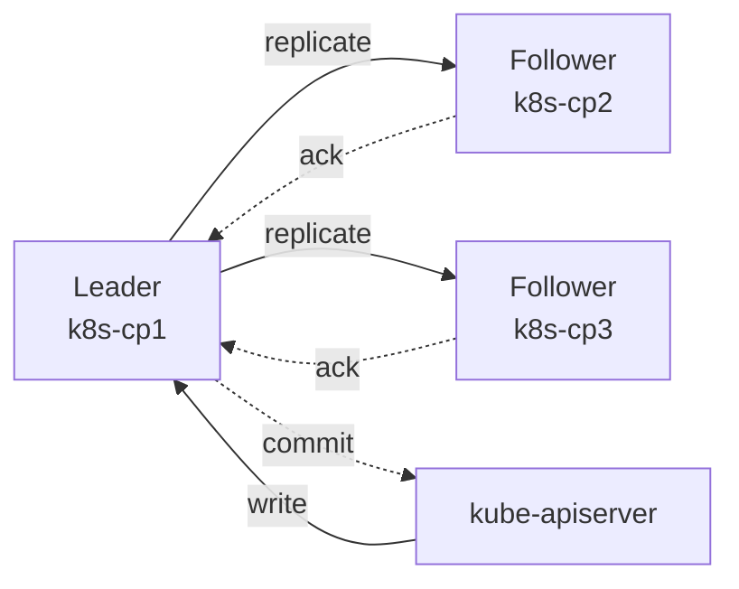

- 1 つのリーダーがすべての書き込みを受け付け、フォロワーに複製する
- 過半数(quorum)が ack したら commit
- **3 台で 1 台落ちても OK、5 台で 2 台落ちても OK** だが、**過半数を割ると書き込み停止**(読み取りは Linearizable でなければ可能)
- だから本番では **奇数台(3 / 5 / 7)** で構成する。偶数台は耐障害性が向上しないのに quorum が増える分だけ不利

| 台数 | quorum | 許容失敗 |
|---|---|---|
| 1 | 1 | 0 |
| 3 | 2 | 1 |
| 5 | 3 | 2 |
| 7 | 4 | 3 |

本教材の VMware 環境では `k8s-cp1/cp2/cp3` の 3 台で etcd が動きます。

#### バックアップとリストア

```bash
# スナップショット取得 (k8s-cp1 上で実行)
ETCDCTL_API=3 etcdctl \
  --endpoints=https://127.0.0.1:2379 \
  --cacert=/etc/kubernetes/pki/etcd/ca.crt \
  --cert=/etc/kubernetes/pki/etcd/server.crt \
  --key=/etc/kubernetes/pki/etcd/server.key \
  snapshot save /var/backup/etcd-$(date +%F-%H%M).db

# 復元 (停止した etcd に対して)
ETCDCTL_API=3 etcdctl snapshot restore /var/backup/etcd-2026-05-06-0900.db \
  --data-dir=/var/lib/etcd-restored
```

各オプション:
- `snapshot save <PATH>` : 指定パスにスナップショットを保存。1 ファイルで完結する
- `--endpoints` : 通信先 etcd。ローカル localhost を推奨(認証証明書の名前が一致しやすい)
- `--cacert / --cert / --key` : etcd の TLS。kubeadm 構築時に `/etc/kubernetes/pki/etcd/` に自動生成される
- `snapshot restore` : スナップショットから新しい data-dir を生成。**既存 data-dir には適用しない**(必ず別ディレクトリへ)

復元のフルフロー(本番では 7 章で扱います):

1. 全 Control Plane で kube-apiserver と etcd を停止(Static Pod manifest を退避)
2. 全 Control Plane の `/var/lib/etcd` を退避
3. 1 台目で `snapshot restore` し、新 data-dir を `/var/lib/etcd` として配置
4. 残りの Control Plane も同じスナップショットから restore(または Raft で再同期させる)
5. etcd 起動 → kube-apiserver 起動 → 動作確認

{: .important }
> 本番運用では **etcd スナップショットを毎日(できれば毎時)外部ストレージに退避** してください。第7章で `cron` + S3 互換ストレージへの定期バックアップを構築します。

#### etcd のデータ構造

etcd の中身は単純なキー・バリュー空間で、Kubernetes は次のようなキー設計で使っています(参考、実装詳細はバージョンで変動)。

```
/registry/pods/<namespace>/<name>
/registry/deployments/<namespace>/<name>
/registry/secrets/<namespace>/<name>
/registry/services/<namespace>/<name>
/registry/namespaces/<name>
/registry/events/...
```

`etcdctl get /registry/pods/default/web-0 --print-value-only` で生データを覗けますが、Protobuf エンコードされていることもあるので、通常は API Server 経由で `kubectl get -o yaml` するのが正道です。

#### etcd 運用の落とし穴

- **ディスク IO が遅い環境では遅延が雪だるま式に増える**。fsync の遅延が API レイテンシに直結。NFS や iSCSI の上に置かない
- **`--quota-backend-bytes`(既定 2GB)** を超えると書き込み拒否(`mvcc: database space exceeded`)。defrag と alarm disarm で復旧
- **証明書期限切れ**。kubeadm の証明書は 1 年なので、`kubeadm certs renew all` を年 1 回(または更新自動化)
- **時刻同期(NTP / chrony)が必須**。Raft のリーダー選出や Lease 期限がズレると不安定になる

### kube-scheduler

新しい Pod(まだノードが割り当てられていない Pod)を、**どのノードに置くか** 決めるコンポーネントです。決めた結果は `pod.spec.nodeName` を埋める形で API Server に書き戻されます。kubelet は自ノード宛の Pod だけを watch しているので、これで「Pod が動き始める」流れになります。

#### スケジューリングサイクル

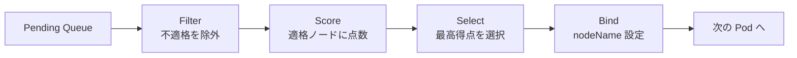

各フェーズの中身:

- **Filter(プレフィルタ + フィルタ)** : ノードの空きリソース、`nodeSelector` / `nodeAffinity`、`Taints` / `Tolerations`、Topology Spread Constraints などをチェック。1 つでも引っかかったら除外
- **Score** : 残った候補ノードに点数を付ける。CPU の利用率の低いノード優先(LeastAllocated)、Pod の偏りを避ける(BalancedAllocation)、イメージがすでに落ちているノード優先(ImageLocality)など多数のプラグインが加点・減点
- **Select** : 最高点を選ぶ。同点なら乱択
- **Bind** : 決めたノードを `pod.spec.nodeName` にセットして API Server に書き戻し

#### Scheduling Framework

Kubernetes 1.19 から、スケジューラの内部は **Scheduling Framework** という拡張ポイントを持つ構造になりました。各フェーズで複数のプラグインが連なる構成で、利用者は自前の Go プラグインや Webhook で挙動を拡張できます。Karpenter / Volcano / kube-batch のような専用スケジューラもこの枠組みで作られています。

#### 主要な内蔵プラグイン

| プラグイン | フェーズ | 役割 |
|---|---|---|
| `NodeResourcesFit` | Filter + Score | ノードに requests 分の空きがあるか |
| `NodeAffinity` | Filter + Score | `nodeSelector` / `affinity.nodeAffinity` を判定 |
| `PodTopologySpread` | Filter + Score | Pod を AZ / ノードに分散 |
| `TaintToleration` | Filter + Score | Taint と Toleration の整合 |
| `VolumeBinding` | Filter | PVC が Bound できるか、Topology が一致するか |
| `InterPodAffinity` | Filter + Score | Pod 同士の同居/分離要求 |
| `ImageLocality` | Score | イメージ pull 済みノードを優先 |
| `BalancedAllocation` | Score | CPU/メモリのバランスを取る |

#### Pod が Pending のままの代表的原因

| Events に出るメッセージ | 原因 | 確認すべきこと |
|---|---|---|
| `0/3 nodes are available: 3 Insufficient cpu` | リソース不足 | Pod の `requests.cpu` を見直す / ノード追加 |
| `0/3 nodes are available: 3 Insufficient memory` | メモリ不足 | `requests.memory` 確認 |
| `0/3 nodes are available: 3 node(s) didn't match Pod's node affinity` | nodeAffinity 不一致 | ノードのラベル / `nodeAffinity` を確認 |
| `0/3 nodes are available: 3 node(s) had untolerated taint` | Taint で弾かれた | `tolerations` 追加 or Taint を見直す |
| `0/3 nodes are available: 3 node(s) didn't satisfy existing pods anti-affinity rules` | PodAntiAffinity でブロック | レプリカ数 / ノード数 / Affinity を見直す |
| `running PreBind plugin "VolumeBinding": binding volumes: ...` | PVC が Bound にならない | StorageClass / PV を確認 |

調査フローはこうです。

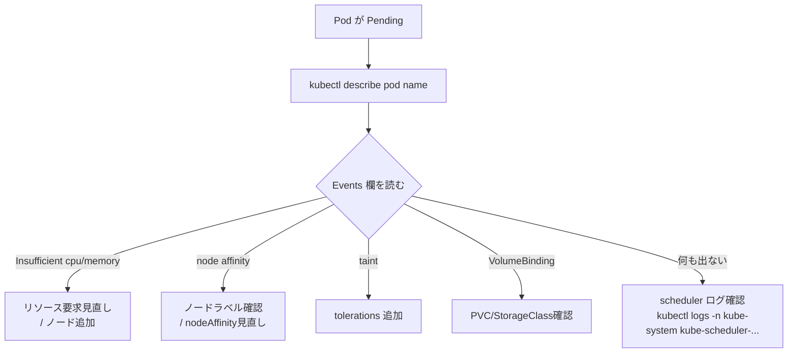

### kube-controller-manager

「**あるべき状態**」と「**現在の状態**」を比較して差分を埋め続ける、複数のコントローラの集合体です。1 つのプロセスの中に多数の Goroutine として走っています。

主なコントローラ:

| コントローラ | 役割 |
|---|---|
| Deployment Controller | Deployment を見て、必要な ReplicaSet を作成・更新 |
| ReplicaSet Controller | ReplicaSet の `replicas` 数を維持(足りなきゃ作る、多きゃ消す) |
| Node Controller | ノードのハートビート(Lease)を監視し、不在なら NotReady にし、5 分後に Pod を退避 |
| Endpoints / EndpointSlice Controller | Service の Selector に該当する Pod を集めて Endpoints/EndpointSlice を更新 |
| Job Controller | Job の状態管理 |
| CronJob Controller | スケジュールに応じて Job を作成 |
| ServiceAccount / Token Controller | Namespace 作成時に default ServiceAccount と Secret を作成 |
| Namespace Controller | Namespace 削除時に中身のリソースを順に消す |
| GarbageCollector | `ownerReferences` をたどって孤児リソースを削除 |
| HorizontalPodAutoscaler | Metrics Server を見てレプリカ数を調整(第7章) |
| StatefulSet Controller | StatefulSet の Pod を順序立てて作成・更新(第3章) |
| DaemonSet Controller | 各ノードに 1 Pod ずつ展開(第3章) |
| PV Controller / PV Protection Controller | PV のライフサイクル管理(第6章) |

これらが **同じプロセス内** で動いている理由は、運用負荷の最小化(プロセス数を増やさない)と、共通ライブラリ(client-go の informer / queue)を共有できるためです。

#### コントローラパターン(reconcile)の典型コード

すべてのコントローラはおよそ次のループです(疑似コード)。

```go
for {
    obj := <-workqueue.Get()
    desired := obj.Spec
    actual  := observeRealWorld(obj)
    if !equal(desired, actual) {
        applyDiff(obj, desired, actual)
    }
    workqueue.Done(obj)
}
```

これがすべてです。失敗したら次のループで再試行され、クラスタは収束します。

#### Leader Election

controller-manager も HA 構成で複数台動きますが、**実際に reconcile するのは 1 台のリーダーだけ** です。リーダー選出は `Lease` リソース(`coordination.k8s.io/v1`)を使い、`/apis/coordination.k8s.io/v1/namespaces/kube-system/leases/kube-controller-manager` を更新できた者がリーダーになります。リーダーが落ちると Lease が失効し、別の controller-manager が引き継ぎます。

```bash
kubectl get lease -n kube-system
# kube-controller-manager   k8s-cp1_xxxx-xxxx   3s
# kube-scheduler            k8s-cp2_yyyy-yyyy   2s
```

scheduler も同じ仕組みでリーダーが 1 台です。これは **アクティブ/スタンバイ構成** であり、ロードバランスではありません。

### cloud-controller-manager

クラウド固有のコントローラ(LoadBalancer Service の実体作成、Node の `providerID` 付与、PV のクラウドディスク割り当てなど)を担うコンポーネントです。**本教材ではローカル環境のため使いません**(MetalLB が LoadBalancer 役を担当)。クラウドマネージド K8s(EKS/GKE/AKS)で使われます。

歴史的には Kubernetes 1.6 までクラウドロジックは kube-controller-manager に組み込まれていましたが、ベンダーロックの解消とリリースサイクルの分離のため切り出されました(KEP "Cloud Controller Manager")。

---

## ノードの構成要素

### kubelet

各ノードに常駐するエージェント。API Server から自ノード宛の Pod 情報を watch し、コンテナランタイムを呼び出して実際にコンテナを起動・監視します。

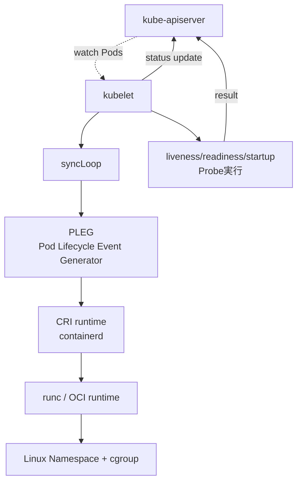

主要な責務:

1. API Server から「自ノードに割り当てられた Pod」を watch
2. ローカルの実状(running しているコンテナ)と比較し、差分を埋める
3. コンテナランタイム(CRI)を呼び出して起動・停止
4. Probe(liveness / readiness / startup)を実行し、結果を API Server に報告
5. Pod / コンテナの status を API Server に書き戻す
6. ノード自身の Lease(`/apis/coordination.k8s.io/v1/namespaces/kube-node-lease/leases/<node>`)を 10 秒おきに更新(ハートビート)
7. cAdvisor 相当の機能でコンテナのリソース使用量を計測し、`/metrics/resource` で公開

#### syncLoop と PLEG

kubelet の心臓部は `syncLoop` という関数で、次のソースから Pod 情報を集めて常時 reconcile しています。

- API Server からの watch
- Static Pod ファイル(`/etc/kubernetes/manifests/`)
- HTTP エンドポイント(歴史的、ほぼ未使用)

PLEG(Pod Lifecycle Event Generator)は、ランタイム側の状態変化(コンテナが死んだ、再起動した等)を検知して syncLoop に通知するサブシステムです。古い実装では関連する Generic PLEG が定期ポーリングのため詰まると `PLEG is not healthy` 警告が出てノードが NotReady になる、という有名な障害事例がありました(現在は **evented PLEG** で改善)。

#### Static Pod

kubeadm が API Server / etcd / scheduler / controller-manager 自身を Pod として動かすために使うのが Static Pod です。`/etc/kubernetes/manifests/*.yaml` に置かれた YAML を kubelet が直接読んで起動します。**API Server がまだない時点でも動かす必要がある** コンポーネントを起動するためのブートストラップ手段です。

```bash
ls /etc/kubernetes/manifests/
# etcd.yaml
# kube-apiserver.yaml
# kube-controller-manager.yaml
# kube-scheduler.yaml
```

これらのファイルを編集すると kubelet が即座に検知して再起動します。本番でフラグを変えたい場合の正規ルートです(が、ミスると Control Plane が落ちるので慎重に)。

Static Pod は API Server からは **`<name>-<node>`** という名前のミラー Pod として見えます(編集はできません、ファイル側が真実)。

#### kubelet の主要オプション

```bash
kubelet \
  --config=/var/lib/kubelet/config.yaml \
  --bootstrap-kubeconfig=/etc/kubernetes/bootstrap-kubelet.conf \
  --kubeconfig=/etc/kubernetes/kubelet.conf \
  --container-runtime-endpoint=unix:///run/containerd/containerd.sock \
  --pod-infra-container-image=registry.k8s.io/pause:3.9 \
  --node-ip=192.168.56.21
```

最近の Kubernetes は CLI フラグを縮小し、`/var/lib/kubelet/config.yaml`(KubeletConfiguration)を中心に構成します。主なフィールド:

- `cgroupDriver: systemd` : ランタイムと揃える(`containerd` も systemd ドライバが既定)
- `clusterDNS: [10.96.0.10]` : Pod の resolv.conf に書く DNS サーバ(CoreDNS の Cluster IP)
- `clusterDomain: cluster.local` : DNS 検索ドメイン
- `evictionHard` : OOM 直前にノードからどの閾値で Pod を退避するか
- `kubeReserved` / `systemReserved` : kubelet と OS が確保するリソース。Pod に割り当て可能な量から差し引かれる

### kube-proxy

各ノード上で **Service の Cluster IP → 実際の Pod IP のルーティング** を作るコンポーネント。実装方式は 3 種類あります。

| モード | 仕組み | 性能 | 状況 |
|---|---|---|---|
| `iptables` | Service ごとに iptables ルールを生成 | サービス数増加で遅くなる | 既定。ほとんどの環境 |
| `ipvs` | Linux IPVS を使う | サービス数に対して O(1) | 数千 Service の規模で推奨 |
| `nftables` | nft で書き換え | iptables 後継 | v1.31+ で安定化進行中 |

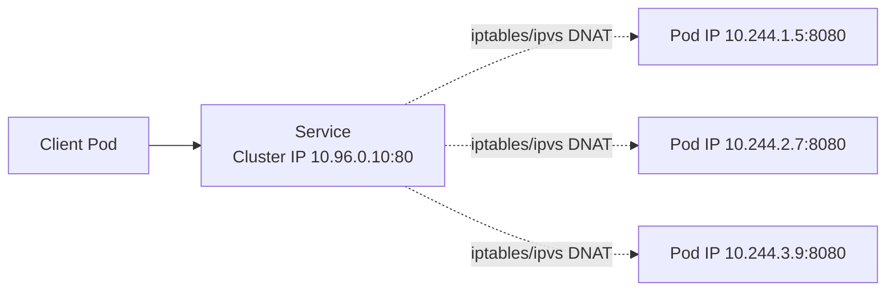

kube-proxy は **EndpointSlice** を watch し、Service の対象 Pod 一覧が変わるたびに iptables / IPVS ルールを書き換えます。Pod が増減してもクライアントは Cluster IP を叩き続ければ自動でロードバランスされます。

#### kube-proxy がいなくなったら

クラスタ全体ではなく **特定ノード** の kube-proxy が止まると、そのノード上の Pod から **Service 経由のアクセス** が壊れます(直接 Pod IP は届きます、CNI が動いていれば)。CoreDNS への問い合わせも Service 経由なので、結果として「DNS が引けない」「Service にアクセスできない」という挙動になります。

#### Cilium による kube-proxy 置き換え

Cilium のような eBPF ベース CNI は、kube-proxy を完全に不要にできます(`kubeProxyReplacement: true`)。eBPF プログラムをカーネルに直接ロードして DNAT を行うため、iptables/IPVS の中間層を削れる上に、レイテンシ・スケール特性ともに優れます。本教材の範囲外ですが、本番運用では検討の価値があります。

### コンテナランタイムと CRI

実際にコンテナを起動するソフトウェア。本教材では **containerd** を使います。

#### CRI(Container Runtime Interface)とは

Kubernetes 1.5 で導入された **kubelet とランタイムの間の標準インターフェース** です。gRPC で定義され、`RunPodSandbox` / `CreateContainer` / `StartContainer` などの呼び出しが規定されています。

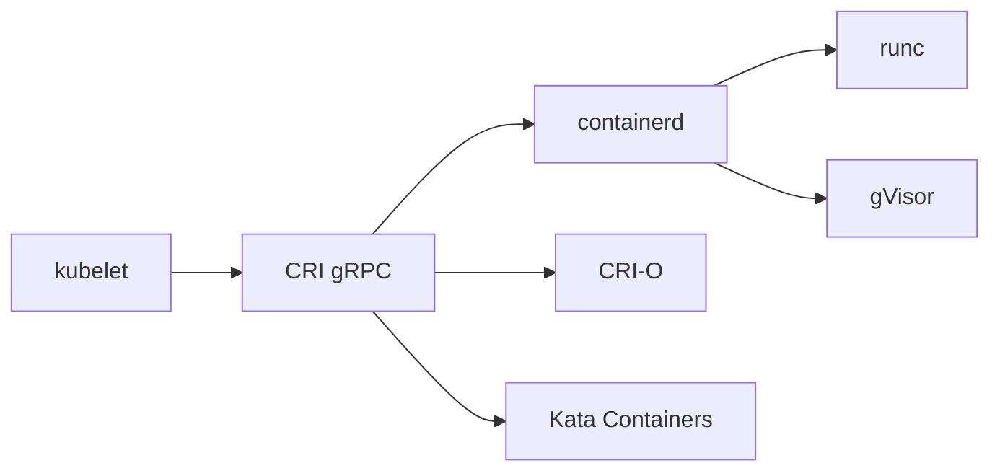

CRI のおかげで、kubelet は具体的なランタイムに依存せず、containerd / CRI-O / Kata Containers などを差し替えられます。

#### Docker の廃止(歴史)

Kubernetes 1.20 で **dockershim 廃止予告**、1.24 で **完全削除** となりました。理由は次の通りです。

- Docker は CRI ネイティブではなく、kubelet に内蔵された `dockershim` が「Docker API → CRI」の翻訳をしていた
- メンテナンス負担が大きく、Docker 自身も内部で containerd を使うようになっていた
- 直接 containerd を呼べば中間層を 1 つ消せる

現実的な影響は「kubelet の挙動」だけで、**コンテナイメージは引き続き Docker で作れます**(OCI 標準準拠のため)。利用者から見ると `docker build` した同じイメージが、ノード上では containerd で動くだけのことです。

```bash
# ノード上のコンテナを直接見る (containerd の場合)
sudo ctr -n k8s.io containers list
# crictl (CRI クライアント、kubelet と同じ目線で見える)
sudo crictl ps
sudo crictl logs <container-id>
sudo crictl pods
sudo crictl images
```

各コマンドの目的:
- `ctr` : containerd ネイティブの CLI。低レベル
- `crictl` : CRI 経由で動く CLI。kubelet と同じ目線で見える(**こちらを使うのが推奨**)

#### OCI Runtime

containerd は **OCI Runtime Spec** に準拠した低レベルランタイム(`runc` が標準、`gVisor` や `kata-runtime` も差し替え可)を呼び出してコンテナを起動します。

| 層 | 標準 | 実装例 |
|---|---|---|
| kubelet と話す | CRI | containerd, CRI-O |
| コンテナを起動する | OCI Runtime | runc, crun, gVisor, kata |
| イメージ形式 | OCI Image | Docker / OCI 互換イメージ |

### CNI(Container Network Interface)

Pod 間通信のためのネットワークプラグインを差し替え可能にする標準仕様。CNI プラグインのバイナリは `/opt/cni/bin/` に置かれ、設定は `/etc/cni/net.d/` にあります。

主なプラグインの比較:

| プラグイン | 特徴 | 強み | 注意点 |
|---|---|---|---|
| **Calico** | BGP / VXLAN ベース | NetworkPolicy 完備、性能良好 | BGP 構成は学習コスト |
| **Cilium** | eBPF ベース | L7 ポリシー、可観測性 | カーネル要件あり |
| **Flannel** | VXLAN シンプル | 設定が楽、軽量 | NetworkPolicy 非対応 |
| **Weave Net** | gossip / マルチキャスト | 簡単 | プロジェクト停滞気味 |
| **Kindnet** | Minikube 既定 | 学習用に十分 | 本番非推奨 |

本教材では第7章以降で **Calico** を使います(NetworkPolicy 対応のため)。

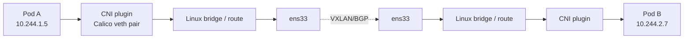

CNI の責任範囲: **Pod の IP 割り当て + ノード間ルーティング**。kube-proxy の責任範囲(Service の DNAT)とは別物なので注意してください。

### CSI(Container Storage Interface)

ストレージの動的プロビジョニングを差し替え可能にする標準仕様。本教材では NFS-CSI(`nfs.csi.k8s.io`)を `StorageClass=nfs`(default)として使います。第6章で詳述します。

```bash
kubectl get csidrivers
kubectl get storageclass
```

CSI の主な責務:

- **Provision** : PVC が来たら NFS export / クラウドディスクを作成
- **Attach** : そのストレージをノードに接続
- **Mount** : コンテナにマウント

歴史的には FlexVolume → CSI への移行で、「ノードに root バイナリを配る」泥臭い運用がなくなり、Pod として動く CSI Driver で済むようになりました。

---

## 補助コンポーネント(アドオン)

### CoreDNS

クラスタ内 DNS サーバ。`<svc>.<ns>.svc.cluster.local` のような名前を解決します。kube-system Namespace に Deployment として常駐し、Service として `kube-dns`(歴史的な名前)で公開されます。

```bash
kubectl get deploy,svc -n kube-system | grep -E 'coredns|kube-dns'
```

CoreDNS が落ちるとクラスタ内の名前解決がすべて止まるため、レプリカ 2 以上で運用し、PDB(PodDisruptionBudget)を必ず設定します。Pod の `/etc/resolv.conf` には CoreDNS の Cluster IP が `nameserver` として書かれます。

### Metrics Server

`kubectl top pods` `kubectl top nodes` の元データを提供する軽量コンポーネント。kubelet の `/metrics/resource` エンドポイントを定期的にスクレイプして集約します。HPA(Horizontal Pod Autoscaler)もこのデータで動きます。第7章で構築します。

歴史的には **Heapster** が同等の役割を担っていましたが、機能過多になり、Metrics Server に置き換わりました(Heapster は v1.13 で deprecated)。長期的なメトリクス保存は Prometheus などに任せる、という分業設計です。

### Ingress Controller

L7 ロードバランサ。本教材では **NGINX Ingress Controller** を使います。第4章で詳述します。Ingress リソースを watch し、対応する nginx の設定ファイルを生成して reload します。

---

## kubectl apply のとき何が起きるか(全体)

`kubectl apply -f deployment.yaml` という 1 コマンドで何が起きるか、コンポーネントを横串で追います。

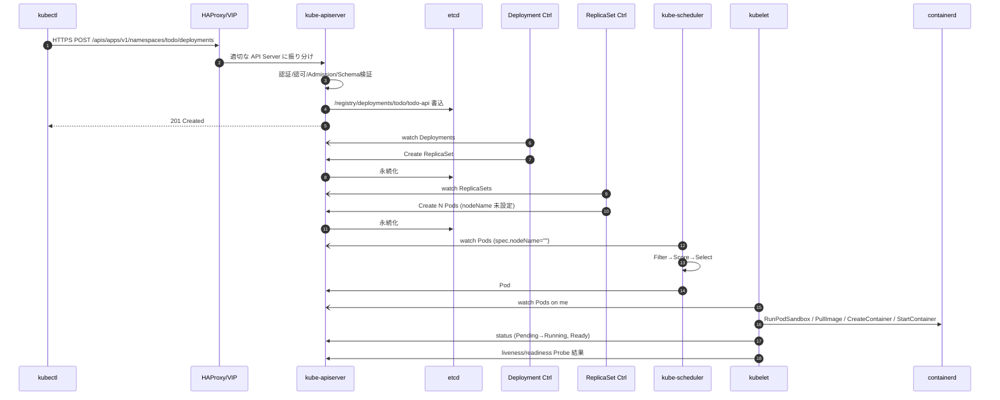

ポイント:

- **コンポーネント同士は直接通信しない**。全員が API Server を見て自分の担当だけ動く
- 各ステップで失敗しても、コントローラは次の reconcile で再試行する。**ユーザーが「完了するまで待つ」必要はない**
- このハブ&スポーク構造があるから、新しいコントローラ(例: Cert-Manager、Argo CD)も同じ枠組みで増やせる

### `kubectl apply -f deployment.yaml` のコマンド分解

```bash
kubectl apply -f deployment.yaml
```

- `apply` : 宣言的更新(なければ作る、あれば差分適用)
- `-f deployment.yaml` : ファイル指定。`-f -` で標準入力、`-f https://...` で URL も可
- 暗黙のフラグ : 現在の context、kubeconfig、Namespace。`--namespace` 未指定なら kubeconfig の `current-context` の Namespace

似た動詞との対比は kubectl のページで詳述します。

---

## 障害ドメインと影響範囲

クラスタ運用で大事なのは「**何が壊れたら何が動かなくなるか**」を把握しておくことです。

| 壊れるもの | 影響 | 既存 Pod への影響 |
|---|---|---|
| **etcd 過半数** | API Server が読めるが書けない / 書けない時間継続で読みも止まる | しばらく動き続ける(kubelet はキャッシュで動く) |
| **API Server 全滅** | `kubectl` が一切応答せず、新規 Pod 作成・更新不可 | 既存 Pod は動き続ける |
| **kube-scheduler** | 新規 Pod が `Pending` のまま、既存は影響なし | 既存 Pod は動き続ける |
| **kube-controller-manager** | レプリカ数自動回復が止まる、Service Endpoints 更新が止まる | 既存 Pod は動き続けるが、Pod 障害時に置き換わらない |
| **kubelet on node X** | そのノードの Pod の status 報告が止まり、Lease 切れで NotReady、5 分後に Pod 退避 | 退避後に他ノードで再作成 |
| **kube-proxy on node X** | そのノードからの Service アクセス断 | Pod 自体は動くが、Service 通信不能 |
| **CNI on node X** | そのノードで Pod 間通信不可 | 致命的、新規 Pod 作成も失敗 |
| **CoreDNS** | DNS 解決断 → クラスタ内通信ほぼ全滅 | サービスディスカバリ不能 |

これを覚えておくと、「サービスが落ちた」と言われたときに **どこから見るか** の手順が体に染みます。

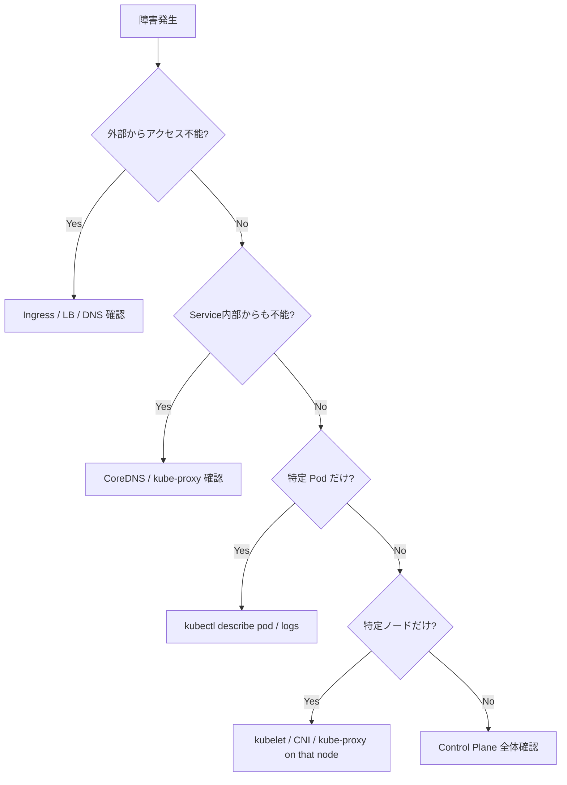

### 「API Server が落ちても既存 Pod が動き続ける」のはなぜか

これが Kubernetes の **強さ** の象徴的な性質です。理由はシンプルで:

1. kubelet は API Server から取得した Pod 情報を **ローカルにキャッシュ** している
2. kubelet と containerd の通信は API Server を経由しない
3. CNI と kube-proxy が作ったルーティングは、API Server なしでも維持される

つまり Control Plane は「**新規変更を捌く頭脳**」であって、「**既存 Pod を動かしている主体**」ではない。これが、Control Plane の HA 化やメンテナンス時間を相対的に余裕を持って計画できる根拠になります。

---

## ハンズオン

Minikube で実際にコンポーネントを観察します。

### 1. Control Plane を覗く

```bash
kubectl get pods -n kube-system -o wide
```

**何が起きるか** : kube-system Namespace のコンポーネントを一覧表示。

**期待される出力(Minikube)** :

```
NAME                              READY   STATUS    RESTARTS   AGE   IP            NODE
coredns-7db6d8ff4d-abcde          1/1     Running   0          5m    10.244.0.3    minikube
etcd-minikube                     1/1     Running   0          5m    192.168.49.2  minikube
kube-apiserver-minikube           1/1     Running   0          5m    192.168.49.2  minikube
kube-controller-manager-minikube  1/1     Running   0          5m    192.168.49.2  minikube
kube-scheduler-minikube           1/1     Running   0          5m    192.168.49.2  minikube
kube-proxy-xyz12                  1/1     Running   0          5m    192.168.49.2  minikube
storage-provisioner               1/1     Running   0          5m    192.168.49.2  minikube
```

`-minikube` サフィックスが付いているのは Static Pod の慣習です。kubeadm でも `-<ノード名>` の形になります。

**失敗するケース** :

| 症状 | 原因 | 対処 |
|---|---|---|
| `error: You must be logged in to the server` | kubeconfig 不正 | `minikube update-context` |
| 一部 Pod が `CrashLoopBackOff` | 設定ファイル不整合 | `kubectl logs` でエラー確認、最悪 `minikube delete && start` |

### 2. API Server のログを見る

```bash
kubectl logs -n kube-system kube-apiserver-minikube --tail=20
```

エラー行を探す癖を付けてください。`Unable to authenticate the request` や `etcdserver: request timed out` は本番でも頻出するメッセージです。

各フラグ:
- `logs` : Pod のログ表示
- `-n kube-system` : Namespace 指定
- `--tail=20` : 末尾 20 行のみ。全部見たいなら省略、続きを追うなら `-f`

### 3. etcd の中身を確認(Minikube)

Minikube 内部の etcd を直接覗くのは少し手間がかかります。

```bash
minikube ssh
sudo crictl exec -it $(sudo crictl ps | grep etcd | awk '{print $1}') sh
ETCDCTL_API=3 etcdctl \
  --endpoints=https://127.0.0.1:2379 \
  --cacert=/var/lib/minikube/certs/etcd/ca.crt \
  --cert=/var/lib/minikube/certs/etcd/server.crt \
  --key=/var/lib/minikube/certs/etcd/server.key \
  get /registry/namespaces/default --print-value-only | head
```

通常は API Server 経由で十分なので、この操作は「裏に etcd がいる」感覚を持つための一度きりの体験で OK です。

### 4. コンポーネントごとのリーダーを確認

```bash
kubectl get lease -n kube-system
```

**期待される出力** :

```
NAME                      HOLDER                       AGE
kube-controller-manager   minikube_xxxxxxxx            5m
kube-scheduler            minikube_yyyyyyyy            5m
```

複数台 Control Plane の HA 環境(第7章)では、HOLDER が変わる様子を観察できます。

### 5. ノード Lease(ハートビート)

```bash
kubectl get lease -n kube-node-lease
```

各ノードが 10 秒おきに更新している Lease が見えます。これが切れると Node Controller が NotReady と判定します。

```bash
# 詳細
kubectl get lease -n kube-node-lease minikube -o yaml
```

`spec.renewTime` が直近の更新時刻、`spec.leaseDurationSeconds` が期限です。

### 6. API リソースをグループごとに眺める

```bash
kubectl api-resources --api-group=apps
kubectl api-resources --api-group=networking.k8s.io
kubectl api-resources --namespaced=false   # Cluster スコープ
```

各 API グループにどんなリソースがあるかを把握すると、後の章の地図ができます。

### 7. コンテナランタイムを直接覗く

```bash
minikube ssh
sudo crictl ps
sudo crictl images
sudo crictl pods
```

`crictl ps` で動いているコンテナ、`crictl pods` で Pod サンドボックス、`crictl images` でローカルキャッシュされているイメージが見えます。`docker ps` が使えないノードでも、`crictl` は必ず使えます。

### 8. kubelet のメトリクスを覗く

```bash
minikube ssh
curl -k https://127.0.0.1:10250/metrics/cadvisor 2>&1 | head -50
```

(認証エラーが出る場合があります。本番では Service Account Token 付きで Prometheus が叩きます。)

---

## トラブル事例集

### 事例 1: `The connection to the server localhost:8080 was refused`

**原因** : kubeconfig が読めていない、または API Server が落ちている。

**確認** :

```bash
kubectl config view --minify
echo $KUBECONFIG
ls -l ~/.kube/config
```

Minikube なら `minikube status` で確認。停止していれば `minikube start`。

### 事例 2: `Unable to connect to the server: dial tcp ...: i/o timeout`

**原因** : API Server に到達できない。ネットワーク・ファイアウォール・VIP 不調・API Server 全滅のいずれか。

**確認順序** :

1. `ping <api server IP>` で疎通
2. `curl -k https://<api>:6443/healthz` でヘルスチェック
3. ノード上で `systemctl status kubelet` (kubeadm 環境)
4. `crictl ps | grep apiserver` (Static Pod として動いているか)

### 事例 3: `Pod is Pending` のまま、Events に `0/3 nodes are available`

**原因** : スケジュール不能。リソース不足、Affinity、Taint のいずれか。

**確認** :

```bash
kubectl describe pod <pod>
kubectl describe nodes
kubectl top nodes
```

`requests` を下げる、または `nodeSelector` / `tolerations` を見直す。

### 事例 4: ノードが `NotReady`

**原因** : kubelet が止まっている、または Lease 更新ができていない。

**確認** :

```bash
kubectl describe node <node>
# (該当ノード上で)
systemctl status kubelet
journalctl -u kubelet --tail=50
```

CNI が起動していない場合も NotReady になります(`Network plugin returns error`)。

### 事例 5: `etcdserver: mvcc: database space exceeded`

**原因** : etcd のディスク使用量が `--quota-backend-bytes`(既定 2GB)を超えた。古い revision が圧迫している。

**対処** :

```bash
ETCDCTL_API=3 etcdctl --endpoints=... alarm list
ETCDCTL_API=3 etcdctl --endpoints=... defrag
ETCDCTL_API=3 etcdctl --endpoints=... alarm disarm
```

第7章で運用手順を体系化します。

### 事例 6: `x509: certificate has expired or is not yet valid`

**原因** : kubeadm の証明書が期限切れ(既定 1 年)。

**対処** :

```bash
sudo kubeadm certs check-expiration
sudo kubeadm certs renew all
sudo systemctl restart kubelet
```

Static Pod は `manifests/*.yaml` の `mtime` 更新で再起動するので、必要なら `touch` で蹴る。

### 事例 7: `Unable to register node ... node "xxx" already exists`

**原因** : 同名ノードがすでに登録されている(再構築時など)。

**対処** :

```bash
kubectl delete node <node>
# 再度 kubeadm join
```

---

## チェックポイント

ここまでで以下を **自分の言葉で** 説明できるか確認してください。

- [ ] etcd の役割と、なぜバックアップが重要か説明できる
- [ ] Pod がノードに割り当てられるまでに、API Server / Deployment Controller / ReplicaSet Controller / Scheduler / kubelet がどの順で関与するか説明できる
- [ ] kube-proxy がいなくなったら何が壊れるか、CNI がいなくなったらどう違うか、対比して説明できる
- [ ] dockershim が削除された理由と、運用への実影響を説明できる
- [ ] etcd が偶数台ではなく奇数台で運用される理由を説明できる
- [ ] Static Pod とは何で、どこにファイルを置くと kubelet が起動するか答えられる
- [ ] Lease(リーダー選出)が controller-manager / scheduler / 各ノードでどう使われているか説明できる
- [ ] API Server が落ちても、しばらく既存 Pod が動き続けるのはなぜか説明できる
- [ ] Mutating Admission と Validating Admission の違いと、それぞれの代表例を 2 つずつ挙げられる
- [ ] CRI / CNI / CSI それぞれの責任範囲を 1 文ずつで説明できる

→ 次は [kubectlの基本]({{ '/02-resources/kubectl/' | relative_url }})
