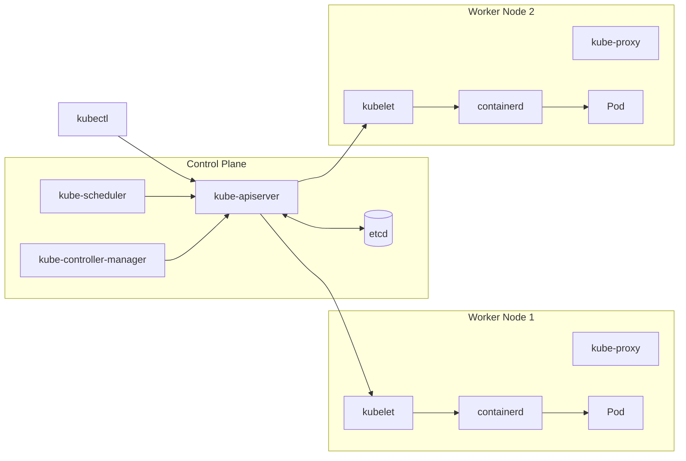
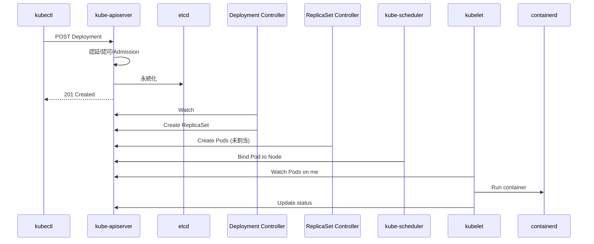

# クラスタアーキテクチャ
{: .no_toc }

## 目次
{: .no_toc .text-delta }

1. TOC
{:toc}

---

Kubernetes クラスタは **コントロールプレーン (Control Plane)** と **ワーカーノード (Worker Nodes)** に分かれます。

## 全体図

## コントロールプレーンの構成要素

### kube-apiserver

クラスタへの **唯一の入口**。`kubectl`、コントローラ、kubelet すべてがここと通信します。
リクエストを認証・認可・Admission Controller でチェックし、最終的に etcd に保存します。

### etcd

クラスタの全状態を保持する **分散KVS**。Pod の定義から Secret の中身まですべてここに入ります。
**etcd が壊れる = クラスタが壊れる** に等しいので、本番ではバックアップ必須です(7章で扱います)。

### kube-scheduler

新しい Pod をどのノードに置くか決めるコンポーネント。
ノードのリソース空き、Affinity、Taint/Toleration、ノードセレクタを総合判断します。

### kube-controller-manager

「あるべき状態」と「現在の状態」を比較して差分を埋め続ける **コントローラ群** の本体。

- ReplicaSet Controller : Pod 数を維持
- Node Controller : ノードのハートビート監視
- Endpoints Controller : Service と Pod を結ぶ Endpoints 更新

これが Kubernetes の自己修復・宣言的動作の心臓部です。

## ノードの構成要素

### kubelet

各ノードに常駐するエージェント。API Server から指示を受けてランタイムを呼び、コンテナを起動します。
Probe を実行し、結果を API Server に報告するのも kubelet の役割です。

### kube-proxy

Service の Cluster IP → Pod IP のルーティングを、**iptables または IPVS** で各ノード上に作るコンポーネントです。

### コンテナランタイム

実際にコンテナを起動するソフト。本教材では **containerd** を使います。
ランタイムは **CRI (Container Runtime Interface)** で kubelet とやり取りするので、差し替え可能です。

### CNI プラグイン

Pod 間のネットワークを提供。代表例は **Calico**, **Cilium**, **Flannel**。
本教材では **Calico** を使います(NetworkPolicy 対応のため)。

### CSI プラグイン

ストレージの動的プロビジョニングを提供。本教材ではローカルNFSサーバとNFS-CSIドライバ、または local-path-provisioner を使います。

## kubectl applyのとき何が起きるか

ポイント: **コンポーネント同士は直接通信しない**。全員が API Server を見て自分の担当だけ動く。
このハブ&スポーク構造が Kubernetes の高い拡張性の源です。

## チェックポイント

- [ ] etcd の役割と、なぜバックアップが重要か説明できる
- [ ] Pod がノードに割り当てられるまでの登場人物を順に挙げられる
- [ ] kube-proxy がいなくなったら何が壊れるか説明できる
