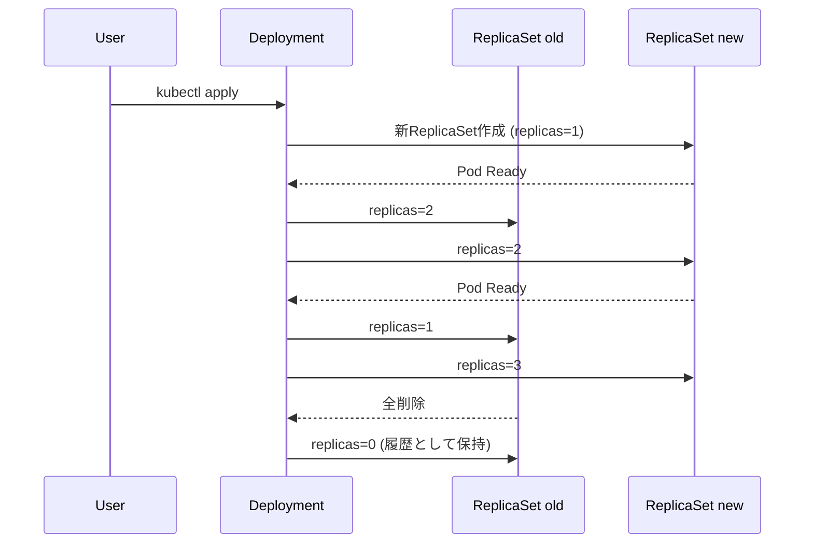

# Deployment
{: .no_toc }

## 目次
{: .no_toc .text-delta }

1. TOC
{:toc}

---

**Deployment** は、ステートレスなアプリケーションを Kubernetes で運用する **最も標準的なリソース** です。
内部で ReplicaSet を作り、ローリングアップデートとロールバックを提供します。

## 基本のYAML

```yaml
apiVersion: apps/v1
kind: Deployment
metadata:
  name: web
  labels:
    app: web
spec:
  replicas: 3
  strategy:
    type: RollingUpdate
    rollingUpdate:
      maxSurge: 25%
      maxUnavailable: 25%
  selector:
    matchLabels:
      app: web
  template:
    metadata:
      labels:
        app: web
    spec:
      containers:
      - name: nginx
        image: nginx:1.27
        ports:
        - containerPort: 80
        resources:
          requests: {cpu: 100m, memory: 128Mi}
          limits:   {cpu: 500m, memory: 256Mi}
```

`spec.template` 配下が **Pod の定義**。Pod の章で学んだものがそのまま使えます。

## ローリングアップデートの仕組み



- 新ReplicaSetで1つ作る
- Readyになったら旧ReplicaSetから1つ減らす
- これを `maxSurge` / `maxUnavailable` の制約内で繰り返す

```bash
kubectl rollout status deploy/web
kubectl set image deploy/web nginx=nginx:1.28
kubectl rollout history deploy/web
kubectl rollout undo deploy/web
kubectl rollout undo deploy/web --to-revision=2
kubectl rollout pause deploy/web
kubectl rollout resume deploy/web
```

## strategy: Recreate vs RollingUpdate

| 戦略 | 動作 | 使い所 |
|------|------|--------|
| `RollingUpdate` (既定) | 新旧Pod共存で徐々に入替 | ステートレスWeb/API |
| `Recreate` | 全部消してから新規作成 | DBスキーマ変更で旧と共存できないとき |

```yaml
spec:
  strategy:
    type: Recreate
```

## 本番で気をつけること

### 1. Probe を必ず設定する

`readinessProbe` がないと、起動直後の Pod にトラフィックが流れます。
**無停止デプロイには Readiness Probe 必須**。詳しくは 7 章 [Probe]({{ '/07-production/probe/' | relative_url }}) で。

### 2. minReadySeconds

```yaml
spec:
  minReadySeconds: 10
```

Ready直後の Pod の安定確認の猶予を入れる。

### 3. revisionHistoryLimit

```yaml
spec:
  revisionHistoryLimit: 3
```

既定10世代の履歴 ReplicaSet を制限。

### 4. progressDeadlineSeconds

```yaml
spec:
  progressDeadlineSeconds: 600
```

進捗が止まったロールアウトを失敗扱いに。CI/CDの自動ロールバックと組み合わせて使います。

## ハンズオン

```bash
kubectl apply -f web-deployment.yaml
kubectl get deploy,rs,pods -l app=web

# ローリング体験
kubectl set image deploy/web nginx=nginx:1.28
kubectl get pods -l app=web -w

# わざと存在しないイメージにして観察
kubectl set image deploy/web nginx=nginx:does-not-exist
kubectl rollout status deploy/web --timeout=60s
kubectl rollout undo deploy/web
```

## チェックポイント

- [ ] `maxSurge` と `maxUnavailable` の意味と既定値の挙動を説明できる
- [ ] DBスキーマ変更時に Recreate を選ぶ理由を説明できる
- [ ] 無停止デプロイに最低限必要なProbeを答えられる
