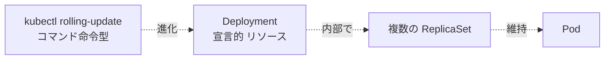
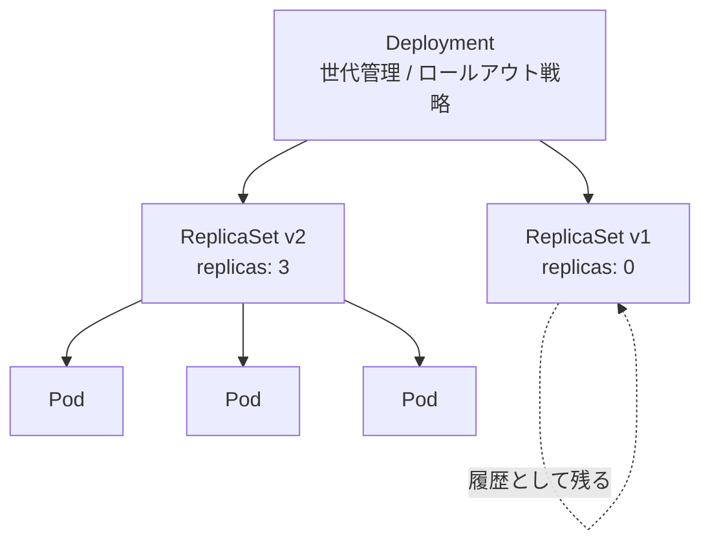
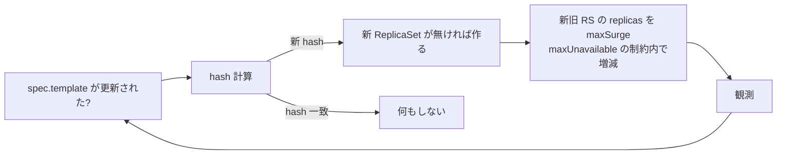
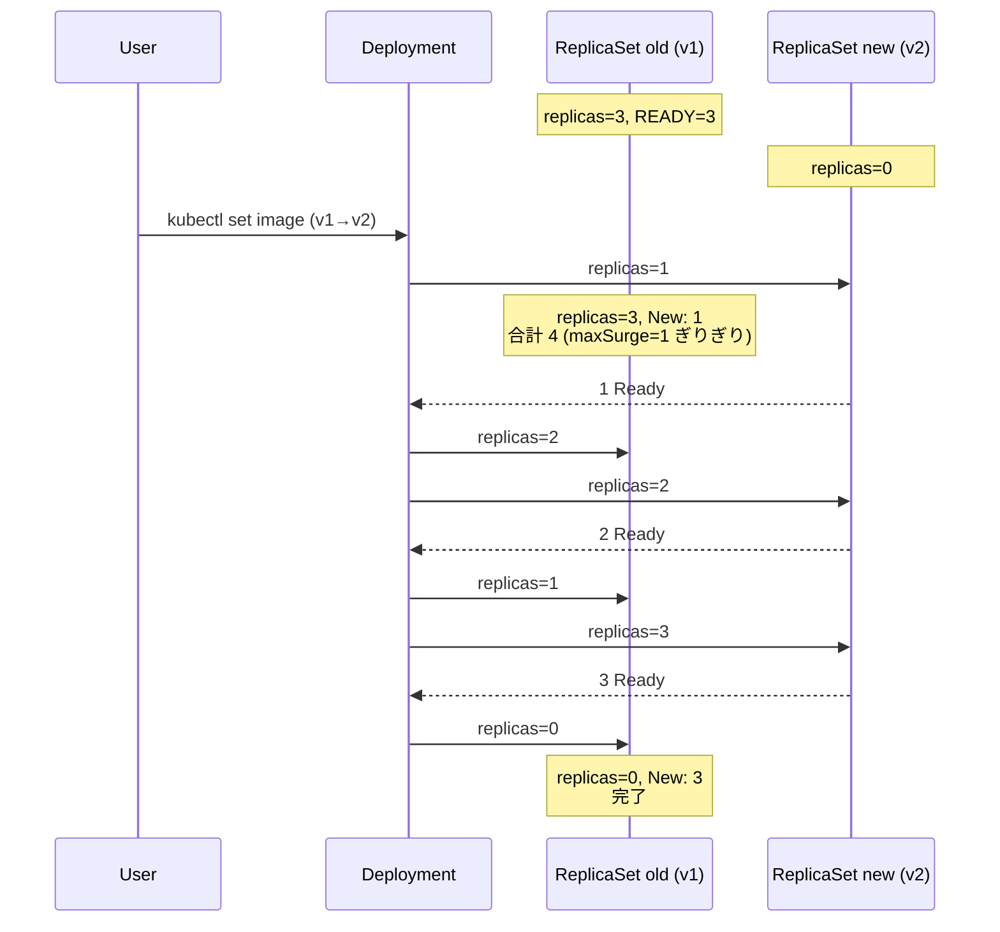
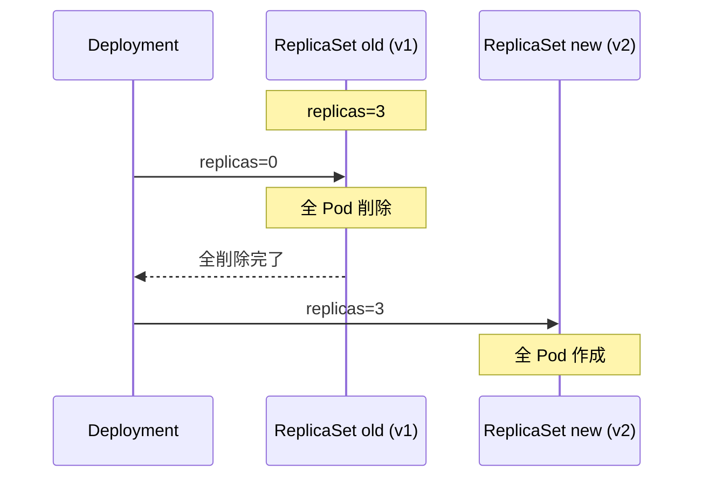
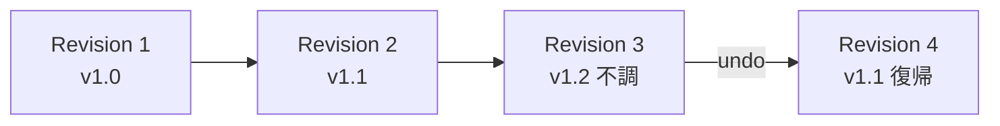
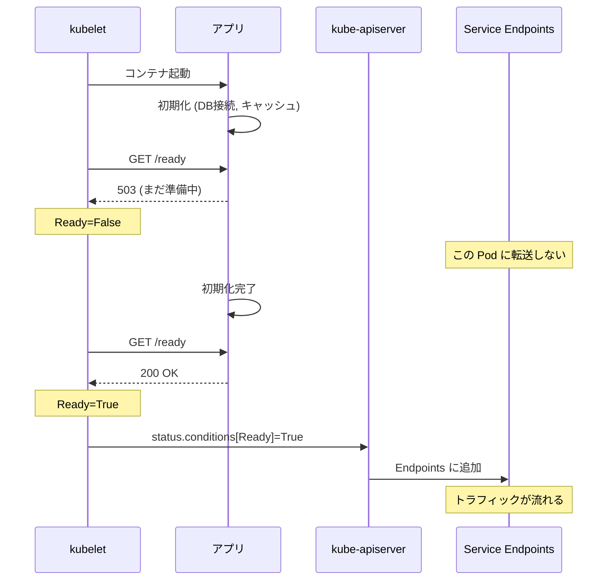
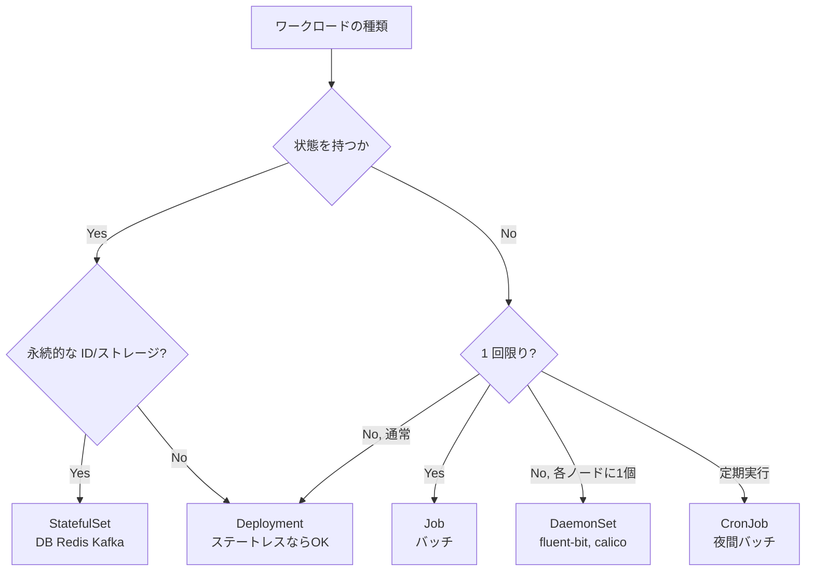

# Deployment
{: .no_toc }

## 目次
{: .no_toc .text-delta }

1. TOC
{:toc}

---

## このページのゴール

このページを読み終えると、以下を **自分の言葉で説明できる** ようになります。

- Deployment が **何を解決するために生まれた** リソースか(ReplicaSet 単独では実現できなかったローリングアップデート)
- Deployment / ReplicaSet / Pod の三層構造で、それぞれが何を担当しているか
- ローリングアップデートのアルゴリズム — `maxSurge` / `maxUnavailable` の意味と組合せが及ぼす実際の挙動
- `RollingUpdate` と `Recreate` の使い分けと、それぞれを選ぶべき場面
- `kubectl rollout` コマンド群(`status` / `history` / `undo` / `restart` / `pause` / `resume`)の役割と、運用での使いどころ
- `minReadySeconds` / `progressDeadlineSeconds` / `revisionHistoryLimit` などの本番運用に必須なフィールドの意味
- Probe(特に `readinessProbe`)を必ず設定すべき理由 — 無停止デプロイがなぜ「Probe ありき」なのか
- Deployment ではなく StatefulSet / DaemonSet / Job を選ぶべき場面、そして Argo Rollouts のような Progressive Delivery への発展

---

## Deployment の生まれた背景

### 「ローリングアップデートできない」問題

[ReplicaSet]({{ '/02-resources/replicaset/' | relative_url }}) のページで触れたとおり、ReplicaSet 単独ではイメージ更新時に既存 Pod が更新されません。これは **Pod 数を維持する責任しかない** ReplicaSet にとっては正しい設計なのですが、運用者からすると致命的でした。

Kubernetes 黎明期(v1.0〜v1.1)、運用者は次のような苦肉の策で更新を行っていました。

- **`kubectl rolling-update` コマンド**(命令型) : クライアント側で 2 つの ReplicationController を作って徐々に Pod を移し替える。kubectl が落ちたら更新が中断する致命的な弱点があった
- **Blue/Green デプロイの手作り** : 別 RC を作ってから Service の selector を切り替える。手数が多い
- **手動で旧 Pod を削除** : ReplicaSet が自動で新 template の Pod を作り直すのを利用する。順序制御不能

これらに共通する根本問題は **「クラスタ側に状態が無い」** ことでした。`kubectl rolling-update` は「クライアントが手順を実行する」プロセスであり、kubectl のセッションが切れたら復旧手段がなく、進行状況も etcd に残らない。

### 「更新の意図」をリソースとして表現する

Kubernetes コミュニティが導いた解は、「**ローリングアップデートそのものをリソース化する**」ことでした。



Deployment という新リソースは、`spec.template` を保持し、内部で **複数の ReplicaSet を時間差で増減** させることでローリングアップデートを実現します。重要なのは、

- **更新の意図(=新しい spec.template)が etcd に書かれる**ので、kubectl が落ちても Deployment Controller が続きを進める
- **進行状況(`status.conditions` / `status.observedGeneration` / `status.updatedReplicas`)が API で観測可能**
- **過去の世代(過去の ReplicaSet)が履歴として残る** ので、ロールバックが 1 コマンドで可能

この設計が GA したのが Kubernetes v1.2(2016 年)、`apps/v1beta1` → `apps/v1` の安定化が v1.9 でした。以降、**ステートレスなアプリは Deployment で動かす** というのが事実上の標準になり、現在に至ります。

### 三層構造 — Deployment / ReplicaSet / Pod



各層の責務:

| 層 | 責務 |
|---|---|
| **Deployment** | テンプレート変更を検知し、新世代 ReplicaSet を作って徐々に切り替える。履歴を残し、ロールバックを可能にする |
| **ReplicaSet** | 自分の `replicas` を維持する。Pod の作成・削除 |
| **Pod** | 実際にコンテナを動かす |

それぞれが **シンプルな単一責任** で動いており、組合さって複雑な機能(無停止アップデート)を実現する、という美しい階層化です。

---

## 最小の Deployment

```yaml
apiVersion: apps/v1
kind: Deployment
metadata:
  name: web
  namespace: todo
  labels:
    app.kubernetes.io/name: todo-frontend
    app.kubernetes.io/part-of: todo
spec:
  replicas: 3
  selector:
    matchLabels:
      app.kubernetes.io/name: todo-frontend
  template:
    metadata:
      labels:
        app.kubernetes.io/name: todo-frontend
        app.kubernetes.io/part-of: todo
    spec:
      containers:
      - name: nginx
        image: nginx:1.27
        ports:
        - containerPort: 80
        resources:
          requests: {cpu: 50m, memory: 64Mi}
          limits:   {cpu: 200m, memory: 128Mi}
```

```bash
kubectl apply -f web-deployment.yaml
kubectl get deploy,rs,pods -l app.kubernetes.io/name=todo-frontend
```

**何が起きるか**:

1. Deployment が API Server に作られる
2. Deployment Controller がそれを watch して **ReplicaSet を 1 つ作る**(`web-<hash>`)
3. ReplicaSet Controller がそれを watch して **Pod を 3 つ作る**(`web-<hash>-<random>`)
4. Scheduler が各 Pod をノードに割り当て
5. kubelet がコンテナを起動

**期待される出力**:

```
NAME                              READY   UP-TO-DATE   AVAILABLE   AGE
deployment.apps/web               3/3     3            3           1m

NAME                                       DESIRED   CURRENT   READY   AGE
replicaset.apps/web-7b9f4d8c6c             3         3         3       1m

NAME                          READY   STATUS    RESTARTS   AGE
pod/web-7b9f4d8c6c-abcde      1/1     Running   0          1m
pod/web-7b9f4d8c6c-fghij      1/1     Running   0          1m
pod/web-7b9f4d8c6c-klmno      1/1     Running   0          1m
```

Deployment の各列の意味:

- `READY` : `<利用可能な Pod 数>/<目標 Pod 数>`
- `UP-TO-DATE` : 新 template に対応している Pod の数
- `AVAILABLE` : `minReadySeconds` を経過してトラフィック流入可能な Pod 数
- `AGE` : 作成からの時間

「`READY=3/3` だが `UP-TO-DATE=2`」のような状態は、**ローリング進行中** のシグナルです。

---

## Deployment の reconciliation

Deployment Controller の動作は、ReplicaSet Controller と同じく単純な reconcile ループです。



毎回の reconcile で次を確認します:

1. `spec.template` のハッシュを計算し、現在の最新 ReplicaSet と一致するか
2. 一致しない場合、新ハッシュ用の ReplicaSet を作成(または既存の同 hash RS を発見して再利用)
3. 新 RS の `replicas` を増やし、旧 RS の `replicas` を減らす(制約内で)
4. すべての Pod が新 template に置き換わるまで繰り返す

ポイントは **Deployment は ReplicaSet の `replicas` を制御するだけ** であり、Pod を直接触らないこと。Pod の実体管理は ReplicaSet Controller の責務です。

---

## ローリングアップデート

### `maxSurge` と `maxUnavailable`

```yaml
spec:
  strategy:
    type: RollingUpdate
    rollingUpdate:
      maxSurge: 25%
      maxUnavailable: 25%
```

| フィールド | 既定 | 意味 |
|---|---|---|
| `maxSurge` | 25% | 一時的に **想定数を超えて** 作って良い Pod 数 |
| `maxUnavailable` | 25% | 一時的に **使えない状態** を許容する Pod 数 |

絶対値(`maxSurge: 1`)でも割合(`maxSurge: 25%`)でも書けます。割合は `replicas` を基準に計算され、**端数は `maxSurge` は切り上げ、`maxUnavailable` は切り捨て** がルール。

#### 既定値のシミュレーション(replicas=3)

`maxSurge: 25% = 0.75 → 1`、`maxUnavailable: 25% = 0.75 → 0` になります。つまり「**最大 4 個までに増やしていい、ただし常に 3 個は使える状態**」。



各ステップで「**いまサービス可能な Pod は何個か**」を確認しながら進みます。Pod が Ready になるまで次のステップに進まないので、起動が遅いアプリでは時間がかかります。

#### `maxUnavailable=0`(ゼロダウンタイム重視)

```yaml
strategy:
  rollingUpdate:
    maxSurge: 1
    maxUnavailable: 0
```

これは「**サービス容量を絶対に減らさない**」設定。新 Pod が Ready になってから旧 Pod を消すので、リクエスト処理能力が常に維持されます。**本番 Web/API ではこれが標準** です。

#### `maxSurge=0`(リソース節約 / コスト重視)

```yaml
strategy:
  rollingUpdate:
    maxSurge: 0
    maxUnavailable: 1
```

これは「**Pod 数を絶対に増やさない**」設定。ノードのリソースが厳しいときに有効ですが、**ローリング中は容量が一時的に減る** ため、ピーク時の更新では遅延やエラー率上昇の原因になります。

#### `maxSurge` と `maxUnavailable` を両方 0 にしてはいけない

```yaml
strategy:
  rollingUpdate:
    maxSurge: 0
    maxUnavailable: 0
```

これは **進行不能** です。新しい Pod も作れず、古い Pod も消せないので、ロールアウトが永遠に進みません。API Server も Validation で警告しないので、自分でやらかさないこと。

### `progressDeadlineSeconds`

```yaml
spec:
  progressDeadlineSeconds: 600
```

ロールアウトが **進捗しないまま** この秒数経過すると、`status.conditions[type=Progressing]` が `False` になり、`reason: ProgressDeadlineExceeded` が付きます。CI/CD はこれを `kubectl rollout status --timeout=` で検知して、自動ロールバックや人間呼出に繋げます。

```bash
kubectl rollout status deploy/web --timeout=10m
# 進捗しないと exit code 1 で終了
if [ $? -ne 0 ]; then
  kubectl rollout undo deploy/web
fi
```

既定は 600 秒(10 分)。アプリの起動時間に応じて調整してください。

### `minReadySeconds`

```yaml
spec:
  minReadySeconds: 10
```

`readinessProbe` が通った直後ではなく、**Probe が通って `minReadySeconds` 秒経ってから** 「利用可能(`AVAILABLE`)」と数えます。Probe フラッキング(Ready ↔ NotReady を高速に行き来する)の影響を吸収する保険です。

実運用ではアプリのウォームアップ時間(キャッシュロードや GC 安定化)に合わせて 5〜30 秒の値を設定するのが定番です。`0` にしておくと、起動直後のピーキーなレイテンシをユーザーに見せてしまうことがあります。

---

## strategy: Recreate vs RollingUpdate

| 戦略 | 動作 | 使い所 |
|---|---|---|
| `RollingUpdate`(既定) | 新旧 Pod 共存で徐々に入替 | ステートレス Web / API、ほぼ全ケース |
| `Recreate` | 全部消してから新規作成 | DB スキーマ変更で旧と共存できないとき、シングルトン要件 |

```yaml
spec:
  strategy:
    type: Recreate
```



**`Recreate` のリスク**: 切替中は **完全にダウンタイム** が発生します。新 Pod が起動して Ready になるまで(数十秒〜数分)、サービスは停止します。本番 Web/API では原則使いません。

ただし次の場合は `Recreate` が **正解** です:

- DB スキーマが breaking で、新旧アプリが同時に DB を触ると壊れる
- ライセンス上の制約で同時起動できない(レガシー商用ソフト)
- Singleton であることが本質的に必要(リーダーが 1 個に決まっている内部ツール)

これらは Deployment 自体が向いていない可能性もあるので、ジョブ・StatefulSet・自前オペレータも選択肢に。

---

## ロールアウトとロールバック — `kubectl rollout`

Deployment の真価は、**ロールアウトを「観測可能・取り消し可能」にしたこと**です。

```bash
kubectl rollout status deploy/web                    # 進行状況
kubectl rollout status deploy/web --timeout=5m       # タイムアウト付き

kubectl rollout history deploy/web                   # 履歴一覧
kubectl rollout history deploy/web --revision=2      # 特定世代の詳細

kubectl rollout undo deploy/web                      # 直前世代へロールバック
kubectl rollout undo deploy/web --to-revision=2      # 特定世代へ

kubectl rollout pause deploy/web                     # 進行を止める
kubectl rollout resume deploy/web                    # 再開

kubectl rollout restart deploy/web                   # 再作成 (image 変更なし)
```

各サブコマンドの詳細:

### `rollout status`

```bash
kubectl rollout status deploy/web
# Waiting for deployment "web" rollout to finish: 2 of 3 updated replicas are available...
# deployment "web" successfully rolled out
```

進行状況を表示します。完了するまでブロックする(または `--timeout` で打ち切る)ので、CI/CD で「デプロイ完了を待つ」用途の定番です。

### `rollout history`

```bash
kubectl rollout history deploy/web
# REVISION  CHANGE-CAUSE
# 1         <none>
# 2         kubectl set image deploy/web nginx=nginx:1.28 --record=...
# 3         kubectl edit deploy/web ...
```

`CHANGE-CAUSE` 列は **`kubernetes.io/change-cause` annotation** から取得されます。空欄が並ぶと履歴の意味が分からなくなるので、運用では必ず埋めるのが推奨。

```yaml
metadata:
  annotations:
    kubernetes.io/change-cause: "image=nginx:1.28 (PR#123)"
```

`--record` フラグは廃止予定なので、`annotation` に明示的に書く運用が現代的です。

### `rollout undo`

```bash
kubectl rollout undo deploy/web                  # 1 つ前へ
kubectl rollout undo deploy/web --to-revision=2  # 世代 2 へ
```

古い世代の ReplicaSet(`replicas=0` で残っているもの)を「**新しい世代として**」復活させ、新→古の置き換えを実行します。これにより、ロールバックも **新しい世代** として履歴に積まれ、追跡性が保たれます。



**重要**: `kubectl rollout undo --to-revision=2` を実行すると、Revision 2 の内容が Revision 4 として再登場し、Revision 3 は履歴から消えません。「**過去を書き換えない**」設計です。

### `rollout pause` と `resume`

```bash
kubectl rollout pause deploy/web
# 以後、spec.template を変更しても新 RS が作られず保留される
kubectl set image deploy/web nginx=nginx:1.29
kubectl set resources deploy/web --limits=cpu=1
# ...
kubectl rollout resume deploy/web
# 一気に反映
```

「複数の変更をまとめて 1 ロールアウトとして適用したい」場面で使います。CI/CD ではあまり使われませんが、デバッグや段階的な調査時に有用。

### `rollout restart`

```bash
kubectl rollout restart deploy/web
```

イメージや設定を変えずに **Pod を全部入れ替える**。`spec.template.metadata.annotations` に再起動時刻を埋めて、新ハッシュを誘発するハック的な実装です。

用途:

- ConfigMap / Secret の更新を Pod に反映したい(これらは Pod 再作成しないと環境変数として反映されない)
- メモリリーク中のアプリを延命のため再起動
- DNS 設定変更の反映

### `revisionHistoryLimit`

```yaml
spec:
  revisionHistoryLimit: 3
```

`replicas=0` で残しておく古い ReplicaSet の世代数。既定 10。多すぎると `kubectl get rs` が見づらく、etcd を圧迫します。本番では 3〜5 が現実的。

`0` を指定するとロールバックができなくなるので注意。

---

## Probe と Deployment の関係 — 無停止デプロイの要

ローリングアップデートが「**無停止**」で動くために、決定的な役割を果たすのが **`readinessProbe`** です。

### `readinessProbe` がないと何が起きるか

`readinessProbe` を設定しない場合、kubelet は **コンテナが起動したら即座に Ready 扱い** にします。これは恐ろしいことで、

- アプリの初期化が終わっていない(DB 接続、キャッシュロード、JIT コンパイル)状態で
- Service の Endpoints に登録され
- 容赦なくトラフィックが流れ込み
- `Connection refused` や `503` を返し続ける

ローリング中は **古い Ready Pod を 1 つ消し、新しい Pod を 1 つ追加** という入れ替えを繰り返します。新しい Pod が「実は準備できていない」のに Ready と判定されると、その間のリクエストはエラーになります。

### `readinessProbe` の正しい挙動

```yaml
readinessProbe:
  httpGet: {path: /ready, port: 8000}
  initialDelaySeconds: 5
  periodSeconds: 5
  failureThreshold: 3
```

アプリは `/ready` エンドポイントで「自分が依存先(DB / Redis / 外部 API)に接続できる状態か」を返します。準備できるまで `503` を返し、準備完了で `200` を返す。



### Deployment は Ready を待つ

ローリング中、Deployment は **新 Pod が Ready になるまで次のステップに進みません**(`maxUnavailable` の制約と組合せ)。これにより、`readinessProbe` が `503` を返しているうちは新 Pod は Available にカウントされず、Service の Endpoints にも入りません。

逆に言うと、**`readinessProbe` を `httpGet: /` のような「とりあえず 200 を返すだけ」のものにしてはいけません**。アプリの真の準備状態を返さないと、無停止デプロイは破綻します。詳細は第7章 [Probe]({{ '/07-production/probe/' | relative_url }}) で扱います。

---

## 主要フィールド完全解説

```yaml
apiVersion: apps/v1
kind: Deployment
metadata:
  name: web
  namespace: todo
  labels:
    app.kubernetes.io/name: todo-frontend
    app.kubernetes.io/part-of: todo
    app.kubernetes.io/managed-by: kustomize
  annotations:
    kubernetes.io/change-cause: "image=nginx:1.27 (initial)"
spec:
  # ====== 数 ======
  replicas: 3

  # ====== Selector (immutable) ======
  selector:
    matchLabels:
      app.kubernetes.io/name: todo-frontend

  # ====== ロールアウト戦略 ======
  strategy:
    type: RollingUpdate
    rollingUpdate:
      maxSurge: 25%
      maxUnavailable: 0

  # ====== タイミング制御 ======
  minReadySeconds: 10
  progressDeadlineSeconds: 600
  revisionHistoryLimit: 3
  paused: false

  # ====== Pod テンプレート ======
  template:
    metadata:
      labels:
        app.kubernetes.io/name: todo-frontend
        app.kubernetes.io/part-of: todo
    spec:
      # (Pod の章で扱った全フィールドが書ける)
      terminationGracePeriodSeconds: 30
      containers:
      - name: nginx
        image: nginx:1.27
        ports:
        - {containerPort: 80, name: http}
        resources:
          requests: {cpu: 50m, memory: 64Mi}
          limits:   {cpu: 200m, memory: 128Mi}
        readinessProbe:
          httpGet: {path: /, port: http}
          periodSeconds: 5
        livenessProbe:
          httpGet: {path: /, port: http}
          periodSeconds: 10
          initialDelaySeconds: 15
        lifecycle:
          preStop:
            exec:
              command: ["/bin/sh","-c","sleep 5"]
        securityContext:
          runAsNonRoot: true
          runAsUser: 101
          allowPrivilegeEscalation: false
          capabilities:
            drop: ["ALL"]
            add: ["NET_BIND_SERVICE"]
```

各セクションのポイント:

### `selector` は immutable

ReplicaSet と同じく、Deployment の `spec.selector` も **作成後変更不可** です。`apps/v1beta2` までは可変だったのが、安定化のときに固定されました。ラベル設計は最初に決めましょう。

### `selector` と `template.metadata.labels` の整合性

selector が `template.metadata.labels` の **部分集合** であれば OK です。template に余計なラベルを足すのは自由(後で Service が広く selector できるように)。

### `paused: true`

```yaml
spec:
  paused: true
```

Deployment Controller の reconcile を一時停止します。`kubectl rollout pause` と同じ効果。デバッグ用途。

### `template` は Pod の `spec` と同じ

Pod の章で扱った全フィールド(`initContainers` / `volumes` / `nodeSelector` / `affinity` / `tolerations` など)が書けます。Deployment は **Pod の作成方法を template として保持** しているだけなので、Pod の知識がそのまま流用できます。

---

## 代替手法 — Deployment じゃないとき

Deployment は **ステートレスなアプリの標準** ですが、すべてのワークロードに適しているわけではありません。



| リソース | 用途 | Deployment との違い |
|---|---|---|
| **Deployment** | ステートレス Web/API | 順序なし、Pod 名はランダム |
| **StatefulSet** | DB / Redis / Kafka | Pod 名が `<name>-0`, `-1` 順序保証、PVC を Pod 単位で持つ |
| **DaemonSet** | ノード常駐エージェント | 各ノードに 1 個、ノード追加で自動配置 |
| **Job** | バッチ処理 | exit 0 で完了、再起動しない(`OnFailure` ポリシー) |
| **CronJob** | 定期バッチ | スケジュール起動で Job を生成 |

第3章で StatefulSet / DaemonSet / Job / CronJob を順に学びます。

### Argo Rollouts への発展

Deployment のローリングは「**新 Pod を作って Ready になったら旧を消す**」というシンプルな戦略しか持ちません。本番運用では次のような **Progressive Delivery** が要求されることがあります。

- **Canary** : 新バージョンをまず 5% だけ流して様子見、メトリクスを確認しながら徐々に増やす
- **Blue/Green** : 旧と新を完全並走させて、テスト後にスイッチ
- **自動ロールバック** : エラー率や P99 レイテンシが閾値を超えたら自動で巻き戻す

これらを実現するために、**Argo Rollouts** や **Flagger** といったオペレータが Deployment を拡張する形で存在します。Argo Rollouts は `Rollout` という独自 CRD を提供し、内部で ReplicaSet を直接操作することで Canary や Blue/Green を実現します。

本教材の範囲外ですが、本番運用に進むときは検討の価値があります。

---

## 本番運用での落とし穴

### 1. PodDisruptionBudget(PDB)を必ず設定する

Deployment 自身はノードのメンテナンス(`drain`)時の挙動を制御しません。`kubectl drain node-1` を実行すると、ノード上の Pod は問答無用で削除されます。複数 Pod が同じノードに偏っていると、**一気に容量が落ちる** 危険があります。

```yaml
apiVersion: policy/v1
kind: PodDisruptionBudget
metadata:
  name: web-pdb
  namespace: todo
spec:
  minAvailable: 2     # または maxUnavailable: 1
  selector:
    matchLabels:
      app.kubernetes.io/name: todo-frontend
```

PDB は「**自発的中断(voluntary disruption)**」 ─ ノードドレイン、クラスタオートスケーラ、`kubectl delete pod` ─ に対してのみ効力を持ちます。ノード障害(involuntary)は防げません。

### 2. HPA との組合せ

Horizontal Pod Autoscaler(HPA)は Deployment の `replicas` を動的に変更します。同じフィールドを **YAML でも書いてしまう** と、apply のたびに HPA の調整が上書きされて衝突します。

対策:

- **HPA を使う Deployment では `replicas` を YAML から削除**
- または Server-side Apply(`--server-side`)で `replicas` の所有者を HPA に明け渡す
- もしくは `kubectl apply` 時に `--field-manager` を分けて、HPA の操作を尊重する

### 3. Service との連携

Deployment は Service の存在を知りません。Service は **Label Selector** で Pod を拾うので、Deployment の `template.metadata.labels` と Service の `spec.selector` が **必ず一致** している必要があります。

```yaml
# Deployment
spec:
  template:
    metadata:
      labels:
        app.kubernetes.io/name: todo-frontend  # ← Service が拾うラベル

---
# Service
spec:
  selector:
    app.kubernetes.io/name: todo-frontend      # ← 一致
```

ラベルがずれると、`Service の Endpoints が空` になりトラフィックが流れません。第4章 Service で詳述します。

### 4. リソース制限と HPA メトリクス

HPA を CPU 使用率で動かす場合、Pod に `requests.cpu` が **必須** です(使用率は requests を分母に計算)。`limits` だけ書いて `requests` を省くと HPA が動かないので、Deployment 設計時に必ず両方書きます。

### 5. 設定変更の反映

ConfigMap や Secret を変更しても、Deployment の Pod は **自動では再起動しません**(マウント済みのファイルは変わるが、環境変数は変わらない)。反映方法:

1. **`kubectl rollout restart deploy/web`** で Pod を入替
2. ConfigMap / Secret のハッシュを Deployment の annotation に埋め、変更すると自動で `template` のハッシュが変わる(Kustomize の `configMapGenerator`、Helm の checksum パターン)
3. `Reloader`(stakater/Reloader)のようなオペレータを入れる

### 6. 並列ロールアウトの限界

「**複数の Deployment を同時にロールアウト**」して片方が失敗したとき、Deployment 単独では他方を巻き戻せません。複数 Deployment をひとつのデプロイ単位として扱う場合は、Helm / Kustomize / Argo CD の **Sync Wave** や、Application 単位の管理に頼ります。

### 7. Pod のスケジュール集中

`replicas: 10` の Deployment が、たまたま 10 個全部同じノードに配置されると、ノード障害で全滅します。**`topologySpreadConstraints` または `podAntiAffinity`** を必ず設定して分散させます(Pod の章を参照)。

```yaml
spec:
  template:
    spec:
      topologySpreadConstraints:
      - maxSkew: 1
        topologyKey: kubernetes.io/hostname
        whenUnsatisfiable: ScheduleAnyway
        labelSelector:
          matchLabels:
            app.kubernetes.io/name: todo-frontend
```

---

## ハンズオン

### 1. ミニTODOサービスの Frontend Deployment

```bash
kubectl create namespace todo --dry-run=client -o yaml | kubectl apply -f -

cat <<'EOF' | kubectl apply -f -
apiVersion: apps/v1
kind: Deployment
metadata:
  name: todo-frontend
  namespace: todo
  labels:
    app.kubernetes.io/name: todo-frontend
    app.kubernetes.io/part-of: todo
    app.kubernetes.io/managed-by: kustomize
  annotations:
    kubernetes.io/change-cause: "initial v1.27"
spec:
  replicas: 3
  strategy:
    type: RollingUpdate
    rollingUpdate:
      maxSurge: 1
      maxUnavailable: 0
  minReadySeconds: 5
  revisionHistoryLimit: 3
  selector:
    matchLabels:
      app.kubernetes.io/name: todo-frontend
  template:
    metadata:
      labels:
        app.kubernetes.io/name: todo-frontend
        app.kubernetes.io/part-of: todo
    spec:
      terminationGracePeriodSeconds: 30
      containers:
      - name: nginx
        image: nginx:1.27
        ports: [{containerPort: 80, name: http}]
        resources:
          requests: {cpu: 50m, memory: 64Mi}
          limits:   {cpu: 200m, memory: 128Mi}
        readinessProbe:
          httpGet: {path: /, port: http}
          periodSeconds: 5
        livenessProbe:
          httpGet: {path: /, port: http}
          periodSeconds: 10
          initialDelaySeconds: 15
EOF

kubectl get deploy,rs,pods -n todo -l app.kubernetes.io/name=todo-frontend
```

### 2. ローリングアップデートを観察

別ターミナルで Pod の入替を監視:

```bash
kubectl get pods -n todo -l app.kubernetes.io/name=todo-frontend -w
```

メインターミナルで更新:

```bash
kubectl set image deploy/todo-frontend -n todo nginx=nginx:1.28 \
  && kubectl annotate deploy/todo-frontend -n todo \
       kubernetes.io/change-cause="image=nginx:1.28 (test rollout)" --overwrite
kubectl rollout status deploy/todo-frontend -n todo
```

新旧 Pod の入替の様子が監視ターミナルで見えます。

```bash
kubectl get rs -n todo -l app.kubernetes.io/name=todo-frontend
# 新旧 2 つの ReplicaSet が並ぶ。古い方は replicas=0 で履歴として残る
```

### 3. ロールバック

```bash
kubectl rollout history deploy/todo-frontend -n todo
# REVISION  CHANGE-CAUSE
# 1         initial v1.27
# 2         image=nginx:1.28 (test rollout)

kubectl rollout undo deploy/todo-frontend -n todo
kubectl rollout history deploy/todo-frontend -n todo
# REVISION  CHANGE-CAUSE
# 2         image=nginx:1.28 (test rollout)
# 3         initial v1.27       ← Revision 1 の内容が Revision 3 として復活
```

### 4. わざと失敗させて自動巻戻し動作

```bash
# 存在しないイメージにする
kubectl set image deploy/todo-frontend -n todo nginx=nginx:does-not-exist

kubectl rollout status deploy/todo-frontend -n todo --timeout=60s
# error: deployment "todo-frontend" exceeded its progress deadline

kubectl get rs -n todo -l app.kubernetes.io/name=todo-frontend
kubectl describe deploy/todo-frontend -n todo | grep -A 5 Conditions

# 巻戻し
kubectl rollout undo deploy/todo-frontend -n todo
kubectl rollout status deploy/todo-frontend -n todo
```

`progressDeadlineSeconds` を超えると `Progressing=False` になり、CI/CD で検知できます。

### 5. Recreate 戦略

```bash
kubectl patch deploy/todo-frontend -n todo --type=merge -p '{
  "spec": {
    "strategy": {
      "type": "Recreate",
      "rollingUpdate": null
    }
  }
}'

kubectl set image deploy/todo-frontend -n todo nginx=nginx:1.27.1
kubectl get pods -n todo -l app.kubernetes.io/name=todo-frontend -w
```

全 Pod が一斉に消え、新 Pod が一斉に作られる挙動を観察できます。**この間サービス停止します**(本番では絶対 NG)。

### 6. `pause` と `resume` で複数変更をまとめる

```bash
kubectl rollout pause deploy/todo-frontend -n todo
kubectl set image deploy/todo-frontend -n todo nginx=nginx:1.28
kubectl set resources deploy/todo-frontend -n todo \
  --limits=cpu=300m,memory=200Mi \
  --requests=cpu=80m,memory=80Mi
# まだロールアウトは進行していない
kubectl get rs -n todo -l app.kubernetes.io/name=todo-frontend

kubectl rollout resume deploy/todo-frontend -n todo
# 一気に新 RS が作られて反映される
kubectl rollout status deploy/todo-frontend -n todo
```

### 7. `restart` で Pod を入替(イメージ変更なし)

```bash
kubectl rollout restart deploy/todo-frontend -n todo
kubectl get pods -n todo -l app.kubernetes.io/name=todo-frontend -w
```

`spec.template.metadata.annotations.kubectl.kubernetes.io/restartedAt` に時刻が埋まり、新 RS が作られて Pod が入れ替わります。

### 8. `Strategy` を変えながら `maxSurge`/`maxUnavailable` を実験

```bash
# maxUnavailable=0 (容量を絶対減らさない、本番推奨)
kubectl patch deploy/todo-frontend -n todo --type=merge -p '{
  "spec": {
    "strategy": {
      "type": "RollingUpdate",
      "rollingUpdate": {"maxSurge": 1, "maxUnavailable": 0}
    }
  }
}'

# maxSurge=0 (Pod 数を絶対増やさない、リソース節約だが容量が減る)
kubectl patch deploy/todo-frontend -n todo --type=merge -p '{
  "spec": {
    "strategy": {
      "rollingUpdate": {"maxSurge": 0, "maxUnavailable": 1}
    }
  }
}'

kubectl set image deploy/todo-frontend -n todo nginx=nginx:1.27
kubectl rollout status deploy/todo-frontend -n todo
```

入替の進み方が大きく違うことを観察してください。

### 9. PDB を設定

```bash
cat <<'EOF' | kubectl apply -f -
apiVersion: policy/v1
kind: PodDisruptionBudget
metadata:
  name: todo-frontend-pdb
  namespace: todo
spec:
  minAvailable: 2
  selector:
    matchLabels:
      app.kubernetes.io/name: todo-frontend
EOF

kubectl get pdb -n todo
kubectl describe pdb -n todo todo-frontend-pdb
```

`MIN AVAILABLE 2`、`ALLOWED DISRUPTIONS 1` などが見えるはずです。

### 10. 後片付け

```bash
kubectl delete pdb -n todo todo-frontend-pdb
kubectl delete deploy -n todo todo-frontend
```

---

## トラブル事例集

### 事例 1: ロールアウトが進まない

**症状**: `kubectl rollout status` がブロックしたまま、新 Pod が `Ready` にならない。

**原因候補**:
- `readinessProbe` が誤っている(エンドポイントが存在しない、ポート違い)
- アプリの依存先(DB / Redis)が応答せず、起動できない
- `resources.requests` が大きすぎてスケジュール不能

**確認**:
```bash
kubectl describe pod -l app.kubernetes.io/name=todo-frontend | tail -30
kubectl logs <pod>
kubectl get events -n todo --sort-by=.lastTimestamp | tail -20
```

### 事例 2: `progressDeadlineSeconds` 超過

**症状**: `Progressing` Condition が `False`, `reason: ProgressDeadlineExceeded`。

**確認**:
```bash
kubectl describe deploy/web | grep -A 10 Conditions
```

**対処**: 失敗の原因を特定して修正、または `kubectl rollout undo`。

### 事例 3: `selector` 不整合エラー

**症状**: apply 時に `Deployment.apps "web" is invalid: spec.selector: Invalid value: "MatchLabels": invalid: selector does not match template labels`。

**原因**: `selector.matchLabels` のキー・値が `template.metadata.labels` に含まれていない。

**対処**: `template.metadata.labels` に同じキー・値を追加。

### 事例 4: HPA との衝突で `replicas` が反復横跳び

**症状**: `kubectl apply` した直後の `replicas` が、HPA が即座に上書き → 次の apply でまた書き戻される。

**対処**: YAML から `replicas` を削除する、または SSA に切替。HPA との `field-manager` を分ける。

### 事例 5: 古い Pod がいつまでも消えない

**症状**: ロールアウト後、`replicas=0` のはずの古い RS の Pod が `Terminating` のまま残る。

**原因**:
- `terminationGracePeriodSeconds` が長く、`preStop` で `sleep` を入れている
- アプリが SIGTERM を握りつぶしている
- Finalizer がブロック

**対処**: Pod の章のトラブル事例 6 を参照。

### 事例 6: イメージは更新したのに古い動作

**症状**: `kubectl set image` 後、Pod は `Running` だが古い動作のまま。

**原因候補**:
- `imagePullPolicy: IfNotPresent` で、レジストリ上の同タグが更新されたが、ノード側のキャッシュが古い(`:latest` ではない場合は問題ない、`:1.27` のような mutable タグなら起こり得る)
- 別の Service 経由でアクセスしてしまい、別の Pod を見ている

**対処**: イメージは **immutable な digest 固定**(`@sha256:...`)で運用するのが本質的な対策。

### 事例 7: Service の Endpoints が空

**症状**: Pod は `Running` `Ready` だが、`kubectl get endpoints svc/web` が空。

**原因**: Service の `selector` と Deployment の `template.metadata.labels` が一致していない。

**確認**:
```bash
kubectl get svc/web -o jsonpath='{.spec.selector}'
kubectl get pods -l <selector>
```

### 事例 8: `kubectl rollout undo` で正しい世代に戻らない

**症状**: undo したのに動作が変わらない。

**原因**: `revisionHistoryLimit: 0` で履歴を保持していない、または対象世代の RS が削除されている。

**対処**: `kubectl rollout history deploy/web` で履歴を確認。なければ apply で前世代の YAML を再適用。

---

## チェックポイント

ここまでで以下を **自分の言葉で** 説明できるか確認してください。

- [ ] Deployment が解決した「ReplicaSet 単独ではできなかったこと」を 1 文で説明できる
- [ ] Deployment / ReplicaSet / Pod の三層構造で、それぞれの責務を説明できる
- [ ] `maxSurge` と `maxUnavailable` の意味、両方 0 にしてはいけない理由を答えられる
- [ ] DB スキーマ変更時に `Recreate` を選ぶ理由と、本番 Web では使わない理由を説明できる
- [ ] `kubectl rollout` の主要サブコマンド(`status` / `history` / `undo` / `restart` / `pause` / `resume`)の用途を説明できる
- [ ] 無停止デプロイに `readinessProbe` が必須な理由を説明できる
- [ ] `minReadySeconds` と `progressDeadlineSeconds` の違いと用途を説明できる
- [ ] `revisionHistoryLimit` を本番でどの値にするか、根拠を持って答えられる
- [ ] HPA と `replicas` フィールドの衝突を回避する方法を説明できる
- [ ] PodDisruptionBudget が「自発的中断」だけに効く意味を説明できる
- [ ] Argo Rollouts のような Progressive Delivery が Deployment では実現できないことを 2 つ以上挙げられる

→ 次は [Namespace]({{ '/02-resources/namespace/' | relative_url }})
