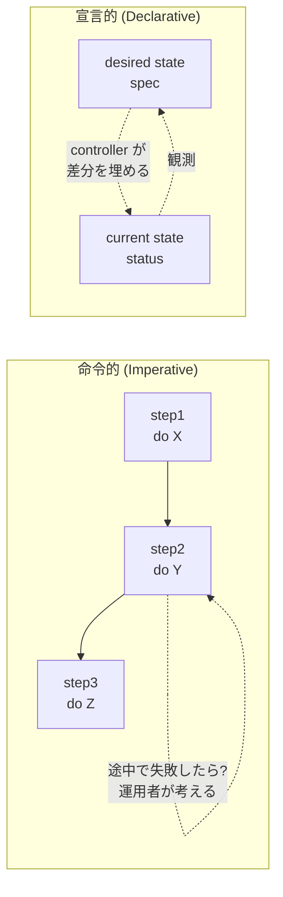
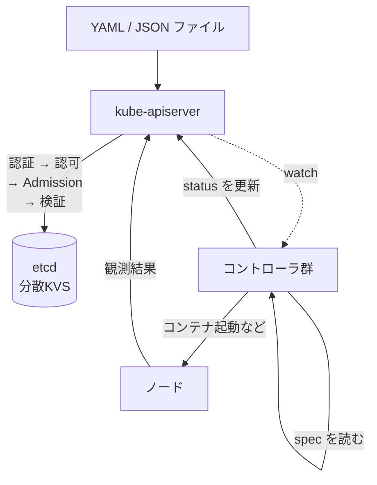
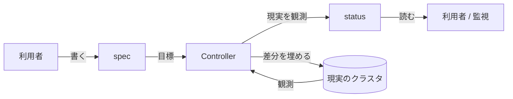
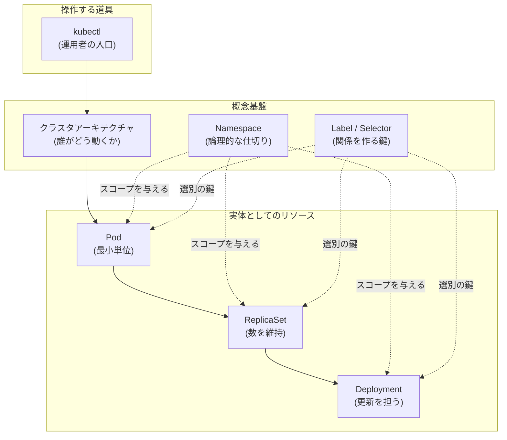
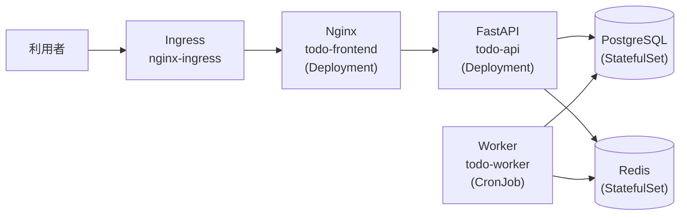
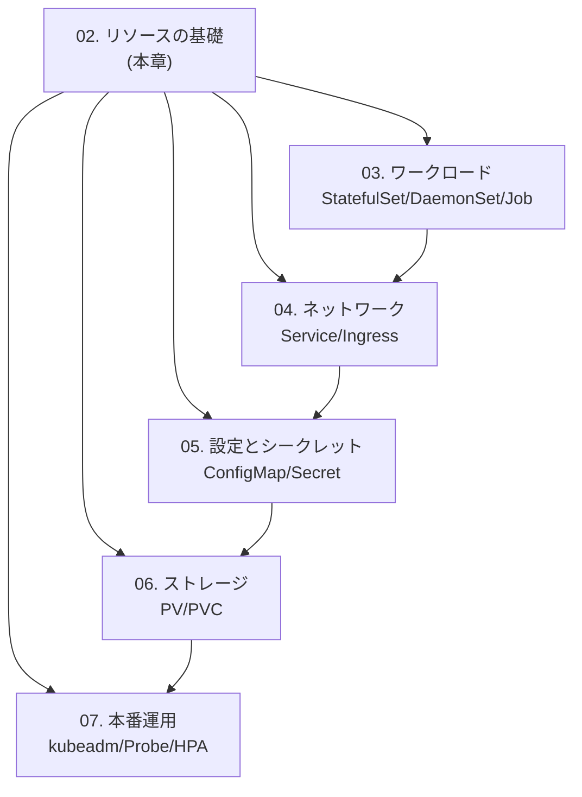

# 02. リソースの基礎
{: .no_toc }

## 目次
{: .no_toc .text-delta }

1. TOC
{:toc}

---

## このページのゴール

このページを読み終えると、以下を **自分の言葉で説明できる** ようになります。

- Kubernetes における「リソース」とは何で、なぜ YAML(あるいは JSON)で書く形式に落ち着いたか、その歴史的経緯
- 本章で扱う 7 つのトピック(クラスタアーキテクチャ / kubectl / Pod / ReplicaSet / Deployment / Namespace / Label)の関係と、なぜこの順序で学ぶのか
- 全リソースに共通する API オブジェクトの基本構造(`apiVersion` / `kind` / `metadata` / `spec` / `status`)と、`spec` と `status` が分離されている理由
- サンプルアプリ「ミニTODOサービス」が本章のどこまで姿を現し、どこからを後の章に持ち越すか
- Minikube を使った本章の学習環境と、第7章以降で使う VMware kubeadm HA クラスタとの違い、そしてなぜ Minikube から始めるか
- 本章で身に付けた知識が、後続のどの章で「土台」として再登場するか

---

## 第2章の位置づけ

第1章では「Kubernetes とは何か」「コンテナと仮想マシンの違い」「なぜ宣言的なオーケストレーションが必要なのか」といった、**外側から見た Kubernetes** を扱いました。本章はそこから一歩内側に入り、**実際に `kubectl` で触れる「もの」**、すなわち **API リソース(API Resource)** を扱います。

Kubernetes における操作はすべて、何らかの API リソースを **取得・作成・更新・削除** することに帰着します。`kubectl get pods` も `kubectl apply -f deployment.yaml` も `kubectl delete namespace dev` も、突き詰めれば API Server に対して「このリソースをこう変更したい」というリクエストを HTTP で送っているに過ぎません。`kubectl edit` も内部では「現状を GET して、エディタで変更させ、PATCH で送る」という分解可能な手順です。

この **「Kubernetes はリソースを操作する API 駆動システムである」** という事実を腹落ちさせることが、第2章のもっとも重要な目的です。これが分かると、第3章以降で出てくるあらゆる新リソース ─ StatefulSet / DaemonSet / Job / Service / Ingress / ConfigMap / Secret / NetworkPolicy / PersistentVolume / Custom Resource ─ も「同じ枠組みで増えていく仲間」として理解できるようになります。逆にここを曖昧にしたまま先に進むと、リソースが増えるたびに別世界として暗記する破目になり、学習コストが指数的に膨らみます。

{: .important }
> 本章は後続章すべての**基礎工事**です。Pod や Deployment の YAML を「とりあえず動く形」で書ければ良い、ではなく、**「なぜそう書くのか」を 1 行ずつ説明できる** 状態を目標にしてください。

---

## 「リソース」とは何か ─ 歴史的背景

Kubernetes に触れたばかりの人がまず戸惑うのは、「Pod とは何か」より前に、**そもそも `kubectl apply -f xxx.yaml` が世界に対して何をしているのか** が腑に落ちないところです。これは技術的な難しさというより、**設計思想の歴史的背景** を知らないと見えてこない部分です。先に歴史をなぞっておきます。

### Kubernetes 以前の世界(2010 年代前半)

2010 年代前半、コンテナ実行環境のデファクトは **Docker** でした。当時のデプロイは、おおむね次のいずれかの方式で行われていました。

- **手動 ssh + `docker run`** : サーバに ssh して `docker run -d --name app -p 80:80 myapp:1.0` を実行する方式。ホスト名・ポート・環境変数・依存サービスの起動順をシェルスクリプトで管理。スケールアウトは「同じコマンドをノード分繰り返す」。冪等性なし、復旧手順は人間の頭の中
- **構成管理ツール(Ansible / Chef / Puppet)** : Playbook や Recipe に「この状態にせよ」と書く。冪等性はあるが、ツール自体はコンテナを意識しない時代もあり、結局 `docker run` をラップしただけで、コンテナのライフサイクル(再起動・障害復旧)はカバーされなかった
- **Docker Swarm / Mesos+Marathon / Nomad** : 一応のオーケストレータ。しかし API 仕様・拡張モデル・ネットワークモデル・ストレージモデルが各製品で大きく異なり、移植性が低かった。あるアプリは Marathon の JSON、別のアプリは Swarm の Compose、ネットワークは別ツール、という分断も常態だった

これらに共通する根本問題は、**「クラスタ全体のあるべき姿」をひとつの一貫したデータモデルで表現できなかった** ことです。サーバ台数を 100 台に増やそうとした瞬間、運用者の頭の中だけが「真実の単一情報源(single source of truth)」になり、誰かが辞めた瞬間にクラスタの状態が誰にも分からなくなる、ということが起きていました。

### Borg と Omega ─ Google 内製の系譜

Kubernetes の直接の祖先は、Google 社内のクラスタマネージャ **Borg**(2003 年頃〜)と、その後継研究プロジェクト **Omega**(2013 年論文)です。Borg はモノリシックなスケジューラとして圧倒的な実績を残しましたが、Omega の論文 ─ "Omega: flexible, scalable schedulers for large compute clusters", EuroSys 2013 ─ で次の点が明確に示されました。

- 中央集権的な単一スケジューラは、機能追加のたびに肥大化し、スケーラビリティとイノベーション速度の両方を阻害する
- **共有された一貫性のある状態(shared state)** を中心に置き、各コントローラがそれを楽観的に並行して操作する方が、機能ごとの独立進化と全体スループットを両立できる

この「**共有状態 + 楽観的並行制御 + 多数の独立コントローラ**」というアーキテクチャが、後の Kubernetes の核心になりました。Kubernetes における etcd が「共有状態」、`resourceVersion` が「楽観的並行制御の鍵」、Controller Manager の中の各コントローラが「独立に動くワーカー」、と直接対応しています。

### Kubernetes の発明 ─ 宣言的 API リソース

2014 年に Google が公開した Kubernetes(初期コードネーム "Project Seven")は、Borg/Omega の経験を踏まえ、次の決断をしました。

- **クラスタ内のあらゆる状態を「リソース」という API オブジェクトとして表現する**
- リソースは REST 風の URL(例 : `/api/v1/namespaces/default/pods/web-0`)で識別される
- 外部表現は **JSON / YAML**。人間にも機械にも読み書きしやすい
- リソースには **`spec`(あるべき姿)** と **`status`(現在の姿)** が常にセットで存在する
- Kubernetes 本体(Controller Manager / Scheduler / 各種コントローラ)は、ひたすら `spec` と `status` の差分を埋め続けるだけ

この発明により、運用者は「**何をしてほしいか**」だけを書けばよくなり、「**どうやってその状態に持っていくか**」の詳細はコントローラに任せられるようになりました。これを **宣言的 API(Declarative API)** と呼びます。



命令的アプローチでは「途中でコケたらどう復旧するか」をすべて運用者が考える必要がありました。宣言的アプローチでは、コントローラが繰り返し差分を埋めるため、**部分的な失敗は自動的にリトライされ、収束** します。ノードが 1 台落ちても、ネットワークが瞬断しても、API Server が再起動しても、コントローラは「次のループで」差分を発見して埋めます。これが「Kubernetes は壊れにくい」と言われる根源です。

### YAML に落ち着いた理由

「なぜ YAML なのか」も歴史的経緯があります。初期の Kubernetes は内部表現として Protocol Buffers と JSON を使っていましたが、運用者がエディタで書く外部表現として JSON はコメントが書けず、ブロックの差し込みが冗長でした。一方、当時 Ansible / SaltStack / CloudFormation のような既存ツールで運用者が慣れていたのが YAML で、ここに合わせた経緯があります。

YAML はインデントの曖昧さ・タブ禁止・型推論の罠(`yes` が真偽値になる、`01` が整数になる、など)など欠点も多いですが、**Kubernetes の YAML はあくまで「JSON と等価な外部表現」** にすぎません。

```bash
# 同じリソースを YAML / JSON 両方で見られる
kubectl get pod web-0 -o yaml
kubectl get pod web-0 -o json
```

これを正しく理解しておくと、CI/CD で YAML を機械的に生成・検証する場面で、JSON Schema や `kubectl apply --dry-run=server -o json` を使った検証が自然にできるようになります。

{: .note }
> 本教材では基本的に YAML を使いますが、`kubectl get pod web -o json` のように JSON で受け取ることもいつでも可能です。「YAML が読めれば JSON も読める / その逆も真」を押さえておいてください。

### 「リソース」という用語の整理

Kubernetes の文脈で **リソース(Resource)** という単語は、似た 3 つの意味で使われ、混乱の原因になります。本章で押さえておきます。

| 文脈 | 意味 | 例 |
|---|---|---|
| API リソース | API Server が公開する型(Kind)とそのエンドポイント | `pods`, `deployments`, `namespaces` |
| リソースインスタンス | 上記の型の実体 | `pod/web-0`, `deployment/todo-api` |
| 計算リソース | CPU / メモリ / GPU といった物理量 | `requests.cpu: 100m` |

本章で「リソース」と言うときは、原則 1 番目と 2 番目の意味です。3 番目(計算リソース)は文脈から判別しやすいですが、両方が同じ文に出てくる場合は注意してください。

---

## API オブジェクトの基本構造

本章で扱うすべてのリソース ─ Pod も Deployment も Namespace も ─ は、次の 4 つのトップレベルフィールドを持ちます。これは Custom Resource Definition で定義される独自リソースでも変わりません。**全リソースで揃っている** のがポイントです。

```yaml
apiVersion: <group>/<version>   # どの API グループ・バージョンか
kind: <Kind>                    # Pod / Deployment / Service など
metadata:                       # 名前・Namespace・ラベル・注釈
  name: ...
  namespace: ...
  labels: {...}
  annotations: {...}
spec:                           # 「あるべき姿」: 利用者が記述する
  ...
status:                         # 「現在の姿」: コントローラが書き込む
  ...
```



### `apiVersion`

`apps/v1`, `v1`(core), `batch/v1`, `networking.k8s.io/v1` のように、**API グループ + バージョン** の形式です。

- **なぜグループに分かれているか** : 大量のリソース定義を単一のグループで膨らませると、API Server の互換性管理が破綻するため。新機能は新しいグループ(例 : `policy/v1`, `discovery.k8s.io/v1`)で導入し、安定すれば他のグループに昇格・統合される
- **なぜバージョンが付いているか** : `v1alpha1` → `v1beta1` → `v1` のように、互換性レベルを段階的に示す。`alpha` は本番禁止、`beta` も本番では限定使用が原則。`v1` 昇格後は **後方互換が保証** される
- **core グループだけ省略形(`apiVersion: v1`)** : 歴史的経緯で、`/api/v1` という URL に紐付く特別なグループ。Pod / Service / Namespace / ConfigMap / Secret / Node / PersistentVolume などコアな概念がここに収まる

```bash
kubectl api-versions       # 現クラスタが持つ全 API グループとバージョン
kubectl api-resources      # 全リソース一覧 (Kind, apiVersion, namespaced の可否を含む)
kubectl api-resources --api-group=apps   # apps グループだけ
kubectl api-resources -o wide            # サポートする動詞 (verbs) も表示
```

各フラグの意味を整理します。

- `api-versions` : クラスタが「**喋れる**」API グループとバージョンの一覧を返す。`v1.30` のクラスタでも、有効化されているフィーチャゲートによって `alpha` バージョンの API が見えたり見えなかったりする
- `api-resources` : クラスタで実際に「**使える**」リソースの型一覧。CRD で増えたリソースもここに出る
- `--api-group=` : 指定したグループだけに絞る
- `-o wide` : `VERBS` 列が増え、各リソースに対してどの動詞(get/list/create/update/patch/delete/watch)が使えるかが見える。**RBAC を書くときの根拠資料** になる

### `kind`

リソースの型名。**最初の文字は大文字**(`Pod`, `Deployment`, `Service`)。`kubectl` のリソース引数で使う短縮形(`po`, `deploy`, `svc`)は、`kind` ではなく **`kubectl` 側の別名解決機能(short name)** です。これは混同しやすいので注意してください。

```bash
kubectl api-resources | grep -i pod
# NAME              SHORTNAMES   APIVERSION   NAMESPACED   KIND
# pods              po           v1           true         Pod
```

ここで列の意味は次の通りです。

- `NAME` : URL に出る複数形の小文字名(`/api/v1/namespaces/default/pods`)
- `SHORTNAMES` : `kubectl` で使える短縮形
- `APIVERSION` : `apiVersion` フィールドに書く値
- `NAMESPACED` : Namespace スコープか、Cluster スコープか
- `KIND` : YAML の `kind:` に書く正式名

### `metadata`

| フィールド | 必須 | 役割 |
|---|---|---|
| `name` | ◯(原則) | Namespace 内で一意な ID |
| `namespace` | (Namespace スコープのリソースのみ) | 所属 Namespace |
| `generateName` | △ | `name` の代わりに、サフィックス自動生成での命名(例 : `web-`) |
| `labels` | 任意 | Selector の対象になるキー・バリュー |
| `annotations` | 任意 | Selector で使えない補足情報 |
| `uid` | 自動付与 | クラスタ全体で一意な UUID。**`name` と違い、再作成すると変わる** |
| `resourceVersion` | 自動付与 | 楽観的並行制御のためのバージョン文字列 |
| `generation` | 自動付与 | `spec` の世代番号。`spec` を変更するたびに増える |
| `ownerReferences` | 自動 / 手動 | 親リソースへのポインタ。GC のヒント |
| `finalizers` | 任意 | 削除前に実行すべき処理のキュー |
| `deletionTimestamp` | 自動 | 削除要求が入った時刻 |

このうち `labels` は本章の最後の節([Label と Selector]({{ '/02-resources/label/' | relative_url }}))で詳述します。`ownerReferences` は ReplicaSet と Deployment の関係を語る場面で再登場します。`finalizers` は第6章のストレージ周りで頻出します。

### `spec` と `status` の分離

ここが Kubernetes 設計でもっとも大事な分離です。

- **`spec` は利用者が書く** : 「Pod を 3 つ動かしたい」「イメージは `nginx:1.27` が良い」「メモリは 256Mi まで」
- **`status` はコントローラが書き込む** : 「実際は 2 つしか動いていない」「Pod x が `ImagePullBackOff` で待機中」「直近の reconcile は 3 秒前」

利用者は決して `status` に書き込みません(API Server も書き込みを拒否するエンドポイントを別に持っています)。`status` を更新する権利は、対応するコントローラだけが持ちます。これは単なるマナーではなく、**API Server レベルで強制** されています。



このループ ─ **観測 → 比較 → 動作 → 観測** ─ を **Reconciliation Loop** と呼びます。コントローラの実装はおよそすべてこのループです。第3章以降で出てくる Operator パターンも、突き詰めれば **「自分用のリソースを CRD で定義し、その Reconciliation Loop を書く」** だけのことです。

{: .tip }
> `kubectl get pod web-0 -o jsonpath='{.spec}'` と `'{.status}'` を打ち比べると、両者の責任分担が一目で分かります。慣れない時期は、新しいリソースを学ぶたびにこの 2 つを打ってみてください。

---

## 本章で扱う 7 つのトピックの全体像

本章では次の順で学びます。それぞれの位置関係を図にすると、こうなります。



各トピックの目的を一行ずつまとめます。

- **クラスタアーキテクチャ** : `kube-apiserver` / `etcd` / `kube-scheduler` / `kube-controller-manager` / `kubelet` / `kube-proxy` / コンテナランタイム / CNI / CSI が、リソース操作の裏でどう連携するか
- **kubectl の基本** : 上記アーキテクチャに対して、運用者が最初に触れる UI としての CLI。`get` / `describe` / `apply` / `logs` / `exec` / `diff` の意味と使い分け
- **Pod** : Kubernetes の最小デプロイ単位。1 つ以上のコンテナをネットワーク・ストレージを共有する形で束ねる
- **ReplicaSet** : Pod を指定数維持するためのコントローラ。Deployment の内部で間接的に使われる
- **Deployment** : 実運用でステートレスアプリを表現する標準リソース。ReplicaSet を内部で動かしてローリングアップデートを実現
- **Namespace** : クラスタを論理分割し、RBAC・Quota・ネットワークポリシーの単位になる
- **Label / Selector** : リソース同士の関係(Service が Pod を選ぶ、Deployment が Pod を選ぶ)を成立させる基盤

### なぜこの順序で学ぶのか

順序には根拠があります。

1. **クラスタアーキテクチャを最初に置く理由** : Pod や Deployment の YAML だけを覚えても、`kubectl apply` した瞬間に etcd のどこに書かれ、どのコントローラがそれを拾い、どのノードの kubelet が動かすか、を理解していないと、トラブル時にどこを見るべきか分かりません。**「Kubernetes はブラックボックス」と思い込むのが、初心者がもっとも抜け出しにくい罠** です
2. **kubectl を 2 番目に置く理由** : 以降の全ページでコマンド例が大量に出るため、`-n` `-l` `-o` `--dry-run=client` などの **共通フラグの意味** をここで一度押さえておきたい
3. **Pod → ReplicaSet → Deployment の順** : Deployment は内部で ReplicaSet を作り、ReplicaSet は内部で Pod を作ります。**下から上へ抽象を積む** ほうが、各リソースの存在意義が腑に落ちます。逆順で先に Deployment を見せると、「ReplicaSet って結局何のためにある?」という疑問がずっと残ったまま進むことになります
4. **Namespace を Deployment の後に置く理由** : Namespace は単独で学ぶより、「**Pod や Deployment を、どんなスコープに置くか**」という問題を経験してから学んだほうが効きます
5. **Label / Selector を最後に置く理由** : Label そのものは難しくありませんが、「**Service が Pod を見つける仕組み**」「**Deployment が自分の Pod を見分ける仕組み**」を支える要として、ここまでの全リソースを Label の視点から再整理する位置に置きます

---

## サンプルアプリ「ミニTODOサービス」と本章

本教材では、章をまたいで段階的に成長する **ミニTODOサービス** を作っていきます。最終的なアーキテクチャはこうなります。



このうち **本章で扱うのは `todo-api` と `todo-frontend` の最低限の Deployment まで** です。状態を持つ PostgreSQL / Redis は第3章の StatefulSet で、Cron バッチの `todo-worker` は同じく第3章の CronJob で、Ingress は第4章で順に増やしていきます。

イメージは原則ローカルレジストリ `192.168.56.10:5000`(VMware 環境を想定)に置く前提ですが、本章は **Minikube 環境** で進めるため、当面は次のように読み替えます。

| 章 | 環境 | レジストリ |
|---|---|---|
| 1〜6章 | Minikube | `minikube image load` で直接ロード、または公開イメージ |
| 7章以降 | VMware kubeadm HA クラスタ | `192.168.56.10:5000`(ローカル Docker Registry) |

第6章までは「公開イメージ + 軽量 Minikube」、第7章で本番相当の環境に切り替え、レジストリも含めた本格運用に移行します。本章では Pod と Deployment が動いて `kubectl get pods` で見える、というところまでが目標です。

### 本章末までに `apply` するマニフェスト(全体像)

最終的に本章末尾までで `apply` する YAML はこうなります。各フィールドの意味は対応するページで詳説します。

```yaml
# todo-namespace.yaml
apiVersion: v1
kind: Namespace
metadata:
  name: todo
  labels:
    app.kubernetes.io/part-of: todo
---
# todo-frontend-deployment.yaml
apiVersion: apps/v1
kind: Deployment
metadata:
  name: todo-frontend
  namespace: todo
  labels:
    app.kubernetes.io/name: todo-frontend
    app.kubernetes.io/part-of: todo
    app.kubernetes.io/managed-by: kustomize
spec:
  replicas: 2
  selector:
    matchLabels:
      app.kubernetes.io/name: todo-frontend
  template:
    metadata:
      labels:
        app.kubernetes.io/name: todo-frontend
        app.kubernetes.io/part-of: todo
    spec:
      containers:
      - name: nginx
        image: nginx:1.27
        ports:
        - containerPort: 80
        resources:
          requests: {cpu: 50m, memory: 64Mi}
          limits:   {cpu: 200m, memory: 128Mi}
---
# todo-api-deployment.yaml
apiVersion: apps/v1
kind: Deployment
metadata:
  name: todo-api
  namespace: todo
  labels:
    app.kubernetes.io/name: todo-api
    app.kubernetes.io/part-of: todo
    app.kubernetes.io/managed-by: kustomize
spec:
  replicas: 2
  selector:
    matchLabels:
      app.kubernetes.io/name: todo-api
  template:
    metadata:
      labels:
        app.kubernetes.io/name: todo-api
        app.kubernetes.io/part-of: todo
    spec:
      containers:
      - name: api
        image: ghcr.io/example/todo-api:0.1.0   # 本章では仮で OK
        ports:
        - containerPort: 8000
        resources:
          requests: {cpu: 100m, memory: 128Mi}
          limits:   {cpu: 500m, memory: 256Mi}
```

**全章を通して同じアプリを成長させる** ので、本章で雑にラベルを付けると後の章で書き直しが必要になります。最初から `app.kubernetes.io/*` 推奨ラベルを徹底するのが、長く使える流儀です。

---

## 学習環境の前提

### Minikube(本章で使用)

各自の PC にインストールします。Windows / macOS / Linux のいずれでも動きます。

```bash
# macOS (Homebrew)
brew install minikube

# Windows (winget)
winget install Kubernetes.minikube

# Linux (deb)
curl -LO https://storage.googleapis.com/minikube/releases/latest/minikube_latest_amd64.deb
sudo dpkg -i minikube_latest_amd64.deb
```

```bash
minikube start --kubernetes-version=v1.30.0 --cpus=4 --memory=8g --driver=docker
minikube status
kubectl get nodes
```

各フラグの意味は次の通りです。

- `start` : Minikube クラスタを起動。初回は VM(またはコンテナ)を作成
- `--kubernetes-version=v1.30.0` : 本教材で揃えるバージョン。指定しないと Minikube の既定(リリース時期で変動)が使われ、章ごとの記述と微妙にずれる原因になる
- `--cpus=4` : Minikube VM(または driver)に割り当てる仮想 CPU 数。Pod を 10 個以上動かすと 2 では足りないことがある
- `--memory=8g` : メモリ。第3章の StatefulSet で PostgreSQL / Redis を起動すると、4g 以下では OOM で落ちることがある
- `--driver=docker` : 内部で使う仮想化方式。`docker` / `virtualbox` / `kvm2` / `hyperv` などから選ぶ。Docker Desktop が入っていれば `docker` が無難。VirtualBox が入っていれば `virtualbox` でも可

`minikube start` は内部で次を順に行います。

1. ドライバ(Docker / VirtualBox / KVM など)を選択し、VM またはコンテナを作成
2. その中に **kubeadm 相当のセットアップ** を実行し、コントロールプレーンと単一ノードを作る
3. CNI を入れる(Minikube 既定は Kindnet / 切り替えると Calico なども可)
4. `~/.kube/config` に `minikube` という context を追記する

つまり、Minikube は内部的には kubeadm に近い構成で動いており、第7章で本番相当の kubeadm HA クラスタに移ったとき、**コアな概念はそのまま使えます**。

```bash
# 後片付け / 作り直し
minikube stop                # 止める (etcd は保存される)
minikube delete              # 削除 (作り直すには最適)
minikube delete --all        # 複数プロファイルもまとめて削除
```

`stop` と `delete` の違いは大事です。`stop` は VM を一時停止しているだけで、`start` で復帰できます。`delete` は完全に消えるので、トラブルで状態が壊れたときの最終手段として使います。

### VMware kubeadm HA クラスタ(第7章以降で使用)

第7章からは、各自の PC に VMware Workstation を入れ、Ubuntu 22.04 の VM を 7 台立てて、本番相当の構成を構築します。

| ホスト名 | IP | 役割 |
|---|---|---|
| k8s-lb | 192.168.56.10 | HAProxy + keepalived + Docker Registry |
| k8s-cp1 | 192.168.56.11 | Control Plane HA #1 |
| k8s-cp2 | 192.168.56.12 | Control Plane HA #2 |
| k8s-cp3 | 192.168.56.13 | Control Plane HA #3 |
| k8s-w1 | 192.168.56.21 | Worker #1 |
| k8s-w2 | 192.168.56.22 | Worker #2 |
| k8s-w3 | 192.168.56.23 | Worker #3 |
| k8s-nfs | 192.168.56.30 | NFS サーバ |

- ネットワーク : VMware Host-only(VMnet1)で `192.168.56.0/24`
- コンテナランタイム : containerd
- CNI : Calico
- ストレージ : NFS-CSI(`StorageClass=nfs` を default)
- LoadBalancer : MetalLB(`192.168.56.200-250` プール)
- Kubernetes バージョン : v1.30

本章では **このクラスタは使いません**。ただし、本章で学ぶ Pod / Deployment / Namespace / Label の使い方は、第7章でそのまま流用します。「Minikube で動くものは kubeadm でも動く」── これが本教材の段階的な構成の根拠です。

### 本章で「やってはいけない」5 か条

Minikube は「壊れたら作り直せばいい」気軽さがありますが、その反面、運用クラスタに近い体験をするためには、次のような **本番運用の癖** を最初から付けておくと後が楽です。

1. **`default` Namespace に何でも apply しない** : 本章で `todo` Namespace を作って必ずそこに置く
2. **ラベルなしの Pod を作らない** : `app.kubernetes.io/name` などを必ず付ける
3. **`latest` タグのイメージを本番想定のマニフェストには書かない** : 再現性が崩れる
4. **`kubectl apply` の前に `kubectl diff` を打つ癖を付ける** : 第2章のうちに体に叩き込む
5. **クラスタを直接 `kubectl edit` するのは緊急時のみ** : 通常は YAML を Git に置き、apply で反映する

---

## 章を読むときの 5 つの約束

1. **YAML を写経するのではなく、`kubectl explain` でフィールドを引きながら読む** : 暗記ではなく、**API スキーマを引く能力** を育てます
2. **失敗したら `describe` → `events` → `logs` の順** : 第2章後半でこの調査フローを徹底します
3. **既存の YAML を `kubectl get -o yaml` で吐かせて読む** : クラスタ上の実物が最良の教材です
4. **コマンドは「動詞 + リソース + 名前 + フラグ」の構造で覚える** : 機械的な暗記ではなく、構造で記憶すると、新しいリソースが出てきても応用できます
5. **疑問は溜め込む** : 各ページの末尾に「チェックポイント」があるので、説明できないものを書き出して章末で再訪してください

---

## よくある誤解 ─ 先回り

本章で多くの初心者が引っかかるポイントを、先に列挙しておきます。各ページで詳説しますが、頭の隅に置いておくと回り道が減ります。

| 誤解 | 実際は | 解説ページ |
|---|---|---|
| 「Pod = 1 コンテナ」 | Pod は 1 つ以上のコンテナを束ねる「単位」 | [Pod]({{ '/02-resources/pod/' | relative_url }}) |
| 「Pod を直接 apply するのが基本」 | 実運用では Deployment 等を介する | [Pod]({{ '/02-resources/pod/' | relative_url }}) |
| 「Deployment が Pod を直接管理している」 | Deployment が ReplicaSet を作り、ReplicaSet が Pod を管理 | [Deployment]({{ '/02-resources/deployment/' | relative_url }}) |
| 「ReplicaSet をユーザーが書く」 | 通常は Deployment を介して間接的に作られる | [ReplicaSet]({{ '/02-resources/replicaset/' | relative_url }}) |
| 「Namespace で分ければ完全に隔離される」 | RBAC・Quota は分けられるが、ネットワーク・ノードは共有 | [Namespace]({{ '/02-resources/namespace/' | relative_url }}) |
| 「Label は単なる飾り」 | Service・Deployment・NetworkPolicy 等の動作の鍵 | [Label と Selector]({{ '/02-resources/label/' | relative_url }}) |
| 「`kubectl create` と `kubectl apply` は同じ」 | 命令型と宣言型で用途が違う | [kubectlの基本]({{ '/02-resources/kubectl/' | relative_url }}) |
| 「`kubectl get pods` で全クラスタの Pod が見える」 | 既定では現在の context の `default` Namespace のみ | [kubectlの基本]({{ '/02-resources/kubectl/' | relative_url }}) |

---

## 本章で身につくこと(成果物)

本章を終えると、次のことが手元の Minikube 上でできるようになります。

- `kubectl` で任意の Namespace の Pod / Deployment / ReplicaSet を **一覧・詳細表示・削除** できる
- ミニTODOサービスのフロントエンドと API を、Deployment として `todo` Namespace にデプロイし、**ローリングアップデート・ロールバック** を体験できる
- Pod の `Pending` / `CrashLoopBackOff` / `ImagePullBackOff` のいずれかをわざと起こし、`describe` → `events` → `logs` の流れで原因にたどり着ける
- 推奨ラベル(`app.kubernetes.io/*`)を意図して付与し、ラベルセレクタで自分の Pod だけを抽出できる
- `kubectl diff` を使って、本番作業前に変更差分を確認する流れを身につけている
- `kubectl explain pod.spec.containers.lifecycle` のように、未知のフィールドを **その場で引ける**

これらは第3章以降で **当然の前提** として扱われるため、本章は **跳ばさず・走り抜けず** に進めてください。

---

## 後続章との依存関係

本章のあとで本章の内容に依存する章を挙げておきます。



- **第3章「ワークロード」** : Pod / Deployment / ReplicaSet の理解が前提。StatefulSet・DaemonSet・Job は本章の延長
- **第4章「ネットワーク」** : Service が **Label Selector で Pod を選ぶ仕組み** は、本章の Label の章が直接の前提
- **第5章「設定とシークレット」** : ConfigMap / Secret は Pod に注入される。Pod の `env`, `volumeMounts` の知識が前提
- **第6章「ストレージ」** : PVC は Namespace スコープで、Pod の `volumes` 経由で使用。Namespace と Pod 仕様の前提
- **第7章「本番運用 / kubeadm」** : クラスタアーキテクチャの章が直接対応。本章で `kube-apiserver` / `etcd` / `kubelet` を理解しているかで、第7章の難易度が大きく変わる

逆に言えば、本章は **後続章すべての基礎工事** なので、ここを丁寧にやることが、結果的に学習全体の最短ルートになります。

---

## チェックポイント

ここまでで以下を **自分の言葉で** 説明できるか確認してください。

- [ ] Kubernetes における「リソース」とは何で、`apiVersion` / `kind` / `metadata` / `spec` / `status` がそれぞれ何のためにあるか説明できる
- [ ] 宣言的 API と命令的 API の違い、そして Reconciliation Loop が壊れにくさにどう寄与しているか説明できる
- [ ] 本章で扱う 7 つのトピックの関係を図に書ける(クラスタアーキテクチャ / kubectl / Pod / ReplicaSet / Deployment / Namespace / Label)
- [ ] サンプルアプリ「ミニTODOサービス」のうち、本章で扱うのはどこまでで、何を後の章に残すか説明できる
- [ ] Minikube と VMware kubeadm HA クラスタの違いと、本章でなぜ Minikube から始めるか説明できる
- [ ] よくある誤解(Pod = 1 コンテナ、Deployment が Pod を直接管理、Namespace で完全隔離 など)に対し、実態を 1 文で説明できる
- [ ] `kubectl api-resources` の出力で、`NAMESPACED` 列が何を意味するか説明できる

→ 次は [クラスタアーキテクチャ]({{ '/02-resources/architecture/' | relative_url }})
