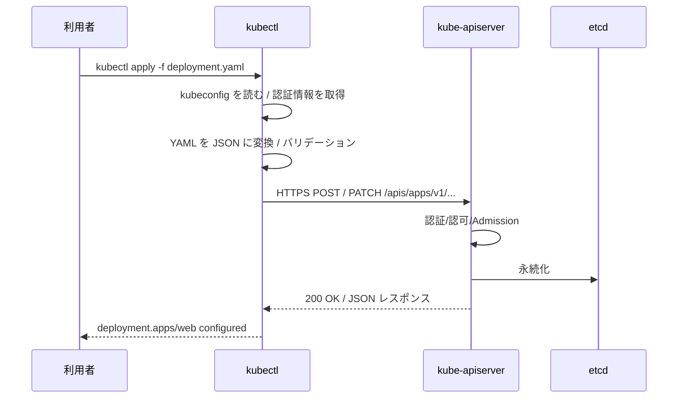
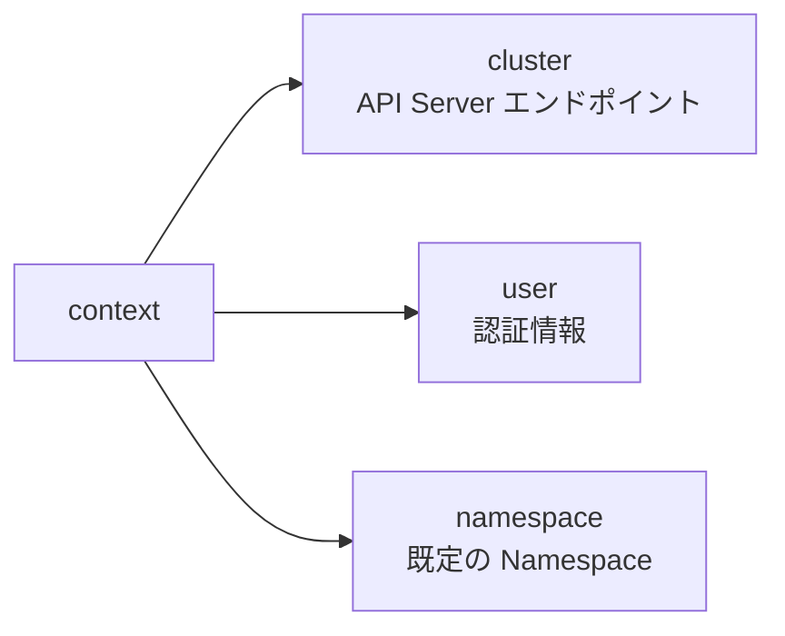
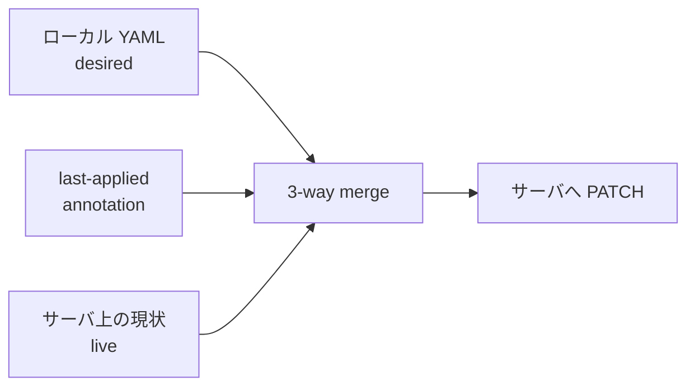
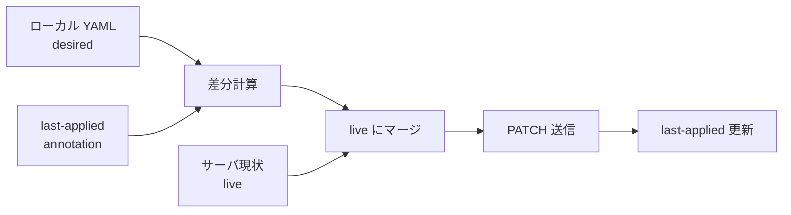
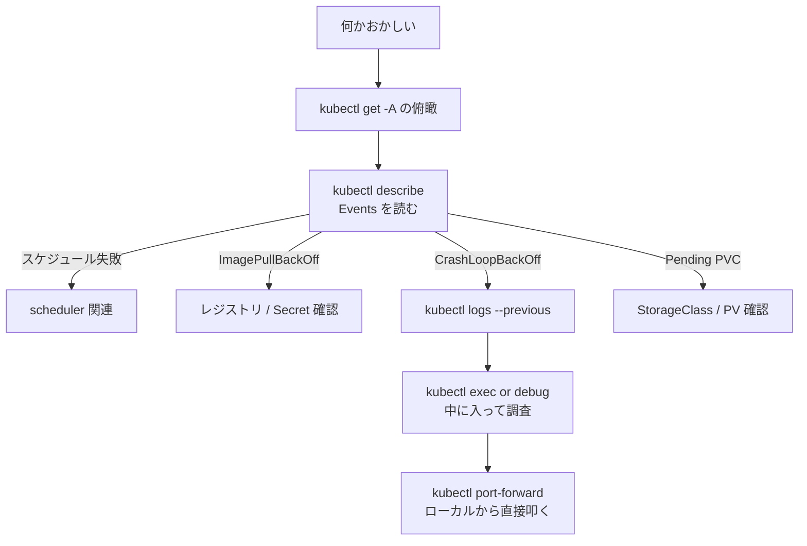
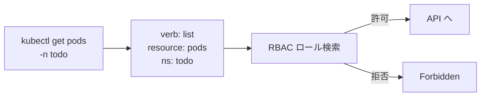

# kubectlの基本
{: .no_toc }

## 目次
{: .no_toc .text-delta }

1. TOC
{:toc}

---

## このページのゴール

このページを読み終えると、以下を **自分の言葉で説明できる** ようになります。

- `kubectl` が何をするツールで、内部的に何を行っているか(REST API クライアントとしての位置づけ)
- `kubeconfig` の構造(cluster / user / context)と、複数クラスタ・複数ユーザーを切り替える方法
- `kubectl` コマンドの汎用的な文法(`動詞 + リソース + 名前 + フラグ`)、主要な動詞の役割と使い分け
- `apply` と `create`、`replace` の違いと、本番運用で使い分ける根拠
- `-o yaml` / `-o jsonpath` / `-o go-template` などの出力フォーマットを使い分けて、必要な情報だけ取り出す方法
- `kubectl diff` / `--dry-run=server` / `kubectl explain` を活用した「壊さない運用」の流儀
- `kubectl` のプラグイン拡張(krew)、補完、エイリアスを含む実践的な効率化テクニック

---

## kubectl とは何か

`kubectl`(キューブ・コントロール、または「キューブシーティーエル」)は、**Kubernetes API Server に対する公式 HTTP クライアント** です。`kubectl get pods` も `kubectl apply -f x.yaml` も、内部で行われているのは次のような単純な動作です。



つまり、`kubectl` がやっているのは:

1. ローカルの **kubeconfig** から接続先 API Server と認証情報を取得
2. ユーザーの引数を **HTTP リクエスト**(GET / POST / PATCH / DELETE / WATCH)に変換
3. レスポンスを人間に読みやすい形式(`get` の表形式、`describe` の整形)で出力

これだけです。`kubectl` でできることは、すべて **直接 `curl` でも HTTP リクエストを叩けば再現可能** です。実際、トラブル時に「kubectl の問題なのか、API Server の問題なのか」を切り分けるとき、`curl -k --cert ... --key ... https://<api>:6443/api/v1/namespaces/default/pods` を打つのは有効な手段です。

### kubectl の生い立ち

Kubernetes 黎明期(2014〜2015 年)には `kubecfg` という別ツールが使われていましたが、機能拡張がしづらく、JSON ファイルを引数に取るシンプルすぎる設計でした。これを置き換えるかたちで 2015 年頃から **`kubectl`** が標準クライアントとなり、以後 10 年以上にわたって Kubernetes の正式 CLI として進化し続けています。

`kubectl` は API Server とは独立して開発・リリースされ、バージョン互換性ポリシーは「**API Server とプラスマイナス 1 マイナーバージョンまで動作保証**」という緩めのものです(例: API Server v1.30 に対して `kubectl` は v1.29 / v1.30 / v1.31 まで OK)。

```bash
kubectl version
# Client Version: v1.30.0
# Server Version: v1.30.0
```

`kubectl version --client` でクライアントだけのバージョン、`kubectl version` で双方を表示します。

### なぜ CLI なのか(代替手段との比較)

| 手段 | 用途 | 強み | 弱み |
|---|---|---|---|
| `kubectl` | 日常運用、対話的調査 | あらゆるリソースに統一構文、補完あり | 大量 YAML の管理は別途必要 |
| Web Dashboard | GUI 派の閲覧 | 視覚的にクラスタを把握できる | 操作履歴が残らない、本番非推奨 |
| `client-go`(Go SDK) | コントローラ実装 | プログラマブル | CLI ではない |
| 直接 `curl` | 仕組みの理解、デバッグ | 一切の中間層なし | 認証ヘッダ・JSON を手で組む |
| Argo CD / Flux | GitOps 運用 | Git を真実の源とする | 学習コスト、追加コンポーネント |
| k9s / Lens | TUI / GUI | 大量リソース閲覧が早い | 履歴が残りにくい(後述) |

本教材では `kubectl` を **第一の道具** とし、必要に応じて他を補助的に使う前提です。

---

## kubeconfig — kubectl の地図

`kubectl` は **kubeconfig** ファイルを読んで「どの API Server に、どの資格情報で接続するか」を決定します。デフォルトは `~/.kube/config`(Windows なら `%USERPROFILE%\.kube\config`)。環境変数 `KUBECONFIG` で上書きでき、コロン(Windows はセミコロン)区切りで複数指定するとマージされます。

```bash
echo $KUBECONFIG
# /home/alice/.kube/config:/home/alice/.kube/staging.yaml
```

### kubeconfig の構造

kubeconfig は YAML で、3 つのセクションから成ります。

```yaml
apiVersion: v1
kind: Config

clusters:           # 「どこに繋ぐか」
- name: minikube
  cluster:
    server: https://192.168.49.2:8443
    certificate-authority: /home/alice/.minikube/ca.crt

users:              # 「誰として繋ぐか」
- name: minikube
  user:
    client-certificate: /home/alice/.minikube/profiles/minikube/client.crt
    client-key: /home/alice/.minikube/profiles/minikube/client.key

contexts:           # 「どの組合せを使うか」
- name: minikube
  context:
    cluster: minikube
    user: minikube
    namespace: default

current-context: minikube
```



- **cluster** : 接続先 API Server の URL と CA 証明書
- **user** : 認証情報(クライアント証明書 / Bearer Token / OIDC / exec プラグイン)
- **context** : `cluster + user + namespace` の組合せに名前を付けたもの。`current-context` がアクティブ

これで「同じクラスタを別ユーザーで」「別クラスタを同じ Namespace で」など、組合せの再利用ができます。

### 操作コマンド

```bash
kubectl config current-context              # 現在の context
kubectl config view                         # 設定表示(機密はマスクされる)
kubectl config view --raw                   # 機密含めて表示(取扱い注意)
kubectl config get-contexts                 # context 一覧
kubectl config use-context <name>           # context 切替
kubectl config set-context --current --namespace=todo   # 既定 Namespace 変更
kubectl config rename-context old new       # context 名変更
kubectl config delete-context <name>        # context 削除
```

各コマンドの意味:

- `current-context` : 現在アクティブな context 名
- `view` : kubeconfig の中身を表示。証明書本文や Token は `DATA+OMITTED` でマスク
- `view --raw` : マスク無しで全部出す。**画面共有時は危険**
- `use-context` : `current-context` を書き換える。`set-context --current` と組合せると Namespace も切替可能
- `set-context --current --namespace=` : よく使う。これで毎回 `-n` を打たなくて済む

### 複数 kubeconfig のマージ

```bash
# 一時的にマージ
export KUBECONFIG=~/.kube/config:~/.kube/staging.yaml
kubectl config get-contexts

# 1 ファイルに結合して書き出す
KUBECONFIG=~/.kube/config:~/.kube/staging.yaml kubectl config view --flatten > ~/.kube/merged
```

`--flatten` は分散した証明書ファイルパスを Base64 埋め込み形式に変換します。配布用途で便利です。

### kubeconfig のセキュリティ

kubeconfig は **クラスタへの鍵** そのものです。漏洩すれば、書かれた権限のすべてが攻撃者に渡ります。本番では:

- リポジトリにコミットしない(`.gitignore` 必須)
- パーミッションを `600` に
- 短期トークン(OIDC や `kubectl-oidc-login`、または `aws eks get-token` のような exec プラグイン)を使い、長期固定 Token は避ける
- 共有 PC に置く場合は、ユーザー単位で分離

{: .warning }
> 開発で `cluster-admin` の kubeconfig をローカルに置きっぱなしにする習慣は危険です。本番想定なら最低限 RBAC で読み取り専用ユーザーを作って、書き換えは別 context に切り替えてから行うようにしてください。

---

## コマンドの基本構造

`kubectl` のコマンドはすべて次の構造に従います。**この構造を腹落ちさせると、新しい動詞・リソースが出てきても対応できます**。

```
kubectl <verb> <resource>[/<name>] [name2 ...] [flags]
```

具体例:

```bash
kubectl get pods                              # 動詞 + リソース
kubectl get pod web-0                         # 動詞 + リソース + 名前
kubectl get pod web-0 -n todo                 # フラグ付き
kubectl get pod,svc -n todo                   # 複数リソース
kubectl delete deployment/web service/web     # type/name 形式
kubectl apply -f manifest.yaml                # 名前ではなくファイル指定
```

### リソース指定の形式

3 つの書き方が等価です。

```bash
kubectl get pods             # 複数形
kubectl get pod              # 単数形(同じ意味)
kubectl get po               # 短縮形
```

`kubectl api-resources` の `SHORTNAMES` 列で、各リソースの短縮形が確認できます。よく使うものは覚えておくと打鍵が楽です。

| 正式 | 短縮 | 用途 |
|---|---|---|
| `pods` | `po` | Pod |
| `deployments` | `deploy` | Deployment |
| `services` | `svc` | Service |
| `replicasets` | `rs` | ReplicaSet |
| `namespaces` | `ns` | Namespace |
| `nodes` | `no` | Node |
| `persistentvolumes` | `pv` | PersistentVolume |
| `persistentvolumeclaims` | `pvc` | PVC |
| `configmaps` | `cm` | ConfigMap |
| `serviceaccounts` | `sa` | ServiceAccount |
| `ingresses` | `ing` | Ingress |
| `daemonsets` | `ds` | DaemonSet |
| `statefulsets` | `sts` | StatefulSet |
| `cronjobs` | `cj` | CronJob |
| `horizontalpodautoscalers` | `hpa` | HPA |
| `customresourcedefinitions` | `crd` | CRD |

### 名前指定の方法

```bash
kubectl delete pod web-0 web-1 web-2          # 複数名を空白区切り
kubectl delete -f deployment.yaml             # ファイル内のリソースをすべて
kubectl delete pods -l app=web                # ラベルセレクタで一括
kubectl delete pods --all -n test             # Namespace 内全部 (危険!)
kubectl get pods --field-selector status.phase=Failed  # フィールドセレクタ
```

各フラグ:

- `-f <file>` : ファイル(YAML/JSON)指定。`-` で標準入力、URL も可、ディレクトリ指定で再帰
- `-l <selector>` : ラベルセレクタ。`-l app=web` `-l 'env in (dev,stg)'` `-l '!archived'`
- `--field-selector` : 限られたフィールドの完全一致。`status.phase`、`metadata.name`、`spec.nodeName` など。一部のフィールドのみ対応
- `--all` : Namespace 内の全リソース。**本番では絶対に使わない**

{: .warning }
> `kubectl delete pods --all` は再起動可能な Pod なら復旧しますが、`kubectl delete pvc --all` は **ストレージごと消える** 取り返しのつかない操作です。`-f` でマニフェスト経由か、明示的な名前指定で削除する習慣を。

---

## 主要な動詞

### get — 一覧・取得

最頻出の動詞。Namespace 内・Cluster 全体のリソース状態を表形式で取得します。

```bash
kubectl get pods                          # 既定 Namespace の Pod
kubectl get pods -n kube-system           # Namespace 指定
kubectl get pods -A                       # 全 Namespace (= --all-namespaces)
kubectl get pods -o wide                  # ノード名・IP も表示
kubectl get pods -o yaml                  # YAML フル出力
kubectl get pods -o json                  # JSON フル出力
kubectl get pods -o name                  # "pod/web-0" 形式のみ
kubectl get pods --watch                  # 変化を見続ける (= -w)
kubectl get pods --watch-only             # 初回出力なしでイベントだけ
kubectl get pods -l app=web               # ラベルセレクタ
kubectl get pods --show-labels            # 全ラベルを表示
kubectl get pods --sort-by=.metadata.creationTimestamp   # ソート
kubectl get pods --field-selector=status.phase=Running   # フィールドフィルタ
kubectl get pods -o custom-columns=NAME:.metadata.name,STATUS:.status.phase,IP:.status.podIP
kubectl get all                           # Pod, Service, Deployment, RS, etc. (CRD は含まれない)
```

各フラグ:

- `-n <ns>` : 対象 Namespace。未指定なら kubeconfig の `current-context` の `namespace`(さらに無ければ `default`)
- `-A` / `--all-namespaces` : 全 Namespace。本番調査では `-A` を付ける癖を付けるのが安全
- `-o wide` : 既定列に加えて `IP` `NODE` `READINESS GATES` などを追加
- `-o yaml` / `-o json` : 完全な API オブジェクトをダンプ。デバッグや 2 次加工に使う
- `-o name` : `pod/web-0` 形式の文字列のみ。シェルで `xargs` に渡しやすい
- `-o custom-columns=...` : 列を自前で指定
- `--watch` (`-w`) : 変化を即座に表示し続ける(Ctrl+C で抜ける)。CI/CD で使うなら `--watch-only` と `--request-timeout` で確実に終わらせる
- `--show-labels` : ラベルを最終列に表示
- `--sort-by` : JSONPath でソートキー指定。`.metadata.creationTimestamp` で作成順
- `--field-selector` : サーバ側でのフィールドフィルタ。**`-l` のラベルとは別物**

似た動詞:
- `describe` : 1 リソースの詳細(イベント含む)
- `top` : リソース消費量
- `logs` : Pod のログ

### describe — 詳細・イベント

`get -o yaml` が API オブジェクトの「**生データ**」なのに対し、`describe` は **人間向けに整形** され、関連イベント(scheduling 失敗、image pull 失敗など)も末尾にまとめられます。

```bash
kubectl describe pod web-0
kubectl describe deployment todo-api -n todo
kubectl describe node k8s-w1
```

**Pod が起動しないときの第一手は `describe`** です。末尾の `Events:` セクションに、`FailedScheduling` `FailedAttachVolume` `Pulling`/`Pulled`/`Failed` `BackOff` などが時系列で並びます。

```
Events:
  Type     Reason     Age    From               Message
  ----     ------     ----   ----               -------
  Normal   Scheduled  10s    default-scheduler  Successfully assigned default/web-0 to k8s-w1
  Normal   Pulling    9s     kubelet            Pulling image "nginx:1.27"
  Warning  Failed     8s     kubelet            Failed to pull image: ...
  Warning  Failed     8s     kubelet            Error: ErrImagePull
  Normal   BackOff    7s     kubelet            Back-off pulling image
```

`describe` のイベントは **1 時間で消えます**(`--event-ttl` の既定)。古いイベントを保持したい場合は別ツール(Loki, Eventrouter など)が必要です。

### get events — イベント単独

```bash
kubectl get events -n todo --sort-by=.lastTimestamp
kubectl get events --field-selector involvedObject.name=web-0
kubectl get events -A --sort-by=.metadata.creationTimestamp | tail -20
```

クラスタ全体の最近の異常を見るのに便利です。`Warning` だけ拾うなら `--field-selector type=Warning`。

### create — 命令型作成

```bash
kubectl create -f manifest.yaml           # ファイルから作成
kubectl create deployment web --image=nginx --replicas=3
kubectl create namespace dev
kubectl create secret generic db-pass --from-literal=password=s3cret
kubectl create configmap app-conf --from-file=./config/
```

特徴: **既に存在するとエラー**。スクリプトの「初回だけ作る」のような用途に向きます。各サブコマンド:

- `create -f` : ファイル経由
- `create deployment <name> --image=` : 簡易 Deployment 作成
- `create secret generic` : ファイル/リテラルから Secret を作る
- `create configmap` : 同上の ConfigMap
- `create -k <kustomize-dir>` : Kustomize ディレクトリから作成

`--dry-run=client -o yaml` と組合せると **YAML 雛形ジェネレータ** として強力です(後述)。

### apply — 宣言型作成・更新

```bash
kubectl apply -f manifest.yaml            # 1 ファイル
kubectl apply -f ./manifests/             # ディレクトリ再帰
kubectl apply -k ./overlays/dev/          # Kustomize
kubectl apply -f https://example.com/manifest.yaml   # URL
```

`apply` は 3-way merge を行います。ローカルの YAML、`last-applied-configuration` annotation、サーバ上の現状の 3 つを比較して、**ローカルで明示的に指定したフィールドだけを更新** します。これにより、複数のオペレータや HPA がそれぞれ別フィールドを書き換えても衝突しません。



詳細は次の節「apply と create の違い」で扱います。

### delete — 削除

```bash
kubectl delete pod web-0
kubectl delete -f manifest.yaml           # マニフェストに書かれたものすべて
kubectl delete pods -l app=web            # ラベルセレクタ
kubectl delete pod web-0 --grace-period=0 --force   # 強制即時削除 (危険)
kubectl delete pod web-0 --wait=false     # 削除完了を待たない
kubectl delete namespace dev              # Namespace ごと一括 (中身も全部)
```

各フラグ:

- `--grace-period=<sec>` : 削除前の SIGTERM から SIGKILL までの猶予秒。既定は Pod の `terminationGracePeriodSeconds`(さらに無ければ 30s)。`0` は **強制 SIGKILL**(データ整合性が壊れる可能性、StatefulSet では特に避ける)
- `--force` : 強制。`--grace-period=0` と併用が一般的
- `--wait=false` : 削除完了を待たずにコマンドを抜ける。CI で並列削除するときに

{: .warning }
> `kubectl delete pod xxx --force --grace-period=0` は **etcd 上の Pod レコードを即座に消すだけ** で、ノード上の実コンテナはまだ動いている可能性があります。kubelet が後追いで殺しますが、二重起動の危険があるため、StatefulSet の Pod では原則使用禁止です。

### edit — エディタ起動

```bash
kubectl edit deployment web
kubectl edit -f manifest.yaml
```

`$KUBE_EDITOR`(無ければ `$EDITOR`)で起動するエディタで現状を開き、保存すると差分を `apply` 相当で送ります。**素早い修正には便利ですが、変更履歴が Git に残らない** ため、本番では原則禁止。緊急対応時のみ、後で必ず Git にバックポートする運用が現実解です。

### logs — ログ表示

```bash
kubectl logs web-0
kubectl logs web-0 -c nginx               # マルチコンテナ Pod の特定コンテナ
kubectl logs web-0 --previous             # 1 つ前の起動のログ (= -p)
kubectl logs web-0 -f                     # tail -f 相当
kubectl logs web-0 --tail=100             # 末尾 100 行
kubectl logs web-0 --since=1h             # 直近 1 時間
kubectl logs web-0 --timestamps           # タイムスタンプ付き
kubectl logs -l app=web --tail=50         # 複数 Pod 横断
kubectl logs -l app=web --max-log-requests=10  # 並列 Pod 数の上限
```

各フラグ:

- `-c <name>` : マルチコンテナ Pod で特定コンテナを指定。未指定だと最初のコンテナ
- `--previous` (`-p`) : 直前の起動(クラッシュした Pod の死因調査の必須コマンド)
- `-f` (`--follow`) : ストリーミング
- `--tail=N` : 末尾 N 行のみ
- `--since=<duration>` : `1h` `30m` `5s` などの相対時間
- `--since-time=2026-05-06T10:00:00Z` : 絶対時間
- `--timestamps` : 各行に Pod 側時刻を付ける
- `-l <sel>` : ラベルマッチ。複数 Pod 横断ログ

### exec — Pod 内コマンド実行

```bash
kubectl exec web-0 -- ls /etc/nginx
kubectl exec -it web-0 -- bash            # インタラクティブ
kubectl exec -it web-0 -c sidecar -- sh   # コンテナ指定
kubectl exec web-0 -- env                 # 環境変数確認
```

各フラグ:

- `-i` (`--stdin`) : 標準入力を渡す
- `-t` (`--tty`) : TTY 割当
- `-c <name>` : コンテナ指定
- `--` : ここから先は **Pod 内に渡される引数**(`kubectl` のフラグと混ざらない)

`exec` はデバッグの主力ですが、本番 Pod に shell を入れるのは原則 NG。代わりに `kubectl debug`(後述)で **エフェメラルコンテナ** を使います。

### port-forward — ローカル転送

```bash
kubectl port-forward svc/web 8080:80                  # Service へ
kubectl port-forward pod/web-0 8080:8080              # Pod へ
kubectl port-forward deployment/web 8080:80           # Deployment 配下の任意 Pod へ
kubectl port-forward svc/web 8080:80 9090:9090        # 複数ポート
kubectl port-forward svc/web :80                      # ローカル側ポートを自動割当
kubectl port-forward --address 0.0.0.0 svc/web 8080:80   # 外部からも待受 (注意)
```

LoadBalancer や Ingress を介さず、開発時に手元で API を叩きたいときに必須。Service / Pod / Deployment いずれも対象にできます(Service なら EndpointSlice 経由で 1 つの Pod が選ばれる)。

### explain — スキーマ参照

```bash
kubectl explain pod
kubectl explain pod.spec
kubectl explain pod.spec.containers
kubectl explain pod.spec.containers.lifecycle
kubectl explain deployment.spec.strategy --recursive
```

YAML を書きながら「このフィールド何だっけ?」となったときの正解。**Web のドキュメントを引かずに済む** のが強みで、しかもクラスタにインストールされている **CRD のスキーマも引ける**。

```bash
kubectl explain ingress.spec.rules.http.paths
kubectl explain certificate.spec   # Cert-Manager の CRD
```

`--recursive` で全フィールドをツリー表示。`--api-version=apps/v1` で API バージョンを明示できます。

### patch — 部分更新

```bash
kubectl patch deployment web -p '{"spec":{"replicas":5}}'
kubectl patch deployment web --type=json -p='[{"op":"replace","path":"/spec/replicas","value":5}]'
kubectl patch deployment web --type=merge -p '{"metadata":{"labels":{"team":"platform"}}}'
```

3 種類のパッチ形式:

| `--type` | 形式 | 用途 |
|---|---|---|
| `strategic`(既定) | YAML/JSON 一部 | Kubernetes 標準。配列要素のマージ規則も理解 |
| `merge` | RFC 7396 JSON Merge Patch | シンプルな上書き |
| `json` | RFC 6902 JSON Patch | 細かい op (add/remove/replace/move) |

`apply` の方が宣言的で安全ですが、`patch` は **特定フィールドだけ手早く変える** 場面で重宝します。CI でレプリカ数を変えたい、ロールアウト中に annotation を打ちたい、などの用途。

### replace — 全置換

```bash
kubectl replace -f manifest.yaml
kubectl replace --force -f manifest.yaml   # 削除して作り直し
```

`apply` が「差分を当てる」のに対し、`replace` は「**まるごと差し替え**」。`last-applied` annotation の管理がない場合や、CI で完全置換したいときに使います。`--force` は **削除→再作成** で、状態を持つリソース(StatefulSet・PVC)では危険なので避けます。

### top — リソース消費

```bash
kubectl top nodes
kubectl top pods
kubectl top pods -A
kubectl top pods -n todo --containers
kubectl top pods --sort-by=cpu
```

Metrics Server が必要(Minikube は addon、第7章で kubeadm に導入)。Prometheus を入れていれば `kubectl top` の出番は減ります。

### scale — レプリカ数変更

```bash
kubectl scale deployment web --replicas=5
kubectl scale deployment web --replicas=3 --current-replicas=5   # 楽観ロック
kubectl scale --replicas=0 deployment web   # 一時停止
```

宣言的には YAML を書き換えて `apply` するのが正解ですが、対話的に試すなら便利です。`--current-replicas` は「**今 5 のときだけ 3 に**」のような条件付き更新で、競合を防ぎます。

### rollout — Deployment 操作

```bash
kubectl rollout status deploy/web
kubectl rollout history deploy/web
kubectl rollout history deploy/web --revision=3
kubectl rollout undo deploy/web
kubectl rollout undo deploy/web --to-revision=2
kubectl rollout restart deploy/web        # Pod を順次再作成 (env 変更なし)
kubectl rollout pause deploy/web
kubectl rollout resume deploy/web
```

詳細は [Deployment]({{ '/02-resources/deployment/' | relative_url }}) のページで。

### cp — ファイルコピー

```bash
kubectl cp web-0:/etc/nginx/nginx.conf ./nginx.conf
kubectl cp ./local.txt web-0:/tmp/local.txt
kubectl cp web-0:/var/log/app.log ./app.log -c app
```

Pod の `tar` コマンドを使ってコピーします。`tar` がない distroless イメージでは動かないので注意。代替として `kubectl exec ... cat > file` も使えます。

### run — 単発 Pod 起動

```bash
kubectl run nginx --image=nginx:1.27
kubectl run debug --rm -it --image=nicolaka/netshoot --restart=Never -- bash
kubectl run curl --rm -it --image=curlimages/curl --restart=Never -- sh
```

各フラグ:

- `--rm` : 終了時に Pod 削除
- `-i -t` : インタラクティブ
- `--restart=Never` : Pod そのもの(Deployment ではなく)。`OnFailure` だと Job、省略だと旧仕様で Deployment(警告が出る)
- `--image=` : イメージ
- `--` : Pod 内コマンドの開始

歴史的には `kubectl run` は `Deployment` を作るデフォルトでしたが、現在は **単発 Pod 起動** に役割を絞っています。デバッグ用ワンライナーとして優秀。

### debug — エフェメラルコンテナ

```bash
kubectl debug -it web-0 --image=nicolaka/netshoot --target=app
kubectl debug node/k8s-w1 -it --image=ubuntu
kubectl debug web-0 --copy-to=web-debug --container=app --image=busybox -- sh
```

各サブモード:

- **エフェメラルコンテナ注入**(`--target=`) : 動いてる Pod に **shell 専用コンテナを足して** プロセス共有(`shareProcessNamespace`)で覗く。本番イメージが distroless でもデバッグできる強力な手段
- **ノードデバッグ**(`node/<name>`) : ホストの `/` をマウントした Pod を起動。kubelet 不調などの調査に
- **Pod コピー**(`--copy-to=`) : 元 Pod を複製して特定コンテナを置き換え、安全に検証

本番運用での **新時代の標準デバッグ手段** です。`kubectl exec` と違って distroless でも、最小権限イメージでも対応できます。

### auth — 権限確認

```bash
kubectl auth can-i create deployments              # 自分の権限
kubectl auth can-i delete pods --as=alice          # 他ユーザーの権限
kubectl auth can-i list secrets -n production
kubectl auth can-i '*' '*' --all-namespaces        # cluster-admin か?
```

RBAC を設計・デバッグするときに必須。`--as` でユーザーをなりすましチェック、`--as-group` でグループ単位もチェックできます(自分が `impersonate` 権限を持っている場合)。

---

## apply と create の違い(詳説)

`kubectl apply -f` と `kubectl create -f` は似て非なるものです。**運用で書くコマンドはほぼ `apply`** ですが、違いを理解しておくと事故を減らせます。

### 動作の違い

| | create | apply |
|---|---|---|
| 既に存在するとき | エラー(`AlreadyExists`) | 差分適用 |
| `last-applied` annotation 付与 | しない | する(client-side apply のとき) |
| 3-way merge | しない(create は新規作成のみ) | する |
| Server-side Apply | 関係ない | `--server-side` で利用可 |
| 削除フィールドの扱い | — | YAML から消したフィールドは `null` で送られて消える |

### Client-side apply と 3-way merge

伝統的な `kubectl apply`(Client-side apply、CSA)は次の動作です。

1. ローカル YAML を読む
2. `last-applied-configuration` annotation を取得(過去に apply した内容)
3. サーバから現状(live)を取得
4. **ローカル(desired)と last-applied の差分** を計算
5. **その差分を live にマージ**
6. 結果を PATCH で送信
7. `last-applied-configuration` を更新



ポイント: **ローカル YAML から消えたフィールドは、last-applied と比較して「消したい」と判定されるときだけ削除** されます。つまり、ローカル YAML に書いてないフィールド(HPA が書き換えた `replicas` など)は触られません。

### Server-side Apply(SSA)

Kubernetes 1.18+ で GA。`--server-side` フラグで切替。

```bash
kubectl apply --server-side -f manifest.yaml
kubectl apply --server-side --field-manager=ci-pipeline -f manifest.yaml
kubectl apply --server-side --force-conflicts -f manifest.yaml
```

SSA は **「誰がどのフィールドを所有しているか」をサーバ側で記録**(`metadata.managedFields`)し、複数のクライアントが同じリソースを編集しても安全に共存できる仕組みです。Kustomize / Helm / オペレータ / 利用者の手動編集が同居するクラスタで威力を発揮します。

`--field-manager` でマネージャー名を指定、`--force-conflicts` で他マネージャーの所有フィールドを奪います。

{: .tip }
> 新規プロジェクトでは最初から SSA を選ぶのがおすすめです。GitOps ツール(Argo CD)や CI からの apply が混在するときに、フィールド所有のトラブルが激減します。

### YAML 生成の慣用句

`create` は **YAML 雛形ジェネレータ** として強力です。

```bash
# Deployment 雛形
kubectl create deployment web --image=nginx:1.27 --replicas=3 \
  --dry-run=client -o yaml > web-deployment.yaml

# Service 雛形
kubectl create service clusterip web --tcp=80:80 \
  --dry-run=client -o yaml > web-service.yaml

# ConfigMap 雛形 (ファイルから)
kubectl create configmap app-conf --from-file=./config/ \
  --dry-run=client -o yaml > app-configmap.yaml

# Job 雛形 (CronJob から実行)
kubectl create job manual-run --from=cronjob/nightly-batch \
  --dry-run=client -o yaml
```

各フラグ:

- `--dry-run=client` : クライアント側で検証だけ。サーバへは送らない
- `--dry-run=server` : サーバ側で Admission も含めて検証。送るが永続化しない(`-o yaml` で結果も見られる)
- `-o yaml` : 結果を YAML で

ゼロから手書きするより、`create --dry-run=client -o yaml` で雛形を作って手で修正するのが圧倒的に楽です。

---

## 出力フォーマット

`-o` で表示形式を指定します。これを使いこなすと `kubectl` がぐっと強力になります。

```bash
kubectl get pod web-0 -o yaml
kubectl get pod web-0 -o json
kubectl get pod web-0 -o wide
kubectl get pod web-0 -o name
kubectl get pod web-0 -o jsonpath='{.status.podIP}'
kubectl get pod web-0 -o jsonpath='{.status.containerStatuses[0].image}'
kubectl get pods -o jsonpath='{.items[*].metadata.name}'
kubectl get pods -o jsonpath='{range .items[*]}{.metadata.name}{"\t"}{.status.podIP}{"\n"}{end}'
kubectl get pod web-0 -o go-template='{{.status.podIP}}'
kubectl get pods -o go-template-file=template.tmpl
kubectl get pods -o custom-columns=NAME:.metadata.name,STATUS:.status.phase,IP:.status.podIP
kubectl get pods -o custom-columns-file=columns.txt
```

### JSONPath の小ネタ

```bash
# 全 Pod の image
kubectl get pods -o jsonpath='{.items[*].spec.containers[*].image}'

# Pod 名と Node を tab 区切り
kubectl get pods -o jsonpath='{range .items[*]}{.metadata.name}{"\t"}{.spec.nodeName}{"\n"}{end}'

# Failed Pod のみ
kubectl get pods --field-selector=status.phase=Failed -o jsonpath='{.items[*].metadata.name}'

# あるラベルを持つ Service の Cluster IP
kubectl get svc -l app=web -o jsonpath='{.items[0].spec.clusterIP}'
```

`jq` と組合せれば任意の処理:

```bash
kubectl get pods -A -o json | jq '.items[] | select(.status.phase=="Pending") | .metadata.name'
```

---

## デバッグ・トラブルシュート



### 鉄板コマンド一式

```bash
# 全 Namespace の異常を俯瞰
kubectl get pods -A | grep -vE 'Running|Completed'

# ノード状態
kubectl get nodes
kubectl describe node <name>

# Events の新しい順
kubectl get events -A --sort-by=.lastTimestamp | tail -30

# 特定リソースに関わる Events
kubectl get events --field-selector involvedObject.name=web-0

# 直近のクラッシュ調査
kubectl logs <pod> --previous
kubectl describe pod <pod>

# 中に入って確認
kubectl exec -it <pod> -- sh
kubectl debug -it <pod> --image=nicolaka/netshoot --target=app

# ローカルからアクセス
kubectl port-forward svc/<svc> 8080:80
```

### デバッグ用使い捨て Pod

```bash
kubectl run tmp --rm -it --image=nicolaka/netshoot --restart=Never -- bash
```

`netshoot` には `dig` `curl` `tcpdump` `traceroute` `nmap` `iperf3` などネットワーク調査ツールが詰まっており、クラスタ内の DNS や Service 疎通の調査で重宝します。

```bash
# DNS が引けるか
dig kubernetes.default.svc.cluster.local

# Service に届くか
curl -v http://web.todo.svc.cluster.local

# TCP で疎通
nc -zv web 80
```

---

## Dry-run と差分

本番作業前は **必ず** 差分を見てから apply します。

```bash
# クライアント側検証 (Admission は通さない)
kubectl apply -f manifest.yaml --dry-run=client

# サーバ側検証 (Admission も通す、永続化しない)
kubectl apply -f manifest.yaml --dry-run=server

# 適用前の差分を可視化 (重要!)
kubectl diff -f manifest.yaml
```

`kubectl diff` は内部で **Server-side Apply の dry-run を実行し、出力を `diff` 形式で見せる** ツールです。これを習慣化すると、「あれ?こんなはずじゃ…」を 9 割減らせます。CI/CD では `kubectl diff` をプルリクのコメントに貼る運用が一般的です。

`KUBECTL_EXTERNAL_DIFF=meld` のように環境変数で diff ツールを差し替えできます。

---

## 効率化テクニック

### エイリアスとシェル補完

```bash
# .bashrc / .zshrc
alias k=kubectl
alias kgp='kubectl get pods'
alias kgs='kubectl get svc'
alias kgd='kubectl get deploy'
alias kdp='kubectl describe pod'
alias kex='kubectl exec -it'
alias klf='kubectl logs -f'
alias kn='kubectl config set-context --current --namespace'

# 補完を有効化
source <(kubectl completion bash)
complete -F __start_kubectl k

# zsh
source <(kubectl completion zsh)
compdef __start_kubectl k
```

これだけで打鍵量が半減します。`k g p` で `kubectl get pods` まで補完される快適さは、覚えると後戻りできません。

### `--namespace` の手抜き

毎回 `-n todo` を打たなくて済むよう、Namespace 固定:

```bash
kubectl config set-context --current --namespace=todo
```

`kn todo` のエイリアスを上で作っているので、`kn todo` で切替可能。複数クラスタを行き来する場合は次の `kubectx` / `kubens` が便利です。

### kubectx / kubens

```bash
# インストール (例: macOS)
brew install kubectx

# 使い方
kubectx                  # context 一覧
kubectx production       # context 切替
kubectx -                # 直前の context に戻る
kubens                   # Namespace 一覧
kubens kube-system       # Namespace 切替
kubens -                 # 直前の Namespace に戻る
```

複数クラスタを行き来する人にとっては必須です。`fzf` 連携で対話選択もできます。

### k9s

ターミナル上のリアルタイム TUI ダッシュボード。

```bash
brew install k9s
k9s
```

操作:
- `:` でリソース種を切替(`:pods`, `:deploy`, `:svc`)
- `/` でフィルタ
- `l` でログ、`d` で describe、`s` で shell
- `Ctrl-d` で削除、`y` で YAML

{: .warning }
> `k9s` は便利ですが、**変更系の操作が手元の履歴に残らない** ため、本番作業ログが必要なときは kubectl を直叩きで端末履歴に残すのが運用上の基本です。「閲覧は k9s、変更は kubectl」と分業するのが定石。

### krew — kubectl プラグイン管理

```bash
# krew インストール後
kubectl krew install ctx ns tree neat trace
kubectl ctx                # kubectx 相当
kubectl ns                 # kubens 相当
kubectl tree deploy/web    # 所有関係をツリー表示
kubectl neat get pod web-0 -o yaml   # 不要メタデータを除いて見やすく
```

便利プラグインの例:

| プラグイン | 用途 |
|---|---|
| `ctx` / `ns` | context / Namespace 切替 |
| `tree` | `ownerReferences` のツリー表示(Deployment → RS → Pod) |
| `neat` | `managedFields` などのノイズを除去 |
| `view-secret` | Secret を base64 デコードして表示 |
| `cnpg` | CloudNative-PG オペレータ操作 |
| `outdated` | クラスタ内のイメージで更新があるもの |
| `who-can` | あるアクションができる主体を逆引き |

### 履歴を残す習慣

本番作業は必ず履歴を残す。`script -a ~/oncall.log` で端末ログを取る、`bash -ix` でコマンド出力を verbose に残す、社内の bastion は audit ログ必須、など。**Kubernetes 自体の audit ログ**(API Server 側)も合わせて取っておくと、後追い調査が劇的に楽になります。

---

## RBAC との関係

`kubectl` のコマンドは、内部的に「動詞 + リソース + Namespace」の組合せで RBAC 判定を受けます。

```bash
kubectl auth can-i get pods
kubectl auth can-i create deployments -n production
kubectl auth can-i delete nodes
kubectl auth can-i '*' '*'
kubectl auth can-i list secrets --as=alice
kubectl auth can-i list secrets --as=alice --as-group=devs
```

`yes` / `no` を返すので、CI で事前チェックに使えます。詳細は第7章の RBAC で扱います。



---

## ハンズオン

Minikube で `kubectl` の各動詞を一通り叩きます。

### 1. クラスタの俯瞰

```bash
kubectl version
kubectl get nodes -o wide
kubectl get all -A
kubectl api-resources
```

### 2. Namespace 作成と context 切替

```bash
kubectl create namespace todo
kubectl config set-context --current --namespace=todo
kubectl config view --minify | grep namespace
```

### 3. Pod 単体起動と観察

```bash
kubectl run nginx --image=nginx:1.27
kubectl get pods -w     # 別タブで観察
kubectl describe pod nginx
kubectl logs nginx
kubectl exec -it nginx -- ls /etc/nginx
kubectl port-forward pod/nginx 8080:80   # 別タブ
curl http://localhost:8080
```

### 4. YAML 生成と apply

```bash
kubectl create deployment web --image=nginx:1.27 --replicas=3 \
  --dry-run=client -o yaml > web.yaml
$EDITOR web.yaml          # 必要に応じて編集
kubectl diff -f web.yaml
kubectl apply -f web.yaml
kubectl rollout status deploy/web
```

### 5. ラベル操作

```bash
kubectl label pod nginx env=dev
kubectl get pods --show-labels
kubectl get pods -l env=dev
kubectl label pod nginx env-       # 削除
```

### 6. デバッグ動作の確認

```bash
# わざと壊す
kubectl set image deploy/web nginx=nginx:does-not-exist

# 観察
kubectl get pods -w
kubectl describe pod -l app=web | tail -30
kubectl rollout undo deploy/web
```

### 7. 後片付け

```bash
kubectl delete -f web.yaml
kubectl delete pod nginx
kubectl delete namespace todo
```

---

## トラブル事例集

### 事例 1: `error: the server doesn't have a resource type "xxx"`

**原因** : リソース種名が間違っている、またはその CRD が入っていない。

**確認** :
```bash
kubectl api-resources | grep -i xxx
```

### 事例 2: `error: unable to recognize "x.yaml": no matches for kind "..."`

**原因** : `apiVersion` が誤っているか、その API がクラスタにない。`kubectl explain` で正しい `apiVersion` を確認。

```bash
kubectl explain deployment | head -3
# KIND:     Deployment
# VERSION:  apps/v1
```

### 事例 3: `error: You must be logged in to the server (Unauthorized)`

**原因** : 認証情報が無効、トークン期限切れ、kubeconfig の cluster と user の対応がずれている。

**確認** :
```bash
kubectl config view --minify
kubectl auth can-i list pods
```

OIDC を使っている場合は `kubectl-oidc-login` などの再ログインを。

### 事例 4: `Error from server (Forbidden): pods is forbidden: User "..." cannot list pods`

**原因** : RBAC で許可されていない。

**確認** :
```bash
kubectl auth can-i list pods
kubectl get rolebinding,clusterrolebinding -A | grep <user>
```

### 事例 5: `kubectl apply` が `Operation cannot be fulfilled ... please apply your changes to the latest version`

**原因** : 楽観ロック衝突。誰か(別の人 or HPA)が同時に編集した。

**対処** : `kubectl apply` をもう一度叩く。`--force` は最終手段。SSA(`--server-side`)に切り替えて競合を整理するのも検討。

### 事例 6: `kubectl logs` が `previous terminated container ... not found`

**原因** : `--previous` 指定したが、コンテナがまだ一度もクラッシュしていない、または kubelet がログを保持していない。

### 事例 7: `kubectl exec` で `error: unable to upgrade connection: container not found`

**原因** : `-c` 指定間違い、または対象コンテナが起動していない。`kubectl describe pod` でコンテナ名と状態を確認。

### 事例 8: `kubectl port-forward` が突然切れる

**原因** : 対象 Pod が再作成された、ネットワーク不安定、Idle タイムアウト。

**対処** : スクリプトでループさせる、`--pod-running-timeout` で待ち時間調整、Service 経由の `port-forward` で個別 Pod 入替に強くする。

---

## チェックポイント

ここまでで以下を **自分の言葉で** 説明できるか確認してください。

- [ ] `kubectl` が内部で何をしているか(`kubeconfig` 読込 → HTTP リクエスト)を説明できる
- [ ] `kubeconfig` の `cluster` / `user` / `context` の関係と、context 切替の仕組みを説明できる
- [ ] `apply` と `create` の違いと、運用でどちらを使うか答えられる
- [ ] 3-way merge / Server-side Apply の違いと、SSA の利点を説明できる
- [ ] Pod の不調時に最初に打つコマンドを 3 つ言える(例: `describe` / `logs --previous` / `get events`)
- [ ] `kubectl diff` と `--dry-run=server` の役割の違いを説明できる
- [ ] `kubectl explain` で未知のフィールドを引く流れを再現できる
- [ ] `kubectl debug` がエフェメラルコンテナをどう使い、`exec` と何が違うか説明できる
- [ ] `kubectl auth can-i` の使い道を 2 つ以上挙げられる
- [ ] `--namespace` を毎回打たないための工夫(`config set-context` / `kubens`)を実践できる

→ 次は [Pod]({{ '/02-resources/pod/' | relative_url }})
