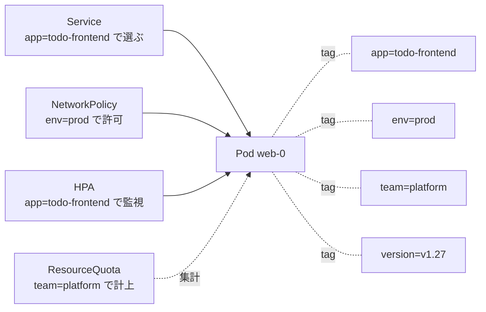
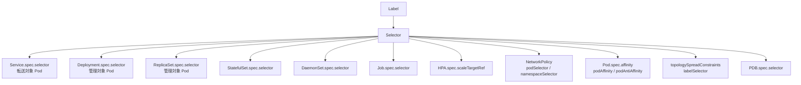
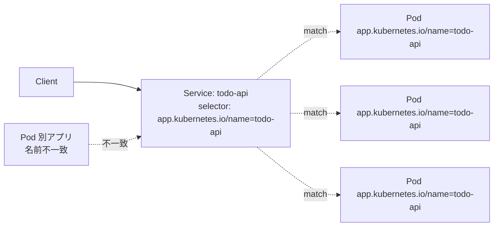
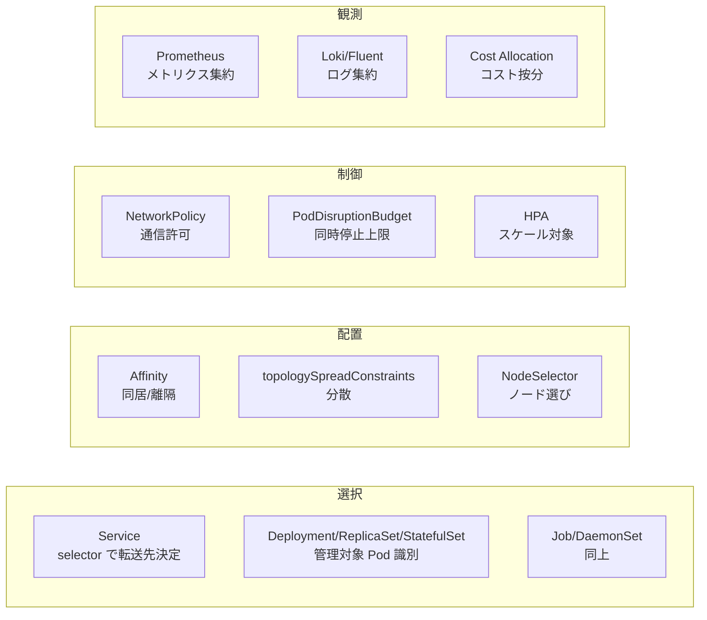
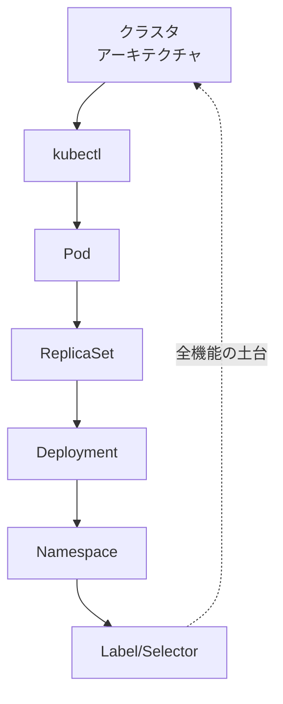

# Label と Selector
{: .no_toc }

## 目次
{: .no_toc .text-delta }

1. TOC
{:toc}

---

## このページのゴール

このページを読み終えると、以下を **自分の言葉で説明できる** ようになります。

- Label が **何のために生まれた** 仕組みか(リソースに型ではないグループ属性を付与する仕掛け)、それ以前のオーケストレータ(Borg や ECS Task Definition)と何が違うか
- Label の **構文上の制約**(キー長 / 値長 / プレフィックス / 文字種)と、その制約がある理由
- **Equality-based** と **Set-based** の 2 種類の Selector、`matchLabels` と `matchExpressions` の使い分け
- Label が Kubernetes の **多くの機能を支える基盤** であること(Service / Deployment / NetworkPolicy / Affinity / topologySpread / PDB / HPA / モニタリング)
- Label と Annotation の違いと、それぞれをいつ使うか
- **推奨ラベル** `app.kubernetes.io/*` を使う理由と、付ける順番
- ラベル設計の落とし穴(`selector` immutable、運用中の変更で発生する事故)と、本番で守るべき設計原則

---

## Label の生まれた背景

### 「型と分類は別物」

リソースを管理するシステムでは、「**型(これは何か?)**」と「**分類(どんな意味でグループ化するか?)**」は別の問題です。

- 型 = `Pod` / `Deployment` / `Service`(`kind`)
- 分類 = 「フロントエンド」「バックエンド」「prod 環境」「team-a 所有」「v2 リリース」

伝統的なリソース管理(EC2 のセキュリティグループ、ECS の Task 名、VMware のフォルダ構造など)では、分類のために **階層的なフォルダ** や **タグ + 配置位置** といった、互いに排他的な仕組みが混在していました。1 つのリソースを **複数の角度から同時に** グループ化したいとき、これは破綻します。

### Borg の lessons learned

Kubernetes の祖先 Borg では、**ジョブ名やネームスペース** に意味的な情報を埋め込む運用が行われていました。「`adsearch.frontend.prod`」のような階層名を作って、`adsearch.*` で検索する、というやり方です。これには次の問題がありました。

- **多軸の分類が表現できない**(階層は 1 本道なので、frontend × prod × team-a を同時に絞り込めない)
- **後から軸を追加できない**(命名規則を変更するとリソース名を全部変える羽目になる)
- **検索とグループ化が文字列マッチに依存**

Kubernetes は設計時に、この苦い経験を踏まえて **Label** という機構を導入しました。Label は「**任意のキー・バリューを、任意のリソースに、任意の数だけ** 付けられる」自由度を持ちます。

### Label の根本的アイデア

> **リソースの本体(spec)はそのままに、外側からタグを貼って自由に切り口を作る。**



同じ Pod が「サービスの転送対象」「prod の構成要素」「platform チームの責任」「v1.27 の世代」など、**複数の切り口で同時にグループ化** されています。これが Label の力です。

### 哲学: Label は「事実の記述」、Annotation は「補足情報」

似た仕組みに **Annotation** があり、両者の使い分けが Kubernetes の運用センスを問います。

- **Label** : Selector で **絞り込み** に使う属性。短く、機械可読
- **Annotation** : Selector で使わない **補足情報**。長文・URL・タイムスタンプなど

「これで Pod を絞り込みたいか?」と自問して、Yes なら Label、No なら Annotation。

---

## Label の構文

### キー(key)

Label のキーは次の形式に従います。

```
[<prefix>/]<name>
```

| 部分 | 制約 |
|---|---|
| `prefix` | 任意。DNS サブドメイン形式(例: `app.kubernetes.io`)。**253 文字以下** |
| `name` | 必須。`[a-z0-9A-Z][a-z0-9A-Z._-]*[a-z0-9A-Z]?`、**63 文字以下** |

例:

```yaml
labels:
  app: web                                    # prefix なし
  app.kubernetes.io/name: todo-api            # prefix あり (公式推奨)
  example.com/owner: alice                    # 自社 prefix
  release.version: v1.2.3                     # ドット可
```

`kubernetes.io/` と `k8s.io/` で始まる prefix は **Kubernetes プロジェクトが予約** しており、利用者が勝手に使うのは原則 NG です。例外: `app.kubernetes.io/*`(後述の推奨ラベル)は利用者が使うことが想定された予約 prefix。

### 値(value)

```yaml
labels:
  env: prod
  version: "1.2.3"
  archived: "true"
```

| 制約 | 内容 |
|---|---|
| 文字数 | **63 文字以下** |
| 文字種 | `[a-z0-9A-Z]`、または間に `[._-]` を挟む |
| 空文字 | OK(空文字も値として扱われる) |
| 文字列のみ | 数値も真偽値も **YAML では文字列にエスケープ** 必要 |

#### 値の引用に注意

YAML の型推論で `version: 1.2` が **数値**(`1.2`)として解釈されると、Label は文字列でないとダメなので **Validation エラー** になります。

```yaml
# NG (数値として解釈される)
labels:
  version: 1.2

# OK (文字列で明示)
labels:
  version: "1.2"
  version: '1.2'
```

特に `latest`、`true`、`false`、`yes`、`no` は YAML 1.1 仕様で真偽値に推論されるトラップです。**値は常にクォート** する習慣を付けるのが安全。

### キー長・値長の制限が「63 文字」な理由

Linux の `getpwnam` 互換の名前長(63 バイトに収まる長さ)、DNS ラベルの最大長(63)などを踏まえた歴史的選択です。長い情報を Label に詰め込もうとせず、それは Annotation に書く、というのが正しい使い分けです。

---

## Label の付け方

### YAML で付ける

```yaml
metadata:
  name: web
  labels:
    app.kubernetes.io/name: todo-frontend
    app.kubernetes.io/instance: todo-frontend-prod
    app.kubernetes.io/version: "1.2.3"
    app.kubernetes.io/component: frontend
    app.kubernetes.io/part-of: todo
    app.kubernetes.io/managed-by: kustomize
    env: prod
    tier: web
```

### `kubectl label` で付ける

```bash
kubectl label pod nginx env=dev
kubectl label pod nginx env=stg --overwrite     # 既存を上書き
kubectl label pod nginx env-                    # 削除 (末尾のハイフン)
kubectl label nodes k8s-w1 disktype=ssd         # ノードへ
kubectl label namespace todo trust=internal     # Namespace へ

# 複数 Pod に一括
kubectl label pods -l app.kubernetes.io/name=todo-frontend release=stable
kubectl label pods --all release=stable -n todo
```

`--overwrite` は **既存の Label を上書きする許可**。既存があるのにこのフラグ無しで `kubectl label` を打つと拒否されます(誤上書き防止)。

### 確認

```bash
kubectl get pods --show-labels
# NAME    READY   STATUS    RESTARTS   AGE   LABELS
# web-0   1/1     Running   0          5m    app=web,env=prod,...

kubectl get pods -L env -L tier
# NAME    READY   STATUS    RESTARTS   AGE   ENV    TIER
# web-0   1/1     Running   0          5m    prod   web
```

`-L <key>` は **そのラベルを列として表示**。よく見る Label を列にして眺めるのに便利です。

---

## Selector の 2 種類

Kubernetes の Selector には **Equality-based** と **Set-based** の 2 種類があります。

### Equality-based(等価ベース)

最もシンプル。`=`、`==`、`!=` の 3 演算子のみ。

```bash
kubectl get pods -l app=web
kubectl get pods -l app==web        # = と == は同義
kubectl get pods -l app!=web
kubectl get pods -l 'app=web,env=prod'   # AND
```

`,` は AND。`OR` の演算子は無いので、OR したいときは Set-based に切り替えます。

### Set-based(集合ベース)

`In` / `NotIn` / `Exists` / `DoesNotExist` の 4 演算子。CLI ではこんな書き方:

```bash
kubectl get pods -l 'env in (dev,stg)'
kubectl get pods -l 'env notin (prod)'
kubectl get pods -l 'tier'                  # tier ラベルが存在する
kubectl get pods -l '!tier'                 # tier ラベルが存在しない
kubectl get pods -l 'env in (dev,stg),tier!=db'   # 混在も可
```

YAML での記述は **`matchLabels` + `matchExpressions`** の 2 セクションに分かれます。

```yaml
selector:
  matchLabels:           # Equality-based の AND
    app.kubernetes.io/name: todo-api
    env: prod
  matchExpressions:      # Set-based
  - {key: tier, operator: In, values: [web, api]}
  - {key: archived, operator: DoesNotExist}
```

両方を書いた場合は **すべての条件の AND** で評価されます。

### 演算子一覧

| 演算子 | 用途 | 例(CLI) | 例(YAML) |
|---|---|---|---|
| `=` / `==` | 完全一致 | `app=web` | `matchLabels: {app: web}` |
| `!=` | 一致しない | `app!=web` | `matchExpressions: [{key: app, operator: NotIn, values: [web]}]` |
| `in` | 含まれる | `env in (dev,stg)` | `{key: env, operator: In, values: [dev,stg]}` |
| `notin` | 含まれない | `env notin (prod)` | `{key: env, operator: NotIn, values: [prod]}` |
| 存在 | キーあり | `tier` | `{key: tier, operator: Exists}` |
| 不在 | キーなし | `!tier` | `{key: tier, operator: DoesNotExist}` |

### Selector が登場する場所



**Kubernetes の機能の半分以上が Selector に依存している** と言ってよく、Label は単なる飾りではなく、システムの動作を決める基盤です。

---

## YAML 内のセレクタ — 詳説

```yaml
apiVersion: apps/v1
kind: Deployment
metadata:
  name: todo-api
  namespace: todo
  labels:
    app.kubernetes.io/name: todo-api
    app.kubernetes.io/part-of: todo
spec:
  replicas: 3
  selector:
    matchLabels:
      app.kubernetes.io/name: todo-api
    matchExpressions:
    - {key: tier, operator: In, values: [api, backend]}
  template:
    metadata:
      labels:
        app.kubernetes.io/name: todo-api    # selector と一致させる
        app.kubernetes.io/part-of: todo
        tier: api
    spec:
      containers:
      - {name: api, image: todo-api:0.1.0}
```

### `selector` と `template.metadata.labels` の整合性ルール

復習(Pod / ReplicaSet / Deployment の章でも触れた点):

- `selector` にマッチする条件を `template.metadata.labels` も **必ず満たす** こと
- 違反すると API Server の Validation で **作成失敗**

理由は ReplicaSet の章で詳述したとおり、自分が作った Pod を自分のセレクタで拾えなくなる暴走を防ぐため。

### 部分集合は OK

```yaml
selector:
  matchLabels:
    app.kubernetes.io/name: todo-api
template:
  metadata:
    labels:
      app.kubernetes.io/name: todo-api
      app.kubernetes.io/part-of: todo       # selector に無くても OK
      env: prod                             # 同上
```

selector が template の **部分集合** であれば OK。template に余計なラベルを足すのは推奨されます。なぜなら、後で Service / NetworkPolicy / HPA から **別の角度で selector** したいとき、ラベルが豊富にあると柔軟だからです。

---

## Service の Selector

Service は Label Selector で対象 Pod を選びます。

```yaml
apiVersion: v1
kind: Service
metadata:
  name: todo-api
  namespace: todo
spec:
  selector:
    app.kubernetes.io/name: todo-api
  ports:
  - port: 80
    targetPort: 8000
```



**Service の selector が、Pod の labels と一致しないと何が起きるか**:

- Service の Endpoints が **空**(`kubectl get endpoints` で確認)
- アクセスしても何処にも届かず、Connection refused または タイムアウト
- ローリングアップデート中に新世代 Pod のラベルが間違っていると、トラフィックが新 Pod に流れない

これは初心者の頻出トラブルで、デバッグの第一手:

```bash
kubectl get endpoints svc/todo-api -n todo
# NAME       ENDPOINTS                  AGE
# todo-api   10.244.1.5:8000,...        5m
# (空欄なら selector が間違っている)

kubectl get svc todo-api -n todo -o jsonpath='{.spec.selector}'
kubectl get pods -n todo -l app.kubernetes.io/name=todo-api
```

### Service には Set-based selector が無い

Service の `spec.selector` は **Equality-based のみ** で、`matchLabels` / `matchExpressions` の構造を取りません。

```yaml
# Service の selector
spec:
  selector:
    app: web        # 単純なキー・バリューの羅列のみ

# Deployment の selector
spec:
  selector:
    matchLabels:
      app: web
    matchExpressions:
    - {key: env, operator: In, values: [prod, stg]}
```

これは歴史的経緯(Service が古い API、Deployment が新しい API)です。Service で複雑な絞り込みをしたい場合は、Pod 側に専用ラベルを追加して Equality だけで成立させる設計にします。

---

## 推奨ラベル(`app.kubernetes.io/*`)

Kubernetes 公式が定義した **共通ラベル規約** です。Helm / Kustomize / Argo CD / Prometheus Operator など主要ツールがこの規約を前提に動くため、新規プロジェクトでは最初から付けるのが鉄則。

| Label | 意味 | 例 |
|---|---|---|
| `app.kubernetes.io/name` | アプリ名 | `todo-api` |
| `app.kubernetes.io/instance` | インスタンス識別子 | `todo-api-prod` |
| `app.kubernetes.io/version` | バージョン | `"1.2.3"` |
| `app.kubernetes.io/component` | アーキテクチャ上の役割 | `database`, `cache`, `frontend` |
| `app.kubernetes.io/part-of` | 上位アプリケーション | `todo`(`todo-api` も `todo-frontend` もこれ) |
| `app.kubernetes.io/managed-by` | 管理ツール | `kustomize`, `helm`, `argocd` |

### `name` と `instance` の違い

これが混同されやすいので明確に:

- **`name`** = 「**何**」(汎用名、テンプレート的) → `postgres`、`redis`、`todo-api`
- **`instance`** = 「**どの**」(同じ name のものを区別) → `postgres-blog`、`postgres-todo`、`todo-api-prod`、`todo-api-staging`

同じ Postgres を複数インスタンス立てたとき、`name=postgres` で全 Postgres を、`instance=postgres-todo` で個別を選べる、というデザインです。

### ミニTODOサービスでのラベル設計

```yaml
# todo-api Deployment
metadata:
  labels:
    app.kubernetes.io/name: todo-api
    app.kubernetes.io/instance: todo-api
    app.kubernetes.io/version: "0.1.0"
    app.kubernetes.io/component: api
    app.kubernetes.io/part-of: todo
    app.kubernetes.io/managed-by: kustomize

# todo-frontend Deployment
metadata:
  labels:
    app.kubernetes.io/name: todo-frontend
    app.kubernetes.io/instance: todo-frontend
    app.kubernetes.io/version: "0.1.0"
    app.kubernetes.io/component: frontend
    app.kubernetes.io/part-of: todo
    app.kubernetes.io/managed-by: kustomize

# postgres StatefulSet (第3章で登場)
metadata:
  labels:
    app.kubernetes.io/name: postgres
    app.kubernetes.io/instance: postgres
    app.kubernetes.io/version: "16"
    app.kubernetes.io/component: database
    app.kubernetes.io/part-of: todo
    app.kubernetes.io/managed-by: kustomize
```

これを揃えると、

```bash
# todo アプリ全体を眺める
kubectl get all -n todo -l app.kubernetes.io/part-of=todo

# DB だけ
kubectl get pods -n todo -l app.kubernetes.io/component=database

# api だけ
kubectl get all -n todo -l app.kubernetes.io/name=todo-api

# 特定バージョンのみ
kubectl get pods -n todo -l app.kubernetes.io/version=0.1.0
```

ラベル規約を決めておくと、こういう **多角的な絞り込み** が瞬時にできるようになります。これが Label の真価です。

### `selector` には推奨ラベルの **すべて** を入れない

```yaml
# NG: バージョンを selector に含めると、ローリング更新時にずれる
spec:
  selector:
    matchLabels:
      app.kubernetes.io/name: todo-api
      app.kubernetes.io/version: "0.1.0"  # ← これを入れると 0.2.0 にできない

# OK: 不変な属性だけを selector に
spec:
  selector:
    matchLabels:
      app.kubernetes.io/name: todo-api
      app.kubernetes.io/instance: todo-api
```

`selector` は Deployment 作成後 **immutable** で変えられないため、**アプリのアイデンティティを表す不変ラベル** だけを入れます。`version`、`environment`、`tier` などは `template.metadata.labels` にだけ入れて、selector からは除く。

---

## Label と Annotation の違い(改めて)

| | Label | Annotation |
|---|---|---|
| **目的** | フィルタ・選択 | 補足情報・ツール連携 |
| **値の長さ** | 63 文字以下 | 制限緩い(基本ほぼ無制限、合計で 256 KiB) |
| **Selector で使える** | ◯ | ✗ |
| **検索できる** | API Server 側で効率的(インデックス) | 検索向きでない |
| **例** | `env=prod`, `app=web` | `kubernetes.io/change-cause=...`、`prometheus.io/scrape=true` |

### Annotation の典型例

```yaml
metadata:
  annotations:
    kubernetes.io/change-cause: "image=nginx:1.28 (PR#123, deployed by alice)"
    prometheus.io/scrape: "true"
    prometheus.io/port: "9090"
    prometheus.io/path: "/metrics"
    config.kubernetes.io/origin: "git@github.com:org/repo:manifests/web.yaml"
    kubectl.kubernetes.io/last-applied-configuration: |
      {"apiVersion":"apps/v1","kind":"Deployment", ...}   # 自動付与
    sidecar.istio.io/inject: "true"
    nginx.ingress.kubernetes.io/rewrite-target: /
```

Annotation は **長文・URL・JSON** を入れる場所で、ツールが「**設定パラメータ**」を渡す媒体としてもよく使われます。Prometheus や Istio、Ingress Controller の動作変更は annotations が定番です。

### 「フィルタしたいか?」が判断基準

設計時に「**この情報で絞り込みたいか?**」を自問:

- Yes → Label
- No → Annotation

迷うときは Label に倒す方が後悔が少ない、と考えがちですが、Label を増やしすぎると `kubectl get pods --show-labels` が読みづらくなり、API Server のインデックスにも負荷がかかります。**本当にフィルタする属性のみ Label** に。

---

## ラベル設計の落とし穴

### 1. `selector` は immutable

何度も触れていますが、Deployment / ReplicaSet / Service 等の **`selector` は作成後変更不可** です。

```bash
kubectl edit deploy/todo-api
# spec.selector を変えようとすると…
# The Deployment "todo-api" is invalid: spec.selector: Invalid value: ...
#   field is immutable
```

これは設計時に最大の縛りです。**最初に決めた selector のラベルは、永遠に Pod 側にも付与し続けないと管理外れになる**。組織でラベル規約を統一してから書き始めるのが推奨です。

### 2. ラベル変更で孤児 Pod 発生

ReplicaSet の章で触れたとおり、Pod のラベルを書き換えると、ReplicaSet の selector から外れて **孤児** になり、ReplicaSet が補充の Pod を新規作成します。

```bash
# 既存 Pod のラベルを書き換える
kubectl label pod web-abc app.kubernetes.io/name=detached --overwrite

# ReplicaSet が不足を埋めるため新 Pod を作る
kubectl get pods --show-labels
# 古い Pod (detached) と新 Pod (todo-api) が両方残る
```

これを意図的にやるのは「**Pod を生かしたまま管理から外して調査する**」高度なテクニックですが、**事故** で起こすと無駄なリソース消費になります。本番では運用者が直接 `kubectl label pod` を打つ機会を最小化。

### 3. Service の selector ずれ

Deployment と Service のラベル規約がずれていると、新世代 Pod に Service が転送しなくなります。よくあるパターン:

```yaml
# Deployment template
metadata:
  labels:
    app: todo-api
    version: v2

# Service (古いまま)
spec:
  selector:
    app: todo-api
    version: v1   # ← これが残ると新 Pod が選ばれない
```

`version` のような **動くラベル** を Service の selector に入れる設計は、ローリング中に Service が空になる時間を作るので避けるべきです。

### 4. Label が大量にあるリソース

API Server は Label に対してインデックスを持っていますが、**1 つのリソースに何十も Label が付いている** と、Selector 解決のコストが上がります。本番大規模クラスタでは、

- 自動付与のラベルを慎重に(オペレータ・Sidecar 注入で大量に追加されがち)
- 不要 Label の定期清掃

### 5. ラベル名の表記揺れ

```yaml
# Pod 1
labels:
  Env: prod      # キャピタライズ

# Pod 2
labels:
  env: prod      # 小文字
```

これは別ラベルとして扱われるので、selector で両方は拾えません。組織でラベル名は **完全小文字 + ハイフン区切り** を統一することが推奨。`app_name` のようなアンダースコアも避けるのが慣習(DNS 互換性のため)。

### 6. 値に「意味のある日付」を入れる罠

```yaml
labels:
  deployed-at: "2026-05-07T12:34:56Z"   # 値の文字制約に違反
```

`:` は Label の値で許可されない文字です。ISO8601 のタイムスタンプは Annotation に入れるのが正解。

```yaml
annotations:
  deployed-at: "2026-05-07T12:34:56Z"
```

---

## Label に依存する Kubernetes 機能 — 一覧



このうち本章で触れているもの・触れていないもの含めて、**ほぼ全機能が Label に依存** しています。Label 設計は Kubernetes 設計の屋台骨です。

### 1. Service の Endpoints 管理

(本章 Service の Selector 節で詳述)

### 2. Deployment / ReplicaSet / StatefulSet / DaemonSet / Job

`spec.selector` で「自分の管理する Pod」を識別。

### 3. NetworkPolicy

```yaml
spec:
  podSelector:
    matchLabels:
      app.kubernetes.io/name: todo-api
  ingress:
  - from:
    - podSelector:
        matchLabels:
          app.kubernetes.io/name: todo-frontend
```

「**ラベル X の Pod から、ラベル Y の Pod への通信を許可**」の形で書くため、ラベル設計が NetworkPolicy の表現力を決めます。

### 4. Pod Affinity / Anti-Affinity

```yaml
podAntiAffinity:
  preferredDuringSchedulingIgnoredDuringExecution:
  - weight: 100
    podAffinityTerm:
      labelSelector:
        matchLabels:
          app.kubernetes.io/name: todo-api
      topologyKey: kubernetes.io/hostname
```

「**自分と同じラベルの Pod を別ノードに配置**」を表現。HA 設計の基本テクニック。

### 5. Topology Spread Constraints

```yaml
topologySpreadConstraints:
- maxSkew: 1
  topologyKey: kubernetes.io/hostname
  whenUnsatisfiable: ScheduleAnyway
  labelSelector:
    matchLabels:
      app.kubernetes.io/name: todo-api
```

複数ノード・複数ゾーンに均等配置。Affinity より宣言的で、複数の topology を組合せやすい。

### 6. PodDisruptionBudget

```yaml
spec:
  minAvailable: 2
  selector:
    matchLabels:
      app.kubernetes.io/name: todo-api
```

ノードドレイン時に「**ラベルが一致する Pod のうち N 個は常に稼働**」を保証。

### 7. HorizontalPodAutoscaler

HPA は Deployment / StatefulSet を `scaleTargetRef` で指定するので **直接 Label を使わない** ですが、メトリクスを集める Prometheus 側で Label を頼りにする場合があります。

### 8. NodeSelector とノードラベル

ノード自体に付けたラベルを Pod の `nodeSelector` で参照。

```bash
kubectl label nodes k8s-w1 disktype=ssd zone=tokyo-1a
```

```yaml
spec:
  nodeSelector:
    disktype: ssd
```

代表的なノードラベル:

| Label | 意味 |
|---|---|
| `kubernetes.io/hostname` | ホスト名(自動付与) |
| `kubernetes.io/os` | OS(`linux`/`windows`、自動付与) |
| `kubernetes.io/arch` | アーキテクチャ(`amd64`/`arm64`、自動付与) |
| `topology.kubernetes.io/region` | リージョン |
| `topology.kubernetes.io/zone` | ゾーン |
| `node-role.kubernetes.io/control-plane` | Control Plane(自動付与) |
| `node.kubernetes.io/instance-type` | インスタンスタイプ(クラウド) |

これらは **クラウドプロバイダや kubeadm が自動付与** するもので、運用者が手動で付ける必要はありません(ただし、`disktype` のような独自分類は手動で付ける)。

---

## ハンズオン

### 1. Label と Selector の基礎

```bash
kubectl create namespace lab --dry-run=client -o yaml | kubectl apply -f -

# 複数 Pod を異なる Label で作る
kubectl run web-prod -n lab --image=nginx:1.27 \
  --labels="app=web,env=prod,tier=frontend"
kubectl run web-stg -n lab --image=nginx:1.27 \
  --labels="app=web,env=stg,tier=frontend"
kubectl run api-prod -n lab --image=nginx:1.27 \
  --labels="app=api,env=prod,tier=backend"
kubectl run api-stg -n lab --image=nginx:1.27 \
  --labels="app=api,env=stg,tier=backend"

kubectl get pods -n lab --show-labels
kubectl get pods -n lab -L app -L env -L tier
```

### 2. Equality-based Selector

```bash
kubectl get pods -n lab -l app=web
kubectl get pods -n lab -l 'app=web,env=prod'   # AND
kubectl get pods -n lab -l 'env!=stg'
```

### 3. Set-based Selector

```bash
kubectl get pods -n lab -l 'env in (prod,stg)'
kubectl get pods -n lab -l 'env notin (dev)'
kubectl get pods -n lab -l 'tier'        # ラベル存在
kubectl get pods -n lab -l '!archived'   # ラベル不在
kubectl get pods -n lab -l 'app=web,env in (prod)'
```

### 4. ラベル操作

```bash
# 追加
kubectl label pod -n lab web-prod owner=alice

# 上書き
kubectl label pod -n lab web-prod env=production --overwrite

# 削除
kubectl label pod -n lab web-prod owner-

# 一括
kubectl label pods -n lab -l app=web release=stable

# 検証
kubectl get pods -n lab --show-labels
```

### 5. Service の Selector

```bash
# Service を作って Pod を選ばせる
cat <<'EOF' | kubectl apply -f -
apiVersion: v1
kind: Service
metadata:
  name: web-svc
  namespace: lab
spec:
  selector:
    app: web
    env: prod
  ports:
  - port: 80
    targetPort: 80
EOF

kubectl get endpoints web-svc -n lab
# ENDPOINTS に web-prod の IP だけ並ぶ(stg と api-* は除外)
```

### 6. Selector ずれの実感

```bash
# Service の selector を間違ってみる
kubectl patch svc web-svc -n lab --type=merge -p '{"spec":{"selector":{"app":"webx"}}}'
kubectl get endpoints web-svc -n lab
# ENDPOINTS が空に!

# 元に戻す
kubectl patch svc web-svc -n lab --type=merge -p '{"spec":{"selector":{"app":"web","env":"prod"}}}'
kubectl get endpoints web-svc -n lab
```

### 7. Set-based selector を持つ Deployment

```bash
cat <<'EOF' | kubectl apply -f -
apiVersion: apps/v1
kind: Deployment
metadata:
  name: multi-tier
  namespace: lab
spec:
  replicas: 3
  selector:
    matchLabels:
      app: multi
    matchExpressions:
    - {key: tier, operator: In, values: [web, api]}
  template:
    metadata:
      labels:
        app: multi
        tier: web
    spec:
      containers:
      - name: nginx
        image: nginx:1.27
        resources:
          requests: {cpu: 50m, memory: 64Mi}
          limits:   {cpu: 200m, memory: 128Mi}
EOF

kubectl get deploy -n lab multi-tier
kubectl get pods -n lab -l app=multi
```

### 8. ノードラベルと nodeSelector(Minikube)

```bash
# Minikube は単一ノード、適当なラベルを付けてみる
kubectl get nodes --show-labels
kubectl label node minikube disktype=ssd

# nodeSelector を持つ Pod
cat <<'EOF' | kubectl apply -f -
apiVersion: v1
kind: Pod
metadata:
  name: ssd-pod
  namespace: lab
spec:
  nodeSelector:
    disktype: ssd
  containers:
  - name: nginx
    image: nginx:1.27
EOF

kubectl get pod ssd-pod -n lab -o wide

# ラベルを外して観察
kubectl label node minikube disktype-
kubectl delete pod ssd-pod -n lab
kubectl apply -f - <<'EOF'
apiVersion: v1
kind: Pod
metadata:
  name: ssd-pod
  namespace: lab
spec:
  nodeSelector:
    disktype: ssd
  containers:
  - name: nginx
    image: nginx:1.27
EOF
kubectl get pod ssd-pod -n lab
# Pending(該当ノード無し)
kubectl describe pod ssd-pod -n lab | grep -A 3 Events
# Warning  FailedScheduling ...   0/1 nodes are available: ...
```

### 9. 推奨ラベルでミニTODOサービスを作る(本章のまとめ)

```bash
kubectl create namespace todo --dry-run=client -o yaml | kubectl apply -f -

cat <<'EOF' | kubectl apply -f -
apiVersion: apps/v1
kind: Deployment
metadata:
  name: todo-frontend
  namespace: todo
  labels:
    app.kubernetes.io/name: todo-frontend
    app.kubernetes.io/instance: todo-frontend
    app.kubernetes.io/version: "0.1.0"
    app.kubernetes.io/component: frontend
    app.kubernetes.io/part-of: todo
    app.kubernetes.io/managed-by: kubectl
spec:
  replicas: 2
  selector:
    matchLabels:
      app.kubernetes.io/name: todo-frontend
      app.kubernetes.io/instance: todo-frontend
  template:
    metadata:
      labels:
        app.kubernetes.io/name: todo-frontend
        app.kubernetes.io/instance: todo-frontend
        app.kubernetes.io/version: "0.1.0"
        app.kubernetes.io/component: frontend
        app.kubernetes.io/part-of: todo
    spec:
      containers:
      - name: nginx
        image: nginx:1.27
        ports: [{containerPort: 80, name: http}]
        resources:
          requests: {cpu: 50m, memory: 64Mi}
          limits:   {cpu: 200m, memory: 128Mi}
        readinessProbe:
          httpGet: {path: /, port: http}
---
apiVersion: apps/v1
kind: Deployment
metadata:
  name: todo-api
  namespace: todo
  labels:
    app.kubernetes.io/name: todo-api
    app.kubernetes.io/instance: todo-api
    app.kubernetes.io/version: "0.1.0"
    app.kubernetes.io/component: api
    app.kubernetes.io/part-of: todo
    app.kubernetes.io/managed-by: kubectl
spec:
  replicas: 2
  selector:
    matchLabels:
      app.kubernetes.io/name: todo-api
      app.kubernetes.io/instance: todo-api
  template:
    metadata:
      labels:
        app.kubernetes.io/name: todo-api
        app.kubernetes.io/instance: todo-api
        app.kubernetes.io/version: "0.1.0"
        app.kubernetes.io/component: api
        app.kubernetes.io/part-of: todo
    spec:
      containers:
      - name: api
        image: nginx:1.27   # 仮イメージ
        ports: [{containerPort: 80, name: http}]
        resources:
          requests: {cpu: 100m, memory: 128Mi}
          limits:   {cpu: 500m, memory: 256Mi}
EOF

# 多角的に絞り込む
kubectl get all -n todo -l app.kubernetes.io/part-of=todo
kubectl get pods -n todo -l app.kubernetes.io/component=api
kubectl get pods -n todo -l app.kubernetes.io/component=frontend
kubectl get pods -n todo -l app.kubernetes.io/version=0.1.0
```

### 10. 後片付け

```bash
kubectl delete namespace lab
kubectl delete namespace todo
```

---

## トラブル事例集

### 事例 1: `selector does not match template labels`

**症状**: Deployment / ReplicaSet apply 時にこのエラー。
**原因**: `spec.selector.matchLabels` のキー・値が `template.metadata.labels` に含まれていない。
**対処**: `template.metadata.labels` に同じキー・値を追加して整合させる。

### 事例 2: Service にアクセスできない・空 Endpoints

**症状**: Service を作ったが、`curl` してもタイムアウトまたは Connection refused。
**確認**:
```bash
kubectl get endpoints svc/todo-api -n todo
# 空 → selector ずれ

kubectl get svc todo-api -n todo -o jsonpath='{.spec.selector}'
kubectl get pods -n todo -l <selector>
```
**対処**: Service の `selector` と Pod の `labels` を一致させる。

### 事例 3: Deployment 更新後に新世代 Pod が Service に組み込まれない

**症状**: ロールアウト完了後、Service の Endpoints が古い Pod のままで新 Pod が入っていない。
**原因**: Pod template の labels に Service selector のキーが含まれていない。または selector に動的に変わるラベル(`version` など)を含めてしまっている。
**対処**: Service selector を不変ラベルだけに揃え、Pod template にも必ず同じラベルを残す。

### 事例 4: ラベル変更で孤児 Pod 量産

**症状**: 何かラベル変更したら Pod が倍に増えた。
**原因**: ReplicaSet の selector から外れた Pod が孤児になり、ReplicaSet が補充の Pod を作った(両方残る)。
**対処**: 孤児 Pod を `kubectl delete pod` で消す。**運用中のラベル変更は原則行わない**。

### 事例 5: NetworkPolicy が効かない

**症状**: NetworkPolicy を書いたのに通信が制限されない。
**原因候補**:
- CNI が NetworkPolicy 非対応(Flannel 既定)
- selector のラベルキーが間違っている
- Pod が NetworkPolicy より先に動き始めて、policy 更新前に確立した接続が残っている

**確認**:
```bash
kubectl get networkpolicy -n todo
kubectl describe networkpolicy -n todo deny-all
kubectl get pods -n todo --show-labels
kubectl get pods -A -o wide      # CNI が動作しているか
```

### 事例 6: Set-based Selector の構文間違い

**症状**: `kubectl get pods -l 'env in (dev, stg)'` でエラーや結果不定。
**原因**: スペースの位置、引用符の違い、シェルが括弧を解釈してしまう。
**対処**:
```bash
# OK: シングルクォートで囲み、スペースは括弧内に入れない
kubectl get pods -l 'env in (dev,stg)'

# OK: ダブルクォートでも可
kubectl get pods -l "env in (dev,stg)"

# NG: クォート無しだと括弧がシェルに食われる可能性
kubectl get pods -l env in (dev,stg)
```

### 事例 7: Label の値が予期せぬ型に変換される

**症状**: `version: 1.2` と書いたら `version: "1.2"` (文字列ではなく数値) として扱われ、Validation エラー。
**対処**: 値は **常にクォート** する。

### 事例 8: 大量 Pod での selector パフォーマンス

**症状**: 1 万 Pod 規模で `kubectl get pods -l app=todo-api` が遅い。
**原因**: Label のセットによっては API Server のインデックスがフィルタを完全に絞り込めない場合がある。
**対処**: 大規模クラスタでは Pod 数を抑える設計(Namespace 分割、シャーディング)、`-o name` で出力を絞る、watch を使うなどの工夫。

---

## チェックポイント

ここまでで以下を **自分の言葉で** 説明できるか確認してください。

- [ ] Label が「型ではない分類軸」を提供する仕組みであることを、Borg の階層名と対比して説明できる
- [ ] Label のキー・値の文字数制限と文字種制約を答えられる
- [ ] `app.kubernetes.io/name` と `app.kubernetes.io/instance` の違いを例で説明できる
- [ ] Equality-based と Set-based の Selector の違い、`matchLabels` と `matchExpressions` を例で書ける
- [ ] Service の `selector` が Pod の `labels` と一致しないと何が起きるか、デバッグ手順とともに説明できる
- [ ] Label と Annotation の使い分けを 3 つ以上の例で説明できる
- [ ] 推奨ラベル(`app.kubernetes.io/*`)を 6 つ挙げられる
- [ ] Deployment の `selector` が immutable である理由と、設計時の注意点を説明できる
- [ ] Pod のラベル変更で孤児 Pod が発生する仕組みを説明できる
- [ ] Label に依存する Kubernetes の機能を 5 つ以上挙げられる(Service / NetworkPolicy / Affinity / topologySpread / PDB / HPA など)
- [ ] `version` などの動くラベルを Service の selector に入れてはいけない理由を説明できる
- [ ] ノードに付与される自動ラベル(`kubernetes.io/hostname` など)を 3 つ以上挙げられる

---

## 第2章のまとめと次章への接続

第2章では Kubernetes の **基礎リソース** を 8 ページで体系的に学びました。



各リソースは独立しているように見えて、実は密接に絡み合っています。

- **クラスタアーキテクチャ** が **kubectl** で操作される土台を提供
- **Pod** が最小単位、その上に **ReplicaSet** が「数の維持」を、**Deployment** が「世代管理」を重ねる
- **Namespace** が論理スコープを与え、**Label / Selector** が全リソースを多角的に結びつける

次の第3章では、**ワークロード** として StatefulSet / DaemonSet / Job / CronJob / Init Container / Sidecar を学びます。これらはすべて **第2章の Pod / Label / Namespace の知識を前提** にしています。Pod の章で見た `template.spec` の概念がそのまま StatefulSet にも DaemonSet にも適用されますし、Label による selector の考え方も全リソースで一貫しています。

第4章以降の Service / Ingress / ConfigMap / Secret / PV/PVC も同様に、本章のリソースを土台として組み立てられます。ここまでの 8 ページが「**何度も振り返るべき基礎工事**」と冒頭で述べた所以です。

→ 次章は [03. ワークロード]({{ '/03-workloads/' | relative_url }})

---

## おまけ: 第2章で学んだ全コマンド一覧

```bash
# クラスタ確認
kubectl version
kubectl cluster-info
kubectl get nodes -o wide
kubectl api-resources
kubectl api-versions

# kubectl 設定
kubectl config current-context
kubectl config use-context <name>
kubectl config set-context --current --namespace=<ns>
kubectl config view

# 一覧・詳細
kubectl get <resource> [-A | -n <ns>] [-o wide|yaml|json|name|jsonpath=...]
kubectl describe <resource>/<name>
kubectl explain <resource>[.field][.subfield]
kubectl get events --sort-by=.lastTimestamp

# CRUD
kubectl apply -f <file>
kubectl create -f <file>
kubectl delete -f <file>
kubectl edit <resource>/<name>
kubectl patch <resource>/<name> -p '...'
kubectl replace -f <file>
kubectl scale <resource>/<name> --replicas=N
kubectl set image <resource>/<name> <container>=<image>
kubectl set resources <resource>/<name> --limits=...

# ラベル・注釈
kubectl label <resource>/<name> key=val
kubectl label <resource>/<name> key-      # 削除
kubectl annotate <resource>/<name> key=val

# ロールアウト
kubectl rollout status <deploy>
kubectl rollout history <deploy>
kubectl rollout undo <deploy> [--to-revision=N]
kubectl rollout restart <deploy>
kubectl rollout pause/resume <deploy>

# デバッグ
kubectl logs <pod> [-c <container>] [--previous] [-f]
kubectl exec -it <pod> -- <cmd>
kubectl debug -it <pod> --image=... --target=...
kubectl port-forward <resource>/<name> <local>:<remote>
kubectl cp <pod>:<path> <local>
kubectl run <name> --rm -it --image=... --restart=Never -- <cmd>

# 検証・差分
kubectl diff -f <file>
kubectl apply -f <file> --dry-run=client|server
kubectl auth can-i <verb> <resource> [-n <ns>]

# 上級
kubectl top pods
kubectl top nodes
kubectl wait --for=condition=Ready pod/<name>
```

これらすべてを **意味を理解した上で** 打てるようになっていれば、第2章の目標は達成です。ここから先の章では、これらコマンドが **当然の前提** として扱われていきます。
