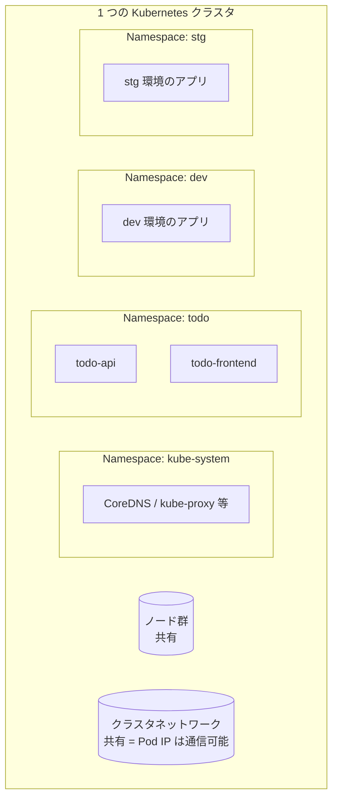
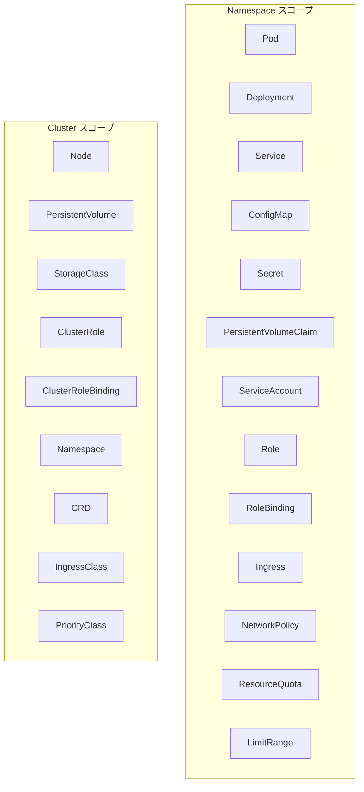
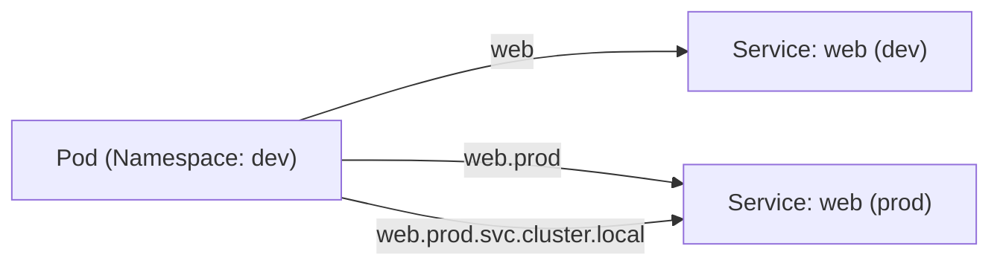
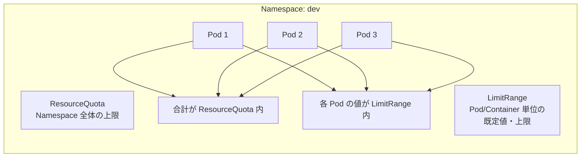
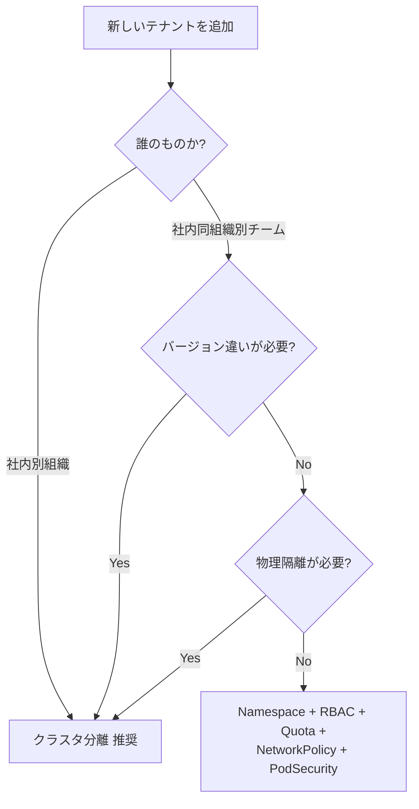

# Namespace
{: .no_toc }

## 目次
{: .no_toc .text-delta }

1. TOC
{:toc}

---

## このページのゴール

このページを読み終えると、以下を **自分の言葉で説明できる** ようになります。

- Namespace が **何を解決する** リソースか(複数チーム・複数環境を 1 クラスタで共存させる論理分割)、なぜ「物理的な分離ではなく論理分割」で十分とされたのか
- クラスタに最初から存在する 4 つのシステム Namespace(`default` / `kube-system` / `kube-public` / `kube-node-lease`)の役割
- **Namespace スコープ** と **Cluster スコープ** のリソースの違い、どのリソースがどちらに属するか
- Namespace をまたぐ DNS 名前解決(`<svc>.<ns>.svc.cluster.local`)の仕組みと、運用での注意点
- `ResourceQuota` と `LimitRange` の役割の違い、両者を併用したマルチテナント運用パターン
- 「Namespace で分けるか、クラスタを分けるか」の判断基準(障害隔離 / バージョン違い / RBAC / コスト)
- 本番運用での Namespace 設計パターン(環境別 / チーム別 / アプリ別 / 階層型)とそれぞれのトレードオフ

---

## Namespace の生まれた背景

### 「1 クラスタを共有する」必要性

Kubernetes を本番運用すると、すぐに次のような事態に直面します。

- 複数チームが同じクラスタを共有したいが、互いの Pod 名がぶつかる
- dev / stg / prod を同じクラスタに同居させたいが、設定の取り違えが怖い
- 内部利用と外部利用のアプリを混在させたいが、リソース消費を独立に制限したい
- あるチームに Pod の作成権限は与えたいが、他チームの Pod は触らせたくない

これらすべてを「**クラスタごと分ける**」で解決できれば話は単純ですが、現実的にはコストが見合いません。Control Plane(API Server / etcd / scheduler / controller-manager)を 3 台ずつ、Worker も冗長化、それぞれにネットワーク・ストレージ・監視……をチーム数分掛けると、クラスタ運用コストはあっという間に膨らみます。

そこで Kubernetes は当初から「**1 つのクラスタを論理的に分割する**」仕組みを持っていました。それが **Namespace** です。

### Linux の名前空間とは別物

紛らわしいことに、Kubernetes の **Namespace** と Linux カーネルの **namespace**(network / mount / pid 等)は **別の概念** です。

| | 役割 |
|---|---|
| Linux namespace | プロセスから見える「世界」を分離(IP・PID・ファイルシステム) |
| Kubernetes Namespace | API リソースの **論理グループ** に名前を付ける |

Kubernetes の Namespace は、**API オブジェクトのスコープを区切るためのラベル** に近い存在です。Linux namespace のように OS レベルで何かを隔離するわけではありません。

### Namespace は「ゆるい仕切り」

Kubernetes の Namespace の本質は、

- **API リソースの論理スコープ**(同じ名前のリソースを別 Namespace に置ける)
- **RBAC のスコープ**(Role / RoleBinding を Namespace 単位で設定可能)
- **リソース割り当て(Quota)のスコープ**(Namespace ごとに CPU/メモリ上限)
- **ネットワーク隔離のスコープ(NetworkPolicy が selector で活用)**(ただし Namespace 自体が隔離するのではなく、NetworkPolicy が selector で活用するという意味)

であり、「**ノード・ネットワーク・etcd は共有のまま、論理的にだけ仕切る**」という設計です。



**重要**: Namespace で分けても、特に NetworkPolicy 等を入れていない素の状態では **Namespace を超えて Pod IP に通信できる** のがデフォルト挙動です。「Namespace で分けたから安全」ではありません(後述のセキュリティ設計で詳述)。

### マルチテナンシーには段階がある

Kubernetes の世界で「マルチテナント」と言うときは、テナントの信頼度に応じて 3 段階あります。

| 段階 | 想定 | 適切な分離手段 |
|---|---|---|
| **Soft multi-tenancy** | 同じ組織内のチーム同士。互いに信頼 | Namespace + RBAC + Quota |
| **Hard multi-tenancy** | 別組織。基本信頼しない | クラスタ分離が原則(Namespace は不十分) |
| **その中間** | 同組織だが部署をまたぐ、社内 SaaS | Namespace + 厳しい NetworkPolicy + PodSecurity + Sandboxed Runtime(gVisor 等) |

本教材ではまず **Soft multi-tenancy** を前提に Namespace を学びます。Hard multi-tenancy は本教材の範囲外です(別クラスタ運用の章で別途扱う想定)。

---

## システム Namespace

クラスタ作成時から存在する 4 つの Namespace。

```bash
kubectl get namespaces
# NAME              STATUS   AGE
# default           Active   30d
# kube-node-lease   Active   30d
# kube-public       Active   30d
# kube-system       Active   30d
```

| Namespace | 用途 | 一般ユーザーが触る? |
|---|---|---|
| `default` | 何も指定しないとここに作られる | 触らない(後述) |
| `kube-system` | クラスタコンポーネント(CoreDNS, kube-proxy 等)が動く | 通常触らない |
| `kube-public` | 全ユーザーが読める情報置き場 | 通常使わない |
| `kube-node-lease` | ノードハートビート(Lease)管理 | 通常触らない |

### `default` を使ってはいけない

「ユーザーアプリは `default` に置かない」が **鉄則** です。理由:

- どのアプリがどのチームのものか **ラベルだけで区別** することになり、検索性が悪い
- RBAC で「このチームは自分の Namespace だけ」が設計できない(`default` 共有では権限分離不能)
- Quota / LimitRange の運用が個別アプリ単位になり、クラスタ全体での予算管理ができない
- 削除事故のリスク(誰かが `kubectl delete pod -l app=xxx` を打つときに、関係ない Pod まで巻き込みやすい)

新規アプリを始めるときは **必ず Namespace を作る** ところから始めます。

### `kube-system`

クラスタコンポーネントが住む特別な Namespace。

```bash
kubectl get pods -n kube-system
# coredns-xxx
# kube-apiserver-xxx (Static Pod)
# kube-controller-manager-xxx
# kube-scheduler-xxx
# kube-proxy-xxx (DaemonSet)
# etcd-xxx
# storage-provisioner (Minikube)
```

ここに **アプリの Pod を置いてはいけません**。クラスタアップグレード時に Static Pod の入替で巻き込まれたり、Quota が無いため暴走したりすると、クラスタごと巻き添えになります。

### `kube-public`

その名のとおり「**未認証ユーザー含めて全員が読める**」Namespace。実用例は限定的で、`cluster-info` という ConfigMap が置かれています(クラスタへの参加に使う情報)。

```bash
kubectl get cm -n kube-public
# NAME           DATA   AGE
# cluster-info   2      30d

kubectl get cm cluster-info -n kube-public -o yaml | head -20
```

通常、ユーザーがここにリソースを置くことはありません。

### `kube-node-lease`

各ノードが 10 秒おきに更新する Lease(ハートビート)が住む場所。Node Controller がこれを見てノードの生死を判断します(architecture.md 参照)。

```bash
kubectl get lease -n kube-node-lease
# NAME       HOLDER    AGE
# minikube   minikube  30d
```

これも通常触りません。

---

## Namespace の作成

### 命令型

```bash
kubectl create namespace todo
```

### 宣言型(YAML)

```yaml
apiVersion: v1
kind: Namespace
metadata:
  name: todo
  labels:
    app.kubernetes.io/part-of: todo
    env: prod
    pod-security.kubernetes.io/enforce: restricted
    pod-security.kubernetes.io/enforce-version: latest
```

```bash
kubectl apply -f todo-namespace.yaml
```

`pod-security.kubernetes.io/enforce: restricted` は **Pod Security Admission**(後述)を Namespace 単位で有効化するラベル。本番では `restricted` をデフォルトにするのが推奨です。

### Namespace のラベルが意味を持つ場面

Namespace 自身に付けたラベルは、次の場面で意味を持ちます:

- **NetworkPolicy** の `namespaceSelector` で対象 Namespace を選ぶ
- **Pod Security Admission** で `restricted` / `baseline` / `privileged` プロファイルを切替
- **Admission Webhook** で「特定ラベルの Namespace では sidecar 注入する」のような条件分岐(Istio 等)
- **Kustomize** でテナント別に上書きを当てる

```yaml
# NetworkPolicy で「同じ env=prod の Namespace からのみ受信」
spec:
  ingress:
  - from:
    - namespaceSelector:
        matchLabels:
          env: prod
```

---

## Namespace スコープ vs Cluster スコープ

すべての Kubernetes リソースは **Namespace スコープ** か **Cluster スコープ** のどちらかに属します。



| Namespace スコープ | Cluster スコープ |
|---|---|
| Pod, Deployment, Service, ConfigMap, Secret, PVC, ServiceAccount, Role, RoleBinding, Ingress, NetworkPolicy, ResourceQuota, LimitRange, Job, CronJob, StatefulSet, DaemonSet | Node, PV, StorageClass, ClusterRole, ClusterRoleBinding, Namespace 自身, CRD, IngressClass, PriorityClass, ValidatingWebhookConfiguration, MutatingWebhookConfiguration |

### 確認コマンド

```bash
kubectl api-resources --namespaced=true            # Namespace スコープ
kubectl api-resources --namespaced=false           # Cluster スコープ
kubectl api-resources --namespaced=true --api-group=apps
```

スコープは **`kubectl api-resources` の `NAMESPACED` 列** で確認できます。CRD のスコープは CRD 定義時に決まります。

### 「なぜそのリソースはそのスコープなのか」

スコープの判断基準は単純で、

- **特定の Namespace に属する論理的な意味があるか?** → Namespace スコープ
- **クラスタ全体で 1 つの存在しか想定されないか?** → Cluster スコープ

たとえば PVC は「アプリが使うストレージの要求」なので Namespace スコープ。一方、PV は「クラスタが提供する物理的なストレージ」なので Cluster スコープ。Node はどう見ても物理(または仮想)ノードなので Cluster スコープ。

ServiceAccount は「Namespace 内のアプリの ID」なので Namespace スコープ。一方、ClusterRole は「クラスタ全体に対する権限定義」なので Cluster スコープ、というふうに、**「誰が所有するべきか」** を考えるとスコープが見えてきます。

### 同名リソースの共存

Namespace スコープのリソースは **Namespace が違えば同名** で存在できます。

```bash
kubectl create deployment web --image=nginx -n dev
kubectl create deployment web --image=nginx -n stg
kubectl get deploy -A | grep web
# dev    web   1/1   1   1   30s
# stg    web   1/1   1   1   25s
```

Cluster スコープのリソースは **クラスタ全体で名前が一意** である必要があります。

---

## Namespace をまたぐ DNS

Service の DNS 名は次の規則で生成されます。

```
<service-name>.<namespace>.svc.<cluster-domain>
```

`<cluster-domain>` は通常 `cluster.local`(変更可能、kubeadm の `--service-dns-domain`)。

| Pod の所在 | アクセス先 Service | 短縮形 | フル名 |
|---|---|---|---|
| 同じ Namespace | `web` | `web` | `web.todo.svc.cluster.local` |
| 別 Namespace `prod` | `web` | `web.prod` | `web.prod.svc.cluster.local` |



### `/etc/resolv.conf` の中身

Pod 内の `/etc/resolv.conf` は次のようになっています。

```
nameserver 10.96.0.10           # CoreDNS の Cluster IP
search todo.svc.cluster.local svc.cluster.local cluster.local
options ndots:5
```

ポイント:

- **`search` リスト** : 短い名前(`web`)を検索する候補ドメイン。最初に Pod 自身の Namespace、次に他 Namespace、最後に cluster ドメインが並ぶ
- **`ndots:5`** : ドット数が 5 未満の名前は **search に展開してから問い合わせる**。`web` → `web.todo.svc.cluster.local` → `web.svc.cluster.local` → `web.cluster.local` の順で問い合わせる
- 5 ドット以上の完全修飾名(`api.example.com.`)は直接 DNS に問合せ

`ndots:5` の影響で、**外部ドメインへの問合せが遅延** することがあります。これは「`api.example.com` を `api.example.com.todo.svc.cluster.local` から順に試して NXDOMAIN を 3 回もらってからやっと正しい名前を引く」という動作になるため。チューニング:

```yaml
spec:
  dnsConfig:
    options:
    - {name: ndots, value: "2"}
```

### 「環境名を Namespace にする」とアクセス先が決まる

```yaml
# dev 環境の todo-api から todo-frontend へ
url: http://todo-frontend       # 同じ Namespace なら短縮可

# dev から stg の DB へ(本番ではこういう越境は避けるべき)
url: postgres://postgres.stg:5432/todo
```

**ベストプラクティス**:

- **同じ Namespace 内では短縮形** で書く
- **越境するなら必ずフル名(`name.ns`)** で書き、コードレビューで「なぜ越境が必要か」を確認
- 越境を防ぎたいなら **NetworkPolicy** で止める

---

## ResourceQuota と LimitRange

Namespace ごとに **使えるリソースの上限** を設定する仕組みです。



### ResourceQuota — 合計値の上限

```yaml
apiVersion: v1
kind: ResourceQuota
metadata:
  name: dev-quota
  namespace: dev
spec:
  hard:
    requests.cpu: "10"
    requests.memory: 20Gi
    limits.cpu: "20"
    limits.memory: 40Gi
    pods: "50"
    persistentvolumeclaims: "10"
    services: "20"
    services.loadbalancers: "2"
    secrets: "100"
    configmaps: "100"
    count/deployments.apps: "30"
    count/statefulsets.apps: "5"
    count/jobs.batch: "20"
```

各キー:

- **`requests.cpu` / `requests.memory`** : Namespace 内の全 Pod の `requests` 合計の上限
- **`limits.cpu` / `limits.memory`** : 同 `limits` の合計上限
- **`pods`** : Pod の総数
- **`persistentvolumeclaims`** : PVC の数
- **`services` / `services.loadbalancers` / `services.nodeports`** : Service 種別ごとの数
- **`secrets` / `configmaps`** : 数の上限(etcd 圧迫対策)
- **`count/<resource>`** : 任意リソースの数(CRD も対応)

ResourceQuota が有効な Namespace では、

- `requests` / `limits` を **書いていない Pod は作成自体が拒否** される
- 残量を超える Pod 作成は `AdmissionError` で拒否

```bash
kubectl describe quota -n dev dev-quota
# Name:       dev-quota
# Namespace:  dev
# Resource         Used   Hard
# --------         ----   ----
# limits.cpu       2500m  20
# limits.memory    1Gi    40Gi
# pods             5      50
# requests.cpu     500m   10
# requests.memory  256Mi  20Gi
```

`Used / Hard` で「いま何割使ってるか」が一目で分かります。本番運用では Prometheus でこの値をスクレイプし、80% 超過でアラート、というのが定番。

### LimitRange — Pod/Container 単位の制約と既定値

```yaml
apiVersion: v1
kind: LimitRange
metadata:
  name: dev-limits
  namespace: dev
spec:
  limits:
  - type: Container
    default:                   # limits 未指定時の既定
      cpu: 200m
      memory: 256Mi
    defaultRequest:            # requests 未指定時の既定
      cpu: 100m
      memory: 128Mi
    max:                       # 1 コンテナの上限
      cpu: 2
      memory: 2Gi
    min:                       # 1 コンテナの下限
      cpu: 50m
      memory: 64Mi
  - type: Pod
    max:
      cpu: 4
      memory: 4Gi
  - type: PersistentVolumeClaim
    max:
      storage: 50Gi
    min:
      storage: 1Gi
```

`type` ごとに別ルールが書けます。`Container` は **コンテナ 1 個ずつ**、`Pod` は **Pod 全体の合計**、`PersistentVolumeClaim` は **PVC のサイズ**。

挙動:

- `default` / `defaultRequest` : 利用者が省略したフィールドを **自動で埋める**(MutatingAdmission)
- `max` / `min` : この範囲を超える/下回る値の Pod 作成は **拒否**(ValidatingAdmission)

### 両者の使い分け

| | ResourceQuota | LimitRange |
|---|---|---|
| 単位 | Namespace 全体の合計 | Pod / Container / PVC 1 個 |
| 主な目的 | チーム間の予算配分 | 個別 Pod の暴走防止、既定値設定 |
| 既定値の付与 | しない | する |
| 主に動く Admission | Validating | Mutating + Validating |

実運用では **両方併用** が定石です。LimitRange で各 Pod の暴走を防ぎつつ既定値を埋め、ResourceQuota で Namespace 全体の予算上限を設定。

### Quota と HPA の相性

HPA でスケールアウトする Deployment が ResourceQuota にぶつかると、**Pod 作成が拒否されて HPA が機能しなくなる** ことがあります。本番運用では:

- ResourceQuota はピーク時の最大スケール想定で余裕を持って設定
- アラート閾値を Quota 使用率 70-80% に
- HPA の `maxReplicas` を Quota 内に収める

---

## Namespace 設計パターン

### パターン A: 環境別

```
dev / stg / prod
```

最もシンプル。1 クラスタに dev / stg を同居させ、prod は別クラスタにする組合せが多い。

**メリット**:
- 環境ごとの設定を Kustomize の overlay と相性良く管理できる
- RBAC で「prod は読み取り専用、dev は自由」とロール設計が分かりやすい

**デメリット**:
- アプリ数が増えると Namespace 内が混雑する
- アプリ間の境界が薄く、誤操作リスク

### パターン B: チーム別

```
team-a / team-b / shared-infra
```

組織のチーム構造をそのまま Namespace にする。

**メリット**:
- RBAC をチーム単位で設計できる
- リソース予算をチームに割り振れる(ResourceQuota)
- どのチームが何を運用しているか一目瞭然

**デメリット**:
- 同じチームが dev / prod を 1 Namespace に同居させると環境分離が弱くなる
- チーム異動・解散で Namespace が陳腐化しやすい

### パターン C: 環境 × アプリ(2 軸)

```
dev-frontend / dev-backend / stg-frontend / stg-backend / prod-frontend / prod-backend
```

両方の軸で分ける。Namespace 数が増える代わりに分離が強い。

**メリット**:
- 細粒度の RBAC / Quota
- 環境とアプリの両軸で隔離

**デメリット**:
- Namespace 数が爆発(N×M)
- 越境通信が増えて NetworkPolicy が複雑

### パターン D: 階層 Namespace(HNC)

Hierarchical Namespace Controller(SIG-multitenancy)を導入すると、**Namespace を階層構造** で扱えます。

```
team-a/
├── team-a-dev
└── team-a-prod
team-b/
├── team-b-dev
└── team-b-prod
```

親 Namespace の RBAC や NetworkPolicy が子に **継承** されるため、運用が楽になります。HNC は本教材の範囲外ですが、本番で多テナントを真面目に組むときの選択肢として知っておく価値があります。

### パターン E: アプリ単位(マイクロサービスごと)

```
todo / billing / search / analytics / ...
```

マイクロサービスごとに 1 Namespace。本教材のミニTODOサービスもこの方式で `todo` Namespace を使います。

**メリット**:
- アプリの境界がそのまま Namespace
- アプリチーム = Namespace オーナーで権限分離が自然

**デメリット**:
- 環境(dev / prod)を Namespace で分けたい人と相性が悪い → 通常はクラスタを別にする
- アプリ数が膨大だと Namespace 数も膨大に

---

## Namespace で分けるか、クラスタを分けるか

判断軸:

| 軸 | クラスタ分割 | Namespace 分割 |
|---|---|---|
| 障害の隔離 | 強い(Control Plane / etcd / CNI まで分離) | 弱い(共有部の障害は両方に影響) |
| RBAC で十分か | — | OK(同組織内なら) |
| バージョン違いを許容 | OK(別バージョン同居可) | NG(同 Kubernetes バージョン) |
| ノード分離(物理セキュリティ) | OK(完全分離可) | NG(node taint で対応する程度) |
| ネットワーク分離 | OK(完全分離) | NetworkPolicy 次第 |
| コスト | 高い(Control Plane × N) | 安い(Control Plane 1 つ) |
| マルチテナント(外部組織) | 推奨 | 非推奨 |
| 運用の単純さ | 複雑(クラスタ間運用ツール必要) | 単純(1 つの kubectl で全部) |

**現実的なパターン**:

- **本番と本番候補(stg)はクラスタ分け、開発系は Namespace 分け** が堅実
- セキュリティ要件が厳しい本番は **Namespace ではなくクラスタごと分ける**
- 開発・検証は 1 クラスタを Namespace で分ければ十分

「Namespace で分けたから安全」は誤りで、**Hard multi-tenancy を Namespace だけで実現するのは難しい** ことを理解しておきます。



---

## Namespace のセキュリティ設計

Namespace は「**論理的な仕切り**」なので、セキュリティの観点では他の機能と組合せて初めて意味を持ちます。本番に近い設定の構成要素:

### 1. RBAC

```yaml
apiVersion: rbac.authorization.k8s.io/v1
kind: Role
metadata:
  namespace: todo
  name: todo-developer
rules:
- apiGroups: ["", "apps", "batch"]
  resources: ["*"]
  verbs: ["get","list","watch","create","update","patch","delete"]
- apiGroups: [""]
  resources: ["secrets"]
  verbs: ["get","list"]   # secret は読み取り専用
---
apiVersion: rbac.authorization.k8s.io/v1
kind: RoleBinding
metadata:
  namespace: todo
  name: todo-developers
subjects:
- kind: Group
  name: dev-todo
  apiGroup: rbac.authorization.k8s.io
roleRef:
  kind: Role
  name: todo-developer
  apiGroup: rbac.authorization.k8s.io
```

「**この Namespace に対するこの権限**」が Role / RoleBinding。クラスタ全体は ClusterRole / ClusterRoleBinding。詳細は第7章で扱います。

### 2. NetworkPolicy

```yaml
apiVersion: networking.k8s.io/v1
kind: NetworkPolicy
metadata:
  name: deny-all-ingress
  namespace: todo
spec:
  podSelector: {}
  policyTypes: ["Ingress"]
```

「**自 Namespace 内の全 Pod への受信を全部拒否**」がデフォルト。必要な経路だけ別 NetworkPolicy で許可します。

```yaml
apiVersion: networking.k8s.io/v1
kind: NetworkPolicy
metadata:
  name: allow-from-frontend
  namespace: todo
spec:
  podSelector:
    matchLabels:
      app.kubernetes.io/name: todo-api
  ingress:
  - from:
    - podSelector:
        matchLabels:
          app.kubernetes.io/name: todo-frontend
    ports:
    - {protocol: TCP, port: 8000}
```

NetworkPolicy が無効な CNI(Flannel 既定など)では効きません。本教材では Calico を使うので有効化されます。詳細は第4章。

### 3. Pod Security Admission(PSA)

PodSecurityPolicy(PSP)が v1.25 で削除され、後継として Pod Security Admission が入りました。Namespace ラベルで設定します。

```yaml
metadata:
  labels:
    pod-security.kubernetes.io/enforce: restricted
    pod-security.kubernetes.io/enforce-version: latest
    pod-security.kubernetes.io/warn: restricted
    pod-security.kubernetes.io/audit: restricted
```

3 つのプロファイル:

| プロファイル | 内容 |
|---|---|
| `privileged` | 制約なし(クラスタコンポーネント向け) |
| `baseline` | 既知の脆弱な権限のみ禁止 |
| `restricted` | ベストプラクティス強制(`runAsNonRoot`、`readOnlyRootFilesystem`、capability 削除など) |

3 つの mode:

| mode | 効果 |
|---|---|
| `enforce` | 違反 Pod を **拒否** |
| `audit` | 違反を **監査ログ** に記録 |
| `warn` | apply 時に **警告** を表示 |

本番では `enforce: restricted` を推奨です。kube-system 等のシステム Namespace は `privileged` のままで OK(ただしラベルが無いと既定 = `privileged` 相当)。

### 4. ResourceQuota / LimitRange

(前述)

### 5. これらの組合せ

「**1 つの Namespace に上記 4 つを入れる**」のが、本番運用の最低限のテナント分離です。これが Soft multi-tenancy の最低ラインで、ここまでやって Namespace の論理分離が現実的なセキュリティとして機能します。

---

## Namespace の削除

```bash
kubectl delete namespace dev
```

これは **Namespace 内のすべてのリソースを削除** します。Pod、Deployment、Service、PVC……すべて。**取り返しのつかない操作** なので、本番では多重確認(`--grace-period=10` などのフェイルセーフは効きません)。

### Cascading Deletion

Namespace の削除は **`Terminating` Phase** に入ってから、内部のリソースを順次削除します(ガベージコレクタ動作)。すべて消え終わると Namespace 自体も消えます。

```bash
kubectl get namespace dev
# NAME   STATUS        AGE
# dev    Terminating   30s
```

### `Terminating` から進まないとき

ときどき `Terminating` のまま動かなくなります。原因の典型:

- **Finalizer 付きリソースが残っている**(CRD、PV のクレーム参照など)
- API Server が削除リクエストを発行できない CRD(Webhook が落ちている)
- メトリクス API のような Aggregated API Server が応答しない

確認:

```bash
kubectl get namespace dev -o json | jq .spec.finalizers
kubectl api-resources --verbs=list --namespaced -o name \
  | xargs -n1 -I{} kubectl get {} -n dev --ignore-not-found
```

最終手段(慎重に):

```bash
# Namespace の finalizer を強制削除 (危険、参照整合性が壊れる可能性)
kubectl get namespace dev -o json \
  | jq '.spec.finalizers = []' \
  | kubectl replace --raw "/api/v1/namespaces/dev/finalize" -f -
```

これは「**やむを得ない場合の最終手段**」で、根本原因(壊れた CRD、応答しない Webhook)を残したまま使うと別の問題が起きます。本番では原因究明を優先。

---

## ハンズオン

### 1. Namespace を作って context を切替

```bash
kubectl apply -f - <<'EOF'
apiVersion: v1
kind: Namespace
metadata:
  name: todo
  labels:
    app.kubernetes.io/part-of: todo
    env: dev
    pod-security.kubernetes.io/enforce: baseline
EOF

kubectl get namespaces
kubectl config set-context --current --namespace=todo
kubectl config view --minify | grep namespace
```

これで以後の `kubectl` は `-n todo` 不要になります。

### 2. Namespace スコープ vs Cluster スコープを観察

```bash
kubectl api-resources --namespaced=true | head -10
kubectl api-resources --namespaced=false | head -10

# 同名 Deployment を別 Namespace に共存
kubectl create namespace stg
kubectl create deployment web --image=nginx -n todo
kubectl create deployment web --image=nginx -n stg
kubectl get deploy -A | grep web
```

### 3. Namespace をまたぐ DNS

```bash
# todo の中に Pod を立てて、stg の Service を引いてみる
kubectl run debug -n todo --rm -it --image=nicolaka/netshoot --restart=Never -- bash

# (Pod 内で)
nslookup web.stg.svc.cluster.local
nslookup web.stg
nslookup web        # 自 Namespace の web
exit
```

### 4. ResourceQuota を設定して挙動を観察

```bash
cat <<'EOF' | kubectl apply -f -
apiVersion: v1
kind: ResourceQuota
metadata:
  name: todo-quota
  namespace: todo
spec:
  hard:
    requests.cpu: "1"
    requests.memory: 1Gi
    limits.cpu: "2"
    limits.memory: 2Gi
    pods: "5"
EOF

kubectl describe quota -n todo

# requests を持たない Pod は拒否される
kubectl run pod-no-req --image=nginx -n todo
# Error from server (Forbidden): pods "pod-no-req" is forbidden:
#   failed quota: todo-quota: must specify limits.cpu, ...

# requests を書けば通る
kubectl run pod-with-req --image=nginx -n todo \
  --requests=cpu=100m,memory=64Mi \
  --limits=cpu=200m,memory=128Mi
kubectl describe quota -n todo
```

### 5. LimitRange で既定値を埋める

```bash
cat <<'EOF' | kubectl apply -f -
apiVersion: v1
kind: LimitRange
metadata:
  name: todo-limits
  namespace: todo
spec:
  limits:
  - type: Container
    default: {cpu: 200m, memory: 128Mi}
    defaultRequest: {cpu: 100m, memory: 64Mi}
    max: {cpu: 1, memory: 1Gi}
EOF

# requests/limits を書かない Pod が、LimitRange の既定で埋まる
kubectl run pod-default --image=nginx -n todo
kubectl get pod pod-default -n todo -o jsonpath='{.spec.containers[0].resources}'
# {"limits":{"cpu":"200m","memory":"128Mi"},"requests":{"cpu":"100m","memory":"64Mi"}}
```

ResourceQuota だけ単独だと「Pod 作成時に書き忘れて拒否」になりますが、LimitRange と組合わせれば「書き忘れても既定値が埋まって作成成功」になります。

### 6. Namespace ラベルで NetworkPolicy

```bash
# 別 Namespace を作る
kubectl create namespace external
kubectl label namespace external trust=untrusted

cat <<'EOF' | kubectl apply -f -
apiVersion: networking.k8s.io/v1
kind: NetworkPolicy
metadata:
  name: deny-from-untrusted
  namespace: todo
spec:
  podSelector: {}
  policyTypes: ["Ingress"]
  ingress:
  - from:
    - namespaceSelector:
        matchExpressions:
        - {key: trust, operator: NotIn, values: [untrusted]}
EOF

# external Namespace からの通信は遮断される(Calico などの NetworkPolicy 対応 CNI が前提)
```

(Minikube の既定 CNI では NetworkPolicy が効かないことがあります。第4章で詳述。)

### 7. 後片付け

```bash
kubectl delete namespace todo
kubectl delete namespace stg
kubectl delete namespace external
kubectl config set-context --current --namespace=default
```

`kubectl delete namespace` は配下すべてを巻き込むため、再現できる手順ファイルがある状態でのみ実行してください。

---

## トラブル事例集

### 事例 1: `Error from server (Forbidden): pods is forbidden: User "..." cannot create resource "pods" in API group "" in the namespace "todo"`

**原因**: その Namespace への RBAC が無い。

**確認**:
```bash
kubectl auth can-i create pods -n todo
kubectl get rolebinding,clusterrolebinding -n todo
```

**対処**: Role と RoleBinding を作る。

### 事例 2: `failed quota: ... must specify limits.cpu`

**原因**: ResourceQuota が有効な Namespace で `requests` / `limits` を書いていない。

**対処**: Pod に `resources` を明記。または LimitRange で既定値を提供。

### 事例 3: `exceeded quota: dev-quota`

**原因**: ResourceQuota の上限超過。

**確認**:
```bash
kubectl describe quota -n dev
```

**対処**: 既存 Pod の縮退、または Quota の引き上げ。

### 事例 4: Namespace が `Terminating` のまま消えない

**原因**: Finalizer 付きリソースが残っている。よくあるのが CRD の Custom Resource(壊れたオペレータの後始末)、または PV のクレーム参照。

**確認・対処**:(前述「`Terminating` から進まないとき」参照)

### 事例 5: 別 Namespace の DNS が引けない

**原因**: フル名(`name.ns`)を使っていない、または `ndots` の影響で意図と違う名前を引いている。

**確認**:
```bash
kubectl exec -it <pod> -- cat /etc/resolv.conf
kubectl exec -it <pod> -- nslookup name.ns.svc.cluster.local
```

**対処**: フル名で書く、または `dnsConfig` で `ndots` を調整。

### 事例 6: NetworkPolicy が効かない

**原因**:
- CNI が NetworkPolicy 非対応(Flannel 既定など)
- Pod の所属 Namespace のラベル違い
- selector が Pod に一致していない

**確認**:
```bash
kubectl get networkpolicy -n todo
kubectl describe networkpolicy -n todo deny-all
kubectl get pods -n todo --show-labels
```

### 事例 7: Pod Security Admission で起動拒否

**症状**: `pods "..." is forbidden: violates PodSecurity "restricted:latest": ...`

**原因**: `restricted` プロファイルの Namespace に、`runAsNonRoot: true` でない Pod を入れようとした。

**対処**:
- Pod に `securityContext.runAsNonRoot: true`、`runAsUser: 10001`、`capabilities.drop: [ALL]` 等を追加
- 一時的に Namespace ラベルを `baseline` に下げる(本番では避ける)

### 事例 8: `kube-system` に Pod を作って事故った

**症状**: `kube-system` で操作ミスをして CoreDNS や kube-proxy を壊した。

**対処**:
- `kube-system` は基本触らない
- 触る必要があるとき(アドオン導入)も、必ず変更前にバックアップ
- 自分のアプリは絶対に `kube-system` に置かない

---

## チェックポイント

ここまでで以下を **自分の言葉で** 説明できるか確認してください。

- [ ] Namespace の解決する課題を 2 つ以上挙げられる(チーム共存、環境分離、RBAC、Quota など)
- [ ] Linux の namespace と Kubernetes の Namespace が別物であることを説明できる
- [ ] システム Namespace 4 つの役割を答えられる
- [ ] `default` を使うべきでない理由を 3 つ以上挙げられる
- [ ] Namespace スコープと Cluster スコープのリソースを 5 つずつ挙げられる
- [ ] Namespace をまたいだ Service の DNS 名(`name.ns.svc.cluster.local`)を書ける
- [ ] `ndots:5` がもたらす副作用と、調整が必要な場面を説明できる
- [ ] ResourceQuota と LimitRange の役割の違い、両方併用するのが推奨される理由を説明できる
- [ ] 「Namespace で分ければ十分」「クラスタを分けるべき」を判断する 3 つ以上の軸を挙げられる
- [ ] Namespace のセキュリティ強化に必要な 4 つの仕組み(RBAC / NetworkPolicy / PSA / Quota)を説明できる
- [ ] Namespace が `Terminating` から進まないときの確認手順を説明できる

→ 次は [Label と Selector]({{ '/02-resources/label/' | relative_url }})
