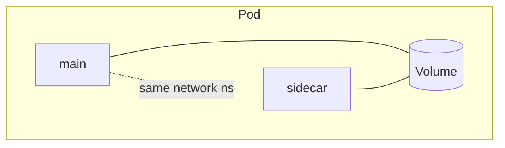
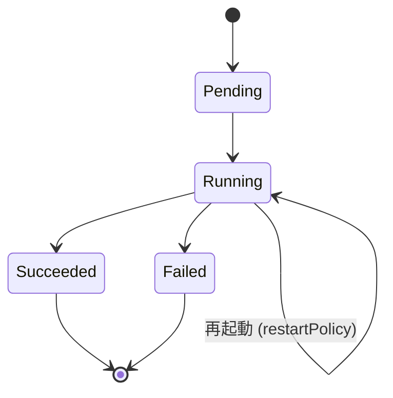

# Pod
{: .no_toc }

## 目次
{: .no_toc .text-delta }

1. TOC
{:toc}

---

**Pod** は Kubernetes の最小デプロイ単位。1つ以上のコンテナを束ね、**同一のネットワーク名前空間とストレージを共有** する単位です。

## なぜ「コンテナ」ではなく「Pod」なのか

密結合な複数コンテナを一緒にデプロイしたいケースがあるためです。

- メインアプリ + 共有ボリュームに書き出すログ転送 (Sidecar)
- メインアプリ + 初期化を担う Init コンテナ
- メインアプリ + 認証プロキシで TLS 終端 (Ambassador)

これらは **必ず同じノードで・必ず同じライフサイクルで** 動かす必要があり、その単位が Pod です。



同じ Pod 内のコンテナは:

- `localhost` で互いに通信できる
- 同じ Volume をマウントできる
- 同じ IP アドレスを共有(ポートだけ違う)

## 最小のPod

```yaml
apiVersion: v1
kind: Pod
metadata:
  name: nginx
spec:
  containers:
  - name: nginx
    image: nginx:1.27
    ports:
    - containerPort: 80
```

## ライフサイクル



| Phase | 意味 |
|-------|------|
| Pending | API登録済、コンテナ未起動(スケジューリング・Pull中) |
| Running | 1つ以上のコンテナが起動 |
| Succeeded | 全コンテナが exit 0 |
| Failed | いずれかが異常終了し、再起動されない |
| Unknown | ノードと通信不可 |

`restartPolicy` は `Always`(Deployment既定) / `OnFailure`(Job) / `Never` から選択。

## 主要フィールド

```yaml
apiVersion: v1
kind: Pod
metadata:
  name: app
  labels:
    app: web
spec:
  initContainers:
  - name: wait-for-db
    image: busybox:1.36
    command: ['sh','-c','until nc -z db 5432; do sleep 1; done']

  containers:
  - name: app
    image: myapp:1.0
    imagePullPolicy: IfNotPresent
    command: ["./myapp"]
    args: ["--config","/etc/conf"]
    ports:
    - containerPort: 8080
    env:
    - name: LOG_LEVEL
      value: info
    envFrom:
    - configMapRef:
        name: app-config
    resources:
      requests: {cpu: 100m, memory: 128Mi}
      limits:   {cpu: 500m, memory: 256Mi}
    volumeMounts:
    - {name: data, mountPath: /var/data}
    livenessProbe:
      httpGet: {path: /healthz, port: 8080}
      initialDelaySeconds: 10
    readinessProbe:
      httpGet: {path: /ready, port: 8080}

  volumes:
  - name: data
    emptyDir: {}

  nodeSelector:
    disktype: ssd
  tolerations:
  - key: dedicated
    operator: Equal
    value: frontend
    effect: NoSchedule
```

ここで出てきたフィールドの多く(Probe・Resources・Volume・Affinity)は **本番運用に必須** で、後の章で詳しく扱います。

## Pod を直接運用してはいけない

実運用で素の Pod を `apply` することはほぼありません。理由:

- Pod が落ちても自動再作成されない
- ローリングアップデート不可
- スケール不可

これらを解決するために、**Deployment / StatefulSet / DaemonSet / Job** という上位リソースを使います。
Pod の YAML を理解することは、これら上位リソースの `template:` を理解することに直結します。

## デバッグ用の使い捨てPod

```bash
kubectl run tmp --rm -it --image=nicolaka/netshoot --restart=Never -- bash
```

## チェックポイント

- [ ] Pod が「コンテナの上の抽象」である理由を 2 つ説明できる
- [ ] `restartPolicy` の選び方を、Web サーバーとバッチで対比できる
- [ ] Pod を直接運用しない理由を 3 つ挙げられる
