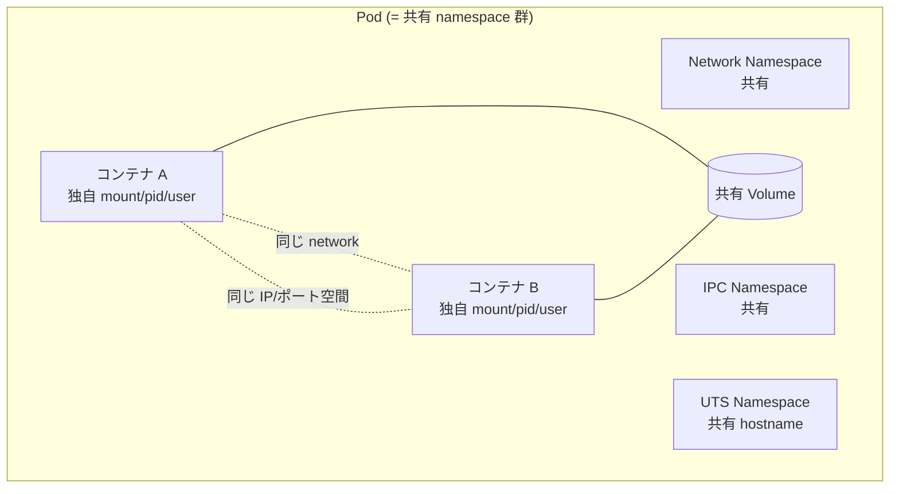
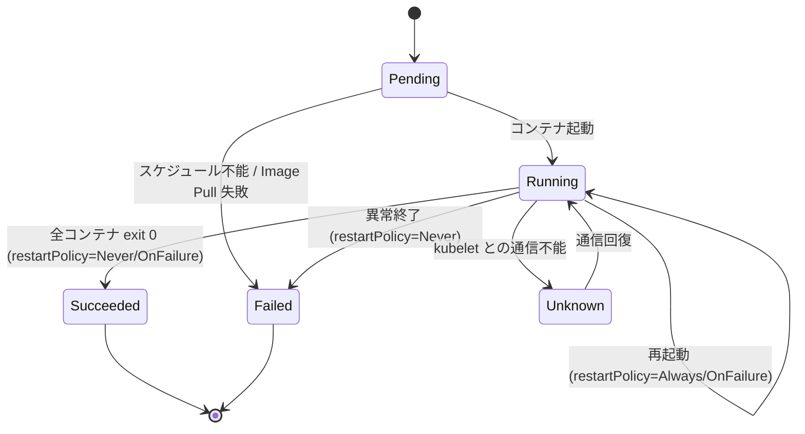
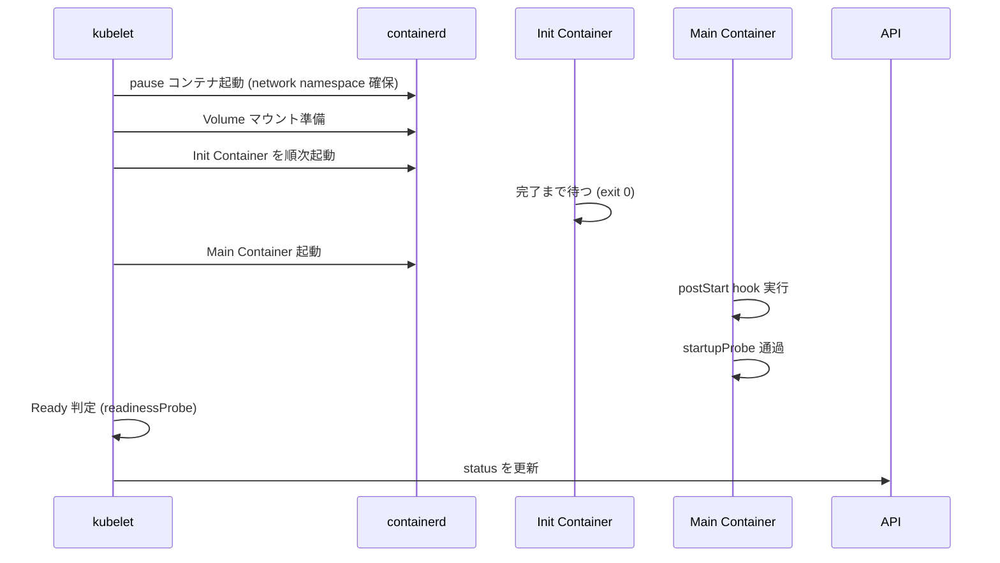
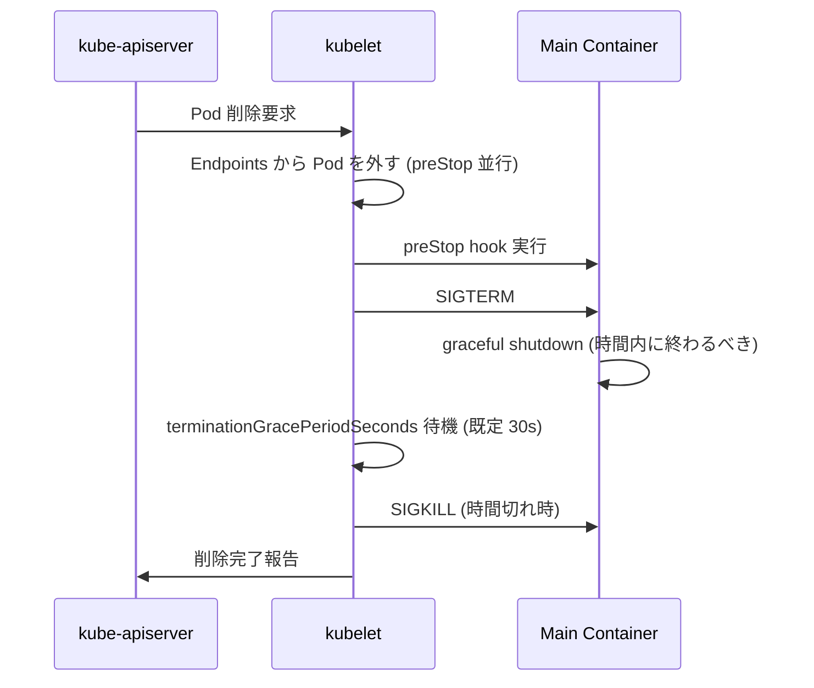
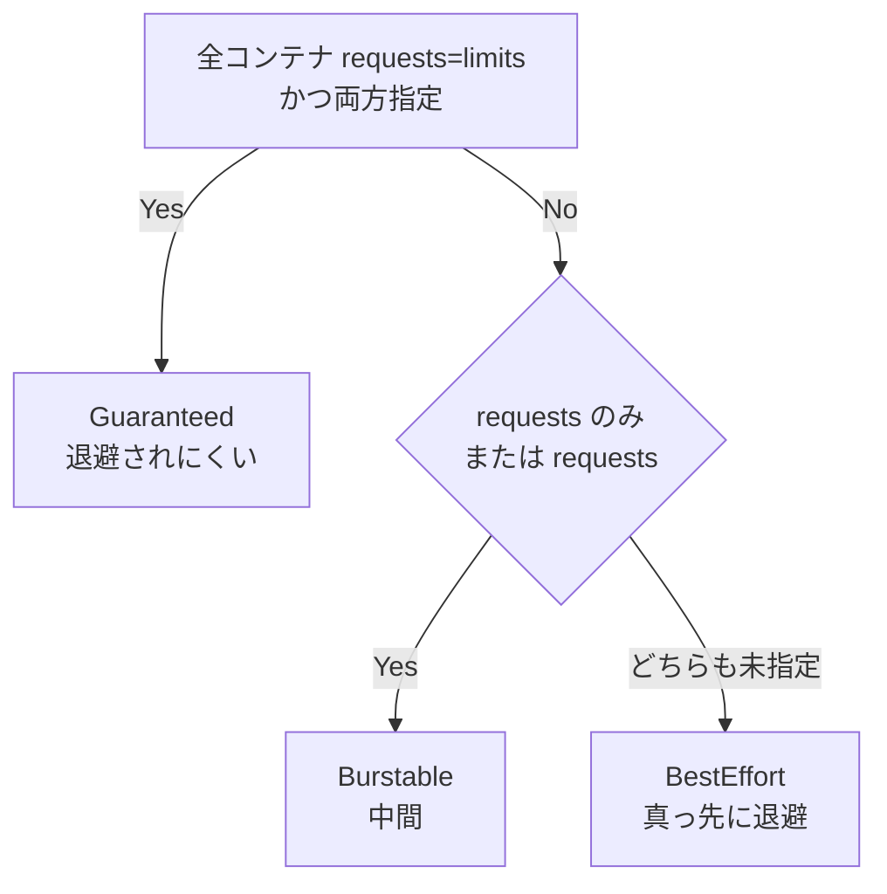
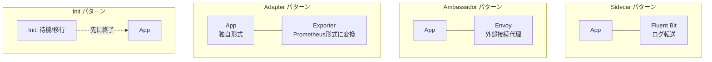
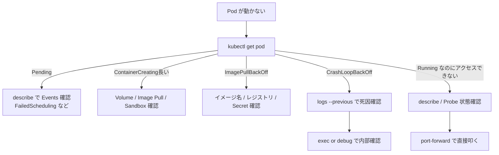

# Pod
{: .no_toc }

## 目次
{: .no_toc .text-delta }

1. TOC
{:toc}

---

## このページのゴール

このページを読み終えると、以下を **自分の言葉で説明できる** ようになります。

- なぜ Kubernetes は「コンテナ」ではなく **Pod** という単位を採用したのか、その歴史的・技術的根拠
- Pod 内の複数コンテナが **どのリソースを共有し、何は共有しないか**(ネットワーク名前空間 / ボリューム / プロセス名前空間 / cgroup)
- Pod のライフサイクル(`Pending` / `Running` / `Succeeded` / `Failed` / `Unknown`)と各 Phase の遷移条件、`restartPolicy` の役割
- `containers` / `initContainers` / `volumes` / `nodeSelector` / `affinity` / `tolerations` など主要フィールドが何のためにあり、どう使い分けるか
- `requests` と `limits` の違いと、QoS Class(`Guaranteed` / `Burstable` / `BestEffort`)が決まる仕組み
- 実運用で Pod を **直接 apply してはいけない** 理由と、その代わりに使う上位リソース(Deployment / StatefulSet / Job / DaemonSet)の判断基準
- Pod が起動しない・応答しないときのデバッグ手順(`describe` → `logs --previous` → `events` → `exec` / `debug`)

---

## Pod の生まれた背景

### 「コンテナ 1 個 = デプロイ単位」では足りなかった

Docker 単体での運用時代、デプロイの単位は **コンテナ 1 つ** でした。しかし実運用では、密結合に動かしたい複数プロセスをセットで扱いたい場面が頻繁にありました。

- メインアプリ + 共有ボリュームに書き出すログ転送(Fluent Bit のような **Sidecar**)
- メインアプリ + 認証プロキシで TLS 終端(Envoy のような **Ambassador**)
- メインアプリ + 起動前に DB マイグレーションを行う **Init コンテナ**
- メインアプリ + メトリクスを別形式に変換する **Adapter**

これらは **必ず同じノードで・必ず同じライフサイクルで** 動かす必要があります。たとえばログ転送 Sidecar がアプリより先に死ぬとログが欠落しますし、認証プロキシが別ノードにあっては意味がありません。「同じローカル環境を共有する小集団」という単位が必要だったのです。

Borg/Omega ではこの単位を内部的に持っており、Kubernetes はそれを **Pod** という名前で外部 API に昇格させました。語源は鯨の群れ(pod of whales、Docker は鯨)・豆のさや(pea pod、複数の豆を入れる入れ物)のイメージです。

### Pod の核心: 「Linux 名前空間の共有グループ」

Pod の実体は、**Linux カーネルの名前空間(namespace)を共有するコンテナの集合** です。



| Linux Namespace | Pod 内で共有? | 意味 |
|---|---|---|
| **Network** | 共有 | 同じ IP、同じポート空間。`localhost` で互いに通信可能 |
| **IPC** | 共有(既定) | 共有メモリ・セマフォを使える |
| **UTS** | 共有 | 同じ hostname |
| **Mount** | 各コンテナで独立 | ファイルシステムは別。共有したいなら Volume 経由 |
| **PID** | 既定で独立 | 互いのプロセスは見えない。`shareProcessNamespace: true` で共有可 |
| **User** | 各コンテナで独立 | `runAsUser` などは別々に指定可 |
| **Cgroup** | 別 | コンテナごとに CPU/メモリ制限 |

つまり「**ネットワークだけは強く共有、他は基本独立**」という設計です。これにより、Sidecar が `localhost:8080` でメインアプリと話せる一方、ファイルやプロセスは適切に分離されます。

### pause コンテナ

Pod の Network Namespace を「**誰が** 持っているか?」という問いに対する答えが **pause コンテナ**(`registry.k8s.io/pause`)です。pause コンテナは Pod 起動時に最初に作られ、ネットワーク名前空間を確保します。アプリケーションコンテナはこの名前空間に **join** する形で起動するため、アプリコンテナが再起動しても Pod の IP は変わりません。

```bash
sudo crictl pods                # pause コンテナを含む Pod 一覧
sudo crictl ps                  # アプリコンテナ一覧 (pause は通常出ない)
```

`pause` の中身は `pause()` システムコールを呼んで sleep するだけの極小バイナリで、メモリ消費は数百 KB です。「ネットワーク名前空間の番人」という地味だが本質的な役割を担っています。

### 同じ Pod 内コンテナができること・できないこと

| ✓ できる | ✗ できない |
|---|---|
| `localhost` で互いに通信 | 別 Pod のコンテナと `localhost` 通信 |
| 同じ Volume をマウントして読み書き | 別 Pod とのファイル共有(Volume を再共有しない限り) |
| 同じ IP / ポート空間を共有(ポートだけ別) | 同じポートを 2 コンテナで Listen(衝突する) |
| `shareProcessNamespace: true` でプロセス共有 | 既定では別コンテナのプロセスは見えない |

---

## 最小の Pod

```yaml
apiVersion: v1
kind: Pod
metadata:
  name: nginx
spec:
  containers:
  - name: nginx
    image: nginx:1.27
    ports:
    - containerPort: 80
```

```bash
kubectl apply -f pod.yaml
kubectl get pod nginx
kubectl describe pod nginx
kubectl logs nginx
kubectl exec -it nginx -- bash
kubectl delete pod nginx
```

**何が起きるか**: API Server に Pod が作られ、kube-scheduler が `nginx` Pod をいずれかのノードに割り当て、kubelet が containerd 経由で nginx コンテナを起動します。

**期待される出力**:

```
NAME    READY   STATUS    RESTARTS   AGE
nginx   1/1     Running   0          15s
```

各列の意味:

- `NAME` : Pod 名
- `READY` : `<起動済コンテナ数>/<全コンテナ数>`。Probe が通って Ready 状態のコンテナだけがカウントされる
- `STATUS` : Phase 相当の文字列(`Pending`、`Running`、`CrashLoopBackOff`、`ImagePullBackOff` など)
- `RESTARTS` : 再起動回数
- `AGE` : 作成からの経過時間

---

## ライフサイクル



### Phase 一覧

| Phase | 意味 | 典型的な状況 |
|---|---|---|
| `Pending` | API には登録されたが、コンテナがまだ実行されていない | スケジュール待ち、Image Pull 中、Init Container 実行中 |
| `Running` | 1 つ以上のコンテナが起動済み | 通常運用 |
| `Succeeded` | 全コンテナが正常終了(exit 0)、再起動しない | Job の Pod、CronJob |
| `Failed` | 全コンテナが終了、少なくとも 1 つが異常終了 | Job 失敗、`restartPolicy=Never` のクラッシュ |
| `Unknown` | kubelet と通信不能 | ノード障害 |

### Phase は「ざっくり」、`status.conditions` が「正確」

Phase はサマリでしかありません。詳細は `status.conditions` で確認します。

```bash
kubectl get pod web-0 -o jsonpath='{.status.conditions}' | jq
```

主な Condition:

- `PodScheduled` : スケジュール完了
- `Initialized` : Init Container 完了
- `ContainersReady` : 全コンテナの Readiness Probe 通過
- `Ready` : Pod 全体が Ready(Service が転送する条件)

### `restartPolicy`

```yaml
spec:
  restartPolicy: Always  # 既定
```

| 値 | 動作 | 主な用途 |
|---|---|---|
| `Always`(既定) | コンテナ exit 0 / 異常 を問わず再起動 | Deployment / StatefulSet / DaemonSet の Pod |
| `OnFailure` | 異常終了のみ再起動、exit 0 で終了 | Job |
| `Never` | 再起動しない | 1 回限りの Job、デバッグ Pod |

`restartPolicy` は **Pod レベル**(コンテナ単位ではない)に作用します。Pod 内全コンテナに同じポリシーが適用されます。

### コンテナの再起動 = Pod の再起動 ではない

これは初心者が混乱する点です。

- **コンテナ** が再起動 = 同じ Pod の中で、同じ Pod IP・同じ Volume を保ったまま、コンテナだけ起動し直す。`RESTARTS` カウントが増える
- **Pod** が再起動 = (Deployment 等が)古い Pod を削除し、新しい Pod を作る。Pod 名・Pod IP が変わる

`kubectl rollout restart deploy/web` が意味するのは後者(Pod 入替)です。前者は kubelet が自動でやる回復動作です。

### 起動シーケンス



### 終了シーケンス



ポイント:

- **SIGTERM が先に飛ぶ**。アプリは SIGTERM を受けたら新規受付を止めて掃除する責務がある
- **Endpoints からの離脱と preStop は並行**。Service の DNS キャッシュや conntrack エントリの残留に注意(7 章 Probe で詳述)
- `terminationGracePeriodSeconds`(既定 30s)を超えると **強制 SIGKILL**

---

## 主要フィールド完全解説

```yaml
apiVersion: v1
kind: Pod
metadata:
  name: app
  namespace: todo
  labels:
    app.kubernetes.io/name: todo-api
    app.kubernetes.io/part-of: todo
  annotations:
    kubernetes.io/change-cause: "initial deployment"
spec:
  serviceAccountName: todo-api
  imagePullSecrets:
  - name: registry-cred
  initContainers:
  - name: wait-for-db
    image: busybox:1.36
    command: ['sh','-c','until nc -z postgres 5432; do sleep 1; done']

  containers:
  - name: app
    image: ghcr.io/example/todo-api:0.1.0
    imagePullPolicy: IfNotPresent
    command: ["./todo-api"]
    args: ["--config","/etc/conf/app.yaml"]
    ports:
    - name: http
      containerPort: 8000
      protocol: TCP
    env:
    - name: LOG_LEVEL
      value: info
    - name: DB_PASSWORD
      valueFrom:
        secretKeyRef:
          name: db-secret
          key: password
    envFrom:
    - configMapRef:
        name: app-config
    resources:
      requests: {cpu: 100m, memory: 128Mi}
      limits:   {cpu: 500m, memory: 256Mi}
    volumeMounts:
    - {name: data,   mountPath: /var/data}
    - {name: config, mountPath: /etc/conf}
    livenessProbe:
      httpGet: {path: /healthz, port: 8000}
      initialDelaySeconds: 10
      periodSeconds: 10
    readinessProbe:
      httpGet: {path: /ready, port: 8000}
      periodSeconds: 5
    startupProbe:
      httpGet: {path: /healthz, port: 8000}
      failureThreshold: 30
      periodSeconds: 10
    lifecycle:
      preStop:
        exec:
          command: ["/bin/sh","-c","sleep 5"]
    securityContext:
      runAsNonRoot: true
      runAsUser: 10001
      readOnlyRootFilesystem: true
      allowPrivilegeEscalation: false
      capabilities:
        drop: ["ALL"]

  volumes:
  - name: data
    emptyDir: {}
  - name: config
    configMap:
      name: app-config

  nodeSelector:
    disktype: ssd
  affinity:
    podAntiAffinity:
      preferredDuringSchedulingIgnoredDuringExecution:
      - weight: 100
        podAffinityTerm:
          labelSelector:
            matchLabels:
              app.kubernetes.io/name: todo-api
          topologyKey: kubernetes.io/hostname
  tolerations:
  - key: dedicated
    operator: Equal
    value: frontend
    effect: NoSchedule
  topologySpreadConstraints:
  - maxSkew: 1
    topologyKey: kubernetes.io/hostname
    whenUnsatisfiable: DoNotSchedule
    labelSelector:
      matchLabels:
        app.kubernetes.io/name: todo-api
  terminationGracePeriodSeconds: 30
  dnsPolicy: ClusterFirst
  restartPolicy: Always
```

これで主要なフィールドはほぼ網羅です。以下、ブロックごとに掘り下げます。

### `containers[]`

#### `image` と `imagePullPolicy`

```yaml
image: ghcr.io/example/todo-api:0.1.0
imagePullPolicy: IfNotPresent
```

`imagePullPolicy` の値:

| 値 | 動作 |
|---|---|
| `Always` | 毎回レジストリに問い合わせ、digest が異なれば pull |
| `IfNotPresent` | ローカルに同タグがあれば pull しない(既定、`:latest` 以外) |
| `Never` | レジストリに行かない。事前に `crictl pull` 等が必要 |

タグが `:latest` または **タグ未指定** の場合、`imagePullPolicy` の既定は `Always` に切り替わります。本番運用では `:latest` を避け、明示的なタグまたは digest(`@sha256:...`)で固定するのが鉄則です。

```yaml
# 本番推奨: digest 固定
image: ghcr.io/example/todo-api@sha256:abcdef0123...
```

#### `command` と `args`

Docker の `ENTRYPOINT` / `CMD` と対応します。

| Docker | Kubernetes |
|---|---|
| `ENTRYPOINT` | `command` |
| `CMD` | `args` |

```yaml
command: ["./todo-api"]
args: ["--config", "/etc/conf/app.yaml", "--log-level", "info"]
```

省略時はイメージ側のデフォルト(`ENTRYPOINT` / `CMD`)が使われます。**シェル展開が必要なら**:

```yaml
command: ["sh", "-c", "exec ./todo-api --port=$PORT"]
```

`exec` を入れるのは、シェルが PID 1 にならず、SIGTERM が子プロセスに正しく届くようにするためです。

#### `env` と `envFrom`

```yaml
env:
- name: LOG_LEVEL
  value: info
- name: POD_NAME
  valueFrom:
    fieldRef:
      fieldPath: metadata.name
- name: NODE_NAME
  valueFrom:
    fieldRef:
      fieldPath: spec.nodeName
- name: DB_PASSWORD
  valueFrom:
    secretKeyRef:
      name: db-secret
      key: password
- name: DB_HOST
  valueFrom:
    configMapKeyRef:
      name: db-config
      key: host

envFrom:
- configMapRef:
    name: app-config       # ConfigMap の全キーを環境変数に
- secretRef:
    name: app-secret       # Secret の全キーを環境変数に
- prefix: APP_
  configMapRef:
    name: feature-flags    # キー名にプレフィックスを付ける
```

`fieldRef` で **Pod 自身の情報を環境変数に取り込む** のは、ログに Pod 名を出したい・自分の IP を取りたいときの定番イディオムです。

#### `ports`

```yaml
ports:
- name: http
  containerPort: 8000
  protocol: TCP
- name: metrics
  containerPort: 9090
```

`containerPort` は **ドキュメンテーション目的** に近く、宣言しなくても外部から到達は可能です(コンテナがその port で Listen していれば届く)。ただし Service / NetworkPolicy で **名前参照**(`port: http`)するときに必要なので、書く習慣を付けるのが推奨です。

`hostPort` は **コンテナのポートをノードに直接公開** するもので、特殊用途以外は使わない(同じノードで同じ hostPort を持つ Pod が並ばないため、スケジュール柔軟性が落ちる)。

#### `resources`

```yaml
resources:
  requests:
    cpu: 100m       # 0.1 vCPU
    memory: 128Mi   # 128 MiB
  limits:
    cpu: 500m
    memory: 256Mi
```

意味:

- **`requests`** : スケジューラがこの量の空きを要求する「下限の予約」。実行時の動作には(基本的に)影響しない
- **`limits`** : 実行時の「上限」。CPU は超えるとスロットル(throttle)、メモリは超えると **OOMKilled**

| リソース | 単位 | 例 |
|---|---|---|
| CPU | コア(浮動小数)、または `m`(ミリコア = 1/1000) | `0.5`, `500m` 同義 |
| メモリ | バイト、`K/M/G` 10 進、`Ki/Mi/Gi` 2 進 | `128Mi`, `1Gi` |
| ストレージ | 同上 | `10Gi` |
| GPU | デバイスプラグイン依存 | `nvidia.com/gpu: 1` |

#### QoS Class

`requests` と `limits` の組合せで Pod の **QoS Class** が決まり、メモリ逼迫時の **退避優先度** に影響します。



| QoS Class | 条件 |
|---|---|
| `Guaranteed` | 全コンテナで `requests == limits` が両方指定されている |
| `Burstable` | `requests` のみ、または `requests < limits` がある |
| `BestEffort` | `requests` も `limits` も一切指定なし |

本番では原則 `Guaranteed` か、少なくとも `requests` を必ず指定する `Burstable` にします。`BestEffort` は最初に殺される候補です。

```bash
kubectl get pod web-0 -o jsonpath='{.status.qosClass}'
```

#### Probe(liveness / readiness / startup)

3 種類の Probe があり、それぞれ目的が違います。**詳細は第7章「Probe」で扱いますが、本章では概要だけ押さえます**。

| Probe | 失敗時の動作 | 目的 |
|---|---|---|
| `livenessProbe` | コンテナを **再起動** | ハングしたプロセスの自動回復 |
| `readinessProbe` | Service の Endpoints から **一時的に外す** | ロードバランス対象から除外 |
| `startupProbe` | 失敗が `failureThreshold` 続くまで他 Probe を抑止 | 起動が遅いアプリの保護 |

```yaml
livenessProbe:
  httpGet: {path: /healthz, port: 8000}
  initialDelaySeconds: 10
  periodSeconds: 10
  timeoutSeconds: 1
  failureThreshold: 3
  successThreshold: 1
```

各フィールド:

- `initialDelaySeconds` : 起動から最初の Probe までの待機。アプリの初期化時間に合わせる
- `periodSeconds` : Probe 間隔
- `timeoutSeconds` : 1 回の Probe のタイムアウト
- `failureThreshold` : 連続失敗で「失敗」とみなす回数
- `successThreshold` : 連続成功で「復活」とみなす回数(`livenessProbe` は常に 1)

Probe の方式:

- `httpGet` : HTTP を叩き、`200 ≤ status < 400` で成功
- `tcpSocket` : ポートに TCP 接続できれば成功
- `exec` : コマンドを実行し、exit 0 で成功
- `grpc` : gRPC ヘルスチェック

#### `lifecycle.postStart` と `lifecycle.preStop`

```yaml
lifecycle:
  postStart:
    exec:
      command: ["/bin/sh", "-c", "echo started > /tmp/started"]
  preStop:
    exec:
      command: ["/bin/sh", "-c", "sleep 5"]
```

- `postStart` : コンテナ起動 **直後** に実行。完了まで Probe は走らない(が、エントリポイントとは並行起動なのでタイミングが微妙)
- `preStop` : SIGTERM を送る **前** に実行。Service の Endpoints から外れるまでの猶予を作る用途で `sleep 5` を入れるパターンが定番

Endpoint 離脱が完了する前に nginx が SIGTERM を受け取ると、in-flight リクエストが落ちる現象を防ぐ慣用的なテクニックです(7 章で詳述)。

#### `securityContext`(コンテナ単位)

```yaml
securityContext:
  runAsNonRoot: true
  runAsUser: 10001
  runAsGroup: 10001
  readOnlyRootFilesystem: true
  allowPrivilegeEscalation: false
  capabilities:
    drop: ["ALL"]
    add: ["NET_BIND_SERVICE"]   # 必要なら最小限を足す
  seccompProfile:
    type: RuntimeDefault
```

各フィールド:

- `runAsNonRoot: true` : root で動く設定なら起動失敗。事故防止
- `runAsUser` / `runAsGroup` : UID/GID を上書き
- `readOnlyRootFilesystem: true` : `/` を読み取り専用に。書きたい場所だけ Volume で穴を開ける
- `allowPrivilegeEscalation: false` : `setuid` などで権限を上げられない
- `capabilities.drop: [ALL]` : すべての Linux capability を落とす(必要なものだけ `add` で足す)
- `seccompProfile: RuntimeDefault` : ランタイム既定の seccomp プロファイルを適用

本番運用ではこれらを揃えるのが PodSecurity Admission の `restricted` プロファイル要件です。

### `initContainers[]`

メインコンテナ群より **先に順次実行** されるコンテナ。すべて exit 0 で終わって初めてメインコンテナが起動します。

```yaml
initContainers:
- name: wait-for-db
  image: busybox:1.36
  command: ['sh','-c','until nc -z postgres 5432; do sleep 1; done']
- name: migrate
  image: ghcr.io/example/migrator:0.1.0
  command: ['./migrate', 'up']
```

用途:

- **依存サービスの待機**(DB が立ち上がるまで sleep)
- **DB スキーマ移行**
- **設定ファイルの動的生成**(Vault や AWS から取得)
- **Volume の権限調整**(`chown` で `data` ディレクトリの所有者を変える)

Init Container の `restartPolicy` は Pod 全体のものを引き継ぎますが、`Always` のときだけ特殊で、**Init Container は exit 0 で完了扱い**(永続再起動はしない)になります。

#### Native Sidecar(Kubernetes 1.29+)

`initContainers` の各エントリに `restartPolicy: Always` を指定すると、**Sidecar として並行起動し続ける** モードになります(2024 年に GA)。これにより「メインコンテナが終わったら Sidecar も止める」「Init Container 完了前から Sidecar も並行起動する」という挙動が実現できます。

```yaml
initContainers:
- name: log-shipper
  image: fluent/fluent-bit:3.0
  restartPolicy: Always   # ← これで Native Sidecar
  volumeMounts:
  - {name: logs, mountPath: /var/log/app}
containers:
- name: app
  image: myapp:1.0
  volumeMounts:
  - {name: logs, mountPath: /var/log/app}
volumes:
- {name: logs, emptyDir: {}}
```

これにより従来の Sidecar(`containers[]` 内で並行起動)に比べて、**Job の Sidecar が永久に終わらない問題**(Job が exit 0 にならない)などが解決します。

### `volumes[]`

```yaml
volumes:
- name: data
  emptyDir: {}                 # Pod 内一時領域 (再起動で消える)
- name: data2
  emptyDir:
    medium: Memory             # tmpfs (RAM 上)
- name: config
  configMap:
    name: app-config
- name: secret-vol
  secret:
    secretName: app-secret
- name: pvc-data
  persistentVolumeClaim:
    claimName: postgres-data   # 第6章で詳述
- name: host
  hostPath:
    path: /var/log             # ノードのファイル
    type: Directory
- name: project
  downwardAPI:
    items:
    - path: "labels"
      fieldRef:
        fieldPath: metadata.labels
- name: proj
  projected:                   # 複数ソースを 1 マウント点に投影
    sources:
    - configMap: {name: ca}
    - secret: {name: token}
```

主な Volume タイプ:

| タイプ | ライフサイクル | 用途 |
|---|---|---|
| `emptyDir` | Pod と同じ。Pod 削除で消える | コンテナ間共有、一時ファイル |
| `configMap` | ConfigMap と同じ | 設定ファイルマウント |
| `secret` | Secret と同じ | 秘密情報マウント |
| `persistentVolumeClaim` | PV と同じ。Pod 削除で残る | DB データ、永続データ |
| `hostPath` | ノードと同じ | ノードログの集約、特殊用途。本番アプリでは原則禁止 |
| `downwardAPI` | Pod と同じ | Pod 自身のラベル等をファイル化 |
| `projected` | 構成元と同じ | 複数のソースを 1 マウント点にまとめる |

`emptyDir` の `medium: Memory` は tmpfs(RAM)で、高速だがメモリ消費する。秘密情報を扱う Sidecar 間共有などに使うパターンも。

`hostPath` は **ノードに root でアクセスできる**(= ホスト侵害の入口になりうる)ため、PodSecurity の `restricted` プロファイルでは禁止です。

### スケジューリング関連フィールド

#### `nodeSelector`

最も簡単なノード選択。ノードの **ラベル完全一致** を要求します。

```yaml
nodeSelector:
  disktype: ssd
  zone: tokyo-1a
```

ノード側にラベルを付ける:

```bash
kubectl label node k8s-w1 disktype=ssd
kubectl label node k8s-w1 zone=tokyo-1a
```

#### `affinity` — より柔軟なノード選択

```yaml
affinity:
  nodeAffinity:                              # ノードの条件
    requiredDuringSchedulingIgnoredDuringExecution:
      nodeSelectorTerms:
      - matchExpressions:
        - {key: gpu, operator: In, values: ["nvidia"]}
    preferredDuringSchedulingIgnoredDuringExecution:
    - weight: 50
      preference:
        matchExpressions:
        - {key: zone, operator: In, values: ["tokyo-1a"]}
  podAffinity:                               # 他 Pod に近づける
    requiredDuringSchedulingIgnoredDuringExecution:
    - labelSelector:
        matchLabels:
          app: cache
      topologyKey: kubernetes.io/hostname
  podAntiAffinity:                           # 他 Pod から離す (典型: 自分のレプリカを別ノードに)
    preferredDuringSchedulingIgnoredDuringExecution:
    - weight: 100
      podAffinityTerm:
        labelSelector:
          matchLabels:
            app.kubernetes.io/name: todo-api
        topologyKey: kubernetes.io/hostname
```

- `requiredDuring...` : **必須条件**(満たさなければスケジュール不能)
- `preferredDuring...` : **優先条件**(weight で重み付け、満たせなくても OK)
- `topologyKey` : 「同じ◯◯」の単位(ノード単位なら `kubernetes.io/hostname`、ゾーン単位なら `topology.kubernetes.io/zone`)

`podAntiAffinity` で同一 Deployment の Pod を別ノードに散らすのが、HA の基本テクニックです。

#### `tolerations`

ノードに付いた **Taint** を許容するための設定。

```yaml
tolerations:
- key: dedicated
  operator: Equal
  value: frontend
  effect: NoSchedule
```

Taint の effect:

| effect | 意味 |
|---|---|
| `NoSchedule` | 新規 Pod のスケジュールを拒否 |
| `PreferNoSchedule` | 可能なら避ける(必須ではない) |
| `NoExecute` | 既存 Pod も追い出す |

Taint は「**このノードは特殊用途なので、許可された Pod 以外来るな**」と宣言する仕組み。GPU ノード、専有ノード、Control Plane などで使われます。

#### `topologySpreadConstraints`

```yaml
topologySpreadConstraints:
- maxSkew: 1
  topologyKey: kubernetes.io/hostname
  whenUnsatisfiable: DoNotSchedule
  labelSelector:
    matchLabels:
      app.kubernetes.io/name: todo-api
```

「ノード間の Pod 数の偏りを `maxSkew` 以下に抑える」指定。`podAntiAffinity` よりも宣言的で、複数の `topologyKey`(ノード × ゾーン)を組合せやすい。HA を真面目に組むときに必須。

### `terminationGracePeriodSeconds`

```yaml
terminationGracePeriodSeconds: 30   # 既定 30 秒
```

SIGTERM を送ってから SIGKILL までの猶予秒。**長時間処理を抱えるバッチ Pod では伸ばす**(例: 300 秒)、**素早い置換を優先する Web Pod は短め**、というように調整します。`0` は強制 SIGKILL で、StatefulSet では危険です。

### `dnsPolicy` と `dnsConfig`

```yaml
dnsPolicy: ClusterFirst       # 既定
dnsConfig:
  searches:
  - mycompany.local
  options:
  - {name: ndots, value: "2"}
```

| `dnsPolicy` | 動作 |
|---|---|
| `ClusterFirst`(既定) | CoreDNS を介して、`*.svc.cluster.local` などを引く |
| `Default` | ノードの `/etc/resolv.conf` をそのまま使う |
| `ClusterFirstWithHostNet` | hostNetwork=true でも CoreDNS を使う |
| `None` | `dnsConfig` で全部明示 |

`ndots` の調整は、`my-svc.svc.cluster.local` のような完全修飾を頻繁に引くアプリでパフォーマンスが効くことがあります(大量の探索失敗を減らす)。

### `hostNetwork` / `hostPID` / `hostIPC`

```yaml
hostNetwork: true   # ノードのネットワーク名前空間を共有
```

`hostNetwork: true` は Pod がノードと同じ IP・同じポート空間を持つ特殊モード。NodePort や CNI 自身の Pod、特殊な監視エージェントなどで使う。**通常のアプリでは使わない**(セキュリティ的にもスケジュール柔軟性的にも)。

### `imagePullSecrets`

```yaml
imagePullSecrets:
- name: registry-cred
```

プライベートレジストリから pull するときの認証情報を Secret として参照。本教材の VMware 環境のローカルレジストリ(`192.168.56.10:5000`)は認証なしで構築する想定ですが、本番では当然認証ありです。

### `serviceAccountName`

```yaml
serviceAccountName: todo-api
```

Pod が API Server に対して使う ID。指定しないと `default` SA になります。本番では Pod ごとに最小権限の SA を作るのが鉄則(第7章 RBAC で詳述)。

---

## マルチコンテナパターン



| パターン | 例 | 主目的 |
|---|---|---|
| **Sidecar** | Fluent Bit / Istio Envoy | アプリと並走する補助プロセス |
| **Ambassador** | Envoy / 認証プロキシ | アプリの外向き通信を代理 |
| **Adapter** | Prometheus exporter | アプリの出力を別形式に変換 |
| **Init** | DB マイグレーション | 起動前の準備 |

### Sidecar の最小例 — ログ転送

```yaml
spec:
  initContainers:
  - name: fluent-bit
    image: fluent/fluent-bit:3.0
    restartPolicy: Always   # Native Sidecar
    volumeMounts:
    - {name: logs, mountPath: /var/log/app}
  containers:
  - name: app
    image: myapp:1.0
    volumeMounts:
    - {name: logs, mountPath: /var/log/app}
  volumes:
  - {name: logs, emptyDir: {}}
```

アプリは `/var/log/app/*.log` に書く、fluent-bit は同じディレクトリを読んで外部に送る、という分担です。

---

## Pod を直接運用してはいけない理由

実運用で素の Pod を `apply` することは、**ほぼありません**。理由:

1. **Pod が落ちても自動再作成されない** : ノード障害で消えたら、復元してくれる人がいない
2. **ローリングアップデートできない** : 新しいイメージに切り替えるとき、ダウンタイムが発生する
3. **スケールできない** : `kubectl scale` できるのは上位リソース(Deployment / StatefulSet など)
4. **宣言的に管理しづらい** : `kubectl get pods` で見える Pod が、Deployment の管理下なのか直 apply なのか区別しづらい
5. **GitOps と相性が悪い** : 上位リソース経由で作られた Pod は GitOps で再現できるが、直 Pod は履歴に残りにくい

これらを解決するために、**上位リソース** を使います。

| 上位リソース | 使う場面 |
|---|---|
| **Deployment** | ステートレスなアプリ(API、フロントエンド) |
| **StatefulSet** | DB、Redis、メッセージブローカー(順序・ID・永続データが必要) |
| **DaemonSet** | 各ノードで 1 つ動かす(ログ収集、CNI、監視エージェント) |
| **Job** | 1 回限りのバッチ処理 |
| **CronJob** | 定期バッチ |

直 Pod が **正しい** ケースは限られます:

- デバッグ用使い捨て(`kubectl run --restart=Never`)
- 学習・実験
- 自前のオペレータが管理する Custom Resource

Pod の YAML を理解することは、これら上位リソースの `template:` を理解することに直結します(`Deployment.spec.template` がそのまま Pod の `spec` になります)。

---

## デバッグ・トラブルシュート



### 主要な STATUS とその意味

| STATUS | 意味 | 第一手 |
|---|---|---|
| `Pending` | スケジュール待ち | `describe` Events |
| `ContainerCreating` | コンテナ作成中(Image Pull / Volume Mount) | `describe` Events |
| `Running` | 正常起動 | `logs` / `exec` |
| `CrashLoopBackOff` | 起動 → クラッシュ → リトライを繰り返す | `logs --previous` |
| `ImagePullBackOff` / `ErrImagePull` | イメージ取得失敗 | レジストリ・Secret・タグ確認 |
| `OOMKilled`(reason) | メモリ超過 | `limits.memory` 見直し |
| `Error` | exit != 0 で終了 | `logs` / `describe` |
| `Terminating`(長期間) | 削除処理が終わらない | `terminationGracePeriodSeconds` / Finalizer 確認 |

### 鉄板コマンド

```bash
# 全俯瞰
kubectl get pod web-0 -o wide
kubectl describe pod web-0
kubectl get events --field-selector involvedObject.name=web-0 --sort-by=.lastTimestamp

# ログ
kubectl logs web-0
kubectl logs web-0 --previous       # 死んだ前回起動
kubectl logs web-0 -c sidecar       # コンテナ指定

# 中で確認
kubectl exec -it web-0 -- sh
kubectl debug -it web-0 --image=nicolaka/netshoot --target=app

# 直接接続
kubectl port-forward pod/web-0 8080:80
```

### 困ったときのチェックリスト

- [ ] `image` のタグ・ホスト名は正しいか
- [ ] `imagePullSecrets` は設定したか(プライベートレジストリの場合)
- [ ] `command` / `args` の引用符・空白に間違いはないか
- [ ] `requests` がノードの空きを上回っていないか
- [ ] `nodeSelector` のラベルがどのノードにも一致していないことはないか
- [ ] Probe の `initialDelaySeconds` が短すぎてアプリが起動前に殺されていないか
- [ ] `volumeMounts` の `mountPath` がコンテナ内で書き込み禁止の場所ではないか
- [ ] `securityContext.runAsNonRoot: true` で起動し、UID 0 にハードコードされたイメージを使っていないか

---

## ハンズオン

### 1. 最小 Pod を起動

```bash
cat <<'EOF' | kubectl apply -f -
apiVersion: v1
kind: Pod
metadata:
  name: hello
  labels:
    app.kubernetes.io/name: hello
spec:
  containers:
  - name: nginx
    image: nginx:1.27
    ports:
    - containerPort: 80
    resources:
      requests: {cpu: 50m, memory: 64Mi}
      limits:   {cpu: 200m, memory: 128Mi}
EOF

kubectl get pod hello
kubectl describe pod hello | head -30
```

### 2. ログとシェル

```bash
kubectl logs hello
kubectl exec -it hello -- bash
# (中で) cat /etc/nginx/nginx.conf
# exit
```

### 3. ポートフォワードで動作確認

```bash
kubectl port-forward pod/hello 8080:80 &
curl http://localhost:8080
fg                       # ジョブを戻して Ctrl-C で終了
```

### 4. わざと壊して観察

#### イメージ名間違い

```bash
kubectl run broken --image=nginx:does-not-exist
kubectl get pod broken
# ImagePullBackOff になる
kubectl describe pod broken | tail -20
kubectl delete pod broken
```

#### CrashLoopBackOff

```bash
kubectl run crash --image=busybox --restart=Never -- sh -c 'echo hello; exit 1'
kubectl get pod crash -w
# Error → CrashLoopBackOff のサイクル(restartPolicy=Never でも再起動制御は kubelet)
kubectl logs crash --previous
kubectl delete pod crash
```

(`run --restart=Never` でも `Pod` として作られ、再起動はしませんが、表示として `Error` で残ります。)

#### OOMKilled

```bash
cat <<'EOF' | kubectl apply -f -
apiVersion: v1
kind: Pod
metadata:
  name: oom
spec:
  restartPolicy: Never
  containers:
  - name: stress
    image: polinux/stress
    command: ["stress"]
    args: ["--vm","1","--vm-bytes","200M","--vm-hang","1"]
    resources:
      limits: {memory: 100Mi}
EOF

kubectl get pod oom -w
# OOMKilled になる
kubectl describe pod oom | grep -i reason
kubectl delete pod oom
```

### 5. マルチコンテナ Pod (Sidecar)

```bash
cat <<'EOF' | kubectl apply -f -
apiVersion: v1
kind: Pod
metadata:
  name: multi
spec:
  containers:
  - name: writer
    image: busybox:1.36
    command: ["sh","-c","while true; do echo hello $(date) >> /shared/out.log; sleep 2; done"]
    volumeMounts: [{name: shared, mountPath: /shared}]
  - name: reader
    image: busybox:1.36
    command: ["sh","-c","tail -F /shared/out.log"]
    volumeMounts: [{name: shared, mountPath: /shared}]
  volumes:
  - {name: shared, emptyDir: {}}
EOF

kubectl logs multi -c reader -f &
sleep 6
kubectl delete pod multi
```

`writer` が書き、`reader` が読む。同じ Pod 内コンテナが Volume を共有していることが体感できます。

### 6. ミニTODOサービスの API Pod を起動(章末)

```bash
kubectl create namespace todo --dry-run=client -o yaml | kubectl apply -f -

cat <<'EOF' | kubectl apply -f -
apiVersion: v1
kind: Pod
metadata:
  name: todo-api-test
  namespace: todo
  labels:
    app.kubernetes.io/name: todo-api
    app.kubernetes.io/part-of: todo
spec:
  containers:
  - name: api
    image: nginx:1.27   # 仮置き
    ports: [{containerPort: 80, name: http}]
    resources:
      requests: {cpu: 100m, memory: 128Mi}
      limits:   {cpu: 500m, memory: 256Mi}
    readinessProbe:
      httpGet: {path: /, port: 80}
      periodSeconds: 5
EOF

kubectl get pod -n todo todo-api-test -o wide
kubectl describe pod -n todo todo-api-test | head -40
kubectl delete pod -n todo todo-api-test
```

(本物の `todo-api` イメージは後の章で作ります。)

---

## トラブル事例集

### 事例 1: `0/3 nodes are available: 3 Insufficient memory`

**症状**: `Pending` のまま、`describe` の Events に上記。
**原因**: ノードに `requests.memory` 分の空きがない。
**対処**: `requests` を下げる、または `kubectl top nodes` でノード状況確認、必要ならノード追加。

### 事例 2: `ImagePullBackOff`

**症状**: コンテナが起動しない。
**確認**:
```bash
kubectl describe pod <pod> | grep -A 5 'Failed'
```
パターン:
- `repository ... not found` → イメージ名・タグ間違い
- `unauthorized` → `imagePullSecrets` 不足
- `i/o timeout` → レジストリへの到達性

### 事例 3: `CrashLoopBackOff`

**症状**: コンテナが起動 → クラッシュを繰り返す。
**第一手**:
```bash
kubectl logs <pod> --previous
```
- 何も出ない → `command` / `args` が誤って即終了している、`exec` 形式の引用符ミス
- スタックトレース → アプリのバグ
- `permission denied` → `runAsUser` / `volume` の権限

### 事例 4: `OOMKilled`

**症状**: `STATUS` が `OOMKilled`。
**確認**:
```bash
kubectl describe pod <pod> | grep -i 'reason\|exit'
```
**対処**: `limits.memory` を増やす、メモリリーク調査(プロファイラ、heapdump)、JVM なら `-Xmx` を `limits` 内に収める。

### 事例 5: Pod が `Ready` にならない

**症状**: `Running` だが `READY` が `0/1`。
**原因**: `readinessProbe` が通っていない。
**確認**:
```bash
kubectl describe pod <pod> | grep -A 2 -i readiness
kubectl logs <pod>
kubectl exec -it <pod> -- curl -v http://localhost:8000/ready
```

### 事例 6: 削除しても `Terminating` のまま

**症状**: `kubectl delete pod` してから 1 分以上 `Terminating`。
**原因候補**:
- `terminationGracePeriodSeconds` が長く、SIGTERM 後の sleep を待っている
- `preStop` が長い
- アプリが SIGTERM を握り潰している
- `finalizers` がブロックしている

**対処**:
```bash
kubectl get pod <pod> -o jsonpath='{.metadata.finalizers}'
kubectl describe pod <pod>
# 緊急時のみ
kubectl delete pod <pod> --grace-period=0 --force
```
強制削除は **etcd 上のレコードを消すだけ** で、ノード上の実コンテナは別途消えるまで動き続ける可能性がある点に注意。

### 事例 7: `Error: container has runAsNonRoot and image will run as root`

**原因**: `securityContext.runAsNonRoot: true` を指定したのに、イメージが root で動く設定。
**対処**: イメージの `Dockerfile` で `USER 10001` を入れる、または `runAsUser: 10001` を Pod 側で明示。

### 事例 8: `Error: failed to mount: mount failed: exit status 32`

**原因**: Volume のマウント失敗。NFS の場合は NFS サーバ・export 設定・`securityContext.fsGroup` を確認。

---

## チェックポイント

ここまでで以下を **自分の言葉で** 説明できるか確認してください。

- [ ] Pod が「コンテナの上の抽象」である理由を 2 つ以上説明できる
- [ ] Pod 内で共有される Linux 名前空間と、共有されないものを挙げられる
- [ ] `pause` コンテナの役割を説明できる
- [ ] `Phase` と `status.conditions` の違い、`Ready` がいつ True になるか説明できる
- [ ] `restartPolicy` の選び方を、Web サーバーとバッチで対比できる
- [ ] `requests` と `limits` の違い、QoS Class の決定ルールを説明できる
- [ ] `livenessProbe` / `readinessProbe` / `startupProbe` の使い分けを説明できる
- [ ] Init Container と Native Sidecar の違いを説明できる
- [ ] Pod を直接運用しない理由を 3 つ以上挙げられる
- [ ] `CrashLoopBackOff` を見たとき最初に打つコマンドを答えられる
- [ ] `securityContext` の `runAsNonRoot` `readOnlyRootFilesystem` `capabilities.drop: [ALL]` の意義を説明できる

→ 次は [ReplicaSet]({{ '/02-resources/replicaset/' | relative_url }})
