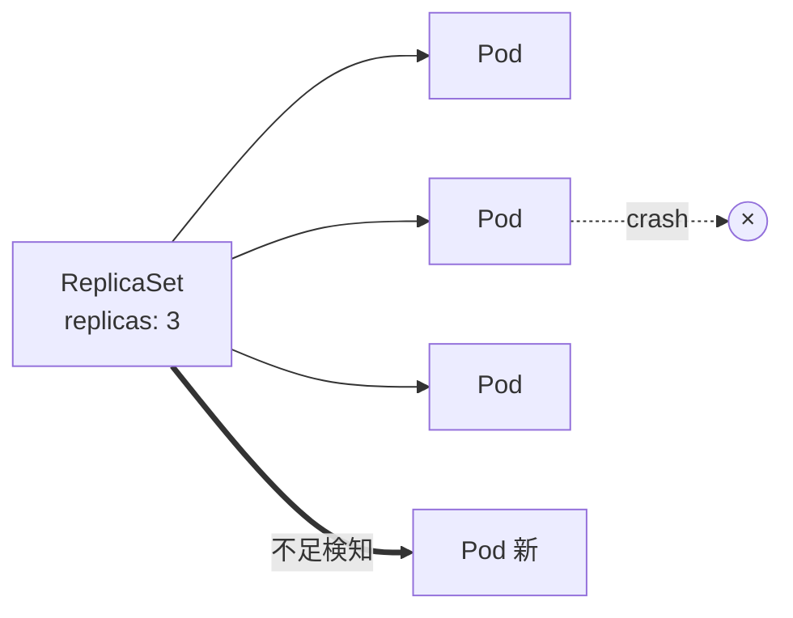
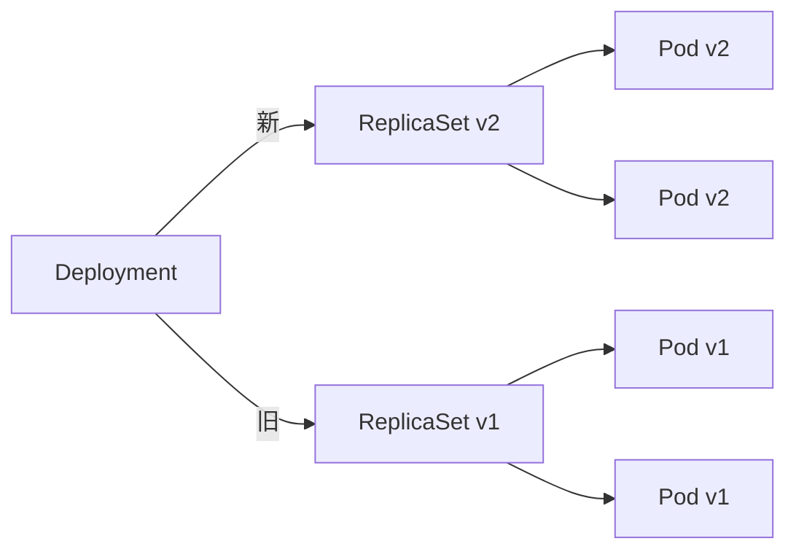

# ReplicaSet
{: .no_toc }

## 目次
{: .no_toc .text-delta }

1. TOC
{:toc}

---

**ReplicaSet** は指定数の Pod を維持するためのリソース。
ただし実運用で直接書くことはまずなく、**Deployment が内部で ReplicaSet を作る** ため、その仕組みを理解する目的で学びます。

## やっていること



- ラベルセレクタにマッチする Pod が `replicas` 個になるよう管理
- 不足時は新規作成、過剰時は削除
- ノード障害で消えれば、別ノードで再作成

## YAML

```yaml
apiVersion: apps/v1
kind: ReplicaSet
metadata:
  name: web
spec:
  replicas: 3
  selector:
    matchLabels:
      app: web
  template:
    metadata:
      labels:
        app: web
    spec:
      containers:
      - name: nginx
        image: nginx:1.27
```

## 重要な制約: イメージ更新ができない

ReplicaSet で `image` を書き換え apply しても、**既存 Pod は更新されません**。
新しい Pod が作られる契機がないからです。
これを解決するために Deployment が考案されました。

## Deployment との関係



Deployment は **複数の ReplicaSet を管理し、新旧の比率を徐々に入れ替える** ことでローリングアップデートを実現します。

```bash
kubectl get rs   # Deployment の裏に複数のReplicaSetが見える
```

## チェックポイント

- [ ] ReplicaSet が単独で使われない理由を説明できる
- [ ] `kubectl get rs` で複数のReplicaSetが見えるとき、どう解釈するか
