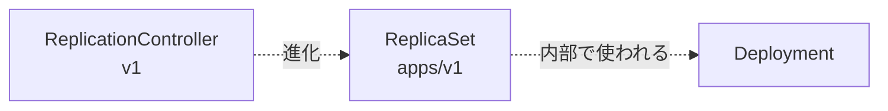
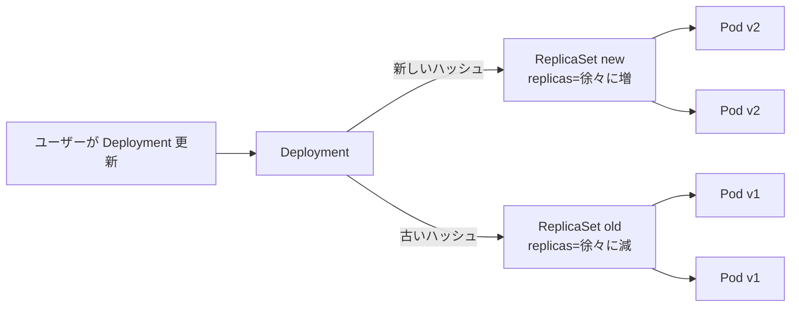
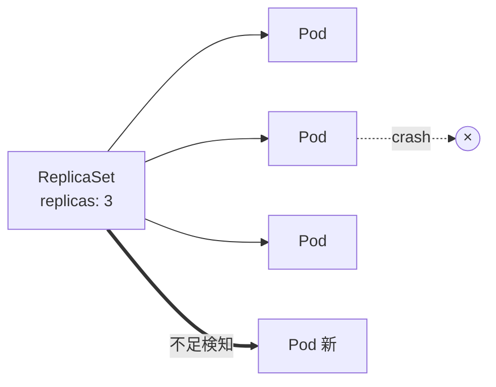
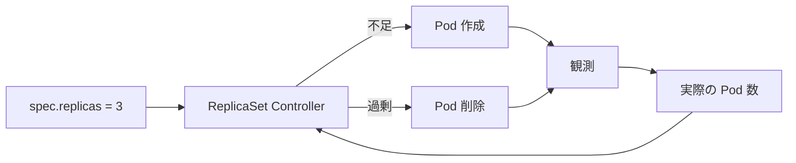
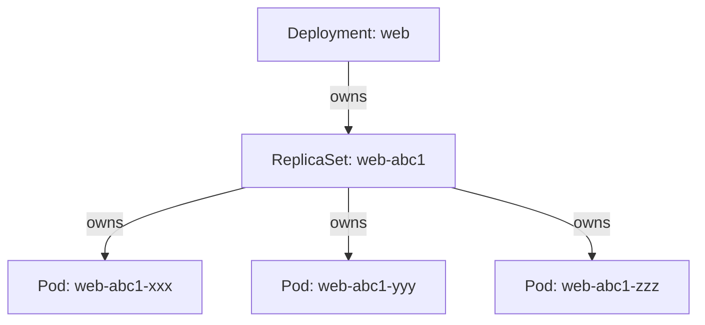
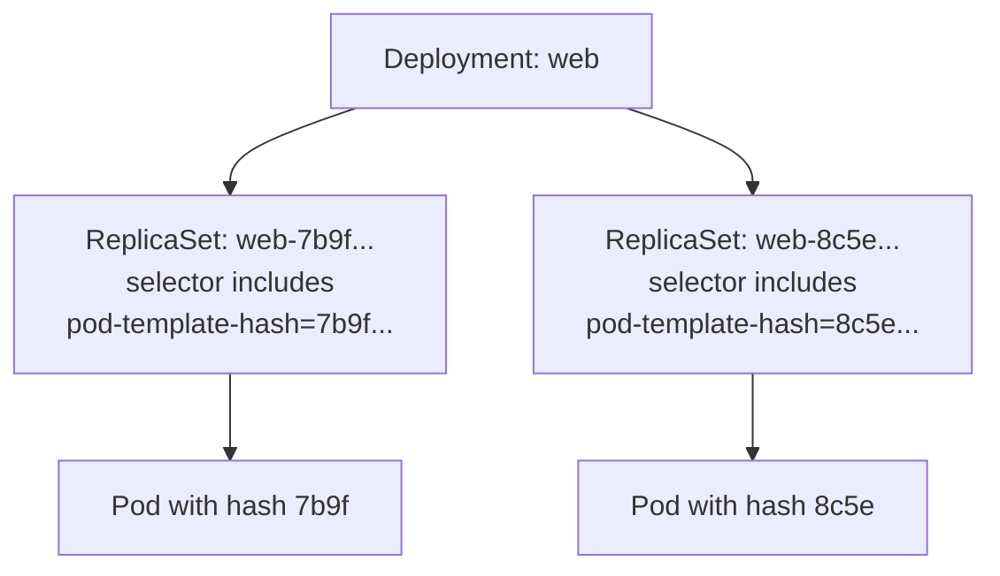
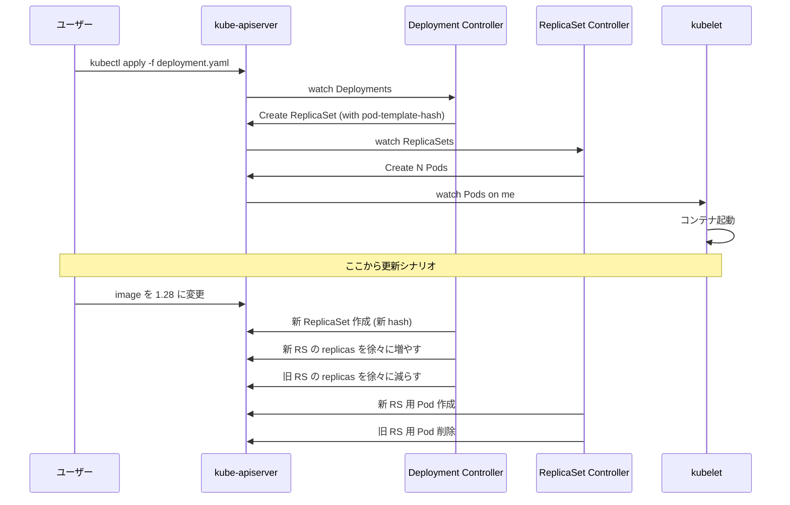
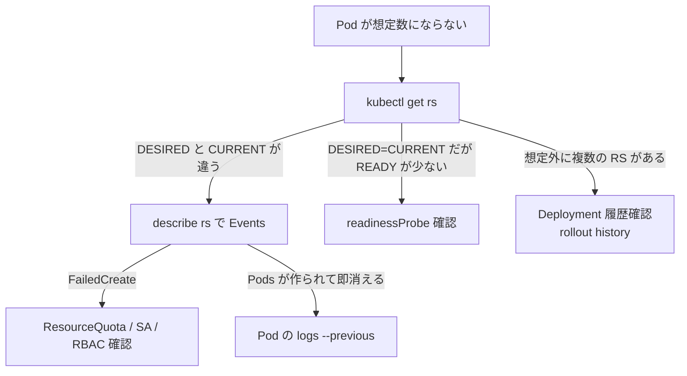
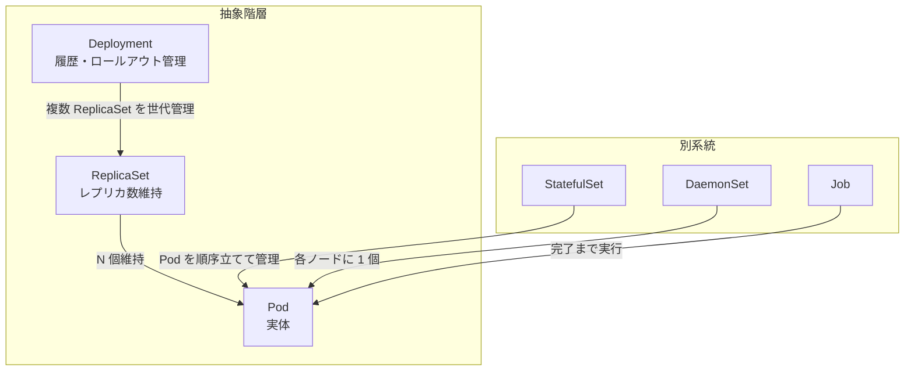

# ReplicaSet
{: .no_toc }

## 目次
{: .no_toc .text-delta }

1. TOC
{:toc}

---

## このページのゴール

このページを読み終えると、以下を **自分の言葉で説明できる** ようになります。

- ReplicaSet が **何を保証する** リソースか(指定数の Pod を維持する Reconciliation Loop)
- ReplicaSet が直接的にではなく **Deployment 経由で間接的に使われる** 理由と、その背景にあるイメージ更新の制約
- ReplicaSet と前身の **ReplicationController** の違い、`set-based selector`(`matchExpressions`)が追加された理由
- `ownerReferences` を使った Pod との所有関係、ガベージコレクションの動き、孤児 Pod の adopt の挙動
- Deployment が複数の ReplicaSet を並走させて **ローリングアップデート** を実現する仕組み(`pod-template-hash`)
- ReplicaSet を直接運用するべきケース(ほぼ無いが、ある)と、`kubectl get rs` の出力をどう読むか

---

## ReplicaSet の生まれた背景

### Pod だけでは不十分だった

[Pod]({{ '/02-resources/pod/' | relative_url }}) のページで触れたとおり、Pod を直接 apply するだけでは「**指定した数を維持する**」「**ノードが落ちたら再作成する**」ことができません。Kubernetes 黎明期、これを解決するために最初に登場したのが **ReplicationController** でした。



### ReplicationController(RC) → ReplicaSet(RS)

ReplicationController は Kubernetes v1.0 から存在する古参リソースで、現在も `kubectl get rc` で見えます。RC は以下の課題を持っていました。

| 制約 | 内容 |
|---|---|
| **Selector が equality-based のみ** | `app=web` のような完全一致しか書けない |
| `matchExpressions` がない | `env in (prod, stg)` や「ラベルが存在する」のような表現が不可 |
| Deployment 連携を前提としていない | ローリング更新のために設計されていない |

これを解決すべく、Kubernetes v1.2 で **ReplicaSet** が `extensions/v1beta1` として導入され、Deployment と組合せて使う形に再設計されました。後に `apps/v1` として GA。

#### Equality-based selector と Set-based selector の違い

```yaml
# ReplicationController の selector (equality only)
spec:
  selector:
    app: web

# ReplicaSet の selector (set-based も使える)
spec:
  selector:
    matchLabels:
      app: web
    matchExpressions:
    - {key: env, operator: In, values: [prod, stg]}
    - {key: tier, operator: Exists}
```

`matchExpressions` でサポートされる演算子:

| 演算子 | 意味 | 例 |
|---|---|---|
| `In` | 値が含まれる | `env In [prod, stg]` |
| `NotIn` | 値が含まれない | `env NotIn [dev]` |
| `Exists` | キーが存在する | `tier Exists` |
| `DoesNotExist` | キーが存在しない | `archived DoesNotExist` |

これにより「prod または stg 環境の Pod を 3 つ維持する」のような柔軟な指定ができるようになりました。

### なぜ ReplicaSet を直接使わないのか

ReplicaSet には決定的な弱点があります。

> **ReplicaSet は `template.spec` を変更しても、既存の Pod を更新しない。**

つまり、`image: nginx:1.27` を `image: nginx:1.28` に書き換えて apply しても、**新しく作られる Pod は新しいイメージ** ですが、**既存の Pod はずっと古いまま** です。新しい Pod が作られる契機が無い限り(つまり既存 Pod が手動で消されたりノード障害で消えるまで)、新旧が混ざり続けます。

これを解決するために **Deployment** が考案されました。Deployment は **新旧 2 つの ReplicaSet を並走させ、新しい方の `replicas` を増やしながら古い方を減らす** ことで、ローリングアップデートを実現します。



このため、**実運用では ReplicaSet は Deployment の裏方として動き、利用者が直接 ReplicaSet を書くことはほぼ無い** という結論になります。本ページで ReplicaSet を学ぶのは、Deployment の動作を理解するための **地ならし** として位置づけてください。

---

## ReplicaSet がやっていること

ReplicaSet は **「ラベルセレクタにマッチする Pod が常に N 個ある」状態を維持** します。



reconcile ロジックは単純です(疑似コード)。

```text
loop forever:
    matched = list_pods(selector=rs.spec.selector)
    actual  = len(matched)
    desired = rs.spec.replicas
    if actual < desired:
        for i in (desired - actual):
            create_pod(template=rs.spec.template)
    elif actual > desired:
        for pod in select_pods_to_delete(actual - desired):
            delete_pod(pod)
    update_status(rs, actual)
    wait_for_event_or_timeout()
```

### Reconciliation Loop としての ReplicaSet



このループはクラスタコントローラの典型例です。**Deployment Controller も同じパターンで ReplicaSet を作る**、**StatefulSet Controller も同じパターンで Pod と PVC を作る**、すべて同じ「観測 → 比較 → 動作」のループに帰着します。

### Pod 削除時の選択ロジック

`replicas` を減らしたとき、ReplicaSet は次の優先順位で削除候補を選びます(新しい順に消すのが基本)。

1. **Pending な Pod** を優先(まだ稼働してないものから消す)
2. **`pod-deletion-cost` annotation** が低いものを優先(運用者がヒントを与えられる)
3. **Ready でない Pod** を優先
4. **新しい Pod**(若い AGE)を優先
5. **再起動回数の多い Pod** を優先

```yaml
metadata:
  annotations:
    controller.kubernetes.io/pod-deletion-cost: "-100"   # 優先的に消したい
```

`-100` のように低い値を付けると、レプリカ縮退時に真っ先に消されます。スケールイン時に「処理中の Pod を残したい」場面で使えます。

---

## YAML 詳解

```yaml
apiVersion: apps/v1
kind: ReplicaSet
metadata:
  name: web
  namespace: todo
  labels:
    app.kubernetes.io/name: todo-frontend
    app.kubernetes.io/part-of: todo
spec:
  replicas: 3
  minReadySeconds: 5
  selector:
    matchLabels:
      app.kubernetes.io/name: todo-frontend
    matchExpressions:
    - {key: env, operator: In, values: [prod, stg]}
  template:
    metadata:
      labels:
        app.kubernetes.io/name: todo-frontend
        app.kubernetes.io/part-of: todo
        env: prod
    spec:
      containers:
      - name: nginx
        image: nginx:1.27
        ports:
        - containerPort: 80
        resources:
          requests: {cpu: 50m, memory: 64Mi}
          limits:   {cpu: 200m, memory: 128Mi}
```

主要フィールドの意味:

| フィールド | 必須 | 意味 |
|---|---|---|
| `spec.replicas` | 任意(既定 1) | 維持したい Pod 数 |
| `spec.minReadySeconds` | 任意(既定 0) | Ready になってから「利用可能」と数える猶予秒。Probe フラッキング対策 |
| `spec.selector` | **必須** | 自分が管理する Pod を見分ける条件 |
| `spec.template` | **必須** | 不足時に作る Pod の雛形 |

### `selector` と `template.metadata.labels` の整合性

ReplicaSet の **暗黙のルール**:

> `selector` にマッチするラベルを、`template.metadata.labels` も必ず持っていなければならない。

これは API Server の Validation で **チェックされます**。違反すると `selector does not match template labels` エラーで作成失敗。

```yaml
# NG 例: selector に app=web があるのに template には無い
spec:
  selector:
    matchLabels:
      app: web
  template:
    metadata:
      labels:
        env: prod   # app=web が無い → エラー
```

**理由**: 自分が作った Pod を自分の selector で拾えなくなり、無限に Pod を作り続ける暴走を防ぐためです。

### `selector` は immutable

ReplicaSet の `spec.selector` は **作成後に変更できません**。理由は同じく、変更を許すと「自分が作った Pod を見失う」事態になるからです。

```bash
kubectl edit rs web
# spec.selector を変更しようとすると ↓
# The ReplicaSet "web" is invalid: spec.selector: Invalid value:
#   field is immutable
```

セレクタを変えたい場合は、ReplicaSet を **作り直し** になります。これが「ラベル設計を最初に決めるのが大事」と言われる根拠です。

### `template.spec` を変更しても既存 Pod は更新されない

冒頭でも触れた最大の特性です。

```bash
# 既存の RS のイメージを書き換え
kubectl edit rs web
# spec.template.spec.containers[0].image を nginx:1.27 → nginx:1.28 に変える

kubectl get pods -l app.kubernetes.io/name=todo-frontend -o jsonpath='{.items[*].spec.containers[0].image}'
# nginx:1.27 nginx:1.27 nginx:1.27   ← 古いまま!
```

新しいイメージで動かすには、既存 Pod を **手動で削除** する必要があります。

```bash
kubectl delete pod -l app.kubernetes.io/name=todo-frontend
# 削除されると ReplicaSet が新 template で作り直す
```

これが「**ReplicaSet を直接 apply で運用するのは現実的でない**」最大の理由で、Deployment が必要になる場面です。

---

## Pod との関係 — `ownerReferences`

ReplicaSet が作った Pod には、**所有者を示す `ownerReferences`** が自動で付きます。

```yaml
apiVersion: v1
kind: Pod
metadata:
  name: web-abc123
  ownerReferences:
  - apiVersion: apps/v1
    kind: ReplicaSet
    name: web
    uid: 12345-...
    controller: true
    blockOwnerDeletion: true
```



`ownerReferences` の意義:

- **GarbageCollector** が「親が消えたら子も消す」を判断する根拠
- **`kubectl tree`**(krew プラグイン)などのツールが所有関係を可視化できる
- `controller: true` は「この Pod を管理する **唯一の controller**」を示す

```bash
# 所有関係を見る
kubectl tree deploy web
# DeploymentController が ReplicaSet を作り、ReplicaSet が Pod を作っている階層が見える
```

### Cascading Deletion(連鎖削除)

ReplicaSet を削除すると、配下の Pod もまとめて消えます。これは **デフォルト動作**(`--cascade=background`)で、`ownerReferences` を辿って GC が消します。

```bash
kubectl delete rs web                       # 既定: 配下 Pod も削除
kubectl delete rs web --cascade=orphan      # ReplicaSet だけ消し、Pod は孤児として残す
kubectl delete rs web --cascade=foreground  # 子から先に同期的に消す
```

| `--cascade=` | 動作 |
|---|---|
| `background`(既定) | 親を即削除、子は GC が後で消す |
| `foreground` | 子を先に消し、その後親を消す(同期的) |
| `orphan` | 親だけ消し、子はそのまま残す(`ownerReferences` から該当エントリだけ削除) |

`--cascade=orphan` は「Pod は残したまま ReplicaSet だけ消したい」という **特殊なメンテナンス用途** で使います。

### 孤児 Pod の adopt(養子縁組)

ReplicaSet は **selector にマッチするラベルの Pod を、`ownerReferences` を持っていなくても自分の管理下に取り込みます**。これを **adopt(養子縁組)** と呼びます。

```yaml
# 既存 RS
apiVersion: apps/v1
kind: ReplicaSet
metadata: {name: web}
spec:
  replicas: 3
  selector:
    matchLabels: {app: web}
```

ここで、たまたま外で `app=web` ラベル付きの Pod を 1 つ作ると…

```bash
kubectl run rogue --image=nginx --labels=app=web
kubectl get pods -l app=web
# rogue Pod が ReplicaSet に取り込まれて、replicas を 1 つ減らされる
# → 3 = 既存2 + rogue 1
```

逆に、ReplicaSet を作ったあと **配下 Pod のラベルを書き換える** と、selector から外れて孤児になり、ReplicaSet が補充の Pod を新規作成します。

```bash
kubectl label pod web-xxx app=detached --overwrite
kubectl get pods -l app=web      # まだ 3 個(detached された分を新規作成)
kubectl get pods -l app=detached # 孤児 Pod が独立して存在
```

これは **ラベルの誤設定で運用事故** になりやすいポイントです。本番では Pod のラベル変更を運用者が直接行わない、変更時は必ず ReplicaSet ごと取り扱う、というルールを決めます。

### `pod-template-hash` ラベル

Deployment が ReplicaSet を作るとき、ReplicaSet の selector と Pod template に **`pod-template-hash`** という自動生成ラベルが付加されます。これにより、同じ Deployment が作る複数の ReplicaSet が **互いの Pod を奪い合わない** ようになっています。

```bash
kubectl get rs -l app.kubernetes.io/name=todo-frontend --show-labels
# NAME              DESIRED   CURRENT   READY   AGE   LABELS
# web-7b9f4d8c6c    3         3         3       1h    pod-template-hash=7b9f4d8c6c,...
# web-8c5e3f7a8a    0         0         0       2h    pod-template-hash=8c5e3f7a8a,...
```



`pod-template-hash` は `template.spec` のハッシュなので、テンプレートが変わるたびに新しい値になります。これが「Deployment 更新 = 新 ReplicaSet 作成」の正体です。

---

## Deployment との関係(つながりの全体像)



ReplicaSet 単独では「指定数を維持する」しかできませんが、Deployment が複数 RS の `replicas` を時間差で増減させることで、無停止のローリングアップデートが実現します。詳細は次ページ [Deployment]({{ '/02-resources/deployment/' | relative_url }}) で扱います。

```bash
# Deployment の裏で動く ReplicaSet を観察
kubectl get rs -l app.kubernetes.io/name=todo-frontend
# 古い ReplicaSet は replicas=0 で残る (履歴として)
```

---

## ReplicaSet を直接使うべきケース(ほぼ無い)

それでも、わずかながら直接 ReplicaSet を使う合理的なケースを挙げておきます。

### 1. ローリング更新が **不要** な内部用途

「ローリングを使わず、一気に置き換える」運用ポリシーなら ReplicaSet で十分。Deployment の `strategy: Recreate` で代替できるので、現実的にはこれも Deployment が選ばれます。

### 2. 自前の Operator が ReplicaSet を直接管理する

CRD と組合せた Operator パターンで、Deployment の挙動を回避したい場合に、Operator が ReplicaSet を直接生成することがあります。Argo Rollouts や Flagger のような Progressive Delivery ツールが、内部で ReplicaSet を Deployment 抜きで操る実装パターンを使います。

### 3. Deployment の挙動が要件に合わない場合

例: 「`maxSurge` を超える一時的な Pod 増を絶対許容できない」「履歴 ReplicaSet を一切残したくない」といった硬い要件があるとき、薄いラッパーとして ReplicaSet を直接管理する設計があり得ます(が、レアケース)。

### 結論

教育目的・読み解き目的を除き、**新規アプリで ReplicaSet を直接書くことは避けるべき** です。理由は何度も繰り返しますが、

- イメージ更新で既存 Pod が更新されない
- `selector` が immutable で柔軟性が低い
- 運用ツール(GitOps、Helm、Kustomize)が Deployment 前提で設計されている

ReplicaSet を学ぶ最大の価値は、**`kubectl get rs` を見たときに何が起きているか正しく解釈できること** です。

---

## 主要コマンド

```bash
# 一覧
kubectl get rs
kubectl get rs -A
kubectl get rs -l app.kubernetes.io/name=todo-frontend
kubectl get rs --show-labels

# 詳細
kubectl describe rs web-7b9f4d8c6c

# レプリカ数変更 (基本は Deployment 経由でやるべき)
kubectl scale rs web-7b9f4d8c6c --replicas=5

# 削除 (Deployment が裏で作っているなら、すぐに作り直される)
kubectl delete rs web-7b9f4d8c6c

# 所有関係をツリー表示 (krew tree プラグイン)
kubectl tree deploy web
```

各コマンドのポイント:

- `kubectl get rs` は **同じ Deployment 配下の複数バージョン** が並んで見えるのが特徴。`replicas=0` で残っているのが古い世代
- `kubectl describe rs` は `Events` 欄に Pod 作成・削除のログが並ぶ
- `kubectl scale rs` を直接打つのは **危険**。Deployment 配下なら Deployment Controller が即座に元に戻すか、衝突したログが出ます。**Deployment に対して `kubectl scale deploy` を打つ** のが正しい

### Deployment 配下の RS を削除するとどうなるか

```bash
kubectl delete rs web-7b9f4d8c6c
# しばらくすると…
kubectl get rs web-7b9f4d8c6c
# 同じ名前で復活している!
```

これは Deployment Controller が `pod-template-hash` から決定論的に同じ名前で再作成するためです。**RS の単独削除は意味がない**(Deployment が握っている限り)、ということを覚えてください。

### `kubectl get rs` の出力の読み方

```
NAME              DESIRED   CURRENT   READY   AGE
web-7b9f4d8c6c    3         3         3       5m
web-8c5e3f7a8a    0         0         0       2h
```

| 列 | 意味 |
|---|---|
| `NAME` | ReplicaSet 名(Deployment 名 + `-` + pod-template-hash) |
| `DESIRED` | `spec.replicas` |
| `CURRENT` | 観測された Pod 数 |
| `READY` | Ready 状態の Pod 数 |
| `AGE` | 作成からの時間 |

`DESIRED=0` の RS は履歴として残っているもの(Deployment の `revisionHistoryLimit` で本数制御、既定 10)。**`kubectl rollout undo` でロールバックする際の戻り先** として使われます。

---

## デバッグ・トラブルシュート



### 事例 1: `DESIRED=3` だが `CURRENT=0`

**原因候補**:
- ResourceQuota で Pod 作成が拒否されている
- ServiceAccount が無い、または `imagePullSecrets` が無い
- RBAC で Pod 作成権限がない

**確認**:
```bash
kubectl describe rs web-7b9f4d8c6c | tail -30
# Events 欄に "failed to create pod ..." が並ぶ

kubectl get resourcequota -n todo
kubectl get sa default -n todo
kubectl auth can-i create pods -n todo --as=system:serviceaccount:todo:default
```

### 事例 2: 同じハッシュの RS が複数ある

これは通常起きません。`pod-template-hash` が同じならテンプレートが同じはずなので、本当に複数あるなら **手動で誰かが作った RS** が混在している可能性。

```bash
kubectl get rs --show-labels
kubectl get rs -o yaml | grep -E 'name:|ownerReferences'
```

### 事例 3: ラベル変更で孤児 Pod が出てしまった

```bash
# 孤児を探す
kubectl get pods --field-selector metadata.ownerReferences=null
# (注: ownerReferences は完全には field-selector で引けないので、jq で代替)
kubectl get pods -A -o json | jq '.items[] | select(.metadata.ownerReferences == null) | .metadata.name'
```

孤児 Pod は誰にも管理されないので、削除されない限り永久に残ります。**目視で見つけたら削除** します。

### 事例 4: `kubectl get rs` で古い RS が大量に残っている

```bash
kubectl get rs -A | wc -l
# Deployment あたり 10 世代 × Deployment 数だけ並ぶ
```

通常はこれが正常です。ただし、`revisionHistoryLimit` を調整して数を絞るのが本番運用では推奨。

```yaml
spec:
  revisionHistoryLimit: 3
```

`0` にすると履歴を持たず、ロールバックできなくなるので注意。

---

## ハンズオン

### 1. ReplicaSet を直接作って観察

```bash
cat <<'EOF' | kubectl apply -f -
apiVersion: apps/v1
kind: ReplicaSet
metadata:
  name: hello-rs
  labels:
    app.kubernetes.io/name: hello
spec:
  replicas: 3
  selector:
    matchLabels:
      app.kubernetes.io/name: hello
  template:
    metadata:
      labels:
        app.kubernetes.io/name: hello
    spec:
      containers:
      - name: nginx
        image: nginx:1.27
        ports: [{containerPort: 80}]
        resources:
          requests: {cpu: 50m, memory: 64Mi}
          limits:   {cpu: 200m, memory: 128Mi}
EOF

kubectl get rs hello-rs
kubectl get pods -l app.kubernetes.io/name=hello -o wide
```

**期待される出力**:

```
NAME       DESIRED   CURRENT   READY   AGE
hello-rs   3         3         3       30s

NAME                READY   STATUS    RESTARTS   AGE   IP            NODE
hello-rs-abcd1      1/1     Running   0          25s   10.244.0.10   minikube
hello-rs-efgh2      1/1     Running   0          25s   10.244.0.11   minikube
hello-rs-ijkl3      1/1     Running   0          25s   10.244.0.12   minikube
```

### 2. 自己修復を体感する

```bash
# Pod を 1 つ手動で削除
kubectl delete pod -l app.kubernetes.io/name=hello | head -1

# しばらくすると新しい Pod が補充される
kubectl get pods -l app.kubernetes.io/name=hello -w
```

新しい Pod は新しい名前(別ハッシュ)で作られます。これが ReplicaSet の自己修復。

### 3. レプリカ数を変える

```bash
kubectl scale rs hello-rs --replicas=5
kubectl get rs hello-rs
kubectl get pods -l app.kubernetes.io/name=hello

kubectl scale rs hello-rs --replicas=2
kubectl get pods -l app.kubernetes.io/name=hello
```

### 4. イメージ更新が伝播しないことを確認

```bash
kubectl set image rs/hello-rs nginx=nginx:1.28
# または
kubectl edit rs hello-rs   # spec.template.spec.containers[0].image を nginx:1.28 に

kubectl get pods -l app.kubernetes.io/name=hello -o jsonpath='{.items[*].spec.containers[0].image}'
# nginx:1.27 nginx:1.27 ...   ← 古いまま!
```

新しい Pod を作りたければ、既存 Pod を削除してください。

```bash
kubectl delete pod -l app.kubernetes.io/name=hello
kubectl get pods -l app.kubernetes.io/name=hello -o jsonpath='{.items[*].spec.containers[0].image}'
# nginx:1.28 nginx:1.28 ...   ← 新しいイメージ
```

これが「Deployment が必要な理由」を体感する最良のハンズオンです。

### 5. 孤児化を観察

```bash
# Pod 1 つのラベルを書き換える
POD=$(kubectl get pods -l app.kubernetes.io/name=hello -o jsonpath='{.items[0].metadata.name}')
kubectl label pod $POD app.kubernetes.io/name=detached --overwrite

# ReplicaSet は不足を埋めようと新 Pod を作る
kubectl get rs hello-rs
kubectl get pods -l app.kubernetes.io/name=hello
kubectl get pods -l app.kubernetes.io/name=detached    # 孤児
```

孤児 Pod は手動削除しない限り残り続けます。

```bash
kubectl delete pod -l app.kubernetes.io/name=detached
```

### 6. 後片付け

```bash
kubectl delete rs hello-rs
kubectl get pods -l app.kubernetes.io/name=hello   # No resources found
```

### 7. Deployment 配下の ReplicaSet を観察

```bash
kubectl create deployment web --image=nginx:1.27 --replicas=3
kubectl get deploy,rs,pods -l app=web

# イメージ更新
kubectl set image deploy/web nginx=nginx:1.28
kubectl get rs -l app=web
# 新旧 2 つの ReplicaSet が並ぶ

kubectl get pods -l app=web -w   # 入れ替わりを観察
```

ローリングアップデートが完了すると、古い RS は `replicas=0` で残ります。

```bash
kubectl get rs -l app=web
# NAME            DESIRED   CURRENT   READY   AGE
# web-aaaaaaaaa   3         3         3       30s
# web-bbbbbbbbb   0         0         0       2m
```

```bash
# ロールバック
kubectl rollout undo deploy/web
kubectl get rs -l app=web
# 古い方の replicas が再び 3 になり、新しい方が 0 になる

# 後片付け
kubectl delete deploy web
```

---

## ReplicaSet と他リソースの位置関係



ReplicaSet と StatefulSet / DaemonSet / Job は「Pod を管理するコントローラ」という意味では兄弟ですが、それぞれ別の保証(順序、ノードあたり 1、完了まで)を担っており、`replicas` 維持以外の責務を持ちます。これらは第3章で扱います。

---

## チェックポイント

ここまでで以下を **自分の言葉で** 説明できるか確認してください。

- [ ] ReplicaSet の役割を 1 文で説明でき、ReplicationController との違い(set-based selector など)を挙げられる
- [ ] ReplicaSet が単独で使われない理由を、イメージ更新の挙動を例に説明できる
- [ ] `selector` が immutable である理由を、運用上の事故防止の観点で説明できる
- [ ] `selector` と `template.metadata.labels` の整合性ルールが何のためにあるか説明できる
- [ ] `ownerReferences` と Cascading Deletion の関係を説明できる
- [ ] `pod-template-hash` ラベルが Deployment のローリング更新でどう使われているか説明できる
- [ ] `kubectl get rs` で複数の RS が並んで見えたとき、それが何を意味するか解釈できる
- [ ] 孤児 Pod が発生する 2 つのケース(ラベル書換 / `--cascade=orphan`)を説明できる
- [ ] `kubectl scale rs` を直接打つことが推奨されない理由を説明できる

→ 次は [Deployment]({{ '/02-resources/deployment/' | relative_url }})
