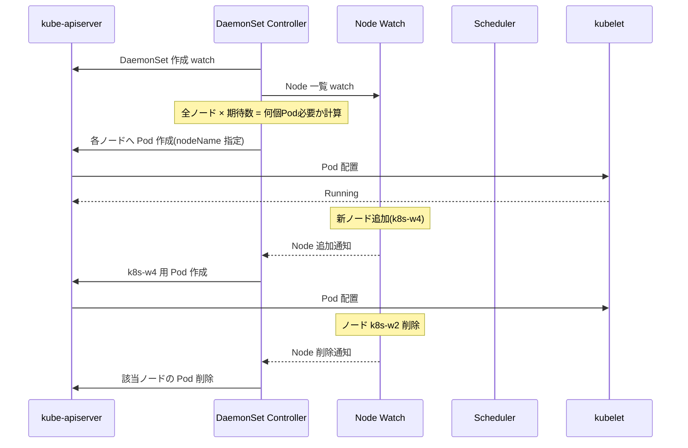
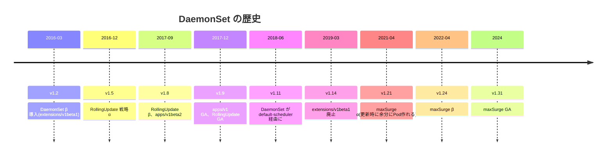
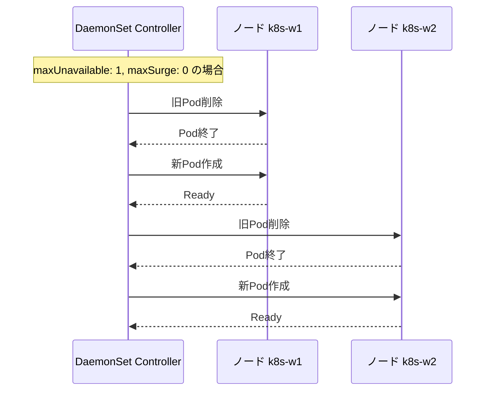
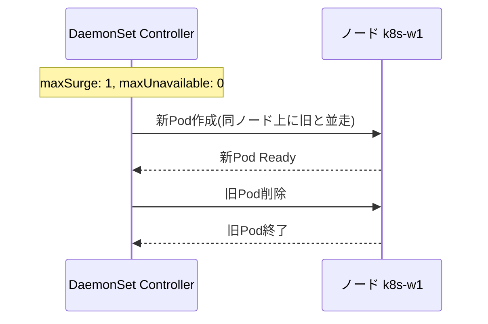
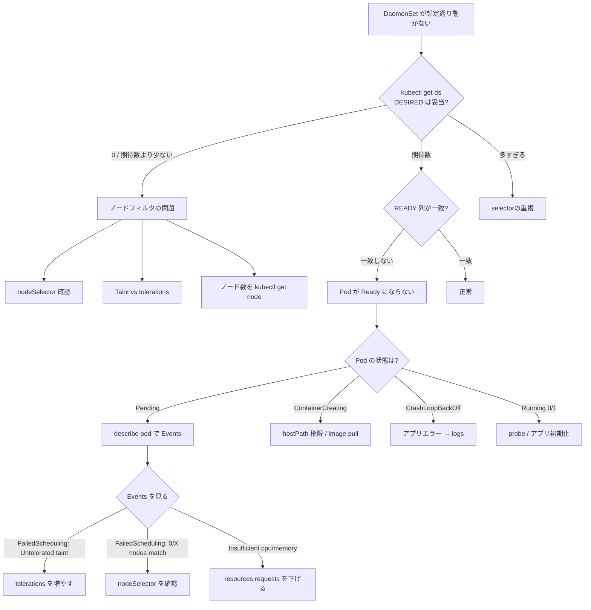
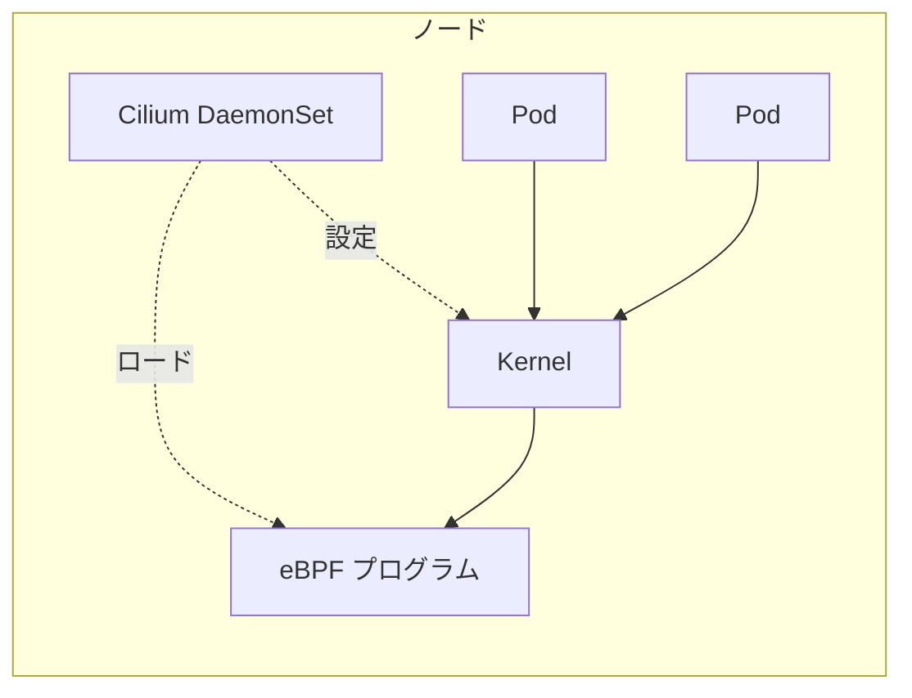
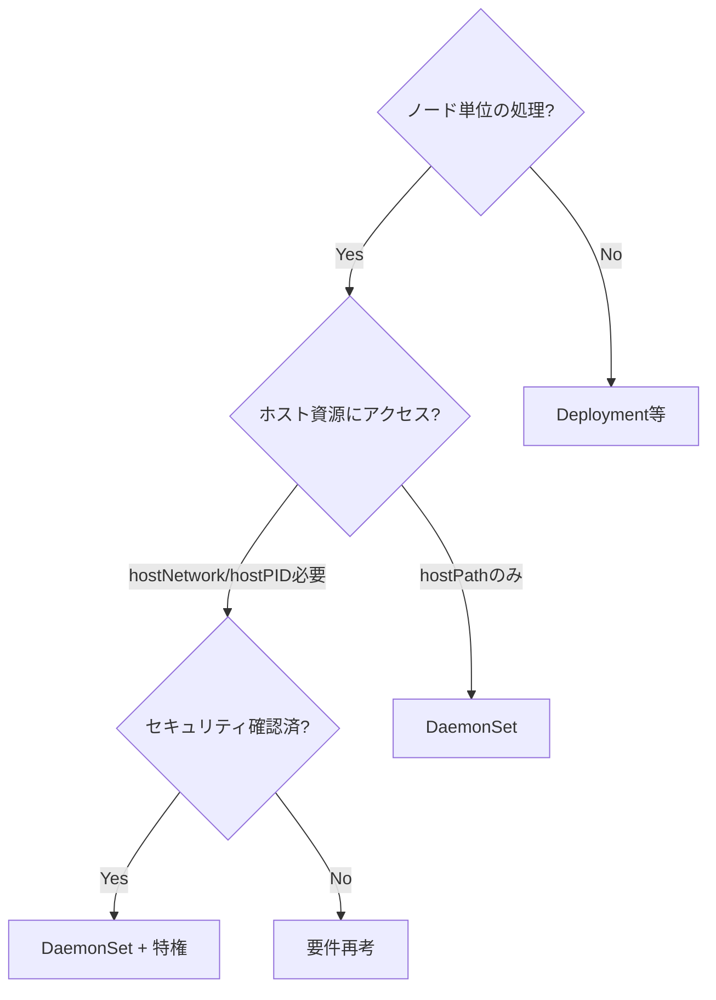

# DaemonSet
{: .no_toc }

## 目次
{: .no_toc .text-delta }

1. TOC
{:toc}

---

## このページのゴール

このページを読み終えると、以下を **自分の言葉で説明できる** ようになります。

- DaemonSet が **何のために生まれた** のか、Deployment では何が困るのかを歴史的経緯と一緒に説明できる
- DaemonSet を選ぶべき典型的な 5 つのユースケース(ログ収集、メトリクス、CNI、セキュリティ、ストレージ) を例とともに挙げられる
- `hostNetwork`、`hostPID`、`hostPath`、`tolerations`、`nodeSelector` などの **DaemonSet で頻出する Pod レベルのフィールド** の意味と危険性を説明できる
- `updateStrategy.RollingUpdate` と `OnDelete` の違いを理解し、ログ・監視系で `OnDelete` を選ぶ理由を説明できる
- Control Plane ノードにも DaemonSet を配置するための `tolerations` 設定が書ける
- DaemonSet 関連のトラブル(全ノードに配られない、`hostPath` の権限エラー、Taint で配置されない、ノード追加時に Pod が立ち上がらない、など)を **切り分けて原因に到達** できる
- ミニTODOサービスのクラスタに **Fluent Bit と Node Exporter を DaemonSet で展開** できる

---

## なぜ DaemonSet が必要か — Deployment では何が困るのか

DaemonSet を理解するには、まず「**全ノードに 1 個ずつ Pod を配りたい**」という要件が、なぜ Deployment では満たせないのかを押さえます。

### 「ノード単位」のエージェントという要件

Kubernetes クラスタを運用していると、**「ノードごと」に動くプロセス** が必要になります。代表例:

- **ログ収集** : 各ノードの `/var/log/containers` を読んで送出する Fluent Bit / Promtail / Filebeat
- **メトリクス収集** : ノードの CPU/メモリ/ディスク I/O を出す Node Exporter / cAdvisor
- **ネットワーク** : Pod 間通信を成立させる CNI プラグイン(Calico、Cilium、Flannel)の DaemonSet
- **セキュリティ** : ノード上のシステムコール監視(Falco)、ランタイム侵入検知
- **ストレージ** : CSI プラグインの NodePlugin(各ノードでボリュームマウントを実行する側)
- **GPU 管理** : NVIDIA Device Plugin、ノード上で GPU をスケジュール可能リソースとして公開する
- **デバッグ** : ノードへの SSH 代替として `node-shell` を全ノードに置く

これらに共通するのは、**「ある Pod が、特定のノード上のホストリソース(ディスク、ネットワーク、プロセス空間、デバイス) にアクセスする必要がある」** という点です。

### Deployment で「全ノードに1つ」を実現しようとすると

Deployment で `replicas:` を **ノード数と同じ** にして、`podAntiAffinity` で「同じノードに2つ置かない」と書けば、表面上は近いことができます。が、すぐ破綻します:

```mermaid
flowchart LR
    subgraph Deployment[Deployment(困る例)]
        D1[replicas: 3<br/>ノードと同数]
        D2[podAntiAffinity<br/>同ノード2つ禁止]
    end
    D1 --> P1[ノード追加されたら?]
    D2 --> P2[ノード故障したら?]
    P1 --> X1[手動で replicas 変更]
    P2 --> X2[Pod が宙ぶらりん]
    
    subgraph DaemonSet[DaemonSet(自動)]
        DS1[コントローラがノード数を追跡]
        DS2[新規ノードに自動配置]
        DS3[消失ノードのPodは消える]
    end
```

具体的にこういう問題が起きます:

1. **ノードが 5 台に増えたとき** — `replicas: 3` のままなので、新ノード 2 台に Pod が来ない。手動で `replicas: 5` に変える運用になる。
2. **ノードが 1 台壊れたとき** — Pod は別ノードに再スケジュールされ、結局「同ノードに 2 つ」状態になる。AntiAffinity が `requiredDuringScheduling` だと逆に Pending になる。
3. **GPU ノードだけに配りたい** — `nodeSelector` でフィルタしても、replicas 数の管理は手動。

DaemonSet は「**ノードに Pod を 1 つ貼り付ける**」というより自然な抽象を提供します。コントローラがノードを watch していて、**ノードが増えたら Pod を作り、ノードが消えたら Pod を消す** ことを自動でやります。

### DaemonSet のコントローラ動作



注目すべきは、**DaemonSet コントローラは Pod に直接 `nodeName` を指定** する点です(従来は。v1.12 以降は `nodeAffinity` 経由)。なので Pod は **スケジューラの調整を待たずに** その特定ノードに割り付けられます。

---

## 歴史: DaemonSet API の進化



### 当初: 自前スケジューラだった

v1.10 までは、DaemonSet コントローラが **直接 Pod の `nodeName` を指定** していました。これは便利だった反面、**スケジューラの判断(Taint、リソース、Affinity) を経由しない** ため、リソース不足のノードでも Pod がスケジュールされてしまうという問題がありました。

### v1.11 で default-scheduler 経由に

v1.11 で DaemonSet は **`nodeAffinity` を Pod に注入する形** に変わり、最終的なノード割り付けは default-scheduler が行うようになりました。これで Taint、リソース要求、Affinity がすべて統一的に評価されます。

```yaml
# DaemonSet コントローラが内部で注入する nodeAffinity
spec:
  affinity:
    nodeAffinity:
      requiredDuringSchedulingIgnoredDuringExecution:
        nodeSelectorTerms:
        - matchFields:
          - key: metadata.name
            operator: In
            values: ["k8s-w1"]    # この特定のノードだけ
```

### v1.21 で maxSurge 追加

DaemonSet 更新時、`maxUnavailable: 1` だと **古い Pod を消してから新しい Pod を作る** ため、一瞬ノード上に Pod がいない瞬間が出ます。これは CNI や CSI のように **ノード上で常に動いていてほしい** ものには困ります。

`maxSurge: 1` を許せば「**新しい Pod を起動してから古い Pod を消す**」ができ、無停止更新が可能になります。

---

## 用途と典型例

DaemonSet が選ばれる代表的なシステム:

| 分野 | プロダクト例 | 何のため |
|------|-------------|---------|
| ログ収集 | Fluent Bit、Fluentd、Promtail、Filebeat、Vector | `/var/log/containers` のログをノード単位で収集 |
| メトリクス | Node Exporter、cAdvisor(kubeletが内蔵)、kube-state-metrics 補助 | ノードのCPU/MEM/Disk/NIC |
| CNI | Calico (calico-node)、Cilium、Flannel、Weave | 各ノードのルーティング/iptables/eBPF |
| セキュリティ | Falco、Sysdig Agent、Aqua Enforcer | ノードのシステムコール監視 |
| ストレージ | NFS-CSI NodePlugin、AWS EBS CSI Node、Longhorn | 各ノードでのボリュームマウント実行 |
| GPU | NVIDIA Device Plugin、AMD GPU Plugin | デバイスをスケジュール可能リソース化 |
| ネットワーク補助 | kube-proxy(古典的)、MetalLB Speaker | iptables / ARP / BGP |
| ノード管理 | Node Problem Detector、Node Local DNS | ノード健全性、DNSキャッシュ |

{: .note }
> kube-proxy は伝統的に DaemonSet として配られていますが、Cilium のように eBPF で kube-proxy を置き換えるアーキテクチャもあります(`kube-proxy replacement`)。

---

## 基本の YAML — Node Exporter を例に

`/var/lib/node_exporter` ではなく、`/proc`, `/sys` などのホスト情報を読み取る Prometheus Node Exporter を配ります。

### 完全な YAML

```yaml
apiVersion: apps/v1
kind: DaemonSet
metadata:
  name: node-exporter
  namespace: monitoring
  labels:
    app.kubernetes.io/name: node-exporter
    app.kubernetes.io/part-of: monitoring
spec:
  selector:
    matchLabels:
      app.kubernetes.io/name: node-exporter
  updateStrategy:
    type: RollingUpdate
    rollingUpdate:
      maxUnavailable: 1
      maxSurge: 0          # v1.24+ beta、25+ GA
  template:
    metadata:
      labels:
        app.kubernetes.io/name: node-exporter
        app.kubernetes.io/part-of: monitoring
    spec:
      hostNetwork: true        # ★ ホストのネットワーク名前空間を使う
      hostPID: true            # ★ ホストのプロセス空間を見る
      dnsPolicy: ClusterFirstWithHostNet   # hostNetwork と相性
      tolerations:
      - operator: Exists       # ★ あらゆるTaintを許容
      serviceAccountName: node-exporter
      securityContext:
        runAsUser: 65534       # nobody
        runAsNonRoot: true
        runAsGroup: 65534
      containers:
      - name: node-exporter
        image: prom/node-exporter:v1.8.2
        args:
        - --path.procfs=/host/proc
        - --path.sysfs=/host/sys
        - --path.rootfs=/host/root
        - --collector.filesystem.mount-points-exclude=^/(dev|proc|sys|var/lib/docker/.+|var/lib/kubelet/pods/.+)($|/)
        ports:
        - name: metrics
          containerPort: 9100
          hostPort: 9100        # ホストの9100で公開(Prometheus がスクレイプ)
          protocol: TCP
        resources:
          requests:
            cpu: 50m
            memory: 64Mi
          limits:
            cpu: 200m
            memory: 256Mi
        readinessProbe:
          httpGet:
            path: /
            port: 9100
          initialDelaySeconds: 5
        livenessProbe:
          httpGet:
            path: /
            port: 9100
          initialDelaySeconds: 30
        volumeMounts:
        - name: proc
          mountPath: /host/proc
          readOnly: true
        - name: sys
          mountPath: /host/sys
          readOnly: true
        - name: root
          mountPath: /host/root
          mountPropagation: HostToContainer
          readOnly: true
      volumes:
      - name: proc
        hostPath:
          path: /proc
      - name: sys
        hostPath:
          path: /sys
      - name: root
        hostPath:
          path: /
```

### 1ブロックずつ解説

#### `hostNetwork: true`

Pod が **ホストのネットワーク名前空間で動く** という意味です。これは **重大な意思決定** なので、毎回 一度立ち止まって考える必要があります。

意味するところ:

- Pod の IP = **ノードの IP**(Pod CIDR から払い出されない)
- Pod 内の `localhost:9100` = ノードの 9100 ポート
- ポートが他のプロセスと衝突する可能性
- **NetworkPolicy の対象外**(Pod ネットワーク経由ではないため、CNI の制御外)
- セキュリティ的にホストの全ポートに触れる

なぜ Node Exporter が `hostNetwork: true` なのか?

理由は **「ノードの NIC 統計を読みたいから」**。`/proc/net/dev` はホストの NIC 情報なので、Pod ネットワーク経由で見るとコンテナの仮想 NIC しか見えません。ノードの NIC を見るには、ノードのネットワーク名前空間に入る必要があります。

{: .warning }
> `hostNetwork: true` は本当に必要な時だけ。ネットワーク統計や CNI のような **ホストの NIC を扱う** 用途以外では避けるべき。一般的なログ収集(Fluent Bit)では不要。

#### `hostPID: true`

Pod が **ホストのプロセス名前空間で動く** という意味です。

意味するところ:

- `ps aux` でホストの全プロセスが見える
- `/proc/<pid>/` でホストの全プロセスの情報が読める
- ホストの全プロセスにシグナル送信できる(権限次第)

なぜ Node Exporter が `hostPID: true` なのか?

`process` collector が **ホストプロセスの統計を集める** ために必要です。CPU/MEM だけ見たい場合は `hostPID: false` でも動きます。

{: .warning }
> `hostPID: true` も慎重に。特権昇格の経路になりえます。本番では Pod Security Standards (PSS) で `restricted` プロファイルだと使えません。

#### `dnsPolicy: ClusterFirstWithHostNet`

`hostNetwork: true` の Pod は、デフォルトでは **ホストの `/etc/resolv.conf` を見る** ようになるため、CoreDNS による Service 名解決(`postgres.todo.svc.cluster.local`)ができません。

`ClusterFirstWithHostNet` を指定すると、`hostNetwork: true` でも CoreDNS を優先してくれます。`hostNetwork` Pod が他の Service を呼びたい時には必須。

#### `tolerations: operator: Exists`

すべての Taint を許容する書き方。これにより:

- `node-role.kubernetes.io/control-plane:NoSchedule` がある Control Plane ノードにも配れる
- `dedicated=gpu:NoSchedule` がある GPU ノードにも配れる
- `node.kubernetes.io/unreachable:NoExecute` がある到達不能ノードに残れる

```yaml
tolerations:
- operator: Exists
```

これは「**全ての Taint に対して全ての effect を許容**」を意味します。より厳密に書くなら:

```yaml
tolerations:
- key: node-role.kubernetes.io/control-plane
  operator: Exists
  effect: NoSchedule
- key: node.kubernetes.io/disk-pressure
  operator: Exists
  effect: NoSchedule
```

DaemonSet の本性上「**全ノードに配る**」が目的なので、`operator: Exists` で全 Taint 許容するのが定石です。逆に「Control Plane には配りたくない」場合は、tolerations を限定します。

#### `hostPort: 9100`

Pod のポートを **ホストの 9100 ポートに直接マッピング** します。`hostNetwork: true` の場合は不要(Pod が直接ホストネットワークで動くので)ですが、明示しておくと意図が読みやすくなります。

`hostPort` を使うと、Prometheus は **ノード IP の 9100** にスクレイプを送れば Node Exporter にたどり着きます。NodePort Service と違い、ノード単位なのでロードバランスは入りません(それが望ましい)。

#### `volumeMounts` と `mountPropagation`

`mountPropagation: HostToContainer` は **ホスト側でマウントされた追加のファイルシステムが、コンテナ側にも見える** ようにする設定です。

- `None`(既定) : マウント時の状態だけ
- `HostToContainer` : 後から追加マウントされたものも見える(ホスト→コンテナ単方向)
- `Bidirectional` : 双方向(コンテナのマウントもホストに伝播)。CSI ドライバがよく使う

Node Exporter の場合、ノードに USB ストレージが後から差された時もファイルシステムが見えるよう `HostToContainer` に。

---

## ハンズオン1: Fluent Bit でクラスタ全ノードのログを収集

ミニTODOサービスのクラスタで、各ノードの `/var/log/containers` を Fluent Bit で読み出す DaemonSet を作ります。

### 1. Namespace と ServiceAccount

```bash
kubectl create namespace logging

cat <<EOF | kubectl apply -f -
apiVersion: v1
kind: ServiceAccount
metadata:
  name: fluent-bit
  namespace: logging
---
apiVersion: rbac.authorization.k8s.io/v1
kind: ClusterRole
metadata:
  name: fluent-bit-read
rules:
- apiGroups: [""]
  resources: ["namespaces", "pods"]
  verbs: ["get", "list", "watch"]
---
apiVersion: rbac.authorization.k8s.io/v1
kind: ClusterRoleBinding
metadata:
  name: fluent-bit-read
roleRef:
  apiGroup: rbac.authorization.k8s.io
  kind: ClusterRole
  name: fluent-bit-read
subjects:
- kind: ServiceAccount
  name: fluent-bit
  namespace: logging
EOF
```

### 2. ConfigMap(Fluent Bit の設定)

```yaml
apiVersion: v1
kind: ConfigMap
metadata:
  name: fluent-bit-config
  namespace: logging
data:
  fluent-bit.conf: |
    [SERVICE]
        Flush         1
        Log_Level     info
        Daemon        off
        Parsers_File  parsers.conf

    [INPUT]
        Name              tail
        Tag               kube.*
        Path              /var/log/containers/*.log
        Parser            cri
        DB                /var/log/flb_kube.db
        Mem_Buf_Limit     50MB
        Refresh_Interval  10
        Skip_Long_Lines   On

    [FILTER]
        Name                kubernetes
        Match               kube.*
        Kube_URL            https://kubernetes.default.svc:443
        Merge_Log           On
        K8S-Logging.Parser  On
        K8S-Logging.Exclude On

    [OUTPUT]
        Name            stdout
        Match           *
        Format          json_lines

  parsers.conf: |
    [PARSER]
        Name        cri
        Format      regex
        Regex       ^(?<time>[^ ]+) (?<stream>stdout|stderr) (?<logtag>[^ ]*) (?<log>.*)$
        Time_Key    time
        Time_Format %Y-%m-%dT%H:%M:%S.%L%z
```

実運用では `[OUTPUT]` を `stdout` ではなく Loki / Elasticsearch / S3 にしますが、まずは `stdout` で動作確認します。

### 3. DaemonSet 本体

```yaml
apiVersion: apps/v1
kind: DaemonSet
metadata:
  name: fluent-bit
  namespace: logging
  labels:
    app.kubernetes.io/name: fluent-bit
spec:
  selector:
    matchLabels:
      app.kubernetes.io/name: fluent-bit
  updateStrategy:
    type: RollingUpdate
    rollingUpdate:
      maxUnavailable: 1
  template:
    metadata:
      labels:
        app.kubernetes.io/name: fluent-bit
    spec:
      serviceAccountName: fluent-bit
      tolerations:
      - operator: Exists
      containers:
      - name: fluent-bit
        image: fluent/fluent-bit:3.1.7
        imagePullPolicy: IfNotPresent
        ports:
        - name: http
          containerPort: 2020
        resources:
          requests:
            cpu: 50m
            memory: 64Mi
          limits:
            cpu: 200m
            memory: 256Mi
        volumeMounts:
        - name: varlog
          mountPath: /var/log
        - name: varlibdockercontainers
          mountPath: /var/lib/docker/containers
          readOnly: true
        - name: config
          mountPath: /fluent-bit/etc/
      terminationGracePeriodSeconds: 10
      volumes:
      - name: varlog
        hostPath:
          path: /var/log
      - name: varlibdockercontainers
        hostPath:
          path: /var/lib/docker/containers
      - name: config
        configMap:
          name: fluent-bit-config
```

### 4. apply して観察

```bash
kubectl apply -f fluent-bit.yaml

kubectl get ds -n logging
```

**期待される出力**:

```
NAME         DESIRED   CURRENT   READY   UP-TO-DATE   AVAILABLE   NODE SELECTOR   AGE
fluent-bit   3         3         3       3            3           <none>          1m
```

各列の意味:

| 列 | 意味 |
|----|------|
| DESIRED | 期待される Pod 数 = 配置可能ノード数 |
| CURRENT | 現在の Pod 数 |
| READY | Ready 状態の Pod 数 |
| UP-TO-DATE | 最新 spec で動いている Pod 数 |
| AVAILABLE | 利用可能な Pod 数(`minReadySeconds` 経過後) |
| NODE SELECTOR | 配置先のノードラベル |

VMware kubeadm 環境(マスター3+ワーカー3)では DESIRED は **6** になるはず…ですが、**Control Plane のデフォルトTaint** があるとマスターには配置されません。`tolerations: operator: Exists` を入れているので、6 になります。

### 5. 各ノードに配られたか確認

```bash
kubectl get pods -n logging -o wide
```

**期待される出力**:

```
NAME               READY   STATUS    NODE      IP
fluent-bit-aaaaa   1/1     Running   k8s-cp1   10.244.1.5
fluent-bit-bbbbb   1/1     Running   k8s-cp2   10.244.2.5
fluent-bit-ccccc   1/1     Running   k8s-cp3   10.244.3.5
fluent-bit-ddddd   1/1     Running   k8s-w1    10.244.4.5
fluent-bit-eeeee   1/1     Running   k8s-w2    10.244.5.5
fluent-bit-fffff   1/1     Running   k8s-w3    10.244.6.5
```

`NODE` 列がすべて異なれば、ノードごとに 1 つずつ配られています。

### 6. ログ確認

```bash
kubectl logs -n logging -l app.kubernetes.io/name=fluent-bit --tail=20
```

JSON 形式で他 Pod のログが流れていれば成功です。

```json
{"date":1717820000.123,"stream":"stdout","time":"2026-04-08T10:00:00Z","log":"INFO Started server","kubernetes":{"pod_name":"todo-api-...","namespace_name":"todo","container_name":"api"}}
```

---

## ノードの一部にだけ配置する

DaemonSet は通常「全ノード」ですが、`nodeSelector` または `nodeAffinity` で **一部のノードだけ** に絞れます。

### nodeSelector による単純フィルタ

```yaml
spec:
  template:
    spec:
      nodeSelector:
        gpu: "true"
```

ノードに `gpu=true` ラベルが付いているノードのみに配置。GPU プラグインの典型構成。

ノードへのラベル付け:

```bash
kubectl label node k8s-w3 gpu=true
```

### nodeAffinity による複雑な条件

```yaml
spec:
  template:
    spec:
      affinity:
        nodeAffinity:
          requiredDuringSchedulingIgnoredDuringExecution:
            nodeSelectorTerms:
            - matchExpressions:
              - key: node-role.kubernetes.io/worker
                operator: Exists
              - key: kubernetes.io/arch
                operator: In
                values: [amd64]
```

「ワーカーロールであり、x86_64 アーキテクチャ」のノードだけに配置。

### よく使うノードラベル

K8s が自動で付けるラベル(必ずある):

| ラベル | 値の例 |
|--------|--------|
| `kubernetes.io/hostname` | `k8s-w1` |
| `kubernetes.io/arch` | `amd64`, `arm64` |
| `kubernetes.io/os` | `linux`, `windows` |
| `node-role.kubernetes.io/control-plane` | (空文字、key存在のみ) |
| `topology.kubernetes.io/zone` | `ap-northeast-1a`(クラウドのみ) |
| `topology.kubernetes.io/region` | `ap-northeast-1` |
| `node.kubernetes.io/instance-type` | `m5.large`(クラウドのみ) |

---

## アップデート戦略

DaemonSet も Deployment と同じく `updateStrategy` を持ちます。

### RollingUpdate(既定)

```yaml
spec:
  updateStrategy:
    type: RollingUpdate
    rollingUpdate:
      maxUnavailable: 1
      maxSurge: 0          # v1.25+ GA
```

挙動:

- Pod を **古い順** に削除→再作成
- `maxUnavailable: 1` なら同時に 1 ノード分の Pod が止まる
- `maxSurge: 1` を許すと **新Pod を起動してから旧Podを消す** が可能(無停止)



### maxSurge を許す場合の挙動



CNI、CSI、kube-proxy のように **「常に動いていてほしい」** ものでは `maxSurge: 1, maxUnavailable: 0` が推奨。ただしホストネットワーク利用時は **ポート衝突** の問題で `maxSurge` が使いづらいケースがあるので注意(同じノード上で同じ `hostPort: 9100` を 2 つ使えない)。

### OnDelete

```yaml
spec:
  updateStrategy:
    type: OnDelete
```

挙動:

- DaemonSet を更新しても **既存 Pod は変わらない**
- ユーザが手動で `kubectl delete pod` した時、新しい spec で再作成される

ユースケース:

- **本番DBノードのストレージドライバ** など、絶対に意図せず再起動されたくないもの
- **慎重に1ノードずつ更新したい** 監視・ログ系

---

## 詳細仕様: 主要フィールド一覧

| フィールド | 既定値 | 意味 | 注意 |
|-----------|--------|------|------|
| `spec.selector.matchLabels` | (必須) | Pod 選択 | template.labels と一致必須 |
| `spec.template` | (必須) | Pod テンプレート | この中の `nodeSelector`、`tolerations` が重要 |
| `spec.updateStrategy.type` | RollingUpdate | 更新方式 | OnDelete で手動 |
| `spec.updateStrategy.rollingUpdate.maxUnavailable` | 1 | 同時にUnavailableにできるPod数 | パーセント指定可 |
| `spec.updateStrategy.rollingUpdate.maxSurge` | 0 | 同時に余分作れるPod数 | v1.25+ GA |
| `spec.minReadySeconds` | 0 | Ready後この秒数で利用可 | |
| `spec.revisionHistoryLimit` | 10 | ControllerRevision の保持数 | rollback 用 |

### 知っておきたい Pod レベルのフィールド

DaemonSet の `template.spec` で頻出:

| フィールド | よく使う設定 | 用途 |
|-----------|-------------|------|
| `hostNetwork` | true / false | ホストNICを使う |
| `hostPID` | true / false | ホストプロセス空間 |
| `hostIPC` | true / false | ホスト IPC 空間 |
| `dnsPolicy` | ClusterFirstWithHostNet | hostNetwork 時に DNS 統合 |
| `priorityClassName` | system-node-critical | スケジューリング優先度 |
| `tolerations` | operator: Exists | Taint 全許容 |
| `nodeSelector` / `affinity.nodeAffinity` | OS/arch/役割 | ノードフィルタ |
| `hostPath` ボリューム | path: /var/log | ホストファイル参照 |

### `priorityClassName: system-node-critical`

ノードが **リソース不足** で Pod を Evict する時、優先度の低いPodから消されます。CNI や ノード必須エージェント は `system-node-critical` を設定し、最も Evict されにくくします。

```yaml
spec:
  template:
    spec:
      priorityClassName: system-node-critical
```

これは事前に存在する PriorityClass(K8s が自動で作成)の名前です。

---

## トラブルシューティング

### 切り分けフローチャート



### よくあるエラー集

#### 症状1: 配置されないノードがある(DESIRED < ノード数)

ノード数:

```bash
$ kubectl get nodes
NAME      STATUS   ROLES           AGE   VERSION
k8s-cp1   Ready    control-plane   10d   v1.30.4
k8s-cp2   Ready    control-plane   10d   v1.30.4
k8s-cp3   Ready    control-plane   10d   v1.30.4
k8s-w1    Ready    <none>          10d   v1.30.4
k8s-w2    Ready    <none>          10d   v1.30.4
k8s-w3    Ready    <none>          10d   v1.30.4
```

DaemonSet:

```bash
$ kubectl get ds -n logging
NAME         DESIRED   CURRENT   READY
fluent-bit   3         3         3
```

ノードは6台なのに DESIRED が3 → **マスター3台に配置されていない**。

確認:

```bash
$ kubectl get node k8s-cp1 -o jsonpath='{.spec.taints}' | jq
[
  {
    "effect": "NoSchedule",
    "key": "node-role.kubernetes.io/control-plane"
  }
]
```

`node-role.kubernetes.io/control-plane:NoSchedule` Taint があるが、DaemonSet の tolerations にこれを許容するものがない。

**対処**: tolerations に `operator: Exists` を追加:

```yaml
spec:
  template:
    spec:
      tolerations:
      - operator: Exists      # 全Taint許容
```

または特定:

```yaml
      tolerations:
      - key: node-role.kubernetes.io/control-plane
        operator: Exists
        effect: NoSchedule
```

#### 症状2: ノード追加後、新ノードに配らない

新ノードを追加したのに DaemonSet が来ない場合、ノードのラベルとTaintを確認:

```bash
kubectl get node <new-node> --show-labels
kubectl get node <new-node> -o yaml | grep -A5 taints
```

DaemonSet の `nodeSelector` と一致するか、Taint が tolerated か。

#### 症状3: hostPath マウントで `permission denied`

```
$ kubectl logs -n logging fluent-bit-xxx
[error] [in_tail] cannot read file /var/log/containers/*.log
```

原因候補:

- SELinux / AppArmor がコンテナのアクセスを拒否
- ホスト側のディレクトリの permission(普通 `/var/log` は 755)
- `securityContext.runAsUser` でホストファイルが読めない

確認:

```bash
# ホスト側で
sudo ls -la /var/log/containers/ | head
```

対処:

- SELinux の場合: `:Z` ラベル付加、または `securityContext.seLinuxOptions`
- root で動かす(`runAsUser: 0`)— 本番では避けたい

#### 症状4: `hostPort` 衝突

```
Warning  FailedScheduling  ...  node(s) didn't have free ports for the requested pod ports
```

原因: 同じノードで他の Pod が同じ `hostPort` を使っている。

確認:

```bash
kubectl get pods -A -o yaml | grep -A2 hostPort
```

対処:

- ポート番号を変える
- `hostNetwork: true` にする(その場合、ポートはコンテナ側のものがそのまま)
- 本当に必要か再考(Service 経由にできないか)

#### 症状5: `kubelet が Pod を作ろうとして失敗`

```
$ kubectl describe ds fluent-bit -n logging
...
Events:
  Warning  FailedDaemonPod  ...  Found failed daemon pod logging/fluent-bit-xxx on node k8s-w2, will try to kill it
```

DaemonSet コントローラが Pod を作ろうとして失敗を繰り返している状態。`describe pod` で個別の失敗原因を見る。

#### 症状6: 古い Pod が残る(更新されない)

```bash
$ kubectl get ds -n logging
NAME         DESIRED   CURRENT   READY   UP-TO-DATE
fluent-bit   6         6         6       3
```

`UP-TO-DATE` が 3 のみ → 半分が古い spec のまま。

原因: `updateStrategy: OnDelete` で、ユーザが Pod を消していない。

```bash
$ kubectl get ds fluent-bit -n logging -o jsonpath='{.spec.updateStrategy.type}'
OnDelete
```

対処: 古い Pod を `kubectl delete pod` するか、`updateStrategy` を `RollingUpdate` に変更。

---

## デバッグのチェックリスト

- [ ] `kubectl get ds -A` で DaemonSet 一覧
- [ ] `kubectl get ds -n <ns> <name>` で `DESIRED / CURRENT / READY / UP-TO-DATE / AVAILABLE` を確認
- [ ] `kubectl get nodes --show-labels` で全ノードの状態とラベル
- [ ] `kubectl get pods -n <ns> -l <selector> -o wide` で Pod の `NODE` 列を見て、どのノードに配られているか
- [ ] `kubectl describe ds <name>` で末尾 Events
- [ ] `kubectl describe pod <pod>` で個別 Pod の Events
- [ ] `kubectl logs <pod>` でアプリケーションログ
- [ ] 各ノードの Taint: `kubectl get nodes -o custom-columns=NAME:.metadata.name,TAINTS:.spec.taints`
- [ ] DaemonSet の tolerations: `kubectl get ds <name> -o jsonpath='{.spec.template.spec.tolerations}'`
- [ ] DaemonSet の nodeSelector: `kubectl get ds <name> -o jsonpath='{.spec.template.spec.nodeSelector}'`

---

## 代替アーキテクチャの検討

「全ノードに配る」が要件のとき、DaemonSet 以外の選択肢:

### 1. Sidecar(各 Pod に内蔵)

ログ収集をアプリ Pod の **Sidecar** として埋め込む。

| 比較 | DaemonSet | Sidecar |
|------|-----------|---------|
| 配置単位 | ノード | Pod |
| リソース消費 | ノード数 | Pod数 |
| ログ取り逃し | 起動順次第で起こる | 起こりにくい |
| アプリ Pod のスペック汚染 | なし | あり |
| 設定変更の影響範囲 | 全ノード | アプリ毎 |

**ログ収集の場合**は DaemonSet が一般的(ノード単位の方が経済的)。
**Service Mesh の sidecar(Envoy)** は Pod レベルが必要(Pod 内通信を仲介するため)。

### 2. ノード起動スクリプト(systemd)

エージェントを **K8s 外** にインストール(systemd サービスとしてホストで動かす)。

| 比較 | DaemonSet | systemd |
|------|-----------|---------|
| K8s で管理 | ◎ | × |
| 自動更新 | ◎ | △(別の構成管理) |
| K8s リソース消費 | あり | なし |
| K8s 自体が壊れた時 | 動かない | 動く |
| ログ収集の対象 | K8sコンテナ | K8s 含むホスト全体 |

**K8s 自体のログ(kubelet、containerd)も収集したい** ケースでは systemd 経由のほうが収集範囲が広い。Datadog Agent などは両方の構成をサポートしています。

### 3. Static Pod

`/etc/kubernetes/manifests/` に YAML を置くと、kubelet が **API サーバなしで** Pod を起動する仕組み。`kube-apiserver`、`etcd`、`kube-controller-manager` 自身がこれで動いている。

ノード固有の必須コンポーネントには使えるが、**API 経由の管理ができない** ので一般エージェントには向かない。

---

## 高度なトピック

### Cilium のような eBPF プラットフォーム

Cilium は CNI を DaemonSet で配布しますが、内部では **eBPF プログラムをカーネルにロード** することで、kube-proxy(iptables ベース)を置き換えます。これは DaemonSet が実現できる「特権的なノード上の処理」の典型例です。



### NodeReady でない時の挙動

ノードが `NotReady` になると、DaemonSet コントローラは新規 Pod を作りません。が、**既に作られた Pod は kubelet が消すか、Eviction される** までそのノード上で動き続けます。

ノードが完全停止すると、`node.kubernetes.io/unreachable:NoExecute` Taint が付きます。Pod がこれを Tolerate していないと **約 5 分後に削除** されます(`tolerationSeconds: 300` が既定)。DaemonSet では `operator: Exists` で全許容しているので、ノードが復活したらそのまま動き続けることが多いです。

### `spec.template.spec.dnsPolicy` のバリエーション

| 値 | 意味 |
|----|------|
| `ClusterFirst`(既定) | CoreDNS 優先 |
| `ClusterFirstWithHostNet` | hostNetwork 時に CoreDNS を使う |
| `Default` | ホストの `/etc/resolv.conf` を使う |
| `None` | `dnsConfig` で完全カスタム |

DaemonSet で `hostNetwork: true` を使う時は、ほぼ確実に `ClusterFirstWithHostNet` を指定。

---

## 主要な kubectl コマンド集

```bash
# 一覧
kubectl get ds -A
kubectl get ds -n logging
kubectl get ds -n logging -o wide

# 詳細
kubectl describe ds -n logging fluent-bit

# YAML
kubectl get ds -n logging fluent-bit -o yaml
kubectl get ds -n logging fluent-bit -o jsonpath='{.spec.updateStrategy.type}'

# 編集
kubectl edit ds -n logging fluent-bit
kubectl set image ds/fluent-bit -n logging fluent-bit=fluent/fluent-bit:3.2.0

# 更新
kubectl rollout status ds/fluent-bit -n logging
kubectl rollout history ds/fluent-bit -n logging
kubectl rollout undo ds/fluent-bit -n logging
kubectl rollout undo ds/fluent-bit -n logging --to-revision=2

# 個別 Pod の操作
kubectl get pods -n logging -l app.kubernetes.io/name=fluent-bit -o wide
kubectl logs -n logging -l app.kubernetes.io/name=fluent-bit --tail=50
kubectl logs -n logging -l app.kubernetes.io/name=fluent-bit --tail=50 -f --max-log-requests=10

# OnDelete時の手動更新
kubectl delete pod -n logging -l app.kubernetes.io/name=fluent-bit --field-selector=spec.nodeName=k8s-w1

# 削除
kubectl delete ds -n logging fluent-bit
```

各コマンドの解説:

- `--field-selector=spec.nodeName=k8s-w1` : 特定ノードの Pod だけ操作。`OnDelete` 戦略で1ノードずつ更新するときに便利。
- `--max-log-requests=10` : 並列に開けるストリーム数(デフォルトは 5)。多い DaemonSet でログを集める時に増やす。
- `kubectl rollout undo --to-revision=N` : `ControllerRevision` のリビジョンに戻す。`rollout history` で番号を確認。

---

## まとめ: DaemonSet チートシート

```yaml
# ミニマル DaemonSet
apiVersion: apps/v1
kind: DaemonSet
metadata: { name: <name>, namespace: <ns> }
spec:
  selector: { matchLabels: { app: <name> } }
  updateStrategy:
    type: RollingUpdate                  # または OnDelete
    rollingUpdate:
      maxUnavailable: 1
      maxSurge: 0                        # 1にすると無停止更新
  template:
    metadata: { labels: { app: <name> } }
    spec:
      tolerations:
      - operator: Exists                 # 全Taint許容(マスター含む)
      priorityClassName: system-node-critical   # 必要なら
      hostNetwork: false                 # 必要な時だけ true
      hostPID: false                     # 必要な時だけ true
      dnsPolicy: ClusterFirst            # hostNetwork:true なら ClusterFirstWithHostNet
      containers:
      - name: ...
        image: ...
        volumeMounts:
        - name: hostlog
          mountPath: /host/log
          readOnly: true
      volumes:
      - name: hostlog
        hostPath: { path: /var/log }
```

意思決定のフロー:



---

## チェックポイント

ここまでで以下を **自分の言葉で** 説明できるか確認してください。

- [ ] DaemonSet を使うべき5つのユースケース(ログ、メトリクス、CNI、セキュリティ、ストレージ)を例とともに言える
- [ ] Deployment + replicas N + podAntiAffinity で「全ノードに1個」を組むと何が破綻するか説明できる
- [ ] `hostNetwork: true` と `hostPID: true` のリスクと、それを使う典型ケースを説明できる
- [ ] `tolerations: operator: Exists` が何を意味し、Control Plane ノードへの配置にどう関係するか説明できる
- [ ] `RollingUpdate` の `maxUnavailable` と `maxSurge` の違いを、CNI のケースで説明できる
- [ ] `OnDelete` 戦略を選ぶべきユースケースを2つ以上挙げられる
- [ ] `nodeSelector`、`nodeAffinity`、Taint+tolerations の3つを使い分ける場面を説明できる
- [ ] ノードを追加した直後に DaemonSet Pod が来ない時の調査手順を3ステップで言える
- [ ] サンプルアプリのクラスタに Fluent Bit を DaemonSet で展開する YAML を書ける
- [ ] 「DaemonSet ではなく systemd でホストにエージェントを入れる」という選択肢が妥当な状況を1つ挙げられる

---

→ 次は [Job と CronJob]({{ '/03-workloads/job/' | relative_url }})
