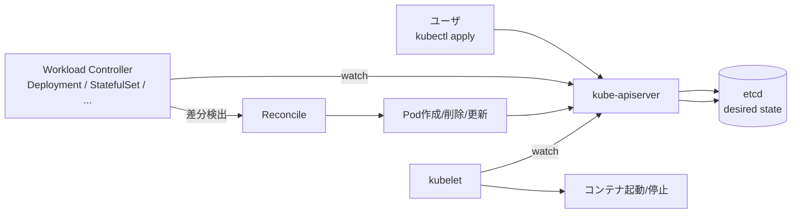
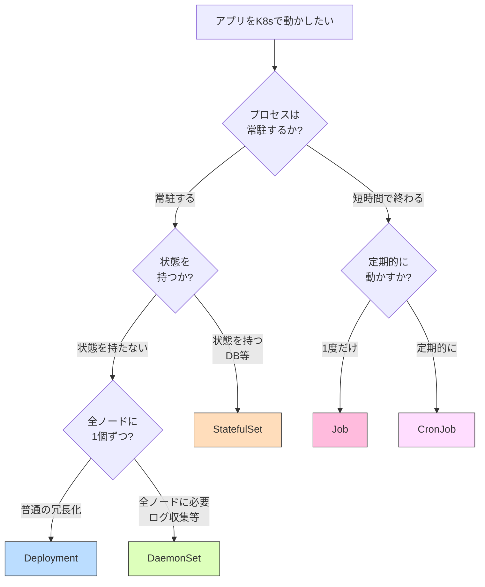
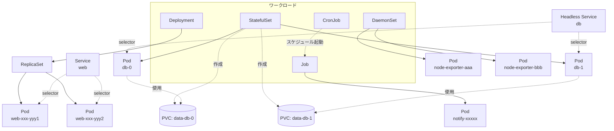
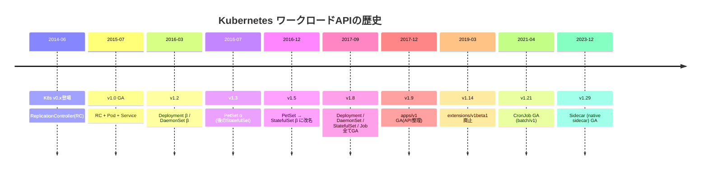
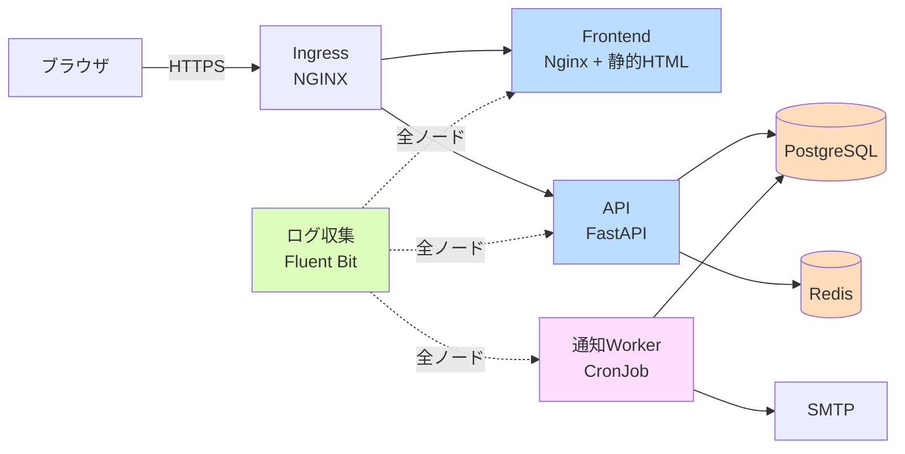

# 03. ワークロード
{: .no_toc }

## 目次
{: .no_toc .text-delta }

1. TOC
{:toc}

---

## この章のゴール

この章を読み終えると、以下を **自分の言葉で説明できる** ようになります。

- Kubernetes が提供する代表的なワークロードリソース(Deployment / StatefulSet / DaemonSet / Job / CronJob / Init Container / Sidecar)の **役割と歴史的経緯** を説明できる
- ある要件(例: 「DBサーバを動かしたい」「ログ収集エージェントを全ノードに配りたい」「夜間バッチを走らせたい」)に対して **どのワークロードを選ぶべきか** を判断できる
- それぞれのワークロードの **YAML の主要フィールド** を、なぜそうなっているのかと一緒に説明できる
- StatefulSet が「DB を高可用にしてくれる魔法」ではないこと、本番でのリアルな選択肢(Operator / 外出し / マネージド) を説明できる
- ミニTODOサービス(本教材のサンプルアプリ)の各コンポーネント(API、DB、キャッシュ、Worker、ログ収集) を **適切なワークロードで構築** できる
- ワークロードに関するトラブル(Pod が `Pending` のまま、`CrashLoopBackOff`、Job が完了しない、CronJob がスケジュールされない、StatefulSet の `0` 番が立ち上がらない、など) を **切り分けて原因に到達** できる

---

## なぜ「ワークロード」という概念が必要なのか

### 「Pod だけでは運用できない」という根本問題

Kubernetes の最小デプロイ単位は **Pod** ですが、現場では **Pod を直接 `kubectl apply` する人はいません**。
理由はシンプルで、**Pod は使い捨ての存在** だからです。Pod が落ちても **誰も復旧してくれない**、ノードが落ちたら Pod も一緒に消える、という性質があります。

第02章で Pod のライフサイクルを学んだとおり、Pod は「**そのノード上の、そのプロセス**」と紐付いた存在で、Kubernetes はあえてそういう設計にしています。代わりに、

- 「壊れたら作り直す」
- 「N 個欲しい状態を保つ」
- 「順番に立ち上げる」
- 「全ノードに 1 個ずつ配る」
- 「1回だけ走らせる」
- 「毎晩走らせる」

といった **「あるべき状態」を宣言し、実際の状態をそこに収束させ続ける** 役目を、**ワークロードコントローラ** が担います。

### コントローラパターンの一般原理

ワークロード = **「望ましい状態(spec)」を宣言する Custom Resource(CRD)+それを満たすように動くコントローラ** という構造です。

このループは **Reconciliation Loop(調整ループ)** と呼ばれ、Kubernetes 全体を貫く設計思想です。第01章で「宣言的 API」と呼んだものの実体がこれです。

ワークロードを学ぶことは、**「望ましい状態を、どう宣言し、どう収束させるか」のパターン集** を学ぶこと、と言い換えられます。

---

## 本章で扱うワークロード一覧

第02章で扱った **Deployment** に加えて、本章では以下を扱います。

| リソース | API バージョン | ざっくり用途 | ステート | 本章 |
|----------|---------------|--------------|----------|------|
| Deployment | `apps/v1` | ステートレスな Web/API | なし | 02章 |
| **StatefulSet** | `apps/v1` | DB、キュー、リーダー選出が必要なアプリ | あり | 本章 |
| **DaemonSet** | `apps/v1` | 全ノードに1個ずつ配るエージェント | なし | 本章 |
| **Job** | `batch/v1` | 1度きりのバッチ処理 | なし | 本章 |
| **CronJob** | `batch/v1` | スケジュール起動のバッチ処理 | なし | 本章 |
| **Init Container** | (Pod のフィールド) | メインコンテナ前の初期化 | - | 本章 |
| **Sidecar** | (Pod のフィールド) | メインに併走する補助コンテナ | - | 本章 |
| ReplicaSet | `apps/v1` | (Deployment の内部実装) | なし | 02章付録 |
| ReplicationController | `v1` | 廃止予定の旧型 | なし | 触れない |

{: .note }
> ReplicaSet は Deployment が内部で使うコントローラで、ユーザが直接書くことはほぼありません。ReplicationController は ReplicaSet 以前の旧型で、現代の本番環境で使う理由はないため本教材では割愛します。

---

## ワークロード選定フローチャート

「目の前の要件に、どのワークロードを使うべきか?」を判断するフローを示します。

このフローはあくまで **第一近似** で、現場ではもう少し細かい考慮が入ります(例: 「DB は K8s 内に入れず外出しする」「Worker は Deployment + キュー、または Job のどちらにするか」など)。各ページで深掘りします。

---

## ワークロードの全体相関図

Pod 単体ではなく、ワークロードが Pod を生成・管理し、Service が Pod を束ねる、という関係を視覚化します。

ポイント:

- Deployment は ReplicaSet 経由で Pod を作る(履歴/ロールバックのため)
- StatefulSet は **PVC を Pod ごとに自動生成**(`volumeClaimTemplates`)
- DaemonSet はノードごとに 1 つ Pod を配る
- CronJob は時刻になると **Job を作成**、Job が Pod を作成
- Service は Pod のラベルで束ねる(StatefulSet では Headless Service と組合せが基本)

---

## 歴史的経緯: ワークロード API はどう進化してきたか

「最初から StatefulSet があった」わけではありません。Kubernetes のワークロード API は **段階的に追加・整理** されてきました。年表で押さえます。

### v1.0 時代: ReplicationController しかなかった

K8s v1.0 では「N 個の Pod を維持する」のが ReplicationController(RC)の仕事でした。RC は **イメージタグの更新を rolling 更新する仕組みを持たず**、`kubectl rolling-update` というクライアント側のコマンドで擬似的にやっていました。**サーバ側に履歴が残らない**、**rollback は再度 rolling-update を逆向きに走らせる** という辛い世界です。

### v1.2(2016)で Deployment 登場

Deployment が登場し、`spec.strategy` で更新戦略が宣言的に書けるようになりました。Deployment は内部で ReplicaSet(RC の改良版で `selector` がより柔軟)を作り、**新旧 ReplicaSet を並走させて段階的に切り替える** ことで rolling update を実現します。**履歴が ReplicaSet として残るので rollback が簡単** になり、現代的な「Deployment+ReplicaSet+Pod」構造が確立しました。

### v1.3(2016)で PetSet(後の StatefulSet)登場

「ペット(個体識別が必要なサーバ)」と「家畜(使い捨てのサーバ)」の対比から **PetSet** と命名されましたが、**「家畜のように扱うのが本来の姿」というメッセージとブランディングに合わない** という議論で v1.5 で **StatefulSet** に改名されました。これは単なる名前変更ではなく、「**K8s では、なるべくステートレスに作るべき**」という設計思想の表明でもあります。

### v1.21(2021)で CronJob が GA

CronJob は長らく β のままで、本番投入を渋るチームも多くありました。`startingDeadlineSeconds` 周りの挙動の不安定さや、コントローラの実装が **古い `cronjob_controller.go`** だった経緯があります。v1.21 で **CronJob v2 controller** に置き換わって GA となり、ようやく本番でも素直に使えるようになりました。

### v1.29(2023)で Native Sidecar が GA

Sidecar は **長年 Pod の `containers:` に複数書く運用パターン** でしたが、「Pod 終了時にメインより Sidecar が先に死んでログを取りこぼす」「Init Container 中に Sidecar(Service Mesh の Envoy 等)を立ち上げたい」といった問題が積み残されていました。v1.29 で **`initContainers` に `restartPolicy: Always` を指定するとSidecarになる** という仕様で GA し、起動順・停止順が保証されるようになりました(`init-sidecar.md` で詳述)。

{: .note }
> 「歴史を学ぶと、なぜ今この YAML を書くのか」が腑に落ちます。例えば「Deployment と ReplicaSet が両方ある理由」「StatefulSet という別物がある理由」「Sidecar の書き方が2種類ある理由」は、すべて歴史的経緯です。

---

## サンプルアプリ「ミニTODOサービス」と本章の対応

本教材を通じて使うサンプルアプリ **ミニTODOサービス** の構成と、各コンポーネントを本章のどのワークロードで実装するかを示します。

各コンポーネントのワークロード選定:

| コンポーネント | ワークロード | 理由 | 本章のどこで |
|----------------|--------------|------|--------------|
| Frontend (Nginx) | Deployment | ステートレス | 02章 |
| API (FastAPI) | Deployment + Init Container | ステートレス、起動前にDB待機+マイグレ | 02章 + 本章 |
| PostgreSQL | StatefulSet | 永続データ、固定DNS、順次起動 | 本章 `statefulset.md` |
| Redis | StatefulSet | 永続データ(AOF/RDB)、固定DNS | 本章 `statefulset.md`(練習問題) |
| 通知Worker | CronJob | 定期バッチ(毎朝9時) | 本章 `job.md` |
| ログ収集 (Fluent Bit) | DaemonSet | 全ノードからログ収集 | 本章 `daemonset.md` |
| ノードメトリクス | DaemonSet | 全ノード上のCPU/MEM | 本章 `daemonset.md` |
| Service Mesh sidecar | Native Sidecar | API Pod に併走 | 本章 `init-sidecar.md`(発展) |

本章を読み終えるころには、サンプルアプリの **DB を Deployment から StatefulSet に置き換える**、**通知バッチを CronJob 化する**、**全ノードに Fluent Bit を配る** という改修が手を動かしてできるようになります。

---

## 本章の読み進め方

以下の順序を推奨します。

1. **`statefulset.md`** — まずは難所の StatefulSet。「DB を K8s で動かす」を題材に、永続化・順序保証・Headless Service・Operator 概論まで一気に学びます。本章で最も濃いページです。
2. **`daemonset.md`** — 「全ノードに 1 個」のシンプルなパターン。ログ収集とメトリクス収集を題材に、`hostNetwork` `hostPID` `tolerations` を理解します。
3. **`job.md`** — 「終わるワークロード」。Job と CronJob、並列実行パターン、冪等性、本番でのアラート。
4. **`init-sidecar.md`** — 「Pod 内の複数コンテナ」。Init Container、従来 Sidecar、Native Sidecar(v1.29+)、マルチコンテナ Pod の典型パターン。

各ページは **独立して読めるよう** 書いていますが、**`statefulset.md` だけは少し前提が多い** ので、第02章の Pod / Service / PV / PVC を理解してから読むとスムーズです。

---

## 章末プロジェクト(本章を読み終えた後の宿題)

本章のすべてのページを読み終えたら、以下を **自力で** やってみてください。

1. ミニTODOサービスの DB を Deployment から StatefulSet に書き換える(PVC が Pod ごとに作られることを確認)
2. Fluent Bit を DaemonSet で全ノードに配り、`/var/log/containers` を読ませる
3. 通知 Worker を CronJob 化し、毎朝 9時(JST) に走らせる
4. API Pod に Init Container を入れ、DB 起動を待ってマイグレーションを実行させる
5. (発展) API Pod に Native Sidecar として envoy を入れ、metrics を `/stats/prometheus` に出させる

すべて、本章のサンプル YAML をベースに改造すれば実装できます。回答例は **第04章末尾の付録** に置いてあります。

---

## 章のチェックポイント

ここまでで以下を **自分の言葉で** 説明できるか確認してください。

- [ ] Pod を直接 apply するのではなくワークロードコントローラ経由で作る理由
- [ ] Deployment / StatefulSet / DaemonSet / Job / CronJob のそれぞれの主要な用途
- [ ] StatefulSet が「DB の高可用化」を自動でやってくれない理由(=何が責務で、何が責務外か)
- [ ] Native Sidecar(v1.29+)が解決した、従来 Sidecar の問題
- [ ] サンプルアプリの各コンポーネントを、適切なワークロードで構成する案

---

→ 次は [StatefulSet]({{ '/03-workloads/statefulset/' | relative_url }})
