# Init Container と Sidecar
{: .no_toc }

## 目次
{: .no_toc .text-delta }

1. TOC
{:toc}

---

## このページのゴール

このページを読み終えると、以下を **自分の言葉で説明できる** ようになります。

- Init Container と Sidecar が **何のために生まれた** のか、Pod 単一コンテナでは何が困るのかを説明できる
- Init Container の **逐次実行** という特性と、その典型ユースケース(DB 待機、マイグレーション、設定生成)を3つ以上挙げられる
- マルチコンテナ Pod の 4 つの典型パターン(Sidecar / Ambassador / Adapter / Init)を、それぞれの違いと例とともに説明できる
- 従来の Sidecar(`containers:` に並列)が抱えていた **3 つの問題**(終了順、Init中の利用不可、Job との非互換)を説明できる
- Native Sidecar(v1.29+ GA、`initContainers` + `restartPolicy: Always`)が、それらをどう解決したかを順を追って説明できる
- Sidecar 関連のトラブル(Init で永遠に待機、Sidecar が先に死ぬ、Pod 起動順、リソース計算の罠)を **切り分けて原因に到達** できる
- ミニTODOサービスの API Pod に **Init Container(DB 待機+マイグレーション)と Native Sidecar(Envoy / log-shipper)を追加** できる

---

## なぜ Init Container と Sidecar が必要か

### 「1 Pod = 1 コンテナ」では足りない場面

Pod の設計方針は本来「**緊密に協調するコンテナ群を 1 単位として扱う**」というもので、Pod = 1 コンテナとは限りません。とはいえ、現場の大半の Pod は 1 コンテナです。**1 コンテナで足りない典型シーン** が、まさに Init / Sidecar の出番です。

#### シーン 1: 起動前に何かしたい

API サーバが立ち上がる前に:

- DB が立っているか待つ(まだ立ってないと API が即死)
- DB スキーマのマイグレーションを実行
- 設定ファイルを Vault から取得して `/etc/myapp/config.yaml` に書き出し
- Git からテンプレートを clone して `/var/www/html` に展開

これを **アプリ本体のイメージ内にスクリプトを混ぜる** とイメージが汚れますし、起動順に意味がある場合(DB 待機 → マイグレーション → アプリ起動)も上手く書けません。

→ **Init Container** で解決。

#### シーン 2: アプリの隣で別の役割が欲しい

同じ Pod の中で:

- アプリのログを Fluent Bit で別所に送る
- アプリへの TLS 終端を Envoy で受ける(Service Mesh)
- アプリのキャッシュを Redis にする
- メトリクスを別エンドポイントで公開する exporter

これを **アプリにライブラリを組み込む** と言語ごとに実装が必要、しかも **アプリプロセスのリスタートで全部死ぬ**。別プロセスとして同じ Pod 内に置きたい。

→ **Sidecar** で解決。

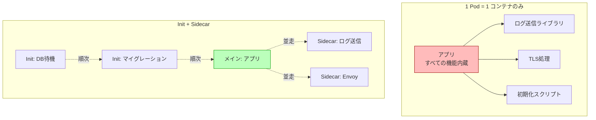

---

## 歴史: Init Container と Sidecar の進化

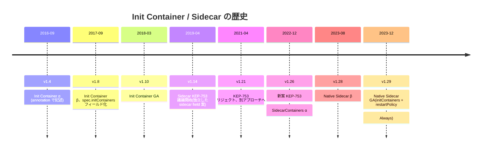

### Init Container 黎明期 — annotation で書いていた時代

v1.4(2016)で初登場した時、Init Container は **専用のフィールドではなく Pod の annotation** として書く仕様でした:

```yaml
metadata:
  annotations:
    pod.beta.kubernetes.io/init-containers: |
      [{"name": "init-myservice", "image": "busybox", ...}]
```

JSON 文字列を annotation に詰める異形仕様。あまりに不便で、v1.6 で `spec.initContainers` フィールドに昇格、v1.8 でフィールドのみに統一されました。

### Sidecar の議論 — 5年越しの結論

「Sidecar」という単語は K8s 黎明期から使われていましたが、**専用の API は長らく存在せず**、ユーザは `containers:` に並べて書くだけでした。これで実用的にはほぼ問題なかったので、**仕様化の優先度が低かった** のです。

ただ、Service Mesh(Istio、Linkerd)の普及でいくつかの問題が顕在化:

- **終了順問題** : Pod 終了時にメインより Sidecar が先に死ぬ → アプリのログ送信 / 通信が途切れる
- **Init 中問題** : Init Container 中に Sidecar(Envoy 等)を立ち上げたい → 当時の仕様では不可
- **Job 非互換** : Sidecar が終わらないと Job が「完了」にならない → 永久に走り続ける

KEP-753(Kubernetes Enhancement Proposal)で 2019 年から議論が始まり、紆余曲折を経て **2023 年に Native Sidecar として GA** しました。**「専用の sidecar フィールドは作らず、Init Container に restartPolicy: Always を許容する」** という最小変更の妙案で着地。

---

## Init Container

### 基本

Init Container は **メインコンテナの前に逐次実行される** 初期化用コンテナです。

```yaml
apiVersion: v1
kind: Pod
metadata:
  name: api
spec:
  initContainers:
  - name: wait-for-db
    image: busybox:1.36
    command: ['sh', '-c', 'until nc -z postgres 5432; do echo waiting; sleep 2; done']
  - name: db-migrate
    image: 192.168.56.10:5000/todo-api:0.1.0
    command: ['python', '-m', 'alembic', 'upgrade', 'head']
    envFrom:
    - secretRef:
        name: todo-secret
  containers:
  - name: api
    image: 192.168.56.10:5000/todo-api:0.1.0
    ports: [{ containerPort: 8000 }]
```

### 動作原理

1. Pod がスケジュールされる
2. **Init Container を上から順に1つずつ実行**
3. それぞれ **Succeeded で終わる**(exit 0)まで次に進まない
4. すべての Init が成功したら、`containers` を **並列で起動**
5. メインコンテナのライフサイクル開始

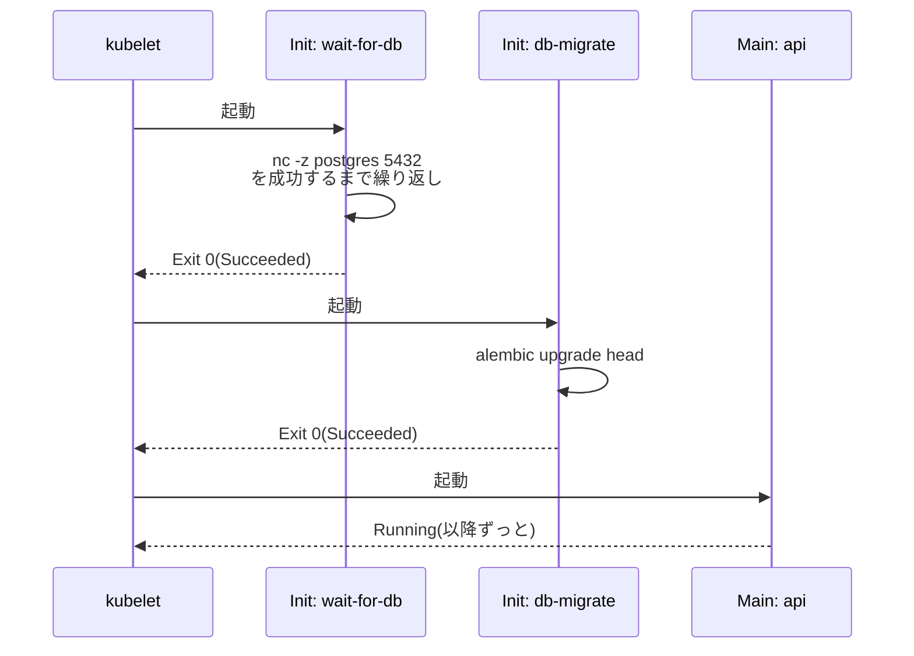

### Init Container の特徴

| 特徴 | 内容 |
|------|------|
| **逐次実行** | 上から順、前のが終わってから次 |
| **メイン起動を遅らせる** | 全 Init が成功するまでメインは起動しない |
| **失敗時の挙動** | `restartPolicy: Always` ならリスタート、それ以外なら Pod 自体を Failed にする |
| **リソース計算** | Pod の effective request = max(Init の最大 request, メインの合計 request) |
| **probe なし** | livenessProbe / readinessProbe / startupProbe は使えない |
| **Volumes 共有** | メインコンテナとボリュームを共有可能 |
| **lifecycle 限定** | preStop は使えない(短命なので) |

### 失敗したらどうなるか

`restartPolicy: Always`(Deployment などの既定):

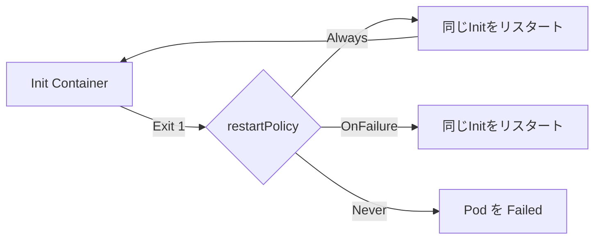

`restartPolicy: Always` だと **Init がコケるたびに同じ Init を再起動** します。アプリ起動の前に動くので、`CrashLoopBackOff` 表示は **`Init:CrashLoopBackOff`** になります。

```bash
$ kubectl get pod api
NAME   READY   STATUS                  RESTARTS   AGE
api    0/1     Init:CrashLoopBackOff   3          1m
```

`STATUS` 列が `Init:` で始まれば、Init Container でコケている合図。

### よくある Init Container の用途

#### 1. 依存サービスの待機

```yaml
- name: wait-for-postgres
  image: busybox:1.36
  command:
  - sh
  - -c
  - |
    until nc -z postgres.todo.svc.cluster.local 5432; do
      echo "Waiting for postgres..."
      sleep 2
    done
    echo "Postgres ready"
```

`busybox` の `nc -z` で TCP 接続を試行。応答があれば成功扱い。

DNSが解決できないと永遠に待つ(`getent hosts`)ので、最初に DNS チェックを入れる派もあります:

```yaml
command:
- sh
- -c
- |
  until getent hosts postgres.todo.svc.cluster.local; do
    sleep 2
  done
  until nc -z postgres.todo.svc.cluster.local 5432; do
    sleep 2
  done
```

#### 2. DB マイグレーション

```yaml
- name: db-migrate
  image: 192.168.56.10:5000/todo-api:0.1.0
  command: ["python", "-m", "alembic", "upgrade", "head"]
  envFrom:
  - secretRef: { name: todo-secret }
  - configMapRef: { name: todo-config }
```

注意点: **マイグレーションが冪等** であること。`replicas: 3` の Deployment で、3 つの Pod がほぼ同時に起動する場合、3 つの Init が **同時に**マイグレーションを走らせます。Alembic、Flyway などは **アドバイザリロック** を使うので2重実行を防げますが、自前スクリプトの場合は要注意。

代替案: **マイグレーションを別 Job として一度だけ走らせる**(本ページ末尾で議論)。

#### 3. 初期データ取得

```yaml
- name: clone-templates
  image: alpine/git:2.40
  command: ["git", "clone", "https://github.com/example/templates.git", "/work/templates"]
  volumeMounts:
  - name: workdir
    mountPath: /work
```

メインコンテナと共有する emptyDir に Git の中身を置く。

#### 4. 設定ファイル生成

Vault や AWS Secrets Manager から秘密情報を取って書き出す:

```yaml
- name: fetch-secrets
  image: vault:1.15
  env:
  - name: VAULT_ADDR
    value: https://vault.example.com
  command:
  - sh
  - -c
  - |
    vault kv get -format=json secret/myapp > /etc/myapp/config.json
  volumeMounts:
  - name: config
    mountPath: /etc/myapp
```

メインコンテナは `/etc/myapp/config.json` を読むだけ。

#### 5. パーミッション調整

ボリュームの所有者を直す:

```yaml
- name: chown-data
  image: busybox:1.36
  command: ["chown", "-R", "999:999", "/data"]
  securityContext:
    runAsUser: 0   # rootで動かす
  volumeMounts:
  - name: data
    mountPath: /data
```

ただし、これは古い書き方で、**`securityContext.fsGroup`** で代替できることが多いです。

### Init Container のリソース計算

Pod のリソース要求は次のように計算されます:

```
effective_request = max(
  全 Init Container の中で最大の request,
  全 main Container の合計 request
)
```

例:

```yaml
initContainers:
- { name: i1, resources: { requests: { cpu: 500m } } }
- { name: i2, resources: { requests: { cpu: 1000m } } }
containers:
- { name: c1, resources: { requests: { cpu: 200m } } }
- { name: c2, resources: { requests: { cpu: 300m } } }
```

- max init = 1000m
- sum main = 500m
- effective = max(1000m, 500m) = **1000m**

スケジューラはこの 1000m が空いているノードを探します。

### 既知の制限

- **probe なし** : Init Container には `readinessProbe` 等が使えない。終了コードで判定するしかない。
- **`lifecycle.preStop` なし** : 短命なので不要、と判断されている。
- **メインの環境変数を見られない** : Init は先に動くので、メインの env を引き継ぐわけではない。ただし `envFrom` で同じ ConfigMap/Secret を参照すれば共有できる。

---

## Sidecar コンテナ(従来型)

### 基本

「Sidecar」とは **Pod 内のメインコンテナの隣で常に動いている補助コンテナ** のことです。長らく Kubernetes には「Sidecar」専用フィールドはなく、`containers:` に並列に書く運用でした。

```yaml
apiVersion: v1
kind: Pod
metadata:
  name: app-with-sidecar
spec:
  containers:
  - name: app                 # メイン
    image: myapp:1.0
    volumeMounts:
    - name: logs
      mountPath: /var/log/app
  - name: log-shipper         # Sidecar(これも main と同列)
    image: fluent/fluent-bit:3.0
    volumeMounts:
    - name: logs
      mountPath: /var/log/app
      readOnly: true
  volumes:
  - name: logs
    emptyDir: {}
```

メインがログを `/var/log/app` に書き、Sidecar が同じディレクトリを読んで送出する典型パターン。

### 何が問題だったか

シンプルに見えますが、**3 つの構造的問題** がありました。

#### 問題 1: Pod 終了時の順序

`kubectl delete pod` した時、kubelet は **全コンテナに同時に SIGTERM を送る**:

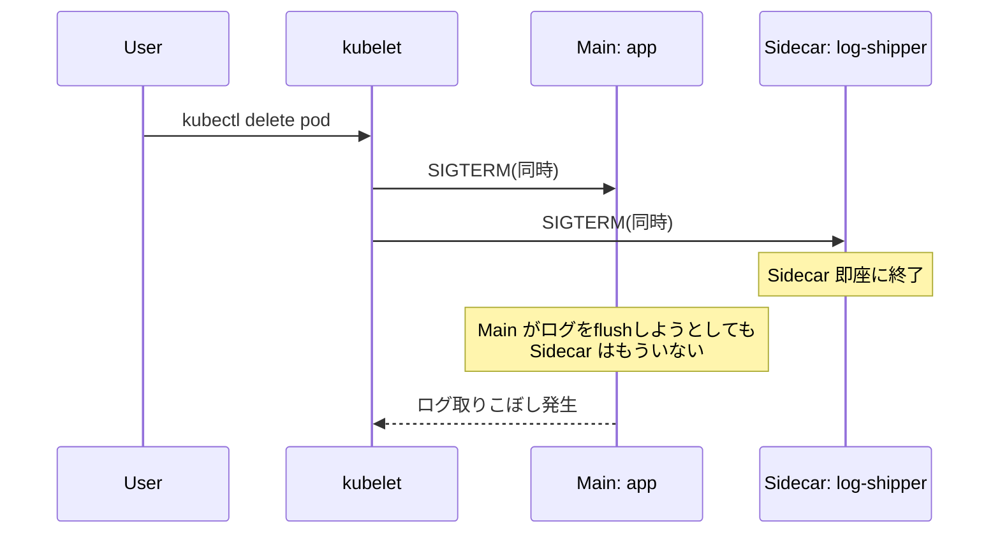

「メインが最後のログを送る前に Sidecar が死ぬ」「Sidecar が TLS 終端していたのに先に死んで通信エラー」という問題が頻発しました。

回避策(従来):

- メインコンテナの `preStop` で `sleep 30` してから自分を終わらせる
- Sidecar の `preStop` で「メインが死ぬまで待つ」スクリプト
- 個別に `terminationGracePeriodSeconds` を調整

どれも **本質的な解決ではない** ハック。

#### 問題 2: Init Container 中に Sidecar が動かない

Service Mesh(Istio sidecar = Envoy)を使うと、**Init Container 中の通信も Envoy 経由にしたい** ケースがあります。例えば:

- Init Container が外部 API を叩く
- そのトラフィックを Envoy の TLS で保護したい

しかし従来の Sidecar は `containers:` に書くため、**Init Container が動いている間はまだ起動していません**。Init は素のネットワークで動くしかない。

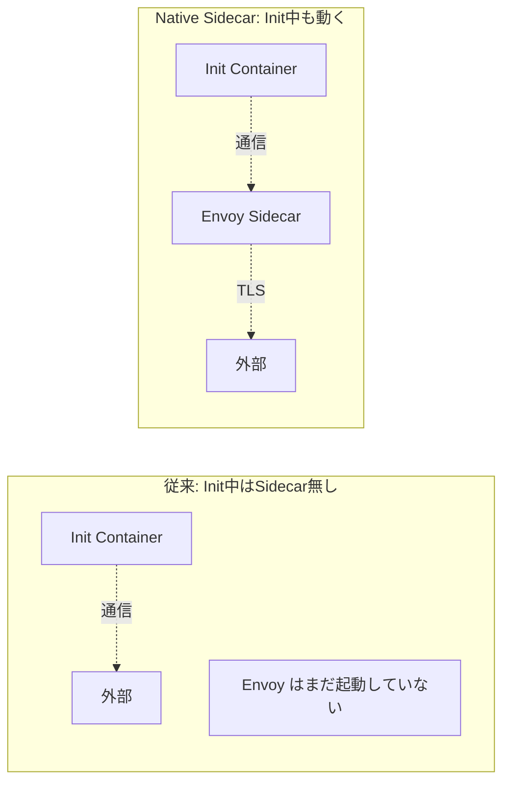

#### 問題 3: Job との非互換

Job は **「全コンテナが Succeeded」** で完了とみなしますが、Sidecar は **常駐型** なので終わりません。結果、Job が永遠に完了しない:

```bash
$ kubectl get job
NAME      COMPLETIONS   DURATION   AGE
mybatch   0/1           1h         1h
```

回避策(従来):

- メインが終わったら Sidecar に SIGTERM を送るスクリプト
- メインコンテナで `kubectl exec sidecar -- pkill ...`(怪しい)
- Sidecar をやめて Init で済ませる

これも **構造的な問題に対するハック**。

---

## Native Sidecar(v1.29+ GA)— 全部解決

### 基本: Init Container に `restartPolicy: Always`

v1.29 で GA した Native Sidecar の書き方は **驚くほどシンプル**。Init Container に `restartPolicy: Always` を付けるだけ。

```yaml
apiVersion: v1
kind: Pod
metadata:
  name: app-with-native-sidecar
spec:
  initContainers:
  - name: log-shipper           # ★ Init Container だが Sidecar
    image: fluent/fluent-bit:3.0
    restartPolicy: Always       # ★ これでSidecar扱いになる
    volumeMounts:
    - name: logs
      mountPath: /var/log/app
      readOnly: true
  containers:
  - name: app
    image: myapp:1.0
    volumeMounts:
    - name: logs
      mountPath: /var/log/app
  volumes:
  - name: logs
    emptyDir: {}
```

### 何が変わるか

`restartPolicy: Always` を付けた Init Container は:

- **起動順は他の Init Container と同じく順次**(`initContainers` の上から順)
- **`Ready` になるまで次の Init / メインは起動しない**
- **Pod の生存期間中ずっと動き続ける**(普通の Init は短命だが、これは違う)
- **コケたらリスタート**(Always なので)
- **Pod 終了時はメインの後で停止**(★ 終了順問題が解決)
- **Job では完了判定の対象外**(★ Job 互換性問題が解決)

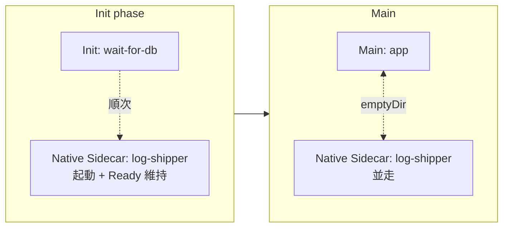

### 起動順の保証

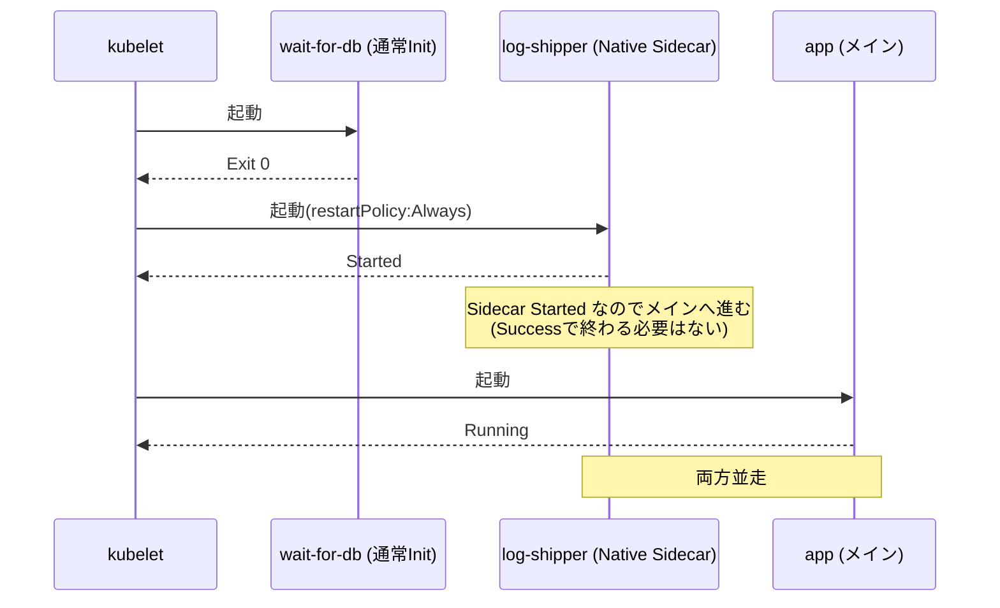

ポイント: 通常の Init は **Succeeded で終わるまで待つ** が、Native Sidecar は **起動した時点(Started)** で次に進みます。**Sidecar が「準備完了」になるまで待ちたい場合は startupProbe を使う**(後述)。

### 終了順の保証

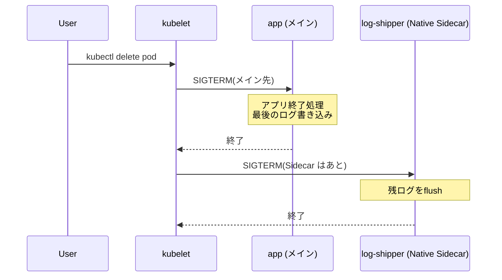

これで「メインのログ取りこぼし」が起きません。

### Job との両立

```yaml
apiVersion: batch/v1
kind: Job
metadata:
  name: batch-with-sidecar
spec:
  template:
    spec:
      restartPolicy: Never
      initContainers:
      - name: metrics-pusher
        image: prom/pushgateway-cli:1.0
        restartPolicy: Always       # Native Sidecar
        # ...
      containers:
      - name: batch
        image: my-batch:1.0
        command: ["./run.sh"]
```

メインの batch が終わると **Native Sidecar も自動的に止められ**、Job は `Succeeded` になります。従来の Sidecar では「Sidecar が終わらないので Job が完了しない」という問題があったのが、自然に解決。

---

## Native Sidecar の startupProbe

「Sidecar が **準備完了になってから** メインを起動したい」ケース:

```yaml
initContainers:
- name: envoy
  image: envoyproxy/envoy:v1.30
  restartPolicy: Always
  startupProbe:
    httpGet:
      path: /ready
      port: 15021
    failureThreshold: 30
    periodSeconds: 1
  ports:
  - containerPort: 15021
```

`startupProbe` が成功するまで **メインコンテナは起動しない** ので、Service Mesh のように「Sidecar が確実に動いてから」という要件に応えられます。

### 通常の Sidecar との比較

| 観点 | 従来Sidecar | Native Sidecar |
|------|-------------|----------------|
| 書き方 | `containers:` に並列 | `initContainers:` + `restartPolicy: Always` |
| 起動順 | メインと並列 | Init として順次、メインより前 |
| 終了順 | メインと同時(問題) | メインの後(正しい) |
| Init中の利用 | 不可(問題) | 可能 |
| Job 互換 | 不可(問題) | 可能 |
| K8s バージョン | すべて | v1.29+ |
| Probe | liveness/readinessOK | startup OK、liveness/readiness 制限あり |

---

## マルチコンテナ Pod の典型パターン

| パターン | 説明 | 例 |
|----------|------|------|
| **Init** | 起動前準備 | DB 待機、マイグレーション、設定生成 |
| **Sidecar** | メインを補助 | ログ転送、メトリクス公開、TLS終端 |
| **Ambassador** | 外部通信を代理 | Envoy で TLS、Cloud SQL Proxy |
| **Adapter** | 出力形式を変換 | アプリログを Prometheus 形式 metrics に |

### 1. Init パターン

「動く前に何かする」。これは前述の Init Container そのもの。

### 2. Sidecar パターン

「メインの隣で **メインを助ける**」。代表例:

- ログ転送(Fluent Bit、Vector、Promtail)
- メトリクス公開(Postgres Exporter、Redis Exporter)
- 設定リロード(`config-reloader`、`kubed`)


### 3. Ambassador パターン

「メインから **外への通信を代理する**」。メインから見ると localhost への接続だけ:

```yaml
initContainers:
- name: cloud-sql-proxy
  image: gcr.io/cloud-sql-connectors/cloud-sql-proxy:2.10
  restartPolicy: Always
  args:
  - "--private-ip"
  - "my-project:us-central1:my-db"
  ports:
  - containerPort: 5432
containers:
- name: app
  image: myapp:1.0
  env:
  - name: DB_HOST
    value: "127.0.0.1"      # localhost 経由で proxy にアクセス
  - name: DB_PORT
    value: "5432"
```

メリット:

- アプリは TLS 設定や認証を意識しなくていい
- 接続先変更は Ambassador だけ書き換えればいい
- 言語非依存

代表例: Cloud SQL Proxy、Envoy(クライアント側プロキシ)、Linkerd Proxy。

### 4. Adapter パターン

「メインの **出力形式を変換する**」。例えばアプリが独自形式のログを吐くが、Prometheus は Prom 形式 metrics しか食べない場合:

```yaml
containers:
- name: app
  image: legacy-app:1.0
  # /metrics には独自形式
- name: metrics-adapter
  image: prom/exporter-adapter:1.0
  ports:
  - { containerPort: 9100, name: metrics }
  # localhost:8080/legacy-metrics → Prom 形式に変換 → :9100/metrics
```

代表例: Prometheus Exporter 群(node_exporter以外の `mysqld_exporter`、`postgres_exporter` 等は実は Adapter)。

### Ambassador と Sidecar の違い

混乱しがちですが、**通信の向きで区別**:

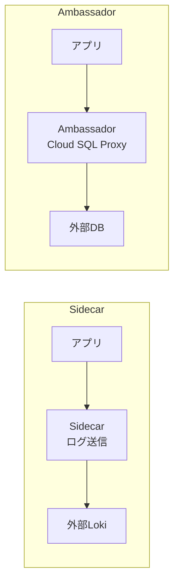

両方「外部に出る」ですが、Sidecar は **アプリの出力を加工して送る**、Ambassador は **アプリが直接接続する代わりに代理する**。境界は曖昧で、Envoy はどちらの役割もこなします。

### Adapter と Sidecar の違い

Sidecar は **同じデータを別の所に流す**、Adapter は **データの形式を変換する**。これも明確には分けにくく、用語の整理として捉えるのが良い。

---

## ハンズオン1: ミニTODO API に Init Container を追加

ミニTODOサービスの API Pod に、起動前の DB 待機とマイグレーションを追加します。

### YAML

```yaml
apiVersion: apps/v1
kind: Deployment
metadata:
  name: todo-api
  namespace: todo
  labels:
    app.kubernetes.io/name: todo-api
    app.kubernetes.io/part-of: todo
spec:
  replicas: 2
  selector:
    matchLabels:
      app.kubernetes.io/name: todo-api
  template:
    metadata:
      labels:
        app.kubernetes.io/name: todo-api
        app.kubernetes.io/part-of: todo
    spec:
      initContainers:
      # 1. DB が立つまで待つ
      - name: wait-for-db
        image: busybox:1.36
        command:
        - sh
        - -c
        - |
          echo "Waiting for postgres..."
          until nc -z postgres.todo.svc.cluster.local 5432; do
            sleep 2
          done
          echo "Postgres is up"
      # 2. DB マイグレーション
      - name: db-migrate
        image: 192.168.56.10:5000/todo-api:0.1.0
        command: ["python", "-m", "alembic", "upgrade", "head"]
        env:
        - name: DB_HOST
          value: postgres.todo.svc.cluster.local
        - name: DB_USER
          value: todo
        - name: DB_PASS
          valueFrom:
            secretKeyRef:
              name: postgres-secret
              key: password
        - name: DB_NAME
          value: todo
      containers:
      - name: api
        image: 192.168.56.10:5000/todo-api:0.1.0
        ports:
        - containerPort: 8000
        env:
        - name: DB_HOST
          value: postgres.todo.svc.cluster.local
        - name: DB_USER
          value: todo
        - name: DB_PASS
          valueFrom:
            secretKeyRef:
              name: postgres-secret
              key: password
        - name: DB_NAME
          value: todo
        readinessProbe:
          httpGet:
            path: /healthz
            port: 8000
          periodSeconds: 5
        livenessProbe:
          httpGet:
            path: /healthz
            port: 8000
          periodSeconds: 10
          initialDelaySeconds: 30
        resources:
          requests: { cpu: 100m, memory: 128Mi }
          limits: { cpu: 500m, memory: 512Mi }
```

### apply して観察

```bash
kubectl apply -f todo-api.yaml
kubectl get pod -n todo -l app.kubernetes.io/name=todo-api -w
```

**期待される出力(時系列)**:

```
NAME                       READY   STATUS                  RESTARTS   AGE
todo-api-7c5d9b8f4d-aaaaa  0/1     Init:0/2                0          0s
todo-api-7c5d9b8f4d-aaaaa  0/1     Init:1/2                0          5s
todo-api-7c5d9b8f4d-aaaaa  0/1     PodInitializing         0          10s
todo-api-7c5d9b8f4d-aaaaa  0/1     Running                 0          12s
todo-api-7c5d9b8f4d-aaaaa  1/1     Running                 0          20s
```

`STATUS` 列の `Init:0/2 → Init:1/2 → PodInitializing → Running` の遷移に注目:

- `Init:0/2` : Init Container 1 個目(wait-for-db)を実行中
- `Init:1/2` : 1 個目が完了、2 個目(db-migrate)を実行中
- `PodInitializing` : Init 完了、メインコンテナを起動中
- `Running` : メインコンテナが動き出した
- `1/1` : `readinessProbe` 通過

### Init Container のログを見る

```bash
kubectl logs -n todo todo-api-7c5d9b8f4d-aaaaa -c wait-for-db
kubectl logs -n todo todo-api-7c5d9b8f4d-aaaaa -c db-migrate
```

`-c <container>` で **コンテナ指定**。Init Container も同じフラグでログが見られる(完了済み Init のログも残っている)。

**期待される出力**:

```
$ kubectl logs ... -c wait-for-db
Waiting for postgres...
Postgres is up

$ kubectl logs ... -c db-migrate
INFO  [alembic.runtime.migration] Context impl PostgresqlImpl.
INFO  [alembic.runtime.migration] Will assume transactional DDL.
INFO  [alembic.runtime.migration] Running upgrade  -> abc123, create todos table
```

### マイグレーションの罠を体験する

`replicas: 2` なので、2 つの Pod が **ほぼ同時にマイグレーションを試みる**。Alembic はアドバイザリロックで保護されるので大丈夫ですが、自前スクリプトだと壊れます。

代替案: マイグレーションを **別 Job** として一度だけ走らせる。

```yaml
apiVersion: batch/v1
kind: Job
metadata:
  name: todo-api-migrate
  namespace: todo
spec:
  ttlSecondsAfterFinished: 600
  template:
    spec:
      restartPolicy: OnFailure
      initContainers:
      - name: wait-for-db
        image: busybox:1.36
        command: ['sh', '-c', 'until nc -z postgres 5432; do sleep 2; done']
      containers:
      - name: migrate
        image: 192.168.56.10:5000/todo-api:0.1.0
        command: ["python", "-m", "alembic", "upgrade", "head"]
        envFrom:
        - secretRef: { name: todo-secret }
        - configMapRef: { name: todo-config }
```

CIから`kubectl apply`し、Job が完了したら Deployment を `kubectl rollout restart` するパイプラインに。

#### Init での migration vs Job での migration

| 観点 | Init Container | 別Job |
|------|---------------|-------|
| 順序保証 | Pod 起動前に確実 | Job 後に Deployment を更新 |
| 並列実行 | replicas 数だけ走る(ロック必要) | 1度だけ |
| デプロイの単純さ | 1ファイル | Job + Deployment の2手 |
| Pod 起動時間 | Init 分遅延 | 不変 |
| アプリ単体起動 | Init で自動マイグレ | DBスキーマ古いまま起動失敗 |

**チームの好み次第**ですが、本番では「アプリの起動と DB マイグレーションを分けて、明示的に CI/CD パイプラインで制御する」のが堅いです。

---

## ハンズオン2: Native Sidecar で log-shipper を追加

API Pod のログを別所に送る Native Sidecar を追加します。

```yaml
apiVersion: apps/v1
kind: Deployment
metadata:
  name: todo-api
  namespace: todo
spec:
  replicas: 2
  selector:
    matchLabels:
      app.kubernetes.io/name: todo-api
  template:
    metadata:
      labels:
        app.kubernetes.io/name: todo-api
    spec:
      initContainers:
      # 通常の Init
      - name: wait-for-db
        image: busybox:1.36
        command: ['sh', '-c', 'until nc -z postgres 5432; do sleep 2; done']
      # Native Sidecar
      - name: log-shipper
        image: fluent/fluent-bit:3.1.7
        restartPolicy: Always       # ★ これでSidecar
        volumeMounts:
        - name: applogs
          mountPath: /var/log/app
          readOnly: true
        - name: flb-config
          mountPath: /fluent-bit/etc
        startupProbe:
          httpGet:
            path: /api/v1/health
            port: 2020
          failureThreshold: 30
          periodSeconds: 1
      containers:
      - name: api
        image: 192.168.56.10:5000/todo-api:0.1.0
        ports:
        - containerPort: 8000
        env:
        - name: LOG_FILE
          value: /var/log/app/api.log
        volumeMounts:
        - name: applogs
          mountPath: /var/log/app
      volumes:
      - name: applogs
        emptyDir: {}
      - name: flb-config
        configMap:
          name: api-flb-config
```

### 起動時の遷移

```bash
kubectl get pod -n todo -l app.kubernetes.io/name=todo-api -w
```

```
todo-api-xxx   0/1   Init:0/2          0   0s   # wait-for-db 実行中
todo-api-xxx   0/1   Init:1/2          0   5s   # wait-for-db 完了、log-shipper 起動
todo-api-xxx   0/1   PodInitializing   0   8s   # log-shipper の startupProbe 通過、メイン起動中
todo-api-xxx   1/2   Running           0   10s  # メイン起動、Sidecar も動作中
todo-api-xxx   2/2   Running           0   15s  # 両方Ready
```

`READY` 列が `2/2` になる(Sidecar も `Ready` 扱い)のが Native Sidecar の特徴。

### 終了時の挙動

```bash
kubectl delete pod -n todo todo-api-xxx
```

メインコンテナ → Native Sidecar の順に SIGTERM が送られます。`terminationGracePeriodSeconds` の間に両方終わる必要がある。

---

## トラブルシューティング

### 切り分けフローチャート

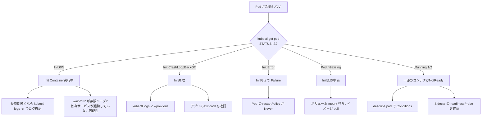

### よくあるエラー集

#### 症状1: `Init:0/2` のまま進まない

```bash
$ kubectl get pod
NAME       READY   STATUS     RESTARTS   AGE
api-xxx    0/1     Init:0/2   0          5m
```

5 分経過しても 1 つ目の Init が終わっていない。

```bash
$ kubectl logs api-xxx -c wait-for-db
Waiting for postgres...
Waiting for postgres...
Waiting for postgres...
...
```

postgres に接続できていない。原因候補:

- Service `postgres` が存在しない
- Service の Selector が Pod のラベルと不一致
- Pod は立っているが ポート 5432 で listen していない
- NetworkPolicy で遮断

調査:

```bash
# Service確認
kubectl get svc -n todo postgres
kubectl get endpoints -n todo postgres

# Pod 確認
kubectl get pods -n todo -l app.kubernetes.io/name=postgres

# 内部からテスト
kubectl run -n todo dnsdebug --rm -it --image=busybox:1.36 --restart=Never -- \
  nc -zv postgres.todo.svc.cluster.local 5432
```

#### 症状2: `Init:CrashLoopBackOff`

```bash
$ kubectl get pod
NAME       READY   STATUS                  RESTARTS   AGE
api-xxx    0/1     Init:CrashLoopBackOff   3          2m
```

```bash
$ kubectl logs api-xxx -c db-migrate --previous
Traceback (most recent call last):
  ...
sqlalchemy.exc.ProgrammingError: ...
```

Init Container がコケて、`restartPolicy: Always` で再起動を繰り返している状態。**`--previous`** で前回起動分のログ。

#### 症状3: Native Sidecar 利用で v1.28 以前のクラスタ

`restartPolicy: Always` を Init Container に書いたが、メインが起動しない。

```bash
$ kubectl get pod
NAME    READY   STATUS    RESTARTS   AGE
api     0/2     Init:1/2  0          5m
```

`SidecarContainers` Feature Gate が α(v1.28 以前)で、デフォルトでは無効。

確認:

```bash
kubectl get nodes -o jsonpath='{.items[0].status.nodeInfo.kubeletVersion}'
```

**対処**: クラスタを v1.29 以降にアップグレード。本教材の v1.30 環境では問題なし。

#### 症状4: Init で migrate が複数 Pod から同時実行されて競合

```
ERROR  alembic.runtime.migration  Can't acquire migration lock
```

`replicas: 2` で 2 つのPod が同時にマイグレーション開始した。

**対処**:

- マイグレを **Job** に切り出す
- migration ツールの自動ロック機能(Alembic、Flyway はある)
- 最初の 1 Pod だけ migrate する仕組み(`statefulset-0` のみ実行する条件分岐など)

#### 症状5: `terminationGracePeriodSeconds` が短すぎる

メインがログをflushしている最中に強制終了:

```yaml
spec:
  terminationGracePeriodSeconds: 30   # 既定
```

メインが「flush に 60 秒かかる」場合、30 秒で SIGKILL されてしまいます。

**対処**:

```yaml
spec:
  terminationGracePeriodSeconds: 90
```

#### 症状6: Sidecar が `liveness probe` で勝手にリスタートされる

従来の Sidecar(containers: 並列)に厳しい livenessProbe を入れると、メインが影響を受けるリスク。Native Sidecar(initContainers + restartPolicy:Always)では、liveness で死んでも影響はメインの再起動には繋がりませんが、**起動順が再度始まるかどうか** など細かい挙動の確認は必須。

---

## デバッグのチェックリスト

- [ ] `kubectl get pod` の `STATUS` 列(`Init:N/M`、`Init:CrashLoopBackOff`、`PodInitializing`、`Running 1/2` など)
- [ ] `kubectl describe pod` の **Conditions** と **Events**
- [ ] `kubectl logs -c <container>` で個別のコンテナログ
- [ ] `kubectl logs -c <container> --previous` で前回起動分
- [ ] `kubectl exec -it <pod> -c <container> -- sh` で個別コンテナに入る
- [ ] Init Container のリソース計算(max init vs sum main)
- [ ] `terminationGracePeriodSeconds` が処理時間に十分か
- [ ] Native Sidecar の `restartPolicy: Always` が書いてあるか
- [ ] K8s クラスタが v1.29 以降か(Native Sidecar GA)

---

## 高度なトピック

### Sidecar Proxy / Service Mesh と Native Sidecar

Istio や Linkerd は Pod に Envoy / Linkerd-proxy を **mutating webhook で自動注入** します。歴史的には:

- **〜 2023** : `containers:` に並列で注入(従来 Sidecar)→ Init中の通信、Job 互換、終了順すべて問題
- **2023+** : Native Sidecar(initContainers + restartPolicy:Always)対応版が出てきている

Istio では `values.global.proxy.holdApplicationUntilProxyStarts: true` というハック(メイン起動を `postStart` で遅延)が長らく必要でしたが、Native Sidecar 対応で **不要** になりつつあります。

### emptyDir のサイズ制限

メインと Sidecar が `emptyDir: {}` でログ共有する場合、**ノードのディスクが圧迫される** リスク:

```yaml
volumes:
- name: logs
  emptyDir:
    sizeLimit: 1Gi    # 1GB上限。超えるとPodをEvict
    medium: Memory    # tmpfs(RAM)で速い、容量小
```

`medium: Memory` は **メモリで動く tmpfs** で I/O は速いが、容量はメモリ上限。

### Pod 内の同居が必要かの判断

Sidecar として **同 Pod 内に置くべきか、別 Deployment として横に置くべきか** の判断:

| 理由 | Pod内Sidecar | 別Deployment |
|------|-------------|--------------|
| 1 Pod 1 アプリの単位で配りたい | ◎ | △ |
| アプリと同じノードに置きたい | ◎ | △(podAffinity 必要) |
| ログを直接ファイル経由で読みたい | ◎ | △(ボリューム共有不可) |
| アプリと独立にスケール | × | ◎ |
| 依存性の分離 | × | ◎ |

Service Mesh のサイドカーは **アプリ Pod 単位で必要** なので Pod 内一択。一方、ログ集約は **ノードあたり 1 個で十分** なので DaemonSet が一般的(Sidecar との比較は `daemonset.md` 参照)。

---

## 主要な kubectl コマンド集

```bash
# 個別コンテナのログ
kubectl logs <pod> -c <container>
kubectl logs <pod> -c <container> --previous
kubectl logs <pod> -c <container> -f

# Init Container のログも同じフラグで見られる
kubectl logs <pod> -c wait-for-db
kubectl logs <pod> -c db-migrate

# 個別コンテナへの exec
kubectl exec -it <pod> -c <container> -- bash
kubectl exec -it <pod> -c log-shipper -- /bin/sh

# Pod の詳細(Init / Sidecar の状態)
kubectl describe pod <pod>
kubectl get pod <pod> -o jsonpath='{.status.initContainerStatuses[*].name}'
kubectl get pod <pod> -o jsonpath='{.status.containerStatuses[*].name}'

# Init Container の終了コード確認
kubectl get pod <pod> -o jsonpath='{.status.initContainerStatuses[*].state.terminated.exitCode}'

# Pod 削除と再起動の確認
kubectl delete pod <pod>
kubectl rollout restart deployment/<name>
```

各コマンド解説:

- `-c <container>` : Pod に複数コンテナがある場合、対象を指定。指定しないと最初のコンテナか、`spec.containers[0].name` がデフォルト。
- `--previous` : 前回起動の終了したコンテナのログ。CrashLoopBackOff のデバッグ必須。
- `-o jsonpath='{...}'` : 構造化されたフィールドを抜き出す。Init の状態を一覧したい時に。

---

## まとめ: Init / Sidecar チートシート

```yaml
# 通常の Init Container
spec:
  initContainers:
  - name: wait-for-x
    image: busybox:1.36
    command: ['sh', '-c', 'until nc -z service 5432; do sleep 2; done']
  - name: migrate
    image: myapp:1.0
    command: ['./migrate.sh']
  containers:
  - name: app
    image: myapp:1.0

---

# Native Sidecar (v1.29+)
spec:
  initContainers:
  - name: wait-for-x         # 通常Init
    image: busybox
    command: ['sh','-c','...']
  - name: log-shipper        # Native Sidecar
    image: fluent-bit:3.0
    restartPolicy: Always    # ★これでSidecar
    startupProbe:
      httpGet: { path: /, port: 2020 }
  containers:
  - name: app
    image: myapp:1.0
```

選択フロー:

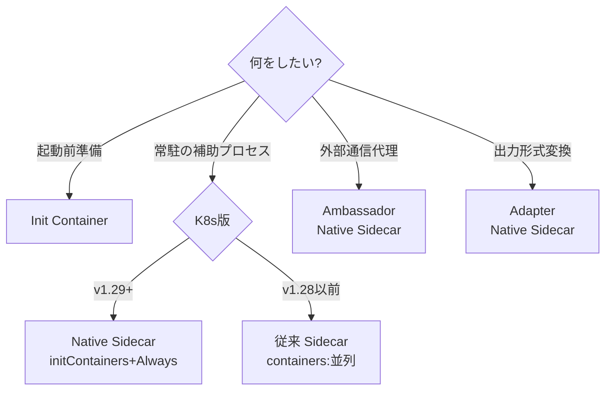

---

## チェックポイント

ここまでで以下を **自分の言葉で** 説明できるか確認してください。

- [ ] Init Container と Sidecar が必要となる、Pod 単一コンテナでは足りないシーンを 4 つ以上挙げられる
- [ ] Init Container の逐次実行・Pod ライフサイクルとの関係を、メインコンテナ起動までのタイムラインで説明できる
- [ ] Init Container のリソース計算式 `max(init), sum(main)` を例示できる
- [ ] 従来の Sidecar が抱えていた 3 つの構造的問題(終了順、Init中、Job非互換)をそれぞれ説明できる
- [ ] Native Sidecar の書き方(`initContainers` + `restartPolicy: Always`)とその効果を説明できる
- [ ] マルチコンテナ Pod の 4 つの典型パターン(Init/Sidecar/Ambassador/Adapter)を区別して例示できる
- [ ] DB マイグレーションを Init Container と別 Job のどちらでやるかの選定基準を説明できる
- [ ] Native Sidecar の startupProbe が「Sidecarが準備完了になってからメイン起動」を保証する仕組みを説明できる
- [ ] `Init:0/2`、`Init:CrashLoopBackOff`、`PodInitializing` の各状態の意味と次にすべき調査を述べられる
- [ ] サンプルアプリの API Pod に Init(DB待機+migration)と Native Sidecar(log-shipper)を入れた YAML が書ける

---

## 章のまとめ

第03章を完走しました。本章で学んだことを整理します:

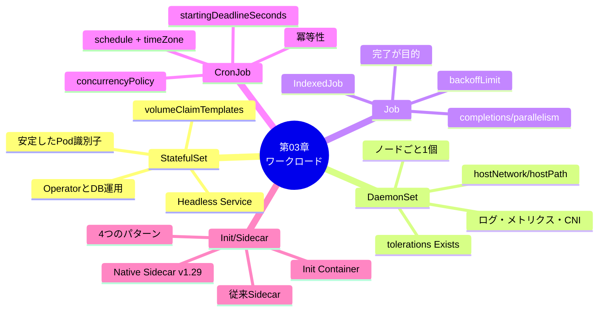

これでサンプルアプリ ミニTODOサービス の各コンポーネントを **適切なワークロードで設計・構築・運用** する準備ができました。次の章では Service / Ingress を扱い、これらのワークロードを **外部からアクセス可能** にしていきます。

---

→ 次は [04. Service と Ingress]({{ '/04-service-ingress/' | relative_url }})
