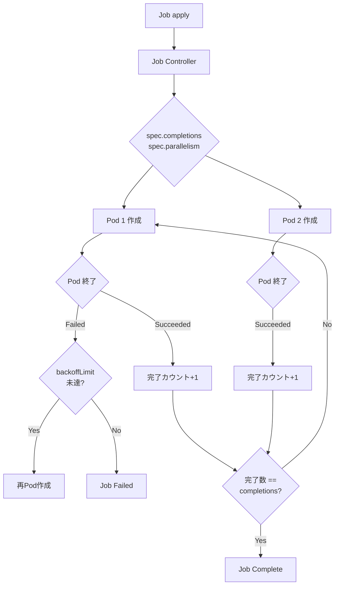
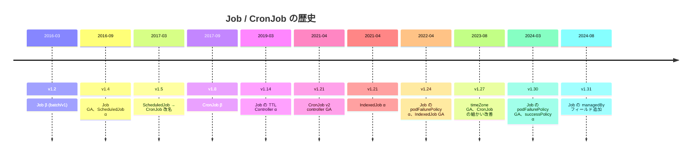
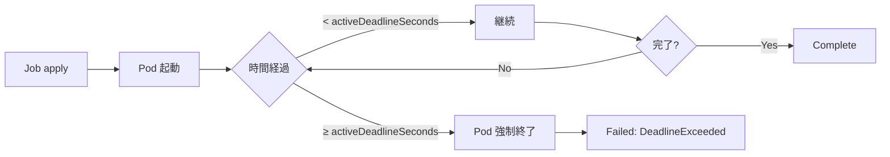
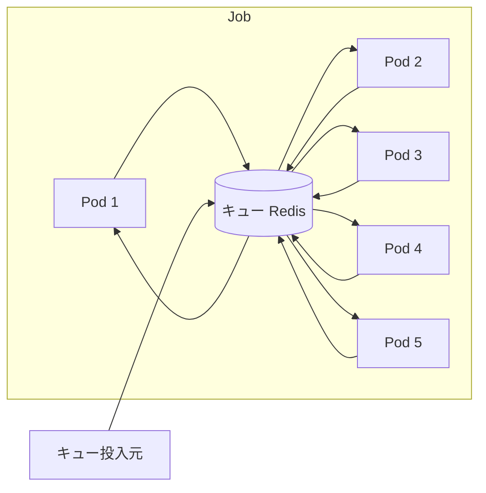
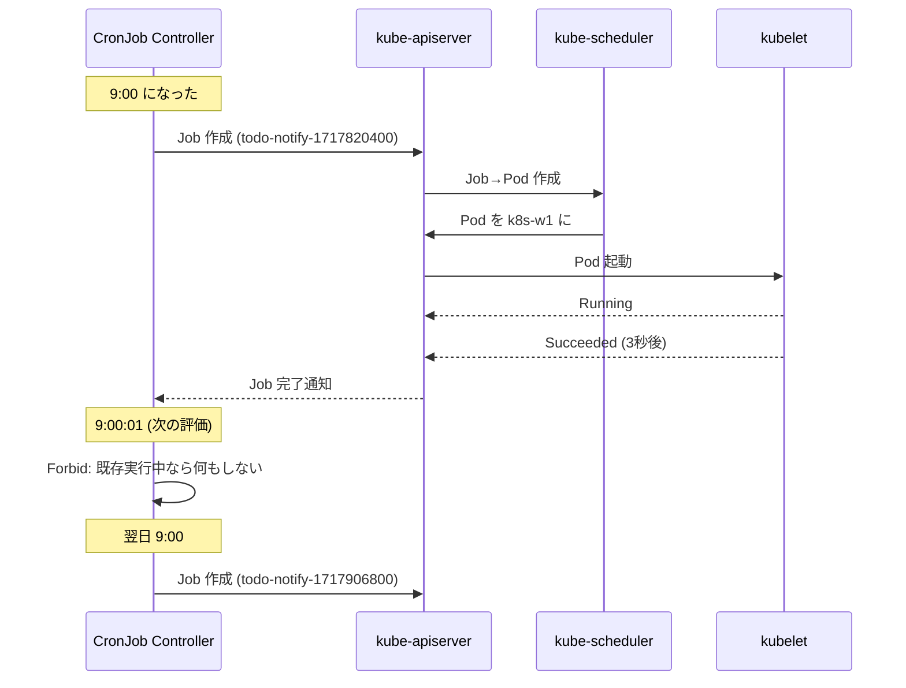
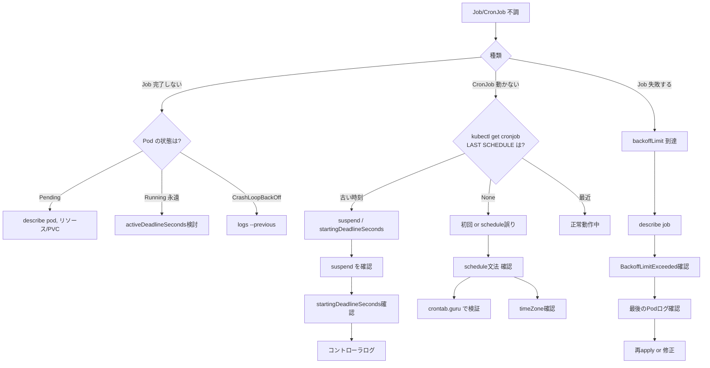
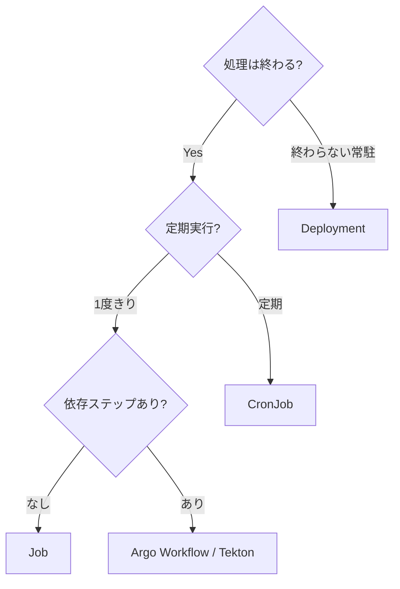

# Job と CronJob
{: .no_toc }

## 目次
{: .no_toc .text-delta }

1. TOC
{:toc}

---

## このページのゴール

このページを読み終えると、以下を **自分の言葉で説明できる** ようになります。

- Job が **何のために生まれた** のか、Deployment や Pod 直接実行では何が困るのかを説明できる
- `completions`、`parallelism`、`backoffLimit`、`activeDeadlineSeconds`、`ttlSecondsAfterFinished` の **意味と使い分け** を説明できる
- Job の 3 つの並列実行パターン(単発、固定 N 並列、ワークキュー型)を、選定基準とともに挙げられる
- `restartPolicy` の `OnFailure` と `Never` の違いを、Pod が再作成されるかコンテナが再起動するかという観点で説明できる
- CronJob の `schedule`、`timeZone`、`concurrencyPolicy`、`startingDeadlineSeconds` の意味と、本番運用での推奨値を説明できる
- バッチ処理の **冪等性** がなぜ重要か、それを実装する3つの典型パターンを挙げられる
- Job 関連のトラブル(完了しない、`BackoffLimitExceeded`、CronJob がスケジュールされない、二重起動)を **切り分けて原因に到達** できる
- ミニTODOサービスの通知バッチを **CronJob として本番運用** できる(冪等性、タイムアウト、アラート)

---

## なぜ Job が必要か — Deployment や Pod 直接実行では何が困るのか

### 「終わるべきプロセス」をどう管理するか

Kubernetes の最初期、ユーザは Pod を直接 apply していました。バッチ処理を Pod で動かすと、こういう問題が起きます:

1. **Pod が `Succeeded` で終わっても、誰もそれを知らない**
2. **失敗したらどうリトライするか?**
3. **複数並列で動かすには?**
4. **完了済 Pod のクリーンアップは?**

Pod の `restartPolicy` は `Always` / `OnFailure` / `Never` の 3 つで、`Always` は終わらない前提、`OnFailure` は同じコンテナをそのままリスタート、`Never` はコケたまま放置、です。これでは「**バッチ処理を確実に N 回完了させる**」という要件が満たせません。

### Deployment ではダメな理由

Deployment は `replicas` の数だけ常時 Pod を動かす想定。Pod が `Succeeded` で終わると Deployment は **「あ、ダウンした」と勘違いして再起動** します。バッチ処理にはまったく不向き。

```mermaid
flowchart LR
    subgraph Wrong[Deployment でバッチを動かす(誤)]
        D[Deployment replicas:1] --> P1[Pod]
        P1 --> S[Succeeded]
        S --> R[Deployment が再起動]
        R --> P2[Pod]
        P2 --> S2[Succeeded]
        S2 --> RR[再起動...]
    end
```

無限再起動になります。

### Pod 直接ではダメな理由

`kind: Pod` を `restartPolicy: OnFailure` で apply すると、コンテナがコケた時に **同じノードでコンテナが再起動**します。が:

- **ノード障害で Pod が消えたら、再作成は誰もしてくれない**
- **N 個並列実行したい場合、N 個 apply する必要がある**
- **「3回試して諦める」のような方針が書けない**

### Job が解決すること

Job は次の責務を引き受けるコントローラです:

| 責務 | 内容 |
|------|------|
| **完了の判定** | Pod が `Succeeded` で終わったかを追跡 |
| **再試行** | 失敗時に `backoffLimit` 回まで再Pod作成 |
| **並列制御** | `parallelism` で複数 Pod 並列実行 |
| **完了数の維持** | `completions` で「N 回完了するまで続ける」 |
| **クリーンアップ** | `ttlSecondsAfterFinished` で完了後自動削除 |
| **タイムアウト** | `activeDeadlineSeconds` で打ち切り |



---

## 歴史: Job / CronJob API の進化



### CronJob v2 controller(v1.21 GA)

CronJob は **長らく不安定** で、本番投入を渋るチームが多くありました。問題:

- 古い `cronjob_controller.go` は **1秒ごとに全 CronJob をリスト** していて、CronJob が増えると遅延
- `startingDeadlineSeconds` の挙動が直感に反する
- ジョブの取りこぼし(missed run)が発生

v1.21 で CronJob は **完全に書き直された v2 コントローラ** に置き換わり GA。**informer ベースで効率的**、`startingDeadlineSeconds` の挙動も明確化。

### IndexedJob(v1.21 α、v1.24 GA)

並列 Job で、各 Pod に **一意のインデックス番号** を割り当てる仕組み。`completions: 10` で `parallelism: 5` のとき、Pod に `JOB_COMPLETION_INDEX` 環境変数が `0`〜`9` で渡され、各 Pod は自分の担当部分だけを処理できます。

これがない時代は、外部キュー(Redis、SQS) を使うのが一般的でした。

---

## Job の基本

### YAML

最もシンプルな Job:

```yaml
apiVersion: batch/v1
kind: Job
metadata:
  name: pi
  namespace: default
spec:
  completions: 1
  parallelism: 1
  backoffLimit: 4
  activeDeadlineSeconds: 600
  ttlSecondsAfterFinished: 3600
  template:
    spec:
      restartPolicy: OnFailure
      containers:
      - name: pi
        image: perl:5.34
        command: ["perl", "-Mbignum=bpi", "-wle", "print bpi(2000)"]
        resources:
          requests: { cpu: 100m, memory: 128Mi }
          limits: { cpu: 500m, memory: 256Mi }
```

### フィールドの意味

| フィールド | 既定値 | 意味 |
|-----------|--------|------|
| `spec.completions` | 1 | 完了させるべき Pod の数 |
| `spec.parallelism` | 1 | 同時に走る Pod の数 |
| `spec.backoffLimit` | 6 | リトライ上限。超えると Failed |
| `spec.activeDeadlineSeconds` | (なし) | Job 全体の制限時間 |
| `spec.ttlSecondsAfterFinished` | (なし) | 完了後この秒数で自動削除 |
| `spec.template.spec.restartPolicy` | (必須) | OnFailure か Never |
| `spec.completionMode` | NonIndexed | Indexed にすると IndexedJob |
| `spec.suspend` | false | true で Pod 起動を一時停止 |
| `spec.podFailurePolicy` | (なし) | 終了コードに応じた制御(v1.30+ GA) |

### `restartPolicy` の違い: OnFailure と Never

これが最も混乱しやすい部分です。

| restartPolicy | コンテナがコケた時 | Pod の数 |
|---------------|-------------------|---------|
| `OnFailure` | **同じ Pod 内で kubelet がコンテナを再起動** | Pod は1つ |
| `Never` | Pod は Failed 状態に。Job コントローラが **新しい Pod を作る** | 失敗するたびに Pod が増える |

`OnFailure` は **同じノードでさっさと再試行**、`Never` は **新しい Pod として再試行**。新ノードを使いたい(前のノードが何か壊れているかも)場合は `Never`。

#### 観察してみる

`OnFailure` の場合:

```bash
$ kubectl get pods
NAME       READY   STATUS    RESTARTS   AGE
pi-xxxxx   0/1     Pending   3          30s
```

`RESTARTS` 列がカウントされる。**Pod は1つだけ**。

`Never` の場合:

```bash
$ kubectl get pods
NAME       READY   STATUS    RESTARTS   AGE
pi-xxxxx   0/1     Error     0          30s
pi-yyyyy   0/1     Error     0          20s
pi-zzzzz   1/1     Running   0          5s
```

**失敗するたびに新しい Pod が増える**。`backoffLimit` でカウントされるのは Pod の数。

### `backoffLimit`

リトライ上限。**`OnFailure` のリスタートと、`Never` の Pod 再作成、両方を合算してカウント** されます。

```yaml
spec:
  backoffLimit: 4   # 既定 6
```

リトライ間隔は **指数バックオフ**(10秒 → 20秒 → 40秒 → ...、最大6分)。すぐ再試行ではない点に注意。

### `activeDeadlineSeconds`

Job 全体の制限時間。

```yaml
spec:
  activeDeadlineSeconds: 600   # 10分
```

10分経過すると、まだ走っている Pod は **強制終了** され、Job は `Failed` にマークされます。

無限ループに陥った時の **暴走防止** として、本番のバッチ処理には必ず入れるべきフィールドです。



### `ttlSecondsAfterFinished`

Job が **完了 or 失敗** してから、この秒数経過で **Job と Pod が自動削除** されます。

```yaml
spec:
  ttlSecondsAfterFinished: 3600   # 1時間
```

入れないと Job がずっと残り、CronJob で毎日走らせるとオブジェクトが溜まり続けます(古い Job は historyLimit で消されますが、それは CronJob 配下のみ)。

### `podFailurePolicy`(v1.30 GA)

「**特定の終了コードでは即時失敗にする**」「**特定のコンテナの終了コードは無視する**」といった細かい制御。

```yaml
spec:
  backoffLimit: 6
  podFailurePolicy:
    rules:
    - action: FailJob
      onExitCodes:
        operator: In
        values: [42]                # exit code 42 なら即 Job 失敗(リトライしない)
    - action: Ignore                # exit code 0 で出ても無視(他のコンテナ次第)
      onPodConditions:
      - type: DisruptionTarget      # ノードの Eviction だった場合
```

これがない頃は、「ノードのEvictionで一時的に Pod が失敗した」ケースでも `backoffLimit` が消費されてしまい、すぐに Job 失敗になる問題がありました。

---

## 並列実行パターン

Job の `completions` と `parallelism` の組み合わせで、**3 つの典型パターン** が表現できます。

### パターン 1: 単発実行(N=1)

```yaml
spec:
  completions: 1
  parallelism: 1
```

普通の「1度だけ走らせる」バッチ。マイグレーション、レポート生成など。

### パターン 2: 固定数並列(N=10、並列度5)

```yaml
spec:
  completions: 10
  parallelism: 5
```

「10個の作業をやる、同時に5個まで」。各 Pod は **同じコマンドを実行** するので、Pod が「自分は何番目か」を知る必要があります。**IndexedJob** が便利。

### パターン 3: ワークキュー型

```yaml
spec:
  completions: null     # 指定しない
  parallelism: 5
```

`parallelism: 5` だけ。Pod は **外部キュー(Redis、RabbitMQ、SQS) からタスクを取る** モデル。キューが空になったら Pod は `Succeeded` で終了し、Job 全体が完了。



#### キューが空になったらどう判定?

各 Pod が「キューが空 → Succeeded で終わる」というロジックを持つ必要があります。すべての Pod が `Succeeded` で終わると、Job 全体が完了。

### パターン 2 と 3 の比較

| 観点 | 固定 completions | ワークキュー |
|------|-----------------|--------------|
| 作業数の事前判定 | 必要(N 個と分かっている) | 不要 |
| 作業の再分配 | 不可(各 Pod が独立に処理) | 可能(キューから取る) |
| Pod 失敗時の再試行 | コントローラが再 Pod 作成 | 別 Pod がキューから取る |
| 実装の複雑さ | シンプル | キュー管理が必要 |
| 典型例 | 画像 100 枚を変換 | クローラ、メール送信 |

### IndexedJob

`completions: 10, parallelism: 5` で、各 Pod に **0〜9 の番号** を割り当てる:

```yaml
apiVersion: batch/v1
kind: Job
metadata:
  name: image-converter
spec:
  completions: 10
  parallelism: 5
  completionMode: Indexed       # ★ ここ
  template:
    spec:
      restartPolicy: Never
      containers:
      - name: converter
        image: my-converter:1.0
        command:
        - sh
        - -c
        - |
          # JOB_COMPLETION_INDEX が自動で渡される
          INDEX=$JOB_COMPLETION_INDEX
          echo "I am pod $INDEX"
          # /input/$INDEX.png を /output/ に書く、など
          process /input/$INDEX.png /output/$INDEX.png
```

これで **各 Pod は自分の番号を知る** ことができ、外部キューなしで作業分担が可能。**Pod 名にも `pod-name-{INDEX}-`** が含まれるため、トラブル時の追跡もしやすい。

---

## ハンズオン1: Pi を計算する単発 Job

```bash
cat <<EOF | kubectl apply -f -
apiVersion: batch/v1
kind: Job
metadata:
  name: pi
spec:
  completions: 1
  parallelism: 1
  backoffLimit: 2
  ttlSecondsAfterFinished: 600
  template:
    spec:
      restartPolicy: OnFailure
      containers:
      - name: pi
        image: perl:5.34
        command: ["perl", "-Mbignum=bpi", "-wle", "print bpi(2000)"]
EOF
```

### 進捗を観察

```bash
kubectl get job pi -w
```

**期待される出力(時系列)**:

```
NAME   COMPLETIONS   DURATION   AGE
pi     0/1           5s         5s
pi     0/1           15s        15s
pi     1/1           20s        20s
```

`COMPLETIONS` が `1/1` になれば成功。

### Pod とログ

```bash
kubectl get pods -l job-name=pi
kubectl logs -l job-name=pi
```

`-l job-name=pi` は、Job が自動で Pod に付ける `job-name=<job>` ラベルを使ったセレクタ。

**期待される出力(ログ)**:

```
3.14159265358979323846264338327950288419716939937510...
```

### 10分後

`ttlSecondsAfterFinished: 600` なので 10分後に Job が消えます。

```bash
$ kubectl get job pi
Error from server (NotFound): jobs.batch "pi" not found
```

---

## ハンズオン2: IndexedJob で並列処理

10 個の数の階乗を、5 並列で計算する例。

```yaml
apiVersion: batch/v1
kind: Job
metadata:
  name: factorial
spec:
  completions: 10
  parallelism: 5
  completionMode: Indexed
  backoffLimit: 0
  ttlSecondsAfterFinished: 600
  template:
    spec:
      restartPolicy: Never
      containers:
      - name: calc
        image: python:3.12-alpine
        command:
        - python
        - -c
        - |
          import os, math
          i = int(os.environ['JOB_COMPLETION_INDEX'])
          n = i + 1
          print(f"{n}! = {math.factorial(n)}")
```

apply して結果を見る:

```bash
kubectl apply -f factorial.yaml
sleep 30
kubectl get pods -l job-name=factorial
```

**期待される出力**:

```
NAME             READY   STATUS      RESTARTS   AGE
factorial-0-xxx  0/1     Completed   0          30s
factorial-1-xxx  0/1     Completed   0          30s
factorial-2-xxx  0/1     Completed   0          30s
...
factorial-9-xxx  0/1     Completed   0          30s
```

Pod 名に **`-0-`, `-1-`, ..., `-9-`** とインデックスが入っていることが確認できます。

```bash
kubectl logs factorial-3-xxx
```

```
4! = 24
```

`JOB_COMPLETION_INDEX=3` の Pod が `4!` を計算しています(0オリジンなので i+1)。

---

## CronJob

### 基本の YAML

ミニTODOサービスの「**期限切れタスクの通知バッチ**」を CronJob で書きます。

```yaml
apiVersion: batch/v1
kind: CronJob
metadata:
  name: todo-notify
  namespace: todo
  labels:
    app.kubernetes.io/name: todo-worker
    app.kubernetes.io/part-of: todo
spec:
  schedule: "0 9 * * *"
  timeZone: "Asia/Tokyo"             # v1.27+ GA
  concurrencyPolicy: Forbid
  startingDeadlineSeconds: 60
  successfulJobsHistoryLimit: 3
  failedJobsHistoryLimit: 1
  suspend: false
  jobTemplate:
    spec:
      backoffLimit: 2
      activeDeadlineSeconds: 300
      ttlSecondsAfterFinished: 86400
      template:
        spec:
          restartPolicy: OnFailure
          containers:
          - name: notify
            image: 192.168.56.10:5000/todo-worker:0.1.0
            command: ["python", "notify.py"]
            env:
            - name: TZ
              value: Asia/Tokyo
            envFrom:
            - configMapRef:
                name: todo-config
            - secretRef:
                name: todo-secret
            resources:
              requests: { cpu: 100m, memory: 128Mi }
              limits: { cpu: 500m, memory: 512Mi }
```

### `schedule` の文法

標準的な cron 式 5 フィールド:

```
分 時 日 月 曜日
```

| フィールド | 範囲 | 例 |
|-----------|------|------|
| 分 | 0-59 | `*/15` 15分ごと |
| 時 | 0-23 | `9` 9時 |
| 日 | 1-31 | `*` 毎日 |
| 月 | 1-12 | `*` 毎月 |
| 曜日 | 0-7(0,7=日) | `1-5` 平日 |

例:

| schedule | 意味 |
|----------|------|
| `0 9 * * *` | 毎日 9:00 |
| `*/5 * * * *` | 5分ごと |
| `0 0 1 * *` | 毎月1日 0:00 |
| `0 9 * * 1-5` | 平日 9:00 |
| `30 2 * * 0` | 日曜日 2:30 |

### `timeZone`

v1.27+ で **GA**。

```yaml
spec:
  schedule: "0 9 * * *"
  timeZone: "Asia/Tokyo"
```

`timeZone` を指定しないと **kube-controller-manager のホストタイムゾーン** を使う(普通は UTC)。指定すれば、その IANA タイムゾーン名で解釈されます。

{: .warning }
> 古い K8s(v1.26 以前)では `timeZone` がない、または α 機能。学習環境(v1.30)では問題なく使えますが、現場で古いクラスタを触るときは確認を。

### `concurrencyPolicy`

前回の Job がまだ走っている時、新しい時刻が来たらどうするか:

| 値 | 挙動 | 用途 |
|----|------|------|
| `Allow`(既定) | 新しい Job も起動(並走OK) | 並走しても問題ない処理 |
| `Forbid` | 新しい Job をスキップ | 二重起動が困る処理(DBに書き込むなど) |
| `Replace` | 古い Job を消して新しい Job を起動 | 最新だけ走ればよい処理 |

通知バッチ系なら `Forbid` が安全。

### `startingDeadlineSeconds`

スケジュール時刻に **何らかの理由で起動できなかった** とき(コントローラ停止、ノード障害)、**この秒数以内なら遅れて起動** する。

```yaml
spec:
  startingDeadlineSeconds: 60   # 60秒以内なら遅れて起動
```

`60` なら 9:00 にスケジュールされたものが 9:00:30 に「遅れて」気づいた場合は起動、9:01:30 に気づいた場合は **スキップ**(失敗ログには残る)。

`null`(指定なし)だと **無制限に追いつこうとして** miss が大量発生するケースがあります。本番では必ず設定。

#### 「100 missed start times」エラー

```
$ kubectl describe cronjob todo-notify
...
Events:
  Warning  TooManyMissedTimes  Cannot determine if job needs to be started. Too many missed start time (> 100). Set or decrease .spec.startingDeadlineSeconds or check clock skew.
```

`startingDeadlineSeconds` 未設定時にコントローラが過去 100 個の missed run を見つけたら、安全のため停止する仕様。

対処:

1. `startingDeadlineSeconds` を設定(短めに)
2. CronJob 自体の時計が大きくずれていないか確認
3. コントローラのログを見る

### `successfulJobsHistoryLimit` と `failedJobsHistoryLimit`

完了 / 失敗した Job を **何個保持するか**。古いものから自動削除。

```yaml
spec:
  successfulJobsHistoryLimit: 3
  failedJobsHistoryLimit: 1
```

成功は最新 3 件、失敗は最新 1 件まで残す、の意味。0 にすれば履歴を残さない(完了即削除)が、デバッグ性を考えると数件残すのが良い。

### `suspend`

```yaml
spec:
  suspend: true
```

`true` にすると **新規 Job を起動しなくなる**。メンテナンス中に一時停止する用途。すでに走っている Job は影響を受けない。

```bash
# 一時停止
kubectl patch cronjob -n todo todo-notify -p '{"spec":{"suspend":true}}'

# 解除
kubectl patch cronjob -n todo todo-notify -p '{"spec":{"suspend":false}}'
```

---

## CronJob のライフサイクル全体図



CronJob は **Job を作る親** であり、Pod を直接作るのは Job です。3 段階の構造を意識すると整理しやすい:


---

## ハンズオン3: ミニTODOの通知バッチを CronJob 化

### 1. notify.py(参考実装)

```python
# notify.py
import os, smtplib, psycopg2, sys
from datetime import datetime, timedelta
from email.message import EmailMessage

DB_HOST = os.environ.get("DB_HOST", "postgres.todo.svc.cluster.local")
DB_USER = os.environ.get("DB_USER", "todo")
DB_PASS = os.environ["DB_PASS"]
SMTP_HOST = os.environ.get("SMTP_HOST", "smtp.todo.svc.cluster.local")

def main():
    # 冪等性のため、本日分の通知済みフラグを見る
    conn = psycopg2.connect(host=DB_HOST, user=DB_USER, password=DB_PASS, database="todo")
    cur = conn.cursor()
    cur.execute("""
        SELECT t.id, t.title, t.user_email
        FROM todos t
        WHERE t.due_date = CURRENT_DATE
          AND t.notified_at IS NULL
          AND t.done = false
    """)
    rows = cur.fetchall()
    print(f"通知対象: {len(rows)}件", flush=True)
    
    for tid, title, email in rows:
        try:
            send_mail(email, title)
            cur.execute("UPDATE todos SET notified_at = NOW() WHERE id = %s", (tid,))
            conn.commit()
        except Exception as e:
            print(f"ERROR id={tid}: {e}", file=sys.stderr, flush=True)
            conn.rollback()
    
    cur.close()
    conn.close()
    print("完了", flush=True)

def send_mail(to, title):
    msg = EmailMessage()
    msg["Subject"] = f"本日期限のタスク: {title}"
    msg["From"] = "noreply@todo.example"
    msg["To"] = to
    msg.set_content(f"本日期限のタスクがあります: {title}")
    with smtplib.SMTP(SMTP_HOST) as s:
        s.send_message(msg)

if __name__ == "__main__":
    main()
```

ポイント: **`notified_at` カラムで「送信済み」を記録**。再実行されても2重送信しない(冪等性)。

### 2. ConfigMap と Secret

```bash
kubectl create configmap todo-config -n todo \
  --from-literal=DB_HOST=postgres.todo.svc.cluster.local \
  --from-literal=DB_USER=todo \
  --from-literal=SMTP_HOST=smtp.todo.svc.cluster.local

kubectl create secret generic todo-secret -n todo \
  --from-literal=DB_PASS=ChangeMe123!
```

### 3. CronJob を apply

(上で示した完全 YAML を `todo-notify-cron.yaml` として保存)

```bash
kubectl apply -f todo-notify-cron.yaml
```

### 4. 状態確認

```bash
kubectl get cronjob -n todo
```

**期待される出力**:

```
NAME          SCHEDULE     TIMEZONE     SUSPEND   ACTIVE   LAST SCHEDULE   AGE
todo-notify   0 9 * * *    Asia/Tokyo   False     0        <none>          1m
```

### 5. テスト実行(時刻を待たずに今すぐ走らせる)

```bash
# CronJob から手動で Job を作る
kubectl create job --from=cronjob/todo-notify -n todo todo-notify-manual-1
```

これで CronJob と同じ jobTemplate を使った Job が即時実行されます。

### 6. ログ確認

```bash
kubectl logs -n todo -l job-name=todo-notify-manual-1
```

**期待される出力**:

```
通知対象: 5件
完了
```

### 7. スケジュール実行を待つ

翌日 9:00 になると自動的に走ります。確認:

```bash
kubectl get jobs -n todo
```

**期待される出力**:

```
NAME                       COMPLETIONS   DURATION   AGE
todo-notify-1717820400     1/1           4s         1d
todo-notify-1717906800     1/1           5s         1h
```

`successfulJobsHistoryLimit: 3` なので、4日経つと最古のものが消える。

---

## 本番運用での 5 つの落とし穴

### 落とし穴 1: 冪等性がないバッチ

「同じバッチが 2 回走っても結果が同じ」を **冪等性(idempotence)** といいます。CronJob は **二重起動・遅延起動・再実行** が起きうるので、冪等でないと壊れます。

冪等性の典型実装:

| パターン | 実装 |
|---------|------|
| **マーカーカラム** | `WHERE notified_at IS NULL` で未処理だけ取り、処理後 `UPDATE` |
| **UPSERT** | `INSERT ... ON CONFLICT DO UPDATE` |
| **チェックポイント** | 処理中の状態を別テーブルに記録、再開 |
| **時刻範囲固定** | `[今日の0時, 明日の0時)` の範囲で集計、重複しない |

避けるべき:

- `INSERT INTO log VALUES (...)` のような追記オンリー(2回走ると2行になる)
- メールを「ただ送信する」処理(送信済みかチェックする処理が必要)
- 「外部APIに副作用ある呼び出しを N 回」(リトライで N+1 回になる)

### 落とし穴 2: タイムアウト未設定で暴走

`activeDeadlineSeconds` を設定していないと、無限ループに陥ったバッチが **永遠に走り続け、ノードのリソースを食い続けます**。

最低限:

```yaml
jobTemplate:
  spec:
    activeDeadlineSeconds: 600   # 10分など、想定処理時間×3 程度
```

### 落とし穴 3: 完了済 Job の蓄積

`ttlSecondsAfterFinished` がないと、完了 Job が永久に残ります。`successfulJobsHistoryLimit` は CronJob 配下のみなので、**Job 単独で apply するなら ttl 必須**。

### 落とし穴 4: 失敗の検出ができない

Job が失敗してもメトリクスやログだけでは気づきません。本番では:

- Prometheus の `kube_job_failed{job=~".*"}` メトリクスでアラート
- Datadog、Sentry 等にエラー送信
- Slack 通知(成功/失敗どちらも)

サンプル PromQL:

```
kube_job_failed{namespace="todo"} > 0
```

### 落とし穴 5: 実行が重なる

`concurrencyPolicy: Allow`(既定)で、長時間バッチが走っているうちに次のスケジュール時刻が来ると **2つの Job が並走** します。DBへの並列書き込みなど、**並走前提でない処理は壊れる**。

DB に書き込むバッチは原則 `Forbid`、または **ロック** を取る実装。

```sql
-- アドバイザリロック例
SELECT pg_try_advisory_lock(12345);
-- 取れたら処理、取れなかったら exit 0(別 Job が動いてる)
```

---

## トラブルシューティング

### 切り分けフローチャート



### よくあるエラー集

#### 症状1: Job が完了せず Pod が CrashLoopBackOff

```bash
$ kubectl get jobs
NAME   COMPLETIONS   DURATION   AGE
pi     0/1           5m         5m

$ kubectl get pods -l job-name=pi
NAME       READY   STATUS             RESTARTS   AGE
pi-xxxx   0/1     CrashLoopBackOff   5          5m
```

**調査**:

```bash
$ kubectl logs -l job-name=pi --previous
Traceback...
ImportError: No module named 'psycopg2'
```

**対処**: イメージ修正、再 apply。Job は immutable な部分が多いので **削除→作成** が必要なことが多い:

```bash
kubectl delete job pi
# 修正後の YAML で再 apply
kubectl apply -f pi.yaml
```

#### 症状2: `BackoffLimitExceeded`

```bash
$ kubectl describe job pi
...
  Type     Reason                Age    Message
  ----     ------                ----   -------
  Warning  BackoffLimitExceeded  1m     Job has reached the specified backoff limit
```

`backoffLimit` 回失敗して諦めた状態。Pod は残っているのでログ調査:

```bash
kubectl logs -l job-name=pi --tail=50
```

#### 症状3: CronJob が一度も動かない

```bash
$ kubectl get cronjob -n todo
NAME          SCHEDULE     SUSPEND   ACTIVE   LAST SCHEDULE   AGE
todo-notify   0 9 * * *    False     0        <none>          1d
```

`LAST SCHEDULE` が `<none>`。原因候補:

1. **schedule 文法の誤り** : `crontab.guru` で確認
2. **タイムゾーン問題** : `timeZone` 未指定で UTC ベース。9時 JST にしたつもりが 0:00 UTC = 9:00 JST、というのは正しいが、`timeZone: "Asia/Tokyo"` を入れると確実
3. **suspend: true** : 一時停止中
4. **startingDeadlineSeconds** : 短すぎてミス
5. **コントローラ停止** : `kubectl get pods -n kube-system | grep controller-manager`

#### 症状4: CronJob から Job が大量に作られる

```bash
$ kubectl get jobs -n todo
NAME                       COMPLETIONS   DURATION   AGE
todo-notify-xxxx           0/1           Running    1d
todo-notify-yyyy           0/1           Running    23h
todo-notify-zzzz           0/1           Running    22h
... (たくさん)
```

`concurrencyPolicy: Allow` で、1 つの Job が **永遠に終わらない** ため、毎時刻新しい Job が作られて並走している状態。

**対処**:

1. 古い Job を全部消す: `kubectl delete jobs -n todo -l app.kubernetes.io/name=todo-worker`
2. CronJob の `concurrencyPolicy: Forbid` に変更
3. `activeDeadlineSeconds` を設定して暴走防止
4. アプリ側のバグ修正

#### 症状5: `Cannot determine if job needs to be started`

```bash
$ kubectl describe cronjob todo-notify -n todo
...
  Warning  TooManyMissedTimes  100 Missed start times
```

長時間 CronJob が動かなかった後、コントローラが追いつこうとして混乱。

**対処**:

1. `startingDeadlineSeconds: 200` 程度を設定
2. `kubectl create job --from=cronjob/...` で手動起動して状態を進める
3. クラスタ時刻のズレを確認 (`date` コマンドや NTP)

#### 症状6: ImagePullBackOff(イメージレジストリのパスワードが古い)

```bash
$ kubectl describe pod todo-notify-xxx-yyy -n todo
...
  Warning  Failed  Failed to pull image: unauthorized
```

レジストリ Secret(imagePullSecret)を確認。

```bash
kubectl get serviceaccount default -n todo -o yaml | grep imagePullSecret
```

または Pod に明示的に:

```yaml
spec:
  imagePullSecrets:
  - name: regcred
```

---

## デバッグのチェックリスト

### Job

- [ ] `kubectl get job <name>` で `COMPLETIONS` 列
- [ ] `kubectl describe job <name>` の Events
- [ ] `kubectl get pods -l job-name=<name>` で Pod 状態
- [ ] `kubectl logs -l job-name=<name>` でログ
- [ ] `kubectl logs -l job-name=<name> --previous` で前回起動
- [ ] `backoffLimit`、`activeDeadlineSeconds`、`ttlSecondsAfterFinished` の値確認
- [ ] `restartPolicy` が `OnFailure` か `Never` か

### CronJob

- [ ] `kubectl get cronjob` で `LAST SCHEDULE` 列
- [ ] `kubectl describe cronjob` の Events
- [ ] `schedule` の文法確認(crontab.guru)
- [ ] `timeZone` 設定確認
- [ ] `suspend: false` を確認
- [ ] `concurrencyPolicy` の値
- [ ] `startingDeadlineSeconds` の値
- [ ] 配下 Job 一覧: `kubectl get jobs -l app.kubernetes.io/name=...`
- [ ] コントローラログ: `kubectl logs -n kube-system kube-controller-manager-...`

---

## 代替アーキテクチャの検討

### Job vs Deployment + キュー

| 観点 | Job | Deployment+キュー |
|------|-----|-------------------|
| 用途 | 終わるバッチ | 継続的に来るタスク |
| 起動 | 手動or CronJob | 常駐 |
| スケール | parallelism 固定/事前計算 | HPA でキュー長に応じて |
| 終了判定 | Job が判定 | 自分で(キュー空になったら sleep) |
| 例 | 夜間集計 | キューワーカー |

**境界線**:

- 1日に1回、決まった時刻 → CronJob
- 不定期に発生する大量タスク → Deployment + RabbitMQ/SQS+ HPA
- 1度だけ走らせる移行作業 → Job

### Job vs Argo Workflow / Tekton

複数ステップの依存があるバッチ(DAG)は、Argo Workflow や Tekton 等を使うのが圧倒的に楽。

```yaml
# Argo Workflow の例(イメージ)
templates:
- name: pipeline
  dag:
    tasks:
    - name: extract
      template: extract
    - name: transform
      dependencies: [extract]
      template: transform
    - name: load
      dependencies: [transform]
      template: load
```

これを Job だけで組むには、**外部キュー + Job × 3 + 終了監視** といった面倒な構成が必要。

---

## 主要な kubectl コマンド集

```bash
# Job
kubectl get jobs -A
kubectl get job pi -o wide
kubectl describe job pi
kubectl logs -l job-name=pi --tail=100
kubectl logs -l job-name=pi --previous

# 削除(Pod も一緒に消える)
kubectl delete job pi

# 即時実行(マニュアル run)
kubectl create job --from=cronjob/todo-notify -n todo todo-notify-now-$(date +%s)

# CronJob
kubectl get cronjob -A
kubectl describe cronjob todo-notify -n todo

# 一時停止 / 再開
kubectl patch cronjob todo-notify -n todo -p '{"spec":{"suspend":true}}'
kubectl patch cronjob todo-notify -n todo -p '{"spec":{"suspend":false}}'

# スケジュール変更
kubectl patch cronjob todo-notify -n todo -p '{"spec":{"schedule":"0 10 * * *"}}'

# 配下 Job 一覧
kubectl get jobs -n todo --selector=app.kubernetes.io/name=todo-worker

# 削除
kubectl delete cronjob todo-notify -n todo
```

各コマンド解説:

- `kubectl create job --from=cronjob/<name>` : CronJob の `jobTemplate` を使って即時 Job を作る。テスト時に重宝。
- `kubectl patch cronjob ... -p '{"spec":{"suspend":true}}'` : `kubectl edit` でも同じことができるが、CIから自動化するなら patch。
- `--selector=...` : ラベルセレクタで絞り込み。`-l` の長い形。

---

## まとめ: Job / CronJob チートシート

```yaml
# ミニマル Job(用途: 1度きりのバッチ)
apiVersion: batch/v1
kind: Job
metadata: { name: <name>, namespace: <ns> }
spec:
  completions: 1                     # 既定1
  parallelism: 1                     # 既定1
  backoffLimit: 4                    # 既定6
  activeDeadlineSeconds: 600         # 必ず入れる
  ttlSecondsAfterFinished: 3600      # 必ず入れる
  template:
    spec:
      restartPolicy: OnFailure       # またはNever
      containers: [{ name: ..., image: ... }]

---

# ミニマル CronJob(用途: 定期バッチ)
apiVersion: batch/v1
kind: CronJob
metadata: { name: <name>, namespace: <ns> }
spec:
  schedule: "0 9 * * *"
  timeZone: "Asia/Tokyo"             # v1.27+
  concurrencyPolicy: Forbid          # 二重起動が困るなら
  startingDeadlineSeconds: 60
  successfulJobsHistoryLimit: 3
  failedJobsHistoryLimit: 1
  jobTemplate:
    spec:
      backoffLimit: 2
      activeDeadlineSeconds: 300
      ttlSecondsAfterFinished: 86400
      template:
        spec:
          restartPolicy: OnFailure
          containers: [{ name: ..., image: ... }]
```

意思決定のフロー:



---

## チェックポイント

ここまでで以下を **自分の言葉で** 説明できるか確認してください。

- [ ] Pod 直接実行や Deployment ではバッチ処理が困る理由を3つ以上挙げられる
- [ ] `restartPolicy: OnFailure` と `Never` の違いを、再起動の単位(コンテナ vs Pod)で説明できる
- [ ] `completions` と `parallelism` の組み合わせで表現できる3つの並列パターンを言える
- [ ] IndexedJob を使うべき状況と、ワークキュー型を使うべき状況の違い
- [ ] CronJob の `concurrencyPolicy` の3つの値の使い分けを言える
- [ ] `startingDeadlineSeconds` を設定しないとどう問題が起きるか説明できる
- [ ] バッチ処理の冪等性を実装する3つの典型パターンを挙げられる
- [ ] CronJob が一度も走らない時の調査ステップを5つ言える
- [ ] サンプルアプリの通知バッチを CronJob 化し、本番で必要な5つの設定(timeZone、concurrencyPolicy、startingDeadlineSeconds、activeDeadlineSeconds、ttlSecondsAfterFinished)を全て書ける
- [ ] Job だけでは足りず Argo Workflow / Tekton が必要なケースを1つ挙げられる

---

→ 次は [Init Container と Sidecar]({{ '/03-workloads/init-sidecar/' | relative_url }})
