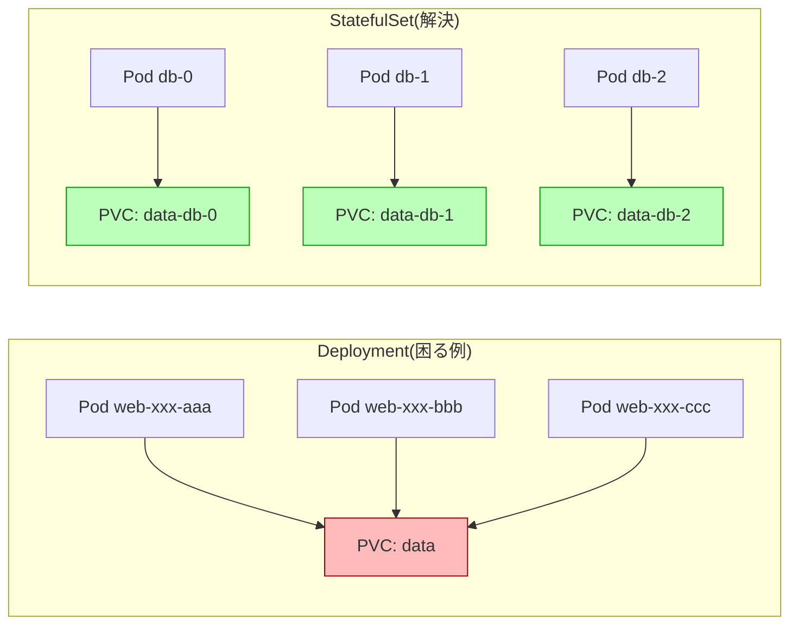
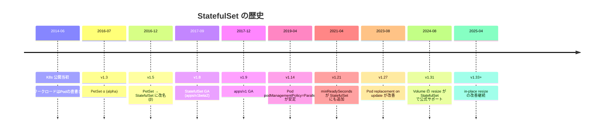
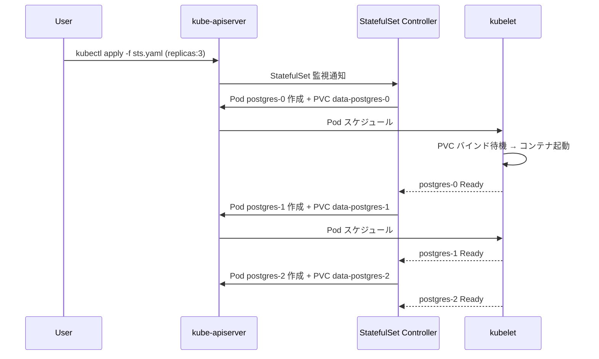
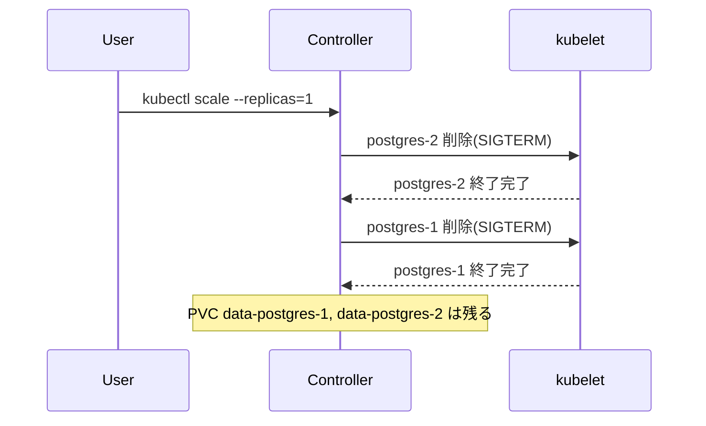
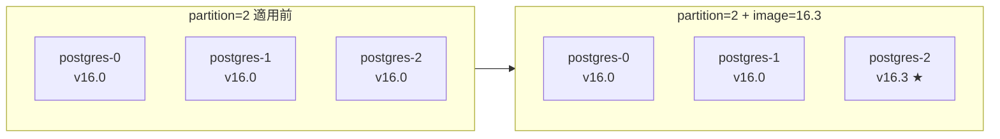
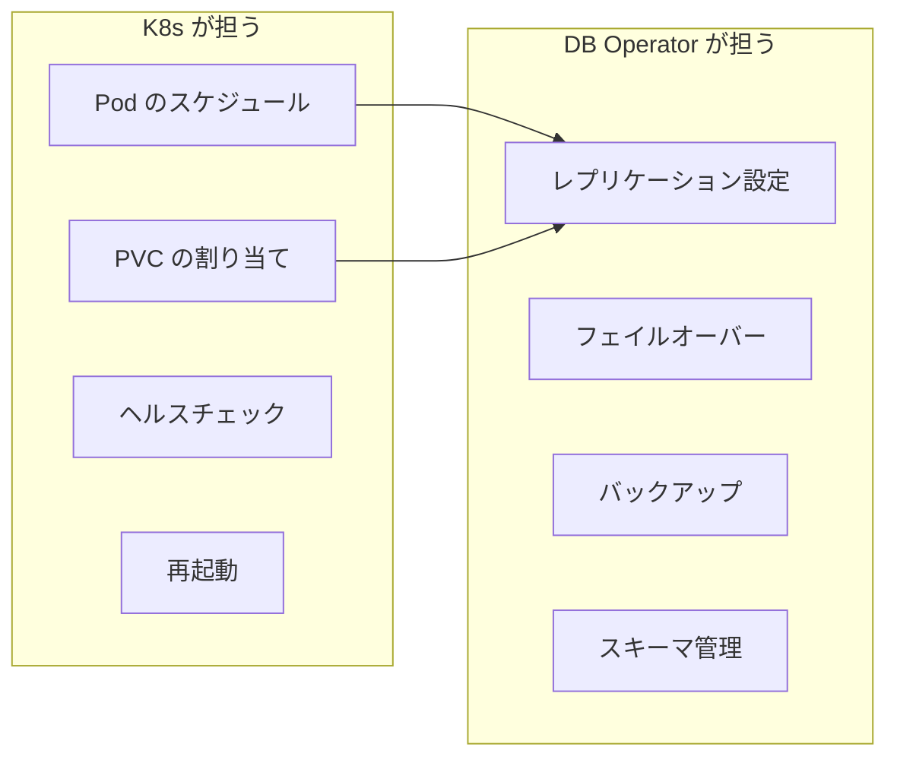
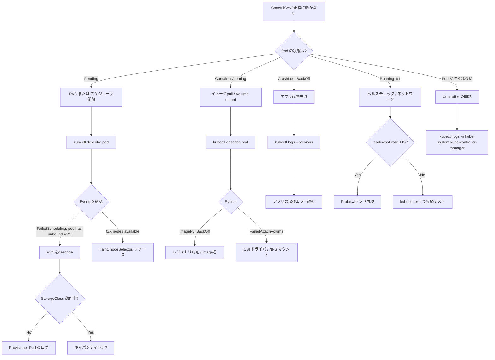
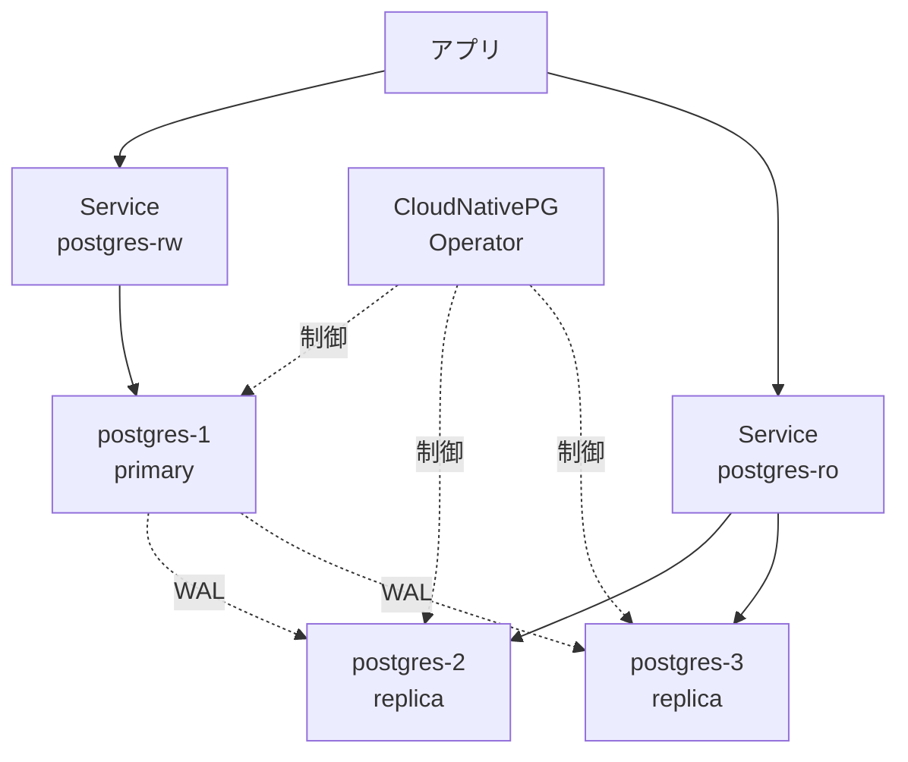
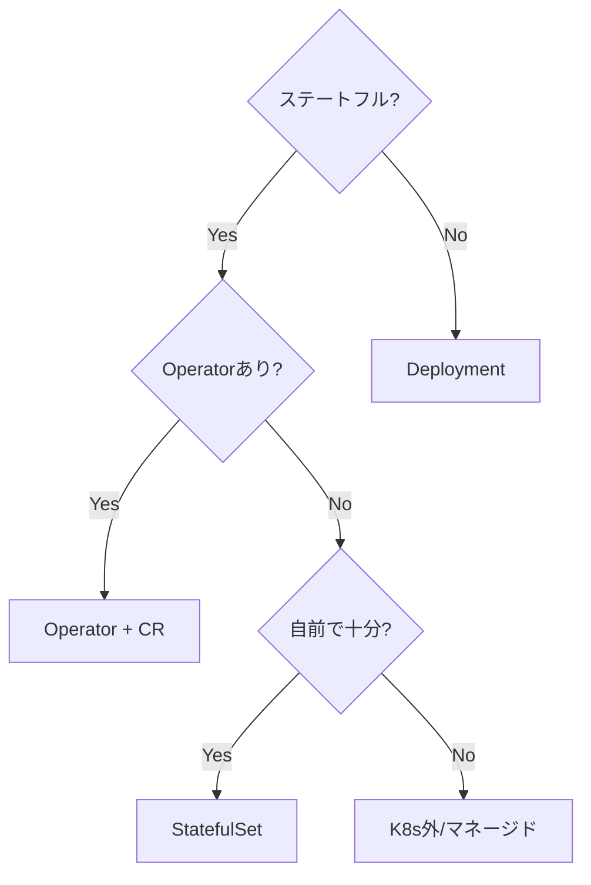

# StatefulSet
{: .no_toc }

## 目次
{: .no_toc .text-delta }

1. TOC
{:toc}

---

## このページのゴール

このページを読み終えると、以下を **自分の言葉で説明できる** ようになります。

- StatefulSet が **何のために生まれた** のか、Deployment では何が困るのかを歴史的経緯と一緒に説明できる
- StatefulSet と Deployment を **どういう基準で選び分けるか** を、5つ以上の観点で言える
- `serviceName`、`volumeClaimTemplates`、`podManagementPolicy`、`updateStrategy` などの **主要フィールドの意味と既定値** を説明できる
- Headless Service が **なぜ必要か**、`<pod>.<service>.<ns>.svc.cluster.local` でなぜ Pod に直接到達できるかをDNS の仕組みから説明できる
- StatefulSet を使えば DB が高可用になる **わけではない** こと、本番でのリアルな選択肢(Operator / 外出し / マネージド)を説明できる
- StatefulSet 関連のトラブル(`0` 番が立ち上がらない、PVC が `Pending`、`Forbidden: updates to statefulset spec ...`)を **切り分けて原因に到達** できる
- ミニTODOサービスの PostgreSQL を **StatefulSet で構築・運用・削除** できる

---

## なぜ StatefulSet が必要か — Deployment では何が困るのか

「Deployment ではダメな要件は何か?」を整理することが、StatefulSet を理解する近道です。

### Deployment の 3 つの「不便」

Deployment は ReplicaSet 経由で Pod を作りますが、その Pod には次の特徴があります。

1. **Pod 名がランダム** : `web-7c5d9b8f4d-x9k2p` のように、ReplicaSet の hash + ランダム文字。再作成のたびに変わる。
2. **起動順が保証されない** : `replicas: 3` なら 3 つ並行に起動を試みる。「先に 0 番、次に 1 番」という順序が無い。
3. **PVC は Pod 間で共有(できる)** : `spec.volumes.persistentVolumeClaim.claimName` で同じ PVC を全レプリカが指す書き方になる。`ReadWriteOnce` の PVC を 3 レプリカで使おうとすると、2 つは `Pending` になる。

これは **ステートレスな Web/API** には何の問題もありませんが、**DB やキューやリーダー選出が必要なシステム** にとっては致命的です。具体的に何が困るかを、PostgreSQL レプリケーションを例に見ます。

### 困りごと1: Pod 名が変わるとレプリケーションが組めない

PostgreSQL のストリーミングレプリケーション設定では、スタンバイがプライマリに `primary_conninfo = 'host=postgres-0 ...'` のように **ホスト名を指定** して接続します。Pod 名が `web-xxx-yyy` のように毎回変わると、設定ファイルが追従できません。

### 困りごと2: 起動順が保証されないとクォーラムが組めない

3 ノードで Raft や Paxos を組むタイプ(etcd、Consul、ZooKeeper、CockroachDB 等)は、最初に **1 ノードでクラスタを bootstrap** し、その後 **2、3 番目を join** する手順が必要です。3 ノード並行に起動されると、お互いを見つけられず無限に再試行することになります。

### 困りごと3: PVC が共有されるとデータが衝突する

`replicas: 3` の DB が同じディスクを掴んだら、ファイルが壊れます。各 Pod が **独立したストレージ** を持つ必要があります。



### StatefulSet が解決する 4 つのこと

StatefulSet は次の 4 つを **同時に保証** します。

| 保証 | 内容 | Deployment では |
|------|------|----------------|
| **安定した Pod 識別子** | Pod 名は `<ss-name>-<ordinal>` 形式(`db-0`、`db-1`、…) | ランダム |
| **安定した DNS 名** | `<pod>.<service>.<ns>.svc.cluster.local` で Pod に直接到達 | Service 経由のみ |
| **順序付き操作** | 起動は `0,1,2,...,N-1`、停止/縮退は逆順 | 並行 |
| **Pod ごとの PVC** | `volumeClaimTemplates` で Pod 単位に PVC が自動生成 | 共有 |

これら 4 つが揃って初めて、レプリケーションを組む DB やクォーラム制御するシステムを Kubernetes に載せられます。

---

## 歴史: PetSet から StatefulSet へ

StatefulSet の歴史を知っておくと、なぜこの設計なのかが見えてきます。



### なぜ「PetSet」だったのか、なぜ改名されたのか

DevOps の文脈で **「Pets vs Cattle」** という比喩がよく使われます。

- **Pets(ペット)** : 個体識別され、名前があり、病気になったら治療する。ハードウェアサーバ、伝統的な「あの DB サーバ」。
- **Cattle(家畜)** : 群で扱い、1 頭が病気になったら入れ替える。クラウドの VM、コンテナ。

K8s の Pod は本来「家畜」的に作られていますが、DB のように **どうしてもペット的に扱う必要がある** ものに対応するため PetSet が作られました。しかし「**ペットを推奨しているように見える**」というブランドメッセージが議論になり、**「これは特別なステートフル用途のためのもの」** という意味を込めて StatefulSet に改名されました。

{: .note }
> 改名の議論は `kubernetes/kubernetes#28718` の Issue で公開されています。「PetSet という名前は K8s の哲学(なるべくステートレスに作る)と矛盾する」という意見が支配的でした。

### 改名は名前だけではない

PetSet → StatefulSet では、API グループも `apps/v1beta1` から最終的に **`apps/v1`** に整理されました。古い教材で `apiVersion: apps/v1beta2` を見ることがありますが、**v1.16 で v1beta2 は削除済み** です。現代の YAML では `apps/v1` 一択です。

---

## Deployment との比較表(完全版)

軽い比較表は冒頭に出しましたが、より詳細な比較を提示します。

| 観点 | Deployment | StatefulSet |
|------|-----------|-------------|
| **Pod 名** | `<deploy>-<rs-hash>-<random>` | `<ss>-<ordinal>` |
| **Pod の再作成** | 同じ名前にはならない | 同じ名前で復活 |
| **DNS** | Service経由のみ(VIP) | Headless Service経由で個別Pod解決可 |
| **起動順** | 並列 | 順次(`0` → `N-1`) |
| **停止/縮退順** | 任意 | 逆順(`N-1` → `0`) |
| **PVC** | 共有 or 持たない | Pod ごとに自動生成 |
| **PVC 削除** | 手動 | StatefulSet 削除でも残る(明示削除が必要) |
| **更新戦略** | RollingUpdate / Recreate | RollingUpdate / OnDelete |
| **ロールバック** | `kubectl rollout undo` で容易 | `rollout undo` 可だがデータ起因の問題あり |
| **スケール** | 何個でも自由 | スケール時も順次 |
| **HPA との相性** | ◎ | △(ステートフルなので慎重) |
| **想定ワークロード** | Web、API、ステートレス処理 | DB、KV、キュー、クォーラム制御 |
| **典型的な replica 数** | 3〜数百 | 1〜7(クォーラム前提) |
| **Service** | Service(ClusterIP) | Headless Service(必須) |
| **`spec.minReadySeconds`** | あり | あり(v1.21+) |
| **`spec.podManagementPolicy`** | なし | OrderedReady(既定) / Parallel |
| **Pod 識別の安定性** | 不安定(再作成で変わる) | 安定(ordinal で固定) |

---

## YAML を解剖する: PostgreSQL を例に

サンプルアプリのDBを StatefulSet で書きます。**全フィールドの意味** を順に解説します。

### 完全な YAML

```yaml
# 1. Headless Service(StatefulSetより先に作る)
apiVersion: v1
kind: Service
metadata:
  name: postgres
  namespace: todo
  labels:
    app.kubernetes.io/name: postgres
    app.kubernetes.io/part-of: todo
spec:
  clusterIP: None              # ★ Headless にするキモ
  selector:
    app.kubernetes.io/name: postgres
  ports:
  - name: pg
    port: 5432
    targetPort: 5432
---
# 2. StatefulSet本体
apiVersion: apps/v1
kind: StatefulSet
metadata:
  name: postgres
  namespace: todo
  labels:
    app.kubernetes.io/name: postgres
    app.kubernetes.io/part-of: todo
spec:
  serviceName: postgres        # ★ Headless Serviceの名前
  replicas: 1                  # まずは1から
  podManagementPolicy: OrderedReady   # 既定値、明示する癖を
  updateStrategy:
    type: RollingUpdate
    rollingUpdate:
      partition: 0             # 0以上のordinalだけ更新
      maxUnavailable: 1        # v1.24+ alpha, v1.27+ beta
  selector:
    matchLabels:
      app.kubernetes.io/name: postgres
  template:
    metadata:
      labels:
        app.kubernetes.io/name: postgres
        app.kubernetes.io/part-of: todo
    spec:
      terminationGracePeriodSeconds: 60
      securityContext:
        fsGroup: 999           # postgresユーザのGID
      containers:
      - name: postgres
        image: postgres:16
        imagePullPolicy: IfNotPresent
        ports:
        - name: pg
          containerPort: 5432
        env:
        - name: POSTGRES_DB
          value: todo
        - name: POSTGRES_USER
          value: todo
        - name: POSTGRES_PASSWORD
          valueFrom:
            secretKeyRef:
              name: postgres-secret
              key: password
        - name: PGDATA
          value: /var/lib/postgresql/data/pgdata
        volumeMounts:
        - name: data
          mountPath: /var/lib/postgresql/data
        resources:
          requests:
            cpu: 200m
            memory: 512Mi
          limits:
            cpu: "2"
            memory: 2Gi
        readinessProbe:
          exec:
            command: ["pg_isready", "-U", "todo", "-d", "todo"]
          initialDelaySeconds: 10
          periodSeconds: 5
          timeoutSeconds: 3
          failureThreshold: 3
        livenessProbe:
          exec:
            command: ["pg_isready", "-U", "todo", "-d", "todo"]
          initialDelaySeconds: 30
          periodSeconds: 10
  volumeClaimTemplates:        # ★ Pod ごとに PVC を作る
  - metadata:
      name: data
    spec:
      accessModes: [ReadWriteOnce]
      storageClassName: nfs    # 第7章以降の環境
      resources:
        requests:
          storage: 10Gi
```

### 1ブロックずつ解説

#### `kind: Service` の `clusterIP: None` (Headless Service)

`clusterIP: None` を指定すると、Service に **VIP(ClusterIP)が割り振られず**、CoreDNS は **Pod の IP を直接返す** ようになります。これを **Headless Service** と呼びます。

通常の Service の DNS:
```
postgres.todo.svc.cluster.local. → 10.96.123.45 (VIP、kube-proxyが背後のPodに転送)
```

Headless Service の DNS:
```
postgres.todo.svc.cluster.local. → 10.244.1.10, 10.244.2.20, 10.244.3.30 (Pod IP直接)
postgres-0.postgres.todo.svc.cluster.local. → 10.244.1.10 (個別 Pod の IP)
postgres-1.postgres.todo.svc.cluster.local. → 10.244.2.20
postgres-2.postgres.todo.svc.cluster.local. → 10.244.3.30
```

**Pod 個別の DNS 名を引けるようにするのが目的** で、StatefulSet とセットで必須です。

#### `serviceName: postgres`

「**この StatefulSet が紐づく Headless Service の名前**」を指定します。Pod の DNS 名生成に使われます。
存在しない Service 名を書いても **YAML のapply は通ります** が、**DNS が引けず** にレプリケーション設定が失敗するという嵌り方をするので注意。

{: .warning }
> `serviceName` を間違えていても StatefulSet 自体は起動します。DNS が引けないことに気づくのは、内部から `nslookup postgres-0.postgres` を叩いたときです。最初に `kubectl exec -- getent hosts postgres-0.postgres` で確認する癖をつけましょう。

#### `replicas: 1`

DBは **1 から始めて、レプリケーション設定が確立してから増やす** のが鉄則です。いきなり 3 にすると、`postgres-1` が `postgres-0` から論理レプリを取ろうとして、初期データの差で失敗します。

#### `podManagementPolicy: OrderedReady`(既定)

- `OrderedReady` : `0 → 1 → 2` と **前の Pod が `Ready` になるまで次を作らない**。
- `Parallel` : すべてを **同時に作る**(順序保証なし)。

DB のように **レプリケーション設定が「先に立っている」必要があるシステム** には `OrderedReady`、Cassandra のように **互いを見つけて自律的に組む** タイプには `Parallel` が向きます。

`Parallel` でも **Pod 名・PVC・DNS の安定性は維持されます**。「順序」だけが緩むのがポイント。

#### `updateStrategy`

```yaml
updateStrategy:
  type: RollingUpdate
  rollingUpdate:
    partition: 0
    maxUnavailable: 1
```

- `type: RollingUpdate`(既定) : Pod を **逆順(高い ordinal から)** に1つずつ削除→再作成。
- `type: OnDelete` : 自動更新せず、**ユーザが Pod を手動で削除した時に新しい spec で作り直す**。手動カナリアやトリッキーな更新で使う。
- `rollingUpdate.partition: K` : ordinal が **K 以上の Pod だけ更新**。`partition: 2` で `replicas: 5` なら、`postgres-2,3,4` だけ更新、`0,1` は古いまま。**カナリアリリース** に使えます。
- `rollingUpdate.maxUnavailable: 1` : v1.24+ alpha、v1.27+ beta、v1.31+ stable。同時に Unavailable にできる Pod 数。DBで使うのは慎重に。

#### `volumeClaimTemplates`

```yaml
volumeClaimTemplates:
- metadata:
    name: data
  spec:
    accessModes: [ReadWriteOnce]
    storageClassName: nfs
    resources:
      requests:
        storage: 10Gi
```

このブロックが StatefulSet の最大の特徴。Pod ごとに以下の PVC が **自動生成** されます。

```
data-postgres-0    (replicas=1なら1つ)
data-postgres-1    (replicas=2に増やすと自動で増える)
data-postgres-2
```

PVC の名前は `<volumeClaimTemplates.metadata.name>-<statefulset>-<ordinal>` で決まります。Pod の volume mount は **`name: data`** で同名のものを参照します。

#### `terminationGracePeriodSeconds: 60`

Pod 削除時に SIGTERM を送ってから SIGKILL までの猶予秒数。
PostgreSQL は**チェックポイントを取ってからシャットダウン**するため、デフォルトの30秒だと足りないことがあります。**60〜120秒** が目安。

#### `securityContext.fsGroup: 999`

PVC をマウントしたとき、ボリュームの所有グループを `999`(postgres ユーザの GID)に**変更してくれる**フィールド。NFS で permissionエラーが出る典型的な解決策。

---

## ライフサイクル — 起動・停止・スケール

StatefulSet のライフサイクルは Deployment よりずっと **慎重** です。

### 起動シーケンス



`OrderedReady` のため、`postgres-0` が `Ready` になるまで `postgres-1` は作られません。途中で `postgres-0` がコケて `Ready` にならない場合、**1 と 2 はずっと作られない** ので、`describe` で原因を見ることになります。

### 停止シーケンス(縮退)



逆順で削除されます。**PVC は残る**(=データは残る)ので、再度 `replicas: 3` にすると同じデータで復活します。これがDB系では特に重要。

{: .warning }
> 縮退で消した PVC は手動で消さない限り残ります。クラウドで PVC が PV(EBS等)を作るタイプの SC を使っていると、消し忘れた PVC が **延々と課金され続ける** ので注意。

---

## DNS の仕組みを深掘り

「`postgres-0.postgres.todo.svc.cluster.local` でなぜ Pod に直接到達できるのか」を CoreDNS の挙動から見ます。

### Headless Service の DNS レコード

CoreDNS は K8s API を watch していて、Service と Endpoints から自動でゾーンファイルを生成します。Headless Service `postgres` (namespace `todo`) があり、Pod が 3 つあるとき、生成されるレコードは概念的に以下:

```
; Aレコード(Service名で複数Pod IPを返す)
postgres.todo.svc.cluster.local.    IN A  10.244.1.10
postgres.todo.svc.cluster.local.    IN A  10.244.2.20
postgres.todo.svc.cluster.local.    IN A  10.244.3.30

; SRVレコード(Pod名+Service名)
postgres-0.postgres.todo.svc.cluster.local.    IN A  10.244.1.10
postgres-1.postgres.todo.svc.cluster.local.    IN A  10.244.2.20
postgres-2.postgres.todo.svc.cluster.local.    IN A  10.244.3.30
```

`postgres-0.postgres.todo.svc.cluster.local` で **個別の Pod に直接 TCP 接続** できます。`postgres.todo.svc.cluster.local` を引くと、複数の A レコードが返り、クライアント側で 1 つを選んでくれることを期待します(`/etc/resolv.conf` の `ndots:5` の挙動も絡む)。

### 検証コマンド

クラスタ内から DNS を引いてみましょう。

```bash
# 一時 Pod を立てて nslookup
kubectl run -n todo dnsdebug --image=busybox:1.36 --rm -it --restart=Never -- sh

# Pod内で実行
nslookup postgres.todo.svc.cluster.local
nslookup postgres-0.postgres.todo.svc.cluster.local
```

**期待される出力**:

```
Server:    10.96.0.10
Address:   10.96.0.10:53

Name:   postgres.todo.svc.cluster.local
Address: 10.244.1.10
Address: 10.244.2.20
Address: 10.244.3.30
```

`postgres-0.postgres...` を引いて 1 件だけ返ってきたら成功。

### よくある DNS の嵌り方

| 症状 | 原因 | 対処 |
|------|------|------|
| `nslookup postgres-0.postgres` で `NXDOMAIN` | Headless Service が存在しない、または `clusterIP: None` 抜け | `kubectl get svc postgres -n todo -o yaml` で `clusterIP` 確認 |
| 引けるが Service レコードのみ Pod 個別が引けない | Pod の `subdomain` または StatefulSet の `serviceName` が違う | `kubectl get sts postgres -o yaml | grep serviceName` |
| 引けるが TCP 接続できない | NetworkPolicy で遮断 | `kubectl get netpol -A` で確認 |
| 解決まで数秒かかる | CoreDNS のキャッシュ TTL(既定30秒) | `Corefile` の `cache` 設定確認 |

---

## ハンズオン1: PostgreSQL を StatefulSet で構築

第7章以降の VMware kubeadm 環境で進めますが、Minikube でも `storageClassName` を `standard` に変えれば動きます。

### 1. Namespace と Secret

```bash
kubectl create namespace todo

# パスワードは適当に決める(本番ではもっと長く)
kubectl create secret generic postgres-secret \
  -n todo \
  --from-literal=password=ChangeMe123!
```

**何が起きるか**: `todo` namespace と、`postgres-secret` という Secret が作られます。

**確認**:

```bash
kubectl get secret -n todo postgres-secret -o yaml
```

期待される出力(抜粋):

```yaml
apiVersion: v1
kind: Secret
metadata:
  name: postgres-secret
  namespace: todo
type: Opaque
data:
  password: Q2hhbmdlTWUxMjMh    # base64エンコード
```

### 2. Headless Service を apply

```bash
cat <<EOF | kubectl apply -f -
apiVersion: v1
kind: Service
metadata:
  name: postgres
  namespace: todo
spec:
  clusterIP: None
  selector:
    app.kubernetes.io/name: postgres
  ports:
  - name: pg
    port: 5432
EOF
```

**確認**:

```bash
kubectl get svc -n todo postgres
```

**期待される出力**:

```
NAME       TYPE        CLUSTER-IP   EXTERNAL-IP   PORT(S)    AGE
postgres   ClusterIP   None         <none>        5432/TCP   3s
```

`CLUSTER-IP` が `None` になっていれば Headless Service です。

### 3. StatefulSet を apply

上で示した完全な YAML を `postgres-sts.yaml` で保存し、

```bash
kubectl apply -f postgres-sts.yaml
```

### 4. 起動を観察

別ターミナルで watch:

```bash
kubectl get pods -n todo -l app.kubernetes.io/name=postgres -w
```

**期待される出力(時系列)**:

```
NAME         READY   STATUS              RESTARTS   AGE
postgres-0   0/1     Pending             0          0s
postgres-0   0/1     ContainerCreating   0          5s
postgres-0   0/1     Running             0          10s
postgres-0   1/1     Running             0          25s
```

`Pending` が長い場合、PVC のバインド待ち。`describe pod` で確認します。

```bash
kubectl describe pod -n todo postgres-0
```

**Events 例**:

```
Events:
  Type     Reason            Age   From               Message
  ----     ------            ----  ----               -------
  Warning  FailedScheduling  10s   default-scheduler  pod has unbound immediate PersistentVolumeClaims
```

PVC を確認します。

```bash
kubectl get pvc -n todo
```

**期待される出力**:

```
NAME              STATUS   VOLUME       CAPACITY   ACCESS MODES   STORAGECLASS   AGE
data-postgres-0   Bound    pvc-xxx-1    10Gi       RWO            nfs            30s
```

`STATUS` が `Pending` なら、StorageClass の問題。

```bash
kubectl describe pvc -n todo data-postgres-0
kubectl get sc
```

`PROVISIONER` が動いているか、Provisioner Pod のログを見ます(NFS-CSIなら `csi-nfs-controller`)。

### 5. 接続テスト

```bash
kubectl exec -it -n todo postgres-0 -- psql -U todo -d todo
```

```sql
todo=# CREATE TABLE todos (id SERIAL PRIMARY KEY, title TEXT, done BOOLEAN DEFAULT false);
todo=# INSERT INTO todos (title) VALUES ('K8s学習を完走する');
todo=# SELECT * FROM todos;
 id |       title        | done 
----+--------------------+------
  1 | K8s学習を完走する  | f
(1 row)
```

### 6. Pod を消してデータが残ることを確認

```bash
# Pod を削除
kubectl delete pod -n todo postgres-0

# Pod 復活待ち
kubectl wait --for=condition=Ready -n todo pod/postgres-0 --timeout=60s

# データが残っているか
kubectl exec -it -n todo postgres-0 -- psql -U todo -d todo -c "SELECT * FROM todos"
```

データが残っていれば成功です。

### 7. Service と DNS を確認

```bash
kubectl run -n todo dnsdebug --image=busybox:1.36 --rm -it --restart=Never -- \
  sh -c "nslookup postgres-0.postgres.todo.svc.cluster.local && \
         nslookup postgres.todo.svc.cluster.local"
```

`postgres-0.postgres...` で 1 つの IP、`postgres.todo...` で同じ 1 つの IP(replicas=1 なので)が返れば OK。

### 8. クリーンアップ(注意)

```bash
# StatefulSet 削除(PVC は残る)
kubectl delete sts -n todo postgres
kubectl delete svc -n todo postgres

# PVC を残したい場合はここで止める
kubectl get pvc -n todo
# data-postgres-0 が残っていることを確認

# 完全に削除する場合
kubectl delete pvc -n todo --all
```

{: .warning }
> 本番DBで `kubectl delete pvc` を実行してはいけません。**スナップショット/バックアップを取ってから** が鉄則。

---

## スケールと更新

### スケールアップ

```bash
kubectl scale -n todo sts postgres --replicas=3
```

`postgres-1`、`postgres-2` が **順次** 起動します。各々に新しい PVC が作られます。

```bash
kubectl get pvc -n todo
```

```
data-postgres-0    Bound   pvc-xxx-1   10Gi   RWO   nfs    10m
data-postgres-1    Bound   pvc-xxx-2   10Gi   RWO   nfs    1m
data-postgres-2    Bound   pvc-xxx-3   10Gi   RWO   nfs    30s
```

ただし、**この時点では `postgres-1`, `postgres-2` は何のデータも持たない空のDB** です。レプリケーションを組むには別途 `init-container` で `pg_basebackup` を走らせる必要があります(本格的には Operator を使う、後述)。

### スケールダウン

```bash
kubectl scale -n todo sts postgres --replicas=1
```

`postgres-2` → `postgres-1` の順で削除。**PVC は残る** ので、再スケールアップで戻ります(ただし古いデータが古いまま、という落とし穴に注意)。

### イメージ更新

```bash
kubectl set image -n todo sts/postgres postgres=postgres:16.3
```

または `kubectl edit sts -n todo postgres` で直接編集。
`updateStrategy: RollingUpdate` の場合、**`postgres-2` から逆順** に1つずつ削除→再作成。

```bash
kubectl rollout status sts/postgres -n todo
```

進捗を見ます。

### partition によるカナリア

```yaml
spec:
  updateStrategy:
    type: RollingUpdate
    rollingUpdate:
      partition: 2          # ordinal 2以上だけ更新
```

`replicas: 3` で `partition: 2` にすると、`postgres-2` だけが更新され、`postgres-0,1` は古いまま。問題なければ `partition: 0` に戻して全体更新、というカナリアリリースができます。



---

## 詳細仕様: 主要フィールド一覧

ここまでで触れていないフィールドも含め、StatefulSet の全主要フィールドを表にまとめます。

| フィールド | 既定値 | 意味 | 注意 |
|----------|--------|------|------|
| `spec.replicas` | 1 | レプリカ数 | HPA を当てると上書きされる |
| `spec.serviceName` | (必須) | Headless Service 名 | 存在チェックされない |
| `spec.selector.matchLabels` | (必須) | Pod 選択 | template の labels と一致必須 |
| `spec.template` | (必須) | Pod テンプレート | 大半のフィールドが immutable |
| `spec.podManagementPolicy` | OrderedReady | 起動方針 | Parallel に変えても順序保証無し |
| `spec.updateStrategy.type` | RollingUpdate | 更新方式 | OnDelete で手動 |
| `spec.updateStrategy.rollingUpdate.partition` | 0 | 更新対象の最低ordinal | カナリアに |
| `spec.updateStrategy.rollingUpdate.maxUnavailable` | 1 | 同時Unavailable数 | v1.31+ stable |
| `spec.volumeClaimTemplates` | [] | PVC テンプレート | 後から **追加できない**(StatefulSetを削除して再作成しか) |
| `spec.minReadySeconds` | 0 | Ready後この秒数経過で利用可 | v1.25+ |
| `spec.persistentVolumeClaimRetentionPolicy.whenDeleted` | Retain | StatefulSet削除時のPVC | Delete にすると一緒に消える(v1.27+ beta) |
| `spec.persistentVolumeClaimRetentionPolicy.whenScaled` | Retain | スケール縮退時のPVC | Delete にすると消える |
| `spec.ordinals.start` | 0 | ordinal の開始番号 | v1.27+ alpha、v1.30+ beta。`5` 開始も可 |
| `spec.revisionHistoryLimit` | 10 | 古い ControllerRevision を残す数 | rollback 用 |

### immutable なフィールド

以下は **作成後に変更できない** フィールドです。`kubectl apply` するとエラーになります。

- `spec.serviceName`
- `spec.selector`
- `spec.volumeClaimTemplates`
- `spec.podManagementPolicy`

これらを変更したい場合、StatefulSet を **削除して再作成** することになります。データの PVC は残るので、削除→再作成しても永続データは保持されます(同名で再作成すれば、PVC は自動で再アタッチされる)。

```bash
# 既存を消す
kubectl delete sts -n todo postgres --cascade=orphan
# orphan で消すと Pod は残るので、上書き apply しやすい
```

`--cascade=orphan` を使うと **Pod を生かしたまま StatefulSet を消せる** ので、ダウンタイムを抑えた再作成が可能。

---

## 本番運用の落とし穴

### 落とし穴 1: 「StatefulSet ≠ 高可用 DB」

これは何度強調してもしすぎることはない、**最大の誤解** です。

**StatefulSet がやってくれること**:
- Pod ごとに固定 DNS 名と PVC を割り当てる
- 順次起動・停止
- ストレージの永続化

**StatefulSet がやってくれないこと**:
- レプリケーション設定
- フェイルオーバー(プライマリ昇格、スプリットブレイン防止)
- バックアップ
- 接続文字列の自動切り替え
- スキーマアップグレード

これら DB 固有の運用は、**アプリ自身か、Operator** が担う領域です。



### 落とし穴 2: PVC の取り残し

StatefulSet を `kubectl delete sts xxx` しても **PVC は残ります**(既定の retentionPolicy が Retain)。テストで作って消してを繰り返すと、PVCが溜まり続けます。

```bash
# PVCを一覧
kubectl get pvc -A | grep -v Bound

# StatefulSet 由来かを確認(label見るのが確実)
kubectl get pvc -A -l app.kubernetes.io/name=postgres
```

v1.27+ では retentionPolicy で自動削除も指定可能:

```yaml
spec:
  persistentVolumeClaimRetentionPolicy:
    whenDeleted: Delete    # StatefulSet 削除でPVCも消す
    whenScaled: Delete     # スケール縮退でPVC消す
```

ただし **本番DBでは Retain 推奨**。誤操作からデータを守るのが優先。

### 落とし穴 3: スケールアップでデータが空のまま

レプリカを 1→3 に増やすと **`postgres-1`, `postgres-2` は空 DB** で起動します。アプリ側で気づかず接続して、「データが消えた!」となるケース。

対策:

1. Operator(CloudNativePG等)を使う(ベース DB のクローン+レプリケーション設定を自動化)
2. `init-container` で `pg_basebackup` を流す(自前で組む)
3. 単一 Pod で運用(replicas=1 のまま)

### 落とし穴 4: ノード障害時のリカバリが遅い

Pod がいるノードがダウンしたとき:

- ノードが NotReady → 5分(`tolerations` の既定)経って Pod を Evict
- Evict されてから新しいノードで Pod 再作成
- PVC が新ノードからマウントできるか?(NFS なら可、ローカル PV なら不可)

**ノード障害から復活まで、何分かかるかを必ず計測** しておきましょう。要件次第では Operator + 自動フェイルオーバーが必要。

### 落とし穴 5: ローカル PV(`local-path`)を使うとノード固定される

ノード障害時、ローカル PV を持つ Pod は **そのノードでしか起動できない** ため、ノードが死ぬと永久に Pending。本番では NFS、Ceph、クラウド EBS、Longhorn などの **ノード非依存ストレージ** を使うべき。

学習用の Minikube や kubeadm では `local-path-provisioner`(Rancher) や `nfs-csi`、`hostPath` を使うことが多いですが、**それぞれの制限を理解した上で** 使う必要があります。

---

## 本番運用のリアルな選択肢

「DB を K8s に載せるかどうか」は本番で必ず議論になります。3 つの選択肢を比較します。

### 選択肢 1: マネージド DB(クラウド)

- AWS RDS / Aurora、GCP Cloud SQL / AlloyDB、Azure Database for PostgreSQL
- 強み: バックアップ、フェイルオーバー、パッチ適用がマネージド
- 弱み: クラウドベンダーロックイン、ローカル/オンプレ非対応、IO 性能の上限

**多くの本番システムでは、これが第一選択** です。

### 選択肢 2: K8s 外の VM/物理サーバ

- 専用の DB サーバを建て、K8s からは Service の `ExternalName` で参照
- 強み: 運用ノウハウが既存(伝統的な DBA スキルが効く)、性能チューニングしやすい
- 弱み: K8s からは独立した運用フローが必要

オンプレ移行中の組織に多い選択肢。**「DBは K8s に入れない」が堅い** という標語の通り。

### 選択肢 3: K8s 内 StatefulSet + Operator

- CloudNativePG / Crunchy Postgres Operator(PostgreSQL)
- Percona Operator / KubeBlocks(MySQL)
- MongoDB Community Operator
- Redis Operator(spotahome、redis-operator)
- 強み: K8s に統一、宣言的に DB クラスタが作れる
- 弱み: Operator の習熟が必要、Operator 固有のバグに刺さる可能性

第11章「Operator」で詳しく扱います。本教材ではローカル完結のため CloudNativePG を試します。

### 比較表

| 観点 | マネージド | 外出しVM | K8s + Operator |
|------|-----------|--------|---------------|
| 運用負荷 | ◎ | △ | ○ |
| 性能チューニング | △ | ◎ | ○ |
| バックアップ自動化 | ◎ | △(手動) | ○(Operator次第) |
| マルチAZ HA | ◎ | △ | ○ |
| K8sとの統合 | △ | △ | ◎ |
| ベンダーロックイン | △ | ◎ | ○ |
| 学習コスト | 低 | 中 | 高 |
| コスト | 高 | 中 | 低 |

---

## トラブルシューティング

### 切り分けフローチャート



### よくあるエラー集

#### 症状1: `Pending` のまま動かない

**症状**:

```bash
$ kubectl get pod -n todo
NAME         READY   STATUS    RESTARTS   AGE
postgres-0   0/1     Pending   0          3m
```

**調査1**:

```bash
$ kubectl describe pod -n todo postgres-0
...
Events:
  Type     Reason            Age   From               Message
  ----     ------            ----  ----               -------
  Warning  FailedScheduling  3m    default-scheduler  0/3 nodes are available: pod has unbound immediate PersistentVolumeClaims
```

→ PVC の問題。PVC を確認:

```bash
$ kubectl describe pvc -n todo data-postgres-0
...
Status:        Pending
Events:
  Warning  ProvisioningFailed  ...  storageclass.storage.k8s.io "nfs" not found
```

**対処**:

- `storageClassName` を実在する SC に変更
- もしくは `kubectl get sc` で名前を確認

#### 症状2: `0/X nodes available: 1 Insufficient cpu`

**対処**: Pod の `resources.requests` を下げるか、ノードを増やすか、HPA を見直す。

#### 症状3: `forbidden: updates to statefulset spec for fields other than ...`

```bash
$ kubectl apply -f sts.yaml
The StatefulSet "postgres" is invalid: spec: Forbidden: updates to statefulset spec for fields other than 'replicas', 'ordinals', 'template', 'updateStrategy', 'persistentVolumeClaimRetentionPolicy' and 'minReadySeconds' are forbidden
```

**意味**: `serviceName`、`selector`、`volumeClaimTemplates`、`podManagementPolicy` を変えようとした。

**対処**: 既存を `--cascade=orphan` で削除して再作成。

```bash
kubectl delete sts -n todo postgres --cascade=orphan
kubectl apply -f sts.yaml    # 新しいspecで作り直し、Podは引き継がれる
```

#### 症状4: `postgres-0` は起動するが `postgres-1` が立ち上がらない

`OrderedReady` で `postgres-0` が **Ready 判定されていない** 可能性。

```bash
$ kubectl get pod -n todo
NAME         READY   STATUS    RESTARTS   AGE
postgres-0   0/1     Running   0          5m
```

`READY 0/1` なら `readinessProbe` が通っていません。

```bash
$ kubectl describe pod -n todo postgres-0
...
  Warning  Unhealthy  ...  Readiness probe failed: pg_isready: ...
```

**対処**:

- Probe コマンドを `kubectl exec` で手動実行して再現
- `initialDelaySeconds` を伸ばす(DB初期化に時間がかかる)
- パスワード Secret が正しいか確認

#### 症状5: Pod は Running だが他から接続できない

```bash
# 内部から接続テスト
kubectl run -n todo psql --rm -it --image=postgres:16 --restart=Never -- \
  psql -h postgres-0.postgres.todo.svc.cluster.local -U todo -d todo
```

| 出力 | 原因 |
|------|------|
| `could not translate host name` | DNS 解決失敗 → Headless Service / serviceName 確認 |
| `Connection refused` | Pod 内でリッスンしていない → アプリログ確認 |
| `password authentication failed` | パスワード不一致 → Secret 確認 |
| `timeout` | NetworkPolicy 遮断 → `kubectl get netpol -n todo` |

#### 症状6: PVC が `Pending` で動かない

**確認1**: StorageClass

```bash
kubectl get sc
```

**確認2**: Provisioner

NFS-CSI なら:

```bash
kubectl logs -n kube-system -l app=csi-nfs-controller
```

**確認3**: 容量

NFS の場合、サーバ側で `df -h` してエクスポート先の空き容量を見る。
クラウド SC なら、そもそもクォータに引っかかっていないか。

#### 症状7: `volumeClaimTemplates` を変更しようとしてエラー

`storage` を増やしたい:

- 古い K8s では **不可**(StatefulSet 削除→再作成、PVC 個別 resize)
- v1.31+ では `spec.volumeClaimTemplates[*].spec.resources.requests.storage` の **増加** が一部で可能(SC が `allowVolumeExpansion: true`)

PVC を個別に拡張するには:

```bash
kubectl patch pvc -n todo data-postgres-0 \
  -p '{"spec":{"resources":{"requests":{"storage":"20Gi"}}}}'
```

SC が `allowVolumeExpansion: true` になっていることが前提。

---

## デバッグのチェックリスト

StatefulSet で何かが起きたとき、以下を順に確認:

- [ ] `kubectl get sts -n <ns>` で `READY` が `<replicas>/<replicas>` か
- [ ] `kubectl get pod -n <ns> -l <selector>` で全 Pod の `READY` 列
- [ ] `kubectl describe pod -n <ns> <pod>` の **Events 末尾**
- [ ] `kubectl logs -n <ns> <pod>` の最後の数行(`-c <container>` でコンテナ指定)
- [ ] `kubectl logs -n <ns> <pod> --previous` で前回起動分(CrashLoopBackOff時)
- [ ] `kubectl get pvc -n <ns>` で全 PVC が `Bound` か
- [ ] `kubectl describe pvc -n <ns> <pvc>` で問題 PVC のEvents
- [ ] `kubectl get sc` で StorageClass の存在
- [ ] `kubectl get svc -n <ns>` で Headless Service の `clusterIP: None`
- [ ] `kubectl exec -it <pod> -- nslookup <pod>.<svc>` で DNS解決
- [ ] `kubectl get sts -n <ns> <name> -o yaml | grep -A 5 updateStrategy` で update方針
- [ ] `kubectl get events -n <ns> --sort-by=.lastTimestamp | tail` で最近のイベント

---

## 高度なトピック

### 1. ローカル PV を使う場合

ローカル PV はノードに **物理的に紐付くストレージ**。Pod が再スケジュールされた時、**同じノードに戻る必要があります**。

```yaml
apiVersion: v1
kind: PersistentVolume
metadata:
  name: local-pv-postgres-0
spec:
  capacity:
    storage: 10Gi
  accessModes: [ReadWriteOnce]
  persistentVolumeReclaimPolicy: Retain
  storageClassName: local-storage
  local:
    path: /mnt/disks/postgres-0
  nodeAffinity:
    required:
      nodeSelectorTerms:
      - matchExpressions:
        - key: kubernetes.io/hostname
          operator: In
          values: [k8s-w1]
```

`nodeAffinity` で「このボリュームは k8s-w1 にしかない」と宣言。スケジューラはこれを見て `postgres-0` を必ず k8s-w1 に置きます。**ノード障害=データロスのリスク** があるので、本番ではレプリケーション必須。

### 2. `subPath` でディレクトリ分割

1 つの PVC を複数のマウントポイントで使い分けるパターン。

```yaml
volumes:
- name: data
  persistentVolumeClaim:
    claimName: data
volumeMounts:
- name: data
  mountPath: /var/lib/postgresql/data
  subPath: pgdata
- name: data
  mountPath: /backup
  subPath: backup
```

PVC の中の `pgdata/` と `backup/` を別マウントとして見せます。容量を分けたいだけならボリュームを分けるべきですが、コスト/管理を統一したい時に使う。

### 3. Pod Disruption Budget (PDB) と組み合わせる

ノードのドレイン時に **同時に N 個以上 Pod が消えない** ことを保証。

```yaml
apiVersion: policy/v1
kind: PodDisruptionBudget
metadata:
  name: postgres
  namespace: todo
spec:
  minAvailable: 2          # 常に2つは生きていること
  selector:
    matchLabels:
      app.kubernetes.io/name: postgres
```

`replicas: 3` で `minAvailable: 2` なら、ノードドレイン時に 1 つしか同時に消せません。クォーラム維持に有用。

### 4. `topologySpreadConstraints` でゾーン分散

Pod を AZ や ノード間に **均等に分散** させる。

```yaml
spec:
  template:
    spec:
      topologySpreadConstraints:
      - maxSkew: 1
        topologyKey: topology.kubernetes.io/zone
        whenUnsatisfiable: DoNotSchedule
        labelSelector:
          matchLabels:
            app.kubernetes.io/name: postgres
```

3 AZ にまたがるクラスタで `replicas: 3` だと、各 AZ に 1 つずつ Pod が配置されます(`maxSkew: 1` ≒ ゾーン間の差が 1 まで)。

### 5. `spec.ordinals.start`(v1.30+ beta)

Ordinal の開始番号を変更できる機能。`ordinals.start: 5` にすると、Pod 名は `postgres-5`, `postgres-6`, ... となります。

```yaml
spec:
  ordinals:
    start: 5
  replicas: 3
```

これは既存クラスタを **Blue/Green でマイグレーション** する時に活きます。新クラスタを `start: 100` で立てて、データ移行後に古い方を消す、という運用。

---

## ハンズオン2: Operator(CloudNativePG)で本物のレプリケーション

本格的に PostgreSQL クラスタを組むには Operator が圧倒的に楽です。**ここでは概要のみ示します**(詳細は第11章)。

### CloudNativePG をインストール

```bash
kubectl apply --server-side -f \
  https://raw.githubusercontent.com/cloudnative-pg/cloudnative-pg/release-1.24/releases/cnpg-1.24.1.yaml
```

### Cluster CR で宣言

```yaml
apiVersion: postgresql.cnpg.io/v1
kind: Cluster
metadata:
  name: postgres
  namespace: todo
spec:
  instances: 3
  postgresql:
    parameters:
      max_connections: "200"
  bootstrap:
    initdb:
      database: todo
      owner: todo
  storage:
    storageClass: nfs
    size: 10Gi
```

これだけで **3 ノードのレプリカクラスタ** が組まれ、プライマリ昇格、フェイルオーバー、バックアップ、メトリクス出力まで自動。Operator が裏で StatefulSet ではなく **個別の Pod** を `instances 数` だけ作ります(StatefulSet を使わない理由は、Operator 自身がより細かい制御をしたいから)。

### Pod 構成

```
postgres-1  (primary)
postgres-2  (replica)
postgres-3  (replica)
```

接続先は Operator が作る Service:

- `postgres-rw` : 書き込み(プライマリに転送)
- `postgres-ro` : 読み取り(レプリカに分散)
- `postgres-r`  : 読み取り(プライマリ含む全 Pod)

これが **Operator パターン** の力です。第11章で深く扱います。



---

## 主要な kubectl コマンド集

```bash
# 一覧
kubectl get sts -A
kubectl get sts -n todo
kubectl get sts,pod,pvc,svc -n todo

# 詳細
kubectl describe sts -n todo postgres

# YAML出力
kubectl get sts -n todo postgres -o yaml
kubectl get sts -n todo postgres -o jsonpath='{.spec.serviceName}'

# 編集
kubectl edit sts -n todo postgres
kubectl set image sts/postgres -n todo postgres=postgres:16.3

# スケール
kubectl scale sts -n todo postgres --replicas=3
kubectl autoscale sts -n todo postgres --min=2 --max=5 --cpu-percent=80    # HPA(慎重に)

# 更新
kubectl rollout status sts/postgres -n todo
kubectl rollout history sts/postgres -n todo
kubectl rollout undo sts/postgres -n todo
kubectl rollout undo sts/postgres -n todo --to-revision=2
kubectl rollout pause sts/postgres -n todo
kubectl rollout resume sts/postgres -n todo

# 削除
kubectl delete sts -n todo postgres                       # PVC は残る
kubectl delete sts -n todo postgres --cascade=orphan      # Pod も残る
kubectl delete pvc -n todo --selector=app.kubernetes.io/name=postgres   # PVC削除

# Pod の Exec
kubectl exec -it -n todo postgres-0 -- bash
kubectl exec -it -n todo postgres-0 -c postgres -- psql -U todo -d todo

# Logs
kubectl logs -n todo postgres-0
kubectl logs -n todo postgres-0 --previous
kubectl logs -n todo postgres-0 -f
kubectl logs -n todo -l app.kubernetes.io/name=postgres --tail=100

# ポートフォワード(ローカル接続)
kubectl port-forward -n todo svc/postgres 5432:5432
# 別ターミナルで psql -h localhost -U todo -d todo
```

各コマンドの詳細:

- `get sts` : StatefulSet 一覧。`-o wide` で詳細列追加。
- `-A` または `--all-namespaces` : 全 namespace 横断。
- `-l <selector>` : ラベルセレクタで絞る。`app.kubernetes.io/part-of=todo` など。
- `--cascade=orphan` : 子リソース(Pod、PVC) を残して親だけ削除。
- `rollout status` : 更新の進捗を待つ。Wait 動作になる(タイムアウトは `--timeout`)。
- `rollout undo --to-revision=N` : 指定リビジョンに戻す。`rollout history` で番号確認。

---

## まとめ: StatefulSet チートシート

```yaml
# ミニマル StatefulSet (用途: ステートフルなアプリ)
apiVersion: apps/v1
kind: StatefulSet
metadata: { name: <name>, namespace: <ns> }
spec:
  serviceName: <headless-svc-name>          # Headless Service 必須
  replicas: 1                               # まず1から、安定したら増やす
  selector: { matchLabels: { app: <name> } }
  template:
    metadata: { labels: { app: <name> } }
    spec:
      containers: [{ name: ..., image: ... }]
  volumeClaimTemplates:                     # Pod ごとに PVC 自動生成
  - metadata: { name: data }
    spec:
      accessModes: [ReadWriteOnce]
      storageClassName: <sc>
      resources: { requests: { storage: 10Gi } }
---
# Headless Service(StatefulSetより先に)
apiVersion: v1
kind: Service
metadata: { name: <headless-svc-name>, namespace: <ns> }
spec:
  clusterIP: None                           # ★ヘッドレス化
  selector: { app: <name> }
  ports: [{ port: <p> }]
```

**意思決定のフロー**:



---

## チェックポイント

ここまでで以下を **自分の言葉で** 説明できるか確認してください。

- [ ] StatefulSet が解決する 4 つのこと(Pod 識別子、DNS、起動順、PVC)を全て言える
- [ ] Headless Service の `clusterIP: None` が CoreDNS にどう作用するかを説明できる
- [ ] `volumeClaimTemplates` と `volumes` の違いを実例で説明できる
- [ ] StatefulSet で immutable な4つのフィールドを言え、変更したいときの対処方法を述べられる
- [ ] StatefulSet を使えば DB が高可用になる **わけではない** 理由を説明できる
- [ ] `partition` を使ったカナリアリリースの動作を、replicas:5、partition:3 の例で図解できる
- [ ] 「Pod が `Pending` のまま動かない」ときの調査手順を3ステップ以上で言える
- [ ] PVC の `persistentVolumeClaimRetentionPolicy` の意味と、本番DBでの推奨設定を説明できる
- [ ] サンプルアプリの PostgreSQL を、Operator なしの StatefulSet で構築する YAML が書ける
- [ ] サンプルアプリの PostgreSQL を、CloudNativePG Cluster CR で書き直すとどうなるか説明できる

---

→ 次は [DaemonSet]({{ '/03-workloads/daemonset/' | relative_url }})
