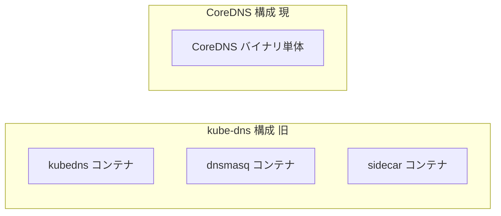
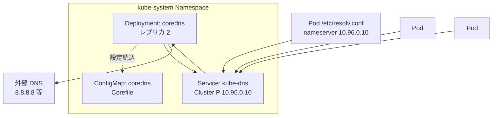
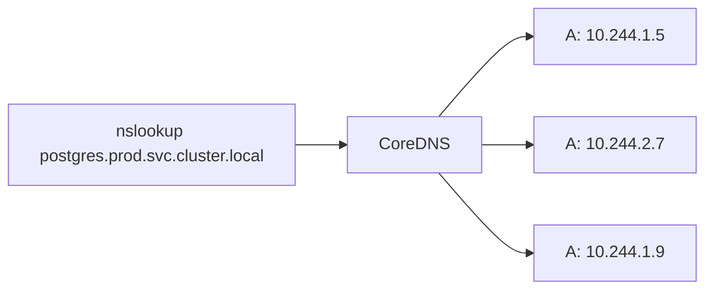
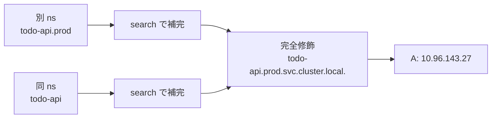
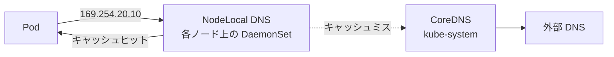
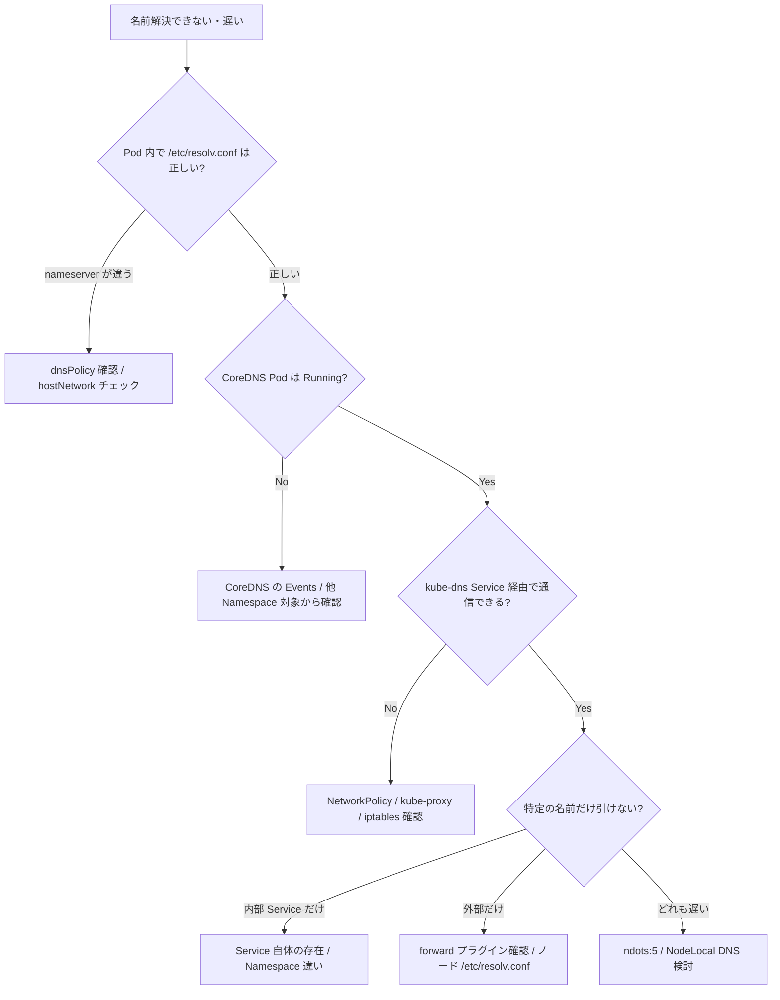

# DNSとサービスディスカバリ
{: .no_toc }

## 目次
{: .no_toc .text-delta }

1. TOC
{:toc}

---

## このページのゴール

このページを読み終えると、以下を **自分の言葉で説明できる** ようになります。

- なぜ Kubernetes は **クラスタ専用の DNS サーバ(CoreDNS)** を内蔵しているのか、その歴史(SkyDNS → kube-dns → CoreDNS)
- Pod が解決する DNS 名のフォーマット ─ Service / Headless / StatefulSet Pod / Pod IP / ExternalName それぞれ
- Pod 内 `/etc/resolv.conf` の `search` と `ndots:5` の意味と、それが原因の遅延・無駄クエリの仕組み
- CoreDNS の Corefile プラグインモデル、よく使うプラグイン(`kubernetes`、`forward`、`cache`、`hosts`、`rewrite`)
- `dnsPolicy` の 4 種類(`ClusterFirst` / `ClusterFirstWithHostNet` / `Default` / `None`)と `dnsConfig` での細かい上書き
- NodeLocal DNS Cache の意義と動作
- DNS 関連トラブル(NXDOMAIN、SERVFAIL、5 秒の謎の遅延、外部 DNS の引け方)の切り分け
- 本番で DNS をスケールさせるためのチューニング項目

## このページのスコープ

本ページは **クラスタ内 DNS(CoreDNS と各 Pod の DNS クライアント挙動)** が主軸です。
Service の仮想 IP の仕組み自体は [Service]({{ '/04-networking/service/' | relative_url }}) 章、外部 DNS と Ingress の連携(external-dns)は第7章で扱います。

## なぜ Kubernetes には DNS が要るのか ─ 歴史

### Pod IP / Service IP は「数字」では使えない

これまでの章で見てきた通り、

- Pod IP は再起動で変わる
- Service の ClusterIP は固定だが、人間が覚えにくい
- アプリは「`postgres` に繋ぎたい」と書きたいのであって、`10.96.143.27` ではない

この最後の「**アプリは名前で呼びたい**」を実現するのが DNS です。
そして Kubernetes は、外部の DNS サーバに頼らず、**クラスタ内に DNS サーバを置く** という設計を最初期から採りました。

### SkyDNS → kube-dns → CoreDNS

Kubernetes 内蔵の DNS サーバは時代ごとに変遷しています。

| 時期 | 実装 | 概要 |
|------|------|------|
| `v1.0`〜`v1.2` | **SkyDNS** | 初期の DNS。etcd を直接見ていた |
| `v1.3`〜`v1.10` | **kube-dns** | SkyDNS + dnsmasq + sidecar の 3 コンテナ構成 |
| `v1.11`〜現在 | **CoreDNS** | 単一バイナリ・プラグインモデル(`v1.13` で既定に) |

CoreDNS は CNCF 卒業プロジェクトで、現在の Kubernetes クラスタの既定 DNS です。
kube-dns との大きな違いは:

- **単一プロセス**(kube-dns のような multi-container 構成ではない)
- **プラグインベース**(必要な機能だけビルドできる、Caddy 由来のアーキテクチャ)
- **メモリ消費が小さい**
- **設定が `Corefile` で宣言的**



### 関連リソース

- [CoreDNS 公式](https://coredns.io/)
- [DNS for Services and Pods (公式ドキュメント)](https://kubernetes.io/docs/concepts/services-networking/dns-pod-service/)
- [KEP-2999: Reduction of Kubernetes Build Maintenance](https://github.com/kubernetes/enhancements/) (DNS 関連 KEP は多数)
- [NodeLocal DNS Cache](https://kubernetes.io/docs/tasks/administer-cluster/nodelocaldns/)

## CoreDNS のクラスタ内構成



ポイント:

- **Service 名は `kube-dns`**(歴史的経緯。実装は CoreDNS)
- **ClusterIP は通常 `10.96.0.10`**(`--service-cluster-ip-range` の 10 番目)
- **Deployment(または HA 構成では多めの DaemonSet)** で複数インスタンス
- 各 Pod の `/etc/resolv.conf` の `nameserver` がこの ClusterIP

確認:

```bash
kubectl get pods -n kube-system -l k8s-app=kube-dns
kubectl get svc -n kube-system kube-dns
kubectl get configmap -n kube-system coredns
```

**期待される出力**:

```
NAME                       READY   STATUS    RESTARTS   AGE
coredns-7db6d8ff4d-4xqlf   1/1     Running   0          5d
coredns-7db6d8ff4d-9c2bs   1/1     Running   0          5d
```

```
NAME       TYPE        CLUSTER-IP   EXTERNAL-IP   PORT(S)                  AGE
kube-dns   ClusterIP   10.96.0.10   <none>        53/UDP,53/TCP,9153/TCP   30d
```

`9153/TCP` は CoreDNS の Prometheus メトリクスポートです。

## Kubernetes が発行する DNS 名

Kubernetes は以下の名前を CoreDNS で解決できるように自動的に維持します。

### Service(通常の ClusterIP)

| 種類 | レコード | 解決先 |
|------|---------|-------|
| A レコード | `<service>.<namespace>.svc.cluster.local` | Service の ClusterIP |
| SRV レコード | `_<port-name>._<protocol>.<service>.<namespace>.svc.cluster.local` | port-name(Service の port name) |

例: `prod` Namespace の `todo-api`(`port name: http`、`port: 80`)を引くと

```bash
nslookup todo-api.prod.svc.cluster.local
# => 10.96.143.27

nslookup -type=SRV _http._tcp.todo-api.prod.svc.cluster.local
# => 0 100 80 todo-api.prod.svc.cluster.local
```

SRV レコードは「ポート名 → ポート番号」の解決を提供する DNS の伝統的な仕組みで、ポート番号をクライアントが固定で持たない設計に役立ちます(SIP、XMPP 等で歴史的に使われた)。

### Headless Service(`clusterIP: None`)



| 種類 | レコード | 解決先 |
|------|---------|-------|
| A レコード | `<service>.<namespace>.svc.cluster.local` | **すべての対象 Pod の IP** |
| SRV レコード | `_<port>._<proto>.<service>.<namespace>.svc.cluster.local` | 対象 Pod ごと |

ClusterIP がないので、DNS が **Pod IP のリスト** を直接返します。

### StatefulSet 配下の Pod

StatefulSet と Headless Service を組み合わせると、Pod ごとに固有の DNS 名が生まれます。

```
<pod-name>.<headless-service>.<namespace>.svc.cluster.local
```

例: `prod` Namespace の StatefulSet `postgres` の Pod 0 番:

```
postgres-0.postgres.prod.svc.cluster.local
```

これは Pod のラベルや状態に関係なく **「Pod 名そのものを DNS 名にする」** ので、再起動でも IP が変わっても、`postgres-0` という名前は使い続けられます。

### Pod の IP からの逆引き(`pod.cluster.local`)

すべての Pod IP には `<pod-ip-with-dashes>.<namespace>.pod.cluster.local` という DNS 名が対応します(ハイフン区切り)。

```
10-244-1-5.prod.pod.cluster.local
```

ただし、**この機能は CoreDNS の `pods verified` モードでしか動かない**(古い実装では `pods insecure` で形式上の解決のみ可能)など、互換性に注意が必要です。
通常はこのレコードを使うことはほとんどないので、知識として留めておく程度で十分です。

### ExternalName

Service Type を `ExternalName` にすると、CoreDNS は CNAME を返します。

```yaml
apiVersion: v1
kind: Service
metadata:
  name: legacy-db
  namespace: prod
spec:
  type: ExternalName
  externalName: db.example.com
```

```bash
nslookup legacy-db.prod.svc.cluster.local
# legacy-db.prod.svc.cluster.local. CNAME db.example.com
```

クラスタ内のアプリは `legacy-db` という名前のまま、外部の `db.example.com` を引けます。

### 名前のレベルまとめ



クラスタ内のクライアントは:

- **同 Namespace**: `todo-api` だけで通じる
- **別 Namespace**: `todo-api.prod`(つまり `<svc>.<ns>` でいい)
- **完全修飾**: `todo-api.prod.svc.cluster.local`(末尾の `.` を付けるとさらに厳密)

短い名前で済むのは `/etc/resolv.conf` の `search` ディレクティブのおかげです。

## Pod の `/etc/resolv.conf`

Pod 内で `/etc/resolv.conf` を見ると、こんな内容になっています。

```
search prod.svc.cluster.local svc.cluster.local cluster.local
nameserver 10.96.0.10
options ndots:5
```

各行を解説します。

### `nameserver 10.96.0.10`

問い合わせ先 DNS。`kube-dns` Service の ClusterIP。
kube-proxy の DNAT で各ノードの CoreDNS Pod に転送されます。

### `search` ─ 検索ドメイン

```
search prod.svc.cluster.local svc.cluster.local cluster.local
```

これは「短い名前を引いたら、このドメインを順に末尾に付けて再試行する」という設定です。

たとえば `nslookup todo-api` を Pod 内で実行すると、内部で:

1. `todo-api.prod.svc.cluster.local.` を試す → 見つかれば終了
2. `todo-api.svc.cluster.local.` を試す → 失敗
3. `todo-api.cluster.local.` を試す → 失敗
4. `todo-api.` を試す(absolute query)→ 失敗

の順で問い合わせます。1 番目で見つかるので問題ありません。
ただし、これが後述する **`ndots:5` の罠** と組み合わさって厄介な動きになります。

### `options ndots:5`

ここが Kubernetes DNS で **最も有名な罠** です。

`ndots:N` は「ドット数が N **未満** の名前は、まず `search` を順に試す」という動作を指定します。
Kubernetes の既定 `ndots:5` は「**4 個以下のドットしか含まない名前は、まず search を試す**」という意味になります。

#### 例: `google.com` を引くとどうなる?

`google.com` はドット 1 個 → `search` の 4 ドメイン全部を試したあと、最後に `google.com.` 自体を試します。

| 試行順 | 問い合わせ | 結果 |
|--------|-----------|------|
| 1 | `google.com.prod.svc.cluster.local.` | NXDOMAIN |
| 2 | `google.com.svc.cluster.local.` | NXDOMAIN |
| 3 | `google.com.cluster.local.` | NXDOMAIN |
| 4 | `google.com.` | A レコード返答 |

結果として **1 個の問い合わせに対し 4 回の問い合わせ** が CoreDNS に飛びます。
これは外部のホスト名解決が遅くなる原因になります。

#### `ndots:5` の意図

「クラスタ内の Service 名(`todo-api`、`todo-api.prod` など)を短く書きたい」が出発点で、Service の DNS 名(最大 4 ドット: `<svc>.<ns>.svc.cluster.local`)を **search で補完できるようにする** ために 5 が選ばれました。

ただし、副作用として「**外部のホスト名解決にゴミクエリが大量に飛ぶ**」問題を生んでいます。

#### 対策 1: 末尾に `.` を付けて FQDN にする

```python
# 遅い
requests.get("https://api.github.com/")

# 速い(末尾の . で「これは絶対名」と宣言)
requests.get("https://api.github.com./")
```

ただし URL の最後に `.` を付けて動かないライブラリ・サービスも一部あるため、汎用的ではありません。

#### 対策 2: `ndots` を Pod 単位で下げる

```yaml
spec:
  dnsConfig:
    options:
    - name: ndots
      value: "2"
```

これで「ドット 2 個以上は最初から absolute query 扱い」になり、外部 DNS 解決が最初から 1 クエリで済みます。
クラスタ内 Service を `<svc>.<ns>` のように 1 ドット形式で参照していても、`<svc>.<ns>.svc.cluster.local` まで search で展開されるので互換性が保てます(`<svc>` 単独だと search に頼るので、`ndots:1` だと挙動が変わるので注意)。

#### 対策 3: NodeLocal DNS Cache + autopath プラグイン

CoreDNS の `autopath` プラグインを使うと、search 補完を **CoreDNS 側で巻き取って 1 回の応答で返す** という処理ができます。
NodeLocal DNS Cache と組み合わせるとレイテンシが大きく改善します(後述)。

### `options` のその他

| オプション | 意味 |
|-----------|------|
| `ndots:N` | search を試す閾値 |
| `attempts:N` | リトライ回数(既定 2) |
| `timeout:N` | タイムアウト秒数(既定 5) |
| `single-request` | A と AAAA を別々に問い合わせ(並列ではなく) |
| `single-request-reopen` | クエリごとに UDP ソケットを開き直す(古いカーネルの conntrack 競合回避) |

特に `single-request-reopen` は **古い時代の Kubernetes で「DNS が 5 秒固まる」現象**(後述)の回避策として知られています。

## CoreDNS の Corefile

Corefile は CoreDNS の設定ファイルで、`coredns` ConfigMap に格納されています。

```bash
kubectl get configmap coredns -n kube-system -o yaml
```

抜粋:

```
.:53 {
    errors
    health {
       lameduck 5s
    }
    ready
    kubernetes cluster.local in-addr.arpa ip6.arpa {
       pods insecure
       fallthrough in-addr.arpa ip6.arpa
       ttl 30
    }
    prometheus :9153
    forward . /etc/resolv.conf {
       max_concurrent 1000
    }
    cache 30
    loop
    reload
    loadbalance
}
```

### Corefile の文法

- `<zone>:<port>` ─ どのドメイン・ポートに対する設定か(`.:53` はすべてのドメインに対する 53 番ポート)
- `{ ... }` 内が **プラグインのチェーン**

### 主要プラグイン

#### `kubernetes`

Kubernetes 連携の心臓部。

```
kubernetes cluster.local in-addr.arpa ip6.arpa {
    pods insecure
    fallthrough in-addr.arpa ip6.arpa
    ttl 30
}
```

- `cluster.local` ─ クラスタの DNS ドメイン
- `pods insecure` ─ Pod IP 形式の名前解決を許可(セキュリティ厳格にする場合は `disabled` または `verified`)
- `ttl 30` ─ レコード TTL(秒)

#### `forward`

クラスタ外への問い合わせを転送。

```
forward . /etc/resolv.conf {
    max_concurrent 1000
}
```

- `.` ─ どのドメインも(キャッチオール)
- `/etc/resolv.conf` ─ ノードの `/etc/resolv.conf` に書かれた DNS サーバへ転送
- `max_concurrent 1000` ─ 同時クエリ数上限

外部 DNS を明示することもできます。

```
forward . 8.8.8.8 1.1.1.1
```

#### `cache`

応答キャッシュ。

```
cache 30
```

30 秒間応答をキャッシュ。同じクエリへの応答が高速化されます。

#### `errors`

エラーログ出力。

#### `health` / `ready`

ヘルスチェックと Readiness エンドポイント(8080/8181 ポート)。

#### `prometheus`

`9153/tcp` でメトリクス公開。

#### `loop`

DNS ループ検知(自分が転送先になっていないかなど)。

#### `reload`

Corefile が変更されたら自動リロード。

#### `loadbalance`

応答内 A レコードをラウンドロビン。

### よく追加するカスタマイズ

#### 社内 DNS への転送

社内ドメイン `corp.example.com` の解決を社内 DNS `10.0.0.10` に向ける:

```
corp.example.com:53 {
    forward . 10.0.0.10
}
.:53 {
    ...(既存の設定)...
}
```

#### 静的レコード(`hosts` プラグイン)

「クラスタから内部の社内 API へ短い名前で繋がせたい」というとき:

```
.:53 {
    hosts {
        192.168.10.50 internal-api.local
        fallthrough
    }
    kubernetes ...
    ...
}
```

`fallthrough` で Hosts に当たらないクエリは下流のプラグインへ。

#### 名前書き換え(`rewrite`)

「`example.local` というクエリを `example.prod.svc.cluster.local` として処理する」のような書き換え:

```
rewrite name example.local example.prod.svc.cluster.local
```

#### autopath(search 補完を巻き取る)

```
autopath @kubernetes
```

このプラグインを使うと、CoreDNS が問い合わせ元 Pod の情報を見て **クラスタ内の正しい完全修飾名を 1 回で返す** ように動きます。
ただし上流の DNS 結果のキャッシュと相性が悪い場合があるので、有効化前に検証を。

### Corefile 編集の安全な手順

```bash
# 1. 編集
kubectl edit configmap coredns -n kube-system

# 2. CoreDNS は reload プラグインで自動再読込されるが、念のため再起動
kubectl rollout restart deployment coredns -n kube-system

# 3. 監視
kubectl logs -n kube-system -l k8s-app=kube-dns --tail=50
```

`reload` プラグインのおかげで Pod 削除なしに反映されますが、Corefile に文法エラーがあると CoreDNS が起動できなくなります。**変更前に Corefile のバックアップを取り、ロールバック手順を決めておくこと**。

## Pod の `dnsPolicy`

Pod は `spec.dnsPolicy` で「どの DNS を使うか」を選べます。

| 値 | 意味 |
|----|------|
| `ClusterFirst`(既定) | クラスタ DNS(CoreDNS)を使う。クラスタ DNS が外部もフォワードする |
| `ClusterFirstWithHostNet` | `hostNetwork: true` の Pod 用。挙動は ClusterFirst と同じだが必須 |
| `Default` | ノードの `/etc/resolv.conf` をそのままコピー(クラスタ DNS を使わない) |
| `None` | すべて `dnsConfig` で指定する |

### `ClusterFirst`(普通の Pod)

ほとんどの Pod はこれ。kube-dns Service の ClusterIP が `nameserver` に入ります。

### `ClusterFirstWithHostNet`

`hostNetwork: true` で動く Pod はノードのネットワーク名前空間を使うため、放っておくとノードの `/etc/resolv.conf`(=外部 DNS)を使ってしまい、Service 名が引けなくなります。
これを防ぐため、`hostNetwork: true` のときは **明示的に `ClusterFirstWithHostNet`** を指定します。

```yaml
spec:
  hostNetwork: true
  dnsPolicy: ClusterFirstWithHostNet
```

### `Default`

ノードの `/etc/resolv.conf` のコピーを使う。クラスタ DNS は使えなくなり、Service 名は引けません。
特殊用途(クラスタ DNS を経由したくないジョブなど)で使用。

### `None`

`/etc/resolv.conf` を一切コピーせず、`dnsConfig` で完全に指定する。

```yaml
spec:
  dnsPolicy: None
  dnsConfig:
    nameservers:
    - 1.1.1.1
    - 8.8.8.8
    searches:
    - example.com
    options:
    - name: ndots
      value: "2"
```

## `dnsConfig` での細かい上書き

`dnsPolicy` を `ClusterFirst` のままで、追加で nameserver や options を足したいときに使います(マージされる)。

```yaml
spec:
  dnsConfig:
    nameservers:
    - 8.8.8.8       # 既存に追加
    searches:
    - dev.example.com
    options:
    - name: ndots
      value: "2"
    - name: timeout
      value: "1"
```

ありがちな使い方:

- **ndots:5 → 2 にする**: 外部 DNS を多用するアプリ向け
- **タイムアウト短縮**: 失敗を早く検知したい
- **追加検索ドメイン**: 開発環境固有のサフィックス

## NodeLocal DNS Cache

### なぜ必要か

CoreDNS Pod は数個しかないため、大規模クラスタや高 QPS の Pod が多い環境では **DNS 問い合わせが集中してボトルネック** になります。
さらに、kube-proxy が DNS の UDP パケットを DNAT する際に **conntrack 競合で 5 秒の謎のタイムアウト** が発生することが知られています(`single-request-reopen` の話と関連)。

NodeLocal DNS Cache は、**各ノードに DNS キャッシュ専用 Pod(DaemonSet)** を配置し、Pod の問い合わせをまずローカルで受けてキャッシュする構成です。



### メリット

- **キャッシュヒット時のレイテンシが μs 単位**(中央 CoreDNS への往復なし)
- **CoreDNS の負荷削減**(集中していたクエリが分散)
- **conntrack 競合を回避**(Pod から NodeLocal DNS への通信は **同ノード内** で完結)

### 導入

```bash
kubectl apply -f https://raw.githubusercontent.com/kubernetes/kubernetes/master/cluster/addons/dns/nodelocaldns/nodelocaldns.yaml
```

(マニフェストには `__PILLAR__LOCAL__DNS__` 等のプレースホルダがあるので、実際は値を置換する必要があります。)

導入後、Pod の `/etc/resolv.conf` の `nameserver` を NodeLocal DNS の固定 IP(`169.254.20.10` など)に向けます。

### 注意点

- 導入後、各ノードに 1 Pod 増える(リソース消費)
- 障害時のフォールバック設計(NodeLocal が落ちたら本体 CoreDNS に戻る)を入れる
- 一部のクラウド環境では IP 競合の確認が必要

本教材では基本演習では入れませんが、**本番では強く推奨**します。

## 「DNS が 5 秒固まる」謎現象の正体

Kubernetes クラスタで時々観測される「DNS 解決が必ず 5 秒程度かかる」現象。
これは Kubernetes 固有の問題ではなく、**Linux カーネルの conntrack の競合状態** に起因します。

### 原因

1. アプリが `getaddrinfo()` を呼ぶと、A と AAAA の問い合わせが **並列に同じソケットから** 送られる
2. 両方の応答が返る際、conntrack エントリの作成が競合し **片方の応答パケットが破棄される**
3. アプリ側がリゾルバの timeout(既定 5 秒)を待って再送 → ようやく解決

### 対策

1. `single-request-reopen` を `/etc/resolv.conf` に追加(最も簡単)
2. NodeLocal DNS Cache を導入(同ノード内で完結するので競合が起きない)
3. アプリ側で `glibc` の代わりに別のリゾルバ(Go の場合は `GODEBUG=netdns=cgo` を `go` に変更、など)を使う

```yaml
spec:
  dnsConfig:
    options:
    - name: single-request-reopen
```

これが効くカーネルとそうでないカーネルがあり、確実に治すなら NodeLocal DNS が王道です。

## ハンズオン: サンプルアプリでの DNS 確認

### 1. デバッグ Pod を立てる

```bash
kubectl run dns-debug -n prod --rm -it \
  --image=nicolaka/netshoot --restart=Never -- bash
```

### 2. 各種 DNS 名を引いてみる

```bash
# /etc/resolv.conf 中身
cat /etc/resolv.conf
```

**期待される出力**:

```
search prod.svc.cluster.local svc.cluster.local cluster.local
nameserver 10.96.0.10
options ndots:5
```

```bash
# 同 Namespace の Service(短縮)
nslookup todo-api

# 別 Namespace 形式
nslookup todo-api.prod

# 完全修飾
nslookup todo-api.prod.svc.cluster.local

# Headless Service(複数 A レコード)
nslookup postgres
# postgres.prod.svc.cluster.local has address 10.244.1.5
# postgres.prod.svc.cluster.local has address 10.244.2.7
# postgres.prod.svc.cluster.local has address 10.244.3.9

# StatefulSet の特定 Pod
nslookup postgres-0.postgres
nslookup postgres-1.postgres

# SRV レコード
nslookup -type=SRV _http._tcp.todo-api.prod.svc.cluster.local

# 外部
nslookup github.com
```

### 3. dig で詳しく見る

```bash
dig +noall +answer todo-api.prod.svc.cluster.local

# search 展開を見る
dig +search todo-api

# 問い合わせ時間を見る
dig todo-api.prod.svc.cluster.local | grep "Query time"
```

### 4. ndots:5 の挙動を実演

```bash
# 外部の名前を引くと、search が試される
strace -e trace=sendto -f nslookup github.com 2>&1 | grep "github.com"
```

`github.com.prod.svc.cluster.local`、`github.com.svc.cluster.local`、`github.com.cluster.local`、最後に `github.com.` の問い合わせがそれぞれ送信されているのが見えます。

### 5. ndots を変えてみる

```bash
kubectl run dns-debug-ndots2 -n prod --rm -it \
  --image=nicolaka/netshoot --restart=Never \
  --overrides='{"spec":{"dnsConfig":{"options":[{"name":"ndots","value":"2"}]}}}' \
  -- bash
```

中で `cat /etc/resolv.conf` すると `options ndots:2` が反映されています。
`nslookup github.com` の strace を見ると、最初から `github.com.` を直接問い合わせています。

## DNS デバッグ調査フロー



### 切り分けコマンド集

```bash
# CoreDNS Pod の状態
kubectl get pods -n kube-system -l k8s-app=kube-dns

# CoreDNS のログ(エラー出ていないか)
kubectl logs -n kube-system -l k8s-app=kube-dns --tail=200

# CoreDNS のメトリクス(リクエスト数、応答時間)
kubectl port-forward -n kube-system svc/kube-dns 9153:9153 &
curl -s http://localhost:9153/metrics | grep -E 'coredns_dns_requests_total|coredns_dns_request_duration'

# Corefile の中身
kubectl get configmap coredns -n kube-system -o jsonpath='{.data.Corefile}'

# kube-dns Service の Endpoints
kubectl get endpointslices -n kube-system -l kubernetes.io/service-name=kube-dns

# Pod 内から特定の DNS サーバを使って問い合わせ
nslookup todo-api 10.96.0.10

# CoreDNS Pod に直接当てる
COREDNS_POD_IP=$(kubectl get pods -n kube-system -l k8s-app=kube-dns -o jsonpath='{.items[0].status.podIP}')
nslookup todo-api $COREDNS_POD_IP

# プロトコル別(TCP / UDP)
dig +tcp todo-api.prod.svc.cluster.local @10.96.0.10
dig +notcp todo-api.prod.svc.cluster.local @10.96.0.10

# 詳細トレース
dig +trace github.com
```

### CoreDNS のエラーログ

```
[ERROR] plugin/errors: 2 todo-api.prod.svc.cluster.local. AAAA: read udp ...: i/o timeout
```

- `i/o timeout` ─ 上流(forward 先)が応答していない
- `SERVFAIL` ─ 内部処理エラー
- `NXDOMAIN` ─ 名前が存在しない(問い合わせ自体は正常)
- `REFUSED` ─ サーバが拒否
- `loop detected` ─ 自分自身に転送するループ(`forward` 先設定ミス)

## エラーメッセージ → 対処の対応表

| 症状 | 原因 | 対処 |
|------|------|------|
| `getaddrinfo: Name or service not known` | DNS 不通 / Service 名間違い | resolv.conf 確認、`nslookup` |
| 解決が **5 秒前後** で成功 | `glibc` + conntrack 競合 | `single-request-reopen` か NodeLocal DNS |
| 外部 DNS だけ遅い | `ndots:5` で 4 回 query | `ndots:2` か autopath |
| `SERVFAIL` 連発 | CoreDNS の forward 先障害 | 上流 DNS 確認 |
| `kubectl exec` で nslookup が `No answer` | TCP がブロックされている | NetworkPolicy で 53/TCP 許可 |
| Pod 起動直後だけ DNS 失敗 | CoreDNS Pod がまだ Ready でない | `health` プラグイン、`startupProbe` |
| クラスタ全停止後に `loop detected` | 自分宛に forward している | `/etc/resolv.conf` の `nameserver` 修正 |
| 同 Namespace では引けるが別 Namespace で失敗 | NetworkPolicy が DNS を絞っている | NetworkPolicy で `kube-system/kube-dns` への 53 許可 |
| Pod の hostname が逆引きできない | `pods` が `disabled` 設定 | Corefile 確認 |
| ExternalName が解決されない | CNAME 先が引けない | 外部 DNS / forward 設定 |

## 本番運用のチューニング項目

### 1. CoreDNS のリソース・レプリカ数

既定の 2 レプリカは小規模クラスタ向け。Pod 数 1000+ では `replicas: 5+` を目安に。

```yaml
spec:
  replicas: 5
  template:
    spec:
      containers:
      - name: coredns
        resources:
          limits:
            memory: 200Mi
          requests:
            cpu: 100m
            memory: 70Mi
```

### 2. cluster-proportional-autoscaler

CoreDNS を **ノード数に応じて自動スケール** する Addon。

```yaml
linear:
  coresPerReplica: 256
  nodesPerReplica: 16
  preventSinglePointFailure: true
  min: 2
```

「ノード 16 個ごとに +1 レプリカ、ただし最低 2」のような設定。

### 3. NodeLocal DNS Cache の導入

前述。本番ではほぼ必須。

### 4. autopath プラグイン

Pod の search を CoreDNS が代わりに展開し、外部 DNS への問い合わせ数を 1/4 に削減。

```
autopath @kubernetes
```

ただし Corefile 全体の負荷は上がるので、性能テスト推奨。

### 5. cache TTL の調整

```
cache 30
```

を `cache 300` のように長くするとキャッシュヒット率が上がりますが、Service 入れ替え後の伝搬が遅くなります。

### 6. 上流 DNS の冗長化

`/etc/resolv.conf` に頼ると、ノードの DNS が落ちたとき即影響。

```
forward . 10.0.0.10 10.0.0.11 8.8.8.8 {
    policy random
    health_check 5s
}
```

複数 DNS への分散と health check で堅牢に。

### 7. Pod 単位での最適化

外部通信の多い Pod には:

```yaml
spec:
  dnsConfig:
    options:
    - name: ndots
      value: "2"
    - name: single-request-reopen
```

を入れる(全 Pod 一律にはせず、必要なものだけ)。

### 8. メトリクスとアラート

監視すべき主要メトリクス:

- `coredns_dns_requests_total` ─ 問い合わせ数
- `coredns_dns_request_duration_seconds` ─ レイテンシヒストグラム
- `coredns_dns_responses_total{rcode="SERVFAIL"}` ─ サーバ障害
- `coredns_cache_hits_total` / `coredns_cache_misses_total` ─ キャッシュ効率
- `coredns_health_request_duration_seconds` ─ ヘルス応答時間

Prometheus Alert 例: SERVFAIL の比率が 1% を超えたら Page。

## 「最小限のクラスタ DNS テスト」スクリプト

```bash
#!/bin/bash
# DNS sanity check

set -e

NS=${1:-default}

echo "== Pod を立てて nslookup 一式 =="

cat <<EOF | kubectl apply -f -
apiVersion: v1
kind: Pod
metadata:
  name: dns-test
  namespace: $NS
spec:
  containers:
  - name: dnsutils
    image: registry.k8s.io/e2e-test-images/jessie-dnsutils:1.5
    command: ["sleep", "3600"]
  restartPolicy: Never
EOF

kubectl wait --for=condition=Ready pod/dns-test -n $NS --timeout=60s

for q in \
  kubernetes.default.svc.cluster.local \
  kube-dns.kube-system.svc.cluster.local \
  $(kubectl get svc -n $NS -o jsonpath='{.items[0].metadata.name}') \
  google.com \
  ; do
  echo "--- $q ---"
  kubectl exec -n $NS dns-test -- nslookup $q || echo "FAILED: $q"
done

kubectl delete pod dns-test -n $NS
```

## サードパーティ連携

### external-dns(外部 DNS の自動更新)

`external-dns` は Ingress / Service の host 名を見て、外部の DNS プロバイダ(Route53、Cloudflare、Google Cloud DNS、CoreDNS)に **A レコードを自動登録**してくれるツールです。

```yaml
metadata:
  annotations:
    external-dns.alpha.kubernetes.io/hostname: todo.example.com
```

これだけで `todo.example.com` が Ingress IP に自動で登録されます。
これは **クラスタ内 DNS とは別レイヤ** ですが、本番運用ではセットで使われることが多いので押さえておきましょう。第7章で詳しく扱います。

### CoreDNS をクラスタ外向けに使う

CoreDNS は単体で軽量な DNS サーバとして優秀なので、Kubernetes 外でも使われます(BIND の代替)。
`external-dns` のバックエンドとして社内 CoreDNS を立てるパターンも一般的です。

## 主要フィールド・コマンドまとめ

### Pod の DNS 関連フィールド

| フィールド | 既定 | 意味 |
|-----------|------|------|
| `spec.dnsPolicy` | `ClusterFirst` | DNS の使い方 |
| `spec.dnsConfig.nameservers[]` | - | 追加 nameserver |
| `spec.dnsConfig.searches[]` | - | 追加 search domain |
| `spec.dnsConfig.options[].name` | - | `ndots` `timeout` 等 |
| `spec.hostNetwork` | `false` | true のとき `dnsPolicy: ClusterFirstWithHostNet` 必須 |
| `spec.hostname` | Pod 名 | コンテナ内 hostname |
| `spec.subdomain` | - | Pod に DNS 名を付与する(StatefulSet 以外で) |

### `subdomain` を使った Pod の DNS 命名

StatefulSet 以外の Pod でも、`hostname` + `subdomain` + Headless Service の組み合わせで DNS 名を持たせられます。

```yaml
apiVersion: v1
kind: Pod
metadata:
  name: my-app
  namespace: prod
spec:
  hostname: my-pod
  subdomain: my-svc
  containers: [...]
---
apiVersion: v1
kind: Service
metadata:
  name: my-svc
  namespace: prod
spec:
  clusterIP: None
  selector:
    app: my-app
```

これで `my-pod.my-svc.prod.svc.cluster.local` で引けるようになります。

## チェックポイント

ここまでで以下を **自分の言葉で** 説明できるか確認してください。

- [ ] kube-dns と CoreDNS の歴史的関係を説明できる
- [ ] Service / Headless Service / StatefulSet Pod の DNS 名フォーマットを書ける
- [ ] Pod 内 `/etc/resolv.conf` の `search`、`nameserver`、`ndots` の役割を説明できる
- [ ] `ndots:5` がもたらす副作用を、`google.com` を例に説明できる
- [ ] `dnsPolicy` の 4 種類とそれぞれの用途を言える
- [ ] CoreDNS の Corefile に「社内 DNS への転送ゾーン」を足す設定を書ける
- [ ] StatefulSet の特定 Pod を直接指す DNS 名を書ける
- [ ] NodeLocal DNS Cache が解決する 2 つの問題を挙げられる
- [ ] 「DNS が 5 秒固まる」現象の原因と典型的対処を説明できる
- [ ] ExternalName Service と CNAME の関係を説明できる

→ 次は [Gateway API]({{ '/04-networking/gateway-api/' | relative_url }})
