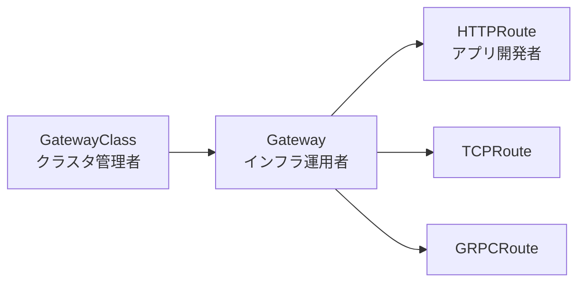

# Gateway API
{: .no_toc }

## 目次
{: .no_toc .text-delta }

1. TOC
{:toc}

---

**Gateway API** は Ingress の後継として登場した、より表現力の高いトラフィック制御 API です。
2023年に GA となり、Ingress NGINX、Istio、Cilium などが対応しています。

## なぜ Gateway API か

Ingress の課題:

- アノテーションが Controller 依存で標準化されない
- ロール分離(クラスタ管理者 / アプリ開発者)ができない
- L7 を超える機能(gRPC、TCP、UDP)を表現できない
- TLS 設定や複数バックエンドの重み付けが面倒

Gateway API はこれらを解決すべく、**役割ごとのリソース分離** を導入しています。

## 3層のリソース



| リソース | 担当者 | 役割 |
|---------|--------|------|
| GatewayClass | クラスタ管理者 | LB の実装(NGINX、Istio、…)を定義 |
| Gateway | インフラ運用者 | リスナーとIPを定義 |
| HTTPRoute / TCPRoute / GRPCRoute | アプリ開発者 | ルーティングルール |

## YAML例

```yaml
# GatewayClass (クラスタ全体で1つでOK)
apiVersion: gateway.networking.k8s.io/v1
kind: GatewayClass
metadata:
  name: nginx
spec:
  controllerName: k8s.io/ingress-nginx
---
# Gateway
apiVersion: gateway.networking.k8s.io/v1
kind: Gateway
metadata:
  name: prod-gateway
  namespace: prod
spec:
  gatewayClassName: nginx
  listeners:
  - name: http
    port: 80
    protocol: HTTP
---
# HTTPRoute
apiVersion: gateway.networking.k8s.io/v1
kind: HTTPRoute
metadata:
  name: todo
  namespace: prod
spec:
  parentRefs:
  - name: prod-gateway
  hostnames:
  - todo.local
  rules:
  - matches:
    - path:
        type: PathPrefix
        value: /api
    backendRefs:
    - name: todo-api
      port: 80
  - matches:
    - path:
        type: PathPrefix
        value: /
    backendRefs:
    - name: todo-frontend
      port: 80
```

## トラフィック分割 (重み付け)

```yaml
spec:
  rules:
  - backendRefs:
    - name: todo-api-stable
      port: 80
      weight: 90
    - name: todo-api-canary
      port: 80
      weight: 10
```

Ingress では Controller アノテーションでしかできなかったカナリア分割が、**標準仕様で書ける** ようになりました。

## いつ Gateway API を使うべきか

新規プロジェクトなら採用検討の価値あり。
ただし周辺ツール(cert-manager、external-dns など)の対応もあるため、**「使えるなら使う」「無理せず Ingress でも可」** が現状の現実解です。

本教材では基本演習は Ingress、後半の Service Mesh / Progressive Delivery の章で Gateway API を併用します。

## チェックポイント

- [ ] GatewayClass / Gateway / HTTPRoute の役割の違い
- [ ] Ingress と比べた Gateway API の利点を 2 つ
