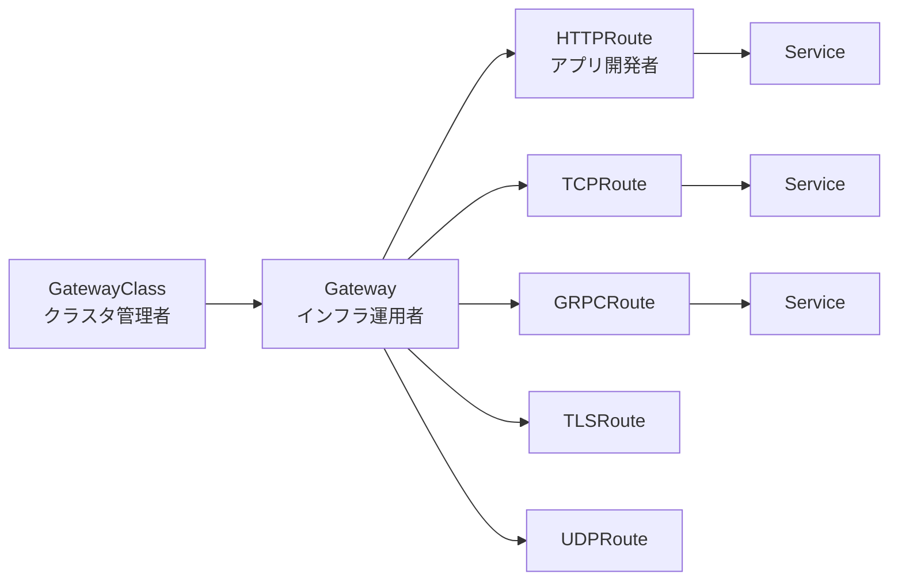
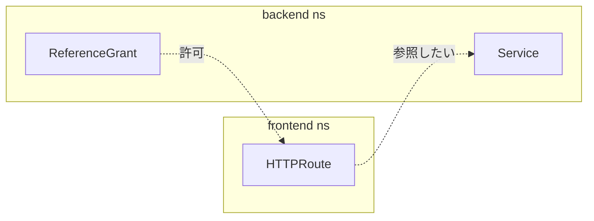
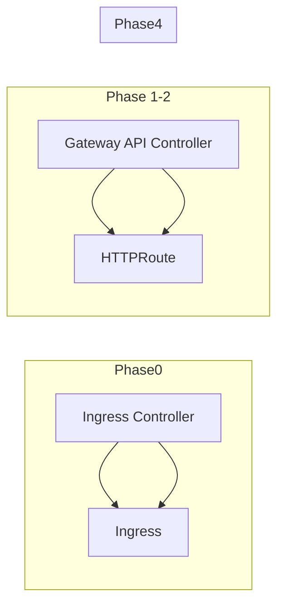
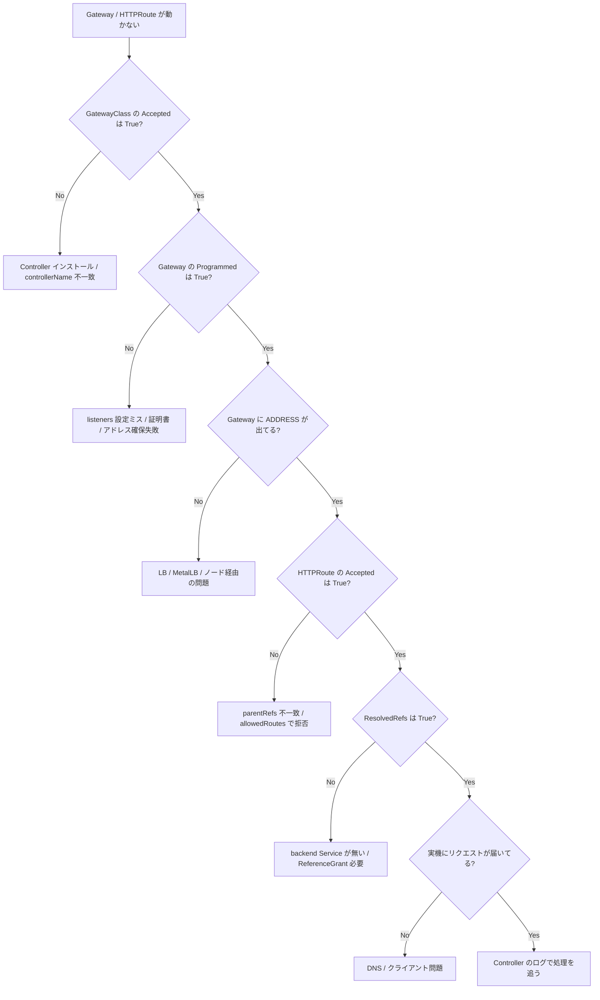
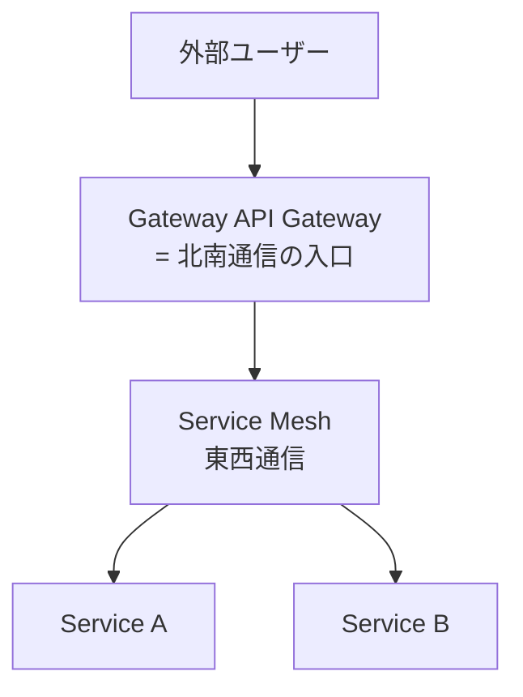

# Gateway API
{: .no_toc }

## 目次
{: .no_toc .text-delta }

1. TOC
{:toc}

---

## このページのゴール

このページを読み終えると、以下を **自分の言葉で説明できる** ようになります。

- なぜ Ingress の **次世代 API** として Gateway API が必要だったのか、Ingress の限界と設計の根本的な違い
- `GatewayClass` / `Gateway` / `HTTPRoute`(と `TCPRoute` / `TLSRoute` / `GRPCRoute` / `UDPRoute`)の **3 層リソースモデル** と各層の責務
- **役割分離(role-oriented)** という設計思想 ─ クラスタ管理者・インフラ運用者・アプリ開発者の権限分担
- HTTP のルーティング(path、header、method、queryParam)、フィルタ(リライト、リダイレクト、ヘッダ操作)、重み付きバックエンドの仕様
- `ReferenceGrant` による **クロス Namespace 参照** の安全な許可
- TLS 設定(`Terminate` / `Passthrough`)、リスナーごとの証明書、SNI ベースのルーティング
- Gateway API 実装(Ingress NGINX、Istio、Cilium、Envoy Gateway 等)の比較と選定軸
- Ingress からの移行戦略、両者の併用パターン
- 「Gateway 作ったのに `ADDRESS` が空」「Route が `Accepted: False`」のような典型トラブル

## このページのスコープ

本ページは **Kubernetes Gateway API**(`gateway.networking.k8s.io`)を扱います。
旧来の Ingress は [Ingress]({{ '/04-networking/ingress/' | relative_url }}) ページに、Service Mesh の Gateway(Istio や Envoy のもの)は第8章で扱います。
混同しがちな名前(Istio Gateway / API Gateway / Envoy Gateway)は後述の節で整理します。

## なぜ Gateway API か ─ Ingress の限界と設計の再考

### Ingress が抱える 3 つの根本問題

Ingress は 2015 年から存在し、デファクトとして使われてきました。しかし運用が進むにつれ、**Ingress の API そのものの設計** に起因する問題が無視できなくなりました。

#### 問題 1: アノテーション地獄

Ingress リソースの仕様は最低限です。**多くの実用機能はアノテーションで Controller 固有の挙動を呼び出す**形になっています。

```yaml
metadata:
  annotations:
    nginx.ingress.kubernetes.io/rewrite-target: /
    nginx.ingress.kubernetes.io/proxy-body-size: 10m
    nginx.ingress.kubernetes.io/canary: "true"
    nginx.ingress.kubernetes.io/canary-weight: "10"
    cert-manager.io/cluster-issuer: letsencrypt-prod
```

これは:

- 文字列値なのでスキーマ検証が効かない
- Controller を変えると全部書き直し
- アノテーションの仕様変更が知らないうちに起きる
- ドキュメントは Controller 公式に散らばる

という運用負荷を生みます。

#### 問題 2: ロール分離ができない

Ingress リソースは「クラスタ管理者が用意した Controller を使って、アプリ開発者が好きにルーティングを書く」モデルです。問題は:

- アプリ開発者が誤って `*` の host を書くと、他チームのトラフィックを奪える
- TLS 証明書の Secret 名は Ingress と同じ Namespace でないと参照できない(クロス Namespace 不可)
- LB の IP・ポート設定を「インフラ運用者だけが触る」ことができない

つまり、**「LB を運用する人」と「アプリのルーティングを書く人」を分離する API になっていない** のです。

#### 問題 3: L7 を超える表現力

Ingress は HTTP/HTTPS 専用です。

- TCP / UDP / TLS Passthrough を表現できない
- gRPC のメソッドや HTTP/2 の細かい制御が標準化されていない
- TLS 終端の細かい設定(SNI ベースのルーティング、複数リスナーごとの証明書)が表現できない

### Gateway API の設計判断

これらの問題を解決するため、SIG-Network が **新世代の API として Gateway API** を設計しました。
Gateway API の特徴は次のとおりです。

1. **役割ごとのリソース分離(role-oriented)** ─ クラスタ管理者・インフラ運用者・アプリ開発者で別リソース
2. **拡張性のある型付き API** ─ アノテーションではなく、各機能に専用フィールド
3. **L4/L7 統一** ─ HTTP / TCP / UDP / TLS を同じモデルで扱える
4. **ポータビリティ** ─ 同じ YAML が NGINX / Istio / Cilium で動く(コア機能の範囲で)
5. **拡張ポイントの明確化** ─ 実装固有機能は Custom Filter で(ただし portability が落ちることは明示)

### 歴史

| 時期 | 出来事 |
|------|--------|
| 2019 | SIG-Network が議論開始 |
| 2020 | `service-apis` として αlpha リリース |
| 2021 | 名称を `gateway.networking.k8s.io` に統一 |
| 2022 | βeta 昇格、HTTPRoute βeta |
| 2023年10月 | **`v1.0` GA**(`Gateway`、`GatewayClass`、`HTTPRoute` が安定版に) |
| 2024 | `GRPCRoute` GA、`ReferenceGrant` GA、`v1.1` |
| 2024〜 | Gateway API Inference Extension など拡張仕様の議論進行 |

### 関連リソース

- [Gateway API 公式](https://gateway-api.sigs.k8s.io/)
- [Gateway API GitHub](https://github.com/kubernetes-sigs/gateway-api)
- [Conformance テスト](https://gateway-api.sigs.k8s.io/concepts/conformance/)
- [Ingress→Gateway API 移行ガイド](https://gateway-api.sigs.k8s.io/guides/migrating-from-ingress/)

## 3 層のリソースモデル


```mermaid
flowchart LR
    GC[GatewayClass<br>クラスタ管理者] --> GW[Gateway<br>インフラ運用者]
    GW --> R1[HTTPRoute<br>アプリ開発者]
    GW --> R2[TCPRoute]
    GW --> R3[GRPCRoute]
    GW --> R4[TLSRoute]
    GW --> R5[UDPRoute]
    R1 --> S1[Service]
    R2 --> S2[Service]
    R3 --> S3[Service]
```

| リソース | 担当ロール | 役割 |
|---------|----------|------|
| `GatewayClass` | クラスタ管理者 | LB の実装(NGINX、Istio、…)を定義 |
| `Gateway` | インフラ運用者 | リスナー(IP、ポート、プロトコル、TLS)を定義 |
| `HTTPRoute` 等 | アプリ開発者 | ルーティングルール(host、path、backend) |

これは Ingress とは大きく違うアプローチです。Ingress では 1 リソースですべてを表現していたものを、**ロールごとに分離** したわけです。

### Ingress との対応関係(雑な対比)

| Ingress でやっていたこと | Gateway API での担当 |
|-----------------------|---------------------|
| `ingressClassName` | `GatewayClass` |
| LB の IP やポートの面倒 | `Gateway`(`listeners[]`) |
| TLS 証明書の参照 | `Gateway`(`listeners[].tls`) |
| host / path → backend | `HTTPRoute`(`rules[]`) |
| アノテーション | フィルタ、`backendRefs.weight`、専用フィールド |

## GatewayClass

クラスタ全体で使う「LB 実装の種類」を定義するクラスタスコープリソース。

```yaml
apiVersion: gateway.networking.k8s.io/v1
kind: GatewayClass
metadata:
  name: nginx
spec:
  controllerName: gateway.nginx.org/nginx-gateway-controller
  description: "NGINX Gateway Fabric"
```

| フィールド | 意味 |
|-----------|------|
| `metadata.name` | Gateway 側で `gatewayClassName: nginx` と参照する名前 |
| `spec.controllerName` | 実装側 Controller が **自分の名前として認識する識別子**。Controller の起動時に同じ名前を渡す |
| `spec.parametersRef` | 実装固有の追加設定リソース(任意) |
| `spec.description` | 人間向け説明 |

GatewayClass は **クラスタスコープ**(Namespace なし)で、通常はクラスタ管理者しか触れないようにします。

### 既定の GatewayClass

`v1.31` 時点では、Ingress のような **既定 class** の概念は標準化されていません。
明示的に `gatewayClassName` を書くのが原則。

## Gateway

LB のインフラ層を定義する Namespace スコープリソース。

```yaml
apiVersion: gateway.networking.k8s.io/v1
kind: Gateway
metadata:
  name: prod-gateway
  namespace: gateway-system
spec:
  gatewayClassName: nginx
  listeners:
  - name: http
    port: 80
    protocol: HTTP
  - name: https
    port: 443
    protocol: HTTPS
    tls:
      mode: Terminate
      certificateRefs:
      - kind: Secret
        name: todo-tls
  allowedRoutes:
    namespaces:
      from: Selector
      selector:
        matchLabels:
          gateway-access: "true"
```

### `spec.listeners[]`

Gateway の「待ち受けポート」のリスト。

| フィールド | 意味 |
|-----------|------|
| `name` | リスナー識別名(Route の `parentRefs.sectionName` で参照) |
| `port` | ポート番号 |
| `protocol` | `HTTP` / `HTTPS` / `TLS` / `TCP` / `UDP` |
| `hostname` | このリスナーがマッチする host(任意) |
| `tls.mode` | `Terminate` / `Passthrough` |
| `tls.certificateRefs[]` | TLS 証明書 Secret 参照 |
| `allowedRoutes` | このリスナーに紐付けられる Route の制限 |

#### `protocol` の種類

| protocol | 意味 |
|----------|------|
| `HTTP` | 平文 HTTP/1.x、HTTP/2 (h2c) |
| `HTTPS` | TLS で終端する HTTP/HTTPS |
| `TLS` | TLS そのもの(中身は Passthrough も可能) |
| `TCP` | 任意の TCP |
| `UDP` | 任意の UDP |

#### `tls.mode`

| mode | 意味 |
|------|------|
| `Terminate` | Gateway で TLS 終端、内部は平文 HTTP に |
| `Passthrough` | TLS を透過(SNI でルーティングだけして、終端は backend で) |

`Passthrough` は **mTLS を Pod まで届けたい場合** や、**Postgres / gRPC over TLS をそのまま通したい場合** に使います。

#### `allowedRoutes` ─ Gateway の境界制御

「この Gateway を使ってもよい Route はどこの Namespace から来たものか」を制限。

| 値 | 意味 |
|----|------|
| `Same`(既定) | 同 Namespace の Route のみ |
| `All` | 任意の Namespace から |
| `Selector` | ラベルセレクタにマッチする Namespace から |

これにより、「**インフラ運用者が用意した Gateway を、特定チームの Namespace からだけ使えるようにする**」が表現できます。

```yaml
allowedRoutes:
  namespaces:
    from: Selector
    selector:
      matchLabels:
        team: todo
```

### `spec.addresses`(任意)

Gateway に固定 IP を要求する場合(MetalLB との連携など):

```yaml
spec:
  addresses:
  - type: IPAddress
    value: 192.168.56.200
```

実装が要求を満たせなければ Gateway は `Accepted: False` になります。

### Gateway の status

Gateway を作ると、実装が `status` を埋めます。

```yaml
status:
  addresses:
  - type: IPAddress
    value: 192.168.56.200
  conditions:
  - type: Accepted
    status: "True"
    reason: Accepted
  - type: Programmed
    status: "True"
    reason: Programmed
  listeners:
  - name: http
    attachedRoutes: 2
    conditions:
    - type: Accepted
      status: "True"
    - type: ResolvedRefs
      status: "True"
```

| Condition | 意味 |
|-----------|------|
| `Accepted` | 設定が API 仕様に合致し、Controller が受理した |
| `Programmed` | 実機に設定が反映された |
| `ResolvedRefs` | 参照先(Secret 等)がすべて解決できた |
| `listeners[].attachedRoutes` | このリスナーに紐付いている Route 数 |

トラブル時はこの status を最初に見るのがコツです。

## HTTPRoute

HTTP/HTTPS のルーティングルールを書くアプリ開発者向けリソース。

```yaml
apiVersion: gateway.networking.k8s.io/v1
kind: HTTPRoute
metadata:
  name: todo
  namespace: prod
spec:
  parentRefs:
  - name: prod-gateway
    namespace: gateway-system
  hostnames:
  - todo.example.com
  rules:
  - matches:
    - path:
        type: PathPrefix
        value: /api
    backendRefs:
    - name: todo-api
      port: 80
  - matches:
    - path:
        type: PathPrefix
        value: /
    backendRefs:
    - name: todo-frontend
      port: 80
```

### `spec.parentRefs[]`

どの Gateway(またはリスナー)に紐付くか。

```yaml
parentRefs:
- name: prod-gateway
  namespace: gateway-system
  sectionName: https   # listeners[].name で指定したリスナーに限定
  port: 443            # 任意、明示すると曖昧さが減る
```

`sectionName` を指定すると、Gateway 内の **特定のリスナー** にだけ紐付きます。「HTTPS リスナーだけに紐付け、HTTP の方には別 Route を当てる」のような使い方が可能。

### `spec.hostnames[]`

このルールがマッチする host 名のリスト。Gateway 側のリスナー `hostname` と AND で評価されます。
ワイルドカードは `*.example.com` の形で前置のみ可。

### `spec.rules[]`

ルーティングルール。各ルールは:

- `matches[]` ─ どんなリクエストにマッチするか(OR で結合)
- `filters[]` ─ マッチしたリクエストに対する処理(リライト、ヘッダ操作)
- `backendRefs[]` ─ 転送先バックエンド(複数なら重み付き分散)
- `timeouts` ─ タイムアウト設定(`v1.1` で stable)

### `match` の種類

#### path マッチ

```yaml
- path:
    type: PathPrefix      # Exact / PathPrefix / RegularExpression
    value: /api
```

| `type` | 意味 |
|--------|------|
| `Exact` | 完全一致 |
| `PathPrefix` | セグメント単位の前方一致 |
| `RegularExpression` | 正規表現(実装オプション、Conformance 対象外) |

#### header マッチ

```yaml
- headers:
  - name: x-canary
    value: "true"
    type: Exact   # Exact / RegularExpression
```

#### method マッチ

```yaml
- method: POST
```

#### query parameter マッチ

```yaml
- queryParams:
  - name: env
    value: stage
```

#### 複合 match(AND)

1 つの `matches` 配下にある条件は **AND**:

```yaml
- matches:
  - path:
      type: PathPrefix
      value: /api
    method: POST
    headers:
    - name: content-type
      value: application/json
```

「`/api` で始まり、POST で、`Content-Type: application/json`」**全部** を満たすときマッチ。

#### 複数 match(OR)

```yaml
- matches:
  - path: { type: PathPrefix, value: /api }
  - path: { type: PathPrefix, value: /v2 }
  backendRefs:
  - name: api
    port: 80
```

`/api` または `/v2` のどちらかにマッチ。

### `backendRefs` ─ 重み付き分散

```yaml
- backendRefs:
  - name: todo-api-stable
    port: 80
    weight: 90
  - name: todo-api-canary
    port: 80
    weight: 10
```

カナリアリリースが **標準フィールドで書ける**(Ingress では Controller 固有のアノテーション必須だった)。

#### `kind` を変える(Service 以外)

```yaml
backendRefs:
- group: ""
  kind: Service
  name: todo-api
  port: 80
```

`group: ""`、`kind: Service` が既定。実装が対応していれば、CRD ベースの別リソース(`ServiceImport` など)も指定可能。

### `filters[]` ─ ルートフィルタ

リクエストを変形する処理。代表的なもの:

#### `RequestHeaderModifier` / `ResponseHeaderModifier`

```yaml
filters:
- type: RequestHeaderModifier
  requestHeaderModifier:
    set:
    - name: X-Forwarded-Host
      value: todo.example.com
    add:
    - name: X-Internal
      value: "true"
    remove:
    - X-Debug
```

#### `RequestRedirect`

```yaml
filters:
- type: RequestRedirect
  requestRedirect:
    scheme: https
    statusCode: 301
```

HTTP→HTTPS リダイレクトはこれで標準化されています。

#### `URLRewrite`

```yaml
filters:
- type: URLRewrite
  urlRewrite:
    path:
      type: ReplacePrefixMatch
      replacePrefixMatch: /
```

「`/api` で受けたものを backend には `/` として送る」(Ingress NGINX の `rewrite-target` 相当)。

#### `RequestMirror`

```yaml
filters:
- type: RequestMirror
  requestMirror:
    backendRef:
      name: shadow-api
      port: 80
```

トラフィックを **コピー** して別バックエンドに送る(本番のレスポンスはユーザーに、コピーは shadow に)。
新バージョンの本番トラフィックでの挙動を試すのに有効。

#### `ExtensionRef`

実装固有の拡張フィルタ。**ポータビリティが下がる** が、機能を呼び出せる。

### timeouts(`v1.1`)

```yaml
rules:
- timeouts:
    request: 30s        # リクエスト全体
    backendRequest: 10s # backend への接続単位
```

## TCPRoute / UDPRoute / TLSRoute / GRPCRoute

HTTPRoute 以外の Route 種別もあります。

### TCPRoute / UDPRoute(L4)

```yaml
apiVersion: gateway.networking.k8s.io/v1alpha2
kind: TCPRoute
metadata:
  name: postgres-route
  namespace: prod
spec:
  parentRefs:
  - name: tcp-gateway
    namespace: gateway-system
    sectionName: postgres
  rules:
  - backendRefs:
    - name: postgres
      port: 5432
```

Gateway 側のリスナーが `protocol: TCP` で待つようにしておきます。
**`v1alpha2` のまま**で、`v1` ではないので注意。

### TLSRoute(SNI ベースの L4 ルーティング)

```yaml
apiVersion: gateway.networking.k8s.io/v1alpha2
kind: TLSRoute
metadata:
  name: tls-passthrough
  namespace: prod
spec:
  parentRefs:
  - name: tls-gateway
    sectionName: tls-passthrough
  hostnames:
  - secure.example.com
  rules:
  - backendRefs:
    - name: secure-app
      port: 443
```

TLS の SNI を見て、終端せずに backend に Passthrough する場合に使います。

### GRPCRoute(`v1` GA)

```yaml
apiVersion: gateway.networking.k8s.io/v1
kind: GRPCRoute
metadata:
  name: api-grpc
  namespace: prod
spec:
  parentRefs:
  - name: prod-gateway
  hostnames:
  - api.example.com
  rules:
  - matches:
    - method:
        service: todo.v1.TodoService
        method: ListTodos
    backendRefs:
    - name: todo-grpc
      port: 50051
```

gRPC のサービス名・メソッド名で **L7 ルーティング** ができます。HTTPRoute でやろうとすると HTTP/2 のパスや擬似ヘッダを直に書くことになり面倒だったので、専用 Route として独立しました。

## ReferenceGrant ─ クロス Namespace 参照の安全な許可

セキュリティ上、Gateway API では **Namespace を跨いだ参照を既定で禁止** しています。
これは「他人の Secret や Service を勝手に参照できない」ための仕組みです。

許可するには `ReferenceGrant` リソースを **被参照側の Namespace** に作ります。

例: `gateway-system` Namespace の Gateway から、`prod` Namespace の TLS Secret を使いたい:

```yaml
apiVersion: gateway.networking.k8s.io/v1beta1
kind: ReferenceGrant
metadata:
  name: allow-gateway-to-secret
  namespace: prod
spec:
  from:
  - group: gateway.networking.k8s.io
    kind: Gateway
    namespace: gateway-system
  to:
  - group: ""
    kind: Secret
    name: todo-tls   # 名前を絞ると安全。書かなければ Namespace 全 Secret
```

同様に、HTTPRoute から別 Namespace の Service を呼ぶ場合も `ReferenceGrant` が必要:

```yaml
apiVersion: gateway.networking.k8s.io/v1beta1
kind: ReferenceGrant
metadata:
  name: allow-route-to-service
  namespace: backend
spec:
  from:
  - group: gateway.networking.k8s.io
    kind: HTTPRoute
    namespace: frontend
  to:
  - group: ""
    kind: Service
```


```mermaid
flowchart LR
    subgraph FE[frontend ns]
        route[HTTPRoute]
    end
    subgraph BE[backend ns]
        rg[ReferenceGrant]
        svc[Service]
    end
    route -.参照したい.-> svc
    rg -.許可.-> route
```

**「参照される側が許可を出す」** モデルなので、勝手にリソースを覗かれるリスクが排除されます。

## 実装(Controller)の選択肢

Gateway API は仕様で、実装は別途必要です。
主要実装の比較。

| 実装 | 由来 | 特徴 |
|------|------|------|
| **NGINX Gateway Fabric** | F5/NGINX 公式 | NGINX ベース、Conformance 対応 |
| **Ingress NGINX**(community)| Kubernetes コミュニティ | Gateway API は実験的、Ingress 中心 |
| **Istio** | Service Mesh | Istio Gateway として元から類似概念 |
| **Cilium** | eBPF / CNI | CNI と統合、L7 ポリシーと連携 |
| **Envoy Gateway** | Envoy 公式 | 「Envoy を Gateway API で運用する標準実装」 |
| **Contour** | VMware | Envoy ベース、すでに HTTPProxy CRD で類似経験 |
| **Traefik** | Traefik Labs | Gateway API サポートあり |
| **Kong Gateway Operator** | Kong | API Gateway 機能と統合 |
| **HAProxy Kubernetes Ingress** | HAProxy | Gateway API 対応 |
| **AWS Gateway API Controller** | AWS | EKS で AWS VPC Lattice と連携 |
| **GKE Gateway** | Google Cloud | GKE 上でクラウドネイティブな Gateway |

### Conformance テスト

Gateway API には **Conformance(適合性)テスト**が公式に用意されています。
実装が「コア機能をすべて満たしているか」「拡張機能のうちどれをサポートしているか」を機械的に検証できます。

[Conformance ステータス一覧](https://gateway-api.sigs.k8s.io/implementations/) で実装ごとの対応表が見られます。

### 選定指針

- **Ingress NGINX を使ってきた**: NGINX Gateway Fabric か Envoy Gateway へ
- **Istio Service Mesh を入れる予定**: Istio Gateway(Service Mesh と一体運用)
- **eBPF / Cilium で統一**: Cilium Gateway
- **クラウドネイティブな LB を使いたい**: GKE Gateway / AWS Gateway API Controller
- **Envoy をそのまま運用したい**: Envoy Gateway

本教材では学習しやすさを優先し、後述ハンズオンでは **NGINX Gateway Fabric** または **Envoy Gateway** を例にします。

## Ingress と Gateway API の併用 / 移行

### 移行は段階的に

既存の Ingress を一気に Gateway API に書き換えるのは大変です。
推奨される進め方:

1. **Phase 0**: Gateway API CRD と Controller を入れる(Ingress と並行稼働)
2. **Phase 1**: 新規アプリは Gateway API で書く
3. **Phase 2**: 既存 Ingress を 1 つずつ HTTPRoute へ移植
4. **Phase 3**: アノテーション固有機能を専用フィールドに置き換え
5. **Phase 4**: Ingress Controller を撤去


```mermaid
flowchart LR
    subgraph Phase0
        IC[Ingress Controller] --> IS[Ingress]
    end
    subgraph Phase1[Phase 1-2]
        IC --> IS
        GW[Gateway API Controller] --> RT[HTTPRoute]
    end
    subgraph Phase4
        GW --> RT
    end
```

### Ingress 1 個 → Gateway API への対応例

Ingress:

```yaml
apiVersion: networking.k8s.io/v1
kind: Ingress
metadata:
  name: todo
  namespace: prod
spec:
  ingressClassName: nginx
  tls:
  - hosts: [todo.example.com]
    secretName: todo-tls
  rules:
  - host: todo.example.com
    http:
      paths:
      - path: /api
        pathType: Prefix
        backend:
          service:
            name: todo-api
            port: { number: 80 }
      - path: /
        pathType: Prefix
        backend:
          service:
            name: todo-frontend
            port: { number: 80 }
```

Gateway API:

```yaml
# Gateway(共有・インフラ運用者が管理)
apiVersion: gateway.networking.k8s.io/v1
kind: Gateway
metadata:
  name: prod-gateway
  namespace: gateway-system
spec:
  gatewayClassName: nginx
  listeners:
  - name: http
    port: 80
    protocol: HTTP
  - name: https
    port: 443
    protocol: HTTPS
    hostname: "*.example.com"
    tls:
      mode: Terminate
      certificateRefs:
      - kind: Secret
        name: wildcard-tls
        namespace: gateway-system
  allowedRoutes:
    namespaces:
      from: All
---
# HTTPRoute(アプリチームが管理)
apiVersion: gateway.networking.k8s.io/v1
kind: HTTPRoute
metadata:
  name: todo
  namespace: prod
spec:
  parentRefs:
  - name: prod-gateway
    namespace: gateway-system
  hostnames:
  - todo.example.com
  rules:
  - matches:
    - path: { type: PathPrefix, value: /api }
    backendRefs:
    - name: todo-api
      port: 80
  - matches:
    - path: { type: PathPrefix, value: / }
    backendRefs:
    - name: todo-frontend
      port: 80
```

ポイント:

- TLS 証明書は Gateway 側に集約(チームごとに作らない)
- アプリ開発者は HTTPRoute だけ書く
- Wildcard 証明書を使えば、新規アプリは HTTPRoute 1 個で済む

### Annotation の置き換え

| Ingress NGINX アノテーション | Gateway API での書き方 |
|---------------------------|---------------------|
| `rewrite-target` | `URLRewrite` filter |
| `ssl-redirect` | `RequestRedirect` filter(HTTP リスナーから HTTPS へ) |
| `proxy-body-size` | 実装固有(現状ポータブル機能ではない) |
| `canary` + `canary-weight` | `backendRefs[].weight` で標準化 |
| `auth-url` | 実装固有 |
| `cors-allow-origin` | `RequestHeaderModifier`(部分的)or 拡張 |
| `proxy-read-timeout` | `timeouts.backendRequest`(`v1.1`) |
| `whitelist-source-range` | 実装固有(`Policy` 拡張で議論中) |

「**標準で書ける機能 / 書けない機能** の切り分け」を意識しながら移植していきます。

## ハンズオン: サンプルアプリを Gateway API で公開

### 1. CRD の導入

Gateway API は CRD なので、まず入れます。

```bash
# v1.1 標準チャネル
kubectl apply -f https://github.com/kubernetes-sigs/gateway-api/releases/download/v1.1.0/standard-install.yaml
```

これで `Gateway`、`GatewayClass`、`HTTPRoute`、`ReferenceGrant`、`GRPCRoute` が登録されます。
TCPRoute / UDPRoute / TLSRoute は experimental チャネル:

```bash
kubectl apply -f https://github.com/kubernetes-sigs/gateway-api/releases/download/v1.1.0/experimental-install.yaml
```

### 2. Controller のインストール(NGINX Gateway Fabric の例)

```bash
kubectl apply -f https://raw.githubusercontent.com/nginx/nginx-gateway-fabric/v1.4.0/deploy/manifests/nginx-gateway.yaml
```

Pod を確認:

```bash
kubectl get pods -n nginx-gateway
```

### 3. GatewayClass

CRD 適用と Controller 起動が終わると、GatewayClass はマニフェスト同梱で既に作られていることが多いです:

```bash
kubectl get gatewayclass
```

**期待される出力**:

```
NAME    CONTROLLER                                    ACCEPTED   AGE
nginx   gateway.nginx.org/nginx-gateway-controller    True       30s
```

### 4. Gateway

`gateway-system` Namespace を作って Gateway を置きます。

```yaml
apiVersion: v1
kind: Namespace
metadata:
  name: gateway-system
  labels:
    kubernetes.io/metadata.name: gateway-system
---
apiVersion: gateway.networking.k8s.io/v1
kind: Gateway
metadata:
  name: prod-gateway
  namespace: gateway-system
spec:
  gatewayClassName: nginx
  listeners:
  - name: http
    port: 80
    protocol: HTTP
    allowedRoutes:
      namespaces:
        from: All
```

```bash
kubectl apply -f gateway.yaml
kubectl get gateway -n gateway-system
```

**期待される出力**:

```
NAME           CLASS   ADDRESS         PROGRAMMED   AGE
prod-gateway   nginx   192.168.56.201  True         15s
```

### 5. HTTPRoute

```yaml
apiVersion: gateway.networking.k8s.io/v1
kind: HTTPRoute
metadata:
  name: todo
  namespace: prod
spec:
  parentRefs:
  - name: prod-gateway
    namespace: gateway-system
  hostnames:
  - todo.local
  rules:
  - matches:
    - path:
        type: PathPrefix
        value: /api
    backendRefs:
    - name: todo-api
      port: 80
  - matches:
    - path:
        type: PathPrefix
        value: /
    backendRefs:
    - name: todo-frontend
      port: 80
```

```bash
kubectl apply -f httproute.yaml
kubectl get httproute -n prod
```

**期待される出力**:

```
NAME   HOSTNAMES        AGE
todo   ["todo.local"]   10s
```

詳細(Conditions の確認):

```bash
kubectl describe httproute todo -n prod
```

`Status.Parents[0].Conditions` に `Accepted: True`、`ResolvedRefs: True` が出ていれば成功。

### 6. /etc/hosts と動作確認

```
192.168.56.201  todo.local
```

```bash
curl -i http://todo.local/
curl -i http://todo.local/api/health
```

### 7. カナリアリリースの追加

`todo-api` の v0.2.0 を 10% に流したい場合:

```yaml
rules:
- matches:
  - path: { type: PathPrefix, value: /api }
  backendRefs:
  - name: todo-api
    port: 80
    weight: 90
  - name: todo-api-canary
    port: 80
    weight: 10
```

`weight` の合計が 100 でなくても良いです(比率で按分)。

### 8. ヘッダベースの分岐(社内ユーザーだけ canary)

```yaml
rules:
- matches:
  - path: { type: PathPrefix, value: /api }
    headers:
    - name: x-user-segment
      value: internal
  backendRefs:
  - name: todo-api-canary
    port: 80
- matches:
  - path: { type: PathPrefix, value: /api }
  backendRefs:
  - name: todo-api
    port: 80
```

「`x-user-segment: internal` ヘッダを持つリクエストだけ canary、それ以外は通常版」という分岐が **YAML 標準** で書けます。

### 9. HTTP→HTTPS リダイレクト

Gateway 側に HTTP リスナーと HTTPS リスナーを両方用意し、HTTP 用の HTTPRoute はリダイレクトに専念:

```yaml
apiVersion: gateway.networking.k8s.io/v1
kind: HTTPRoute
metadata:
  name: redirect
  namespace: prod
spec:
  parentRefs:
  - name: prod-gateway
    namespace: gateway-system
    sectionName: http   # ← HTTP リスナーに限定
  hostnames:
  - todo.example.com
  rules:
  - filters:
    - type: RequestRedirect
      requestRedirect:
        scheme: https
        statusCode: 301
```

これで HTTP リスナーに来たすべてのリクエストが HTTPS にリダイレクトされます。

## デバッグ調査フロー


```mermaid
flowchart TD
    S[Gateway / HTTPRoute が動かない] --> Q1{GatewayClass の Accepted は True?}
    Q1 -->|No| F1[Controller インストール / controllerName 不一致]
    Q1 -->|Yes| Q2{Gateway の Programmed は True?}
    Q2 -->|No| F2[listeners 設定ミス / 証明書 / アドレス確保失敗]
    Q2 -->|Yes| Q3{Gateway に ADDRESS が出てる?}
    Q3 -->|No| F3[LB / MetalLB / ノード経由の問題]
    Q3 -->|Yes| Q4{HTTPRoute の Accepted は True?}
    Q4 -->|No| F4[parentRefs 不一致 / allowedRoutes で拒否]
    Q4 -->|Yes| Q5{ResolvedRefs は True?}
    Q5 -->|No| F5[backend Service が無い / ReferenceGrant 必要]
    Q5 -->|Yes| Q6{実機にリクエストが届いてる?}
    Q6 -->|No| F6[DNS / クライアント問題]
    Q6 -->|Yes| F7[Controller のログで処理を追う]
```

### 切り分けコマンド集

```bash
# GatewayClass 状態
kubectl get gatewayclass
kubectl describe gatewayclass nginx

# Gateway 状態と Conditions
kubectl get gateway -A
kubectl describe gateway prod-gateway -n gateway-system

# HTTPRoute 状態(Accepted / ResolvedRefs を必ず見る)
kubectl get httproute -A
kubectl describe httproute todo -n prod

# Conditions だけ抽出
kubectl get httproute todo -n prod -o jsonpath='{.status.parents[0].conditions}' | jq

# Controller のログ
kubectl logs -n nginx-gateway -l app.kubernetes.io/name=nginx-gateway-fabric --tail=200

# Listener ごとの attached routes 数
kubectl get gateway prod-gateway -n gateway-system -o jsonpath='{.status.listeners[*].attachedRoutes}'

# ReferenceGrant の有無
kubectl get referencegrant -A

# 直接 Gateway IP に curl
curl -i -H "Host: todo.local" http://$(kubectl get gateway prod-gateway -n gateway-system -o jsonpath='{.status.addresses[0].value}')/
```

### Status の見方の例

```yaml
status:
  parents:
  - parentRef:
      name: prod-gateway
      namespace: gateway-system
    controllerName: gateway.nginx.org/nginx-gateway-controller
    conditions:
    - type: Accepted
      status: "True"
      reason: Accepted
      message: The route is accepted
    - type: ResolvedRefs
      status: "False"
      reason: BackendNotFound
      message: Service "todo-api" not found
```

`ResolvedRefs: False` で `reason: BackendNotFound` なら **Service が無いか名前間違い**。
`Accepted: False` で `reason: NotAllowedByListeners` なら **Gateway の `allowedRoutes` で拒否されている**。

## エラーメッセージ → 対処の対応表

| 症状 | 原因 | 対処 |
|------|------|------|
| Gateway の `ADDRESS` が空 | LB プロバイダ未設定 / `addresses` が衝突 | MetalLB 確認、`addresses` 削除 |
| Gateway `Programmed: False` | リスナーの設定ミス | listeners の port/protocol/tls 確認 |
| HTTPRoute `Accepted: False` reason `NotAllowedByListeners` | Gateway の `allowedRoutes` で拒否 | Namespace ラベルか allowedRoutes 修正 |
| HTTPRoute `Accepted: False` reason `NoMatchingParent` | parentRefs の Gateway 名 / Namespace ミス | 名前を確認 |
| `ResolvedRefs: False` `BackendNotFound` | backend Service が存在しない or Namespace 違い | `kubectl get svc -A` |
| `ResolvedRefs: False` `RefNotPermitted` | クロス Namespace 参照に ReferenceGrant が無い | `ReferenceGrant` を被参照側に作成 |
| TLS 終端が動かない | Secret の Namespace が違う / ReferenceGrant 不足 | 同 Namespace に置くか ReferenceGrant |
| 404 が返る | Hostname / Path がどの Route にもマッチしていない | curl の Host ヘッダ確認、Route 確認 |
| カナリアの比率が反映されない | `backendRefs[].weight` の指定漏れ | weight 合計の按分を確認 |
| 同名の HTTPRoute が複数 Namespace に | parentRefs が重複 | 意図確認、または整理 |

## 落とし穴・運用上の注意

### 1. CRD バージョン

Gateway API は **CRD としてクラスタに入れる** ので、Controller のバージョンと CRD のバージョン整合が重要。

```bash
kubectl get crd gateways.gateway.networking.k8s.io -o jsonpath='{.spec.versions[*].name}'
```

`v1`、`v1beta1`、`v1alpha2` などが見えます。新しすぎる CRD と古い Controller の組み合わせは要注意。

### 2. `v1` と `v1alpha2` の混在

`Gateway` `GatewayClass` `HTTPRoute` は `v1` で stable ですが、`TCPRoute` `UDPRoute` `TLSRoute` は `v1alpha2` のままです(2025年時点)。
α 版は **後方互換が保証されない** ので、本番採用時は注意。

### 3. ロール分離の徹底

「アプリチームが Gateway を作れる権限を持っている」と Gateway API の意義が半減します。
RBAC で:

- クラスタ管理者 → `GatewayClass`(create/update/delete)
- インフラ運用者 → `Gateway`(create/update/delete in `gateway-system`)
- アプリ開発者 → `HTTPRoute` のみ(自分の Namespace)

のように分けるのが推奨。

### 4. Wildcard 証明書の管理

複数アプリで Wildcard 証明書を共有する設計が一般的ですが、Wildcard を持つ Namespace への参照を **ReferenceGrant で限定** しないと、誰でも使えてしまうので注意。

### 5. 実装固有機能(`ExtensionRef`)の使いすぎ

`ExtensionRef` で実装の独自フィルタを呼ぶと、その HTTPRoute は **他の実装に移植不能** になります。
ポータビリティを保ちたいなら、コア機能で書ける範囲に留める。

### 6. Gateway の数の設計

「アプリごとに Gateway を作る」「全社で 1 つの Gateway を共有」「環境ごとに(prod/staging)」など複数の戦略があります。

| 設計 | 利点 | 欠点 |
|------|------|------|
| 1 アプリ 1 Gateway | 影響範囲が小さい | LB 数が多い、コスト |
| 全社 1 Gateway | コスト・管理負荷低 | 障害ブラスト半径が大きい |
| 環境ごと | 中庸 | 環境間の差異 |
| チームごと | RBAC で自然な分離 | チーム数だけ Gateway |

実情に合わせて。

### 7. Service Mesh の Gateway との混同

Istio や Linkerd の Service Mesh は「Mesh の Gateway(東西通信の入口)」を持っており、混同しがちです。
**Service Mesh の `Gateway` リソースと、Gateway API の `Gateway` リソースは別物** ですが、Istio は Gateway API を **両方の操作インターフェース** として採用する方向に舵を切っており、将来的には統合されていきます。


```mermaid
flowchart TB
    user[外部ユーザー] --> ng[Gateway API Gateway<br>= 北南通信の入口]
    ng --> mesh[Service Mesh<br>東西通信]
    mesh --> svc1[Service A]
    mesh --> svc2[Service B]
```

## Service Mesh との位置関係

Gateway API は **クラスタへの入口(north-south)** を扱うのに対し、Service Mesh は **クラスタ内の Pod 間通信(east-west)** を扱うのが本来の住み分けです。
ただし両者は重なる部分もあり、

| 機能 | Gateway API(コア) | Service Mesh |
|------|-------------------|-------------|
| L7 ルーティング | ✅ | ✅ |
| 重み付け分散 / カナリア | ✅ | ✅ |
| TLS 終端 | ✅ | ✅(mTLS) |
| サーキットブレーカ | △(拡張) | ✅ |
| トラフィックミラーリング | ✅ | ✅ |
| 認証・認可 | △(拡張) | ✅ |
| 観測(トレース、メトリクス) | △(実装次第) | ✅ |
| 識別ベースのポリシー | ❌ | ✅(SPIFFE 等) |

将来的には Gateway API が east-west の表現も統一する案(`GAMMA` イニシアティブ)が進行中です。

## 主要フィールド一覧

### Gateway

|フィールド|意味|
|---|---|
|`spec.gatewayClassName`|どの GatewayClass を使うか|
|`spec.listeners[].name`|リスナー識別名|
|`spec.listeners[].port`|ポート番号|
|`spec.listeners[].protocol`|`HTTP` / `HTTPS` / `TLS` / `TCP` / `UDP`|
|`spec.listeners[].hostname`|マッチする host(任意)|
|`spec.listeners[].tls.mode`|`Terminate` / `Passthrough`|
|`spec.listeners[].tls.certificateRefs[]`|TLS Secret 参照|
|`spec.listeners[].allowedRoutes.namespaces.from`|`Same` / `All` / `Selector`|
|`spec.addresses[]`|要求する IP / Hostname|

### HTTPRoute

|フィールド|意味|
|---|---|
|`spec.parentRefs[]`|紐付ける Gateway / Listener|
|`spec.hostnames[]`|対象 host 名|
|`spec.rules[].matches[]`|マッチ条件(複数で OR)|
|`spec.rules[].matches[].path.type`|`Exact` / `PathPrefix` / `RegularExpression`|
|`spec.rules[].matches[].headers[]`|ヘッダ条件|
|`spec.rules[].matches[].method`|HTTP メソッド|
|`spec.rules[].matches[].queryParams[]`|クエリパラメータ条件|
|`spec.rules[].filters[]`|`RequestHeaderModifier` 等|
|`spec.rules[].backendRefs[]`|転送先(複数で重み付け)|
|`spec.rules[].timeouts.request`|リクエスト全体タイムアウト|

### ReferenceGrant

|フィールド|意味|
|---|---|
|`spec.from[].group`|参照元 API グループ|
|`spec.from[].kind`|参照元の種別|
|`spec.from[].namespace`|参照元 Namespace|
|`spec.to[].group`|参照先 API グループ|
|`spec.to[].kind`|参照先の種別|
|`spec.to[].name`|参照先名(任意、絞ると安全)|

## いつ Gateway API を使うべきか

新規プロジェクトなら採用検討の価値ありです。
ただし周辺ツール(cert-manager、external-dns など)の対応状況や、組織の運用文化(ロール分離が機能するか)も含めて判断します。

| 状況 | 推奨 |
|------|------|
| 新規構築、複数チームで運用 | Gateway API |
| 既存 Ingress で問題なし、組織が小さい | Ingress 継続でも可 |
| Service Mesh を入れる / 入れている | Gateway API(Mesh 統合) |
| 動的なトラフィック制御が要件 | Gateway API + Argo Rollouts |
| クラウドのフルマネージド LB を活かす | クラウド版 Gateway API Controller |

「**使えるなら使う、無理せず Ingress でも可**」が現状の現実解です。

本教材では、第04章の演習は Ingress を主軸に据えつつ、第8章(Service Mesh)・第9章(Progressive Delivery)で Gateway API の本領を体験する流れにしています。

## チェックポイント

ここまでで以下を **自分の言葉で** 説明できるか確認してください。

- [ ] Ingress の根本的な 3 つの問題(アノテーション地獄・ロール分離不可・L7 限定)を挙げられる
- [ ] `GatewayClass` / `Gateway` / `HTTPRoute` の役割と担当者を説明できる
- [ ] HTTPRoute の `matches` で path / header / method / queryParam を組み合わせる例を書ける
- [ ] `backendRefs[].weight` でカナリアリリースを書ける
- [ ] `URLRewrite` / `RequestRedirect` / `RequestMirror` フィルタの用途を 1 行で言える
- [ ] `ReferenceGrant` が必要なケースと、どこ(被参照側)に作るかを説明できる
- [ ] `tls.mode` の `Terminate` と `Passthrough` の違いを実例で言える
- [ ] `allowedRoutes` で Gateway の利用範囲を Namespace 単位で制限できる
- [ ] HTTPRoute の `Accepted: False` `ResolvedRefs: False` のときに何を確認すべきか
- [ ] Ingress から Gateway API への段階的移行ステップを説明できる
- [ ] Service Mesh の Gateway と Gateway API の `Gateway` の違いを説明できる

→ 第04章のまとめページへ戻る: [04. ネットワーキング]({{ '/04-networking/' | relative_url }})
