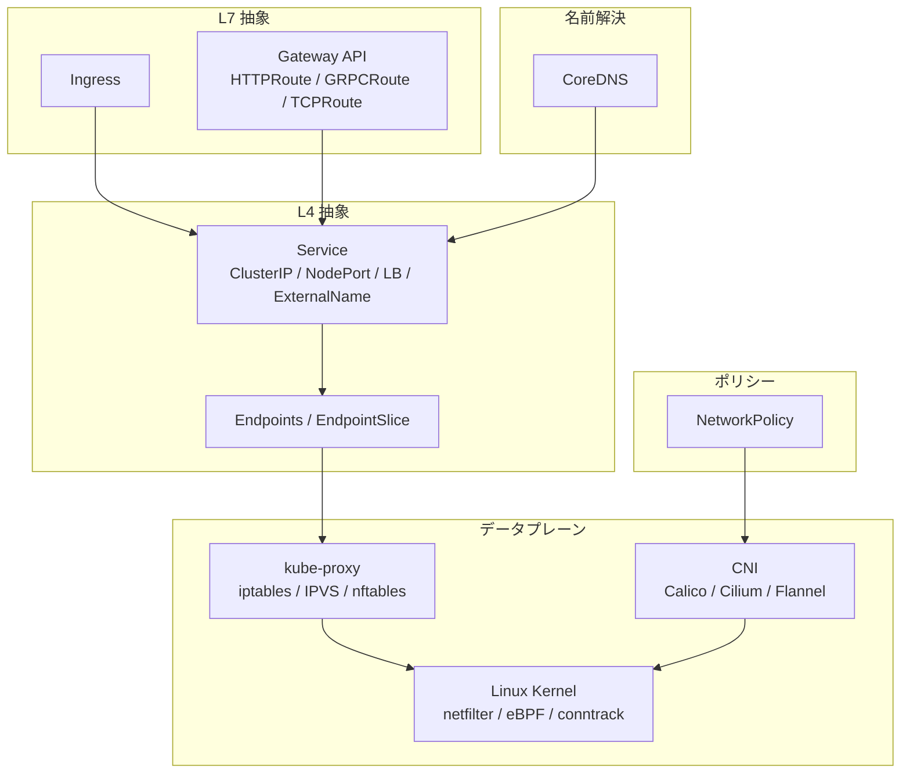
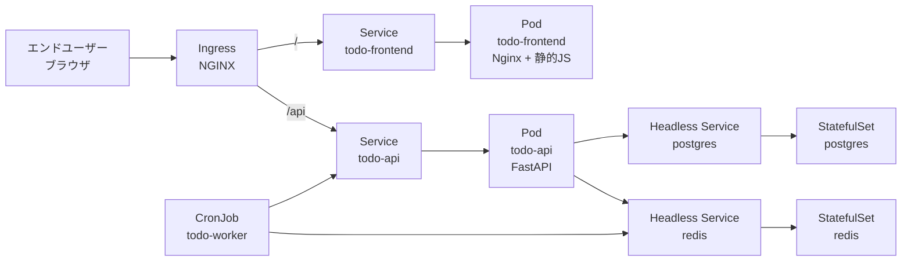

# 04. ネットワーキング
{: .no_toc }

## 目次
{: .no_toc .text-delta }

1. TOC
{:toc}

---

## この章のゴール

この章を読み終えると、以下を **自分の言葉で説明できる** ようになります。

- Kubernetes が採用している **「Pod IP は使い捨て、Service が安定アドレス」** という設計思想と、その歴史的背景
- ClusterIP / NodePort / LoadBalancer / ExternalName / Headless Service の使い分けと、それぞれが内部的にどう実装されているか(kube-proxy、iptables、IPVS、eBPF)
- Ingress と Ingress Controller の関係、L7 ルーティングが Service だけでは実現できない理由、TLS 終端の設計
- NetworkPolicy による Pod 間ファイアウォール設計と、ゼロトラストネットワークへの移行手順
- CoreDNS が提供する Kubernetes 内部 DNS の仕様(`<svc>.<ns>.svc.cluster.local`、Headless / StatefulSet の扱い、`ndots:5` の落とし穴)
- Gateway API が Ingress の何を解決し、いつ採用すべきか

## 章全体の見取り図

ネットワーキングは Kubernetes の中で **抽象化のレベルが何段にも積み重なっている** 領域です。
最下層では Linux カーネルの iptables / netfilter / IPVS / eBPF が Pod 間パケットを実際に運び、その上に Service / Endpoints / EndpointSlice という抽象がのり、さらに上に Ingress / Gateway API が L7 のセマンティクスを与えます。
そして横軸として CoreDNS が名前解決を提供し、NetworkPolicy がファイアウォール層を提供します。

各レイヤを **そのレイヤだけ** で語るのは簡単ですが、実運用のトラブルシュートでは「どの層で詰まっているのか」を切り分ける力が必要になります。本章では各リソースの API だけでなく、**そのリソースがクラスタ内でどう実装されているか** まで踏み込んで説明します。

## 前提知識

この章を最大限に活かすために、以下の知識があると望ましいです(なくても読み進められますが、適宜参照してください)。

- **Linux ネットワーキングの基礎**: iptables / netfilter のチェーン構造、conntrack、ルーティングテーブル
- **TCP/IP の基礎**: 3-way handshake、TCP/UDP の違い、ARP、MTU
- **DNS の基礎**: A/AAAA/CNAME レコード、再帰問い合わせ、TTL、`/etc/resolv.conf` の `search` ディレクティブ
- **L7 プロトコルの基礎**: HTTP の Host ヘッダ、TLS の SNI、gRPC の上に乗る HTTP/2
- **第02章「リソースの基礎」までの内容**(Pod、Deployment、Service の最低限の YAML を書いたことがある状態)

知識が薄い箇所は、各ページ内で「補足」「歴史」のセクションをかなり厚めに書いてあるので、初見でも追いつけるようになっています。

## サンプルアプリ「ミニTODOサービス」の振り返り

第02〜03章で組み立てた **ミニTODOサービス** をネットワーク面から拡張していきます。
全体構成は次のとおりです。

本章では特に以下の演習を行います。

1. **Service** ─ `todo-api` を ClusterIP、`todo-frontend` を NodePort、`postgres` を Headless で公開する
2. **Ingress** ─ `todo.local` に対して `/api` を `todo-api` へ、`/` を `todo-frontend` へ振り分ける
3. **NetworkPolicy** ─ `prod` Namespace を Default Deny にし、「Frontend → API → DB / Cache」だけ許可する
4. **DNS** ─ `postgres-0.postgres.prod.svc.cluster.local` で StatefulSet の特定 Pod を狙えることを確認する
5. **Gateway API**(オプション) ─ Ingress を HTTPRoute に書き換えて、重み付きカナリア分割を体験する

## 推奨される読み順

このサブディレクトリの md ファイルは `nav_order` 順に並んでいますが、内容としては以下の順で読むのがおすすめです。

1. [Service]({{ '/04-networking/service/' | relative_url }}) ─ まず L4 の安定アドレスを理解
2. [DNSとサービスディスカバリ]({{ '/04-networking/dns/' | relative_url }}) ─ Service と表裏一体で語られる名前解決
3. [Ingress]({{ '/04-networking/ingress/' | relative_url }}) ─ L7 ルーティングと外部公開
4. [NetworkPolicy]({{ '/04-networking/networkpolicy/' | relative_url }}) ─ Pod 間ファイアウォールでゼロトラスト化
5. [Gateway API]({{ '/04-networking/gateway-api/' | relative_url }}) ─ Ingress の次世代 API

第1〜3章で扱った Pod / Deployment / Service の基礎が前提です。
第7章以降では本章のリソース(Ingress、Gateway API)に MetalLB + cert-manager + external-dns を組み合わせ、本物の DNS 名+TLS で公開する構成を扱います。

{: .note }
> 本章のサンプルは Minikube でも動きますが、Ingress Controller の有効化方法や LoadBalancer Type の挙動は環境差があります。各ページに `# Minikube` `# kubeadm クラスタ` のラベル付きで併記しています。

## 用語の整理

ネットワーキング章は用語が多いので、最初にまとめて整理しておきます。

| 用語 | 意味 |
|------|------|
| **Pod IP** | 各 Pod に割り当てられるクラスタ内固有の IP。Pod が再作成されると変わる。 |
| **ClusterIP** | Service が持つ仮想 IP。クラスタ内からのみ到達可能。 |
| **NodePort** | 各ノードの 30000-32767 のポートに割り当てられる外部公開ポート。 |
| **kube-proxy** | 各ノードで動き、Service の仮想 IP を Pod へ転送するプロキシ(実装は iptables/IPVS/nftables/eBPF)。 |
| **Endpoints / EndpointSlice** | Service の selector にマッチする Pod の IP 一覧。 |
| **CNI (Container Network Interface)** | Pod ネットワークを実装するプラグイン規格。Calico / Cilium / Flannel など。 |
| **Ingress Controller** | Ingress リソースを実際に処理する L7 リバースプロキシ(NGINX、Traefik、HAProxy など)。 |
| **CoreDNS** | Kubernetes クラスタ内の DNS サーバ。`kube-system` Namespace に常駐。 |
| **NetworkPolicy** | Pod 間通信のファイアウォールルール。CNI が対応していて初めて有効。 |
| **Gateway API** | Ingress の後継として設計された L4/L7 ルーティング API。 |
| **conntrack** | Linux カーネルの接続追跡テーブル。NAT を伴う Service 通信で重要。 |

## チェックポイント

ここまでで以下を **自分の言葉で** 説明できるか確認してください。

- [ ] Kubernetes ネットワーキングの「層構造」(L4 抽象 / L7 抽象 / データプレーン / ポリシー / DNS)を絵で描ける
- [ ] Pod IP ではなく Service IP を使う理由を一言で言える
- [ ] CNI と kube-proxy の責務の違いを説明できる
- [ ] 本章で扱う 5 つのリソース(Service / Ingress / NetworkPolicy / CoreDNS / Gateway API)それぞれの役割を一行で書ける
- [ ] サンプルアプリのトラフィック経路を図で描ける(エンドユーザー → Ingress → Service → Pod → DB)

→ 次は [Service]({{ '/04-networking/service/' | relative_url }})
