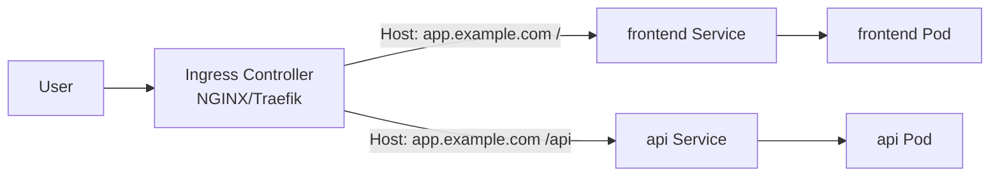

# Ingress
{: .no_toc }

## 目次
{: .no_toc .text-delta }

1. TOC
{:toc}

---

**Ingress** は HTTP/HTTPS 用の L7 ルーティングを定義するリソース。
ホスト名やパスでバックエンド Service を切り替えられます。



## Ingress Controller のインストール

Ingress リソースは **Ingress Controller** がいないと動きません。
本教材では NGINX Ingress Controller を使います。

```bash
# Minikube
minikube addons enable ingress

# kubeadm クラスタ
kubectl apply -f https://raw.githubusercontent.com/kubernetes/ingress-nginx/main/deploy/static/provider/baremetal/deploy.yaml
```

## YAML例: サンプルアプリの公開

```yaml
apiVersion: networking.k8s.io/v1
kind: Ingress
metadata:
  name: todo
  annotations:
    nginx.ingress.kubernetes.io/rewrite-target: /
spec:
  ingressClassName: nginx
  rules:
  - host: todo.local
    http:
      paths:
      - path: /api
        pathType: Prefix
        backend:
          service:
            name: todo-api
            port:
              number: 80
      - path: /
        pathType: Prefix
        backend:
          service:
            name: todo-frontend
            port:
              number: 80
```

`/etc/hosts` に `todo.local` を追加して動作確認:

```
192.168.56.21  todo.local
```

## TLS

```yaml
spec:
  tls:
  - hosts:
    - todo.local
    secretName: todo-tls
```

cert-manager と Let's Encrypt の組み合わせが定番ですが、ローカル環境では mkcert で自己署名する方法を 7 章で扱います。

## pathType

| pathType | 挙動 |
|----------|------|
| Exact | 完全一致 |
| Prefix | 前方一致 (`/api` は `/api/*` にマッチ) |
| ImplementationSpecific | Controller 依存 |

## アノテーションでの拡張

NGINX Ingress では多くの動作をアノテーションで制御できます。

```yaml
metadata:
  annotations:
    nginx.ingress.kubernetes.io/proxy-body-size: 10m
    nginx.ingress.kubernetes.io/rate-limit: "100"
    nginx.ingress.kubernetes.io/ssl-redirect: "true"
    nginx.ingress.kubernetes.io/whitelist-source-range: "192.168.56.0/24"
```

ただしアノテーション地獄になりやすく、**Gateway API への移行が標準化されつつある** のは押さえておきましょう。

## Ingress と Service の使い分け

| | Service (LoadBalancer) | Ingress |
|---|---|---|
| レイヤー | L4 | L7 |
| ホスト名/パス分岐 | 不可 | 可 |
| TLS終端 | 不可 | 可 |
| 課金 | LB ごと | 1個でまとめられる |

実運用では **複数アプリを 1 つの Ingress でまとめて公開する** のが一般的です。

## チェックポイント

- [ ] Service と Ingress の役割の違いを説明できる
- [ ] Ingress Controller を入れずに Ingress を作るとどうなるか
- [ ] 同じドメインで `/api` と `/` を別 Service にルーティングできる
