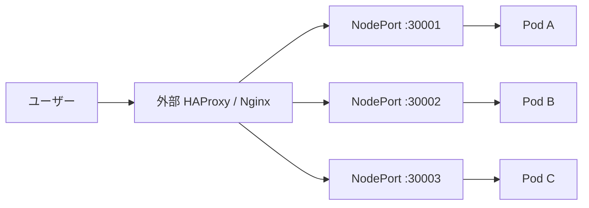
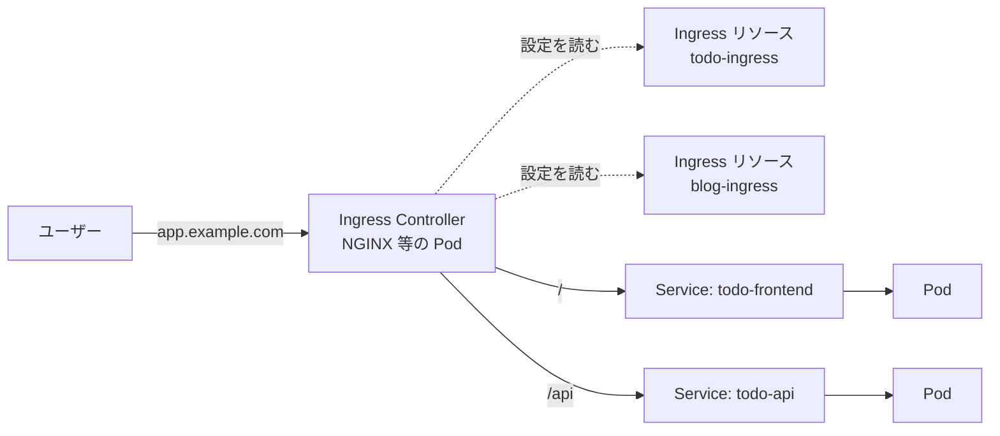
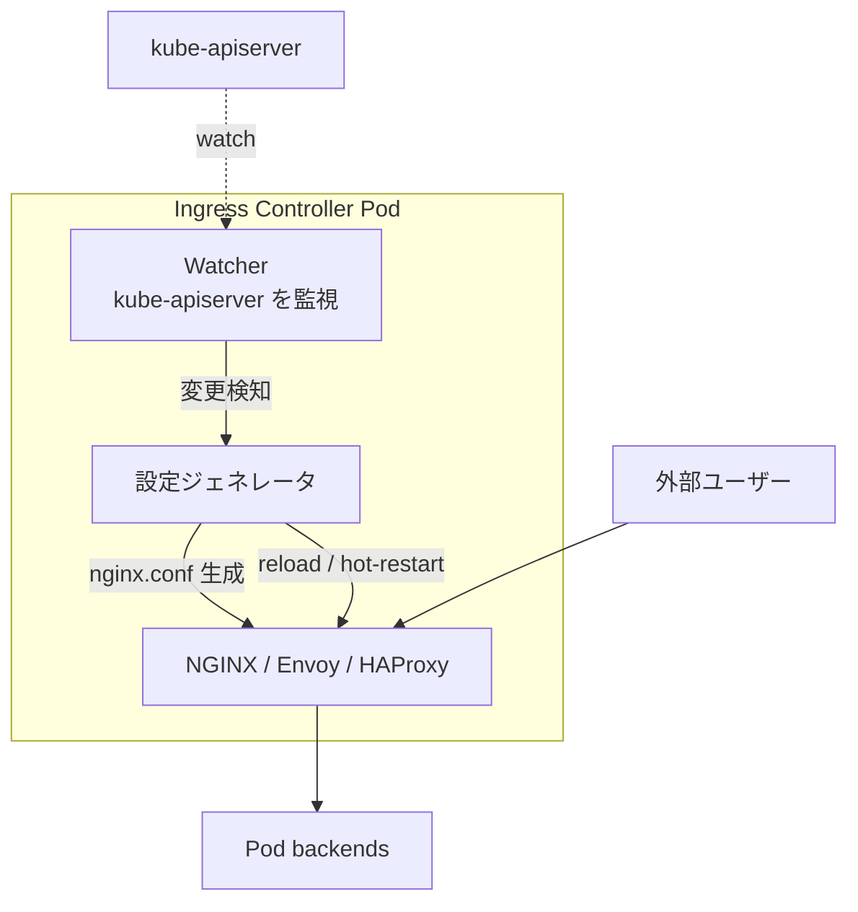
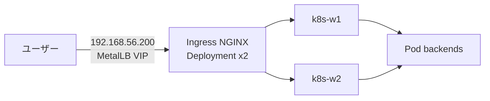
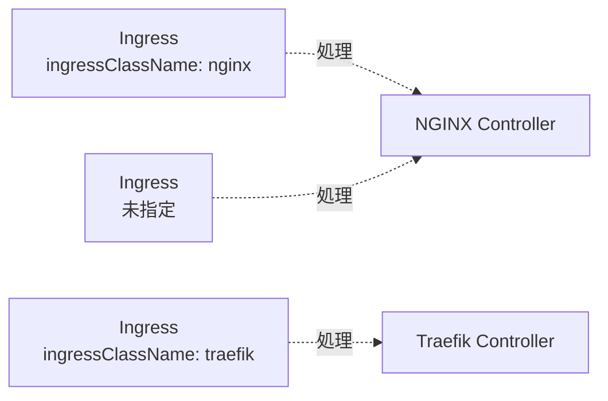
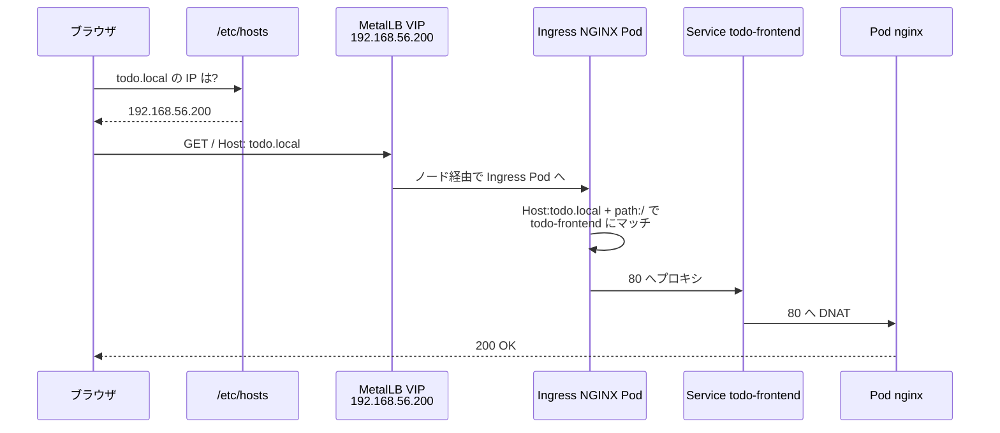

# Ingress
{: .no_toc }

## 目次
{: .no_toc .text-delta }

1. TOC
{:toc}

---

## このページのゴール

このページを読み終えると、以下を **自分の言葉で説明できる** ようになります。

- Service だけでは実現できない L7 ルーティングの何を Ingress が担うか、なぜ別リソースとして切り出されたか
- Ingress リソースと Ingress Controller の関係、Controller を入れずに Ingress だけ作るとどうなるか
- 主要な Ingress Controller(NGINX、Traefik、HAProxy、Istio Gateway 等)の比較と選定軸
- `pathType` の `Exact` / `Prefix` / `ImplementationSpecific` の違い
- ホスト名ベース、パスベースのルーティング、複数バックエンドの設定
- TLS 終端の設定、cert-manager との連携、SNI、HTTP→HTTPS リダイレクト
- IngressClass による複数 Controller の併用と、`ingressClassName` フィールドの意味
- NGINX Ingress の主要アノテーション(rewrite、rate-limit、proxy-body-size、whitelist、auth)の意図
- ありがちなトラブル(404、502/504、TLS が効かない、外部 IP が `<pending>` 等)の切り分け

## このページのスコープ

本ページは **HTTP/HTTPS の L7 リバースプロキシ** としての Ingress を扱います。
TCP/UDP の L4 公開は [Service]({{ '/04-networking/service/' | relative_url }})、Ingress の後継として設計された Gateway API は [Gateway API]({{ '/04-networking/gateway-api/' | relative_url }}) を参照してください。

## なぜ Ingress が必要か ─ 設計の根拠と歴史

### Service だけでは足りないこと

`type: LoadBalancer` の Service を使えば、外部から Pod へアクセスは可能です。
しかし、現代の Web アプリは「1 つのドメインの下にフロントと API を同居させる」「URL パスでサブシステムを分ける」「TLS で暗号化する」のが当たり前で、これらは **L4 の Service では表現できません**。

具体的に困ること:

| やりたいこと | Service での可否 |
|------------|-----------------|
| `app.example.com` と `admin.example.com` を別 Pod に振り分け | ❌(ホスト名はL7情報) |
| `/api` を `todo-api` に、`/` を `todo-frontend` に | ❌(パスはL7情報) |
| TLS 終端(LB で復号して内部は HTTP) | ❌(TLS は L7) |
| `Host` ヘッダ書き換え、`X-Forwarded-For` 付与 | ❌ |
| HTTP→HTTPS リダイレクト | ❌ |
| アプリごとに別ドメイン → 1 つの公開 IP に集約 | △(LB を毎回作るとコスト増) |

これらを Service で無理に解こうとすると、**アプリごとに LB を 1 つずつ用意し、外部 DNS で振り分ける** ような構成になり、コストも管理負荷も大きくなります。

### Ingress 以前の解決手段(歴史)

Kubernetes に Ingress が入ったのは `v1.1`(2015年)、安定化されたのは `networking.k8s.io/v1` で `v1.19`(2020年)です。
それ以前、人々はこんな方法で L7 を実現していました。


```mermaid
flowchart LR
    user[ユーザー] --> ext[外部 HAProxy / Nginx]
    ext --> np1[NodePort :30001]
    ext --> np2[NodePort :30002]
    ext --> np3[NodePort :30003]
    np1 --> pod1[Pod A]
    np2 --> pod2[Pod B]
    np3 --> pod3[Pod C]
```

具体的には:

1. **クラスタ外の HAProxy/Nginx + NodePort**: Service ごとに NodePort を払い出し、外部の LB が NodePort へ振り分ける。NodePort の番号が変わると外部 LB の設定も追従が必要
2. **Service ごとに LoadBalancer**: クラウド環境で 1 アプリ 1 LB。クラウド料金が膨らむ
3. **`kube-proxy` 的なものを自作**: 各社が独自の controller を作って Service の変化を監視し、設定を自動生成

これらの問題は、「アプリ開発者が L7 ルーティングを Kubernetes の YAML として表現する手段がない」ことでした。
Ingress はこの欠落を埋めるために導入されました。

### Ingress の設計判断

Kubernetes が選んだのは、**「API は Kubernetes が定義する。実装は controller が好きに作る」** という分離です。

- `Ingress` リソースの YAML は標準化されている
- そのリソースを「実際に処理する」のは **Ingress Controller**(NGINX、Traefik 等)
- Controller を入れないと、Ingress YAML を書いても何も起きない

これにより、ユーザーは

- 既存の HAProxy 知識のある会社は HAProxy Controller を選ぶ
- パフォーマンス志向なら NGINX や Envoy ベース
- 設定をコードで自動生成したいなら Traefik

のように **既存資産・運用文化に合わせた選択** ができます。

ただしこの分離は副作用も生みました。**Controller ごとに機能差・アノテーション差** が生まれ、移植性が落ちる問題は「Ingress の限界」として後年の Gateway API 登場の動機になります。

### 関連標準・リソース

- [KEP-1453: Graduate Ingress to GA](https://github.com/kubernetes/enhancements/tree/master/keps/sig-network/1453-ingress-api)
- [Ingress NGINX Controller GitHub](https://github.com/kubernetes/ingress-nginx)
- [Traefik](https://traefik.io/)
- [Kubernetes 公式: Ingress Controllers](https://kubernetes.io/docs/concepts/services-networking/ingress-controllers/)

## Ingress と Ingress Controller の関係


```mermaid
flowchart LR
    user[ユーザー] -->|app.example.com| ic[Ingress Controller<br>NGINX 等の Pod]
    ic -.設定を読む.-> ing1[Ingress リソース<br>todo-ingress]
    ic -.設定を読む.-> ing2[Ingress リソース<br>blog-ingress]
    ic -->|/| feSvc[Service: todo-frontend]
    ic -->|/api| apiSvc[Service: todo-api]
    feSvc --> fePod[Pod]
    apiSvc --> apiPod[Pod]
```

- **Ingress リソース** は YAML の宣言。「`/api` は `todo-api` に振って」という **意図** を書く
- **Ingress Controller** はクラスタ内で動く Pod。Ingress リソースを watch し、自分の中の HTTP プロキシ(nginx.conf など)を書き換えて、実際にトラフィックを処理する
- Controller がいなければ、Ingress を作っても **何も起きない**(YAML がただ etcd に保存されるだけ)

### Ingress Controller の正体

Controller は普通の Kubernetes Pod です。中身は実装によりますが、典型的には:

- **Watch ループ**: API サーバから Ingress / Service / Endpoints / Secret の変更を購読
- **設定生成器**: 内部の HTTP プロキシ(nginx、Envoy、HAProxy 等)の設定ファイルを生成
- **HTTP プロキシ本体**: 実際にリクエストを処理する


```mermaid
flowchart TB
    subgraph Pod[Ingress Controller Pod]
        watcher[Watcher<br>kube-apiserver を監視]
        gen[設定ジェネレータ]
        proxy[NGINX / Envoy / HAProxy]
        watcher -->|変更検知| gen
        gen -->|nginx.conf 生成| proxy
        gen -->|reload / hot-restart| proxy
    end
    api[kube-apiserver] -.watch.-> watcher
    user[外部ユーザー] --> proxy
    proxy --> backend[Pod backends]
```

NGINX Ingress Controller の場合、`nginx.conf` を再生成しては `nginx -s reload`(もしくはダイナミック設定 API)で反映するという、伝統的な仕組みで動いています。

## Ingress Controller の選択肢

主要な実装の比較。

| Controller | 中身 | ライセンス | 強み | 弱み |
|-----------|------|----------|------|------|
| **Ingress NGINX** (公式) | OSS NGINX | Apache 2.0 | デファクト、ドキュメント豊富 | アノテーション地獄、reload ベース |
| **NGINX Ingress** (F5) | NGINX/NGINX Plus | OSS / 商用 | 商用サポート、CRD ベース | 名前が紛らわしい |
| **Traefik** | Go 製 | MIT | CRD 中心、自動設定生成 | 大規模で性能差、独自概念多い |
| **HAProxy Ingress** | HAProxy | Apache 2.0 | 性能、セッション固定 | アノテーション中心 |
| **Istio Gateway** | Envoy | Apache 2.0 | mTLS、トラフィック制御 | Service Mesh 前提で重い |
| **Contour** | Envoy | Apache 2.0 | HTTPProxy CRD、複数チーム前提 | ユーザー数少なめ |
| **Kong Ingress** | Kong (OpenResty) | Apache 2.0 | API ゲートウェイ機能 | 学習コストあり |
| **Cilium Ingress** | Envoy + eBPF | Apache 2.0 | CNI と一体、L7 ポリシー連携 | Cilium 前提 |
| **AWS Load Balancer Controller** | ALB | Apache 2.0 | EKS のフルマネージド ALB | EKS 限定 |

{: .important }
> **「Ingress NGINX」と「NGINX Ingress」は別物** です。前者は Kubernetes 公式コミュニティの実装(`kubernetes/ingress-nginx`)、後者は F5/NGINX 社の公式実装(`nginxinc/kubernetes-ingress`)で、対応するアノテーションや CRD が違います。本教材では前者の **Ingress NGINX**(community)を使います。

### 選定の指針

- **学習・標準的な構成**: Ingress NGINX(本教材の選択)
- **すでに Istio を使う or 入れる予定**: Istio Gateway
- **マルチテナントで CRD で扱いたい**: Contour、Traefik
- **クラウド固有のフルマネージド LB を活かしたい**: AWS LB Controller、GKE Ingress
- **eBPF/Cilium で統一**: Cilium Ingress

## Ingress Controller のインストール

### Minikube

```bash
minikube addons enable ingress
```

これだけで `ingress-nginx` Namespace に Ingress NGINX Controller が起動します。

確認:

```bash
kubectl get pods -n ingress-nginx
```

**期待される出力**:

```
NAME                                       READY   STATUS    RESTARTS   AGE
ingress-nginx-controller-xxxxxxx-xxxxx     1/1     Running   0          30s
```

### kubeadm クラスタ(本教材の VMware 環境)

bare-metal 向けの公式マニフェストを使います。MetalLB が入っていれば LoadBalancer Type、なければ NodePort で公開されます。

```bash
kubectl apply -f https://raw.githubusercontent.com/kubernetes/ingress-nginx/main/deploy/static/provider/baremetal/deploy.yaml
```

このマニフェストは:

- `ingress-nginx` Namespace を作成
- `Deployment` で Controller Pod を起動
- `Service` を NodePort で公開(MetalLB 入りなら LoadBalancer に書き換え)
- `IngressClass` リソース `nginx` を作成
- 必要な ServiceAccount / Role / RoleBinding を作成

### Helm でのインストール(本番推奨)

```bash
helm repo add ingress-nginx https://kubernetes.github.io/ingress-nginx
helm repo update

helm install ingress-nginx ingress-nginx/ingress-nginx \
  --namespace ingress-nginx --create-namespace \
  --set controller.service.type=LoadBalancer \
  --set controller.replicaCount=2 \
  --set controller.metrics.enabled=true
```

オプションの意味:

- `controller.service.type=LoadBalancer`: 外部公開用の Service タイプ。MetalLB がいる前提
- `controller.replicaCount=2`: HA。本番は 2 以上
- `controller.metrics.enabled=true`: Prometheus メトリクスを有効化

### kubeadm クラスタでの推奨構成

本教材の VMware kubeadm 環境(192.168.56.0/24)では以下を推奨します。

```bash
# MetalLB を 7 章で導入後
helm install ingress-nginx ingress-nginx/ingress-nginx \
  --namespace ingress-nginx --create-namespace \
  --set controller.service.type=LoadBalancer \
  --set controller.service.loadBalancerIP=192.168.56.200 \
  --set controller.replicaCount=2 \
  --set controller.kind=Deployment
```

`controller.kind=DaemonSet` という選択肢もあり、これだと **すべてのノードで Controller が動き、各ノードの IP で受けられる** 構成になります。


```mermaid
flowchart LR
    user[ユーザー] -->|192.168.56.200<br>MetalLB VIP| ic[Ingress NGINX<br>Deployment x2]
    ic --> n1[k8s-w1]
    ic --> n2[k8s-w2]
    n1 --> pod[Pod backends]
    n2 --> pod
```

## Ingress リソースの基本

### 最小構成

```yaml
apiVersion: networking.k8s.io/v1
kind: Ingress
metadata:
  name: todo
  namespace: prod
spec:
  ingressClassName: nginx
  rules:
  - host: todo.local
    http:
      paths:
      - path: /
        pathType: Prefix
        backend:
          service:
            name: todo-frontend
            port:
              number: 80
```

### フィールド逐次解説

#### `apiVersion: networking.k8s.io/v1`

`v1.19` で GA したバージョン。それ以前は `extensions/v1beta1`、`networking.k8s.io/v1beta1` でしたが、いずれも削除済みです。新規は必ず `networking.k8s.io/v1`。

#### `spec.ingressClassName`

どの Ingress Controller でこの Ingress を処理させるか。`IngressClass` リソースの名前を指定します。
省略時の挙動は **`ingressclass.kubernetes.io/is-default-class: "true"`** アノテーションが付いた IngressClass が拾います(無ければ未処理)。
本教材では明示することを推奨します(`nginx`)。

#### `spec.rules[]`

ルーティングルールの配列。各ルールが「ホスト名 + HTTP パスのリスト」を持ちます。
`host` を省略すると **全ホスト名にマッチ**。

#### `spec.rules[].http.paths[]`

各ホストの下のパスルール。

| フィールド | 意味 |
|-----------|------|
| `path` | URL パス。`pathType` によって解釈が変わる |
| `pathType` | `Exact` / `Prefix` / `ImplementationSpecific` |
| `backend.service.name` | 転送先 Service 名(同 Namespace) |
| `backend.service.port.number` | Service のポート番号 |
| `backend.service.port.name` | Service のポート名(数字の代わりに) |
| `backend.resource` | Service ではなく独自リソースに転送(CRD として実装する Controller 用) |

#### `spec.defaultBackend`

どのルールにもマッチしないリクエストを受ける既定の宛先。

```yaml
spec:
  defaultBackend:
    service:
      name: default-http-backend
      port:
        number: 80
```

省略時、Controller の組み込み 404 ページが返ります。

## pathType の詳細

| pathType | 挙動 |
|----------|------|
| `Exact` | 完全一致(末尾スラッシュも厳密) |
| `Prefix` | URL パスのセグメント単位での前方一致 |
| `ImplementationSpecific` | Controller 実装依存(NGINX なら正規表現を使うこともできる) |

### `Exact` の例

`path: /foo` `pathType: Exact` なら、

- `/foo` ✅
- `/foo/` ❌
- `/foobar` ❌
- `/foo/bar` ❌

**ピンポイントで 1 つのエンドポイントだけ振り分けたい**ときに使います。

### `Prefix` の例

`path: /foo` `pathType: Prefix` なら、

- `/foo` ✅
- `/foo/` ✅
- `/foo/bar` ✅
- `/foobar` ❌(セグメント区切りで判定するので、`/foo` と `/foobar` は別)

「前方一致」と聞くと文字列の前方一致を想像しがちですが、Ingress 仕様では **セグメント(`/` 区切り)単位で一致**します。

### `ImplementationSpecific` の例

NGINX Ingress では、`pathType: ImplementationSpecific` を指定して `path: /api/.*\.json` のような正規表現を書けます。
ただし、

- 正規表現は **Controller 実装依存**(別 Controller では動かない可能性あり)
- 移植性が下がる

ので、特殊な事情がない限り `Prefix` か `Exact` を使うのがよいです。

NGINX Ingress で正規表現を使う場合のアノテーション:

```yaml
metadata:
  annotations:
    nginx.ingress.kubernetes.io/use-regex: "true"
```

### パスマッチの優先順位

複数の `path` ルールがあるとき、Ingress 仕様は **より長いパスを優先** することを推奨しています。

```yaml
rules:
- host: todo.local
  http:
    paths:
    - path: /api/v2
      pathType: Prefix
      backend: ...   # /api/v2 は v2 の API へ
    - path: /api
      pathType: Prefix
      backend: ...   # /api は v1 の API へ
    - path: /
      pathType: Prefix
      backend: ...   # その他は frontend へ
```

`/api/v2/users` は最長一致の `/api/v2` ルールにヒットします。Controller 実装によって厳密な順序が異なるので、紛らわしいルールは避けるのが安全です。

## ホストベース・パスベース・複合ルーティング

### ホストベース(バーチャルホスト)

```yaml
spec:
  ingressClassName: nginx
  rules:
  - host: todo.example.com
    http:
      paths:
      - path: /
        pathType: Prefix
        backend:
          service: { name: todo-frontend, port: { number: 80 } }
  - host: admin.example.com
    http:
      paths:
      - path: /
        pathType: Prefix
        backend:
          service: { name: admin-frontend, port: { number: 80 } }
```

NGINX が `Host:` ヘッダで振り分けます。クライアント側に正しい DNS と Host ヘッダがあれば、**1 つの IP で複数サービスを公開**できます。

### パスベース

```yaml
spec:
  ingressClassName: nginx
  rules:
  - host: todo.example.com
    http:
      paths:
      - path: /api
        pathType: Prefix
        backend:
          service: { name: todo-api, port: { number: 80 } }
      - path: /
        pathType: Prefix
        backend:
          service: { name: todo-frontend, port: { number: 80 } }
```

### ワイルドカードホスト

`*.example.com` の形でワイルドカードを 1 つだけ書けます(先頭のみ)。

```yaml
rules:
- host: "*.example.com"
  http:
    paths:
    - path: /
      pathType: Prefix
      backend:
        service: { name: catch-all, port: { number: 80 } }
```

**注意**: `*` は 1 階層しかカバーしません。`a.example.com` `b.example.com` はマッチしますが、`a.b.example.com` はマッチしません。

### `host` 省略のキャッチオール

`host` を省略すると、すべてのホスト名にマッチします。「DNS 名はまだ決めていないけど内部で動かしたい」とき便利。

```yaml
rules:
- http:
    paths:
    - path: /
      pathType: Prefix
      backend: ...
```

## デフォルトバックエンド

ルールにもデフォルトにもマッチしないリクエストの行き先。
通常は Ingress Controller の組み込み 404 が返りますが、独自にデフォルトを設定できます。

```yaml
spec:
  defaultBackend:
    service:
      name: error-page
      port:
        number: 80
```

カスタム 404 ページを置きたい・社内ポータルへ誘導したい、などのときに。

## TLS

### 基本

```yaml
spec:
  ingressClassName: nginx
  tls:
  - hosts:
    - todo.example.com
    secretName: todo-tls
  rules:
  - host: todo.example.com
    http:
      paths:
      - path: /
        pathType: Prefix
        backend:
          service: { name: todo-frontend, port: { number: 80 } }
```

`secretName` で参照する Secret は **`type: kubernetes.io/tls`** で、`tls.crt` と `tls.key` を含む必要があります。

```yaml
apiVersion: v1
kind: Secret
metadata:
  name: todo-tls
  namespace: prod
type: kubernetes.io/tls
data:
  tls.crt: <base64>
  tls.key: <base64>
```

または `kubectl` で直接:

```bash
kubectl create secret tls todo-tls \
  --cert=path/to/cert.pem \
  --key=path/to/key.pem \
  -n prod
```

### SNI(Server Name Indication)

複数ホスト名で TLS を使う場合、Ingress Controller は **SNI** で「クライアントが要求したホスト名に合った証明書」を選んで提示します。
1 つの IP / ポートで複数ドメイン × 複数証明書を扱えるのは SNI のおかげです。

```yaml
spec:
  tls:
  - hosts: [todo.example.com]
    secretName: todo-tls
  - hosts: [admin.example.com]
    secretName: admin-tls
```

### cert-manager との連携

本番では証明書を手動管理せず、**cert-manager** を入れて Let's Encrypt から自動発行・自動更新するのが定番です。

cert-manager 導入後、Ingress に annotation を付けるだけで証明書が自動発行されます。

```yaml
metadata:
  annotations:
    cert-manager.io/cluster-issuer: letsencrypt-prod
spec:
  tls:
  - hosts: [todo.example.com]
    secretName: todo-tls   # cert-manager が中身を埋める
```

cert-manager の動きは第7章で詳しく扱います。

### ローカル環境での自己署名(mkcert)

開発環境では Let's Encrypt が使えない(外部公開していない)ため、自己署名証明書か mkcert を使います。

```bash
mkcert -install
mkcert todo.local "*.todo.local"

kubectl create secret tls todo-tls \
  --cert=todo.local+1.pem \
  --key=todo.local+1-key.pem \
  -n prod
```

mkcert はローカルに信頼済み CA を作ってくれるので、ブラウザの証明書警告が出なくなります。

### HTTP→HTTPS リダイレクト

NGINX Ingress では既定で `ssl-redirect: true` になっており、`tls` セクションのある Ingress では HTTP アクセスを自動で HTTPS にリダイレクトします。
無効化したい場合:

```yaml
metadata:
  annotations:
    nginx.ingress.kubernetes.io/ssl-redirect: "false"
```

逆に **TLS を入れていなくても強制リダイレクトしたい**(LB で TLS 終端済みのケース):

```yaml
metadata:
  annotations:
    nginx.ingress.kubernetes.io/force-ssl-redirect: "true"
```

### TLS のバージョン・暗号スイート

NGINX ConfigMap で全体設定:

```yaml
apiVersion: v1
kind: ConfigMap
metadata:
  name: ingress-nginx-controller
  namespace: ingress-nginx
data:
  ssl-protocols: "TLSv1.2 TLSv1.3"
  ssl-ciphers: "ECDHE-ECDSA-AES256-GCM-SHA384:ECDHE-RSA-AES256-GCM-SHA384:..."
```

PCI DSS や SOC2 の監査がある環境では、**TLSv1.0/1.1 は無効化必須**です。

## IngressClass

`v1.18` で導入。「複数の Ingress Controller を共存させ、Ingress リソースごとにどれを使うか選ぶ」ための仕組み。

```yaml
apiVersion: networking.k8s.io/v1
kind: IngressClass
metadata:
  name: nginx
  annotations:
    ingressclass.kubernetes.io/is-default-class: "true"
spec:
  controller: k8s.io/ingress-nginx
```

- `metadata.name` ─ Ingress 側で `ingressClassName: nginx` と参照する名前
- `spec.controller` ─ どの Controller がこれを処理するかの識別子。Controller 側の起動オプション(`--controller-class`)と一致させる
- `is-default-class: "true"` ─ Ingress で `ingressClassName` を省略したときに使われる

### 複数 Controller 共存の例


```mermaid
flowchart LR
    ing1[Ingress<br>ingressClassName: nginx] -.処理.-> nginx[NGINX Controller]
    ing2[Ingress<br>ingressClassName: traefik] -.処理.-> traefik[Traefik Controller]
    ing3[Ingress<br>未指定] -.処理.-> nginx
```

「公開系は NGINX、内部系は Traefik」のような分離もできます。

## アノテーションの世界(NGINX Ingress)

Ingress リソースの仕様にない細かい挙動は、**Controller のアノテーション** で制御します。

```yaml
metadata:
  annotations:
    nginx.ingress.kubernetes.io/proxy-body-size: 10m
    nginx.ingress.kubernetes.io/rate-limit: "100"
    nginx.ingress.kubernetes.io/whitelist-source-range: "192.168.56.0/24"
```

主要なアノテーションを以下にまとめます(NGINX Ingress)。Traefik、HAProxy など他 Controller では別の名前になります。

### URL 書き換え系

| アノテーション | 例 | 意味 |
|--------------|-----|------|
| `rewrite-target` | `/` | Backend へ送る前にパスを書き換える |
| `use-regex` | `"true"` | path に正規表現を使えるようにする |
| `app-root` | `/app` | `/` アクセス時に `/app` にリダイレクト |

具体例: `/foo/bar` を Backend には `/bar` として渡したい場合

```yaml
metadata:
  annotations:
    nginx.ingress.kubernetes.io/rewrite-target: /$1
spec:
  rules:
  - host: todo.local
    http:
      paths:
      - path: /foo/(.*)
        pathType: ImplementationSpecific
        backend:
          service: { name: foo, port: { number: 80 } }
```

`(.*)` のキャプチャグループを `$1` で参照します。

### サイズ・タイムアウト系

| アノテーション | 既定 | 意味 |
|--------------|------|------|
| `proxy-body-size` | `1m` | リクエストボディの最大サイズ |
| `proxy-connect-timeout` | `5` | Backend 接続タイムアウト(秒) |
| `proxy-read-timeout` | `60` | Backend から読み出しタイムアウト |
| `proxy-send-timeout` | `60` | Backend への送信タイムアウト |
| `proxy-buffer-size` | `4k` | プロキシバッファサイズ |
| `proxy-buffers-number` | `4` | バッファ数 |

ファイルアップロードや長時間 SSE/WebSocket がある場合に必ず増やします。

### レート制限・接続制限

| アノテーション | 例 | 意味 |
|--------------|-----|------|
| `limit-rps` | `"10"` | 秒あたりリクエスト数 |
| `limit-rpm` | `"600"` | 分あたりリクエスト数 |
| `limit-connections` | `"5"` | 同時接続数(IP あたり) |
| `limit-burst-multiplier` | `"5"` | バースト倍率 |

### ソース IP 制限

| アノテーション | 例 | 意味 |
|--------------|-----|------|
| `whitelist-source-range` | `"10.0.0.0/8,192.168.56.0/24"` | 許可する送信元 CIDR |

### 認証

| アノテーション | 意味 |
|--------------|------|
| `auth-type` | `basic` で BASIC 認証 |
| `auth-secret` | BASIC 認証用 Secret 名 |
| `auth-realm` | レルム文字列 |
| `auth-url` | サブリクエスト型認証(外部の認証エンドポイント) |
| `auth-signin` | 認証失敗時のリダイレクト先 |

OAuth2 連携(`oauth2-proxy` など)で社内ツールを保護するときに使います。

### ヘッダ操作

| アノテーション | 意味 |
|--------------|------|
| `configuration-snippet` | 任意の NGINX 設定を挿入(危険、本番では限定的に) |
| `server-snippet` | server ブロックに設定挿入 |
| `enable-cors` | CORS ヘッダ自動付与 |
| `cors-allow-origin` | CORS の Origin 許可リスト |

{: .warning }
> `configuration-snippet` などで任意の NGINX 設定を注入する機能は、**過去に CVE になったことがあります**(ユーザー入力を起点とした任意コード実行)。本番では `--allow-snippet-annotations=false` を設定して無効化することが推奨されます。

### WebSocket・gRPC

| アノテーション | 意味 |
|--------------|------|
| `proxy-http-version` | `"1.1"` で HTTP/1.1(WebSocket は 1.1 が必要) |
| `backend-protocol` | `GRPC` で gRPC、`HTTPS` で TLS バックエンド |

WebSocket は HTTP/1.1 + Upgrade ヘッダなので、長時間接続のためのタイムアウトも合わせて伸ばします。

```yaml
metadata:
  annotations:
    nginx.ingress.kubernetes.io/proxy-read-timeout: "3600"
    nginx.ingress.kubernetes.io/proxy-send-timeout: "3600"
```

### セッション固定(Cookie ベース)

```yaml
metadata:
  annotations:
    nginx.ingress.kubernetes.io/affinity: cookie
    nginx.ingress.kubernetes.io/session-cookie-name: route
    nginx.ingress.kubernetes.io/session-cookie-max-age: "3600"
```

Service の `sessionAffinity: ClientIP` と違い、ブラウザ Cookie ベースなので NAT の影響を受けません。

### カナリアリリース

```yaml
metadata:
  annotations:
    nginx.ingress.kubernetes.io/canary: "true"
    nginx.ingress.kubernetes.io/canary-weight: "10"
```

「同名のホスト名 + パスを持つ Ingress を 2 つ作って、片方を canary にする」とその比率でトラフィックを振り分けます。

```yaml
# 安定版
apiVersion: networking.k8s.io/v1
kind: Ingress
metadata:
  name: todo-api-stable
  namespace: prod
spec:
  ingressClassName: nginx
  rules:
  - host: todo.local
    http:
      paths:
      - path: /api
        pathType: Prefix
        backend:
          service: { name: todo-api-stable, port: { number: 80 } }
---
# canary
apiVersion: networking.k8s.io/v1
kind: Ingress
metadata:
  name: todo-api-canary
  namespace: prod
  annotations:
    nginx.ingress.kubernetes.io/canary: "true"
    nginx.ingress.kubernetes.io/canary-weight: "10"
spec:
  ingressClassName: nginx
  rules:
  - host: todo.local
    http:
      paths:
      - path: /api
        pathType: Prefix
        backend:
          service: { name: todo-api-canary, port: { number: 80 } }
```

ただしこの仕組みは NGINX Ingress 独自で、**Gateway API では仕様内に重み付けがあります**。Gateway API のほうが将来性があります。

## ハンズオン: サンプルアプリの公開

### 1. Ingress リソースの作成

`prod/ingress.yaml`:

```yaml
apiVersion: networking.k8s.io/v1
kind: Ingress
metadata:
  name: todo
  namespace: prod
  annotations:
    nginx.ingress.kubernetes.io/proxy-body-size: 10m
    nginx.ingress.kubernetes.io/proxy-read-timeout: "60"
spec:
  ingressClassName: nginx
  rules:
  - host: todo.local
    http:
      paths:
      - path: /api
        pathType: Prefix
        backend:
          service:
            name: todo-api
            port:
              number: 80
      - path: /
        pathType: Prefix
        backend:
          service:
            name: todo-frontend
            port:
              number: 80
```

```bash
kubectl apply -f prod/ingress.yaml
```

**期待される出力**:

```
ingress.networking.k8s.io/todo created
```

### 2. 確認

```bash
kubectl get ingress -n prod
```

**期待される出力**:

```
NAME   CLASS   HOSTS        ADDRESS         PORTS   AGE
todo   nginx   todo.local   192.168.56.200  80      10s
```

`ADDRESS` 列に Ingress Controller の外部 IP(MetalLB が払い出した IP)が出れば成功です。
出ない場合は Controller の Service が LoadBalancer 払い出しに成功していない可能性があります。

詳細:

```bash
kubectl describe ingress todo -n prod
```

`Events` セクションに `Sync` イベントが出ているか確認します。

### 3. `/etc/hosts` の設定

ローカルで `todo.local` を Ingress Controller の IP に向けます。

```
192.168.56.200  todo.local
```

(Minikube の場合は `minikube ip` の結果)

### 4. 動作確認

```bash
curl -i http://todo.local/
# 200 OK / frontend の HTML が返る

curl -i http://todo.local/api/health
# 200 OK / FastAPI の健康確認エンドポイント

curl -i http://todo.local/foo
# 404(どのルールにもマッチしない場合)
```

### 5. TLS の追加(mkcert)

```bash
mkcert -install
mkcert todo.local

kubectl create secret tls todo-tls \
  --cert=todo.local.pem --key=todo.local-key.pem \
  -n prod
```

Ingress を更新:

```yaml
spec:
  tls:
  - hosts: [todo.local]
    secretName: todo-tls
  rules:
  - host: todo.local
    ...
```

```bash
curl -ik https://todo.local/
# 200 OK
```

`-k` を外しても通れば、mkcert の CA がブラウザに信頼されています。

### 6. 全体のトラフィック経路


```mermaid
sequenceDiagram
    participant U as ブラウザ
    participant DNS as /etc/hosts
    participant LB as MetalLB VIP<br>192.168.56.200
    participant IC as Ingress NGINX Pod
    participant SVC as Service todo-frontend
    participant POD as Pod nginx

    U->>DNS: todo.local の IP は?
    DNS-->>U: 192.168.56.200
    U->>LB: GET / Host: todo.local
    LB->>IC: ノード経由で Ingress Pod へ
    IC->>IC: Host:todo.local + path:/ で<br>todo-frontend にマッチ
    IC->>SVC: 80 へプロキシ
    SVC->>POD: 80 へ DNAT
    POD-->>U: 200 OK
```

## Service と Ingress の使い分け

| 観点 | Service (LoadBalancer) | Ingress |
|------|----------------------|---------|
| レイヤー | L4 | L7 |
| ホスト名分岐 | 不可 | 可 |
| パス分岐 | 不可 | 可 |
| TLS 終端 | 不可(LB 側で別途) | 可 |
| クラウドコスト | 1 アプリ 1 LB | 複数アプリで 1 LB |
| プロトコル | TCP/UDP/SCTP | HTTP/HTTPS のみ |
| WebSocket / gRPC | 透過(L4 なので) | 設定可能(アノテーション) |

実運用では:

- **L4(MySQL、Redis、SMTP 等)**: Service LoadBalancer
- **L7(Web、API、gRPC)**: Ingress(または Gateway API)
- **複数アプリの集約公開**: 1 つの Ingress Controller で複数 Ingress を捌く

## トラブルシュート

### 調査フローチャート

```mermaid
flowchart TD
    S[Ingress でアクセスできない] --> Q1{Ingress Controller の Pod は Running?}
    Q1 -->|No| F1[ingress-nginx Namespace の Pod 確認]
    Q1 -->|Yes| Q2{Ingress リソースの ADDRESS は埋まってる?}
    Q2 -->|No| F2[IngressClass / Controller の同期問題]
    Q2 -->|Yes| Q3{DNS は ADDRESS を指してる?}
    Q3 -->|No| F3[/etc/hosts または DNS 設定]
    Q3 -->|Yes| Q4{Controller のログにリクエスト到達してる?}
    Q4 -->|No| F4[ファイアウォール / NetworkPolicy]
    Q4 -->|404| F5[host / path のミスマッチ]
    Q4 -->|502/503/504| F6[backend Service / Pod 問題]
    Q4 -->|TLS エラー| F7[Secret / 証明書問題]
    Q4 -->|200| F8[アプリ層の問題]
```

### 切り分けコマンド集

```bash
# Controller Pod の状態
kubectl get pods -n ingress-nginx
kubectl logs -n ingress-nginx -l app.kubernetes.io/component=controller --tail=200

# Ingress 一覧と ADDRESS
kubectl get ingress -A

# 個別 Ingress 詳細(events 含む)
kubectl describe ingress todo -n prod

# Controller が認識している nginx.conf を見る
INGRESS_POD=$(kubectl get pods -n ingress-nginx -l app.kubernetes.io/component=controller \
  -o jsonpath='{.items[0].metadata.name}')
kubectl exec -n ingress-nginx $INGRESS_POD -- cat /etc/nginx/nginx.conf | grep -A30 "todo.local"

# Controller の Service(外部 IP)
kubectl get svc -n ingress-nginx ingress-nginx-controller

# 直接 Controller を叩く(DNS / hosts 問題切り分け)
curl -i -H "Host: todo.local" http://192.168.56.200/

# IngressClass の確認
kubectl get ingressclass

# TLS Secret の確認
kubectl get secret todo-tls -n prod -o yaml
kubectl get secret todo-tls -n prod -o jsonpath='{.data.tls\.crt}' | base64 -d | openssl x509 -noout -dates -subject
```

### エラーメッセージ → 対処の対応表

| 症状 | 原因の候補 | 対処 |
|------|----------|------|
| `ADDRESS` が空 | Controller 未インストール / IngressClass 不一致 | `kubectl get ingressclass`、`spec.ingressClassName` を確認 |
| `404 Not Found`(Controller のページ) | host/path がどのルールにもマッチしていない | Host ヘッダ確認、`pathType` 確認 |
| `502 Bad Gateway` | Backend Service が落ちている / `targetPort` 不一致 | Endpoints の有無確認 |
| `503 Service Unavailable` | Backend に Pod がいない / 全部 NotReady | `kubectl get pods` で Ready 確認 |
| `504 Gateway Timeout` | Backend が遅い / `proxy-read-timeout` が短い | アノテーションでタイムアウト調整 |
| TLS が無効になる(平文で配信) | Secret が `kubernetes.io/tls` 型でない / 名前間違い | `kubectl get secret` の TYPE 確認 |
| TLS で「証明書が無効」 | Secret 内の cert と key が不一致 | `openssl rsa -modulus` で対応確認 |
| WebSocket がすぐ切れる | `proxy-read-timeout` が短い | アノテーションで延長 |
| ファイルアップロードで 413 | `proxy-body-size` が小さい | アノテーションで増加 |
| 大量アクセスで `worker_connections` 警告 | NGINX のワーカー上限 | ConfigMap の `max-worker-connections` 増加 |
| バックエンドへ XFF が届かない | `use-forwarded-headers` が無効 | ConfigMap で有効化 |

### 直接 Controller の nginx.conf を覗く

NGINX Ingress では Pod に入って `nginx.conf` を直接見ると確実です。

```bash
kubectl exec -n ingress-nginx $INGRESS_POD -- cat /etc/nginx/nginx.conf > nginx.conf

# 該当ホストの設定を抽出
grep -A50 'server_name todo.local' nginx.conf
```

ここで:

- `server_name` が期待通りか
- `location /api` `location /` の順序と `proxy_pass` 先
- `proxy_read_timeout` などタイムアウト系の値

を確認します。

### Controller のメトリクス

`controller.metrics.enabled=true` で Helm を入れると、Prometheus 形式のメトリクスが出ます。

- `nginx_ingress_controller_requests` ─ ステータスコード別のリクエスト数
- `nginx_ingress_controller_request_duration_seconds` ─ レイテンシ
- `nginx_ingress_controller_response_size` ─ レスポンスサイズ

Grafana の公式ダッシュボード(ID: 9614)を入れると一目で状態が見えます。

## 本番運用の落とし穴

### 1. Controller を冗長化していない

Controller が 1 Pod だと、その Pod が再起動する間ぜんぶのトラフィックが落ちます。
**`replicaCount: 2` 以上**、できれば PDB(PodDisruptionBudget)で 1 Pod は常に残るように。

```yaml
apiVersion: policy/v1
kind: PodDisruptionBudget
metadata:
  name: ingress-nginx
  namespace: ingress-nginx
spec:
  minAvailable: 1
  selector:
    matchLabels:
      app.kubernetes.io/name: ingress-nginx
      app.kubernetes.io/component: controller
```

### 2. `default` Namespace に Ingress を置く

サンプルではよく `default` に置かれますが、本番では Namespace を分けて RBAC で制御するのが基本です。

### 3. アノテーションの組み合わせミス

- `ssl-redirect: false` と `force-ssl-redirect: true` を同時指定 → 後者が勝つ
- `rewrite-target` と `use-regex` を片方だけ書く → 片手落ちで動かない
- `canary: true` の Ingress を「同じ host/path」で作っていない → カナリアにならない

### 4. `proxy-body-size` の既定値で詰まる

NGINX Ingress の既定は `1m`(1MB)です。S3 への直接アップロードでない限り、画像投稿アプリなどではすぐ詰まります。

### 5. WebSocket がランダムに切れる

`proxy-read-timeout` の既定 60 秒を超えると切られます。WebSocket / SSE / 長いストリーミングでは延長必須。

### 6. SSL ハンドシェイクで `unrecognized name`

クライアントが SNI を送らない古いツール(古い Java、`curl --resolve` 等)で発生。
基本は **クライアントが SNI を送るように**修正します。Ingress 側の対処は限定的です。

### 7. cert-manager の発行制限

Let's Encrypt は 1 ドメインあたり週 50 通の発行制限があります。設定ミスで連発すると数日ロックされます。
本番に当てる前に **staging issuer**(`letsencrypt-staging`)で動作確認を。

### 8. `external-dns` と組み合わせるとき

外部 DNS の自動更新ツール `external-dns` を入れると、Ingress の `host` を見て Route53/Cloudflare 等にレコードを自動登録できます。
ただし、Ingress を消したのに DNS レコードが残るトラブルがあるので、Annotation でスコープを絞る運用が推奨。

### 9. Sticky Session でデプロイ時の偏り

`affinity: cookie` を入れていると、デプロイ後しばらく **古い Pod に張り付いたクライアント** が新しい Pod に流れません。
ローリングアップデート時の挙動を、ステージングで必ず確認しておきましょう。

### 10. Ingress Controller の Pod が NodePort で受ける構成

LB なしの kubeadm 環境では Ingress Controller の Service が NodePort になります。
`hostNetwork: true` で Pod を直接ノードのポートに出す方法もありますが、ノードのファイアウォールやポート競合に注意が必要です。

## 代替・関連手段

| やりたいこと | 手段 |
|------------|------|
| 標準仕様での重み付けカナリア | [Gateway API]({{ '/04-networking/gateway-api/' | relative_url }}) |
| mTLS、サーキットブレーカ | Service Mesh(Istio、Linkerd) |
| API ゲートウェイ機能(キー認証、レート、課金) | Kong、Tyk、Apigee |
| TCP/UDP の L4 公開 | LoadBalancer Service |
| 外部 DNS 自動更新 | external-dns |
| 自動証明書発行 | cert-manager |
| WAF | NGINX ModSecurity モジュール、外部の Cloudflare/Akamai |

## 主要フィールド一覧

|フィールド|型|意味|
|---|---|---|
|`spec.ingressClassName`|string|どの IngressClass で処理するか|
|`spec.defaultBackend`|object|どのルールにもマッチしないリクエストの宛先|
|`spec.tls[]`|array|TLS 設定。`hosts` と `secretName` を持つ|
|`spec.rules[].host`|string|対象ホスト名(省略可、ワイルドカード `*.example.com` 可)|
|`spec.rules[].http.paths[]`|array|パスごとのルール|
|`spec.rules[].http.paths[].path`|string|URL パス|
|`spec.rules[].http.paths[].pathType`|enum|`Exact` / `Prefix` / `ImplementationSpecific`|
|`spec.rules[].http.paths[].backend.service.name`|string|転送先 Service|
|`spec.rules[].http.paths[].backend.service.port.number`|int|転送先ポート|
|`spec.rules[].http.paths[].backend.resource`|object|Service ではなくカスタムリソース|

## チェックポイント

ここまでで以下を **自分の言葉で** 説明できるか確認してください。

- [ ] Ingress と Service(LoadBalancer)の役割の違いを 3 つ挙げられる
- [ ] Ingress Controller を入れずに Ingress を作るとどうなるか説明できる
- [ ] `pathType: Prefix` と `Exact` の違いを実例で説明できる
- [ ] 同じドメインで `/api` と `/` を別 Service にルーティングする YAML を書ける
- [ ] TLS Secret の型(`kubernetes.io/tls`)と必要なキー(`tls.crt`、`tls.key`)を言える
- [ ] cert-manager と Ingress の役割分担を説明できる
- [ ] `proxy-body-size`、`proxy-read-timeout`、`whitelist-source-range` を「いつ使うか」を答えられる
- [ ] 502 Bad Gateway と 503 Service Unavailable の典型的な原因の違いを言える
- [ ] IngressClass を使って 2 つの Ingress Controller を共存させる方法を説明できる
- [ ] Ingress の限界として Gateway API への移行が議論される理由を 2 つ挙げられる

→ 次は [NetworkPolicy]({{ '/04-networking/networkpolicy/' | relative_url }})
