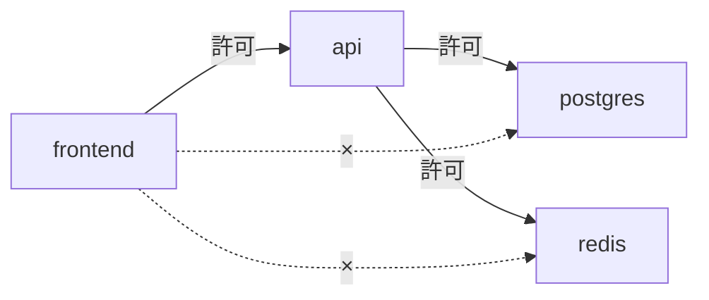

# NetworkPolicy
{: .no_toc }

## 目次
{: .no_toc .text-delta }

1. TOC
{:toc}

---

**NetworkPolicy** は Pod 間通信のファイアウォール。
既定では Kubernetes クラスタ内は **すべての Pod が互いに通信可能** で、本番では確実に絞るべきです。

{: .important }
NetworkPolicy は **CNI プラグインが対応していないと無効** です。Flannel は基本対応せず、Calico/Cilium は対応します。本教材では Calico を使います。

## 既定 (Default Allow)

何も設定しない状態:

- すべての Pod から、すべての Pod へ通信可能

これを **Default Deny** に切り替えるのがゼロトラスト運用の出発点。

## Default Deny の例

「`prod` Namespace の全 Pod へのIngress を遮断」:

```yaml
apiVersion: networking.k8s.io/v1
kind: NetworkPolicy
metadata:
  name: default-deny-ingress
  namespace: prod
spec:
  podSelector: {}
  policyTypes:
  - Ingress
```

`podSelector: {}` で「Namespace 内の全 Pod が対象」、`Ingress` のみ指定で「外から来る通信」を全拒否。
ここから **必要な通信だけを Allow ポリシーで明示的に許可** します。

## サンプルアプリの NetworkPolicy 設計



```yaml
# api への ingress: frontend と ingress-nginx からのみ
apiVersion: networking.k8s.io/v1
kind: NetworkPolicy
metadata:
  name: api-allow
  namespace: prod
spec:
  podSelector:
    matchLabels:
      app.kubernetes.io/name: todo-api
  policyTypes: [Ingress]
  ingress:
  - from:
    - podSelector:
        matchLabels:
          app.kubernetes.io/name: todo-frontend
    - namespaceSelector:
        matchLabels:
          kubernetes.io/metadata.name: ingress-nginx
    ports:
    - protocol: TCP
      port: 8000
---
# postgres への ingress: api からのみ
apiVersion: networking.k8s.io/v1
kind: NetworkPolicy
metadata:
  name: postgres-allow
  namespace: prod
spec:
  podSelector:
    matchLabels:
      app.kubernetes.io/name: postgres
  policyTypes: [Ingress]
  ingress:
  - from:
    - podSelector:
        matchLabels:
          app.kubernetes.io/name: todo-api
    ports:
    - protocol: TCP
      port: 5432
```

## Egress も絞る

```yaml
apiVersion: networking.k8s.io/v1
kind: NetworkPolicy
metadata:
  name: api-egress
spec:
  podSelector:
    matchLabels:
      app.kubernetes.io/name: todo-api
  policyTypes: [Egress]
  egress:
  # DNS
  - to:
    - namespaceSelector: {}
      podSelector:
        matchLabels:
          k8s-app: kube-dns
    ports:
    - {protocol: UDP, port: 53}
  # postgres
  - to:
    - podSelector:
        matchLabels:
          app.kubernetes.io/name: postgres
    ports:
    - {protocol: TCP, port: 5432}
```

DNS を許可し忘れると名前解決が失敗するので注意。

## デバッグ

`netshoot` で実機確認:

```bash
kubectl run debug -n prod --rm -it --image=nicolaka/netshoot -- bash
nc -zv todo-api 80
nc -zv postgres 5432
```

## チェックポイント

- [ ] Default Deny を実現する最小YAMLが書ける
- [ ] NetworkPolicy が動かないとき、最初に確認するのは
- [ ] Egress を絞るときに忘れがちな許可
