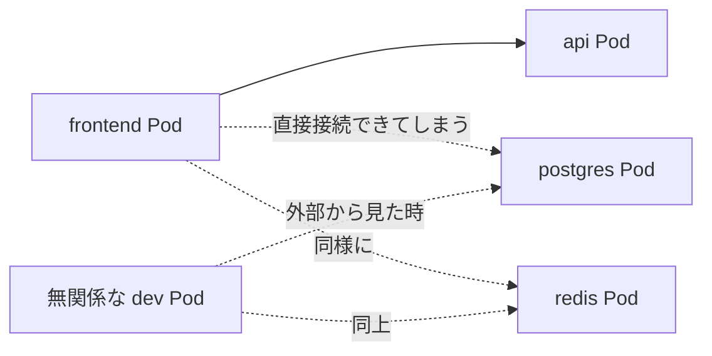
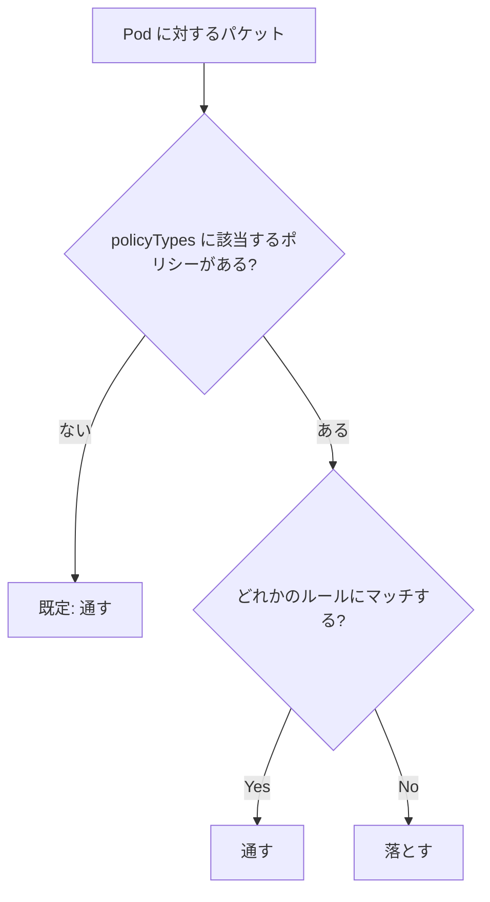
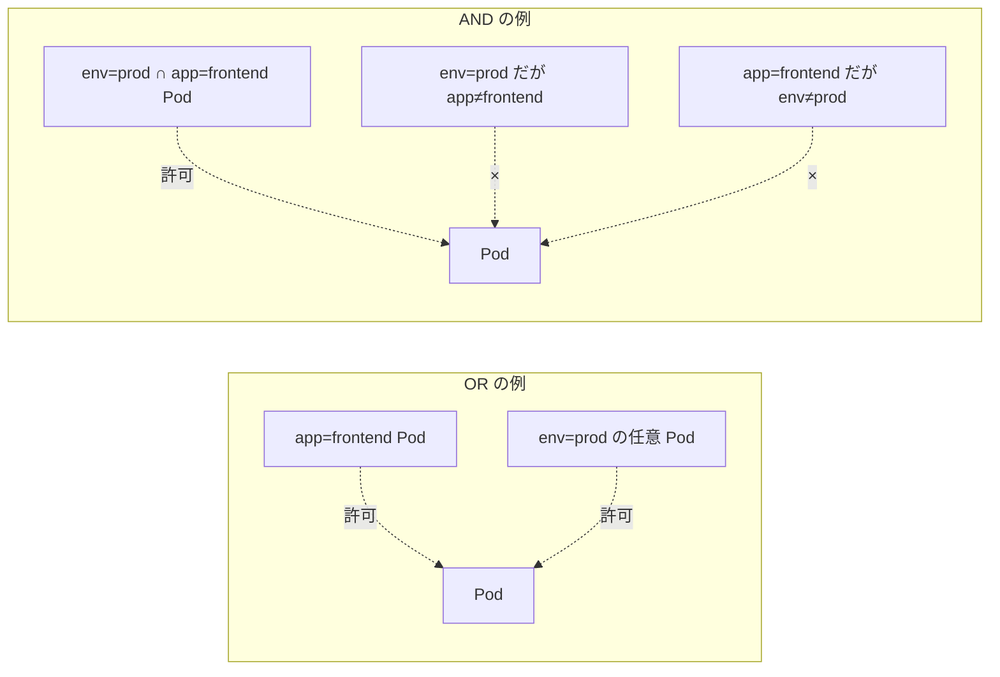
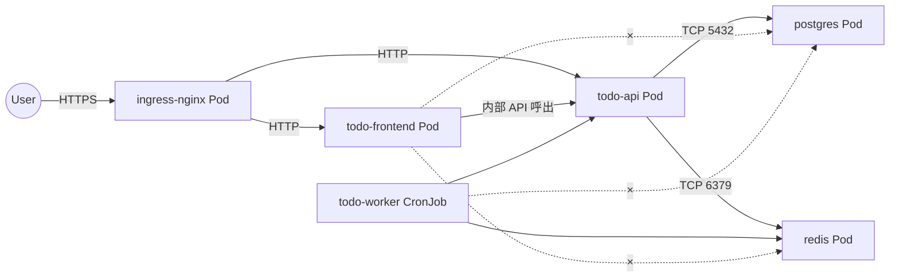
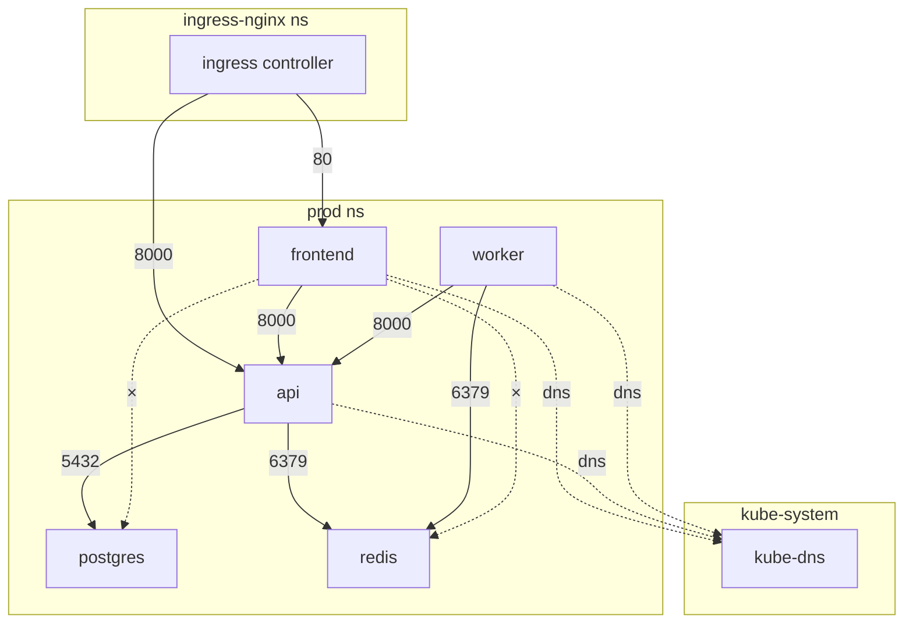
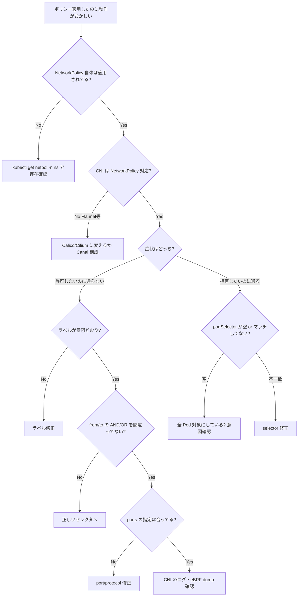

# NetworkPolicy
{: .no_toc }

## 目次
{: .no_toc .text-delta }

1. TOC
{:toc}

---

## このページのゴール

このページを読み終えると、以下を **自分の言葉で説明できる** ようになります。

- Kubernetes 既定の **「全 Pod が互いに通信可能」** がなぜ問題で、本番でゼロトラストへ移行する必要があるか
- NetworkPolicy が **CNI プラグインの実装に依存する** 理由と、対応 CNI(Calico、Cilium、Weave 等)/非対応 CNI(Flannel)の違い
- `podSelector` / `namespaceSelector` / `ipBlock` の使い分けと、複合条件の **AND / OR セマンティクス**
- Default Deny を実現する最小ポリシーと、そこから「必要な通信だけ Allow」する設計手順
- Ingress と Egress の違い、**DNS 解決を許可し忘れる** 落とし穴
- NetworkPolicy で表現できないこと(L7 フィルタ、クラスタ横断ポリシー、IP 単位のアプリ識別)と、それを補う Calico/Cilium の拡張機能
- ありがちな失敗(`from` と `to` の混同、ラベル付け忘れ、`policyTypes` 省略の挙動)と切り分け手順

## このページのスコープ

本ページは **Kubernetes 標準の `NetworkPolicy` リソース** を主軸にしつつ、Calico の `GlobalNetworkPolicy` / Cilium の `CiliumNetworkPolicy`(L7 機能含む)も併せて扱います。
Pod 同士・Pod とクラスタ外の **L3/L4 ファイアウォール** がスコープです。
mTLS や認証認可といった L7 セキュリティは Service Mesh 章で扱います。

## なぜ NetworkPolicy が必要か ─ 既定の「Default Allow」問題

### Kubernetes の既定: すべての Pod が相互通信可能

Kubernetes の Pod ネットワークの基本原則は、

> **すべての Pod は、ネットワークアドレス変換(NAT)なしに、すべての Pod と通信できる。**

というものです。これは Kubernetes が CNI プラグインに課す要件であり、Pod ネットワークモデルの根本です。

この設計が選ばれた理由:

- アプリ間通信を「VM や物理サーバを意識せず Pod 単位で書ける」
- Service / DNS の抽象がうまく成立する
- ネットワークの実装が CNI プラグイン側で自由に行える

しかし、これは **「セキュリティ的にデフォルトでは何の境界もない」** ことも意味します。
たとえば本番 Namespace の Postgres Pod に、まったく無関係な開発用 Pod が `psql` で繋ぎに行けてしまう、ということが構造上ありえます。


```mermaid
flowchart LR
    fe[frontend Pod] --> api[api Pod]
    fe -.直接接続できてしまう.-> db[postgres Pod]
    fe -.同様に.-> cache[redis Pod]
    misc[無関係な dev Pod] -.外部から見た時.-> db
    misc -.同上.-> cache
```

これは、ネットワーク層からの **侵害の横展開(lateral movement)** を許してしまう問題です。
1 つの Pod が乗っ取られたら、クラスタ内のあらゆる Pod に到達可能になりかねません。

### 旧来の対策とその限界

NetworkPolicy 登場前は、以下のような方法で対処していました。

| アプローチ | 課題 |
|-----------|------|
| Namespace でそもそも分離 | Namespace を跨いだ正当な通信もブロックできない(Namespace は論理境界、ネットワーク境界ではない) |
| ノード OS の iptables を直接書く | Pod IP は揮発するので追従できない |
| アプリ側で IP 制限 | コードに環境固有の IP を書く悪夢 |
| サイドカーで認証 | 全アプリにサイドカーを入れる手間、L4 攻撃には効かない |

これらの問題を解決するため、`v1.3`(2016年)で `NetworkPolicy` リソースが導入され、`v1.7` で `networking.k8s.io/v1` として安定化しました。

### NetworkPolicy の設計判断

Kubernetes の NetworkPolicy は次の特徴を持ちます。

1. **宣言的**: 「誰から誰へ何を許可するか」を YAML で書く
2. **ホワイトリスト**: ポリシーを 1 つ書いた瞬間、その Pod については **マッチした通信のみ許可・他は拒否** に変わる(ホワイトリスト的)
3. **CNI 委任**: ポリシーの実装は CNI プラグインに任せる(API は標準、実装は自由)
4. **L3/L4 のみ**: Pod 単位、Namespace 単位、IP CIDR、ポート、プロトコルのみ。HTTP メソッド・URL パスは扱えない(これは拡張で対応)

### 関連リソース

- [KEP-1611: NetworkPolicy](https://github.com/kubernetes/enhancements/tree/master/keps/sig-network/1611-network-policy)
- [KEP-2091: Add EndPort to NetworkPolicy](https://github.com/kubernetes/enhancements/tree/master/keps/sig-network/2079-network-policy-endport)
- [Calico Network Policy](https://docs.tigera.io/calico/latest/network-policy/)
- [Cilium Network Policy](https://docs.cilium.io/en/stable/security/policy/)

## CNI プラグインの対応状況 ─ ここで詰まる

{: .important }
> NetworkPolicy は **CNI プラグインが実装してくれて初めて効く機能** です。NetworkPolicy YAML を書いても、CNI が実装していなければ **何の効果もありません**。これは「ポリシーを書いたのに通信が通る!」という最頻出のトラブル原因です。

### 主要 CNI の NetworkPolicy 対応

| CNI | NetworkPolicy | 拡張 | 備考 |
|-----|---------------|------|------|
| **Flannel** | ❌ なし | - | シンプル / 最軽量。本番では物足りない |
| **Calico** | ✅ あり | `GlobalNetworkPolicy`、`HostEndpoint` | 本教材で採用 |
| **Cilium** | ✅ あり | `CiliumNetworkPolicy`、L7 ポリシー、Identity ベース | eBPF 実装、最先端 |
| **Weave Net** | ✅ あり | - | 開発が停滞気味 |
| **Antrea** | ✅ あり | `ClusterNetworkPolicy` | VMware 主導、OVS ベース |
| **Kube-router** | ✅ あり | - | 軽量 |
| **Canal** | ✅(Calico 部分) | - | Flannel + Calico の組み合わせ |

### Flannel + Calico ポリシーだけ載せる構成(Canal)

歴史的には「Flannel(ネットワーク機能)+ Calico(ポリシー機能)」という組み合わせ(**Canal**)もよく使われていました。
最近は Calico 単体で両方をやるか、Cilium に置き換えるのが主流です。

### 確認方法

クラスタの CNI を確認:

```bash
kubectl get pods -n kube-system | grep -E 'calico|cilium|flannel|weave|antrea'
```

```bash
# DaemonSet の名前で判別
kubectl get daemonset -n kube-system
```

本教材の VMware kubeadm 環境では `calico-node` という DaemonSet が `kube-system`(または `calico-system`)で動いているはずです。

## NetworkPolicy リソースの基本構造

最小の NetworkPolicy YAML:

```yaml
apiVersion: networking.k8s.io/v1
kind: NetworkPolicy
metadata:
  name: deny-all
  namespace: prod
spec:
  podSelector: {}
  policyTypes:
  - Ingress
```

これは「`prod` Namespace の全 Pod に対する Ingress(=外から来る通信)を全拒否」です。

### フィールドの意味

| フィールド | 意味 |
|-----------|------|
| `metadata.namespace` | このポリシーが適用される Namespace。**ポリシーは Namespace スコープ** |
| `spec.podSelector` | このポリシーが守る対象 Pod のセレクタ。`{}` は「Namespace 内の全 Pod」 |
| `spec.policyTypes` | `Ingress`(入る通信) / `Egress`(出る通信) の指定 |
| `spec.ingress[]` | 許可する入力ルール(`from` + `ports`) |
| `spec.egress[]` | 許可する出力ルール(`to` + `ports`) |

### `policyTypes` の重要な仕様

**`policyTypes` を省略すると、`ingress` フィールドが書かれていれば `Ingress`、`egress` があれば `Egress` が自動推定**されます。
ただし、明示的に書かないと意図が伝わりにくく、また「Egress を書こうとしてうっかり Ingress 側にだけ影響」というミスにつながるので、**常に明示することを推奨**します。

```yaml
spec:
  podSelector: {}
  policyTypes: [Ingress, Egress]   # 明示
  ingress: []                       # = 全拒否
  egress: []                        # = 全拒否
```

### 「ポリシーが適用された Pod」の挙動

`podSelector` にマッチした Pod に対して:

- `policyTypes: [Ingress]` のポリシーが 1 つでもあれば、**その Pod への Ingress は ホワイトリスト動作** になる(マッチした通信だけ許可、他は全拒否)
- `policyTypes: [Egress]` のポリシーが 1 つでもあれば、**その Pod の Egress も ホワイトリスト動作** になる
- 同じ Pod に複数のポリシーがある場合、ルールは **OR 結合**(どれか 1 つでも許可していれば通る)
- ポリシーがまったくない Pod は **既定どおり全許可**


```mermaid
flowchart TD
    A[Pod に対するパケット] --> B{policyTypes に該当するポリシーがある?}
    B -->|ない| C[既定: 通す]
    B -->|ある| D{どれかのルールにマッチする?}
    D -->|Yes| E[通す]
    D -->|No| F[落とす]
```

### selector のセマンティクス ─ AND と OR

NetworkPolicy で最もよく間違えるのが `from` 配列の中の **AND と OR の境界** です。

```yaml
ingress:
- from:
  - podSelector:
      matchLabels:
        app: frontend
  - namespaceSelector:
      matchLabels:
        env: prod
```

これは「**`app: frontend` の Pod**」**または** 「**`env: prod` の Namespace 内の任意の Pod**」からの通信を許可。**OR**。

一方:

```yaml
ingress:
- from:
  - podSelector:
      matchLabels:
        app: frontend
    namespaceSelector:
      matchLabels:
        env: prod
```

これは「**`env: prod` の Namespace の中の `app: frontend` Pod**」からのみ。**AND**。

`-` の有無 1 文字で意味が変わります。**書き間違えると過剰に開いたり過剰に閉じたりするので注意**してください。


```mermaid
flowchart LR
    subgraph OR[OR の例]
        OR1[app=frontend Pod] -.許可.-> Target1[Pod]
        OR2[env=prod の任意 Pod] -.許可.-> Target1
    end
    subgraph AND[AND の例]
        AND1[env=prod ∩ app=frontend Pod] -.許可.-> Target2[Pod]
        AND2[env=prod だが app≠frontend] -.×.-> Target2
        AND3[app=frontend だが env≠prod] -.×.-> Target2
    end
```

### 3 種類のセレクタ

#### `podSelector`

ラベルで Pod を指定。**同 Namespace 内** が既定。

```yaml
- podSelector:
    matchLabels:
      app.kubernetes.io/name: todo-frontend
```

#### `namespaceSelector`

ラベルで Namespace を指定。`v1.22` 以降、Namespace には自動で `kubernetes.io/metadata.name=<ns>` ラベルが付く。

```yaml
- namespaceSelector:
    matchLabels:
      kubernetes.io/metadata.name: ingress-nginx
```

これで「`ingress-nginx` Namespace の任意の Pod」を指定できます。

#### `ipBlock`

CIDR で IP 範囲を指定。**クラスタ外** の IP に対するルールを書くときに使う。

```yaml
- ipBlock:
    cidr: 192.168.56.0/24
    except:
    - 192.168.56.30/32
```

`except` で部分的に除外可。`ipBlock` を Pod IP に向けて使うのは推奨されません(Pod IP は変動するので)。

### `ports` の指定

```yaml
ingress:
- from: ...
  ports:
  - protocol: TCP
    port: 8000
  - protocol: TCP
    port: 8443
```

`port` には **数値** または **Pod 側ポートの名前**(Pod の `containerPort` の `name`)を書けます。

```yaml
ports:
- protocol: TCP
  port: http   # Pod の name: http の containerPort を参照
```

#### `endPort`(`v1.25` GA)

ポート範囲を指定可能。

```yaml
ports:
- protocol: TCP
  port: 32000
  endPort: 32100
```

これで `32000-32100` のレンジを 1 行で書けます。NodePort 範囲を許可するときに便利。

## Default Deny ─ ゼロトラストの出発点

本番 Namespace では「明示的に許可されていない通信は全拒否」を出発点にするのが鉄則です。

### Ingress の Default Deny

```yaml
apiVersion: networking.k8s.io/v1
kind: NetworkPolicy
metadata:
  name: default-deny-ingress
  namespace: prod
spec:
  podSelector: {}
  policyTypes:
  - Ingress
```

- `podSelector: {}` ─ Namespace 内の全 Pod が対象
- `policyTypes: [Ingress]` ─ Ingress のみ規制
- `ingress` フィールドなし ─ つまり「許可ルールゼロ」 ─ **全部落ちる**

### Egress の Default Deny

```yaml
apiVersion: networking.k8s.io/v1
kind: NetworkPolicy
metadata:
  name: default-deny-egress
  namespace: prod
spec:
  podSelector: {}
  policyTypes:
  - Egress
```

これも同じ理屈で、Pod から外へ出る通信を全拒否。

### Both(両方拒否)

```yaml
apiVersion: networking.k8s.io/v1
kind: NetworkPolicy
metadata:
  name: default-deny-all
  namespace: prod
spec:
  podSelector: {}
  policyTypes: [Ingress, Egress]
```

ここから **Allow ポリシーで明示的に通したい通信を足していく** のが基本パターンです。

### Default Deny の落とし穴

Default Deny を入れた瞬間、**多くのアプリが動かなくなります**。よくある原因:

1. **DNS 解決が止まる** ─ Pod は CoreDNS(`kube-system` の `kube-dns`)へ UDP/TCP 53 を投げますが、それが Egress 拒否で落ちる
2. **kubelet からのヘルスチェックが届かない** ─ ノード IP からの probe を許可していないと Pod が NotReady に
3. **メトリクスが取れない** ─ Prometheus が Pod を scrape できない
4. **`ingress-nginx` からの流入が止まる** ─ Ingress Controller の Namespace を許可していない

これらの「忘れがちな許可」は後述します。

## サンプルアプリ「ミニTODO」のポリシー設計


```mermaid
flowchart LR
    user((User)) -->|HTTPS| ing[ingress-nginx Pod]
    ing -->|HTTP| fe[todo-frontend Pod]
    ing -->|HTTP| api[todo-api Pod]
    fe -->|内部 API 呼出| api
    api -->|TCP 5432| pg[postgres Pod]
    api -->|TCP 6379| rd[redis Pod]
    cron[todo-worker CronJob] --> api
    cron --> rd
    fe -.×.-> pg
    fe -.×.-> rd
    cron -.×.-> pg
```

許可したい通信:

- `ingress-nginx` Namespace の Pod → `frontend`、`api`(80/8000)
- `frontend` → `api`(8000)
- `api` → `postgres`(5432)
- `api` → `redis`(6379)
- `worker`(CronJob) → `api`(8000)、`redis`(6379)
- 全 Pod → CoreDNS(53/UDP, 53/TCP)
- 全 Pod → `kube-apiserver`(443)(必要なものだけ)

許可したくない通信:

- `frontend` → `postgres`(API 経由するべき)
- `frontend` → `redis`(同上)
- 別 Namespace の任意 Pod → `prod` の任意 Pod(明示許可した経路以外)

### Step 1: Default Deny

```yaml
apiVersion: networking.k8s.io/v1
kind: NetworkPolicy
metadata:
  name: default-deny-all
  namespace: prod
spec:
  podSelector: {}
  policyTypes: [Ingress, Egress]
```

### Step 2: DNS の許可(全 Pod の Egress)

```yaml
apiVersion: networking.k8s.io/v1
kind: NetworkPolicy
metadata:
  name: allow-dns-egress
  namespace: prod
spec:
  podSelector: {}
  policyTypes: [Egress]
  egress:
  - to:
    - namespaceSelector:
        matchLabels:
          kubernetes.io/metadata.name: kube-system
      podSelector:
        matchLabels:
          k8s-app: kube-dns
    ports:
    - protocol: UDP
      port: 53
    - protocol: TCP
      port: 53
```

ポイント:

- `namespaceSelector` + `podSelector` を `-` 1 つで結合 ─ **AND**(`kube-system` の中で `k8s-app: kube-dns`)
- UDP と TCP 両方を許可(大きな TXT レコードや EDNS0 を超える応答で TCP に切り替わる)

### Step 3: api への ingress

```yaml
apiVersion: networking.k8s.io/v1
kind: NetworkPolicy
metadata:
  name: api-allow-ingress
  namespace: prod
spec:
  podSelector:
    matchLabels:
      app.kubernetes.io/name: todo-api
  policyTypes: [Ingress]
  ingress:
  - from:
    - podSelector:
        matchLabels:
          app.kubernetes.io/name: todo-frontend
    - namespaceSelector:
        matchLabels:
          kubernetes.io/metadata.name: ingress-nginx
    ports:
    - protocol: TCP
      port: 8000
```

これは **OR** の例。
「`todo-frontend` Pod から(同 Namespace、prod 内)」または「`ingress-nginx` Namespace の任意の Pod から」を許可。

### Step 4: postgres への ingress

```yaml
apiVersion: networking.k8s.io/v1
kind: NetworkPolicy
metadata:
  name: postgres-allow-ingress
  namespace: prod
spec:
  podSelector:
    matchLabels:
      app.kubernetes.io/name: postgres
  policyTypes: [Ingress]
  ingress:
  - from:
    - podSelector:
        matchLabels:
          app.kubernetes.io/name: todo-api
    ports:
    - protocol: TCP
      port: 5432
```

これは「`todo-api` Pod **のみ**」が `postgres:5432` に到達できる。`todo-frontend` から直接は触れません。

### Step 5: redis への ingress

```yaml
apiVersion: networking.k8s.io/v1
kind: NetworkPolicy
metadata:
  name: redis-allow-ingress
  namespace: prod
spec:
  podSelector:
    matchLabels:
      app.kubernetes.io/name: redis
  policyTypes: [Ingress]
  ingress:
  - from:
    - podSelector:
        matchLabels:
          app.kubernetes.io/name: todo-api
    - podSelector:
        matchLabels:
          app.kubernetes.io/name: todo-worker
    ports:
    - protocol: TCP
      port: 6379
```

`todo-api` または `todo-worker` から `6379` を許可。

### Step 6: api から外向きの egress

```yaml
apiVersion: networking.k8s.io/v1
kind: NetworkPolicy
metadata:
  name: api-allow-egress
  namespace: prod
spec:
  podSelector:
    matchLabels:
      app.kubernetes.io/name: todo-api
  policyTypes: [Egress]
  egress:
  # postgres
  - to:
    - podSelector:
        matchLabels:
          app.kubernetes.io/name: postgres
    ports:
    - protocol: TCP
      port: 5432
  # redis
  - to:
    - podSelector:
        matchLabels:
          app.kubernetes.io/name: redis
    ports:
    - protocol: TCP
      port: 6379
  # DNS(別ポリシーで全体許可してあるので、ここでは省略しても OK)
```

{: .tip }
> **Egress は冗長になりがち** です。「全 Pod 共通の Egress 許可(DNS、kube-apiserver、メトリクス)」は別 YAML にまとめて、各アプリ固有の Egress(DB 接続先など)だけ個別ポリシーに書くと管理しやすくなります。

### Step 7: ingress-nginx Namespace のラベル付け

`ingress-nginx` Namespace を NetworkPolicy で参照するには、Namespace 自体にラベルが付いている必要があります。

`v1.22` 以降は **すべての Namespace に自動で `kubernetes.io/metadata.name=<ns>` ラベルが付く** ので、それを使うのが標準です。

確認:

```bash
kubectl get ns ingress-nginx -o jsonpath='{.metadata.labels}'
```

`{"kubernetes.io/metadata.name":"ingress-nginx"}` が出れば OK。

### Step 8: frontend の ingress / egress

```yaml
apiVersion: networking.k8s.io/v1
kind: NetworkPolicy
metadata:
  name: frontend-allow
  namespace: prod
spec:
  podSelector:
    matchLabels:
      app.kubernetes.io/name: todo-frontend
  policyTypes: [Ingress, Egress]
  ingress:
  - from:
    - namespaceSelector:
        matchLabels:
          kubernetes.io/metadata.name: ingress-nginx
    ports:
    - protocol: TCP
      port: 80
  egress:
  - to:
    - podSelector:
        matchLabels:
          app.kubernetes.io/name: todo-api
    ports:
    - protocol: TCP
      port: 8000
```

### 全体マップ


```mermaid
flowchart TB
    subgraph ext[ingress-nginx ns]
        ic[ingress controller]
    end
    subgraph prod[prod ns]
        fe[frontend]
        api[api]
        pg[postgres]
        rd[redis]
        wk[worker]
    end
    subgraph kube[kube-system]
        dns[kube-dns]
    end
    ic -->|80| fe
    ic -->|8000| api
    fe -->|8000| api
    wk -->|8000| api
    api -->|5432| pg
    api -->|6379| rd
    wk -->|6379| rd
    fe -.dns.-> dns
    api -.dns.-> dns
    wk -.dns.-> dns
    fe -.×.-> pg
    fe -.×.-> rd
```

## Egress とよくある罠

### 罠 1: DNS を許可し忘れる

Egress Default Deny を入れたら **その瞬間にすべての名前解決が落ちます**。
症状は「`postgres` という名前が引けない」「`Failed to connect: getaddrinfo ENOTFOUND`」など。
対処は前述の DNS 許可ポリシーを必ず合わせて入れること。

### 罠 2: API server へのアクセスを忘れる

ServiceAccount トークンを使ってアプリが Kubernetes API を叩くケース(operator、Argo CD などのコントローラ系)では、`kube-apiserver` への接続が必要。

`kube-apiserver` は Pod ではないため `podSelector` では指定できません。`ipBlock` か、`kubernetes` という名前の Service の ClusterIP に対して個別に許可する必要があります。

```yaml
egress:
- to:
  - ipBlock:
      cidr: 10.96.0.1/32   # kubernetes Service の ClusterIP
  ports:
  - protocol: TCP
    port: 443
```

または、より簡便には「kube-system の `kube-apiserver` Pod が動くノード IP 範囲(Control Plane の IP)」を許可します。
本番では Control Plane を Pod として動かしていない HA 構成も多く、`ipBlock` でホスト IP を許可するのが確実です。

### 罠 3: メトリクス取得経路

Prometheus は別 Namespace から `prod` の Pod の `/metrics` を scrape します。
これを許可していないと、メトリクス収集だけ止まります。

```yaml
ingress:
- from:
  - namespaceSelector:
      matchLabels:
        kubernetes.io/metadata.name: monitoring
    podSelector:
      matchLabels:
        app.kubernetes.io/name: prometheus
  ports:
  - protocol: TCP
    port: 9090   # アプリの metrics ポート
```

### 罠 4: kubelet からの probe

Pod の `livenessProbe` / `readinessProbe` は kubelet(=ノード自身)が実行します。
**ノード IP から Pod への通信** を許可していないと、Pod が常に NotReady になります。

ただし NetworkPolicy は **Pod 間通信を制御するもの** で、ノード自身からの通信は CNI 実装によって挙動が変わります。多くの CNI(Calico、Cilium 含む)は **kubelet からのヘルスチェックは NetworkPolicy をバイパスする** 扱いになっていますが、設定によっては影響します。

確実に動かしたい場合:

```yaml
egress:
- to:
  - ipBlock:
      cidr: 192.168.56.0/24   # ノード IP 範囲
```

を全 Pod 用に追加するか、Pod 側でラベルを付けて個別許可します。

### 罠 5: NodePort 経由の流入

Pod から NodePort 経由で別 Pod に届く場合、kube-proxy が SNAT してノード IP として届くことがあります(`externalTrafficPolicy: Cluster`)。
このとき送信元 Pod のラベルが失われ、NetworkPolicy では捕捉できません。
本番ではノード IP の範囲も `ipBlock` で別途許可するか、`externalTrafficPolicy: Local` を採用します。

## 「サンプル集」 ─ よく使うパターン

### Default Deny(Ingress + Egress、必要最小の許可)

```yaml
# 1. 全否定
apiVersion: networking.k8s.io/v1
kind: NetworkPolicy
metadata:
  name: default-deny
  namespace: prod
spec:
  podSelector: {}
  policyTypes: [Ingress, Egress]
---
# 2. DNS だけは全 Pod 許可
apiVersion: networking.k8s.io/v1
kind: NetworkPolicy
metadata:
  name: allow-dns
  namespace: prod
spec:
  podSelector: {}
  policyTypes: [Egress]
  egress:
  - to:
    - namespaceSelector:
        matchLabels:
          kubernetes.io/metadata.name: kube-system
      podSelector:
        matchLabels:
          k8s-app: kube-dns
    ports:
    - protocol: UDP
      port: 53
    - protocol: TCP
      port: 53
```

### 同 Namespace 内の通信のみ許可

```yaml
spec:
  podSelector: {}
  policyTypes: [Ingress]
  ingress:
  - from:
    - podSelector: {}   # 同 Namespace の任意 Pod
```

### 特定 Namespace からのみ許可

```yaml
spec:
  podSelector:
    matchLabels:
      app: api
  policyTypes: [Ingress]
  ingress:
  - from:
    - namespaceSelector:
        matchLabels:
          kubernetes.io/metadata.name: client-ns
```

### 外部 IP からのみ許可(オフィスの IP 範囲のみ管理画面に通す)

```yaml
spec:
  podSelector:
    matchLabels:
      app: admin-ui
  policyTypes: [Ingress]
  ingress:
  - from:
    - ipBlock:
        cidr: 203.0.113.0/24
    ports:
    - protocol: TCP
      port: 80
```

### 外向きに HTTPS だけ許可、Pod 間通信は全部拒否

```yaml
spec:
  podSelector:
    matchLabels:
      app: scraper
  policyTypes: [Egress]
  egress:
  - to:
    - ipBlock:
        cidr: 0.0.0.0/0
        except:
        - 10.0.0.0/8
        - 192.168.0.0/16
        - 172.16.0.0/12
    ports:
    - protocol: TCP
      port: 443
```

`except` でプライベート IP を除外して、**外部の HTTPS だけに出る** Egress を作成。

## ハンズオン: ポリシー適用と動作確認

### 1. 適用

```bash
kubectl apply -f prod/netpol-default-deny.yaml
kubectl apply -f prod/netpol-allow-dns.yaml
kubectl apply -f prod/netpol-api.yaml
kubectl apply -f prod/netpol-postgres.yaml
kubectl apply -f prod/netpol-redis.yaml
kubectl apply -f prod/netpol-frontend.yaml
```

```bash
kubectl get netpol -n prod
```

**期待される出力**:

```
NAME                     POD-SELECTOR                                 AGE
allow-dns                <none>                                       30s
api-allow-egress         app.kubernetes.io/name=todo-api              30s
api-allow-ingress        app.kubernetes.io/name=todo-api              30s
default-deny             <none>                                       30s
frontend-allow           app.kubernetes.io/name=todo-frontend         30s
postgres-allow-ingress   app.kubernetes.io/name=postgres              30s
redis-allow-ingress      app.kubernetes.io/name=redis                 30s
```

### 2. 期待どおり拒否されることを確認

`netshoot` Pod を `prod` に立てて:

```bash
kubectl run netshoot -n prod --rm -it \
  --image=nicolaka/netshoot --restart=Never -- bash
```

中で:

```bash
# 想定: ❌ frontend → postgres は拒否されるはず
nc -zv postgres 5432
# 期待: timeout で失敗

# 想定: ❌ frontend → redis も拒否
nc -zv redis 6379
# 期待: timeout で失敗

# 想定: ✅ api → postgres は通る
# (この netshoot Pod は api のラベルを持っていないので拒否されるのが正解)
```

このとき `netshoot` Pod のラベルを `app.kubernetes.io/name=todo-api` にすれば、ポリシー上は `api` 扱いになり許可されます。

### 3. ラベルを付けたデバッグ Pod

```bash
kubectl run netshoot-as-api -n prod --rm -it \
  --image=nicolaka/netshoot --restart=Never \
  --labels="app.kubernetes.io/name=todo-api" -- bash
```

これで「api を装ったクライアント」として動作を確認できます。

```bash
# 想定: ✅ postgres に通る
nc -zv postgres 5432
```

### 4. 試験的に「全部開ける」ポリシーで切り分け

何か動かないとき、まず NetworkPolicy が原因かを切り分けるために **一時的に全開放のポリシーを上書き** すると検証が速いです。

```yaml
apiVersion: networking.k8s.io/v1
kind: NetworkPolicy
metadata:
  name: temp-allow-all
  namespace: prod
spec:
  podSelector: {}
  policyTypes: [Ingress, Egress]
  ingress: [{}]
  egress: [{}]
```

`ingress: [{}]` `egress: [{}]` は「全許可」を意味します。これで動けば NetworkPolicy が原因、動かなければ別問題。
**確認後は必ず削除してください**。残すと意味がなくなります。

## クラスタワイドポリシー(Calico / Cilium 拡張)

標準の NetworkPolicy は **Namespace スコープ** です。「クラスタ全体に共通で適用したい」(本番外への egress を全アプリ拒否、など)は、Calico や Cilium の独自リソースで対応します。

### Calico の `GlobalNetworkPolicy`

```yaml
apiVersion: projectcalico.org/v3
kind: GlobalNetworkPolicy
metadata:
  name: deny-egress-to-internet
spec:
  selector: all()
  types: [Egress]
  egress:
  - action: Deny
    destination:
      nets:
      - 0.0.0.0/0
      notNets:
      - 10.0.0.0/8
      - 192.168.0.0/16
      - 172.16.0.0/12
```

### Cilium の `CiliumClusterwideNetworkPolicy`

```yaml
apiVersion: cilium.io/v2
kind: CiliumClusterwideNetworkPolicy
metadata:
  name: cluster-deny-egress
spec:
  endpointSelector: {}
  egress:
  - toCIDR:
    - 10.0.0.0/8
```

これらは標準 NetworkPolicy より表現力が高く、`Allow`/`Deny` の明示や、Calico の Tier(優先度層)、Cilium の Identity ベース判定などが使えます。

## L7 ポリシー(Cilium)

Kubernetes 標準の NetworkPolicy は **L4 まで**(IP・ポート・プロトコル)です。
「`/admin` パスへの POST だけ拒否したい」「gRPC の特定メソッドだけ許可したい」のような **L7 制御** は標準では書けません。

Cilium の `CiliumNetworkPolicy` なら可能です。

```yaml
apiVersion: cilium.io/v2
kind: CiliumNetworkPolicy
metadata:
  name: api-l7-allow
  namespace: prod
spec:
  endpointSelector:
    matchLabels:
      app.kubernetes.io/name: todo-api
  ingress:
  - fromEndpoints:
    - matchLabels:
        app.kubernetes.io/name: todo-frontend
    toPorts:
    - ports:
      - port: "8000"
        protocol: TCP
      rules:
        http:
        - method: "GET"
          path: "/api/.*"
        - method: "POST"
          path: "/api/todos"
```

これは「`frontend` から `api:8000` への HTTP のうち、`GET /api/.*` と `POST /api/todos` だけ許可」を意味します。
それ以外のメソッドやパスは拒否されます(L7 で)。

L7 ポリシーは **Service Mesh の認可機能と重なる** 領域で、どちらでやるかは設計判断です。
本教材では Service Mesh 章で詳しく対比します。

## 主要 CNI 別の挙動の違い

| 観点 | Calico | Cilium | Antrea |
|------|--------|--------|--------|
| ポリシー実装 | iptables / eBPF(選択可) | eBPF | OVS |
| 標準 NetworkPolicy | ✅ | ✅ | ✅ |
| クラスタワイド拡張 | `GlobalNetworkPolicy` | `CiliumClusterwideNetworkPolicy` | `ClusterNetworkPolicy` |
| L7 ポリシー | ❌(Calico Enterprise なら可) | ✅(HTTP/Kafka/gRPC) | ✅(部分的) |
| ホストエンドポイント | ✅(`HostEndpoint`) | ✅ | ✅ |
| 監視 / 可視化 | felix のメトリクス | Hubble(GUI、CLI) | Antrea Octant プラグイン |
| パフォーマンス | iptables モードは普通、eBPF モードで高速 | 全般高速(eBPF ネイティブ) | 普通 |

## デバッグ調査フロー


```mermaid
flowchart TD
    S[ポリシー適用したのに動作がおかしい] --> Q1{NetworkPolicy 自体は適用されてる?}
    Q1 -->|No| F1[kubectl get netpol -n ns で存在確認]
    Q1 -->|Yes| Q2{CNI は NetworkPolicy 対応?}
    Q2 -->|No Flannel等| F2[Calico/Cilium に変えるか Canal 構成]
    Q2 -->|Yes| Q3{症状はどっち?}
    Q3 -->|許可したいのに通らない| Q4{ラベルが意図どおり?}
    Q3 -->|拒否したいのに通る| Q5{podSelector が空 or マッチしてない?}
    Q4 -->|No| F3[ラベル修正]
    Q4 -->|Yes| Q6{from/to の AND/OR を間違ってない?}
    Q6 -->|No| F4[正しいセレクタへ]
    Q6 -->|Yes| Q7{ports の指定は合ってる?}
    Q7 -->|No| F5[port/protocol 修正]
    Q7 -->|Yes| F6[CNI のログ・eBPF dump 確認]
    Q5 -->|空| F7[全 Pod 対象にしている? 意図確認]
    Q5 -->|不一致| F8[selector 修正]
```

### 切り分けコマンド

```bash
# ポリシー一覧
kubectl get netpol -A

# 特定 Pod に効くポリシー(Calico)
kubectl exec -n calico-system calico-node-xxxxx -- calicoctl get networkpolicy -n prod -o wide

# Pod に当たっている selector を逆引き
POD_LABELS=$(kubectl get pod todo-api-xxxxx -n prod -o json | jq '.metadata.labels')
echo "Pod labels: $POD_LABELS"
kubectl get netpol -n prod -o yaml | grep -B2 -A5 podSelector

# Calico の場合、Pod の ingress/egress を felix から確認
ssh k8s-w1 sudo calicoctl-felix dump endpoint <pod-ifname>

# Cilium の場合、policy trace
kubectl exec -n kube-system cilium-xxxxx -- \
  cilium policy trace --src-k8s-pod prod/todo-frontend --dst-k8s-pod prod/postgres --dport 5432

# Hubble(Cilium)の可視化
hubble observe --to-pod prod/postgres --verdict DROPPED

# 直接接続テスト(ラベル付き Pod から)
kubectl run debug-as-api -n prod --rm -it \
  --image=nicolaka/netshoot --restart=Never \
  --labels="app.kubernetes.io/name=todo-api" \
  -- nc -zv postgres 5432
```

### Calico での詳細確認

Calico は `calicoctl` でポリシーや endpoint を見られます。

```bash
# WorkloadEndpoint(Pod の Calico 内部表現)
calicoctl get workloadendpoints -n prod -o wide

# 指定 Pod に効いているポリシーをルール展開
calicoctl get policy -n prod -o yaml
```

iptables モードの Calico は、ノード上で `iptables` チェーンを生成しています。

```bash
ssh k8s-w1 sudo iptables -L cali-fw-cali<endpoint-id> -n -v
```

ただし Calico のチェーン名は内部 ID で生成されるので、calicoctl 経由で確認するほうが現実的です。

### Cilium / Hubble での可視化

Cilium 採用クラスタでは Hubble が「どの通信が許可/拒否されたか」をリアルタイムで見られます。

```bash
hubble observe --namespace prod --verdict DROPPED --since 5m
```

L7 ポリシーが効いていれば、HTTP メソッド・パス単位でドロップ理由が見えます。

## エラーメッセージ → 対処

| 症状 | 原因の候補 | 対処 |
|------|----------|------|
| 適用後すぐ Pod が NotReady | kubelet probe の経路を許可していない | ノード IP 範囲を `ipBlock` で許可 |
| `getaddrinfo: Name or service not known` | DNS 許可ポリシーがない | `kube-system/kube-dns` への UDP/TCP 53 を許可 |
| 別 Namespace から接続できない | `namespaceSelector` のラベル不一致 | `kubernetes.io/metadata.name` を使う |
| `connection timeout`(拒否のはずが TIMEOUT 表示) | NetworkPolicy は通信を **DROP** する(REJECT ではない) | これが正常 |
| `RST` が返ってくる | NetworkPolicy ではなくアプリ・kube-proxy・Service 側 | 切り分け |
| 適用したのに通る | CNI 未対応(Flannel)/ ポリシーの selector が空ザル | CNI 確認、selector 確認 |
| ノード再起動後だけ通る | CNI Pod 起動順の問題 | Calico/Cilium Pod の Ready 待ち |
| `kubectl exec` が止まる | API server が Pod 内から弾かれている | API server への egress 許可 |

## 本番運用のベストプラクティス

### 1. 必ず Default Deny から入る

「最初は全許可で、徐々に絞っていく」だと、いつまでも開きっぱなしのまま終わります。
**Default Deny を入れて、動かないものを 1 つずつ Allow で開ける** 順序が逆説的に速いです。

### 2. 段階導入する

- **Phase 1**: Audit モード(Calico なら `LogPrefix`、Cilium なら policy enforcement mode を `audit`)
- **Phase 2**: 本番外の Namespace で Default Deny 試験
- **Phase 3**: 本番に Default Deny 投入(深夜帯、ロールバック手順を用意して)

### 3. ポリシーは少なく・大きく書く

ポリシーを「アプリごとに細かく」分けすぎると、横断的な変更が大変になります。
「Default Deny」「DNS 許可」「アプリごとの Allow」の 3 段構造で整理するのが管理しやすいです。

### 4. ラベル戦略を統一する

NetworkPolicy はラベル依存です。`app.kubernetes.io/name`、`app.kubernetes.io/part-of` などの **推奨ラベル** を全 Pod に一貫して付与することで、ポリシーがシンプルになります。

### 5. ポリシーをコードレビュー対象に

`networking.k8s.io/v1.NetworkPolicy` は YAML だけ見ても意図が読み取りにくいので、PR テンプレートに「**意図する許可・拒否の表**」を書く習慣を作ると事故が減ります。

### 6. テストを書く

NetworkPolicy が正しく動いているかをテストする OSS ツールがあります。

- **`netassert`**: NetworkPolicy のテストフレームワーク
- **`cilium connectivity test`**: Cilium 同梱の統合テスト
- **`policy-test`**: 自作スクリプトで「これは通るべき / 通らないべき」を assert

### 7. クラスタを跨ぐ通信は別レイヤで

クラスタ間 VPN、Egress Gateway、Federation など、クラスタ境界を跨ぐ通信制御は NetworkPolicy 単独では難しいです。
Service Mesh(mTLS で identity を持たせる)、SPIFFE/SPIRE などのワークロード ID と組み合わせるのが現代的解。

## NetworkPolicy で表現できないこと

| やりたいこと | NetworkPolicy | 補完手段 |
|------------|---------------|---------|
| HTTP メソッド・パス単位 | ❌ | Cilium L7 / Service Mesh |
| TLS の検証(SAN、SNI) | ❌ | Service Mesh(mTLS) |
| クラスタワイドな共通ポリシー | ❌(Namespace スコープ) | Calico GNP / Cilium CCNP |
| ノード→Pod の通信制御 | △(CNI 依存) | HostEndpoint(Calico) |
| 動的な IP 許可リスト | ❌(YAML 書き直し) | Service Mesh の動的設定 |
| アプリの Identity ベース | ❌(IP/ラベル依存) | SPIFFE/SPIRE、Cilium Identity |

## 主要フィールド一覧

|フィールド|型|意味|
|---|---|---|
|`spec.podSelector`|labelSelector|このポリシーが守る Pod。`{}` で Namespace 内全 Pod|
|`spec.policyTypes`|[]string|`Ingress` / `Egress`|
|`spec.ingress[].from[]`|[]NetworkPolicyPeer|許可する接続元|
|`spec.ingress[].ports[]`|[]NetworkPolicyPort|許可するポート|
|`spec.egress[].to[]`|[]NetworkPolicyPeer|許可する接続先|
|`spec.egress[].ports[]`|[]NetworkPolicyPort|許可するポート|
|`...peer.podSelector`|labelSelector|相手 Pod を選ぶ|
|`...peer.namespaceSelector`|labelSelector|相手 Namespace を選ぶ|
|`...peer.ipBlock.cidr`|string|CIDR で IP を選ぶ|
|`...peer.ipBlock.except[]`|[]string|CIDR から除外する|
|`...port.protocol`|string|`TCP` / `UDP` / `SCTP`|
|`...port.port`|int/string|ポート番号 or 名前|
|`...port.endPort`|int|ポート範囲の上限(`v1.25` GA)|

## チェックポイント

ここまでで以下を **自分の言葉で** 説明できるか確認してください。

- [ ] Kubernetes 既定のネットワークモデル(全 Pod 相互通信可)が、本番でなぜ問題になるか説明できる
- [ ] NetworkPolicy が **CNI 実装に依存する** 理由と、Flannel/Calico/Cilium の対応状況を言える
- [ ] Default Deny の最小 YAML を諳んじて書ける
- [ ] `from` 配列内の `-` の有無で AND と OR が変わる理由を例で示せる
- [ ] `podSelector` / `namespaceSelector` / `ipBlock` の使い分けを説明できる
- [ ] Egress Default Deny を入れた直後に DNS が落ちる原因と対処を言える
- [ ] kubelet probe が NetworkPolicy の影響をなぜ大体受けないか(CNI の仕様)を説明できる
- [ ] Calico の `GlobalNetworkPolicy` と標準 NetworkPolicy の違いを 2 点挙げられる
- [ ] L7 ポリシーが標準で書けない理由と、Cilium で書ける理由を比較できる
- [ ] 「ポリシーを適用したのに通信が通る」ときの切り分け手順を 4 ステップで言える

→ 次は [DNSとサービスディスカバリ]({{ '/04-networking/dns/' | relative_url }})
