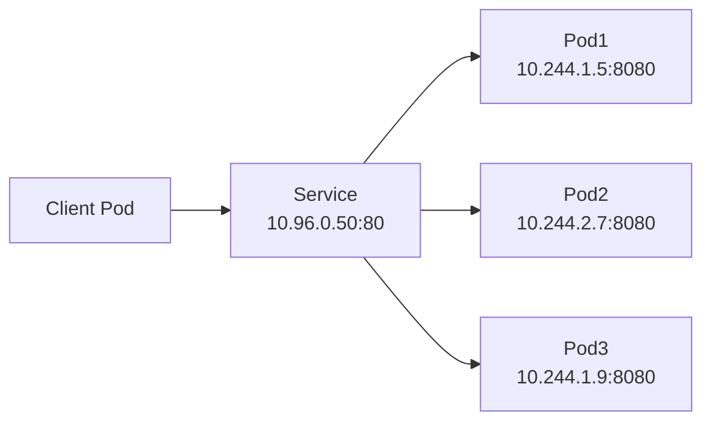

# Service
{: .no_toc }

## 目次
{: .no_toc .text-delta }

1. TOC
{:toc}

---

Pod の IP は再起動で変わります。安定したアクセス先を提供するのが **Service** です。

## Service の役割



- 安定した DNS 名 + ClusterIP を提供
- ラベルセレクタで対象 Pod を選択
- L4 ロードバランシング(ラウンドロビン)

## Service の種類

| Type | 用途 |
|------|------|
| ClusterIP (既定) | クラスタ内通信のみ |
| NodePort | 各ノードのポートで外部公開 |
| LoadBalancer | クラウドのLBを自動作成(オンプレでは MetalLB が必要) |
| ExternalName | 外部DNSへのCNAME |

### ClusterIP

```yaml
apiVersion: v1
kind: Service
metadata:
  name: api
spec:
  type: ClusterIP    # 既定なので省略可
  selector:
    app: api
  ports:
  - port: 80         # Service側のポート
    targetPort: 8080 # Pod側のポート
    name: http
```

### NodePort

```yaml
apiVersion: v1
kind: Service
metadata:
  name: api
spec:
  type: NodePort
  selector:
    app: api
  ports:
  - port: 80
    targetPort: 8080
    nodePort: 30080  # 30000-32767の範囲
```

各ノードの `:30080` でアクセスできます。学習用や、外部 LB から Hairpin させる構成で使用。

### LoadBalancer (オンプレ向け: MetalLB)

クラウドだと LoadBalancer Type で自動的にLBが作られますが、オンプレでは **MetalLB** を入れることで同じ体験が得られます。
本教材では 7 章で MetalLB を導入します。

```yaml
apiVersion: v1
kind: Service
metadata:
  name: api
spec:
  type: LoadBalancer
  selector:
    app: api
  ports:
  - port: 80
    targetPort: 8080
```

## Headless Service

`clusterIP: None` を指定すると、ClusterIP を持たず、DNS で **Pod の IP 一覧を直接返す** Service になります。

```yaml
apiVersion: v1
kind: Service
metadata:
  name: postgres
spec:
  clusterIP: None
  selector:
    app: postgres
  ports:
  - port: 5432
```

クライアント側で個別 Pod へ直接接続したいケース(StatefulSet、ヘッドレスなクライアントロードバランシング)で使用。

## Service と Endpoints / EndpointSlice

Service は背後で **Endpoints** (新しくは EndpointSlice) を持っており、`selector` にマッチする Pod の IP がここに登録されます。

```bash
kubectl get endpoints api
kubectl get endpointslices -l kubernetes.io/service-name=api
```

ここが空のときは「セレクタが Pod に当たっていない」「Pod が Ready でない」が疑い箇所です。

## sessionAffinity

```yaml
spec:
  sessionAffinity: ClientIP
  sessionAffinityConfig:
    clientIP:
      timeoutSeconds: 10800
```

クライアントIP単位で同じ Pod へルーティング。WebSocket やステートフルなアプリで使う。

## ハンズオン: サンプルアプリの Service

```yaml
# api Service
apiVersion: v1
kind: Service
metadata:
  name: todo-api
  labels:
    app.kubernetes.io/name: todo-api
spec:
  selector:
    app.kubernetes.io/name: todo-api
  ports:
  - port: 80
    targetPort: 8000
---
# frontend Service (NodePort で確認)
apiVersion: v1
kind: Service
metadata:
  name: todo-frontend
spec:
  type: NodePort
  selector:
    app.kubernetes.io/name: todo-frontend
  ports:
  - port: 80
    targetPort: 80
    nodePort: 30080
---
# postgres Headless Service
apiVersion: v1
kind: Service
metadata:
  name: postgres
spec:
  clusterIP: None
  selector:
    app.kubernetes.io/name: postgres
  ports:
  - port: 5432
```

## チェックポイント

- [ ] ClusterIP / NodePort / LoadBalancer の使い分けを言える
- [ ] Headless Service が必要なケースを 1 つ以上挙げられる
- [ ] Endpoints が空のときに疑うべきポイントを 2 つ言える
