# Service
{: .no_toc }

## 目次
{: .no_toc .text-delta }

1. TOC
{:toc}

---

## このページのゴール

このページを読み終えると、以下を **自分の言葉で説明できる** ようになります。

- なぜ「Pod IP に直接つなぎに行く」のではダメで、Service という抽象が必要なのか(歴史的経緯と設計判断)
- ClusterIP / NodePort / LoadBalancer / ExternalName / Headless Service それぞれの仕組み・適切な用途・落とし穴
- `port` / `targetPort` / `nodePort` / 名前付きポート / 複数ポートの違い
- Service が裏側でどう実装されているか(kube-proxy の userspace/iptables/IPVS/nftables モード、eBPF 実装)
- Endpoints と EndpointSlice の違い、Pod が Service に組み込まれる/外される条件
- `sessionAffinity` / `externalTrafficPolicy` / `internalTrafficPolicy` / `topologyKeys` / `publishNotReadyAddresses` の意味と使い分け
- 「Service につながらない」「LoadBalancer が Pending」のような典型的トラブルの切り分け手順

## このページのスコープ

本ページでは **L4(TCP/UDP/SCTP)レベル** の Service に集中します。
L7(HTTP のホスト/パスでの振り分け、TLS 終端)は次の [Ingress]({{ '/04-networking/ingress/' | relative_url }}) と [Gateway API]({{ '/04-networking/gateway-api/' | relative_url }}) で扱います。
DNS による名前解決の詳細は [DNSとサービスディスカバリ]({{ '/04-networking/dns/' | relative_url }})、Pod 間ファイアウォールは [NetworkPolicy]({{ '/04-networking/networkpolicy/' | relative_url }}) です。

## なぜ Service が必要か ─ 設計の根拠と歴史

### Pod IP は揮発する

Kubernetes の Pod は、再起動・再スケジュール・スケールアウトのたびに **新しい IP アドレス** を持ちます。
Pod を 1 つ作って `kubectl get pod -o wide` で IP を確認し、`kubectl delete pod` してもう一度作ると、ほぼ確実に違う IP に変わります。

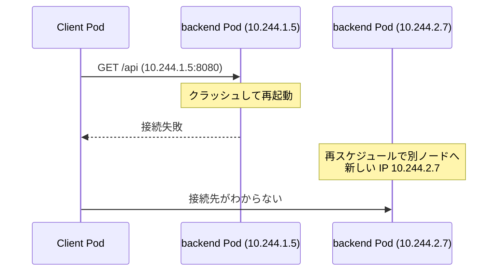
```mermaid
sequenceDiagram
    participant U as Client Pod
    participant P1 as backend Pod (10.244.1.5)
    participant P2 as backend Pod (10.244.2.7)

    U->>P1: GET /api (10.244.1.5:8080)
    Note over P1: クラッシュして再起動
    P1-->>U: 接続失敗
    Note over P2: 再スケジュールで別ノードへ<br>新しい IP 10.244.2.7
    U->>P2: 接続先がわからない
```

これは「アプリケーションの設定に Pod IP を直接書く」運用がほぼ不可能であることを意味します。
**「呼び出される側の IP は変わるが、呼び出す側のコードは変えたくない」** ─ この問題を解決するのが Service です。

### Kubernetes 以前のサービスディスカバリ

Service が出るまで、コンテナのサービスディスカバリは各社が独自に解いていました。

| アプローチ | 代表例 | 課題 |
|-----------|--------|------|
| **DNS ラウンドロビン** | BIND の複数 A レコード | TTL キャッシュが効くと変更が反映されない、ヘルスチェックなし |
| **専用ディスカバリサービス** | Consul、etcd、ZooKeeper | クライアント側にライブラリが必要 |
| **クライアントサイド LB** | Netflix Ribbon、gRPC name resolver | アプリ側に依存、言語ごとの実装が必要 |
| **ハードウェア LB** | F5、A10 | コンテナの IP 変更追従が手動で大変 |
| **フロントエンドプロキシ** | HAProxy + Consul Template | 設定再生成と reload が遅い |

これらは「アプリ側の対応」「外部システムの運用」が必要で、コンテナ環境特有の **「IP が秒単位で変わる前提」** には向きませんでした。

### Service の設計判断 ─ 仮想 IP + Selector

Kubernetes は次の 2 つを組み合わせて、シンプルな解を提示しました。

1. **仮想 IP (ClusterIP)** ─ Service ごとに 1 つの IP を割り当て、それは Service が削除されるまで変わらない
2. **ラベルセレクタ** ─ Service が転送先 Pod を **クエリで選ぶ**(明示登録ではなく)

これにより、

- アプリ側のコードは Pod IP を知らなくていい(Service の名前だけ知っていればいい)
- Pod が出たり入ったりしても、kube-proxy が自動で転送先を更新する
- セレクタなので、ラベルさえ付けば自動で Service に組み込まれる(個別登録不要)

という性質が得られました。

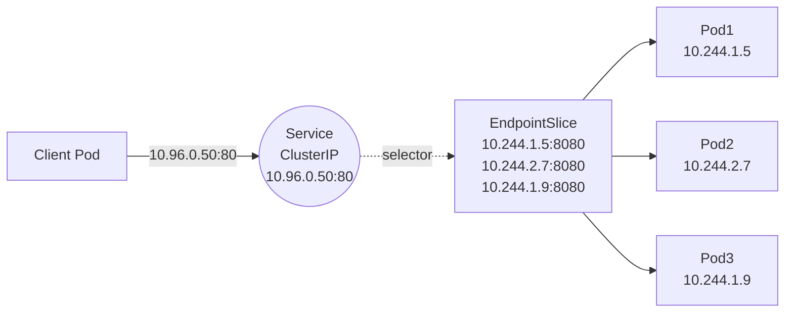
```mermaid
flowchart LR
    c[Client Pod] -->|10.96.0.50:80| svc((Service<br>ClusterIP<br>10.96.0.50:80))
    svc -.selector.-> ep[EndpointSlice<br>10.244.1.5:8080<br>10.244.2.7:8080<br>10.244.1.9:8080]
    ep --> p1[Pod1<br>10.244.1.5]
    ep --> p2[Pod2<br>10.244.2.7]
    ep --> p3[Pod3<br>10.244.1.9]
```

### なぜ「仮想 IP」なのか

ここで疑問になるのが、「DNS だけで Pod IP を返せばいいのでは?」という話です。
事実、それは Headless Service として後述しますが、**普通の ClusterIP は DNS だけではなくカーネル層で IP を NAT する** 設計を取っています。理由は次のとおりです。

1. **DNS キャッシュが障害になる**: 各クライアントの解決結果は数秒〜数分キャッシュされ、Pod の入れ替わりに追従しにくい
2. **クライアント言語のばらつき**: Java/.NET/Go/Python それぞれの DNS 解決の挙動が異なる
3. **コネクションの永続性**: 一度確立した TCP 接続を Pod 障害時に切り替えるには、L4 で介在する仕組みが必要
4. **L4 ロードバランス**: 単純な DNS ラウンドロビンより細かい振り分け(セッション固定、トポロジ考慮)を入れられる

このため、Service は **「DNS で名前解決された ClusterIP に対する通信を、各ノードの kube-proxy がカーネル層で書き換えて Pod に転送する」** という形を採っています。

### 関連標準・参考

- [KEP-1672: Tracking Terminating Endpoints](https://github.com/kubernetes/enhancements/tree/master/keps/sig-network/1672-tracking-terminating-endpoints)
- [KEP-752: EndpointSlice API](https://github.com/kubernetes/enhancements/tree/master/keps/sig-network/0752-endpointslices)
- [KEP-2433: Topology Aware Hints](https://github.com/kubernetes/enhancements/tree/master/keps/sig-network/2433-topology-aware-hints)
- [Service の Kubernetes 公式ドキュメント](https://kubernetes.io/docs/concepts/services-networking/service/)

## Service の基本構造

最小の Service YAML はこうなります。

```yaml
apiVersion: v1
kind: Service
metadata:
  name: todo-api
  namespace: prod
spec:
  selector:
    app.kubernetes.io/name: todo-api
  ports:
  - name: http
    port: 80
    targetPort: 8000
    protocol: TCP
```

各フィールドを順に解説します。

### `apiVersion: v1`

Service は **コア API グループ**(グループ名なし)に属し、`v1` です。
Kubernetes の最初期から存在するリソースで、互換性が極めて高く、`v1` のまま長らく安定しています。

### `kind: Service`

リソース種別。

### `metadata.name`

Service の名前。同 Namespace 内でユニーク。
**この名前はクラスタ内 DNS の A レコード名としてもそのまま使われます**(例: `todo-api.prod.svc.cluster.local`)。
そのため、

- 小文字英数字とハイフンのみ
- 63 文字以内(DNS ラベル制約)
- 数字始まりは可だがハイフン始まり/終わりは不可

という DNS-1035 ラベルのルールに従う必要があります。

### `metadata.namespace`

Namespace。省略時は `default`。
DNS 名は `<name>.<namespace>.svc.cluster.local` なので、Namespace が変わると DNS 名が変わります。

### `spec.selector`

転送先 Pod を **ラベルクエリで選ぶ**。
たとえば上記の例では「`app.kubernetes.io/name: todo-api` ラベルが付いた Pod すべて」が対象になります。

{: .important }
> セレクタは **同 Namespace 内の Pod のみを対象** にします。別 Namespace の Pod を Service の宛先にすることはできません。クロス Namespace で使いたいなら ExternalName か、後述する **selectorless Service + 手動 Endpoints** を使います。

### `spec.ports`

公開するポートの一覧(複数定義可)。各エントリのフィールドは:

| フィールド | 必須 | 意味 |
|-----------|------|------|
| `name` | 複数ポート時必須 | ポートの識別子(Ingress などから参照される) |
| `port` | 必須 | Service 側のポート番号(クライアントが叩くポート) |
| `targetPort` | 省略時 `port` と同じ | Pod 側のポート番号(または名前付きポート名) |
| `nodePort` | NodePort/LB 時のみ | 各ノードで公開するポート(30000-32767) |
| `protocol` | 省略時 `TCP` | TCP / UDP / SCTP |
| `appProtocol` | 任意 | アプリケーション層プロトコル名(例: `http`、`grpc`) |

### `port` / `targetPort` / `nodePort` の関係

ここが Service で最初に詰まる箇所です。図で整理します。

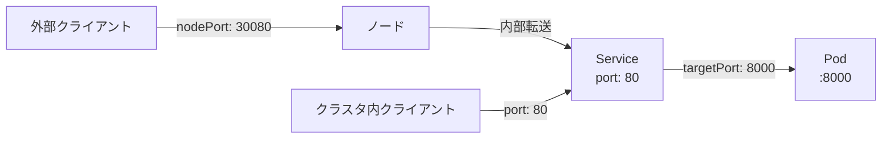
```mermaid
flowchart LR
    ext[外部クライアント] -->|nodePort: 30080| node[ノード]
    node -->|内部転送| svc[Service<br>port: 80]
    int[クラスタ内クライアント] -->|port: 80| svc
    svc -->|targetPort: 8000| pod[Pod<br>:8000]
```

- **`port`** ─ ClusterIP に対して開くポート。クラスタ内の他 Pod がここを叩く
- **`targetPort`** ─ 実際に Pod がリッスンしているポート。Pod 側のコンテナポートと一致させる
- **`nodePort`** ─ 各ノードの物理 IP で公開するポート。`type: NodePort` か `type: LoadBalancer` のとき設定可能

`targetPort` には **数値ではなく名前** を指定することもできます。これは Pod 側の `containerPort` に名前を付けておくと使えます。

```yaml
# Pod 側
spec:
  containers:
  - name: api
    image: todo-api:0.1.0
    ports:
    - name: http
      containerPort: 8000
---
# Service 側
spec:
  ports:
  - port: 80
    targetPort: http   # ← 名前で参照
```

**メリット**: アプリ側でポート番号を変えても Service の YAML を直さなくていい。
**デメリット**: Pod に名前付きポートを必ず書く規律が要る。

### `spec.type`

`ClusterIP` / `NodePort` / `LoadBalancer` / `ExternalName` のいずれか。省略時は `ClusterIP`。
詳しくは次節で。

## Service Type 詳説

### ClusterIP(既定)

クラスタ内部からだけ到達可能な仮想 IP を発行する。最もよく使う型。

```yaml
apiVersion: v1
kind: Service
metadata:
  name: todo-api
spec:
  type: ClusterIP
  selector:
    app.kubernetes.io/name: todo-api
  ports:
  - port: 80
    targetPort: 8000
```

`kubectl get svc todo-api` の出力例:

```
NAME       TYPE        CLUSTER-IP      EXTERNAL-IP   PORT(S)   AGE
todo-api   ClusterIP   10.96.143.27    <none>        80/TCP    5s
```

`CLUSTER-IP` は Service 作成時に **`kube-controller-manager` の `--service-cluster-ip-range` から自動払い出し**されます。
明示的に指定したい場合:

```yaml
spec:
  clusterIP: 10.96.0.100
```

ただしこの IP は範囲内・未使用である必要があり、本番では基本任せます。

#### `clusterIP: None`(Headless)

特殊指定。ClusterIP を持たず、DNS が **Pod IP のリスト** を直接返す。後述。

#### Dual-Stack(IPv4 + IPv6)

`v1.23` から GA。Service は IPv4/IPv6 の両方を持てます。

```yaml
spec:
  ipFamilyPolicy: PreferDualStack   # SingleStack / PreferDualStack / RequireDualStack
  ipFamilies: [IPv4, IPv6]
```

クラスタ自体が Dual-Stack で構成されている必要があります。

### NodePort

各ノードの物理 IP の指定ポート(30000-32767 の既定範囲)で外部公開する。

```yaml
apiVersion: v1
kind: Service
metadata:
  name: todo-frontend
spec:
  type: NodePort
  selector:
    app.kubernetes.io/name: todo-frontend
  ports:
  - port: 80
    targetPort: 80
    nodePort: 30080
```

挙動:

- 各ノード(`k8s-w1`、`k8s-w2`、`k8s-w3` など)の `:30080` でアクセスできる
- どのノードに来たパケットも、kube-proxy が転送先 Pod へ NAT する(別ノードに飛ぶことも当然ある)
- ClusterIP も同時に発行される(NodePort は ClusterIP の上位互換)

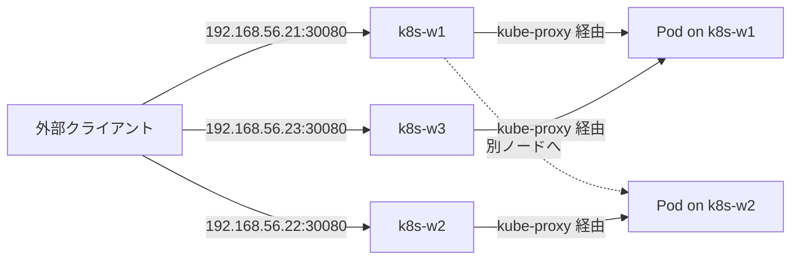
```mermaid
flowchart LR
    ext[外部クライアント] -->|192.168.56.21:30080| n1[k8s-w1]
    ext -->|192.168.56.22:30080| n2[k8s-w2]
    ext -->|192.168.56.23:30080| n3[k8s-w3]
    n1 -->|kube-proxy 経由| pod1[Pod on k8s-w1]
    n1 -.別ノードへ.-> pod2[Pod on k8s-w2]
    n2 -->|kube-proxy 経由| pod2
    n3 -->|kube-proxy 経由| pod1
```

NodePort 範囲は API サーバの `--service-node-port-range`(既定 `30000-32767`)で変更可能ですが、本番では既定のままが普通です。

#### nodePort を省略するとどうなるか

省略すると、**範囲内の空いているポートが自動採番**されます。実運用ではこの方が安全です(衝突を避けられる)。
ただし、外部から固定アドレスでアクセスしたいときは明示します。

#### NodePort の本番での使われ方

本番で NodePort を直接エンドユーザーに公開することは少なく、

- 外部 LB(F5、HAProxy 等)からの流入先
- LoadBalancer Type が使えない環境(オンプレで MetalLB すら入れられない)
- 開発・確認用

として使われます。

### LoadBalancer

外部 LB(クラウドの ELB/ALB、オンプレの MetalLB)を Service に紐付けて、クラスタ外からアクセスできる外部 IP を発行する。

```yaml
apiVersion: v1
kind: Service
metadata:
  name: todo-frontend
spec:
  type: LoadBalancer
  selector:
    app.kubernetes.io/name: todo-frontend
  ports:
  - port: 80
    targetPort: 80
```

`type: LoadBalancer` は **NodePort + ClusterIP も内包**します(`kubectl get svc` で `PORT(S)` を見ると `80:31234/TCP` のように両方表示)。

#### クラウドでの動作

EKS/GKE/AKS では、クラウドコントローラ(`cloud-controller-manager`)がクラウド API を叩いて LB を作成し、Service の `EXTERNAL-IP` に LB の IP/DNS 名を書き込みます。

#### オンプレでの動作 ─ MetalLB

オンプレ kubeadm クラスタでは、何もしないと `EXTERNAL-IP` が `<pending>` のままです。これは **クラスタ管理者が外部 LB プロビジョニングの仕組みを別途用意する必要がある** ためです。

本教材では **MetalLB**(オンプレ向けの LB Controller)を 7 章で導入し、`192.168.56.200-250` のプールから IP を払い出す構成を取ります。

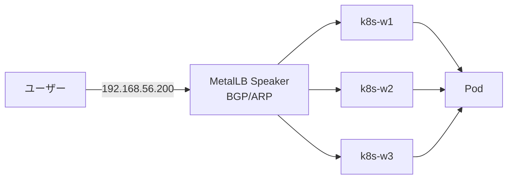
```mermaid
flowchart LR
    user[ユーザー] -->|192.168.56.200| metallb[MetalLB Speaker<br>BGP/ARP]
    metallb --> n1[k8s-w1]
    metallb --> n2[k8s-w2]
    metallb --> n3[k8s-w3]
    n1 --> pod[Pod]
    n2 --> pod
    n3 --> pod
```

MetalLB は L2(ARP/NDP)モードと BGP モードがあり、本教材は L2 モードを使います。

#### `loadBalancerSourceRanges`

LB のソース IP を制限できます(対応はクラウド依存)。

```yaml
spec:
  type: LoadBalancer
  loadBalancerSourceRanges:
  - 203.0.113.0/24
  - 198.51.100.5/32
```

#### `loadBalancerIP`(deprecated)

特定の IP を要求する古いフィールド。`v1.24` で deprecated。MetalLB は独自アノテーション `metallb.universe.tf/loadBalancerIPs` を推奨。

#### `allocateLoadBalancerNodePorts: false`

`v1.24` で stable。**LB のバックエンドに NodePort を経由しない構成**(LB が直接 Pod IP を呼ぶ)で使う。

### ExternalName

外部 DNS への CNAME を返す Service。Pod IP やセレクタは持たない。

```yaml
apiVersion: v1
kind: Service
metadata:
  name: legacy-db
spec:
  type: ExternalName
  externalName: db.example.com
```

クラスタ内から `legacy-db` で問い合わせると、CoreDNS が `db.example.com` の CNAME を返します。
これは **既存の外部システムを Service の名前空間に統合する** ときに使います。
たとえば「ステージングではクラスタ内の Postgres を使うが、本番では RDS を使う」というとき、本番の Service だけ ExternalName にしておけば、アプリ側のコードは `postgres` という名前のままで済みます。

注意点:

- TCP/UDP の代理ではなく、**DNS の CNAME 解決のみ** を提供する
- HTTPS の場合、SNI/Host が外部ホスト名(例: `db.example.com`)になる必要があり、アプリ側の挙動に注意
- ポート定義は不要(Service IP がない)

### Headless Service(`clusterIP: None`)

ClusterIP を割り当てず、DNS の問い合わせに **対象 Pod の IP リスト** を直接返す。

```yaml
apiVersion: v1
kind: Service
metadata:
  name: postgres
spec:
  clusterIP: None
  selector:
    app.kubernetes.io/name: postgres
  ports:
  - port: 5432
```

`nslookup postgres.prod.svc.cluster.local` の応答:

```
postgres.prod.svc.cluster.local has address 10.244.1.5
postgres.prod.svc.cluster.local has address 10.244.2.7
postgres.prod.svc.cluster.local has address 10.244.1.9
```

#### 何が嬉しいのか

1. **クライアント側で個別 Pod を選びたい**: 例えば Postgres レプリカで「読み込みは ReadReplica、書き込みは Primary」と振り分けたい
2. **StatefulSet と組み合わせて、Pod ごとに DNS 名を持たせたい**: `postgres-0.postgres.prod.svc.cluster.local` のように
3. **クライアントサイド LB を使いたい**: gRPC のように、複数バックエンドへ自前で振り分けるクライアントを使うとき
4. **kube-proxy の NAT を経由したくない**: パフォーマンスシビアな用途や、Pod IP を保ちたいケース

#### StatefulSet の各 Pod を直接指せる

Headless Service + StatefulSet の組み合わせでは、各 Pod の DNS 名が:

```
<pod-name>.<headless-service-name>.<namespace>.svc.cluster.local
```

の形で生まれます。サンプルアプリの Postgres なら:

```
postgres-0.postgres.prod.svc.cluster.local
postgres-1.postgres.prod.svc.cluster.local
postgres-2.postgres.prod.svc.cluster.local
```

これは「Postgres の Primary は常に `postgres-0`」のような **アイデンティティのある分散システム** を組むときに不可欠です。

### Selectorless Service(セレクタなし)

`selector` を書かない Service も作れます。この場合、`Endpoints` を **手動で書く** 必要があります。

```yaml
apiVersion: v1
kind: Service
metadata:
  name: external-mysql
spec:
  ports:
  - port: 3306
---
apiVersion: v1
kind: Endpoints
metadata:
  name: external-mysql   # ← Service と同名
subsets:
- addresses:
  - ip: 192.168.10.50
  ports:
  - port: 3306
```

ユースケース:

- **クラスタ外のサービスをクラスタ内 DNS でアクセス**: 上の例では、Pod から `external-mysql:3306` で外部 MySQL へつなげる
- **異なる Namespace の Service へリダイレクト**: ExternalName でも代用可だが、TCP セッションを通したい場合に有用
- **段階的移行**: クラスタ外から内へアプリを移すとき、Service 名を保ったままバックエンドだけ切り替えられる

注意:

- 手動 Endpoints は **EndpointSlice にも自動反映される(双方向、`v1.21+`)**
- 自分で Endpoints を更新する仕組み(operator や kubectl apply)が必要

### Type の使い分けまとめ

| Type | 用途 | 外部公開 | LB 必要 |
|------|------|---------|---------|
| ClusterIP | クラスタ内部通信 | 不可 | 不要 |
| NodePort | 学習・小規模・外部 LB の前段 | 各ノード IP | 不要 |
| LoadBalancer | 本番外部公開 | LB の IP | クラウドか MetalLB |
| ExternalName | 外部サービスを内部名で呼ぶ | DNS のみ | 不要 |
| Headless | StatefulSet・クライアントLB | DNS で全 Pod IP | 不要 |

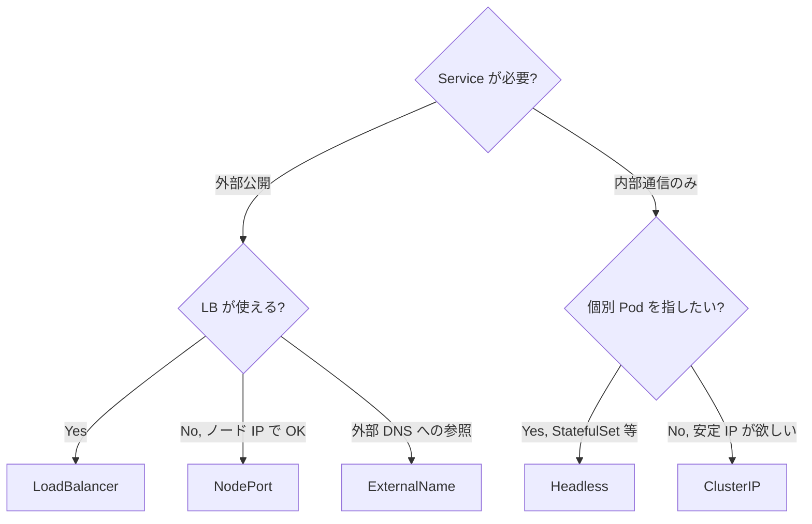
```mermaid
flowchart TD
    Q{Service が必要?} -->|外部公開| Q2{LB が使える?}
    Q -->|内部通信のみ| Q3{個別 Pod を指したい?}
    Q2 -->|Yes| LB[LoadBalancer]
    Q2 -->|No, ノード IP で OK| NP[NodePort]
    Q2 -->|外部 DNS への参照| EN[ExternalName]
    Q3 -->|Yes, StatefulSet 等| HL[Headless]
    Q3 -->|No, 安定 IP が欲しい| CI[ClusterIP]
```

## Endpoints と EndpointSlice

Service の影には **Endpoints**(古い API)と **EndpointSlice**(新しい API)というリソースがいます。
これらは Service の selector にマッチする Pod の IP/Port のリストを保持し、kube-proxy はこれを見て iptables/IPVS を更新します。

### Endpoints(旧)

```bash
kubectl get endpoints todo-api -n prod -o yaml
```

```yaml
apiVersion: v1
kind: Endpoints
metadata:
  name: todo-api
  namespace: prod
subsets:
- addresses:
  - ip: 10.244.1.5
    nodeName: k8s-w1
    targetRef:
      kind: Pod
      name: todo-api-7d8c9f-abc12
  - ip: 10.244.2.7
    nodeName: k8s-w2
    targetRef:
      kind: Pod
      name: todo-api-7d8c9f-def34
  ports:
  - port: 8000
    protocol: TCP
```

### Endpoints の問題と EndpointSlice

`Endpoints` は **1 Service につき 1 オブジェクト** で、対象 Pod が増えるとオブジェクトサイズが線形に膨らみます。
1000 Pod の Service だと 1 つの Endpoints が 1MB を超え、

- API サーバから kube-proxy への push が大きい
- 1 Pod 入れ替わるだけで全 Pod 分のリストが書き換わって watch が走る
- etcd への書き込みも大きい

という **大規模クラスタでスケールしない問題** がありました。

そこで登場したのが **EndpointSlice**(`v1.17` αlpha、`v1.21` GA)です。
これは **Pod を「スライス」(既定で最大 100 Pod / スライス)** に分割し、複数の小さなオブジェクトとして管理します。

```bash
kubectl get endpointslices -l kubernetes.io/service-name=todo-api -n prod
```

```
NAME             ADDRESSTYPE   PORTS   ENDPOINTS                  AGE
todo-api-abc12   IPv4          8000    10.244.1.5,10.244.2.7,...  10m
todo-api-def34   IPv4          8000    10.244.1.9,10.244.3.2,...  10m
```

#### Endpoints との違い

| 項目 | Endpoints | EndpointSlice |
|------|-----------|---------------|
| オブジェクト数 | 1 / Service | 複数 / Service |
| 1 オブジェクトの最大エントリ | 制限なし(事実上) | 既定 100 |
| Dual-Stack 対応 | 1 オブジェクトに混在 | アドレスタイプ(IPv4/IPv6)ごとに別スライス |
| Topology 情報 | 限定的 | `zone`、`hints` を持つ |
| Conditions | `ready` だけ | `ready` / `serving` / `terminating` |
| 互換性 | 旧クライアント | `v1.21+` 推奨 |

#### Conditions の意味

EndpointSlice の各エンドポイントには 3 つの状態があります。

| Condition | 意味 |
|-----------|------|
| `ready` | Pod の readinessProbe が通っている |
| `serving` | コンテナが起動していて、リクエストを処理可能(`ready` と独立) |
| `terminating` | Pod が削除中(graceful shutdown 中) |

これは「**Pod が削除されようとしている間も、すでに張られたコネクションは終わるまで処理を続けたい**」というユースケースを表現するためです(KEP-1672)。
具体的には、`terminating: true` だが `serving: true` のエンドポイントは、**新規接続は流さないが、既存接続は処理する**という挙動を取ります。

### kube-proxy が EndpointSlice を読む流れ

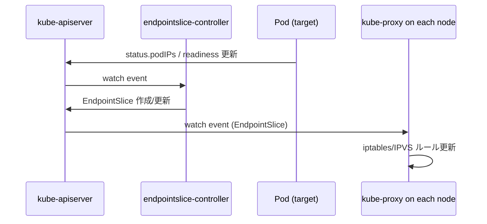
```mermaid
sequenceDiagram
    participant API as kube-apiserver
    participant ESC as endpointslice-controller
    participant Pod as Pod (target)
    participant KP as kube-proxy on each node

    Pod->>API: status.podIPs / readiness 更新
    API->>ESC: watch event
    ESC->>API: EndpointSlice 作成/更新
    API->>KP: watch event (EndpointSlice)
    KP->>KP: iptables/IPVS ルール更新
```

これは「Pod の状態変化が kube-proxy のルールに反映されるまで」のフローで、トラブルシュート時に **どこの段階で詰まっているか** を切り分けるのに使います。

## kube-proxy ─ Service 実装の本体

Service の魔法は **kube-proxy が各ノードで Service VIP → Pod IP の NAT を実装**することで成り立っています。

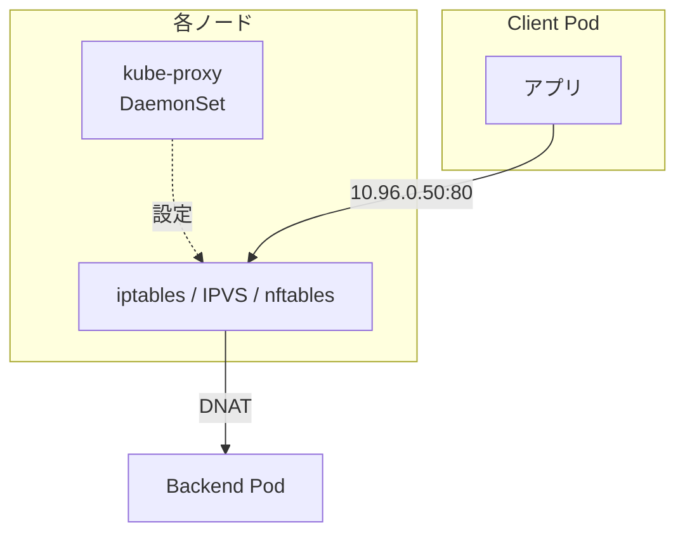
```mermaid
flowchart TB
    subgraph Node[各ノード]
        kp[kube-proxy<br>DaemonSet]
        ipt[iptables / IPVS / nftables]
        kp -.設定.-> ipt
    end
    subgraph Pod1[Client Pod]
        c[アプリ]
    end
    c -->|10.96.0.50:80| ipt
    ipt -->|DNAT| target[Backend Pod]
```

kube-proxy の実装モードは時代ごとに進化してきました。

### モード 1: userspace(歴史)

最初期のモード。kube-proxy 自身がプロキシとしてパケットを中継していました。

- パケットがカーネル → kube-proxy(userspace)→ カーネル と往復するため遅い
- 1.2 で iptables モードが既定に置き換えられ、現在は使うべきでない

### モード 2: iptables モード(2016〜現在)

`KUBE-SERVICES`、`KUBE-SVC-XXX`、`KUBE-SEP-YYY` という iptables チェーンを生成し、`PREROUTING` に挿入する。

```bash
sudo iptables -t nat -L KUBE-SERVICES -n
```

抜粋(イメージ):

```
KUBE-SVC-ABC  tcp  --  anywhere   10.96.143.27   tcp dpt:80  /* prod/todo-api:http cluster IP */
```

そして `KUBE-SVC-ABC` 内で「等確率で `KUBE-SEP-XXX`(Pod ごとのチェーン)へ飛ばす」ルールが書かれます。

```
-A KUBE-SVC-ABC -m statistic --mode random --probability 0.33 -j KUBE-SEP-P1
-A KUBE-SVC-ABC -m statistic --mode random --probability 0.50 -j KUBE-SEP-P2
-A KUBE-SVC-ABC -j KUBE-SEP-P3
```

確率がだんだん上がっているのは、「最初の Pod に 1/3、残ったところで 1/2(=全体の 1/3)、最後に残った全てを 1/3」という **加算的な確率分配** です。

#### iptables モードの欠点

- ルール数が **Service 数 × Pod 数** に比例して増え、**O(n) の lookup**(ルールが上から順に評価される)
- 5,000 Service 規模になるとルール反映に分単位かかる
- ルール変更は **全削除→全再生成** に近く、変更中の旧ルールが残ることがある

### モード 3: IPVS モード(2018〜)

Linux カーネルの **IPVS(IP Virtual Server)** を使うモード。
`KUBE-IPVS0` という dummy インタフェースに ClusterIP をぶら下げ、IPVS ルールで Pod IP に転送する。

```bash
sudo ipvsadm -Ln
```

```
TCP  10.96.143.27:80 rr
  -> 10.244.1.5:8000              Masq    1      0          0
  -> 10.244.2.7:8000              Masq    1      0          0
```

#### IPVS の利点

- ルックアップが **ハッシュテーブル(O(1))** で速い
- ルール追加削除がノンブロッキング
- ロードバランスアルゴリズム選択可能(`rr`/`lc`/`dh`/`sh`/`sed`/`nq`)

#### IPVS モードの起動

kube-proxy の `--proxy-mode=ipvs` で有効化。kubeadm では `kube-proxy` ConfigMap を編集:

```yaml
mode: "ipvs"
ipvs:
  scheduler: "rr"   # ラウンドロビン(他に lc, dh, sh, sed, nq)
```

#### IPVS モードの注意

- conntrack のテーブルサイズが大規模クラスタで問題になりやすい(`net.netfilter.nf_conntrack_max`)
- NodePort で `externalTrafficPolicy: Local` 使用時、一部ディストリで挙動差がある
- IPVS は Linux カーネル 4.1+ が必要

### モード 4: nftables モード(`v1.31` βeta)

`iptables` の後継である `nftables` を使うモード。`v1.31` で βeta、将来の既定候補。

メリット:

- iptables より高速(ルックアップが効率的)
- ルール記述がよりモダン

```yaml
mode: "nftables"
```

`v1.30` 段階ではまだ実験的。本教材は v1.30 を使うのでまだ採用しません。

### モード 5: eBPF(kube-proxy なし)

CNI である **Cilium** を `kube-proxy replacement` モードで使うと、kube-proxy 自体を **不要にして** Service の NAT を eBPF プログラムで実装します。

メリット:

- iptables/IPVS のルールを一切書かない(カーネルにロードされた eBPF プログラムが処理)
- スケーラビリティ高い(数万 Service でもオーバーヘッドが小さい)
- Pod のラベルや Identity を eBPF プログラム内で扱える(Cilium NetworkPolicy)

本教材では Calico + iptables の組み合わせを採用しますが、**eBPF/Cilium が次世代の有力選択肢**である点は押さえておきましょう。

### kube-proxy のモード比較

| モード | スケーラビリティ | 既定 | 状態 |
|--------|----------------|-----|------|
| userspace | × | 旧既定 | 非推奨 |
| iptables | △(O(n)) | 現既定 | 安定 |
| IPVS | ○(O(1)) | 任意 | 安定 |
| nftables | ○ | - | βeta(`v1.31`) |
| eBPF (Cilium) | ◎ | - | 安定(Cilium 採用時) |

### conntrack の重要性

kube-proxy の iptables/IPVS モードはどちらも **DNAT** を行うため、Linux カーネルの **conntrack(接続追跡テーブル)** にエントリが作られます。

問題:

- conntrack テーブルがあふれると新規接続が落ちる
- `net.netfilter.nf_conntrack_max` の既定はノードのメモリ次第で変動
- UDP は TCP と違って明示的な FIN がないので、エントリが TTL で消えるまで残り続ける

確認:

```bash
sudo sysctl net.netfilter.nf_conntrack_max
sudo cat /proc/sys/net/netfilter/nf_conntrack_count
```

本番では:

```bash
sudo sysctl -w net.netfilter.nf_conntrack_max=1048576
```

のように増やすことが多いです(ノード単位)。

## サービスディスカバリ ─ DNS と環境変数

Service には 2 つの方法でアクセスできます。

### 1. DNS

CoreDNS が以下のレコードを自動で発行します。

| 種類 | レコード | 解決先 |
|------|---------|-------|
| Service | `<svc>.<ns>.svc.cluster.local` | A: ClusterIP |
| Headless Service | `<svc>.<ns>.svc.cluster.local` | A: 全 Pod IP |
| StatefulSet Pod | `<pod>.<svc>.<ns>.svc.cluster.local` | A: 該当 Pod IP |
| SRV | `_<port>._<proto>.<svc>.<ns>.svc.cluster.local` | SRV: ポート + ターゲット |

詳細は [DNSとサービスディスカバリ]({{ '/04-networking/dns/' | relative_url }}) で扱います。

### 2. 環境変数(歴史的)

Pod が **作成された時点で** 既に存在する Service について、kubelet が環境変数として注入します。

```
TODO_API_SERVICE_HOST=10.96.143.27
TODO_API_SERVICE_PORT=80
TODO_API_PORT=tcp://10.96.143.27:80
TODO_API_PORT_80_TCP=tcp://10.96.143.27:80
TODO_API_PORT_80_TCP_PROTO=tcp
TODO_API_PORT_80_TCP_PORT=80
TODO_API_PORT_80_TCP_ADDR=10.96.143.27
```

これは Docker の `--link` 機能の継承で、

- Pod 起動時の Service しか得られない(後から作った Service は見えない)
- Service 名にハイフンがあると環境変数では `_` に変換されて読みにくい

など **古い時代の名残**です。
**新しいコードでは DNS で名前解決するべき**で、環境変数経由は使うべきではありません。
ただし古いツールがこの環境変数に依存していることがあるので、知識としては押さえておきましょう。

無効化したい場合、Pod の `spec.enableServiceLinks: false` を設定。

## sessionAffinity

クライアント IP 単位で同じ Pod へルーティングする機能。

```yaml
spec:
  sessionAffinity: ClientIP
  sessionAffinityConfig:
    clientIP:
      timeoutSeconds: 10800   # 3時間
```

`None`(既定)か `ClientIP` のみ。Cookie ベースなど L7 のセッション固定は **Service ではなく Ingress 側**で行います。

ユースケース:

- WebSocket(同じ Pod に張り続けたい)
- セッションをローカルメモリに持つレガシーアプリ

注意:

- クライアントが NAT 越しだと「全クライアントが同じ IP」と見えて偏る
- 永続化が必要なら、本来は Redis などの外部セッションストアに寄せるべき

## externalTrafficPolicy

NodePort/LoadBalancer Service で「外部から来たトラフィックをどう扱うか」を制御。

```yaml
spec:
  type: LoadBalancer
  externalTrafficPolicy: Local   # Cluster / Local
```

| 値 | 挙動 |
|----|------|
| `Cluster`(既定) | どのノードに来たトラフィックも、全ノードの全 Pod に振り分ける(別ノードに飛ばすことも) |
| `Local` | 受信ノード内の Pod にのみ振り分ける。Pod がいなければ落とす |

#### `Cluster` の利点と欠点

- ✅ どのノードでも均等にロードバランス
- ❌ 別ノードへの転送時に **SNAT** が入り、**送信元 IP が失われる**(アプリ側にはノード IP として見える)
- ❌ 1 ホップ余計に挟むのでレイテンシ +α

#### `Local` の利点と欠点

- ✅ 送信元 IP が保たれる(SNAT なし)
- ✅ ホップが減ってレイテンシ低い
- ❌ ノードに該当 Pod がないとトラフィックが落ちる(LB のヘルスチェックでカバーする必要あり)
- ❌ Pod 配置の偏りがそのままトラフィックの偏りになる

#### LB のヘルスチェックポート

`externalTrafficPolicy: Local` の Service には自動で **healthCheckNodePort** が割り当てられます。
LB はこのポートを叩いて「このノードに Pod がいるか?」を判定し、Pod のいないノードはバックエンドから外します。

```bash
kubectl get svc todo-frontend -o yaml | grep healthCheckNodePort
```

クラウドの場合は LB が自動でこれをヘルスチェックに使いますが、MetalLB の場合は L2 モードだとヘルスチェック非対応で、Pod のいるノードが代表 IP を持つ仕組み(speaker の選挙)で対処します。

## internalTrafficPolicy

`v1.26` で GA。**クラスタ内** からのトラフィックを「同じノードの Pod だけに振り分ける」モード。

```yaml
spec:
  internalTrafficPolicy: Local   # Cluster / Local
```

ユースケース:

- DaemonSet として動くサイドカー(ログ収集 Agent など)に、同じノードの Pod からだけアクセスさせたい
- ノード内ローカル通信に絞ってネットワーク帯域を節約したい

## publishNotReadyAddresses

通常、`readinessProbe` が通っていない Pod は EndpointSlice の `ready: false` 状態になり、Service の振り分け先から外れます。
しかし「Ready でない Pod も DNS で見えるようにしたい」ケースがあります。

```yaml
spec:
  publishNotReadyAddresses: true
```

ユースケース:

- StatefulSet で Pod 同士が **Ready 前にクラスタを組む** 必要がある(Cassandra、Elasticsearch、etcd など)
- Pod の起動時に互いを見つけ合うブートストラップ処理

## TopologyAwareHints / TopologyAwareRouting

`v1.27` で `TopologyAwareHints` から `TopologyAwareRouting` に名称変更(機能はほぼ同じ)。

```yaml
metadata:
  annotations:
    service.kubernetes.io/topology-mode: Auto
```

これを付けると、kube-proxy が **同じゾーンの Pod を優先**します。
クラウドのマルチ AZ 環境で、ゾーン跨ぎの転送料金とレイテンシを減らすために使います。
オンプレでは効果が小さいことが多く、本教材では使いません。

## ハンズオン: サンプルアプリの Service 設計

サンプル「ミニTODO」では以下の Service を作ります。

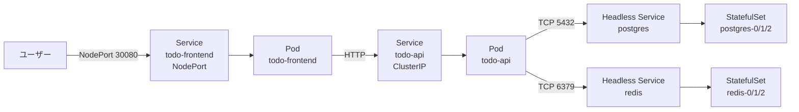
```mermaid
flowchart LR
    user[ユーザー] -->|NodePort 30080| feSvc[Service<br>todo-frontend<br>NodePort]
    feSvc --> fe[Pod<br>todo-frontend]
    fe -->|HTTP| apiSvc[Service<br>todo-api<br>ClusterIP]
    apiSvc --> api[Pod<br>todo-api]
    api -->|TCP 5432| pgSvc[Headless Service<br>postgres]
    api -->|TCP 6379| rdSvc[Headless Service<br>redis]
    pgSvc --> pg[StatefulSet<br>postgres-0/1/2]
    rdSvc --> rd[StatefulSet<br>redis-0/1/2]
```

`prod/services.yaml`:

```yaml
# todo-api: ClusterIP(内部のみ)
apiVersion: v1
kind: Service
metadata:
  name: todo-api
  namespace: prod
  labels:
    app.kubernetes.io/name: todo-api
    app.kubernetes.io/part-of: todo
spec:
  type: ClusterIP
  selector:
    app.kubernetes.io/name: todo-api
  ports:
  - name: http
    port: 80
    targetPort: 8000
    protocol: TCP
    appProtocol: http
---
# todo-frontend: NodePort で動作確認しやすく
apiVersion: v1
kind: Service
metadata:
  name: todo-frontend
  namespace: prod
  labels:
    app.kubernetes.io/name: todo-frontend
    app.kubernetes.io/part-of: todo
spec:
  type: NodePort
  selector:
    app.kubernetes.io/name: todo-frontend
  ports:
  - name: http
    port: 80
    targetPort: 80
    nodePort: 30080
    protocol: TCP
---
# postgres: Headless(StatefulSet 用)
apiVersion: v1
kind: Service
metadata:
  name: postgres
  namespace: prod
  labels:
    app.kubernetes.io/name: postgres
    app.kubernetes.io/part-of: todo
spec:
  clusterIP: None
  selector:
    app.kubernetes.io/name: postgres
  ports:
  - name: postgres
    port: 5432
    targetPort: 5432
    protocol: TCP
---
# redis: Headless
apiVersion: v1
kind: Service
metadata:
  name: redis
  namespace: prod
  labels:
    app.kubernetes.io/name: redis
    app.kubernetes.io/part-of: todo
spec:
  clusterIP: None
  selector:
    app.kubernetes.io/name: redis
  ports:
  - name: redis
    port: 6379
    targetPort: 6379
    protocol: TCP
```

### 適用と確認

```bash
kubectl apply -f prod/services.yaml
```

**何が起きるか**: API サーバが Service オブジェクトを etcd に書き込み、`kube-controller-manager` が ClusterIP を払い出し、`endpointslice-controller` が selector にマッチする Pod から EndpointSlice を生成、kube-proxy がそれを受け取って iptables/IPVS ルールを書き換えます。

**期待される出力**:

```
service/todo-api created
service/todo-frontend created
service/postgres created
service/redis created
```

確認コマンド一式:

```bash
kubectl get svc -n prod
```

**期待される出力**:

```
NAME            TYPE        CLUSTER-IP       EXTERNAL-IP   PORT(S)        AGE
postgres        ClusterIP   None             <none>        5432/TCP       3s
redis           ClusterIP   None             <none>        6379/TCP       3s
todo-api        ClusterIP   10.96.143.27     <none>        80/TCP         3s
todo-frontend   NodePort    10.96.121.55     <none>        80:30080/TCP   3s
```

ポイント:

- `postgres`、`redis` は `CLUSTER-IP` が `None` ─ Headless になっている
- `todo-frontend` の `PORT(S)` が `80:30080/TCP` ─ ClusterIP の 80 と NodePort の 30080 両方を持っている
- `EXTERNAL-IP` はすべて `<none>`(LoadBalancer ではないので)

### EndpointSlice の確認

```bash
kubectl get endpointslices -n prod -l kubernetes.io/service-name=todo-api
```

**期待される出力**:

```
NAME             ADDRESSTYPE   PORTS   ENDPOINTS                  AGE
todo-api-x7a9b   IPv4          8000    10.244.1.5,10.244.2.7,...  10s
```

詳細を見る:

```bash
kubectl describe endpointslices -n prod -l kubernetes.io/service-name=todo-api
```

`Endpoints` セクションに各 Pod IP・nodeName・conditions(ready/serving/terminating)が出ます。

### 内部疎通テスト

クラスタ内から `todo-api` Service にアクセスできるかを確認します。

```bash
kubectl run debug -n prod --rm -it \
  --image=nicolaka/netshoot --restart=Never -- bash
```

`netshoot` Pod 内で:

```bash
# DNS 解決
nslookup todo-api.prod.svc.cluster.local
# 期待: 10.96.143.27 が返ってくる

# 短縮名(同 Namespace から)
nslookup todo-api
# 同じく 10.96.143.27

# HTTP 疎通
curl -i http://todo-api/health
# 200 OK が返れば成功

# Headless Service の確認
nslookup postgres.prod.svc.cluster.local
# 複数 A レコード(全 postgres Pod の IP)が返る

# StatefulSet の特定 Pod
nslookup postgres-0.postgres.prod.svc.cluster.local
# postgres-0 の IP のみ返る
```

### NodePort 経由での外部疎通

```bash
# kubeadm クラスタの場合
curl -i http://192.168.56.21:30080/

# Minikube
minikube service todo-frontend -n prod --url
```

## 本番運用の落とし穴

### 1. `port` と `targetPort` の取り違え

最頻出のバグ。Service の `port` を `8000` にして、`targetPort` を省略すると、Service は `8000` で待ち受けますが、Pod のリッスンポートが `8080` だったりすると当然繋がりません。

**対策**:

- 名前付きポートを使う(Pod 側に `name: http` を付け、Service の `targetPort: http` で参照)
- `kubectl describe svc <name>` で `Endpoints:` 行が空でないかを必ず確認

### 2. `selector` のラベルミスマッチ

Service の `selector` が、対象 Pod のラベルと食い違っていると `Endpoints` が空になります。

```bash
kubectl describe svc todo-api -n prod | grep Endpoints
# Endpoints: <none>   ← これが空ならアウト
```

**確認**:

```bash
kubectl get pods -n prod --show-labels
kubectl get svc todo-api -n prod -o jsonpath='{.spec.selector}'
```

### 3. `readinessProbe` 未設定で Service ローテーションに乗らない

Pod が起動はしているが、まだアプリが起動完了していない状態で Service にトラフィックが流れてしまう。
**Pod に `readinessProbe` を必ず設定**し、本当に処理可能になってから endpoint に登録されるようにします。

### 4. NodePort の閉塞

NodePort を使っているのにアクセスできない場合、

- ホスト OS のファイアウォール(`ufw`、`firewalld`、iptables)が当該ポートを閉じている
- クラウドのセキュリティグループで閉じている
- Service の `externalTrafficPolicy: Local` で対象ノードに Pod がいない

を確認。

### 5. LoadBalancer が `<pending>` のまま

`type: LoadBalancer` を作ったのに `EXTERNAL-IP` が `<pending>` のまま動かない場合:

- クラウドコントローラ(GKE/EKS/AKS)が動いているか
- オンプレなら MetalLB が入っているか、IP プールが余っているか
- Service の `loadBalancerIP` がプール外を指していないか

```bash
kubectl get events -n prod --field-selector involvedObject.name=todo-frontend
```

### 6. conntrack あふれ

高負荷の Service で `dmesg` に `nf_conntrack: table full, dropping packet` が出たら conntrack あふれ。

```bash
sudo sysctl -w net.netfilter.nf_conntrack_max=1048576
echo 'net.netfilter.nf_conntrack_max=1048576' | sudo tee /etc/sysctl.d/99-conntrack.conf
```

### 7. `externalTrafficPolicy: Local` の Pod 偏り

`Local` ポリシーで Pod がノード `k8s-w1` にしかいない場合、`k8s-w2` `k8s-w3` に来た外部トラフィックは破棄されます。
LB のヘルスチェックが正しく `healthCheckNodePort` を見ていれば、そもそも `k8s-w2` `k8s-w3` にトラフィックが流れないはずですが、LB の設定ミスで起きることがあります。

### 8. SessionAffinity と HTTP Keep-Alive

`sessionAffinity: ClientIP` を設定していても、クライアントが HTTP/1.1 Keep-Alive で接続を使い回すと、最初に確立した Pod に向き続けます。
これは「セッション固定」というより「コネクション固定」なので、本当のセッション固定が要るなら L7 で Cookie ベースを使ってください。

### 9. UDP Service の停止検知遅延

UDP は TCP と違いコネクションがないので、Pod が落ちても conntrack エントリは TTL まで残り続け、しばらく古い Pod に転送されます。
DNS や syslog のような UDP サービスでは、Pod 削除の伝搬遅延に注意。

## デバッグ調査フロー

「Service につながらない」ときの切り分け順:

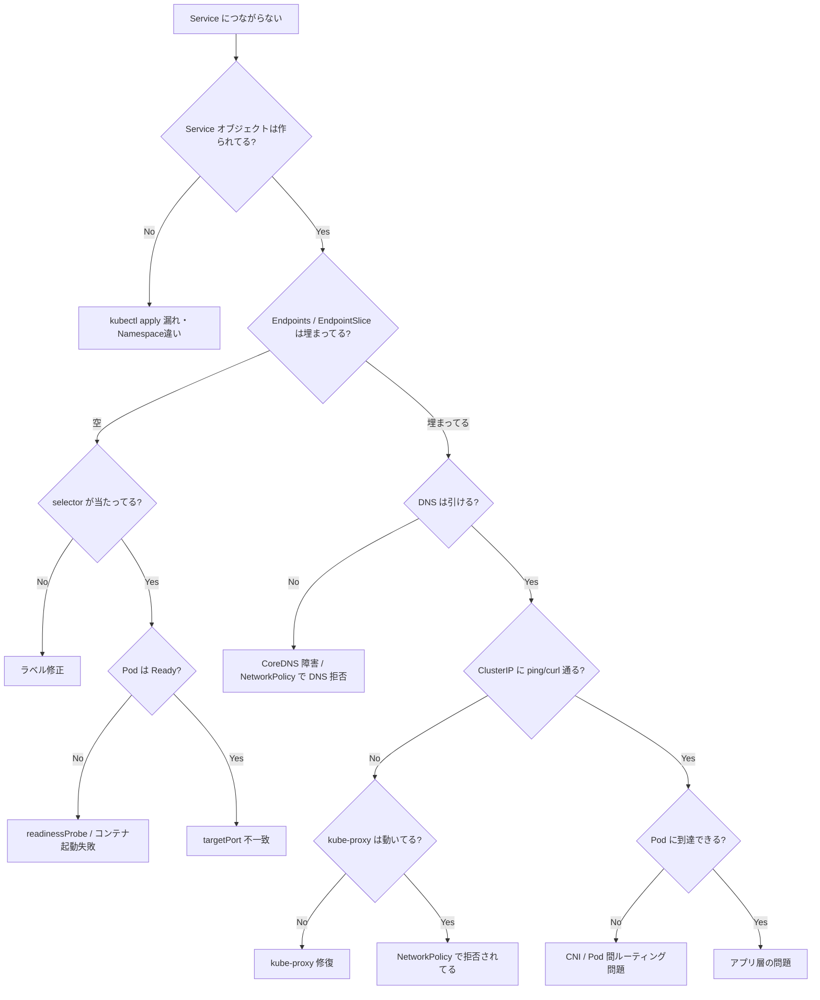
```mermaid
flowchart TD
    S[Service につながらない] --> Q1{Service オブジェクトは作られてる?}
    Q1 -->|No| F1[kubectl apply 漏れ・Namespace違い]
    Q1 -->|Yes| Q2{Endpoints / EndpointSlice は埋まってる?}
    Q2 -->|空| Q2a{selector が当たってる?}
    Q2a -->|No| F2[ラベル修正]
    Q2a -->|Yes| Q2b{Pod は Ready?}
    Q2b -->|No| F3[readinessProbe / コンテナ起動失敗]
    Q2b -->|Yes| F4[targetPort 不一致]
    Q2 -->|埋まってる| Q3{DNS は引ける?}
    Q3 -->|No| F5[CoreDNS 障害 / NetworkPolicy で DNS 拒否]
    Q3 -->|Yes| Q4{ClusterIP に ping/curl 通る?}
    Q4 -->|No| Q4a{kube-proxy は動いてる?}
    Q4a -->|No| F6[kube-proxy 修復]
    Q4a -->|Yes| F7[NetworkPolicy で拒否されてる]
    Q4 -->|Yes| Q5{Pod に到達できる?}
    Q5 -->|No| F8[CNI / Pod 間ルーティング問題]
    Q5 -->|Yes| F9[アプリ層の問題]
```

### 切り分けコマンド集

```bash
# Service 存在確認
kubectl get svc -A | grep todo-api
kubectl describe svc todo-api -n prod

# Endpoints 確認(空でないか)
kubectl get endpointslices -n prod -l kubernetes.io/service-name=todo-api -o yaml

# Pod のラベルと selector の整合
kubectl get pods -n prod --show-labels
kubectl get svc todo-api -n prod -o jsonpath='{.spec.selector}'

# Pod の Ready 状態
kubectl get pods -n prod -o wide

# kube-proxy 動作確認
kubectl get pods -n kube-system -l k8s-app=kube-proxy
kubectl logs -n kube-system -l k8s-app=kube-proxy --tail=100

# ノード上の iptables ルール
ssh k8s-w1 sudo iptables -t nat -L KUBE-SERVICES -n | grep todo-api

# IPVS モードの場合
ssh k8s-w1 sudo ipvsadm -Ln | grep -A3 10.96.143.27

# DNS の動作確認
kubectl run -n prod --rm -it dns-debug --image=busybox:1.36 --restart=Never -- \
  nslookup todo-api.prod.svc.cluster.local

# ClusterIP に直接 curl
kubectl run -n prod --rm -it net-debug --image=nicolaka/netshoot --restart=Never -- \
  curl -v http://10.96.143.27/health

# conntrack 状態
ssh k8s-w1 sudo conntrack -L | grep 10.96.143.27 | head
```

## エラーメッセージ → 対処の対応表

| エラー / 症状 | 原因の候補 | 対処 |
|---|---|---|
| `Endpoints: <none>` | selector がラベル不一致 / Pod が Ready でない | ラベル確認、`kubectl describe pod` |
| `connection refused` | Pod 側でリッスンしていないポートを `targetPort` に指定 | `kubectl exec` で `netstat -tlnp` |
| `i/o timeout` | NetworkPolicy で拒否 / CNI 障害 | NetworkPolicy 確認、CNI Pod のログ |
| `EXTERNAL-IP: <pending>` | LB プロバイダ未設定 | MetalLB 導入、クラウドコントローラ確認 |
| `nf_conntrack: table full` | conntrack あふれ | `nf_conntrack_max` 増やす |
| `Address already in use` (NodePort) | 同じ NodePort を 2 つの Service に指定 | NodePort 重複解消 |
| DNS 名は引けるが ClusterIP に届かない | kube-proxy が止まっている | `kubectl get pods -n kube-system -l k8s-app=kube-proxy` |
| Service の DNS 解決自体が遅い | `ndots:5` の影響(後章 DNS 参照) | FQDN(末尾`.`)を使う / `ndots: 2` に |

## 代替手法と Service の限界

### Service の限界

L4 ロードバランサとしての Service は、以下を **できません**。

- ホスト名やパスでのルーティング(L7)
- TLS 終端
- HTTP ヘッダ書き換え
- gRPC のフロー制御や HTTP/2 の細かい制御
- 重み付きカナリア(`type: Service` の機能としては)

### 代替・拡張手段

| やりたいこと | Service の代替 |
|------------|---------------|
| ホスト名/パスで振り分け | [Ingress]({{ '/04-networking/ingress/' | relative_url }}) / [Gateway API]({{ '/04-networking/gateway-api/' | relative_url }}) |
| TLS 終端 | Ingress / Gateway API |
| 重み付きカナリア | Gateway API HTTPRoute / Service Mesh(Istio、Linkerd) |
| L7 メトリクス・mTLS・サーキットブレーカ | Service Mesh |
| IP プール固定での外部公開 | LoadBalancer + MetalLB / Egress Gateway |
| クライアントサイド LB / 個別 Pod 接続 | Headless Service |
| 外部システムを内部名で参照 | ExternalName / selectorless Service |

### Service Mesh との関係

Istio や Linkerd のような Service Mesh は、各 Pod に **サイドカープロキシ(Envoy など)** を配置して、Service 間の通信を **L7 で再ルーティング** します。
Service Mesh を入れても **Service リソース自体はそのまま** ですが、kube-proxy の DNAT を経由する前にサイドカーが介入する形になります。

第8章の Service Mesh 章で詳しく扱います。

## 主要フィールド一覧

|フィールド|型|既定|説明|
|---|---|---|---|
|`spec.type`|string|`ClusterIP`|`ClusterIP` / `NodePort` / `LoadBalancer` / `ExternalName`|
|`spec.selector`|map|空|転送先 Pod のラベルセレクタ。空なら selectorless|
|`spec.ports[].name`|string|-|複数ポート時に必須|
|`spec.ports[].port`|int|必須|Service が公開するポート|
|`spec.ports[].targetPort`|int/string|`port` と同値|Pod 側のポート(数値 or 名前)|
|`spec.ports[].nodePort`|int|自動採番|NodePort/LB 時のノード公開ポート(30000-32767)|
|`spec.ports[].protocol`|string|`TCP`|`TCP` / `UDP` / `SCTP`|
|`spec.ports[].appProtocol`|string|-|`http` / `grpc` などアプリ層プロトコル名(Ingress 等が活用)|
|`spec.clusterIP`|string|自動|`None` で Headless|
|`spec.clusterIPs`|[]string|-|Dual-Stack 用 IP 配列|
|`spec.ipFamilies`|[]string|-|`IPv4` / `IPv6`|
|`spec.ipFamilyPolicy`|string|-|`SingleStack` / `PreferDualStack` / `RequireDualStack`|
|`spec.externalName`|string|-|`type: ExternalName` 専用|
|`spec.externalIPs`|[]string|-|外部から直接ルーティングされる IP(クラスタ管理者が用意)|
|`spec.loadBalancerSourceRanges`|[]string|-|LB のソース IP 制限|
|`spec.loadBalancerClass`|string|-|複数 LB 実装を共存させるとき|
|`spec.allocateLoadBalancerNodePorts`|bool|`true`|LB 時に NodePort も同時確保するか|
|`spec.sessionAffinity`|string|`None`|`None` / `ClientIP`|
|`spec.sessionAffinityConfig.clientIP.timeoutSeconds`|int|10800|セッション固定 TTL|
|`spec.externalTrafficPolicy`|string|`Cluster`|外部からのトラフィックを `Cluster` か `Local` か|
|`spec.internalTrafficPolicy`|string|`Cluster`|内部からのトラフィックを `Cluster` か `Local` か|
|`spec.healthCheckNodePort`|int|自動|`Local` ポリシー時の LB ヘルスチェック用ポート|
|`spec.publishNotReadyAddresses`|bool|`false`|Ready 前 Pod も DNS に公開するか|
|`spec.trafficDistribution`|string|-|`v1.30+` βeta:`PreferClose` などトポロジ志向の分配|

## Pod 終了時の Service からの外し方(graceful shutdown との関係)

Pod が削除される時、以下の順で進みます。

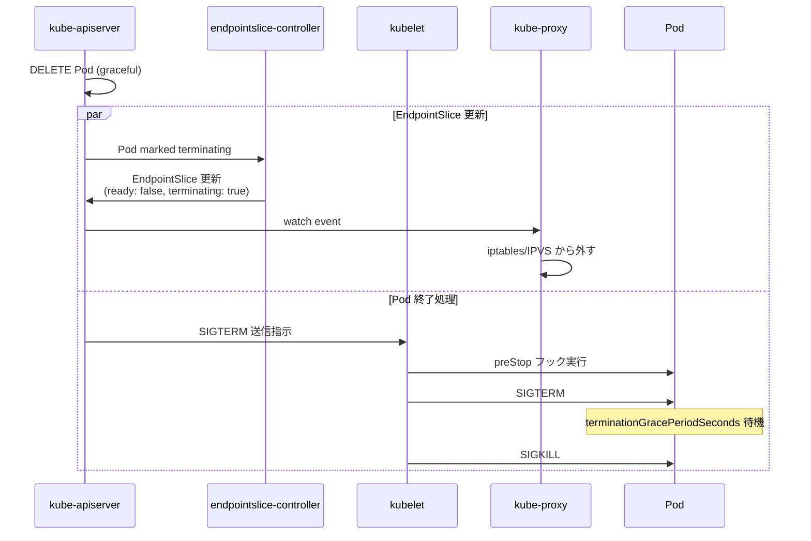
```mermaid
sequenceDiagram
    participant API as kube-apiserver
    participant ESC as endpointslice-controller
    participant Kubelet as kubelet
    participant KP as kube-proxy
    participant Pod as Pod

    API->>API: DELETE Pod (graceful)
    par EndpointSlice 更新
        API->>ESC: Pod marked terminating
        ESC->>API: EndpointSlice 更新<br>(ready: false, terminating: true)
        API->>KP: watch event
        KP->>KP: iptables/IPVS から外す
    and Pod 終了処理
        API->>Kubelet: SIGTERM 送信指示
        Kubelet->>Pod: preStop フック実行
        Kubelet->>Pod: SIGTERM
        Note over Pod: terminationGracePeriodSeconds 待機
        Kubelet->>Pod: SIGKILL
    end
```

ここで重要なのは、**EndpointSlice からの除去と SIGTERM がほぼ同時に走る** ことです。
これだと、kube-proxy のルール更新が間に合わず、Pod が SIGTERM 受信後もしばらくトラフィックを受け続けることがあります。

対策として、Pod に `preStop` フックで sleep を入れます。

```yaml
spec:
  containers:
  - name: api
    image: todo-api:0.1.0
    lifecycle:
      preStop:
        exec:
          command: ["sleep", "10"]
  terminationGracePeriodSeconds: 30
```

これで「kube-proxy のルール更新が伝搬する 10 秒の間は SIGTERM を受け取らずに既存接続を捌き続ける」ようにできます。

## 検証用スクリプト集

### Service の selector が当たっているか確認

```bash
#!/bin/bash
# usage: ./check-svc.sh <namespace> <service>
NS=$1
SVC=$2

echo "== Service =="
kubectl get svc $SVC -n $NS -o yaml | grep -A5 selector

echo "== Matching Pods =="
SELECTOR=$(kubectl get svc $SVC -n $NS -o jsonpath='{range .spec.selector}{.}{end}' \
  | tr -d '{}"' | tr ':' '=' | tr ',' ',')
kubectl get pods -n $NS -l "$SELECTOR" -o wide

echo "== EndpointSlice =="
kubectl get endpointslices -n $NS -l kubernetes.io/service-name=$SVC -o yaml
```

### Pod から Service への接続テスト

```bash
kubectl run -n prod --rm -it tester \
  --image=nicolaka/netshoot --restart=Never -- bash -c '
    for svc in todo-api todo-frontend postgres redis; do
      echo "=== $svc ==="
      nslookup $svc | grep -E "^Name|^Address" | head -5
      timeout 3 nc -zv $svc 80 2>&1 || echo "(no tcp 80)"
    done'
```

## チェックポイント

ここまでで以下を **自分の言葉で** 説明できるか確認してください。

- [ ] Pod IP に直接アクセスせず Service 経由でアクセスする理由を、3 つ以上挙げられる
- [ ] ClusterIP / NodePort / LoadBalancer / ExternalName / Headless それぞれを「いつ使うか」を 1 行で言える
- [ ] `port` / `targetPort` / `nodePort` の違いを図で描ける
- [ ] EndpointSlice が Endpoints の何の問題を解決したか説明できる
- [ ] kube-proxy の iptables モードと IPVS モードの違いを 2 つ以上挙げられる
- [ ] `externalTrafficPolicy: Local` のメリット・デメリットを言える
- [ ] `sessionAffinity: ClientIP` の落とし穴を説明できる
- [ ] Endpoints が空のときに最初に確認するポイントを 3 つ挙げられる
- [ ] `EXTERNAL-IP: <pending>` の原因として考えられるものを 2 つ以上挙げられる
- [ ] Pod の graceful shutdown 中に Service から外れるタイミングを説明できる

→ 次は [DNSとサービスディスカバリ]({{ '/04-networking/dns/' | relative_url }})
