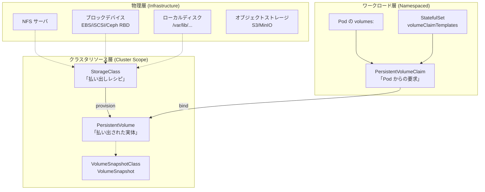
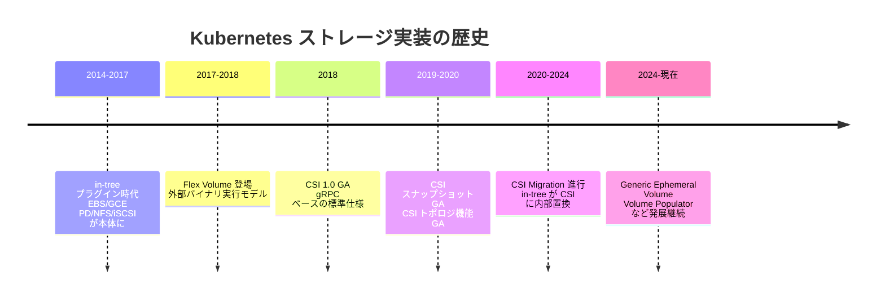
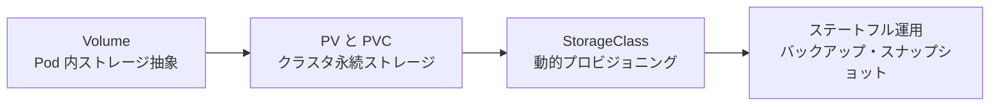
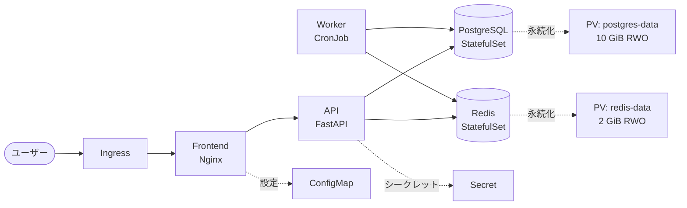

# 05. ストレージ
{: .no_toc }

## 目次
{: .no_toc .text-delta }

1. TOC
{:toc}

---

## この章で扱うこと

Kubernetes における「データの永続化」は、コンテナ時代の最も大きな設計テーマの 1 つです。
Pod は揮発する(死んだら戻ってこない)ことを前提に作られているため、Pod のローカルファイルシステムにデータを置くと、再スケジュールやクラッシュのたびに消えてしまいます。
そこで Kubernetes は、ストレージという「Pod よりも長生きするオブジェクト」を別に管理する仕組みを用意しました。
それが本章で扱う **Volume / PersistentVolume / PersistentVolumeClaim / StorageClass / VolumeSnapshot** といった一連のリソース群です。

本章を通じて、以下の流れを段階的に学びます。

1. **Volume** ─ Pod の中で複数コンテナがデータを共有したり、設定ファイルを差し込んだりする「Pod スコープのストレージ抽象」
2. **PersistentVolume / PersistentVolumeClaim** ─ Pod のライフサイクルから独立した「クラスタスコープの永続ストレージ抽象」
3. **StorageClass** ─ PVC を出すだけで自動的に PV が払い出される「動的プロビジョニングの中核」
4. **ステートフル運用** ─ PostgreSQL や Redis のようなデータベースを Kubernetes 上で安全に動かすための運用ノウハウ

## このページのゴール

このページを読み終えると、以下を **自分の言葉で説明できる** ようになります。

- なぜ Kubernetes はストレージをこれだけ多層的に抽象化しているのか、その歴史的背景
- Volume / PV / PVC / StorageClass の役割分担と、どのレイヤがどの関心事を担うか
- ローカル環境(Minikube・kubeadm)で取り得るストレージの選択肢と、それぞれの得手不得手
- 本章のサンプルアプリ「ミニ TODO サービス」で永続化が必要なコンポーネントと、その理由
- ストレージ周りで初心者がハマりやすい代表的な落とし穴 5 つ

---

## ストレージの全体像

Kubernetes のストレージ抽象は、下の図のように **「物理 → クラスタリソース → ワークロード」の 3 層構造** で理解すると見通しが良くなります。



この図のポイントを 1 つずつ確認します。

- **物理層** は文字通り「データが書かれる場所」です。ハードディスクであれ NFS であれ S3 であれ、Kubernetes はその実体には踏み込みません。
- **クラスタリソース層** は管理者(プラットフォームチーム)が責任を持つ範囲です。「どのストレージを、どんなパラメータで、どう払い出すか」というレシピ(StorageClass)と、払い出された実体(PV)が住みます。
- **ワークロード層** はアプリ開発者が触る範囲です。「私はこれだけの容量とアクセスモードが欲しい」と PVC を出すだけで、上の層が自動的に PV を割り当ててくれます。

この **「責任分界点が抽象によって引かれている」** ことが、Kubernetes のストレージ設計の最大の特徴です。
クラウドネイティブ以前、つまり VM 時代までは、開発者が「このサーバにこのディスクをマウントしてください」と運用チームに依頼するチケットを切り、運用チームが手作業で LUN を切り、ファイルシステムを作り、`/etc/fstab` に書き、再起動する……という手続きが当たり前でした。
Kubernetes のストレージ抽象は、この手続きを **宣言的・自動的・セルフサービス** に変えるための仕組みです。

---

## なぜ Kubernetes のストレージはこんなに層が多いのか

「Volume と PV と PVC と StorageClass って、なんで 4 つもあるの? 1 つでよくない?」
これは初学者が必ず抱く疑問です。
結論から言うと、それぞれ **異なる関心事を分離** するために存在します。

| 抽象 | 関心事 | 寿命 | スコープ | 主な利用者 |
|------|--------|------|----------|------------|
| Volume | Pod の中で何をマウントするか | Pod と同じ | Pod 内 | アプリ開発者 |
| PVC | Pod が「どんなストレージが欲しいか」を申告する | Namespace と同じ(Namespace を消すまで残る) | Namespace | アプリ開発者 |
| PV | クラスタにある「ストレージの実体への参照」 | Namespace を超えて存続 | Cluster | プラットフォーム管理者 |
| StorageClass | PV を作るときの「テンプレート / レシピ」 | クラスタ寿命と同じ | Cluster | プラットフォーム管理者 |

この分離があるおかげで、たとえば次のような運用が可能になります。

- 開発チームは「PostgreSQL に 10 GiB の RWO ストレージが欲しい」とだけ書けば良く、「裏が NFS なのか EBS なのか Ceph なのか」を気にする必要がない
- 管理者はバックエンドのストレージをある日 NFS から CSI ベースの分散ストレージに移行できる(StorageClass の定義を変えるだけ)
- セキュリティ要件で「特定の Namespace は SSD のみ」「特定のテナントは別ストレージ」といったポリシーを StorageClass 単位で適用できる

{: .important }
> 抽象は 1 つに統一すれば確かにシンプルですが、その代わりに **特定のバックエンドへの強い結合** を生みます。
> Kubernetes はあえて層を増やすことで、バックエンドの差し替え可能性(Pluggability)を確保しています。
> この設計思想は、CRI(Container Runtime Interface)、CNI(Container Network Interface)、CSI(Container Storage Interface)に共通する Kubernetes の哲学です。

---

## ストレージ史: なぜこの設計になったのか

「歴史を知ると設計が腑に落ちる」というのは Kubernetes 学習の鉄則です。
ストレージ周りも例外ではありません。

### Phase 1: in-tree volume プラグイン時代 (2014〜2018)

初期の Kubernetes(v1.0〜v1.13 頃)は、AWS EBS、GCE PD、Azure Disk、NFS、iSCSI、Ceph RBD などを **すべて Kubernetes 本体のソースコードの中に取り込んで** サポートしていました。
これを「in-tree volume プラグイン」と呼びます。

問題は明らかでした。

1. **Kubernetes をリリースするたびに全ストレージプロバイダの動作確認が必要**
2. **ベンダーが新機能を出してもコア側の取り込みを待たなければ使えない**
3. **kubelet にストレージベンダーのコードが直接動作するためセキュリティリスクが大きい**
4. **コード行数が肥大化し、Kubernetes 本体のメンテが困難に**

### Phase 2: Flex Volume 時代 (2017〜)

そこで登場したのが **Flex Volume** です。
これは「ストレージプラグインを実行可能バイナリとして外出しし、kubelet が exec する」という方式でした。
ベンダーは Kubernetes のリリースに依存せずプラグインを配布できるようになりましたが、

- バイナリを各ノードに配布する仕組みが別途必要
- インターフェースが Pod の概念とずれていた
- 動的プロビジョニングの体験が良くなかった

など、決定打にはなりませんでした。

### Phase 3: CSI 時代 (2018〜現在)

そして 2018 年、**Container Storage Interface (CSI)** が GA しました。
CSI は **gRPC ベースの仕様**で、Kubernetes だけでなく Mesos、Cloud Foundry、Nomad など複数のオーケストレータが共通で使えるストレージプラグインインターフェースです。

- 仕様: <https://github.com/container-storage-interface/spec>
- KEP: <https://github.com/kubernetes/enhancements/tree/master/keps/sig-storage/596-csi-inline-volumes>

CSI ドライバは **Pod として** クラスタ内にデプロイされ、kubelet と sidecar 経由で連携します。
これにより、

- ストレージベンダーは Kubernetes と独立してリリース可能
- セキュリティ境界が明確(プラグインは Pod 内、kubelet と分離)
- スナップショット、リサイズ、トポロジ認識など高度な機能を仕様レベルで標準化

が実現しました。

### Phase 4: in-tree → CSI 完全移行 (2020〜)

その後、Kubernetes プロジェクトは **CSI Migration** と呼ばれるプロジェクトを進めました。
これは「過去に in-tree で実装されていたボリュームプラグインを、内部的には CSI ドライバに振り替える」というものです。
利用者から見れば YAML は変わらず動き続けますが、内部実装が CSI に置き換わっています。
v1.30 時点で AWS EBS、GCE PD、Azure Disk、Cinder、vSphere などほとんどの主要 in-tree ドライバが CSI 化されています。



{: .note }
> なぜ歴史を学ぶか? それは **古い文献やブログ記事に出てくる「FlexVolume」「in-tree」「CSI」という用語の文脈を正しく読み取れる** ようになるからです。
> 2017 年頃の記事と 2024 年の記事では、同じ「永続ボリューム」を語っていてもアーキテクチャがまったく違います。
> 古い情報を新しい環境にそのまま適用するとハマります。

---

## 本章の進み方

本章は次の 4 ページで構成されます。



1. [Volume]({{ '/05-storage/volume/' | relative_url }}) ─ `emptyDir`、`hostPath`、`configMap`、`secret`、`projected`、`persistentVolumeClaim` などの「Pod スコープの Volume」を網羅的に解説します。Volume は PV 以前から存在する概念で、ConfigMap や Secret のマウントもこの仕組みに乗っています。
2. [PersistentVolume と PVC]({{ '/05-storage/pv-pvc/' | relative_url }}) ─ クラスタ全体で管理される永続ストレージの基本を扱います。静的プロビジョニングと動的プロビジョニングの違い、アクセスモード、reclaimPolicy、ライフサイクル、よくあるトラブル事例を全部入れます。
3. [StorageClass]({{ '/05-storage/storageclass/' | relative_url }}) ─ 動的プロビジョニングの中核となる StorageClass を、`volumeBindingMode`、`allowVolumeExpansion`、`provisioner`、`parameters` といったフィールドの隅々まで解説します。本教材で使う `local-path` と `nfs` の 2 系統のセットアップも詳しく扱います。
4. [ステートフル運用の実例]({{ '/05-storage/stateful-storage/' | relative_url }}) ─ サンプル TODO サービスの PostgreSQL と Redis を題材に、StatefulSet + PVC、Velero によるバックアップ、VolumeSnapshot、PVC リサイズ、`fsGroup`、災害復旧シナリオまで、実運用で必要になる知識を一通りカバーします。

---

## サンプルアプリのどこに永続化が必要か

本教材では「ミニ TODO サービス」というサンプルアプリを章を追って育てていきます。
このアプリのうち、どのコンポーネントに永続化が必要かを最初に整理しておきましょう。



| コンポーネント | 永続化要否 | ストレージ種別 | 理由 |
|----------------|-----------|----------------|------|
| Frontend (Nginx) | 不要 | emptyDir も不要 | 静的ファイルはイメージに焼き込み |
| API (FastAPI) | 不要 | (configMap で設定のみ) | ステートレス。スケールアウトする |
| PostgreSQL | **必要 (RWO 永続)** | PVC + StorageClass | ユーザーデータ・テーブルが消えたら困る |
| Redis | **必要 (RWO 永続)** | PVC + StorageClass | キューと一部キャッシュ。AOF/RDB を残す |
| Worker (CronJob) | 不要 | emptyDir(あれば) | バッチ実行のたびに新規 Pod |

このように、**「永続化が必要なものを最小限に絞る」** というのがクラウドネイティブの基本です。
むやみに PVC を増やすと、バックアップ・移行・障害復旧のコストが線形に増えていきます。

---

## ローカル環境でのストレージ選択肢

本教材は EKS/GKE/AKS を使わず、すべてローカルで完結させます。
そのため使えるストレージドライバは限られます。

```mermaid
flowchart TB
    subgraph M["第1〜6章: Minikube"]
        m_lp[local-path<br>標準で入る/単一ノード]
        m_hp[hostPath<br>非推奨だが使える]
    end

    subgraph K["第7章以降: VMware kubeadm HA"]
        k_lp[local-path<br>各ワーカーで独立]
        k_nfs[NFS-CSI<br>k8s-nfs から共有]
        k_long[Longhorn<br>(発展課題)]
    end
```

| StorageClass 名 | プロビジョナ | アクセスモード | 用途 | 環境 |
|-----------------|--------------|----------------|------|------|
| `standard` | k8s.io/minikube-hostpath | RWO | Minikube 既定 | Minikube のみ |
| `local-path` | rancher.io/local-path | RWO | 単一ノードでも動く軽量プロビジョナ | Minikube / kubeadm 両方 |
| `nfs` | nfs.csi.k8s.io | RWO / **RWX** | 複数ノードで共有が必要なケース | kubeadm のみ(`k8s-nfs` ノード使用) |
| `longhorn` | driver.longhorn.io | RWO / RWX | 分散ブロックストレージ。スナップショット・レプリカ機能あり | kubeadm のみ(発展) |

第7章以降の kubeadm 環境では、デフォルト StorageClass を `nfs` に設定する想定で進めます。

---

## 本章を通じて使うコマンドの早見表

ストレージ周りでよく使うコマンドを最初に一覧しておきます。
詳細は各ページで個別に解説しますが、「あれ、なんだっけ」というときの参照用にどうぞ。

```bash
# StorageClass 一覧
kubectl get storageclass            # 短縮形: kubectl get sc

# PV 一覧 (クラスタスコープ)
kubectl get persistentvolume        # 短縮形: kubectl get pv

# PVC 一覧 (Namespace スコープ)
kubectl get persistentvolumeclaim   # 短縮形: kubectl get pvc

# 詳細表示
kubectl describe pvc postgres-data
kubectl describe pv pvc-abc123-...

# Pod とボリュームの関係を見る
kubectl get pod postgres-0 -o jsonpath='{.spec.volumes}' | jq

# PVC の容量を増やす
kubectl edit pvc postgres-data
# spec.resources.requests.storage を編集

# VolumeSnapshot を作る
kubectl apply -f snapshot.yaml
kubectl get volumesnapshot

# CSI ドライバの状態
kubectl get csidriver
kubectl get csinode
```

---

## 学習の前提

本章を読む前に、以下が完了していると理解がスムーズです。

- 第 2 章 ─ Pod、Deployment、StatefulSet の基本
- 第 3 章 ─ Service と Namespace
- 第 4 章 ─ ConfigMap と Secret(本章では「Volume として ConfigMap をマウントする」場面が出てきます)

逆に、これから出てくる **CSI ドライバ、Velero、Snapshot、CronJob** などは本章で初登場のものも含まれます。
都度説明するので心配せずに読み進めてください。

---

## チェックポイント

ここまでで以下を **自分の言葉で** 説明できるか確認してください。

- [ ] Kubernetes でストレージが Volume / PV / PVC / StorageClass と分かれている理由を、責任分界点の観点で説明できる
- [ ] in-tree → FlexVolume → CSI と進化した歴史的経緯と、それぞれがなぜ必要だったかを説明できる
- [ ] サンプル TODO サービスのうち、永続化が必要なコンポーネントとその理由を述べられる
- [ ] Minikube と kubeadm 環境で使えるストレージドライバの違いを 1 つ以上挙げられる
- [ ] CSI Migration が何をする仕組みかを 1 行で説明できる
- [ ] PV と PVC、どちらが Namespace スコープでどちらがクラスタスコープか即答できる

→ 次は [Volume]({{ '/05-storage/volume/' | relative_url }})
