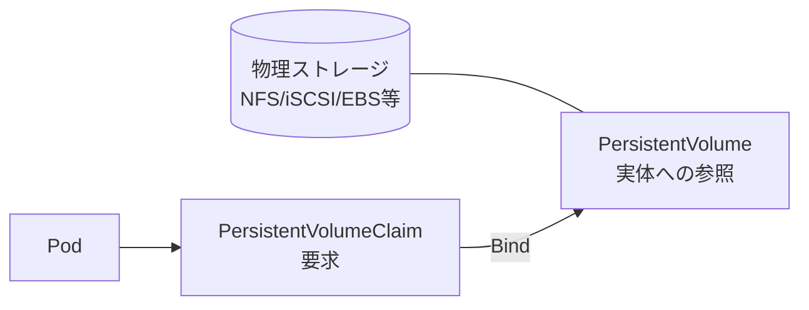
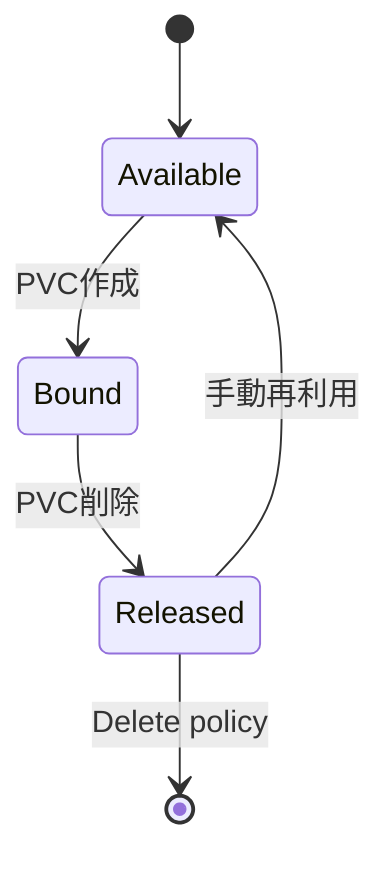

# PersistentVolume と PVC
{: .no_toc }

## 目次
{: .no_toc .text-delta }

1. TOC
{:toc}

---

Kubernetes は永続ストレージを **PersistentVolume (PV)** と **PersistentVolumeClaim (PVC)** という2つの抽象で扱います。

## モデル



- **PV** : クラスタ管理者が用意する「ストレージの実体」
- **PVC** : Pod が「これだけのストレージを欲しい」と要求するもの

PV と PVC は **容量・アクセスモード・StorageClass** で照合され、自動的にバインドされます。

## 静的プロビジョニング

管理者が PV を手動作成して、ユーザーが PVC で取りに行くパターン。

```yaml
apiVersion: v1
kind: PersistentVolume
metadata:
  name: pv-postgres-1
spec:
  capacity:
    storage: 10Gi
  accessModes: [ReadWriteOnce]
  persistentVolumeReclaimPolicy: Retain
  nfs:
    server: 192.168.56.30
    path: /export/postgres
---
apiVersion: v1
kind: PersistentVolumeClaim
metadata:
  name: postgres-data
spec:
  accessModes: [ReadWriteOnce]
  resources:
    requests:
      storage: 10Gi
```

## 動的プロビジョニング

PVC が来たときに **StorageClass を介して PV を自動作成** する仕組み。実運用ではこちらが主流。

```yaml
apiVersion: v1
kind: PersistentVolumeClaim
metadata:
  name: postgres-data
spec:
  accessModes: [ReadWriteOnce]
  storageClassName: nfs
  resources:
    requests:
      storage: 10Gi
```

StorageClass の詳細は次節 [StorageClass]({{ '/05-storage/storageclass/' | relative_url }}) で。

## アクセスモード

| モード | 略称 | 内容 |
|--------|------|------|
| ReadWriteOnce | RWO | 1ノードからRW |
| ReadOnlyMany | ROX | 多ノードからRO |
| ReadWriteMany | RWX | 多ノードからRW (NFS等) |
| ReadWriteOncePod | RWOP | 1Podのみ |

ストレージの種類により対応モードが違います。
ローカルディスクは RWO のみ、NFS は RWX 可、iSCSI は RWO のみなど。

## reclaimPolicy

| ポリシー | 動作 |
|----------|------|
| Delete | PVC削除時にPVと実データも削除 (動的プロビジョニング既定) |
| Retain | PVC削除後も保持 (手動回収が必要) |

本番DB用はまず **Retain** に設定するのが安全。

## バインドのライフサイクル



`Released` 状態の PV は再利用には手作業が必要(`spec.claimRef` をクリア)。

## ハンズオン: サンプルアプリのPostgres

ローカル環境では NFS-CSI を使うか、Minikubeなら local-path-provisioner を使います。

```bash
# Minikube
kubectl get sc          # standardが既定
```

```yaml
apiVersion: apps/v1
kind: StatefulSet
metadata:
  name: postgres
spec:
  serviceName: postgres
  replicas: 1
  selector:
    matchLabels:
      app.kubernetes.io/name: postgres
  template:
    metadata:
      labels:
        app.kubernetes.io/name: postgres
    spec:
      containers:
      - name: postgres
        image: postgres:16
        env:
        - name: POSTGRES_PASSWORD
          valueFrom:
            secretKeyRef:
              name: postgres-secret
              key: password
        - name: PGDATA
          value: /var/lib/postgresql/data/pgdata
        volumeMounts:
        - name: data
          mountPath: /var/lib/postgresql/data
  volumeClaimTemplates:
  - metadata:
      name: data
    spec:
      accessModes: [ReadWriteOnce]
      storageClassName: standard
      resources:
        requests:
          storage: 5Gi
```

```bash
kubectl apply -f postgres-sts.yaml
kubectl get pvc                # 自動でPVCが作られる
kubectl get pv                 # 動的プロビジョニングでPVが作られる
```

データが永続することを確認:

```bash
kubectl exec -it postgres-0 -- psql -U todo -c "CREATE TABLE t(x int); INSERT INTO t VALUES (1);"
kubectl delete pod postgres-0    # Pod削除
kubectl exec -it postgres-0 -- psql -U todo -c "SELECT * FROM t;"
# データが残っている
```

## チェックポイント

- [ ] PV と PVC が分離されている理由を説明できる
- [ ] 動的プロビジョニングと静的プロビジョニングの違い
- [ ] reclaimPolicy: Retain を選ぶシーン
