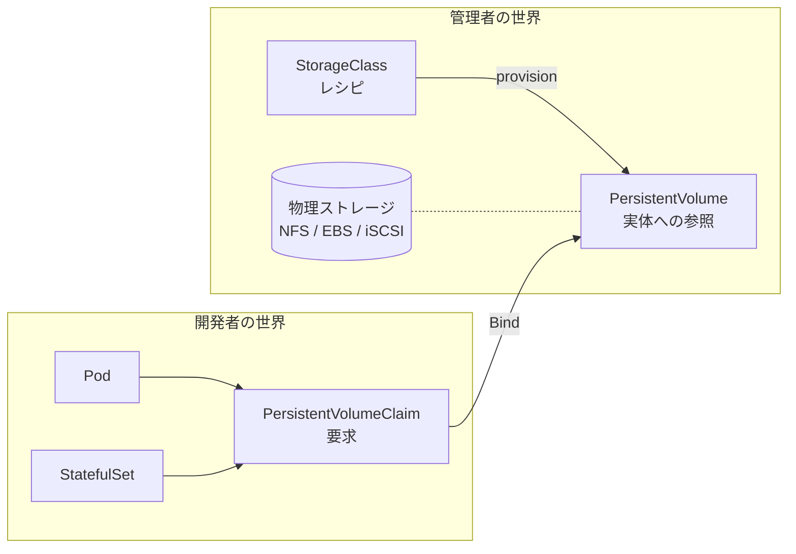
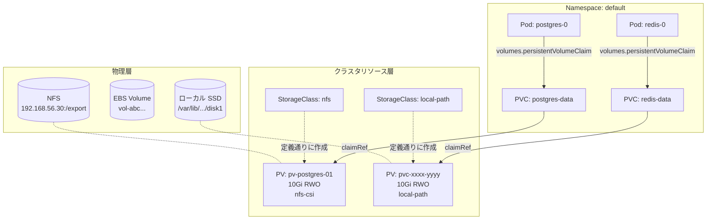
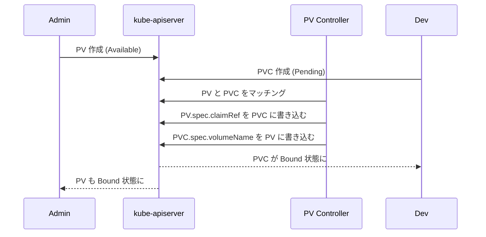
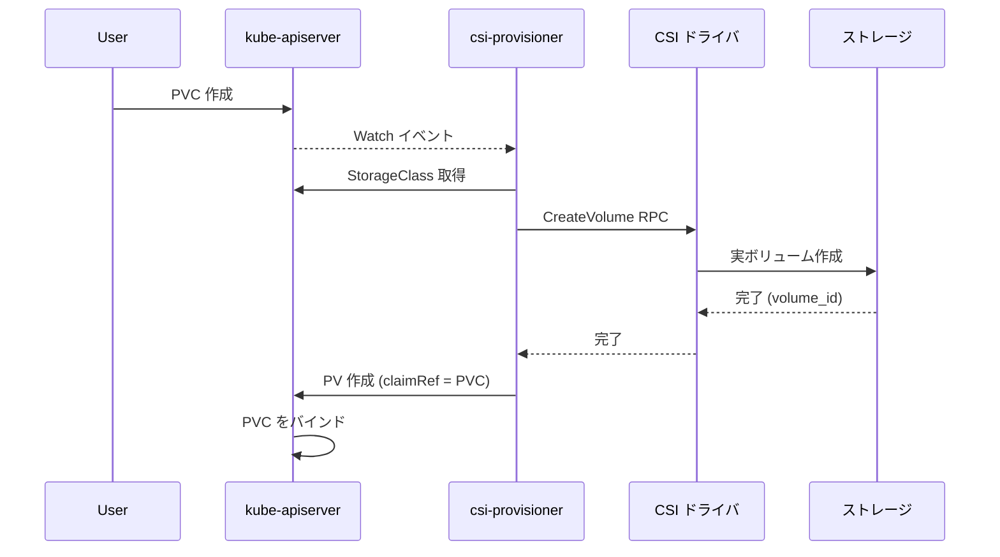
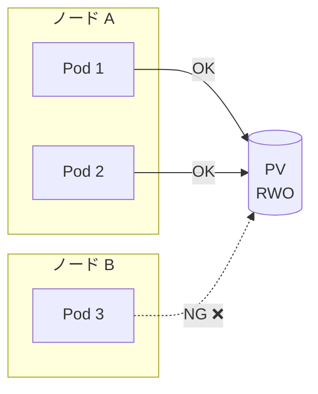
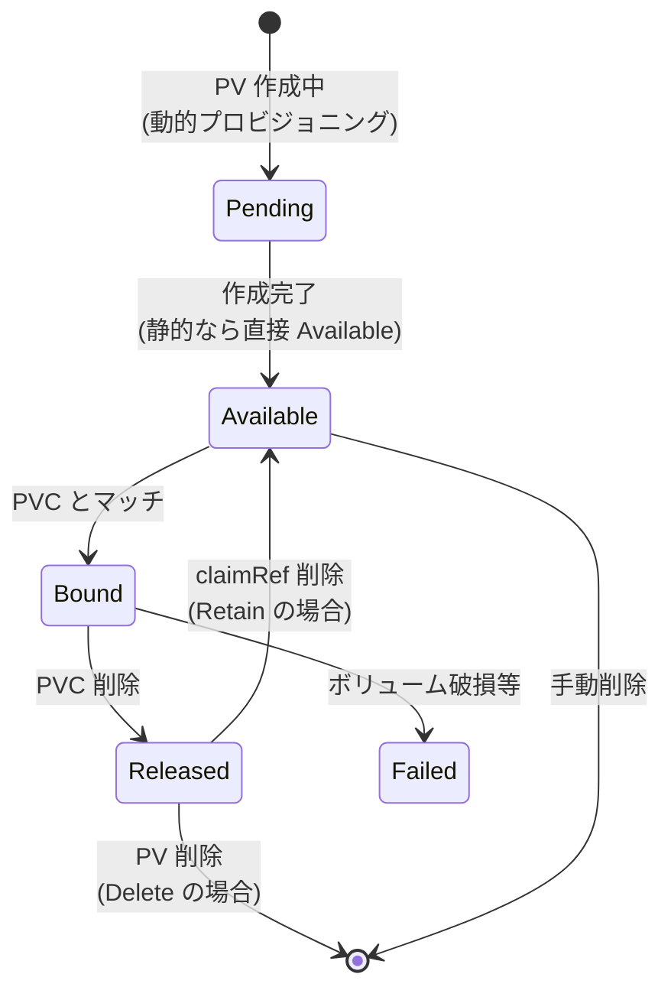
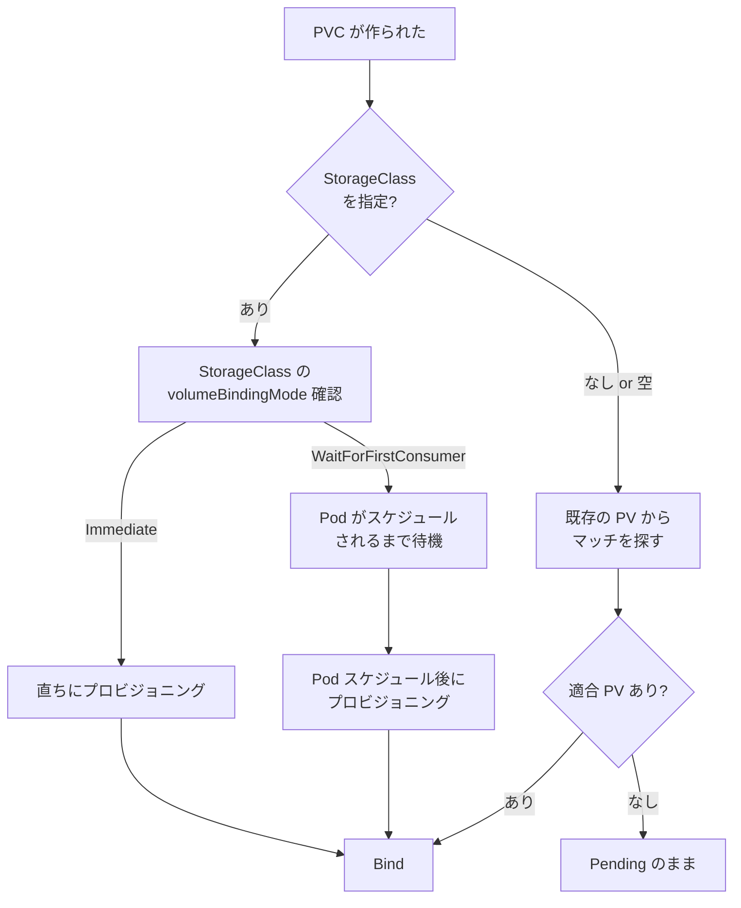
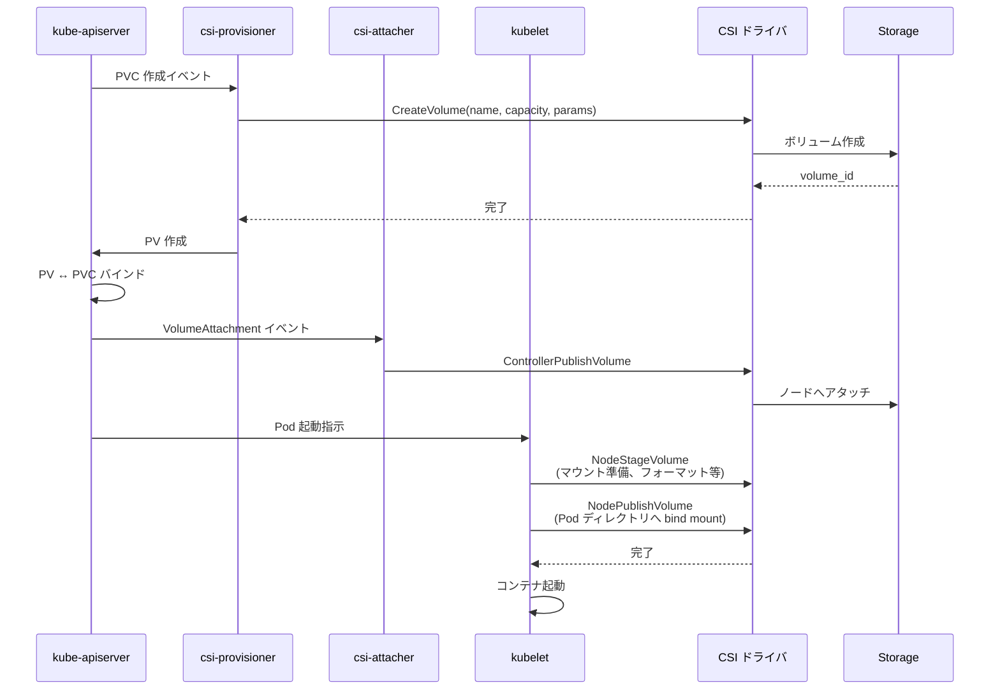
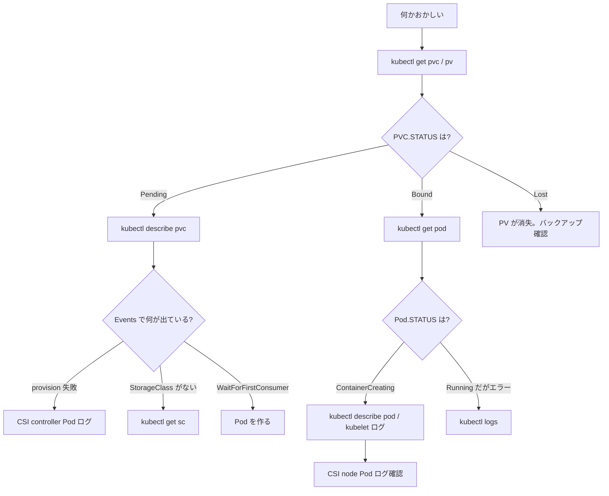

# PersistentVolume と PVC
{: .no_toc }

## 目次
{: .no_toc .text-delta }

1. TOC
{:toc}

---

## このページのゴール

このページを読み終えると、以下を **自分の言葉で説明できる** ようになります。

- PV と PVC が分離されている技術的・運用的な理由
- 静的プロビジョニングと動的プロビジョニングそれぞれの利点・欠点・適用場面
- アクセスモード(RWO / ROX / RWX / RWOP)が物理的に何を意味し、どのストレージで何が使えるか
- `reclaimPolicy: Retain` と `Delete` を選び分ける判断基準
- PV のライフサイクル(Available → Bound → Released → Available または Deleted)
- ボリュームモード `Filesystem` と `Block` の違い、Block を使うシーン
- PVC が Pending のまま進まないときの調査手順
- `WaitForFirstConsumer` モードの存在意義

---

## 復習: なぜ PV / PVC が必要なのか

第 1 節で扱った Volume だけでは解決しない問題があります。

- **Pod を別ノードに再配置したときデータが失われる**
- **複数の Pod / Deployment / StatefulSet で同じデータを共有したい**
- **データだけ残して Pod を作り直したい(アプリのアップデート時など)**
- **ストレージの実装(NFS / EBS / Ceph)とアプリの YAML を分離したい**

これらを解決するために、Kubernetes は **「Pod のライフサイクルを超えて存続するストレージ抽象」** を導入しました。
それが **PersistentVolume (PV)** と **PersistentVolumeClaim (PVC)** です。

---

## 設計思想: Two-Object Model の発明

Kubernetes が PV と PVC を「2 つのオブジェクト」に分けているのは、**異なる責任を持つ人を分離する** という発想からきています。
これは Borg / Omega / Tectonic などの先行プロジェクトでの経験から導かれた設計判断で、KEP やデザインドキュメントにも明記されています。


```mermaid
flowchart LR
    subgraph Admin["管理者の世界"]
        sc[StorageClass<br>レシピ]
        pv[PersistentVolume<br>実体への参照]
        infra[(物理ストレージ<br>NFS / EBS / iSCSI)]
        sc -->|provision| pv
        infra -.- pv
    end
    subgraph Dev["開発者の世界"]
        pvc[PersistentVolumeClaim<br>要求]
        pod[Pod]
        sts[StatefulSet]
        pod --> pvc
        sts --> pvc
    end
    pvc -->|Bind| pv
```

- **管理者(SRE / Platform Engineer)** は StorageClass と、必要なら静的 PV を作る
- **開発者** は PVC を Namespace に作るだけ

そして PVC は **「ストレージを欲しいというリクエスト」** であり、PV は **「リクエストに応えるための実体」** です。
PVC は要求条件(容量・アクセスモード・StorageClass)を書きます。
コントローラがそれにマッチする PV を見つけて(あるいは作って)バインドします。

この **「リクエストとリソースを別オブジェクトにする」** パターンは、Kubernetes 全体で繰り返し出てきます。例:

| リクエスト側 | リソース側 |
|--------------|-----------|
| PVC | PV |
| Service (type=LoadBalancer) | クラウドの LB / MetalLB の VIP |
| Ingress | LB のリスナ・ルーティング |
| HorizontalPodAutoscaler | Deployment のレプリカ数 |

PV/PVC モデルは、この後の Kubernetes リソース設計の雛形になりました。

---

## モデル図(深掘り版)


```mermaid
flowchart TB
    subgraph Phys["物理層"]
        nfs[(NFS<br>192.168.56.30:/export)]
        ebs[(EBS Volume<br>vol-abc...)]
        local[(ローカル SSD<br>/var/lib/.../disk1)]
    end

    subgraph Cluster["クラスタリソース層"]
        pv1[PV: pv-postgres-01<br>10Gi RWO<br>nfs-csi]
        pv2[PV: pvc-xxxx-yyyy<br>10Gi RWO<br>local-path]
        sc1[StorageClass: nfs]
        sc2[StorageClass: local-path]
    end

    subgraph NS["Namespace: default"]
        pvc1[PVC: postgres-data]
        pvc2[PVC: redis-data]
        pod1[Pod: postgres-0]
        pod2[Pod: redis-0]
    end

    nfs -.- pv1
    local -.- pv2
    sc1 -.->|定義通りに作成| pv1
    sc2 -.->|定義通りに作成| pv2
    pvc1 -->|claimRef| pv1
    pvc2 -->|claimRef| pv2
    pod1 -->|volumes.persistentVolumeClaim| pvc1
    pod2 -->|volumes.persistentVolumeClaim| pvc2
```

ポイント:

- **PV はクラスタスコープ**(Namespace に属さない)
- **PVC は Namespace スコープ**(`default` ns の PVC は `default` の Pod からしか参照できない)
- **PV は 1 つの PVC とだけバインドできる**(1 対 1 対応)
- バインドした PV の名前は `kubectl get pvc` の `VOLUME` 列に表示される

---

## 静的プロビジョニング

「管理者があらかじめ PV を作っておき、ユーザーが PVC で取りに行く」モデルです。

### 例: NFS の PV を静的に切る

```yaml
# 管理者が用意する PV
apiVersion: v1
kind: PersistentVolume
metadata:
  name: pv-postgres-01
  labels:
    purpose: database
    tier: prod
spec:
  capacity:
    storage: 10Gi
  accessModes: [ReadWriteOnce]
  persistentVolumeReclaimPolicy: Retain
  storageClassName: ""           # 空文字 = 動的プロビジョニングを介在させない
  mountOptions:
  - nfsvers=4.1
  - hard
  - timeo=600
  nfs:
    server: 192.168.56.30
    path: /export/postgres-01
```

```yaml
# 開発者が出す PVC
apiVersion: v1
kind: PersistentVolumeClaim
metadata:
  name: postgres-data
  namespace: default
spec:
  accessModes: [ReadWriteOnce]
  storageClassName: ""           # PV と一致させる(空文字)
  resources:
    requests:
      storage: 10Gi
  selector:                      # ラベルで PV を絞り込み(任意)
    matchLabels:
      purpose: database
      tier: prod
```

### 静的プロビジョニングの動作


```mermaid
sequenceDiagram
    participant Admin
    participant API as kube-apiserver
    participant Ctrl as PV Controller
    participant Dev

    Admin->>API: PV 作成 (Available)
    Dev->>API: PVC 作成 (Pending)
    Ctrl->>API: PV と PVC をマッチング
    Ctrl->>API: PV.spec.claimRef を PVC に書き込む
    Ctrl->>API: PVC.spec.volumeName を PV に書き込む
    API-->>Dev: PVC が Bound 状態に
    API-->>Admin: PV も Bound 状態に
```

### 静的プロビジョニングの利点と欠点

**利点**

- 既存ストレージを Kubernetes に持ち込みたいときに使える(レガシー NFS など)
- ストレージへのアクセス権限を強く制御できる
- 物理ストレージのライフサイクルを Kubernetes と独立に管理できる

**欠点**

- 管理者が事前に容量を読み切る必要がある
- スケールしない(Pod 数が増えるたびに PV を手動で作る)
- ストレージ容量と PVC 要求の **完全一致が必要ない**(PV ≧ PVC で OK)が、過大な PV を割り当てると無駄

### 適用場面

- すでに使っているファイルサーバを K8s に統合したい
- 機密性が高く、自動払い出しを許したくないストレージ
- 開発・検証環境で固定の PV を使い回したいとき

---

## 動的プロビジョニング

「PVC が来たら、StorageClass の指示通りに PV をオンデマンドで作る」モデルです。
**実運用ではほとんどこちらを使います。**

```yaml
apiVersion: v1
kind: PersistentVolumeClaim
metadata:
  name: postgres-data
spec:
  accessModes: [ReadWriteOnce]
  storageClassName: nfs           # ★これだけで動的プロビジョニング
  resources:
    requests:
      storage: 10Gi
```

このとき、

1. PVC が `Pending` で作成される
2. StorageClass `nfs` を見て、`provisioner` フィールドが `nfs.csi.k8s.io` だとわかる
3. `csi-provisioner` サイドカーが NFS サーバ上にディレクトリを作成
4. 作成された実体に対応する PV が自動生成され、PVC とバインド
5. PVC が `Bound` になる

### 動的プロビジョニングの内部動作


```mermaid
sequenceDiagram
    participant User
    participant API as kube-apiserver
    participant Ext as csi-provisioner
    participant CSI as CSI ドライバ
    participant Storage as ストレージ

    User->>API: PVC 作成
    API-->>Ext: Watch イベント
    Ext->>API: StorageClass 取得
    Ext->>CSI: CreateVolume RPC
    CSI->>Storage: 実ボリューム作成
    Storage-->>CSI: 完了 (volume_id)
    CSI-->>Ext: 完了
    Ext->>API: PV 作成 (claimRef = PVC)
    API->>API: PVC をバインド
```

`csi-provisioner` は CSI ドライバとペアで動く **sidecar コンテナ** です。
Kubernetes の標準パターンとして、CSI ドライバ Pod の中に複数の sidecar(provisioner、attacher、resizer、snapshotter)が一緒に入っています。

---

## アクセスモード

PV と PVC では **アクセスモード** を指定します。
これは「ストレージにいくつのノードから、どの種類のアクセスができるか」を表します。

| モード | 略称 | 説明 |
|--------|------|------|
| `ReadWriteOnce` | RWO | 1 ノードから読み書き(同じノード上であれば複数 Pod 可) |
| `ReadOnlyMany` | ROX | 複数ノードから読み取り |
| `ReadWriteMany` | RWX | 複数ノードから読み書き |
| `ReadWriteOncePod` | RWOP | 1 つの Pod だけが読み書き(v1.27 GA) |

### よくある誤解の修正

「ReadWriteOnce は 1 つの Pod しか使えない」 ── これは **誤りです**。
正しくは「**1 ノード**にスケジュールされている Pod のみ書ける」です。


```mermaid
flowchart LR
    subgraph N1[ノード A]
        p1[Pod 1]
        p2[Pod 2]
    end
    subgraph N2[ノード B]
        p3[Pod 3]
    end
    pv[(PV<br>RWO)]
    p1 -->|OK| pv
    p2 -->|OK| pv
    p3 -.->|NG ❌| pv
```

つまり同じノードに居れば複数 Pod でアクセス可能です。
これを問題視するケース(同一 PVC を 2 つ以上の Pod に絶対渡したくない)のために、**`ReadWriteOncePod`** が v1.27 で GA しました。

### ストレージごとのサポート状況

すべてのストレージがすべてのモードをサポートしているわけではありません。

| ストレージ | RWO | ROX | RWX | RWOP |
|-----------|-----|-----|-----|------|
| ローカルディスク (local-path) | ✅ | ❌ | ❌ | ✅ |
| EBS (AWS) | ✅ | ❌ | ❌ | ✅ |
| GCE PD | ✅ | ❌ | ❌ | ✅ |
| iSCSI | ✅ | ❌ | ❌ | ✅ |
| NFS (CSI) | ✅ | ✅ | ✅ | ✅ |
| CephFS | ✅ | ✅ | ✅ | ✅ |
| Ceph RBD | ✅ | ❌ | ❌ | ✅ |
| GlusterFS | ✅ | ✅ | ✅ | ✅ |
| Azure File | ✅ | ✅ | ✅ | ✅ |
| Longhorn | ✅ | ❌ | ✅ | ✅ |

要するに、**「ファイルシステム系(NFS, CephFS, Azure File)は RWX が使えるが、ブロックデバイス系(EBS, RBD, ローカル)は RWO のみ」** が大原則です。
これは物理的な制約です。1 つのブロックデバイスを 2 ノードから同時にマウントしてしまうとファイルシステムが壊れます。

### RWX が必要なシーン

- 複数 Pod で書き込みを共有する Web アプリ(レガシー)
- ファイルアップロード結果を全 Pod で見せる
- ML 用の共有学習データ

ただし、**最近のクラウドネイティブ設計では「RWX を避ける」のが一般的** です。
理由は、

- 共有書き込みはロックの実装が難しい
- スケールしない(NFS は性能限界が低い)
- 障害時の影響範囲が大きい

代わりに、

- アップロードファイル → S3 互換オブジェクトストレージへ
- セッション → Redis へ
- 共有設定 → ConfigMap や外部 API へ

と外出しすることが推奨されます。

---

## reclaimPolicy: PVC が消えたら PV はどうなるか

PVC を消したとき、PV をどう扱うかを決めるのが `persistentVolumeReclaimPolicy` です。

| ポリシー | 動作 | 動的プロビジョニング既定 | 静的プロビジョニング既定 |
|----------|------|--------------------------|--------------------------|
| `Delete` | PV と物理ボリュームを削除 | ✅ | (StorageClass が無いので使われない) |
| `Retain` | PV は `Released` 状態で残り、データも保持 | | ✅ |
| `Recycle` | (deprecated) ファイル一括削除して再利用 | | |

`Recycle` は v1.11 で deprecated、v1.28 で完全に削除されました。
気にする必要はありません。

### Delete を選ぶケース

- 開発・検証環境(消えてもよい)
- ログやキャッシュ用 PV
- 短命なジョブ用の一時ボリューム

### Retain を選ぶケース

{: .important }
> **本番のデータベースは原則 `Retain`** にしてください。
> 「Helm uninstall したら PVC が消えて DB が消滅した」事故は実際によくあります。

- 本番データベース(PostgreSQL、Redis の AOF など)
- ユーザーがアップロードしたファイル
- 監査ログ・取引データ

### Retain にしておくと何が起こるか

PVC を削除すると、

1. PVC オブジェクトは消える
2. PV は `Released` 状態に遷移する
3. PV の `spec.claimRef` には消えた PVC への参照が残る
4. 同じ PVC を再度作っても **そのままでは再バインドされない**

`Released` から再利用するには、

```bash
kubectl edit pv <pv-name>
# spec.claimRef のセクションを削除
# あるいは:
kubectl patch pv <pv-name> --type=json -p='[{"op": "remove", "path": "/spec/claimRef"}]'
```

これで `Available` に戻り、新しい PVC とバインドできます。

### 動的プロビジョニング後に Retain に変える

StorageClass のデフォルトが `Delete` でも、PV ができたあとに変更できます。

```bash
kubectl patch pv <pv-name> -p '{"spec":{"persistentVolumeReclaimPolicy":"Retain"}}'
```

本番投入直前にこれをやっておくと安全です。

---

## ライフサイクル

PV のライフサイクルを状態遷移図で整理します。


```mermaid
stateDiagram-v2
    [*] --> Pending: PV 作成中<br>(動的プロビジョニング)
    Pending --> Available: 作成完了<br>(静的なら直接 Available)
    Available --> Bound: PVC とマッチ
    Bound --> Released: PVC 削除
    Released --> Available: claimRef 削除<br>(Retain の場合)
    Released --> [*]: PV 削除<br>(Delete の場合)
    Bound --> Failed: ボリューム破損等
    Available --> [*]: 手動削除
```

| Phase | 意味 |
|-------|------|
| `Pending` | プロビジョニング中(動的) |
| `Available` | バインド可能。PVC を待っている |
| `Bound` | PVC にバインド済み。Pod から使われている可能性あり |
| `Released` | PVC が削除されたが、PV は残っている(reclaimPolicy=Retain) |
| `Failed` | 自動 reclaim に失敗。手動介入が必要 |

PVC 側の Phase もほぼ同じで、`Pending` → `Bound` → `Lost`(PV が壊れた)のパターンです。

---

## バインドの仕組み

PV と PVC はどう「マッチ」するのか? アルゴリズムは次のようになっています。


```mermaid
flowchart TB
    A[PVC が作られた] --> B{StorageClass<br>を指定?}
    B -->|あり| C[StorageClass の<br>volumeBindingMode 確認]
    B -->|なし or 空| D[既存の PV から<br>マッチを探す]
    C -->|Immediate| E[直ちにプロビジョニング]
    C -->|WaitForFirstConsumer| F[Pod がスケジュール<br>されるまで待機]
    D --> G{適合 PV あり?}
    G -->|あり| H[Bind]
    G -->|なし| I[Pending のまま]
    E --> H
    F --> J[Pod スケジュール後に<br>プロビジョニング]
    J --> H
```

### マッチング条件

PV と PVC が「マッチする」とは、以下を **すべて満たす** こと:

1. `accessModes` が一致(PVC のすべてのモードを PV がサポート)
2. PV の `capacity` ≥ PVC の `requests.storage`
3. `storageClassName` が一致(両方が空文字、または両方が同じ名前)
4. PV に `claimRef` が指定されている場合は、その PVC とのみマッチ
5. PVC の `selector` がある場合、PV のラベルと一致
6. `volumeMode` が一致(`Filesystem` か `Block`)

### selector の使いどころ

PVC で特定の PV(SSD のもの、特定のラックにあるもの等)を選びたいときに使います。

```yaml
spec:
  selector:
    matchLabels:
      ssd: "true"
    matchExpressions:
    - key: zone
      operator: In
      values: [us-east-1a, us-east-1b]
```

ただし、動的プロビジョニングでは selector は使われない(StorageClass で制御するため)ので、主に静的プロビジョニング時に使います。

### claimRef による事前予約

逆方向の操作として、**PV 側に「この PVC のためだけに取っておく」と書く** ことができます。

```yaml
apiVersion: v1
kind: PersistentVolume
metadata:
  name: pv-vip-customer
spec:
  capacity: {storage: 100Gi}
  accessModes: [ReadWriteOnce]
  storageClassName: ""
  claimRef:
    namespace: prod
    name: vip-data
  nfs: {...}
```

こうすると、`prod/vip-data` という PVC が現れたときにだけバインドします。
他の PVC からは見えません。

---

## volumeMode: Filesystem vs Block

PV / PVC には `volumeMode` というフィールドがあり、デフォルトは `Filesystem` です。

```yaml
spec:
  volumeMode: Block        # または Filesystem
```

| 値 | 意味 |
|----|------|
| `Filesystem` | Kubernetes が ext4/xfs にフォーマットしてマウントする(普通のディレクトリ) |
| `Block` | フォーマットせず、生のブロックデバイスを Pod に渡す |

### Block を使うシーン

- 自前でファイルシステムを管理したい(独自 FS、ZFS、btrfs など)
- データベースが生デバイスで動くのを好む(Oracle、MySQL の InnoDB tablespace など)
- ストレージシステムが提供する高度な機能(Ceph の RBD over iSCSI など)を直接使いたい

### Block マウントの仕方

`volumeMounts` ではなく `volumeDevices` を使います。

```yaml
spec:
  containers:
  - name: db
    image: my-db:1.0
    volumeDevices:
    - name: rawdata
      devicePath: /dev/xvdf
  volumes:
  - name: rawdata
    persistentVolumeClaim:
      claimName: raw-pvc
```

Pod 内に `/dev/xvdf` という生デバイスとして現れます。
通常のアプリケーションでは使わないので、本教材では「こういうのもある」程度の紹介に留めます。

---

## mountOptions: マウント時のオプション

PV(または StorageClass)に `mountOptions` を指定できます。

```yaml
spec:
  mountOptions:
  - nfsvers=4.1
  - hard
  - timeo=600
  - retrans=2
  - rsize=1048576
  - wsize=1048576
```

NFS の場合、

- `hard` ─ サーバ落ちたら無限リトライ(`soft` は I/O エラーを返す)。本番は `hard` 推奨
- `nfsvers=4.1` ─ プロトコルバージョン
- `timeo=600` ─ タイムアウト(0.1 秒単位)
- `rsize` / `wsize` ─ 読み書きブロックサイズ

ストレージごとに使える値は異なります。CSI ドライバのドキュメントを確認してください。

---

## nodeAffinity: PV をノードに縛る

ローカルディスクを PV にする場合、**「この PV はノード A にしかない」** という制約が必要です。

```yaml
apiVersion: v1
kind: PersistentVolume
metadata:
  name: local-pv-node1
spec:
  capacity: {storage: 100Gi}
  accessModes: [ReadWriteOnce]
  storageClassName: local
  local:
    path: /mnt/disks/ssd1
  nodeAffinity:
    required:
      nodeSelectorTerms:
      - matchExpressions:
        - key: kubernetes.io/hostname
          operator: In
          values: [k8s-w1]
```

これにより、この PV を使う Pod は `k8s-w1` ノードにしかスケジュールされなくなります。
スケジューラがこの情報を見て Pod 配置を決めます。

---

## volume limits: ノード当たりのボリューム数上限

クラウドストレージには「1 インスタンスにアタッチできるボリューム数の上限」があります。

| クラウド | 上限の例 |
|---------|---------|
| AWS EBS | インスタンスタイプ依存(典型的に 28〜) |
| GCE PD | 128(ただし CPU 数で制限される場合あり) |
| Azure Disk | インスタンスタイプ依存 |

ローカル環境では関係ありませんが、商用クラウドではこの上限を超えると新しい Pod が **`FailedAttachVolume`** で起動できなくなります。

確認方法:

```bash
kubectl get csinode <node-name> -o yaml | grep -A 2 "drivers:"
# allocatable.count フィールドに上限が出る
```

---

## CSI 統合: 何が裏で起きているのか

動的プロビジョニングや volume attach は、CSI ドライバの仕様に基づき、いくつかの RPC が呼ばれて実現されています。


```mermaid
sequenceDiagram
    participant API as kube-apiserver
    participant Prov as csi-provisioner
    participant Att as csi-attacher
    participant Node as kubelet
    participant CSI as CSI ドライバ
    participant Storage

    API->>Prov: PVC 作成イベント
    Prov->>CSI: CreateVolume(name, capacity, params)
    CSI->>Storage: ボリューム作成
    Storage-->>CSI: volume_id
    CSI-->>Prov: 完了
    Prov->>API: PV 作成

    API->>API: PV ↔ PVC バインド

    API->>Att: VolumeAttachment イベント
    Att->>CSI: ControllerPublishVolume
    CSI->>Storage: ノードへアタッチ
    
    API->>Node: Pod 起動指示
    Node->>CSI: NodeStageVolume<br>(マウント準備、フォーマット等)
    Node->>CSI: NodePublishVolume<br>(Pod ディレクトリへ bind mount)
    CSI-->>Node: 完了
    Node->>Node: コンテナ起動
```

CSI には以下の RPC が定義されています(主要なもの)。

- `Identity` ─ ドライバ名やバージョン取得
- `Controller`
  - `CreateVolume` / `DeleteVolume`
  - `ControllerPublishVolume` / `ControllerUnpublishVolume`(Attach/Detach)
  - `ListVolumes` / `GetCapacity`
  - `ControllerExpandVolume`(リサイズ)
  - `CreateSnapshot` / `DeleteSnapshot`
- `Node`
  - `NodeStageVolume` / `NodeUnstageVolume`
  - `NodePublishVolume` / `NodeUnpublishVolume`
  - `NodeExpandVolume`
  - `NodeGetVolumeStats`(メトリクス)

通常、これらは隠蔽されているので意識する必要はありません。
ただし、トラブルシューティング時に CSI ドライバ Pod のログを見ると、これらの RPC 名が出てくるので役に立ちます。

---

## トラブルシューティング

ストレージ起因の障害は一見して原因が見えづらいので、症状ベースで対処方法をまとめます。

### 症状 A: PVC が `Pending` のまま動かない

```bash
kubectl get pvc
NAME           STATUS    VOLUME   CAPACITY   ACCESS MODES   STORAGECLASS   AGE
postgres-data  Pending                                      nfs            5m
```

```bash
kubectl describe pvc postgres-data
```

イベントを見て切り分けます。

| Event | 原因 | 対処 |
|-------|------|------|
| `waiting for first consumer to be created before binding` | `volumeBindingMode: WaitForFirstConsumer`。Pod がまだ作られていない | Pod を作る |
| `failed to provision volume with StorageClass "nfs"` | プロビジョナがエラー。ストレージへの認証 / 接続失敗 | `csi-controller` Pod のログ確認 |
| `storageclass.storage.k8s.io "nfs" not found` | StorageClass が存在しない | `kubectl get sc` で確認、StorageClass 作成 |
| (何も出ていない) | コントローラ自体が動いていない | `csi-driver` Pod の状態確認 |

### 症状 B: Pod が `ContainerCreating` のまま長時間進まない

```bash
kubectl describe pod postgres-0
```

| Event | 原因 | 対処 |
|-------|------|------|
| `MountVolume.MountDevice failed` | ストレージへのマウント失敗 | ストレージへのネットワーク到達性、認証 |
| `Unable to attach or mount volumes: ... timed out` | NodePublish 等がタイムアウト | CSI ノードプラグインのログ |
| `AttachVolume.Attach failed` | クラウドストレージのアタッチ失敗 | アタッチ上限、IAM 権限 |

### 症状 C: PV が `Released` のまま再利用できない

```bash
kubectl get pv
# pv-postgres-01   10Gi   RWO   Retain   Released   default/postgres-data
```

これは `Retain` ポリシーで PVC 削除後に PV が解放待ちになっている状態。

```bash
# claimRef を消して Available に戻す
kubectl patch pv pv-postgres-01 \
  --type=json \
  -p='[{"op": "remove", "path": "/spec/claimRef"}]'

# データを完全に消したい場合は、ストレージ側で物理削除
```

### 症状 D: PVC を消したら PV まで消えてしまった

`reclaimPolicy: Delete` だったケース。
バックアップから復旧するしかありません。
**事前に Retain にしておくのが鉄則です。**

### 症状 E: 容量が足りなくなった

```bash
kubectl edit pvc postgres-data
# spec.resources.requests.storage を 10Gi → 50Gi に変更
```

ただし、

- StorageClass で `allowVolumeExpansion: true` が必要
- ストレージドライバがリサイズ対応している必要
- リサイズ後、Pod を再起動するとファイルシステムも拡張される(オフラインリサイズ)
  - 一部のドライバはオンラインリサイズ可能

### 全般のデバッグフローチャート


```mermaid
flowchart TB
    A[何かおかしい] --> B[kubectl get pvc / pv]
    B --> C{PVC.STATUS は?}
    C -->|Pending| D[kubectl describe pvc]
    C -->|Bound| E[kubectl get pod]
    C -->|Lost| F[PV が消失。バックアップ確認]
    D --> G{Events で何が出ている?}
    G -->|provision 失敗| H[CSI controller Pod ログ]
    G -->|StorageClass がない| I[kubectl get sc]
    G -->|WaitForFirstConsumer| J[Pod を作る]
    E --> K{Pod.STATUS は?}
    K -->|ContainerCreating| L[kubectl describe pod / kubelet ログ]
    K -->|Running だがエラー| M[kubectl logs]
    L --> N[CSI node Pod ログ確認]
```

---

## ハンズオン: PostgreSQL を PVC で永続化

サンプル TODO サービスの DB を実際に立ててみます。
ここでは Minikube を想定し、`standard` StorageClass を使います。
kubeadm 環境では `nfs` か `local-path` を使う想定です。

### 1. Secret と ConfigMap

```yaml
apiVersion: v1
kind: Secret
metadata:
  name: postgres-secret
  namespace: default
type: Opaque
stringData:
  POSTGRES_USER: todo
  POSTGRES_PASSWORD: todo-pass-please-change
  POSTGRES_DB: tododb
```

### 2. StatefulSet を使った Postgres

```yaml
apiVersion: v1
kind: Service
metadata:
  name: postgres
  labels:
    app.kubernetes.io/name: postgres
    app.kubernetes.io/part-of: todo
spec:
  clusterIP: None              # Headless Service
  selector:
    app.kubernetes.io/name: postgres
  ports:
  - port: 5432
    name: postgres
---
apiVersion: apps/v1
kind: StatefulSet
metadata:
  name: postgres
  labels:
    app.kubernetes.io/name: postgres
    app.kubernetes.io/part-of: todo
spec:
  serviceName: postgres
  replicas: 1
  selector:
    matchLabels:
      app.kubernetes.io/name: postgres
  template:
    metadata:
      labels:
        app.kubernetes.io/name: postgres
        app.kubernetes.io/part-of: todo
    spec:
      securityContext:
        fsGroup: 999
        fsGroupChangePolicy: OnRootMismatch
      containers:
      - name: postgres
        image: postgres:16
        envFrom:
        - secretRef:
            name: postgres-secret
        env:
        - name: PGDATA
          value: /var/lib/postgresql/data/pgdata
        ports:
        - containerPort: 5432
        volumeMounts:
        - name: data
          mountPath: /var/lib/postgresql/data
        readinessProbe:
          exec:
            command: ["pg_isready", "-U", "todo"]
          periodSeconds: 5
        livenessProbe:
          exec:
            command: ["pg_isready", "-U", "todo"]
          initialDelaySeconds: 30
          periodSeconds: 10
        resources:
          requests:
            cpu: 100m
            memory: 256Mi
          limits:
            memory: 512Mi
  volumeClaimTemplates:
  - metadata:
      name: data
      labels:
        app.kubernetes.io/name: postgres
        app.kubernetes.io/part-of: todo
    spec:
      accessModes: [ReadWriteOnce]
      storageClassName: standard      # Minikube。kubeadm なら nfs か local-path
      resources:
        requests:
          storage: 5Gi
```

### 3. デプロイと確認

```bash
kubectl apply -f postgres-secret.yaml
kubectl apply -f postgres-sts.yaml
```

**期待される出力**:

```bash
$ kubectl get pvc
NAME             STATUS   VOLUME           CAPACITY   ACCESS MODES   STORAGECLASS
data-postgres-0  Bound    pvc-abc123-...   5Gi        RWO            standard

$ kubectl get pv
NAME             CAPACITY   ACCESS MODES   RECLAIM POLICY   STATUS   CLAIM
pvc-abc123-...   5Gi        RWO            Delete           Bound    default/data-postgres-0

$ kubectl get pod
NAME         READY   STATUS    RESTARTS   AGE
postgres-0   1/1     Running   0          45s
```

ポイント:

- StatefulSet の `volumeClaimTemplates` により、Pod ごとに `data-<podname>` という PVC が自動作成される
- 動的プロビジョニングで PV も自動作成された
- Pod 名と PVC 名が **規則的に対応** している

### 4. 永続性のテスト

```bash
# テーブル作成、データ投入
kubectl exec -it postgres-0 -- psql -U todo -d tododb -c \
  "CREATE TABLE t(id int, body text); INSERT INTO t VALUES (1, 'hello');"

# Pod を消す
kubectl delete pod postgres-0

# 自動で再作成され、Ready になるまで待つ
kubectl wait --for=condition=ready pod postgres-0 --timeout=60s

# データが残っているか確認
kubectl exec -it postgres-0 -- psql -U todo -d tododb -c "SELECT * FROM t;"
```

**期待される出力**:

```
 id | body
----+-------
  1 | hello
(1 row)
```

データが残っていれば PV が機能している証拠です。

### 5. PVC の削除と reclaimPolicy 確認

```bash
# StatefulSet を消しても PVC は残る!(これも StatefulSet の特徴)
kubectl delete statefulset postgres
kubectl get pvc
# data-postgres-0 が残っている

# PVC を明示的に削除
kubectl delete pvc data-postgres-0

# Delete ポリシーなので PV も消える
kubectl get pv
# 消えていることを確認
```

本番では先に PV を `Retain` に変更しておきましょう:

```bash
kubectl patch pv $(kubectl get pvc data-postgres-0 -o jsonpath='{.spec.volumeName}') \
  -p '{"spec":{"persistentVolumeReclaimPolicy":"Retain"}}'
```

---

## 静的 PV を実際に作るハンズオン (kubeadm 環境)

VMware kubeadm 環境では NFS サーバ (`k8s-nfs` = `192.168.56.30`) があるので、これを静的 PV として登録してみます。

### 1. NFS サーバ側の準備

```bash
# k8s-nfs にて
sudo mkdir -p /export/manual-pv-01
sudo chown -R nobody:nogroup /export/manual-pv-01
sudo chmod 0777 /export/manual-pv-01

# /etc/exports に追加
echo '/export/manual-pv-01 192.168.56.0/24(rw,sync,no_subtree_check,no_root_squash)' \
  | sudo tee -a /etc/exports
sudo exportfs -ra
```

### 2. PV と PVC を作る

```yaml
apiVersion: v1
kind: PersistentVolume
metadata:
  name: pv-manual-01
  labels:
    purpose: demo
spec:
  capacity:
    storage: 5Gi
  accessModes: [ReadWriteMany]
  persistentVolumeReclaimPolicy: Retain
  storageClassName: ""
  mountOptions:
  - nfsvers=4.1
  - hard
  nfs:
    server: 192.168.56.30
    path: /export/manual-pv-01
---
apiVersion: v1
kind: PersistentVolumeClaim
metadata:
  name: pvc-manual-01
spec:
  accessModes: [ReadWriteMany]
  storageClassName: ""
  resources:
    requests:
      storage: 5Gi
  selector:
    matchLabels:
      purpose: demo
```

### 3. Pod から使う

```yaml
apiVersion: v1
kind: Pod
metadata:
  name: nfs-writer
spec:
  containers:
  - name: writer
    image: alpine:3.20
    command: ["sh", "-c", "while true; do echo $(date) >> /data/log.txt; sleep 5; done"]
    volumeMounts:
    - name: data
      mountPath: /data
  volumes:
  - name: data
    persistentVolumeClaim:
      claimName: pvc-manual-01
```

```bash
kubectl apply -f manual-pv.yaml manual-pvc.yaml nfs-writer.yaml
kubectl exec -it nfs-writer -- tail -f /data/log.txt
```

### 4. 別 Pod から同じ PVC を読む(RWX の確認)

```yaml
apiVersion: v1
kind: Pod
metadata:
  name: nfs-reader
spec:
  containers:
  - name: reader
    image: alpine:3.20
    command: ["sh", "-c", "tail -f /data/log.txt"]
    volumeMounts:
    - name: data
      mountPath: /data
      readOnly: true
  volumes:
  - name: data
    persistentVolumeClaim:
      claimName: pvc-manual-01
```

```bash
kubectl apply -f nfs-reader.yaml
kubectl logs -f nfs-reader
```

writer が書いた行が reader でも見えれば、RWX が機能しています。

---

## 代替手法: PVC を使わずに永続化する別の方法

「永続化したい」というニーズに対して、PVC が唯一の答えではありません。

| 手法 | メリット | デメリット | 適用シーン |
|------|---------|-----------|-----------|
| PVC | 標準。ストレージ抽象が効く | StorageClass の知識が必要 | デフォルト |
| 外部 DB(マネージド DB) | バックアップ・冗長化が外注できる | クラウドロックイン、ネットワーク遅延 | 商用クラウド利用時 |
| オブジェクトストレージ(S3 互換) | スケール無限、安価 | ファイルシステムでなく API | ファイルアップロード、ログ保管 |
| 外部 DB クラスタ(自前運用) | コントロール権 100% | 運用コスト | コンプライアンス上クラウド NG な場合 |
| StatefulSet + local PV | 性能が一番出る | ノード障害でデータ消失リスク | 高性能 DB、レプリカで冗長化 |
| Operator(CloudNativePG 等) | 自動 failover、PITR | 学習コスト | 本気の DB 運用 |

「PVC を使うか」「外に出すか」の判断は、**運用コスト・パフォーマンス・ロックインのトレードオフ** です。
本教材は学習用なので PVC ベースで進めますが、商用では「むしろ DB をクラスタの外に出す」パターンも多い、ということは押さえておいてください。

---

## 本番運用での落とし穴

実際に PV/PVC を本番運用すると、こんなところでハマります。

1. **動的プロビジョニング後に Retain に変更し忘れる**
   `kubectl patch` で必ず本番投入直前に変更しておくこと。

2. **PVC を削除する前に PV を Retain に変えておくのを忘れる**
   いったん Delete のまま PVC を消すと、PV と物理ボリュームが同時に消える。

3. **PV のラベル・アノテーションが消える**
   PV を `Released` から `Available` に戻すときに `claimRef` を削るが、ラベルも保持しておかないと再バインド時に静的 PVC が見つけられない。

4. **`storageClassName: ""` と未指定の混同**
   - 未指定 = StorageClass 名にデフォルト SC を使う
   - `""` = 動的プロビジョニングを使わない
   この差が PV/PVC マッチに大きく影響する。

5. **アクセスモード変更ができない**
   PV/PVC のアクセスモードは作成後変更できない。最初の設計が大事。

6. **`volumeMode` も変更できない**
   `Filesystem` ↔ `Block` の切り替えは作り直しが必要。

7. **CSI ドライバのバージョンと Kubernetes バージョンの相性**
   CSI 仕様にもバージョンがあり、Kubernetes と CSI ドライバのバージョン対応表を確認すること。

8. **PVC のバインドが進まない原因に CSI Pod のクラッシュ**
   csi-driver の controller / node Pod が落ちていると、いくら PVC を作っても進まない。
   ```bash
   kubectl get pods -n kube-system -l app=csi-driver-nfs
   ```
   定期的に監視を。

---

## チェックポイント

ここまでで以下を **自分の言葉で** 説明できるか確認してください。

- [ ] PV と PVC が分離されている技術的・運用的な理由を説明できる
- [ ] 静的プロビジョニングと動的プロビジョニングの動作の違いを説明でき、それぞれの利点・欠点を述べられる
- [ ] アクセスモード RWO は「1 Pod だけ」ではなく「1 ノード」であることを正しく理解している
- [ ] `reclaimPolicy: Retain` を本番で使うべき理由と、`Released` 状態からの復旧手順を述べられる
- [ ] PVC が `Pending` のまま動かないときの調査手順を 3 ステップ以上挙げられる
- [ ] `volumeMode: Block` が Filesystem と何が違うか、いつ使うかを説明できる
- [ ] `WaitForFirstConsumer` の意義を、ローカル PV / トポロジ制約の文脈で説明できる
- [ ] CSI の `Controller`/`Node` 系 RPC のおおまかな役割分担を述べられる

→ 次は [StorageClass]({{ '/05-storage/storageclass/' | relative_url }})
