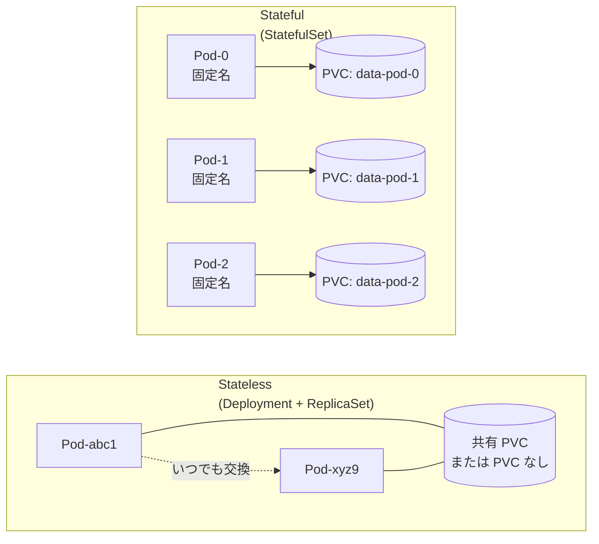
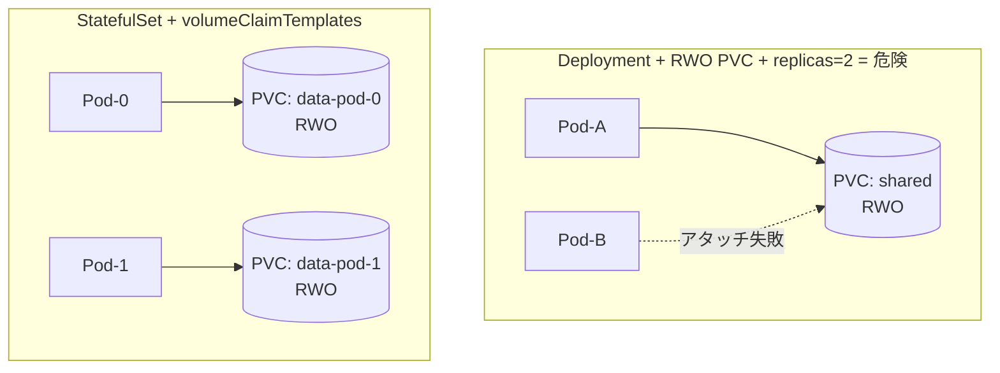
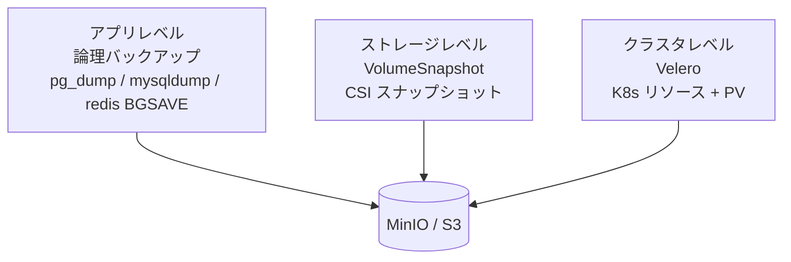
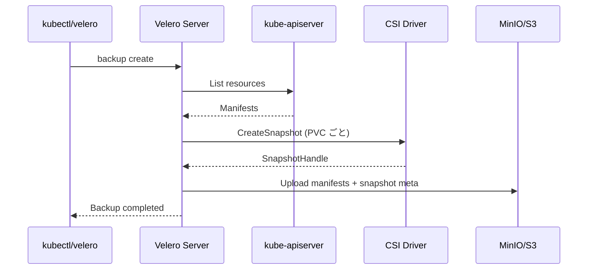
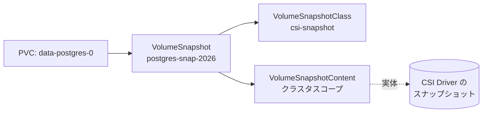
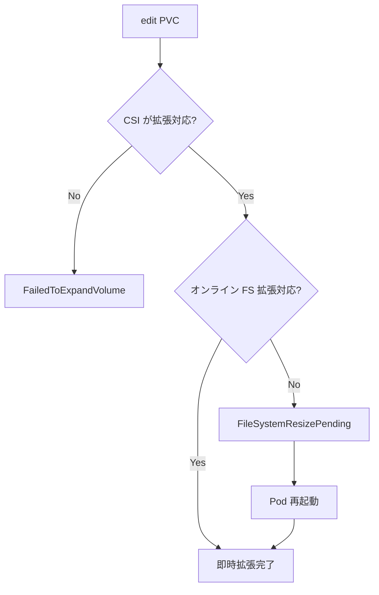
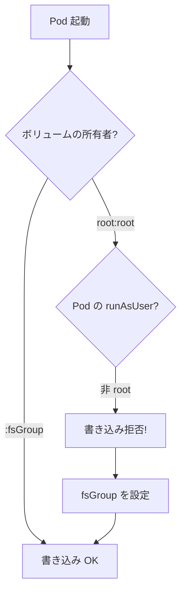
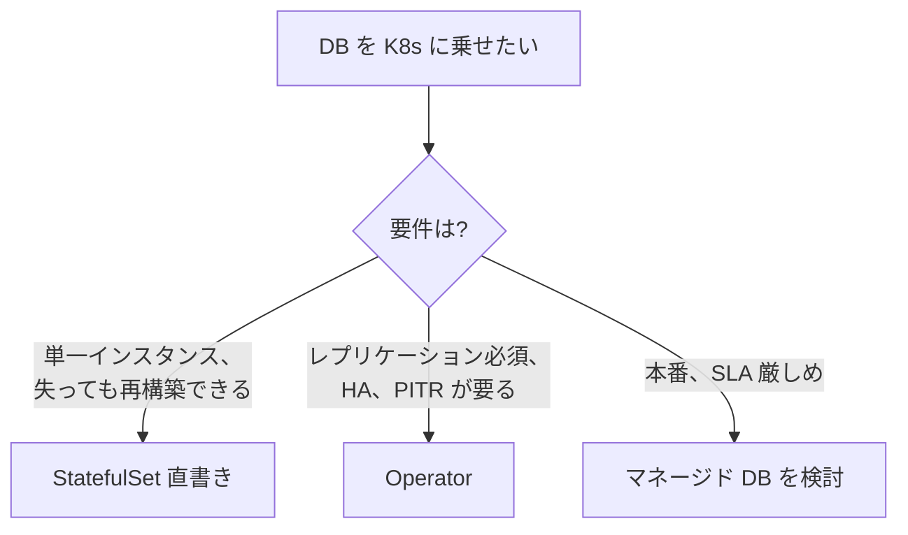
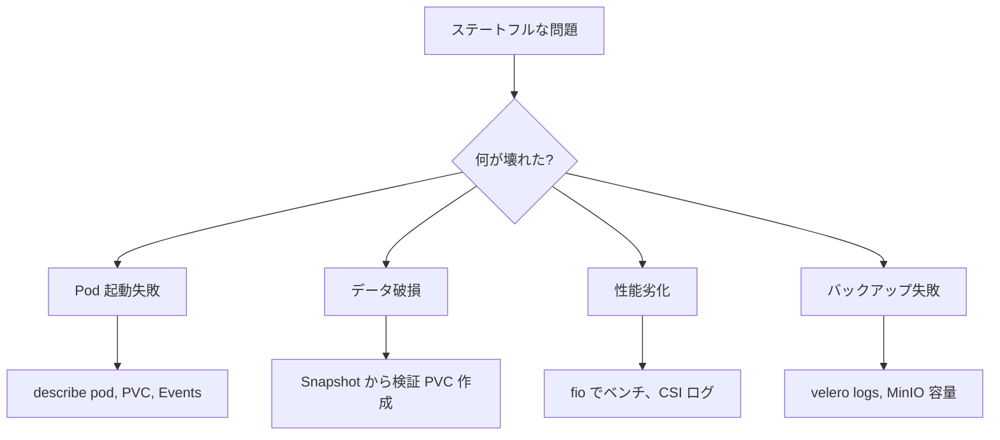
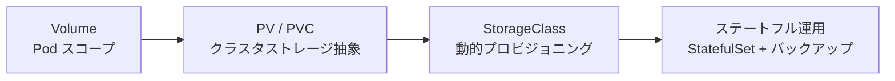

# ステートフル運用の実例
{: .no_toc }

## 目次
{: .no_toc .text-delta }

1. TOC
{:toc}

---

## このページのゴール

このページを読み終えると、以下を **自分の言葉で説明できる** ようになります。

- StatefulSet と PVC の組み合わせがなぜ「状態を持つアプリ」のデファクトなのか、Deployment + PVC との違いを技術的根拠とともに説明できる
- バックアップを「アプリレベル」「ストレージレベル」「クラスタレベル」の3層で設計する考え方
- Velero + MinIO をローカル環境(Minikube / kubeadm)でセットアップし、定期バックアップ・リストアを実行できる
- CSI `VolumeSnapshot` の仕組みと、`VolumeSnapshotClass`・`VolumeSnapshotContent` の関係
- PVC のオンラインリサイズ手順と、ファイルシステム拡張が必要となる理由
- `fsGroup` / `fsGroupChangePolicy` / `runAsUser` の組み合わせで起こる典型的な権限トラブルとその回避法
- ローカル環境でステートフルワークロードを運用するときの性能特性(NFS vs local-path vs Longhorn)
- データベースオペレータ(CloudNativePG, Zalando postgres-operator)を使う選択肢と、自前 StatefulSet との比較
- 災害復旧(DR)シナリオを想定した PV / PVC / Snapshot のリストア手順

---

## なぜ「ステートフル運用」が難しいのか

Kubernetes の設計思想は本来 **「Pod は揮発する」** ことを前提にしています。Deployment は Pod を「群れ」として扱い、いつでも作り直して構わないと考えます。一方、データベースのような **状態を持つアプリ** はこの前提と真っ向から対立します。

- Pod の名前が変わると困る(レプリケーション設定が壊れる)
- 起動順序が決まっている(マスター → レプリカ)
- 各 Pod が **固有の永続ボリューム** を持つ必要がある
- スケールダウン時にデータを保護したい

これらを解決するために導入されたのが **StatefulSet** と **`volumeClaimTemplates`** の組み合わせです。歴史的には Kubernetes v1.5 で `PetSet` という名前で alpha 登場し、v1.9 で StatefulSet として GA しました。「ペット(個体識別が必要)」と「家畜(代替可能)」のメタファで、ステートフルワークロードの位置づけを明確にした命名です。



StatefulSet の詳細は別章で扱いますが、ストレージの観点だけで言うと、**Pod ごとに専用の PVC が自動生成される** という点が最大の特徴です。

---

## StatefulSet と volumeClaimTemplates

StatefulSet の中でストレージを定義するのは `spec.volumeClaimTemplates` です。これは **「PVC を Pod ごとに自動で焼き増す型紙」** で、Pod の `volumeMounts` から名前で参照されます。

```yaml
apiVersion: apps/v1
kind: StatefulSet
metadata:
  name: postgres
  namespace: todo
spec:
  serviceName: postgres
  replicas: 1
  selector:
    matchLabels:
      app.kubernetes.io/name: postgres
  template:
    metadata:
      labels:
        app.kubernetes.io/name: postgres
        app.kubernetes.io/part-of: todo
    spec:
      securityContext:
        fsGroup: 999                # postgres ユーザの GID
        fsGroupChangePolicy: OnRootMismatch
      containers:
      - name: postgres
        image: postgres:16
        env:
        - name: POSTGRES_PASSWORD
          valueFrom:
            secretKeyRef:
              name: postgres-secret
              key: password
        - name: PGDATA
          value: /var/lib/postgresql/data/pgdata     # サブディレクトリ重要
        ports:
        - containerPort: 5432
        volumeMounts:
        - name: data
          mountPath: /var/lib/postgresql/data
        resources:
          requests:
            cpu: 250m
            memory: 512Mi
          limits:
            cpu: 1
            memory: 1Gi
  volumeClaimTemplates:
  - metadata:
      name: data
    spec:
      accessModes: [ReadWriteOnce]
      storageClassName: nfs
      resources:
        requests:
          storage: 5Gi
```

このマニフェストを apply すると、Pod 名と PVC 名が **`<volumeClaimTemplate名>-<StatefulSet名>-<序数>`** の規則で生成されます。

**期待される出力**:

```
$ kubectl apply -f postgres-sts.yaml
statefulset.apps/postgres created

$ kubectl get pods -n todo -w
NAME         READY   STATUS              RESTARTS   AGE
postgres-0   0/1     Pending             0          2s
postgres-0   0/1     ContainerCreating   0          5s
postgres-0   1/1     Running             0          12s

$ kubectl get pvc -n todo
NAME              STATUS   VOLUME       CAPACITY   ACCESS MODES   STORAGECLASS   AGE
data-postgres-0   Bound    pvc-7a3b...  5Gi        RWO            nfs            12s

$ kubectl get pv
NAME         CAPACITY   ACCESS MODES   RECLAIM POLICY   STATUS   CLAIM
pvc-7a3b...  5Gi        RWO            Delete           Bound    todo/data-postgres-0
```

{: .important }
> **`PGDATA` をサブディレクトリにする理由**
>
> PostgreSQL は `PGDATA` 直下に `lost+found` があると初期化を拒否します。NFS や ext4 で root ボリュームをマウントすると `lost+found` が存在することが多いため、`PGDATA=/var/lib/postgresql/data/pgdata` のように **1 階層下を使う** のが定石です。MySQL の `--datadir` も同様の理由でサブディレクトリ推奨です。

### スケールアウト時の挙動

```bash
$ kubectl scale sts/postgres --replicas=3 -n todo
statefulset.apps/postgres scaled

$ kubectl get pvc -n todo
NAME              STATUS   VOLUME       CAPACITY   STORAGECLASS   AGE
data-postgres-0   Bound    pvc-7a3b...  5Gi        nfs            5m
data-postgres-1   Bound    pvc-9c4d...  5Gi        nfs            30s    # 自動生成
data-postgres-2   Bound    pvc-ae5f...  5Gi        nfs            10s    # 自動生成
```

**重要なのはスケールダウン時の挙動です**。`replicas=3` から `replicas=1` に戻しても、**PVC は削除されません**。これは「データを失わない」ための意図的な設計で、StatefulSet が真に状態保持を支援している部分です。

```bash
$ kubectl scale sts/postgres --replicas=1 -n todo
$ kubectl get pvc -n todo
data-postgres-0   Bound   ...
data-postgres-1   Bound   ...    # 残る
data-postgres-2   Bound   ...    # 残る
```

明示的に `kubectl delete pvc data-postgres-1 data-postgres-2` で削除する必要があります。Kubernetes v1.27 以降は `spec.persistentVolumeClaimRetentionPolicy` で挙動を変えられます。

```yaml
spec:
  persistentVolumeClaimRetentionPolicy:
    whenDeleted: Retain    # StatefulSet 削除時 (Retain | Delete)
    whenScaled: Delete     # スケールダウン時 (Retain | Delete)
```

---

## Deployment + PVC ではダメな理由

「Deployment でも PVC は使えるのに、なぜわざわざ StatefulSet?」と疑問を持つかもしれません。実際、Deployment + 単一 PVC はよく見るパターンです。しかし以下の状況で問題が起きます。



| 状況 | Deployment + PVC | StatefulSet + volumeClaimTemplates |
|------|--------------------|------------------------------------|
| `replicas=1` で単純な永続化 | ✅ 動く | ✅ 動く |
| `replicas>1` で各 Pod に独立ストレージ | ❌ 全 Pod が同じ PVC を奪い合う | ✅ Pod ごとに別 PVC |
| Pod 名の安定 | ❌ 毎回ランダム | ✅ `name-0`, `name-1`, ... 固定 |
| 起動順序の保証 | ❌ 並列に起動 | ✅ 0 → 1 → 2 順次 |
| Rolling Update | 全 Pod 同時に交換可能 | 序数の逆順で 1 つずつ |
| RollingUpdate 中の DNS | 古い Pod 名は消える | `pod-0.svc` で常に同じ Pod を指せる |

データベース、メッセージブローカー、分散ストレージ(Cassandra、Elasticsearch、Kafka など)では **Pod 名の安定** と **個別 PVC** の両方が必要なので、StatefulSet が事実上の唯一解です。

{: .warning }
> Deployment で PVC を使う場合、**`accessModes: ReadWriteOnce` で `replicas: 2` 以上にすると同時に同じノードに乗らない限り起動しません**。RollingUpdate 中にも片方が `Pending` で詰まる事故が頻発します。「Deployment + PVC + replicas>1」を見たら、すぐ StatefulSet への移行を検討してください。

---

## バックアップ戦略 ― 3層モデル

ステートフル運用で **バックアップは絶対に必須** です。設計のフレームワークとして、以下の 3 層で考えるとシンプルです。



| 層 | ツール例 | 取れるもの | 復旧時間 | 運用コスト |
|----|----------|-----------|----------|-----------|
| アプリレベル | `pg_dump`, `pg_basebackup`, `mongodump`, `redis BGSAVE` | 論理データ(SQL/JSON) | 中(リストア時間) | 中(整合性管理) |
| ストレージレベル | CSI `VolumeSnapshot` | PV のブロックスナップショット | 速(ボリューム単位即時) | 低(自動化容易) |
| クラスタレベル | Velero, Kasten K10 | リソースマニフェスト + PV | 中(全体構築) | 中(設定多) |

**重要なのは、これらは置換ではなく組み合わせる関係** という点です。

- 「DB 論理ダンプは毎日」「VolumeSnapshot は 1 時間ごと」「Velero は週 1 のクラスタ全体」のように **頻度と粒度を組み合わせる**
- 1 層が壊れたときに別の層から復旧できる「多層防御」になる
- **論理バックアップが取れない障害(ファイル破損など)では Snapshot が、Snapshot 自体が破損したら論理ダンプが** という相互補完

### アプリレベル: PostgreSQL の例

```bash
# CronJob で毎日 2:00 にダンプ → MinIO に保存
apiVersion: batch/v1
kind: CronJob
metadata:
  name: postgres-dump
  namespace: todo
spec:
  schedule: "0 2 * * *"
  jobTemplate:
    spec:
      template:
        spec:
          restartPolicy: OnFailure
          containers:
          - name: dump
            image: postgres:16
            command:
            - /bin/sh
            - -c
            - |
              set -eu
              ts=$(date +%Y%m%d-%H%M)
              pg_dump -h postgres -U todo todo \
                | gzip > /tmp/dump-${ts}.sql.gz
              mc cp /tmp/dump-${ts}.sql.gz minio/backup/postgres/
            env:
            - name: PGPASSWORD
              valueFrom:
                secretKeyRef:
                  name: postgres-secret
                  key: password
```

### アプリレベル: Redis の例

Redis には 2 種類の永続化機構(RDB と AOF)があります。

| 方式 | 仕組み | 復旧粒度 | サイズ |
|------|--------|----------|--------|
| RDB(Snapshot) | 一定間隔でメモリイメージをファイル化 | 最終スナップショット時点 | 小さい |
| AOF(Append Only File) | 書き込み命令を逐次追記 | ほぼ秒単位 | 大きい |
| 両方 | RDB + AOF | AOF を優先 | 中 |

```bash
# 手動 RDB 強制保存 → コピー
kubectl exec -n todo redis-0 -- redis-cli BGSAVE
kubectl exec -n todo redis-0 -- ls -la /data/dump.rdb
kubectl cp todo/redis-0:/data/dump.rdb ./dump-$(date +%F).rdb
```

---

## Velero ― クラスタ全体のバックアップ

[Velero](https://velero.io) は VMware が開発する OSS で、**「Kubernetes リソース定義 + 関連する PV データ」をまとめてバックアップ・リストアできる** クラスタレベルの DR ツールです。



### ローカル環境での Velero + MinIO セットアップ

第7章で構築する VMware kubeadm 環境を前提に、MinIO を S3 互換のバックアップ先として使います。

#### 1. MinIO のインストール

```bash
helm repo add bitnami https://charts.bitnami.com/bitnami
helm repo update

helm install minio bitnami/minio \
  --namespace minio --create-namespace \
  --set auth.rootUser=minio \
  --set auth.rootPassword=minio12345 \
  --set defaultBuckets="velero" \
  --set persistence.size=20Gi \
  --set persistence.storageClass=nfs
```

#### 2. Velero CLI のインストール

```bash
VELERO_VERSION=v1.14.0
curl -L https://github.com/vmware-tanzu/velero/releases/download/${VELERO_VERSION}/velero-${VELERO_VERSION}-linux-amd64.tar.gz \
  | tar xz
sudo mv velero-${VELERO_VERSION}-linux-amd64/velero /usr/local/bin/
velero version --client-only
```

#### 3. 認証情報ファイル

```bash
cat > credentials-velero <<EOF
[default]
aws_access_key_id = minio
aws_secret_access_key = minio12345
EOF
```

#### 4. Velero サーバ側のインストール

```bash
velero install \
  --provider aws \
  --plugins velero/velero-plugin-for-aws:v1.10.0 \
  --bucket velero \
  --secret-file ./credentials-velero \
  --use-volume-snapshots=true \
  --backup-location-config region=minio,s3ForcePathStyle=true,s3Url=http://minio.minio.svc:9000 \
  --snapshot-location-config region=minio \
  --features=EnableCSI \
  --uploader-type=kopia
```

各フラグの意味:

- `--provider aws`: MinIO は S3 互換なので `aws` プラグインを使う
- `--plugins`: 使うプラグインの OCI イメージ
- `--bucket velero`: バックアップを保存するバケット名
- `--secret-file`: 上で作った認証ファイル
- `--use-volume-snapshots=true`: PV バックアップに CSI Snapshot を使う
- `--backup-location-config`: MinIO の URL とパススタイル指定。`s3ForcePathStyle` は MinIO で必須
- `--features=EnableCSI`: CSI スナップショット連携機能を有効化
- `--uploader-type=kopia`: ファイルレベルバックアップ(File System Backup)のバックエンド。`restic` から `kopia` に主流が移った

**期待される出力**:

```
CustomResourceDefinition/backups.velero.io: created
CustomResourceDefinition/backupstoragelocations.velero.io: created
...
Deployment/velero: created
Velero is installed! ⛵ Use 'kubectl logs deployment/velero -n velero' to view the status.
```

#### 5. バックアップの実行

```bash
# 単発バックアップ(todo Namespace 全体)
velero backup create todo-2026-05-08 \
  --include-namespaces todo \
  --wait

# 結果確認
velero backup describe todo-2026-05-08
velero backup logs    todo-2026-05-08
```

#### 6. 定期バックアップ(Schedule)

```bash
velero schedule create daily \
  --schedule="0 2 * * *" \
  --include-namespaces todo \
  --ttl 720h          # 30 日で削除
```

`--ttl` を超えたバックアップは自動削除されます。これがないと MinIO が無限に膨らみます。

#### 7. リストア

```bash
# Namespace を削除してから戻すパターン
kubectl delete namespace todo
velero restore create --from-backup todo-2026-05-08 --wait

# 別 Namespace に戻すパターン(本番から検証環境へクローン)
velero restore create todo-clone \
  --from-backup todo-2026-05-08 \
  --namespace-mappings todo:todo-staging
```

### Velero のスコープと限界

{: .note }
> **Velero でバックアップされるもの**
> - Kubernetes リソース全種類(Deployment, Service, ConfigMap, Secret, PVC, ...)
> - PV データ(CSI Snapshot または FSB によるファイルレベル)
> - Cluster-scoped リソース(StorageClass, ClusterRole, ...)
>
> **バックアップされないもの・注意点**
> - DB の **トランザクション整合性は保証されない**(Pre/Post hooks で自前確保が必要)
> - クラスタ自体のメタデータ(etcd 直接スナップショットは別途必要)
> - イメージレジストリの中身(別途 `registry` 自体のバックアップが必要)

PostgreSQL のような DB を Velero でバックアップする場合は、**Pre Hook で `pg_start_backup`、Post Hook で `pg_stop_backup`** を呼んで一貫性を取るのが定石です。

```yaml
# Pod アノテーション
metadata:
  annotations:
    pre.hook.backup.velero.io/command: '["/bin/sh","-c","pg_dumpall -U postgres > /backup/all.sql"]'
    pre.hook.backup.velero.io/timeout:  "5m"
```

---

## VolumeSnapshot ― CSI ネイティブのスナップショット

CSI v1.0+ には **スナップショット** の標準 API があり、Kubernetes は `VolumeSnapshot` という CRD を介してそれを操作します。仕組みは PVC ↔ PV と同型です。



| ユーザ視点 | クラスタ視点 |
|------------|-------------|
| `VolumeSnapshot`(Namespace スコープ) | `VolumeSnapshotContent`(Cluster スコープ) |
| `VolumeSnapshotClass`(レシピ) | CSI Driver の Snapshotter |

### VolumeSnapshotClass の準備

```yaml
apiVersion: snapshot.storage.k8s.io/v1
kind: VolumeSnapshotClass
metadata:
  name: csi-snapshot
driver: nfs.csi.k8s.io       # PVC を作った CSI ドライバと同じ
deletionPolicy: Delete
parameters:
  csi.storage.k8s.io/snapshotter-secret-name: snapshot-secret
  csi.storage.k8s.io/snapshotter-secret-namespace: kube-system
```

`deletionPolicy` の選択肢:

| 値 | VolumeSnapshot 削除時の挙動 |
|----|------------------------------|
| `Delete` | 物理スナップショットも削除 |
| `Retain` | 物理スナップショットは残す(`VolumeSnapshotContent` も残る) |

### スナップショットを取る

```yaml
apiVersion: snapshot.storage.k8s.io/v1
kind: VolumeSnapshot
metadata:
  name: postgres-snap-2026-05-08
  namespace: todo
spec:
  volumeSnapshotClassName: csi-snapshot
  source:
    persistentVolumeClaimName: data-postgres-0
```

```bash
$ kubectl apply -f snap.yaml
volumesnapshot.snapshot.storage.k8s.io/postgres-snap-2026-05-08 created

$ kubectl get volumesnapshot -n todo
NAME                       READYTOUSE   SOURCEPVC         RESTORESIZE   AGE
postgres-snap-2026-05-08   true         data-postgres-0   5Gi           20s
```

`READYTOUSE: true` になるまでは復元元として使えません。CSI ドライバ依存ですが、通常は数秒〜数分です。

### スナップショットから新 PVC を作る(復元)

```yaml
apiVersion: v1
kind: PersistentVolumeClaim
metadata:
  name: data-postgres-restored
  namespace: todo
spec:
  accessModes: [ReadWriteOnce]
  storageClassName: nfs
  resources:
    requests:
      storage: 5Gi
  dataSource:
    name: postgres-snap-2026-05-08
    kind: VolumeSnapshot
    apiGroup: snapshot.storage.k8s.io
```

`dataSource` に `VolumeSnapshot` を指定するとそのスナップショットからクローンされた PVC が作られます。元の PVC を上書きするのではなく **新しい PVC** が作られる点に注意してください。

### CSI ドライバの対応状況

| ドライバ | スナップショット対応 | 備考 |
|----------|---------------------|------|
| nfs.csi.k8s.io | ✅(NFSv4 + バックエンド依存) | バックエンドの NFS サーバが対応している必要あり |
| local-path-provisioner | ❌ | スナップショット非対応 |
| longhorn.io | ✅ | リッチな機能、Web UI あり |
| rook-ceph.rbd.csi.ceph.com | ✅ | Ceph RBD ネイティブ |
| topolvm.cybozu.com | ✅ | LVM スナップショット |

### スナップショットによるバックアップ自動化

```yaml
# CronJob で毎時スナップショット
apiVersion: batch/v1
kind: CronJob
metadata:
  name: hourly-snap
  namespace: todo
spec:
  schedule: "0 * * * *"
  jobTemplate:
    spec:
      template:
        spec:
          serviceAccountName: snap-creator
          restartPolicy: OnFailure
          containers:
          - name: kubectl
            image: bitnami/kubectl:1.30
            command:
            - /bin/sh
            - -c
            - |
              ts=$(date +%Y%m%d-%H%M)
              cat <<EOF | kubectl apply -f -
              apiVersion: snapshot.storage.k8s.io/v1
              kind: VolumeSnapshot
              metadata:
                name: postgres-snap-${ts}
                namespace: todo
              spec:
                volumeSnapshotClassName: csi-snapshot
                source:
                  persistentVolumeClaimName: data-postgres-0
              EOF
```

`ServiceAccount` には `volumesnapshots.snapshot.storage.k8s.io` への `create` 権限を付ける `Role` が必要です。RBAC は第8章で扱います。

---

## PVC リサイズ(オンライン拡張)

ストレージは「最初に小さく、必要に応じて拡張」が基本。Kubernetes v1.11 で alpha 登場、v1.24 で GA したオンライン拡張機能を使うと **Pod を止めずに容量を増やせます**(ファイルシステム依存)。

### 前提条件

1. StorageClass で `allowVolumeExpansion: true`
2. CSI ドライバが `EXPAND_VOLUME` capability をサポート
3. ファイルシステムが拡張可能(ext4, XFS, ZFS は OK / FAT は NG)

確認:

```bash
kubectl get sc nfs -o jsonpath='{.allowVolumeExpansion}'
# true
```

### 手順

```bash
# 現状確認
kubectl get pvc -n todo data-postgres-0
# CAPACITY: 5Gi

# 編集
kubectl edit pvc -n todo data-postgres-0
# spec.resources.requests.storage: 5Gi → 20Gi に変更

# 進捗を見る
kubectl describe pvc -n todo data-postgres-0
# Conditions:
#   Type                       Status
#   FileSystemResizePending    True       <- ボリューム拡張済み、FS 拡張待ち
```

### Pod 再起動でファイルシステム拡張

オンライン FS 拡張に対応していない CSI ドライバの場合、**Pod を再起動するとマウント時に FS が拡張** されます。

```bash
kubectl delete pod -n todo postgres-0
# 再作成された Pod が新しい容量で起動

kubectl get pvc -n todo data-postgres-0
# CAPACITY: 20Gi
```

オンライン FS 拡張に対応している CSI ドライバ(Longhorn 等)では Pod 再起動なしで完了します。

### リサイズの落とし穴



| 症状 | 原因 | 対処 |
|------|------|------|
| `kubectl edit` で容量を **減らす** とエラー | 縮小は仕様で禁止 | より小さな新 PVC を作って `pg_dump` で移行 |
| `Reason: ExternalExpanding` のまま進まない | CSI external-resizer が動いていない | `kubectl get pods -n kube-system | grep resizer` |
| `Reason: FileSystemResizePending` のまま | FS 側拡張がブロックされている | Pod 再起動 |
| そもそも `allowVolumeExpansion: false` | SC 設定不足 | 別 SC を作って PVC ごと移行 |

{: .warning }
> **PVC は縮小不可** です。設計時は **「とりあえず大きく」よりも「必要分から拡張する」** 戦略のほうが安全です(後から減らせない代わりに増やすのは簡単)。

---

## fsGroup と権限問題

ステートフル運用で頻発する罠が **「Pod の中のユーザがマウントしたボリュームに書き込めない」** 問題です。コンテナの実行ユーザ(UID)とボリュームの所有者が合っていないと起こります。

### `fsGroup` の役割

```yaml
spec:
  securityContext:
    fsGroup: 999                       # GID
    fsGroupChangePolicy: OnRootMismatch
```

`fsGroup` を指定すると、kubelet がボリュームをマウントした直後に:

1. ボリュームのトップレベルを `chown :<fsGroup>` する
2. グループ書き込み権限を立てる(`chmod g+rwx`)

これにより、Pod 内のプロセスがどの UID で動いていても、所属グループに `fsGroup` が含まれていればボリュームを読み書きできます。

### `fsGroupChangePolicy`

| 値 | 動作 |
|----|------|
| `Always`(既定) | マウントごとに毎回 `chown -R` を再帰実行 |
| `OnRootMismatch` | トップレベルの所有者が `fsGroup` と違うときだけ実行 |

`OnRootMismatch` を選ぶ理由は **大量ファイルでの再帰 chown の遅延回避** です。PostgreSQL のデータディレクトリのように数万ファイルあると、`Always` だとマウントに数十秒かかることがあります。

### よくある権限トラブル



| 症状 | 原因 | 対処 |
|------|------|------|
| `Permission denied` で起動失敗 | コンテナ内 UID とマウント所有者が不一致 | `securityContext.fsGroup` を設定 |
| マウントに時間がかかる(数分待つ) | 再帰 chown が遅い | `fsGroupChangePolicy: OnRootMismatch` |
| `fsGroup` 設定後も書けない | NFS マウントオプションの問題 | NFS 側の `no_root_squash` 確認、`fsGroup` 効かない CSI もある |
| `runAsNonRoot: true` で起動できない | イメージの USER が root | Dockerfile を修正 or `runAsUser: 999` 明示 |

### NFS の特殊事情

{: .important }
> **NFS と `fsGroup` の相性**
>
> NFS マウントでは `fsGroup` が **「効くが永続しない」** ケースがあります。NFS サーバ側の権限がそのまま見えるので、Pod 削除後に再マウントすると元の所有者に戻ります。NFS-CSI を使う場合は **エクスポート側で適切に `chown -R 999:999`** しておくのが堅実です。

```bash
# NFS サーバ側(k8s-nfs ノード)
sudo mkdir -p /export/postgres
sudo chown -R 999:999 /export/postgres
sudo chmod -R 750     /export/postgres
```

### よく使う UID/GID

| アプリ | 推奨 UID:GID | 備考 |
|--------|--------------|------|
| PostgreSQL 公式イメージ | 999:999 | `postgres` ユーザ |
| MySQL 公式イメージ | 999:999 | `mysql` ユーザ |
| Redis 公式イメージ | 999:999 | `redis` ユーザ |
| nginx 公式イメージ | 101:101 | `nginx` ユーザ |
| Bitnami 系イメージ | 1001:1001 | 非 root 統一規約 |

---

## ストレージ性能チューニング

ローカル環境でのステートフル運用は **ストレージが性能ボトルネック** になりがちです。CSI ドライバとバックエンドの組み合わせで体感性能が大きく変わります。

### 簡易ベンチマーク

```bash
# fio による Random Read/Write 4KiB
kubectl run fio --rm -it --restart=Never \
  --image=ljishen/fio \
  --overrides='{"spec":{"containers":[{"name":"fio","image":"ljishen/fio","volumeMounts":[{"mountPath":"/data","name":"v"}]}],"volumes":[{"name":"v","persistentVolumeClaim":{"claimName":"bench"}}]}}' \
  -- --name=test --rw=randwrite --size=1G --bs=4k --numjobs=1 \
     --runtime=30 --time_based --direct=1 --filename=/data/fio
```

### ローカル環境での参考値

| ストレージ | 4K Random Write IOPS | レイテンシ p99 | コメント |
|------------|---------------------|----------------|----------|
| local-path(SSD) | 30,000+ | <1ms | 単一ノード前提なら最速 |
| Longhorn(SSD x3 レプリカ) | 5,000〜10,000 | 5〜10ms | 同期レプリケーションあり |
| NFS(NFSv4, 1GbE) | 500〜2,000 | 10〜50ms | 帯域がボトルネック |
| NFS(NFSv4, 10GbE) | 5,000〜15,000 | 2〜10ms | DB 用にギリギリ |
| Rook-Ceph(RBD, 3 レプリカ) | 3,000〜10,000 | 5〜20ms | 運用は重い |

{: .warning }
> **NFS で PostgreSQL を動かすときの罠**
>
> NFSv3 はファイルロックの整合性が弱く、PostgreSQL の WAL でデータ破損の事例があります。**必ず NFSv4 以上**(`mountOptions: [nfsvers=4.1]`)で、可能なら専用 SSD バックエンドを使ってください。学習・検証目的なら問題ありませんが、本番 DB ストレージとして NFS は基本的に推奨されません。

### DB 用なら local-path の選択肢

```yaml
apiVersion: storage.k8s.io/v1
kind: StorageClass
metadata:
  name: local-fast
provisioner: rancher.io/local-path
volumeBindingMode: WaitForFirstConsumer  # 必須
reclaimPolicy: Retain
parameters:
  pathPattern: "/data/local-path-provisioner/{{.PVC.Namespace}}/{{.PVC.Name}}"
```

トレードオフ:

- ✅ ノードのローカル SSD 性能を最大限活用
- ✅ ネットワークレイテンシゼロ
- ❌ ノード障害時にデータが失われるリスク(レプリケーションは自前で)
- ❌ Pod が他ノードに動けない(`nodeAffinity` で固定)

DB に local-path を使う場合は **アプリ層でレプリケーション**(PostgreSQL streaming replication など)を組むのが正解です。

---

## データベースオペレータ ― 自前 StatefulSet の代替

PostgreSQL や Redis を「ただの StatefulSet」で動かすのは可能ですが、レプリケーション、フェイルオーバー、PITR(時点復旧)、メジャーバージョンアップなど **本番運用に必要な機能を全部自分で組み立てる** ことになります。

そこで便利なのが **データベースオペレータ** です。Operator は Kubernetes の CRD として DB の高レベル概念(Cluster, Backup, Restore など)を提供し、コントローラがそれを実体化してくれます。

### PostgreSQL オペレータの主な選択肢

| オペレータ | 特徴 | おすすめ度 |
|-----------|------|-----------|
| [CloudNativePG](https://cloudnative-pg.io/) | EnterpriseDB 製、シンプル、PG 専業 | ★★★ ローカル学習にも◎ |
| [Zalando postgres-operator](https://github.com/zalando/postgres-operator) | Spilo 利用、PG 13+ サポート、HA 強い | ★★ 大規模運用向け |
| [Crunchy Data PGO](https://github.com/CrunchyData/postgres-operator) | 商用サポートあり、機能リッチ | ★★ 商用前提 |
| [Stackgres](https://stackgres.io/) | 全部入り、Operator + Web UI | ★ 学習曲線あり |

### CloudNativePG の例

```yaml
apiVersion: postgresql.cnpg.io/v1
kind: Cluster
metadata:
  name: todo-postgres
  namespace: todo
spec:
  instances: 3                      # プライマリ + レプリカ 2
  primaryUpdateStrategy: unsupervised
  storage:
    size: 10Gi
    storageClass: nfs
  bootstrap:
    initdb:
      database: todo
      owner: todo
  backup:
    barmanObjectStore:
      destinationPath: s3://backup/postgres
      endpointURL: http://minio.minio.svc:9000
      s3Credentials:
        accessKeyId:
          name: minio-creds
          key: ACCESS_KEY_ID
        secretAccessKey:
          name: minio-creds
          key: SECRET_ACCESS_KEY
    retentionPolicy: "30d"
```

これだけで以下が自動で揃います:

- Primary / Replica の StatefulSet 構築
- ストリーミングレプリケーション設定
- 接続用 Service(`-rw`, `-ro`, `-r`)
- WAL アーカイブを MinIO に継続書き出し
- フェイルオーバ自動化
- Continuous Backup + Point-in-Time Recovery

### Operator を使うべきか、StatefulSet で十分か



| 観点 | 自前 StatefulSet | Operator | マネージド DB |
|------|------------------|----------|---------------|
| 学習コスト | 低 | 中(CRD を覚える) | 低 |
| 運用機能 | 自分で実装 | 一通り揃う | クラウドベンダー任せ |
| HA・PITR | 自前 | あり | あり |
| バージョンアップ | 手動 | Operator が支援 | 自動/半自動 |
| ローカル環境適合 | ✅ | ✅(本書範囲内) | ❌ |

本書は「ローカル完結」が方針なので、**学習段階では StatefulSet 直書き → 慣れたら CloudNativePG** という順序がおすすめです。

---

## ハンズオン: TODO サービスの本格永続化

ここまでの内容を組み合わせ、サンプルアプリの DB を「バックアップ・スナップショット・リサイズ」フル装備で構成します。

### 1. PostgreSQL StatefulSet の作成

```yaml
# postgres.yaml
apiVersion: v1
kind: Secret
metadata:
  name: postgres-secret
  namespace: todo
type: Opaque
stringData:
  password: changeme123
---
apiVersion: v1
kind: Service
metadata:
  name: postgres
  namespace: todo
spec:
  clusterIP: None              # Headless Service
  selector:
    app.kubernetes.io/name: postgres
  ports:
  - port: 5432
---
apiVersion: apps/v1
kind: StatefulSet
metadata:
  name: postgres
  namespace: todo
spec:
  serviceName: postgres
  replicas: 1
  selector:
    matchLabels:
      app.kubernetes.io/name: postgres
  template:
    metadata:
      labels:
        app.kubernetes.io/name: postgres
        app.kubernetes.io/part-of: todo
    spec:
      securityContext:
        fsGroup: 999
        fsGroupChangePolicy: OnRootMismatch
      containers:
      - name: postgres
        image: postgres:16
        env:
        - name: POSTGRES_PASSWORD
          valueFrom:
            secretKeyRef:
              name: postgres-secret
              key: password
        - name: POSTGRES_DB
          value: todo
        - name: POSTGRES_USER
          value: todo
        - name: PGDATA
          value: /var/lib/postgresql/data/pgdata
        ports:
        - containerPort: 5432
        volumeMounts:
        - name: data
          mountPath: /var/lib/postgresql/data
        readinessProbe:
          exec:
            command: [pg_isready, -U, todo]
          initialDelaySeconds: 5
          periodSeconds: 5
        livenessProbe:
          exec:
            command: [pg_isready, -U, todo]
          initialDelaySeconds: 30
          periodSeconds: 10
  volumeClaimTemplates:
  - metadata:
      name: data
    spec:
      accessModes: [ReadWriteOnce]
      storageClassName: nfs
      resources:
        requests:
          storage: 5Gi
```

```bash
kubectl create namespace todo
kubectl apply -f postgres.yaml
kubectl wait --for=condition=Ready pod -l app.kubernetes.io/name=postgres -n todo --timeout=120s
```

### 2. テストデータの投入

```bash
kubectl exec -it -n todo postgres-0 -- psql -U todo -c "
CREATE TABLE tasks (id SERIAL, title TEXT, done BOOLEAN DEFAULT FALSE, created_at TIMESTAMPTZ DEFAULT NOW());
INSERT INTO tasks (title) VALUES ('K8s を学ぶ'), ('PV/PVC を覚える'), ('Velero を試す');
SELECT * FROM tasks;
"
```

### 3. VolumeSnapshot を取る

```yaml
apiVersion: snapshot.storage.k8s.io/v1
kind: VolumeSnapshot
metadata:
  name: postgres-snap-initial
  namespace: todo
spec:
  volumeSnapshotClassName: csi-snapshot
  source:
    persistentVolumeClaimName: data-postgres-0
```

```bash
kubectl apply -f snap-initial.yaml
kubectl get volumesnapshot -n todo -w
```

### 4. データを破壊する(障害シミュレーション)

```bash
kubectl exec -it -n todo postgres-0 -- psql -U todo -c "
DELETE FROM tasks;
SELECT count(*) FROM tasks;
"
# 0
```

### 5. スナップショットから復元する

```yaml
apiVersion: v1
kind: PersistentVolumeClaim
metadata:
  name: data-postgres-restored
  namespace: todo
spec:
  accessModes: [ReadWriteOnce]
  storageClassName: nfs
  resources:
    requests:
      storage: 5Gi
  dataSource:
    name: postgres-snap-initial
    kind: VolumeSnapshot
    apiGroup: snapshot.storage.k8s.io
```

復元 PVC を新しい Pod でマウントしてデータを確認:

```yaml
apiVersion: v1
kind: Pod
metadata:
  name: postgres-verify
  namespace: todo
spec:
  containers:
  - name: postgres
    image: postgres:16
    env:
    - name: POSTGRES_PASSWORD
      value: changeme123
    - name: PGDATA
      value: /var/lib/postgresql/data/pgdata
    volumeMounts:
    - name: data
      mountPath: /var/lib/postgresql/data
  volumes:
  - name: data
    persistentVolumeClaim:
      claimName: data-postgres-restored
```

```bash
kubectl exec -it -n todo postgres-verify -- psql -U todo -c "SELECT * FROM tasks;"
# 3 行出るはず!
```

### 6. Velero で Namespace 全体をバックアップ

```bash
velero backup create todo-full --include-namespaces todo --wait
velero backup describe todo-full
```

### 7. PVC リサイズ

```bash
# 5Gi → 20Gi
kubectl patch pvc data-postgres-0 -n todo \
  -p '{"spec":{"resources":{"requests":{"storage":"20Gi"}}}}'

kubectl describe pvc -n todo data-postgres-0 | grep -A2 Conditions

# Pod 再起動で FS 拡張
kubectl delete pod -n todo postgres-0
kubectl wait --for=condition=Ready pod postgres-0 -n todo --timeout=120s

# 確認
kubectl exec -n todo postgres-0 -- df -h /var/lib/postgresql/data
```

### 8. 災害復旧シミュレーション(Namespace ごと吹き飛ばし)

```bash
kubectl delete namespace todo
# しばらく待つ

velero restore create from-todo-full --from-backup todo-full --wait
velero restore describe from-todo-full

kubectl get all,pvc -n todo
kubectl exec -n todo postgres-0 -- psql -U todo -c "SELECT count(*) FROM tasks;"
```

ここまでが **「本番運用最低限」** のスケルトンです。実運用ではこれにモニタリング(Prometheus + alerting)、ログ収集(Loki/EFK)、外部疎通(Ingress + TLS)が加わります。

---

## トラブルシュートカタログ



| 症状 | 第一手 | 典型原因 | 対処 |
|------|--------|----------|------|
| `postgres-0` が `CrashLoopBackOff` | `kubectl logs postgres-0 -p` | `lost+found` 干渉 / PGDATA 権限 | `PGDATA=.../pgdata` に変更、`fsGroup: 999` |
| StatefulSet スケール後 PVC が増えない | `describe sts` の Events | StorageClass が `WaitForFirstConsumer` で Pod が pending | Pod 配置と SC の `allowedTopologies` 整合確認 |
| PVC が `Pending` のまま | `describe pvc` | プロビジョナ Pod が落ちている | `kubectl get pods -n kube-system -l app=csi-driver-nfs` |
| `velero backup` が `PartiallyFailed` | `velero backup logs` | CSI スナップショット非対応 PVC | FSB(File System Backup)に切替、annotation `backup.velero.io/backup-volumes` |
| スナップショット復元後にデータが古い | スナップショット時刻 | 直近の更新が含まれていない | 復元前に WAL アーカイブから前進復旧、PITR を検討 |
| PVC リサイズが反映されない | `describe pvc` の Conditions | `FileSystemResizePending` | Pod 再起動 |
| `kubectl exec` で `Permission denied` | `id` 出力確認 | `fsGroup` 未設定 / イメージの USER 違い | `securityContext.fsGroup` 追加 |
| マウントが30秒以上待たされる | kubelet ログ | `fsGroupChangePolicy: Always` で再帰 chown 重い | `OnRootMismatch` に変更 |
| バックアップが MinIO に届かない | `velero backup logs` | バケット未作成 / endpoint URL 誤り | MinIO 側でバケット作成、`s3ForcePathStyle=true` 確認 |
| StatefulSet 削除しても PVC が残る | 仕様 | デフォルトは保持(意図的) | 必要なら `persistentVolumeClaimRetentionPolicy` 設定 |

---

## 本番運用 ― 落とし穴 10 箇条

1. **バックアップは「取れた」ではなく「戻せた」で初めて完了**
   毎週・毎月 **リストア演習** をスケジュールに入れる。Velero `restore --namespace-mappings` で別 Namespace に戻せば本番に影響なし

2. **DB バックアップは論理 + 物理の両方を持つ**
   `pg_dump`(論理)と VolumeSnapshot(物理)を併用。論理は破損耐性、物理は速度

3. **PVC 容量は監視する**
   `kubelet_volume_stats_used_bytes / kubelet_volume_stats_capacity_bytes > 0.85` でアラート

4. **`reclaimPolicy: Delete` の SC を本番 DB に使わない**
   PVC を誤削除した瞬間にデータも消える

5. **`PVC.Retain` の SC でも、本番 PVC には削除保護を**
   Kyverno や OPA Gatekeeper で `kubectl delete pvc` を禁止する Policy

6. **ノード障害でローカル PV が孤立する問題に備える**
   ノードが復旧しないと PV にアクセスできない。レプリカを複数ノードに配置

7. **NFS 単一サーバは SPOF(Single Point of Failure)**
   学習用なら問題ないが、本番なら 2 系統 NFS + DRBD、または分散ストレージへ

8. **メジャーバージョンアップは PVC をクローンしてから**
   PostgreSQL 15 → 16 のような変更は VolumeSnapshot を取り、復元 PVC で先に検証

9. **`storageClassName` をハードコードしない**
   環境ごとに違う SC 名を Helm values や Kustomize patch で差し替えられる構造に

10. **ステートレスとステートフルを Namespace で分離**
    `apps`(stateless)と `data`(stateful)を分けて、Network Policy / RBAC で隔離

---

## 章のまとめと次へ

この章では、Pod に **永続性** を持たせる仕組みを次の流れで学びました。



第 6 章では **ConfigMap と Secret** を扱います。アプリの設定や認証情報をどのように Pod に渡すか、機密情報の取り扱いはどうあるべきか、を学びます。Volume と同じく Pod にマウントできるリソースですが、目的と扱い方が違うので別章として独立しています。

---

## チェックポイント

ここまでで以下を **自分の言葉で** 説明できるか確認してください。

- [ ] StatefulSet が Deployment + 単一 PVC とどう違うのか、Pod 名・PVC 自動生成・スケール時挙動の観点から述べられる
- [ ] `volumeClaimTemplates` の役割と、生成される PVC の命名規則(`<template>-<sts>-<ord>`)を答えられる
- [ ] StatefulSet スケールダウン時に PVC が削除されない理由と、`persistentVolumeClaimRetentionPolicy` の使い方
- [ ] バックアップを「アプリレベル / ストレージレベル / クラスタレベル」の 3 層で設計する考え方
- [ ] Velero でローカル MinIO バックエンドへバックアップ・リストアする一連の手順
- [ ] `VolumeSnapshot` と `VolumeSnapshotClass`、`VolumeSnapshotContent` の関係を図で書ける
- [ ] PVC オンライン拡張の手順と、ファイルシステム拡張のために Pod 再起動が必要なケース
- [ ] `fsGroup` と `fsGroupChangePolicy: OnRootMismatch` を使う理由を、大量ファイル時のマウント遅延の観点から説明できる
- [ ] NFS で PostgreSQL を本番運用するときのリスクを 3 点以上挙げられる
- [ ] CloudNativePG のような Operator が、自前 StatefulSet と比べて何を肩代わりしてくれるかを述べられる
- [ ] スナップショットからの「別 PVC 復元」フローを YAML レベルで書ける
- [ ] バックアップが「取れた」だけでは不十分で、定期的なリストア演習が必要な理由を説明できる

→ 次は [ConfigMap と Secret]({{ '/06-config/' | relative_url }})
