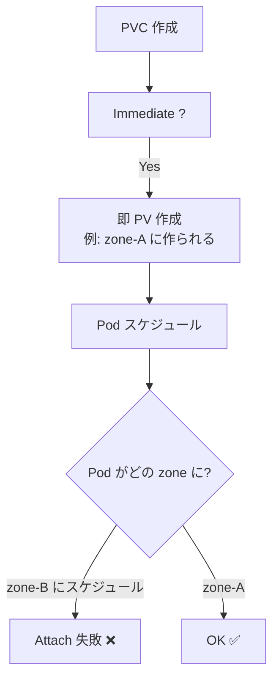
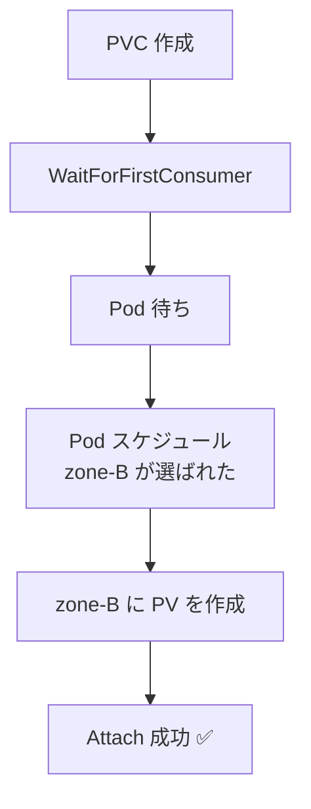
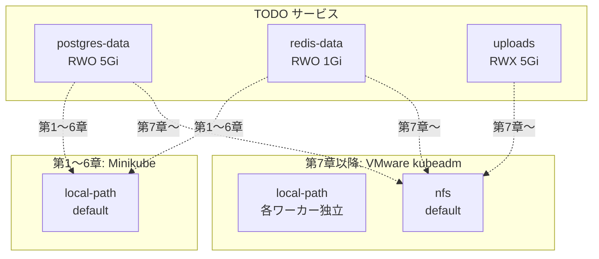
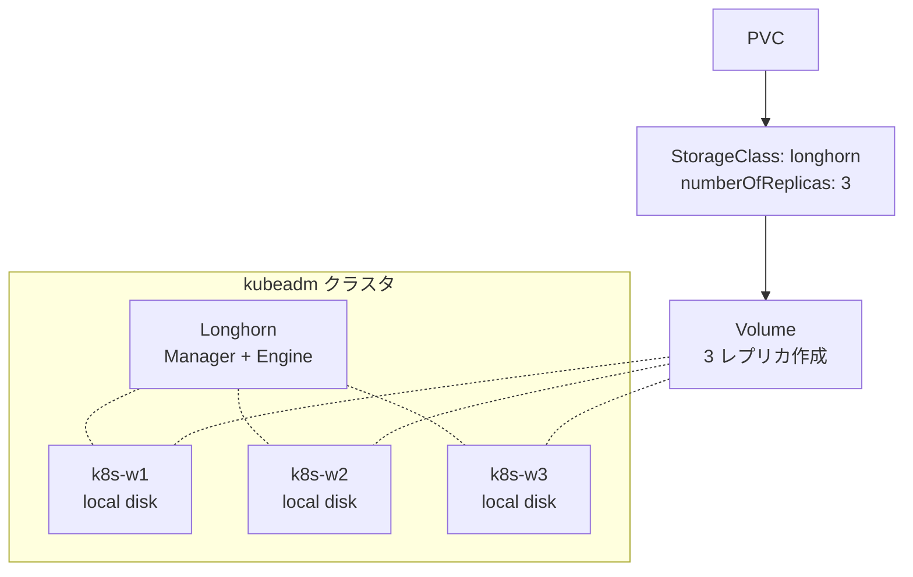
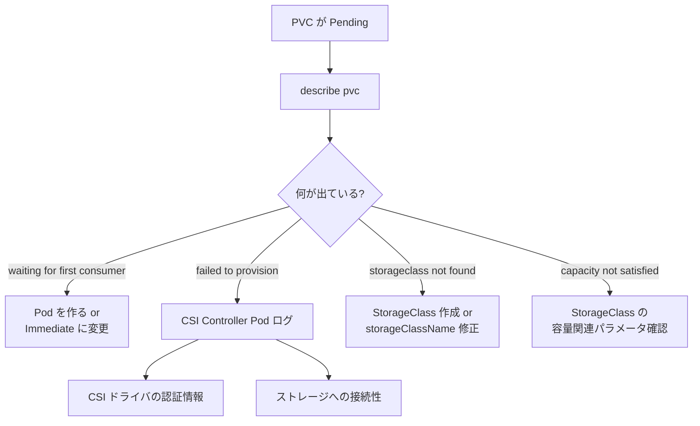

# StorageClass
{: .no_toc }

## 目次
{: .no_toc .text-delta }

1. TOC
{:toc}

---

## このページのゴール

このページを読み終えると、以下を **自分の言葉で説明できる** ようになります。

- StorageClass が動的プロビジョニングの「レシピ」として何を定義するのか
- `provisioner`、`parameters`、`reclaimPolicy`、`volumeBindingMode`、`allowVolumeExpansion`、`mountOptions`、`allowedTopologies` の各フィールドが解決する問題
- `Immediate` と `WaitForFirstConsumer` の違いと、ローカルディスク・AZ 制約環境でなぜ後者が必要か
- デフォルト StorageClass の仕組みと、複数のデフォルトが存在したらどうなるか
- 本教材で使う `local-path` と `nfs` の StorageClass を、自分でセットアップして検証できる
- StorageClass を入れ替える(マイグレーションする)ときの考慮点

---

## StorageClass の正体

**StorageClass(SC)** は、動的プロビジョニングのために **「どのストレージプロバイダで、どんなパラメータで、どんなポリシーで PV を作るか」** を定義するクラスタリソースです。

シンプルに言えば、**「PV を作るためのテンプレート」** です。

```mermaid
flowchart LR
    pvc[PVC<br>storageClassName: nfs<br>requests: 10Gi RWX] -->|Watch| sc[StorageClass: nfs<br>provisioner: nfs.csi.k8s.io<br>parameters: {server, path}]
    sc -->|provisioner 起動| prov[csi-provisioner<br>+ CSI ドライバ]
    prov --> pv[PV: pvc-xxx<br>10Gi RWX nfs]
    pv -->|Bind| pvc
```

PVC が「私はこういう特徴のストレージが欲しい」と要求すると、`storageClassName` で名指しした StorageClass が選ばれ、そのレシピに従って PV が作られます。

---

## 完全な StorageClass の例(全フィールド)

まずは「全部入り」の例を見ておきます。

```yaml
apiVersion: storage.k8s.io/v1
kind: StorageClass
metadata:
  name: nfs-prod
  annotations:
    storageclass.kubernetes.io/is-default-class: "false"
provisioner: nfs.csi.k8s.io                    # ★必須
parameters:                                    # ★ドライバ依存
  server: 192.168.56.30
  share: /export
  subDir: ${pvc.metadata.namespace}/${pvc.metadata.name}
  csi.storage.k8s.io/provisioner-secret-name: nfs-secret
  csi.storage.k8s.io/provisioner-secret-namespace: kube-system
reclaimPolicy: Retain                          # Delete | Retain
volumeBindingMode: WaitForFirstConsumer        # Immediate | WaitForFirstConsumer
allowVolumeExpansion: true
mountOptions:
- nfsvers=4.1
- hard
- timeo=600
- noatime
allowedTopologies:                              # 任意。トポロジ制約
- matchLabelExpressions:
  - key: topology.kubernetes.io/zone
    values: [zone-a, zone-b]
```

それぞれを順番に解説します。

---

## provisioner: ドライバの指名

`provisioner` フィールドは **どの CSI ドライバ(または in-tree プラグイン名)を使うか** を指定します。

代表的な値:

| 値 | ストレージ |
|----|-----------|
| `kubernetes.io/no-provisioner` | 動的プロビジョニングしない(local PV、静的 PV のみ) |
| `rancher.io/local-path` | rancher の local-path-provisioner |
| `nfs.csi.k8s.io` | NFS CSI ドライバ |
| `driver.longhorn.io` | Longhorn(分散ブロックストレージ) |
| `rook-ceph.rbd.csi.ceph.com` | Rook が管理する Ceph RBD |
| `rook-ceph.cephfs.csi.ceph.com` | Rook が管理する CephFS |
| `ebs.csi.aws.com` | AWS EBS |
| `pd.csi.storage.gke.io` | GCP Persistent Disk |
| `disk.csi.azure.com` | Azure Disk |
| `file.csi.azure.com` | Azure File |
| `vsphere.csi.vmware.com` | vSphere |
| `cinder.csi.openstack.org` | OpenStack Cinder |
| `kubernetes.io/glusterfs` | (旧)GlusterFS。今は CSI 化されている |

{: .note }
> 古い記事には `kubernetes.io/aws-ebs` や `kubernetes.io/gce-pd` のような **in-tree provisioner 名** が出てきます。
> CSI Migration によりこれらは内部的に CSI に振り替えられていますが、表面上は古い provisioner 名のままで動きます。
> **新規に書くなら CSI 名(`ebs.csi.aws.com` など)を使うのが推奨です。**

### provisioner = `kubernetes.io/no-provisioner` の意味

これは **「動的プロビジョニングはしない」という宣言** です。
local PV や、静的 PV を使うときに、StorageClass の名前は付けたいけど自動払い出しはさせたくない、というケースで使います。

```yaml
apiVersion: storage.k8s.io/v1
kind: StorageClass
metadata:
  name: local
provisioner: kubernetes.io/no-provisioner
volumeBindingMode: WaitForFirstConsumer
```

これがあると、PVC で `storageClassName: local` を指定したときに、 **手動で作った PV のうちラベルが合うものを使う** ようになります。

---

## parameters: ドライバ固有の設定

`parameters` は **ドライバごとにキーが違う**、フリーフォームの key/value マップです。

### 例: AWS EBS

```yaml
parameters:
  type: gp3                          # ボリュームタイプ
  iops: "10000"                      # IOPS(gp3 のみ)
  throughput: "500"                  # スループット MB/s
  encrypted: "true"                  # 暗号化有効
  kmsKeyId: arn:aws:kms:...:key/...  # KMS キー
  fsType: ext4                       # ファイルシステム
```

### 例: NFS CSI

```yaml
parameters:
  server: 192.168.56.30
  share: /export
  subDir: ${pvc.metadata.namespace}/${pvc.metadata.name}
  csi.storage.k8s.io/provisioner-secret-name: nfs-mount-secret
  csi.storage.k8s.io/provisioner-secret-namespace: kube-system
```

`${pvc.metadata.namespace}` のような **テンプレート変数** が使えるドライバもあります(NFS CSI、SMB CSI など)。
利用可能な変数は CSI ドライバのドキュメントで確認してください。

### 例: Longhorn

```yaml
parameters:
  numberOfReplicas: "3"             # レプリカ数
  staleReplicaTimeout: "30"
  fromBackup: ""
  fsType: ext4
  dataLocality: best-effort
```

### `csi.storage.k8s.io/...` 共通パラメータ

CSI 仕様で標準化されているキーがいくつかあります。

| キー | 意味 |
|------|------|
| `csi.storage.k8s.io/fstype` | ファイルシステムタイプ(`ext4`, `xfs`等) |
| `csi.storage.k8s.io/provisioner-secret-name` | プロビジョン時に使う Secret 名 |
| `csi.storage.k8s.io/provisioner-secret-namespace` | その Namespace |
| `csi.storage.k8s.io/node-stage-secret-name` | NodeStage 時に使う Secret |
| `csi.storage.k8s.io/node-publish-secret-name` | NodePublish 時に使う Secret |
| `csi.storage.k8s.io/controller-expand-secret-name` | リサイズ時の Secret |

ストレージ認証情報を Secret として渡したいときに使います。

---

## reclaimPolicy: 払い出された PV の運命

StorageClass で reclaimPolicy を指定すると、それによって動的プロビジョニングされた **PV の `persistentVolumeReclaimPolicy`** が初期値として設定されます。

| 値 | 動作 |
|----|------|
| `Delete` (デフォルト) | PVC 削除時に PV と物理ボリュームを削除 |
| `Retain` | PVC 削除後も PV を残す |

PV/PVC ページで詳しく扱った内容と同じですが、**StorageClass で `Retain` にしておくと、そのクラスから払い出された PV はすべて Retain** になります。
本番 DB 用のクラスを別途作って `Retain` にしておくのが定石です。

```yaml
# 例: 本番 DB 用クラス
metadata:
  name: nfs-prod-retain
parameters: {...}
reclaimPolicy: Retain
allowVolumeExpansion: true
```

```yaml
# 例: 開発用クラス
metadata:
  name: nfs-dev
parameters: {...}
reclaimPolicy: Delete
```

PVC 側で SC を選ぶことで、扱いを切り替えられます。

---

## volumeBindingMode: Bind のタイミング

これが本ページで一番重要なフィールドです。

| 値 | 動作 |
|----|------|
| `Immediate` (デフォルト) | PVC が作られた瞬間に PV をプロビジョニング |
| `WaitForFirstConsumer` | Pod がスケジュールされた後に PV をプロビジョニング |

### Immediate の問題

Immediate モードだと、

1. PVC 作成
2. すぐ PV を作る → クラウドの場合、特定の AZ にボリュームが作られる
3. 後で Pod がスケジュールされるとき、その PV がある AZ にしか配置できない
4. でもスケジューラはまだ PV のことを知らないので、別の AZ に Pod を置こうとする
5. **Pod が起動できない**



### WaitForFirstConsumer の解決



**Pod のスケジュール先が決まってから PV を作る** ので、必ず一致します。

### WFC が必須なケース

- **ローカル PV(local PV)** ─ Pod とディスクを同じノードに配置する必要
- **AZ/Zone 制約のあるクラウドストレージ** ─ EBS、GCE PD など
- **トポロジ認識ドライバ** ─ ノードのスペック(SSD/HDD、CPU)で PV の作り場所を変えたい

### Immediate のままで良いケース

- **NFS のような場所を選ばないストレージ** ─ どのノードからもアクセスできる
- **検証環境** ─ 厳密なトポロジ制御を要しない

実用上、ほとんどのケースで `WaitForFirstConsumer` を選んでおくのが無難です。

---

## allowVolumeExpansion: 容量を後から増やせるか

`true` にすると、PVC を編集して容量を増やせるようになります。

```yaml
allowVolumeExpansion: true
```

### リサイズ手順

```bash
# 1. PVC の容量を編集
kubectl edit pvc postgres-data
# spec.resources.requests.storage を 5Gi → 20Gi に

# 2. 確認
kubectl get pvc postgres-data
# CAPACITY 列がまだ 5Gi のままかもしれない(プロビジョナ処理中)

# 3. ファイルシステム拡張のため Pod を再起動
kubectl delete pod postgres-0

# 4. 確認
kubectl exec -it postgres-0 -- df -h /var/lib/postgresql/data
# 20Gi になっている
```

### オンライン vs オフラインリサイズ

| 種類 | 説明 | 対応ドライバ |
|------|------|--------------|
| オフラインリサイズ | Pod を再起動しないとファイルシステムが拡張されない | 多くのドライバ |
| オンラインリサイズ | Pod を停止せず拡張できる | EBS、Longhorn など最近のもの |

オンラインリサイズができるかは CSI ドライバのドキュメントを確認してください。

### 縮小はできない

**容量を減らすことは Kubernetes の仕様上できません**。
減らしたい場合は、

1. 新しい小さい PVC を作る
2. データを移行する
3. 古い PVC を消す

という手順が必要です。
これは「容量を減らすとデータが壊れる可能性がある」ことから来る安全策です。

---

## mountOptions: マウント時のフラグ

NFS の `nfsvers=4.1` のような、ファイルシステム / プロトコル固有のマウントオプションを指定します。

```yaml
mountOptions:
- nfsvers=4.1
- hard
- timeo=600
- noatime
```

ただし、ストレージドライバがこのオプションを尊重するかどうかは実装依存です。
sample of the things that fail silently: 効かないオプションを指定しても警告が出ないことがあります。
実際に確認する方法:

```bash
kubectl exec -it <pod> -- mount | grep <mount-path>
# オプションが反映されているか確認
```

### よく使うマウントオプション

NFS:

- `hard` ─ サーバ落ちたら無限待ち。**本番推奨**
- `soft` ─ I/O エラーで返す。データ整合性が下がるので非推奨
- `nfsvers=4.1` ─ プロトコルバージョン
- `noatime` ─ アクセス時刻更新を抑制(性能改善)
- `nodiratime` ─ ディレクトリのアクセス時刻も抑制
- `rsize=` / `wsize=` ─ 読み書きブロックサイズ(1048576 など)

ext4 / xfs:

- `noatime` ─ アクセス時刻抑制
- `defaults` ─ rw,suid,dev,exec,auto,nouser,async

---

## allowedTopologies: トポロジ制約

「この StorageClass は zone-a と zone-b でだけ使える」という制約を付けます。

```yaml
allowedTopologies:
- matchLabelExpressions:
  - key: topology.kubernetes.io/zone
    values: [zone-a, zone-b]
```

クラウド環境で使うことが多く、ローカル環境ではあまり使いません。
ただ kubeadm 環境でも、特定ラックのストレージだけを使う、という制約は付けられます。

---

## デフォルト StorageClass

PVC で `storageClassName` を省略したときに使われる StorageClass を **デフォルト SC** と呼びます。

```yaml
metadata:
  name: standard
  annotations:
    storageclass.kubernetes.io/is-default-class: "true"
```

このアノテーションを **`"true"`** にしておくと、その SC がデフォルトになります。

### デフォルト SC の確認

```bash
kubectl get storageclass
NAME                 PROVISIONER                RECLAIMPOLICY   VOLUMEBINDINGMODE
local-path (default) rancher.io/local-path      Delete          WaitForFirstConsumer
nfs                  nfs.csi.k8s.io             Retain          WaitForFirstConsumer
```

`NAME` に `(default)` が付いているのがデフォルト SC です。

### デフォルト切り替え

```bash
# 既存 default を外す
kubectl patch storageclass local-path -p \
  '{"metadata":{"annotations":{"storageclass.kubernetes.io/is-default-class":"false"}}}'

# 別の SC をデフォルトに
kubectl patch storageclass nfs -p \
  '{"metadata":{"annotations":{"storageclass.kubernetes.io/is-default-class":"true"}}}'
```

### 複数のデフォルト SC が存在したら

実は、**複数の SC に default アノテーションを付けることもできてしまいます**。
v1.26 までは、その場合の挙動は「PVC 作成が拒否される」でした。
v1.26 以降は **「最も新しく作られたデフォルト SC」** が選ばれます(<https://kubernetes.io/docs/concepts/storage/storage-classes/#default-storageclass>)。

ただしこれに頼るのは事故のもとです。**default は 1 つだけ** にしましょう。

### デフォルト SC が無い場合

PVC で `storageClassName` を省略すると、PVC は永遠に Pending のままです。
明示的に `storageClassName: ""` と書けば、「動的プロビジョニングを使わない」モードになります。

| `storageClassName` | 意味 |
|--------------------|------|
| 未指定(フィールドなし) | デフォルト SC を使う |
| `""`(空文字) | 動的プロビジョニング無効。静的 PV のみマッチ |
| `"foo"`(文字列) | `foo` という SC を使う |

---

## CSI ドライバのインストール: Minikube 編

Minikube ではデフォルトで `standard` SC が用意されていますが、教材で使う `local-path` をインストールしてみましょう。

```bash
# rancher local-path-provisioner のインストール
kubectl apply -f https://raw.githubusercontent.com/rancher/local-path-provisioner/master/deploy/local-path-storage.yaml

# 確認
kubectl get pods -n local-path-storage
# local-path-provisioner-xxxxx     1/1     Running

kubectl get storageclass
# local-path     rancher.io/local-path    Delete   WaitForFirstConsumer
# standard (default) k8s.io/minikube-hostpath ...
```

local-path をデフォルトに変更:

```bash
kubectl patch storageclass standard -p \
  '{"metadata":{"annotations":{"storageclass.kubernetes.io/is-default-class":"false"}}}'
kubectl patch storageclass local-path -p \
  '{"metadata":{"annotations":{"storageclass.kubernetes.io/is-default-class":"true"}}}'
```

### 動作確認

```yaml
apiVersion: v1
kind: PersistentVolumeClaim
metadata:
  name: test-pvc
spec:
  accessModes: [ReadWriteOnce]
  resources:
    requests:
      storage: 1Gi
```

```bash
kubectl apply -f test-pvc.yaml
kubectl get pvc
# test-pvc    Pending                  local-path
# 注: WaitForFirstConsumer なので Pending のまま
```

```yaml
apiVersion: v1
kind: Pod
metadata:
  name: test-pod
spec:
  containers:
  - name: app
    image: alpine:3.20
    command: ["sleep", "3600"]
    volumeMounts:
    - name: data
      mountPath: /data
  volumes:
  - name: data
    persistentVolumeClaim:
      claimName: test-pvc
```

```bash
kubectl apply -f test-pod.yaml
kubectl get pvc
# test-pvc    Bound    pvc-abc...    1Gi    RWO    local-path

kubectl exec -it test-pod -- df -h /data
```

---

## CSI ドライバのインストール: kubeadm 環境向け NFS CSI

VMware kubeadm 環境では `k8s-nfs` ノードを NFS サーバとして使います。
NFS CSI ドライバを Helm で入れます。

### 1. NFS サーバ側の設定

```bash
# k8s-nfs にて
sudo apt update
sudo apt install -y nfs-kernel-server
sudo mkdir -p /export
sudo chown -R nobody:nogroup /export
sudo chmod 0777 /export

# /etc/exports
echo '/export 192.168.56.0/24(rw,sync,no_subtree_check,no_root_squash,fsid=0)' | \
  sudo tee /etc/exports

sudo systemctl enable --now nfs-kernel-server
sudo exportfs -ra

# 動作確認
showmount -e localhost
# Export list for localhost:
# /export 192.168.56.0/24
```

### 2. ワーカーノード側の準備

すべてのワーカー(`k8s-w1`〜`k8s-w3`)で:

```bash
sudo apt install -y nfs-common

# 手動マウントテスト
sudo mkdir /mnt/test-nfs
sudo mount -t nfs 192.168.56.30:/export /mnt/test-nfs
ls /mnt/test-nfs
sudo umount /mnt/test-nfs
```

### 3. CSI ドライバのインストール

```bash
helm repo add csi-driver-nfs https://raw.githubusercontent.com/kubernetes-csi/csi-driver-nfs/master/charts
helm repo update

helm install csi-driver-nfs csi-driver-nfs/csi-driver-nfs \
  --namespace kube-system \
  --version v4.7.0
```

### 4. 確認

```bash
kubectl get pods -n kube-system -l app.kubernetes.io/name=csi-driver-nfs
# csi-nfs-controller-...     4/4     Running
# csi-nfs-node-...           3/3     Running    (各ワーカーに 1 つ)

kubectl get csidriver
# NAME                ATTACHREQUIRED   ...
# nfs.csi.k8s.io      false            ...
```

### 5. StorageClass を作る

```yaml
apiVersion: storage.k8s.io/v1
kind: StorageClass
metadata:
  name: nfs
  annotations:
    storageclass.kubernetes.io/is-default-class: "true"
provisioner: nfs.csi.k8s.io
parameters:
  server: 192.168.56.30
  share: /export
  subDir: ${pvc.metadata.namespace}-${pvc.metadata.name}
mountOptions:
- nfsvers=4.1
- hard
- timeo=600
- noatime
reclaimPolicy: Retain
volumeBindingMode: Immediate
allowVolumeExpansion: true
```

### 6. 動作確認

```bash
kubectl apply -f nfs-sc.yaml

# テスト用 PVC
cat <<EOF | kubectl apply -f -
apiVersion: v1
kind: PersistentVolumeClaim
metadata:
  name: nfs-test
spec:
  accessModes: [ReadWriteMany]
  resources:
    requests:
      storage: 1Gi
EOF

kubectl get pvc nfs-test
# nfs-test    Bound    pvc-xxx    1Gi    RWX    nfs

# k8s-nfs サーバ側で確認
ssh k8s-nfs ls /export/
# default-nfs-test  (PVC 名に基づくサブディレクトリ)
```

---

## 本教材で使う 2 系統の StorageClass



| StorageClass | プロビジョナ | 用途 | アクセスモード |
|--------------|--------------|------|----------------|
| `local-path` | rancher.io/local-path | 単一ノード環境用、低レイテンシ | RWO のみ |
| `nfs` | nfs.csi.k8s.io | マルチノード環境用、共有ストレージ | RWO / RWX |
| `standard` | k8s.io/minikube-hostpath | Minikube 既定 | RWO のみ |

---

## より高度な選択肢: Longhorn

ローカル環境で「分散ブロックストレージ + スナップショット + バックアップ」が欲しい場合は **Longhorn** が有力候補です。



特徴:

- 各ノードのローカルディスクを集めて分散ストレージにする
- **スナップショット**(Volume Snapshot CRD 対応)
- **バックアップ**(S3 / NFS 互換にバックアップ)
- **災害復旧**
- Web UI 付き

インストール:

```bash
helm repo add longhorn https://charts.longhorn.io
helm install longhorn longhorn/longhorn \
  --namespace longhorn-system \
  --create-namespace \
  --version 1.7.1
```

ただし、

- 各ノードに iSCSI 環境が必要(`open-iscsi` パッケージ)
- メモリと CPU を意外に消費する(Manager / Engine プロセス)
- 学習教材としては Longhorn まで踏み込まなくても十分

なので本教材では発展課題としての紹介に留めます。

---

## トラブルシューティング

### 症状 A: `provisioner-secret-name not found`

```bash
kubectl describe pvc postgres-data
# Warning  ProvisioningFailed ... secret "xxx" not found
```

`parameters` に書いた Secret が無い、または Namespace が違う。

```bash
kubectl get secret -n kube-system | grep nfs
```

### 症状 B: PV ができたが `Bound` にならず `Available` のまま

PVC とのマッチング条件のいずれかが合っていない。

```bash
kubectl describe pv <pv-name>
kubectl describe pvc <pvc-name>
```

容量、accessModes、storageClassName、selector を 1 つずつ突き合わせます。

### 症状 C: `volume mount failed: ... no such device`

NFS の場合、ワーカーノードに `nfs-common` が入っていない可能性あり。

```bash
ssh k8s-w1 dpkg -l | grep nfs-common
```

EBS や iSCSI の場合は、対応するクライアントツール(`open-iscsi` など)が必要です。

### 症状 D: `volume capacity` が PVC の要求より少なくなる

`subDir` の使い方に注意。NFS で「共有内のサブディレクトリ」を切り出して PV にしている場合、容量制限は **NFS サーバ側のクォータでしか効きません**。
Kubernetes の `capacity` は単なる目安です。

### 症状 E: 既存 PVC の容量を増やせない

```
Forbidden: spec.resources.requests.storage: field is immutable when StorageClass disallows volume expansion
```

`allowVolumeExpansion: false`(または未指定)になっている。
StorageClass を編集して `true` にする。
ただし **既存の PV にはすぐには反映されない場合がある**(プロビジョナ実装による)。

### デバッグフロー



---

## ハンズオン: StorageClass を切り替える

### 1. 現状確認

```bash
kubectl get sc
# standard (default)   k8s.io/minikube-hostpath  Delete  Immediate
# local-path           rancher.io/local-path     Delete  WaitForFirstConsumer
```

### 2. ストレージクラス間の挙動比較

両方の SC で同じスペックの PVC を作って違いを確認します。

```yaml
apiVersion: v1
kind: PersistentVolumeClaim
metadata:
  name: pvc-standard
spec:
  storageClassName: standard
  accessModes: [ReadWriteOnce]
  resources:
    requests: {storage: 1Gi}
---
apiVersion: v1
kind: PersistentVolumeClaim
metadata:
  name: pvc-local-path
spec:
  storageClassName: local-path
  accessModes: [ReadWriteOnce]
  resources:
    requests: {storage: 1Gi}
```

```bash
kubectl apply -f compare-pvc.yaml
kubectl get pvc
# pvc-standard      Bound       pvc-...   1Gi   RWO   standard       (Immediate)
# pvc-local-path    Pending                              local-path  (WaitForFirstConsumer)
```

`Immediate` モードはすぐ Bound に、`WaitForFirstConsumer` モードは Pod 待ち、という違いがはっきり見えます。

### 3. local-path の格納場所を確認

```bash
kubectl get pv $(kubectl get pvc pvc-standard -o jsonpath='{.spec.volumeName}') -o yaml | grep path
# path: /tmp/hostpath-provisioner/...
```

実体は `/tmp/hostpath-provisioner/<namespace>/<pvc-name>/` の下にあります。

---

## ハンズオン: WaitForFirstConsumer の効果を見る

```yaml
apiVersion: v1
kind: PersistentVolumeClaim
metadata:
  name: wfc-pvc
spec:
  storageClassName: local-path
  accessModes: [ReadWriteOnce]
  resources:
    requests: {storage: 1Gi}
```

```bash
kubectl apply -f wfc-pvc.yaml

kubectl get pvc wfc-pvc
# STATUS: Pending

kubectl describe pvc wfc-pvc
# Events:
#   Normal  WaitForFirstConsumer  ...  waiting for first consumer to be created
```

PV はまだ作られていません:

```bash
kubectl get pv | grep wfc
# (出力なし)
```

ここで Pod を作ると:

```yaml
apiVersion: v1
kind: Pod
metadata:
  name: wfc-pod
spec:
  containers:
  - name: app
    image: alpine:3.20
    command: ["sleep", "3600"]
    volumeMounts:
    - name: data
      mountPath: /data
  volumes:
  - name: data
    persistentVolumeClaim:
      claimName: wfc-pvc
```

```bash
kubectl apply -f wfc-pod.yaml
kubectl get pvc wfc-pvc
# Bound!  PV が作成されている
```

Pod スケジューリングと同時に PV が作られたことが確認できます。

---

## 代替手法・類似機能の比較

「動的にストレージを払い出す」需要に対する選択肢:

| 手法 | 動的払い出し | スナップショット | リサイズ | 多ノード共有 | 学習コスト |
|------|-------------|------------------|----------|-------------|------------|
| local-path | ✅ | ❌ | △ | ❌ | 低 |
| NFS-CSI | ✅ | ドライバ依存 | ✅ | ✅ (RWX) | 中 |
| Longhorn | ✅ | ✅ | ✅ | ✅ (RWX) | 中〜高 |
| Rook/Ceph | ✅ | ✅ | ✅ | ✅ | 高 |
| Manual PV(静的) | ❌ | ❌ | △ | △ | 低 |
| 外部マネージド DB | ─ | ─ | ─ | ─ | 設計次第 |

---

## 本番運用での注意点

1. **`Retain` ポリシーの SC を本番 DB 用に用意する**

2. **`allowVolumeExpansion: true` を最初から設定する**
   後から SC を変更しても、既存 PVC のリサイズは効かないことがある

3. **`volumeBindingMode: WaitForFirstConsumer` をデフォルトに**
   トポロジ問題を未然に防ぐ

4. **複数の SC 名を deprecated にしない計画**
   `gp2` のような古い SC を消すと、それを参照している既存 PVC が孤立する。リネームが必要なら最低 1 リリース猶予を持って移行

5. **CSI ドライバのアップグレードは事前検証**
   CSI ドライバのバージョンアップで `parameters` の互換が変わることがある

6. **`csi-provisioner` Pod の HA**
   StatefulSet の数が少ないクラスタでもプロビジョニングが必要なときに動いてないと困る。Deployment は最低 2 レプリカに

7. **ストレージ専用ノードの分離**
   分散ストレージ(Longhorn、Ceph)を使うなら、専用ノードプールを設けるのが本筋

8. **モニタリング**
   `kube_persistentvolumeclaim_status_phase` メトリクスで Pending を継続検知
   `kube_persistentvolume_status_phase` で Released を検知(Retain で残ったもの)

---

## チェックポイント

ここまでで以下を **自分の言葉で** 説明できるか確認してください。

- [ ] StorageClass の `provisioner` と `parameters` の役割を区別して説明できる
- [ ] `volumeBindingMode: WaitForFirstConsumer` が必要な場面を、トポロジ制約の文脈で説明できる
- [ ] `allowVolumeExpansion` と、容量縮小ができない理由を説明できる
- [ ] デフォルト StorageClass の指定方法と、複数の default が存在した場合の挙動を述べられる
- [ ] `storageClassName` を「未指定」「`""`」「文字列」と書いた場合のそれぞれの挙動を区別できる
- [ ] `reclaimPolicy: Retain` を本番で使うシーンを SC 単位で設計できる
- [ ] CSI ドライバが `Controller` と `Node` の Pod に分かれている理由を説明できる

→ 次は [ステートフル運用の実例]({{ '/05-storage/stateful-storage/' | relative_url }})
