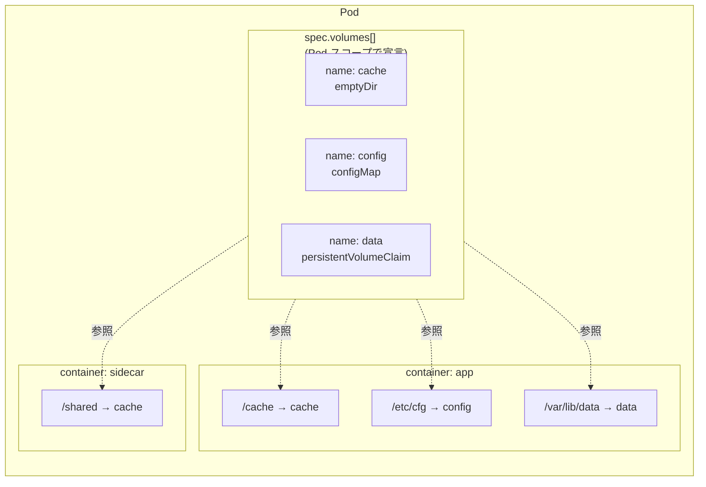
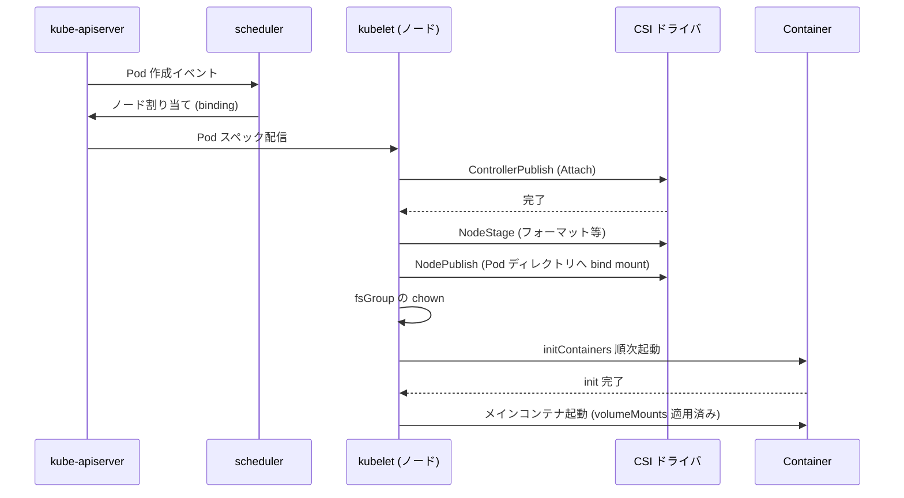
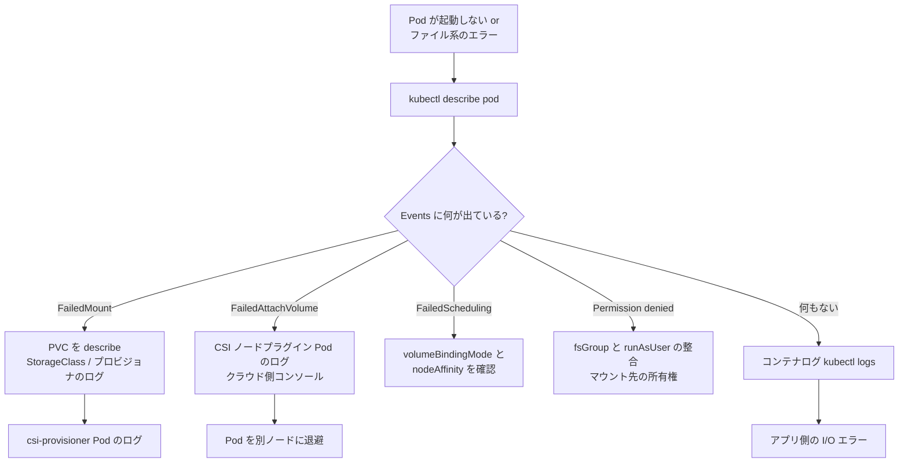

# Volume
{: .no_toc }

## 目次
{: .no_toc .text-delta }

1. TOC
{:toc}

---

## このページのゴール

このページを読み終えると、以下を **自分の言葉で説明できる** ようになります。

- Kubernetes における Volume が何を抽象化していて、Docker Volume とどう違うか
- `emptyDir` / `hostPath` / `configMap` / `secret` / `projected` / `downwardAPI` / `persistentVolumeClaim` / `image` / `ephemeral` などの主要な Volume 種別の使いどころ
- `volumeMounts` の `subPath` / `subPathExpr` / `readOnly` / `mountPropagation` がそれぞれ解決している実問題
- `hostPath` を本番で使ってはいけない技術的・運用的な理由を 5 つ以上
- Pod 起動時の Volume マウント順序と、`fsGroup` がいつ効くか
- マウントが失敗したときの調査の進め方(`Events`、`mount` コマンド、`csi-node` ログ)

---

## Volume とは何か

Kubernetes の **Volume** は、**Pod の中で複数のコンテナが共有できるディレクトリ抽象** です。
Pod の YAML では次の 2 箇所で扱います。

1. `spec.volumes[]` ─ 「この Pod では、こういう名前でこういう実体のディレクトリを使えるようにしておく」と宣言する
2. `spec.containers[].volumeMounts[]` ─ 「上で宣言した Volume を、このコンテナのこのパスにマウントする」と紐付ける



この **「ボリュームは Pod に属する。コンテナはそれをマウントする」** という関係が重要です。
言い換えると、**Volume の寿命は最低でも Pod と同じ** であり、コンテナが再起動しても Volume の中身は失われません(Volume の種類によってはそれ以上長生きします)。

### Docker Volume との違い

Docker をすでに使っている人は「`docker run -v` と何が違うのか?」と思うはずです。
答えは大きく 2 つあります。

| 観点 | Docker Volume | Kubernetes Volume |
|------|---------------|--------------------|
| スコープ | コンテナ単位 | Pod 単位(複数コンテナで共有) |
| 種類 | bind mount / named volume / tmpfs | emptyDir / hostPath / configMap / secret / PVC / CSI / projected / ephemeral など |
| 設定情報の注入 | `--mount` や `-v` でファイルを渡す | ConfigMap / Secret を Volume として直接マウント可能 |
| 永続性の管理 | 別途 `docker volume create` | PV / PVC / StorageClass で一元管理 |
| 環境差吸収 | 各環境で `docker-compose.yml` を書き換え | Volume の宣言と実体を分離(StorageClass) |

特に「**ConfigMap や Secret を Volume として扱える**」「**PVC を経由してクラウド/ストレージシステムを抽象化できる**」の 2 点は Docker にはない強みです。

---

## なぜこの設計になったのか(歴史)

Kubernetes の Volume という抽象は、Borg(Google 内部のオーケストレータ)で長年使われていた `Volume` 概念をベースにしています。
初期の Kubernetes(v1.0、2015年)時点では、`emptyDir` / `hostPath` / `gcePersistentDisk` / `awsElasticBlockStore` / `nfs` / `iscsi` / `glusterfs` / `rbd` / `gitRepo` / `secret` などが **すべてコア実装としてバンドル** されていました。

時系列で大きな出来事を追うと、

- **2015** ─ v1.0 リリース。Volume と PersistentVolume は別概念として誕生。
- **2016** ─ ConfigMap が GA(v1.2)。Secret は v1.0 から存在したが、ConfigMap によって設定ファイルの注入が一般化。
- **2017** ─ FlexVolume 登場。サードパーティのストレージプラグインを扱える土台に。
- **2018** ─ CSI が GA(v1.13)。in-tree からの脱却が始まる。
- **2018** ─ `projected` Volume が Beta (v1.11)、 `serviceAccountToken` プロジェクションが GA (v1.12)。
- **2019** ─ Generic Ephemeral Volumes Alpha (v1.19)、その後 GA (v1.23)。
- **2020〜** ─ CSI Migration により in-tree のクラウドプロバイダ実装が CSI に置換。
- **2024** ─ Image Volume が Alpha (v1.31)。OCI イメージを直接 Volume としてマウントできるように。

{: .note }
> 古いブログ記事に出てくる `gitRepo` Volume は v1.11 で deprecated、CSI Migration の流れで完全に廃止されました。
> 現在は initContainer で `git clone` するか、Argo CD などの GitOps ツールを使うのが定石です。

---

## Volume の種類: 全体マップ

種類が多くて頭が混乱しがちなので、まず **「データの寿命」** で整理します。

```mermaid
flowchart TB
    subgraph A["寿命: コンテナと同じ"]
        none[(コンテナの<br>writable layer)]
    end
    subgraph B["寿命: Pod と同じ"]
        ed[emptyDir]
        cm[configMap]
        sec[secret]
        proj[projected]
        dwn[downwardAPI]
        img[image (新)]
        ephCsi[CSI ephemeral]
        ephGen[generic ephemeral]
    end
    subgraph C["寿命: Pod を超える"]
        pvc[persistentVolumeClaim]
        hp[hostPath]
        local[local PV]
    end
```

「寿命」と「特徴」を一覧にしたのが次の表です。

| 種類 | 寿命 | 主な用途 | 注意点 |
|------|------|----------|--------|
| `emptyDir` | Pod 削除で消える | コンテナ間共有、テンポラリ、一時キャッシュ | Pod が消えたら全部消える |
| `hostPath` | ノードのファイルシステム | DaemonSet からノード情報を読む | 本番では原則使用禁止 |
| `configMap` | Pod と同じ(設定の写し) | 設定ファイルの注入 | サイズ制限 1 MiB |
| `secret` | Pod と同じ(機密の写し) | 証明書、API キー | tmpfs に展開される |
| `projected` | Pod と同じ | 複数の ConfigMap / Secret / SA Token を 1 ディレクトリにまとめる | サブパス指定が肝 |
| `downwardAPI` | Pod と同じ | Pod 自身のメタ情報をファイルとして渡す | 環境変数版もある |
| `persistentVolumeClaim` | PVC 寿命(=Namespace と同じか PV ポリシー次第) | データベースなど永続が必要なもの | 別ページで詳述 |
| `csi (inline)` | Pod と同じ | CSI ドライバを直接インライン参照 | Secret 用途中心 |
| `ephemeral (generic)` | Pod と同じ | PVC 相当を Pod 仕様内で完結させたいとき | StorageClass を指定可 |
| `image` (v1.31〜) | Pod と同じ | OCI イメージを read-only で Volume マウント | Alpha 機能 |
| `nfs`, `iscsi`, `cephfs` ほか | クラスタ寿命 | レガシー in-tree。今は CSI 推奨 | 新規利用は非推奨 |

以下、初心者がよく使うものから順に深掘りしていきます。

---

## emptyDir: 最もシンプルな Volume

`emptyDir` は、その名のとおり **「Pod が割り当てられたノード上に、空のディレクトリを 1 つ作る」** だけの Volume です。

```yaml
apiVersion: v1
kind: Pod
metadata:
  name: cache-demo
spec:
  containers:
  - name: app
    image: nginx:1.27
    volumeMounts:
    - name: cache
      mountPath: /var/cache/app
  volumes:
  - name: cache
    emptyDir: {}
```

### emptyDir の主要フィールド

| フィールド | 型 | デフォルト | 意味 |
|-----------|-----|-----------|------|
| `medium` | string | `""` (ノードのデフォルト = ディスク) | `Memory` を指定すると tmpfs(メモリ上)に作成 |
| `sizeLimit` | Quantity | なし(=ノード容量まで) | このボリュームが使える上限。超えると Pod が evict される |

### medium: Memory の意味

`medium: Memory` を指定すると **tmpfs(RAM 上のファイルシステム)** にディレクトリが作られます。

```yaml
volumes:
- name: ramcache
  emptyDir:
    medium: Memory
    sizeLimit: 256Mi
```

- メリット: ディスク I/O が発生しないので超高速
- デメリット: その容量分が **コンテナのメモリ使用量に算入される**(`memory.limit` を圧迫する)
- 注意: 機密情報を保持するために `tmpfs` を使うパターン(swap されにくい)もある

{: .warning }
> `medium: Memory` の `sizeLimit` を超えて書き込むと、ファイルシステムが満杯になって ENOSPC が返ります。
> アプリ側でハンドリングしないとクラッシュします。

### sizeLimit の挙動

`sizeLimit` を指定すると、kubelet が定期的にディスク使用量を監視し、超過した場合は **Pod を evict** します。
ただしリアルタイムの強制ではないので、書き込み中に瞬間的に超えることは起こり得ます。

```bash
kubectl get events --field-selector reason=Evicted
```

### emptyDir の典型ユースケース

#### 1. サイドカー間のファイル共有

```yaml
spec:
  volumes:
  - name: logs
    emptyDir: {}
  containers:
  - name: app
    image: my-app:1.0
    volumeMounts:
    - name: logs
      mountPath: /var/log/app
  - name: log-shipper
    image: fluent/fluent-bit:3.0
    volumeMounts:
    - name: logs
      mountPath: /var/log/app
      readOnly: true
```

「アプリがログをファイルに書き、サイドカーがそれを読んで送る」というパターン。

#### 2. ビルドアーティファクトの中継

initContainer がデータをダウンロード → メインコンテナがそれを使う、というパターン。

```yaml
spec:
  volumes:
  - name: assets
    emptyDir: {}
  initContainers:
  - name: fetch
    image: alpine:3.20
    command: ["sh", "-c", "wget -O /assets/data.bin https://example.com/data.bin"]
    volumeMounts:
    - name: assets
      mountPath: /assets
  containers:
  - name: server
    image: my-server:1.0
    volumeMounts:
    - name: assets
      mountPath: /opt/assets
      readOnly: true
```

#### 3. テンポラリのスクラッチ領域

ImageMagick や ffmpeg などの一時ファイルを書く場所。

```yaml
volumes:
- name: scratch
  emptyDir:
    sizeLimit: 5Gi
```

### emptyDir の格納場所

ノードの中での実体はどこにあるかというと、

```
/var/lib/kubelet/pods/<pod-uid>/volumes/kubernetes.io~empty-dir/<volume-name>/
```

です。デバッグするときは Pod の UID を `kubectl get pod <name> -o jsonpath='{.metadata.uid}'` で取って、ノードに SSH して中を見ると確認できます。

---

## hostPath: ノードのファイルシステムを直接マウント

`hostPath` は **「ノード自身のファイルシステムの特定パスを Pod にマウントする」** Volume です。

```yaml
volumes:
- name: docker-sock
  hostPath:
    path: /var/run/docker.sock
    type: Socket
```

### type の値と意味

`hostPath.type` は、マウント前にパスが何であるべきかを宣言します。
ここを正しく書かないと予期せぬ挙動になるので必ず指定してください。

| `type` | パスがない場合 | パスが期待と違う場合 |
|--------|----------------|---------------------|
| `""` (空) | 何もしない(不存在でも OK) | 何もチェックしない(危険) |
| `DirectoryOrCreate` | `0755` で作成 | ディレクトリでなければエラー |
| `Directory` | エラー | ディレクトリでなければエラー |
| `FileOrCreate` | 空ファイル作成(`0644`) | ファイルでなければエラー |
| `File` | エラー | ファイルでなければエラー |
| `Socket` | エラー | UNIX ソケットでなければエラー |
| `CharDevice` | エラー | キャラクタデバイスでなければエラー |
| `BlockDevice` | エラー | ブロックデバイスでなければエラー |

### hostPath が本番で禁忌な 5 つの理由

{: .warning }
> hostPath は **本番ワークロードでの利用は原則禁止**です。
> 例外は DaemonSet による「ノードの何かを観測する」用途だけと考えてください。

1. **Pod がノードに強く紐付く**
   別ノードに再スケジュールされると、そのノードに同じパスがあるとは限らない(あっても中身が違う)ためデータ整合性が壊れる。

2. **ノード上のファイルパーミッションに依存する**
   コンテナが root で動いていれば書けるが、`runAsNonRoot: true` だと書けないことが多い。逆に root 動作を許すとセキュリティ的に最悪。

3. **PSA / Pod Security の `restricted` プロファイルで禁止される**
   Kubernetes の標準ポリシーで `hostPath` は `baseline` でも禁止対象。`privileged` プロファイルでしか許可されない。

4. **コンテナエスケープのリスク**
   `/etc` や `/var/lib/kubelet`、`/var/run/docker.sock` をマウントできてしまうと、コンテナ内からノードを乗っ取れる(`docker.sock` をマウントすれば、コンテナ内から別の特権コンテナを起動できる)。

5. **マルチノードでの一貫性が保てない**
   3 ノードに同じ Deployment を配置しても、各ノードの `/var/log` の中身は別物。「データを共有しているつもり」のバグが起きる。

### 例外: ノード観測 DaemonSet での利用

それでも `hostPath` が必要なケースはあります。
代表は `node-exporter`(Prometheus のノードメトリクス取得 DaemonSet)です。

```yaml
spec:
  containers:
  - name: node-exporter
    image: prom/node-exporter:v1.8.0
    args:
    - --path.rootfs=/host
    securityContext:
      runAsNonRoot: true
      runAsUser: 65534
    volumeMounts:
    - name: rootfs
      mountPath: /host
      readOnly: true
      mountPropagation: HostToContainer
  hostNetwork: true
  hostPID: true
  volumes:
  - name: rootfs
    hostPath:
      path: /
      type: Directory
```

ポイントは、

- **必ず `readOnly: true`** にすること(書き換え不可にして影響を最小化)
- `mountPropagation: HostToContainer` でノード側でのマウント変化を Pod に伝播させること
- DaemonSet として全ノードに 1 つずつ配置すること

---

## configMap: 設定ファイルとしてマウント

ConfigMap は別章(第 6 章)で詳しく扱いますが、Volume として使うパターンだけここで触れます。

```yaml
apiVersion: v1
kind: ConfigMap
metadata:
  name: nginx-config
data:
  nginx.conf: |
    server {
      listen 80;
      server_name _;
      location / { return 200 "hello\n"; }
    }
  mime.types: |
    text/html  html;
    text/plain txt;
---
apiVersion: v1
kind: Pod
metadata:
  name: web
spec:
  containers:
  - name: nginx
    image: nginx:1.27
    volumeMounts:
    - name: cfg
      mountPath: /etc/nginx/conf.d/nginx.conf
      subPath: nginx.conf      # ★この 1 行が重要
  volumes:
  - name: cfg
    configMap:
      name: nginx-config
      defaultMode: 0644
      items:
      - key: nginx.conf
        path: nginx.conf
        mode: 0644
```

### ConfigMap マウントの主要フィールド

| フィールド | 意味 |
|-----------|------|
| `name` | マウントする ConfigMap の名前 |
| `items[]` | 全キーではなく、特定キーだけを別ファイル名で出したいとき |
| `defaultMode` | パーミッション(8 進数)。`items` で個別指定もできる |
| `optional` | ConfigMap が存在しなくてもエラーにせず空でマウント |

### subPath の罠

`subPath` を使わないと、`/etc/nginx/conf.d/` ディレクトリ自体が ConfigMap で **上書き** されてしまい、もともとあったファイルが消えます。
ConfigMap の単一ファイルだけを差し込みたいときは必ず `subPath` を使ってください。

ただし `subPath` には大きなトレードオフがあります。

{: .warning }
> **`subPath` を使うと ConfigMap の自動更新が効かなくなります。**
> 通常は ConfigMap を `kubectl edit` すると数十秒以内に Pod 内のファイルも更新されますが、`subPath` でマウントしたファイルは更新されません。
> Pod の再起動が必要です。

### subPathExpr (Pod 情報を埋め込む)

`subPath` は静的な文字列ですが、`subPathExpr` を使うと **環境変数を展開** できます。

```yaml
env:
- name: POD_NAME
  valueFrom:
    fieldRef:
      fieldPath: metadata.name
volumeMounts:
- name: logs
  mountPath: /var/log/app
  subPathExpr: $(POD_NAME)
```

これで、各 Pod が `/var/log/app` にマウントしているように見えるが、実体は別々のサブディレクトリになる、という構成が組めます。

### defaultMode と Secret の差

Secret は `defaultMode` が `0644` ですが、運用上は **`0400`** など読み取り専用にすることが推奨されます。
ConfigMap は機密でないので `0644` のままで構いません。

---

## secret: 機密情報のマウント

Secret も第 6 章で詳述しますが、Volume としては ConfigMap とほぼ同じインターフェースです。

```yaml
volumes:
- name: tls
  secret:
    secretName: api-tls
    defaultMode: 0400        # 推奨: 読み取り専用
    items:
    - key: tls.crt
      path: server.crt
    - key: tls.key
      path: server.key
```

### Secret のマウント実装

Secret はデフォルトで **tmpfs(メモリ上)** にマウントされます。
これは「ディスクに書かない=シャットダウン時に痕跡を残さない」ためです。

```bash
$ kubectl exec -it secret-demo -- mount | grep secret
tmpfs on /etc/secret type tmpfs (rw,relatime,size=...)
```

### subPath と Secret の自動更新

ConfigMap と同様、Secret も `subPath` を使うと自動更新されません。
証明書を頻繁にローテートするケースでは、`subPath` を使わずディレクトリごとマウントし、Pod 内で `inotify` で監視するか、cert-manager のリロードフックを使うのが定石です。

---

## projected: 複数ソースを 1 ディレクトリに

`projected` Volume は、**複数の `configMap` / `secret` / `downwardAPI` / `serviceAccountToken` を 1 つのマウントポイントにまとめる** Volume です。

```yaml
volumes:
- name: combined
  projected:
    defaultMode: 0444
    sources:
    - configMap:
        name: app-config
        items:
        - key: app.conf
          path: app.conf
    - secret:
        name: app-tls
        items:
        - key: tls.crt
          path: tls.crt
        - key: tls.key
          path: tls.key
          mode: 0400
    - downwardAPI:
        items:
        - path: pod-name
          fieldRef:
            fieldPath: metadata.name
    - serviceAccountToken:
        path: token
        expirationSeconds: 3600
        audience: api.example.com
```

これがマウントされると、コンテナ内では次のような構成になります。

```
/etc/combined/
  app.conf
  tls.crt
  tls.key
  pod-name
  token
```

### serviceAccountToken の重要性

`projected` の中でも特に重要なのが **`serviceAccountToken`** ソースです。
Kubernetes の認証トークンは v1.21 以降、**有効期限つきの bound token** として projected volume 経由で配布する方式が標準になりました。

```yaml
- serviceAccountToken:
    path: token
    expirationSeconds: 3600    # 1時間で失効
    audience: vault.example.com  # 任意のオーディエンス
```

- `expirationSeconds` ─ トークンの有効期限。短いほど安全。
- `audience` ─ そのトークンを誰宛に発行するか(JWT の `aud` クレーム)
- kubelet が **自動的に再発行・ローテート** してくれる

これは Vault との連携や、外部サービスへの認証(IRSA、Workload Identity など)で使われます。

### 旧 ServiceAccountToken (Secret 方式) との違い

v1.21 以前は、`ServiceAccount` を作ると自動で `Secret` に長寿命トークンが書き込まれていました。
現在の方式に比べて、

- 失効しない(漏れたら困る)
- ローテーションされない
- すべての Pod で同じトークンを使う

など、セキュリティ的に劣ります。
v1.24 では自動 Secret 作成が無効化されました。
古い記事に出てくる「ServiceAccount の Secret」は今は標準では作られないので注意。

---

## downwardAPI: Pod 自身の情報をマウント

Pod 自身のメタデータ(名前、Namespace、ラベル、リソース割当など)を **ファイルとして** Pod 内に渡せます。

```yaml
volumes:
- name: podinfo
  downwardAPI:
    items:
    - path: name
      fieldRef:
        fieldPath: metadata.name
    - path: namespace
      fieldRef:
        fieldPath: metadata.namespace
    - path: labels
      fieldRef:
        fieldPath: metadata.labels
    - path: cpu_limit
      resourceFieldRef:
        containerName: app
        resource: limits.cpu
        divisor: "1m"
```

「環境変数で渡せばいいじゃん」と思うかもしれませんが、**ラベルやアノテーションのような複数値を環境変数では表現しづらい** ため、ファイルとしてマウントする方式があります。

参照可能なフィールド一覧(主要なものだけ抜粋):

| fieldPath | 内容 |
|-----------|------|
| `metadata.name` | Pod 名 |
| `metadata.namespace` | Namespace |
| `metadata.uid` | Pod UID |
| `metadata.labels` | ラベル(改行区切り KEY="VALUE" 形式) |
| `metadata.annotations` | アノテーション |
| `spec.nodeName` | 配置されたノード名 |
| `spec.serviceAccountName` | ServiceAccount 名 |
| `status.podIP` | Pod IP |
| `status.hostIP` | ホスト IP |

`resourceFieldRef` では `requests.cpu`、`limits.cpu`、`requests.memory`、`limits.memory`、`requests.ephemeral-storage`、`limits.ephemeral-storage` が指定可能です。

### 用途例: JVM ヒープサイズ自動調整

```yaml
- path: memory_limit
  resourceFieldRef:
    containerName: app
    resource: limits.memory
    divisor: "1Mi"
```

これでファイルに「2048」のような MiB 単位の数値が書かれ、起動スクリプトが `-Xmx` を自動算出できます。

---

## persistentVolumeClaim: PVC を Volume として参照

詳細は [PV と PVC]({{ '/05-storage/pv-pvc/' | relative_url }}) で扱いますが、Pod の `volumes[]` 側の書き方だけ先に示します。

```yaml
volumes:
- name: data
  persistentVolumeClaim:
    claimName: postgres-data
    readOnly: false           # 任意。多くの場合 false
```

PVC は **Namespace スコープ**なので、`claimName` には Namespace は付けず、Pod と同じ Namespace の PVC を参照します。

---

## ephemeral / generic ephemeral

PVC は普通「Namespace 内に独立して作る → Pod から参照する」ものですが、**Pod の仕様内に PVC を書き込んで、Pod のライフサイクルと一緒に作って消す** こともできます。

```yaml
volumes:
- name: scratch
  ephemeral:
    volumeClaimTemplate:
      metadata:
        labels:
          type: scratch
      spec:
        accessModes: [ReadWriteOnce]
        storageClassName: local-path
        resources:
          requests:
            storage: 5Gi
```

ポイントは、

- Pod が削除されると PVC も削除される(`Delete` ポリシーなら PV も)
- Pod ごとに別の PVC が作られるため複数 Pod で共有できない
- StatefulSet の `volumeClaimTemplates` と似ているが、こちらは **Deployment** などでも使える

主な用途:

- 一時的に大容量(数十 GiB〜)が必要なジョブ
- 機械学習の前処理データ展開
- メモリよりは大きいけど Pod 単位で完結するキャッシュ

---

## CSI inline: Pod 仕様内に CSI ドライバを直接書く

特殊なドライバ(Secret Store CSI、Trident inline、Vault Agent CSI など)では、PVC を介さずに Pod の `volumes[]` で直接 CSI ドライバを呼び出せます。

```yaml
volumes:
- name: secrets
  csi:
    driver: secrets-store.csi.k8s.io
    readOnly: true
    volumeAttributes:
      secretProviderClass: aws-secrets
```

これは普通の永続ボリュームではなく、**「マウント時に何かを取得して、マウントが終わったら捨てる」** 用途のドライバが対応します。
新規利用ケースは限定的で、普段は使いません。

---

## image Volume (v1.31〜 alpha)

OCI イメージそのものを **read-only Volume として** Pod にマウントできる新機能です。

```yaml
volumes:
- name: assets
  image:
    reference: registry.example.com/static-assets:1.2.3
    pullPolicy: IfNotPresent
containers:
- name: web
  image: nginx:1.27
  volumeMounts:
  - name: assets
    mountPath: /usr/share/nginx/html
```

- アプリイメージとアセットイメージを分離できる
- アセット更新だけならアプリイメージは触らなくていい

ただしこれは **alpha** なので、本教材では「将来こうなる」という紹介に留めます。

---

## volumeMounts の詳細

`volumeMounts` 側にも知っておくべきフィールドがあります。

```yaml
volumeMounts:
- name: data           # 必須: spec.volumes[].name と一致
  mountPath: /data     # 必須: コンテナ内のパス
  subPath: subdir      # オプション: ボリューム内のサブパスをマウント
  subPathExpr: ...     # subPath の環境変数展開版
  readOnly: true       # オプション: 読み取り専用
  mountPropagation: HostToContainer  # オプション
  recursiveReadOnly: Enabled  # オプション (v1.30〜)
```

### readOnly の使いどころ

- Secret や ConfigMap は基本的に `readOnly: true`
- アセット系の image volume は `readOnly: true`
- データベースなど書き込みがあるものは `false`(デフォルト)

ファイル単位でなく **マウント単位** で読み取り専用になることに注意。
コンテナ内で書こうとすると `EROFS` が返ります。

### mountPropagation

これは「ホスト側のマウント変化をコンテナに伝えるか/その逆か」を制御します。

| 値 | 意味 |
|----|------|
| `None` (デフォルト) | ホスト/コンテナのどちら側のマウントも他方に見えない |
| `HostToContainer` | ホスト側のマウントがコンテナに見える(node-exporter などで使う) |
| `Bidirectional` | 双方向。コンテナ側でマウントしたものがホストにも見える(CSI ドライバ Pod が使う) |

`Bidirectional` を使うコンテナは特権モード(`privileged: true`)が必要です。
通常のアプリ Pod では絶対に使いません。

### recursiveReadOnly (v1.30 GA)

通常の `readOnly: true` は **マウントポイント自体を read-only にするだけ** で、その下にネストされたマウントは read-only にならないという罠がありました。
v1.30 で `recursiveReadOnly: Enabled` が追加され、配下のマウントも含めて再帰的に read-only にできるようになりました。

```yaml
volumeMounts:
- name: data
  mountPath: /data
  readOnly: true
  recursiveReadOnly: Enabled
```

サブマウントを含む CSI ドライバや、`hostPath` で `/` をマウントするような特殊ケースで重要です。

---

## fsGroup: ファイルパーミッションの自動調整

PVC でストレージをマウントしたとき、よく起きる症状が **「Permission denied で書けない」** です。
原因は、ホスト側のファイルシステムオーナー(例: NFS なら nobody:nogroup、ローカルなら root:root)と、コンテナ内のユーザー UID が一致しないこと。

これを解決するのが `fsGroup` です。

```yaml
spec:
  securityContext:
    fsGroup: 999              # postgres コンテナの GID
    fsGroupChangePolicy: OnRootMismatch   # 推奨
  containers:
  - name: postgres
    image: postgres:16
    securityContext:
      runAsUser: 999
      runAsNonRoot: true
```

### fsGroup の効果

`fsGroup: 999` を指定すると、kubelet が **マウントしたボリュームの全ファイルを `chown :999` & `chmod g+rw`** に変えてくれます。
これにより、`runAsUser` が何であっても GID 999 のグループメンバーであれば書けるようになります。

### fsGroupChangePolicy

| 値 | 動作 |
|----|------|
| `OnRootMismatch` (推奨) | ボリュームのルートディレクトリの所有者が `fsGroup` と違う場合だけ再帰 chown |
| `Always` | 毎回必ず再帰 chown |

`Always` は容量の大きい PVC で **Pod 起動が極端に遅くなる**(数百 GB の PVC で chown するだけで数十分かかる)ため、`OnRootMismatch` が事実上必須です。

{: .important }
> NFS や CSI の一部ドライバは `fsGroup` をサポートしません。
> その場合、`initContainers` で `chown -R` するか、ストレージ側で UID/GID を合わせる運用になります。

---

## Pod 起動時の Volume マウント順序

複数の Volume が絡むと、「いつマウントが完了するのか」「init コンテナと本体コンテナでどう違うのか」が気になります。



ポイント:

- **マウントは Pod 全体に対して 1 回行われ、それを各コンテナに bind mount で配る** という構造
- `fsGroup` の chown は `NodePublish` の後、コンテナ起動の前
- `initContainers` も同じマウントが見える(=initContainer でファイルを準備して本体に渡せる)

---

## トラブルシューティング: Volume が原因で Pod が動かない

ストレージ起因の障害は、症状から原因に到達するのが難しいパターンが多いです。
代表的な症状ごとに調査フローをまとめます。

### 症状 1: Pod が `ContainerCreating` のまま進まない

```bash
kubectl describe pod <name>
```

の `Events` を見ると次のいずれかが出ているはずです。

| Event の `Reason` | 主な原因 | 対処 |
|-------------------|----------|------|
| `FailedMount` | PVC が Pending、ストレージへの認証失敗、ノードからストレージへ到達できない | PVC ステータス確認、CSI ノードログ確認 |
| `FailedAttachVolume` | クラウドストレージのアタッチ上限(EBS の attach 数上限など) | 他ノードに退避、attach 上限を確認 |
| `FailedScheduling` | StorageClass の `WaitForFirstConsumer` で適切なノードが見つからない | nodeAffinity / topology を確認 |

### 症状 2: コンテナが起動するが書き込みで Permission denied

```bash
kubectl logs <pod>
# → "Permission denied" や "could not create directory"
```

原因はほぼ **fsGroup 未設定 / UID 不一致** です。

```bash
kubectl exec -it <pod> -- ls -lan /data
# 所有者の UID/GID と、`id` コマンドの UID/GID を比較
```

対処:

1. `securityContext.fsGroup` を追加
2. それでもダメなら initContainer で `chown -R` する
3. ストレージ側(NFS の `no_root_squash` など)を見直す

### 症状 3: 大量データのアプリで Pod 起動が異常に遅い

`fsGroupChangePolicy: Always` になっていないか確認。
`OnRootMismatch` に変更すれば、起動の度に再帰 chown はしなくなります。

### 症状 4: ConfigMap を更新したのに Pod に反映されない

考えられる原因:

| 原因 | 確認方法 | 対処 |
|------|----------|------|
| `subPath` でマウントしている | YAML 確認 | `subPath` を外す、または Pod を再起動 |
| ConfigMap が `immutable: true` | `kubectl get cm <name> -o yaml` | 新しい ConfigMap を作って Deployment を切り替える |
| アプリがファイルをキャッシュ | アプリのソース確認 | inotify でリロードする実装に |
| kubelet の sync 周期 | デフォルト 1 分(syncFrequency) | しばらく待つ |

### 症状 5: emptyDir で `No space left on device`

`sizeLimit` を超えたか、ノード自体のディスクが満杯。

```bash
kubectl describe node <node> | grep -A 5 "Allocated resources"
df -h /var/lib/kubelet  # ノード上で
```

### 全般的な調査フロー



---

## ハンズオン 1: emptyDir + サイドカーパターン

サンプル TODO サービスの API ログを、サイドカーで集約する構成を組んでみます。

```yaml
apiVersion: v1
kind: Pod
metadata:
  name: todo-api-with-sidecar
  labels:
    app.kubernetes.io/name: todo-api
    app.kubernetes.io/part-of: todo
spec:
  volumes:
  - name: applogs
    emptyDir:
      sizeLimit: 100Mi
  containers:
  - name: api
    image: 192.168.56.10:5000/todo-api:0.1.0
    env:
    - name: LOG_FILE
      value: /var/log/app/api.log
    volumeMounts:
    - name: applogs
      mountPath: /var/log/app
  - name: log-tail
    image: busybox:1.36
    command: ["sh", "-c", "tail -F /var/log/app/api.log"]
    volumeMounts:
    - name: applogs
      mountPath: /var/log/app
      readOnly: true
```

```bash
kubectl apply -f todo-api-sidecar.yaml
kubectl logs todo-api-with-sidecar -c log-tail
```

**期待される出力**:

```
INFO: Started server process
INFO: Application startup complete.
INFO: GET /api/todos 200 OK
```

**何が起きているか**:

- `applogs` という名の空ディレクトリが Pod 内に 1 つ作られる
- `api` コンテナが `/var/log/app/api.log` に書き込む
- `log-tail` コンテナが同じディレクトリを読み取り専用でマウントし、`tail -F` でストリーム
- `kubectl logs ... -c log-tail` でそれが見られる

---

## ハンズオン 2: ConfigMap を Volume としてマウント

Nginx の設定ファイルを ConfigMap で差し込んでみます。

```yaml
apiVersion: v1
kind: ConfigMap
metadata:
  name: todo-frontend-config
data:
  default.conf: |
    server {
      listen 80;
      server_name _;
      location / {
        root /usr/share/nginx/html;
        index index.html;
      }
      location /api/ {
        proxy_pass http://todo-api:8000/;
      }
    }
---
apiVersion: v1
kind: Pod
metadata:
  name: todo-frontend
  labels:
    app.kubernetes.io/name: todo-frontend
spec:
  containers:
  - name: nginx
    image: 192.168.56.10:5000/todo-frontend:0.1.0
    volumeMounts:
    - name: cfg
      mountPath: /etc/nginx/conf.d
  volumes:
  - name: cfg
    configMap:
      name: todo-frontend-config
```

```bash
kubectl apply -f todo-frontend.yaml
kubectl exec -it todo-frontend -- cat /etc/nginx/conf.d/default.conf
```

**期待される出力**:

```nginx
server {
  listen 80;
  ...
}
```

ConfigMap を更新すると(数十秒後)Pod 内のファイルも更新されます。

```bash
kubectl edit configmap todo-frontend-config
# (たとえば proxy_pass の URL を変更)

# 30 秒〜2 分後
kubectl exec -it todo-frontend -- cat /etc/nginx/conf.d/default.conf
# → 更新されている

# ただし Nginx 自身はリロードしないので、サイドカー or プロセスシグナル投げが必要
kubectl exec -it todo-frontend -- nginx -s reload
```

---

## ハンズオン 3: projected で SA Token と ConfigMap を 1 ディレクトリに

```yaml
apiVersion: v1
kind: ConfigMap
metadata:
  name: app-config
data:
  app.conf: "log_level=info"
---
apiVersion: v1
kind: Pod
metadata:
  name: projected-demo
spec:
  serviceAccountName: default
  containers:
  - name: app
    image: alpine:3.20
    command: ["sh", "-c", "ls -la /etc/combined && sleep 3600"]
    volumeMounts:
    - name: combined
      mountPath: /etc/combined
      readOnly: true
  volumes:
  - name: combined
    projected:
      defaultMode: 0444
      sources:
      - configMap:
          name: app-config
      - downwardAPI:
          items:
          - path: pod-name
            fieldRef:
              fieldPath: metadata.name
      - serviceAccountToken:
          path: token
          expirationSeconds: 3600
```

```bash
kubectl apply -f projected-demo.yaml
kubectl logs projected-demo
```

**期待される出力**:

```
total 16
drwxr-xr-x ...
-r--r--r-- 1 root root 18 ... app.conf
-r--r--r-- 1 root root 14 ... pod-name
-r--r--r-- 1 root root  9 ... token
```

```bash
kubectl exec projected-demo -- cat /etc/combined/pod-name
# → projected-demo
kubectl exec projected-demo -- head -c 100 /etc/combined/token
# → eyJhbGc... (JWT の頭)
```

トークンを decode してみると、`exp` クレームが 1 時間後になっていることが確認できます。

---

## 代替手法・類似機能の比較

「設定をコンテナに渡したい」という共通課題に対して、Volume 以外の手段もあります。

| 手法 | 反映タイミング | サイズ制限 | 暗号化 | 用途 |
|------|----------------|-----------|--------|------|
| 環境変数(`env.value`) | Pod 起動時のみ | (実質的にメモリ) | なし | 単純な設定 |
| 環境変数 from ConfigMap | Pod 起動時のみ | 1 MiB | なし | 中規模設定 |
| 環境変数 from Secret | Pod 起動時のみ | 1 MiB | etcd 上 | 単一の機密値 |
| ConfigMap を Volume マウント | 自動更新あり | 1 MiB | なし | 複数ファイル |
| Secret を Volume マウント | 自動更新あり | 1 MiB | etcd 上、tmpfs | 複数機密ファイル |
| projected | 自動更新あり | 各ソース 1 MiB | etcd 上 | 複数ソース統合 |
| External Secret Operator | アプリ次第 | 外部依存 | KMS / Vault | 多段の機密管理 |
| Vault Agent / Secrets Store CSI | 自動更新あり | 外部依存 | Vault / KMS | 動的シークレット |

「単純な設定なら環境変数、複数ファイル/自動更新が欲しいなら Volume、より高度なシークレット管理が必要なら CSI ベースの仕組み」と覚えておけば大体困りません。

---

## 本番運用での注意点

最後に、Volume 周りで本番運用前にチェックすべき項目をまとめます。

1. **`hostPath` を使っていないか** ─ DaemonSet 以外で出てきたら危険信号
2. **`emptyDir.sizeLimit` を設定しているか** ─ 上限なしだとノード破壊の原因
3. **`fsGroup` と `runAsUser` の整合** ─ Permission denied の最大原因
4. **`fsGroupChangePolicy: OnRootMismatch`** ─ 大容量 PVC で起動が遅くならないように
5. **`subPath` の自動更新喪失問題を理解しているか** ─ 設定変更が反映されない罠
6. **`mountPropagation: Bidirectional` を一般 Pod で使っていないか** ─ CSI Pod 以外では不要
7. **Secret の `defaultMode: 0400`** ─ 不要な可読性を残さない
8. **ConfigMap / Secret の immutability** ─ 大量 Pod で `immutable: true` を使うと kubelet 負荷を減らせる
9. **PSA(Pod Security Admission)で hostPath を遮断**
10. **CSI ドライバの NodeStage / NodePublish タイムアウトを把握**

---

## チェックポイント

ここまでで以下を **自分の言葉で** 説明できるか確認してください。

- [ ] Volume が「Pod に属する」という意味と、コンテナとどう関係するかを説明できる
- [ ] `emptyDir` の `medium: Memory` がコンテナのメモリ制限に算入されることを理解している
- [ ] `hostPath` を本番で使ってはいけない理由を 5 つ挙げられる
- [ ] ConfigMap マウントに `subPath` を使うと自動更新が効かなくなることを説明できる
- [ ] `projected` Volume と古い Secret 方式の ServiceAccountToken の違いを述べられる
- [ ] `fsGroup` と `fsGroupChangePolicy: OnRootMismatch` がそれぞれ何を解決するか言える
- [ ] `mountPropagation` の 3 つの値の使い分けを把握している
- [ ] `Pod が ContainerCreating のまま動かない` ときの調査フローを 3 ステップ以上挙げられる

→ 次は [PersistentVolume と PVC]({{ '/05-storage/pv-pvc/' | relative_url }})
