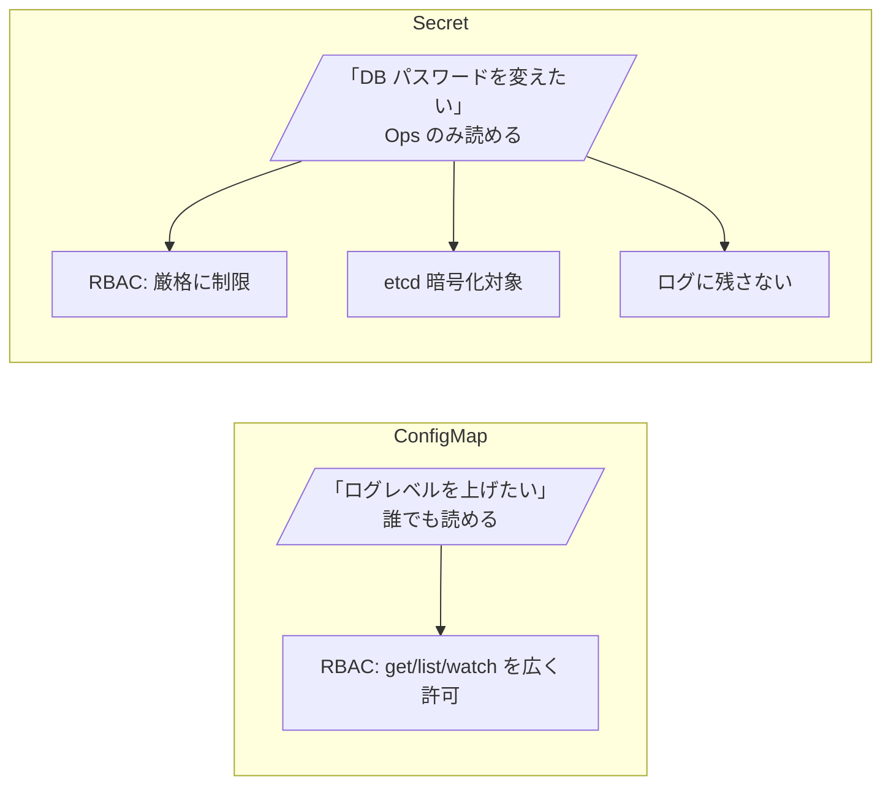
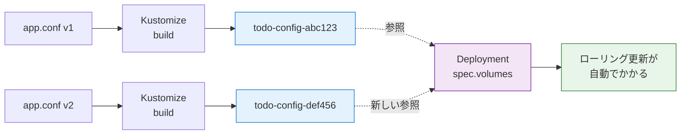
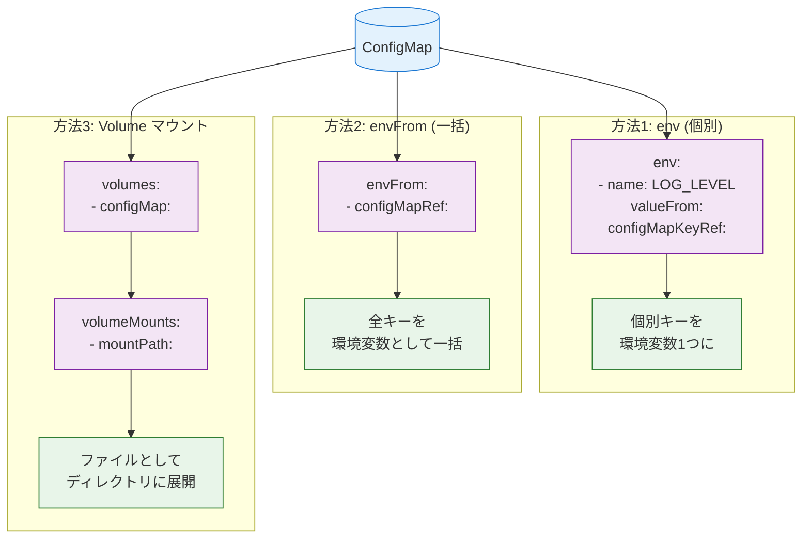
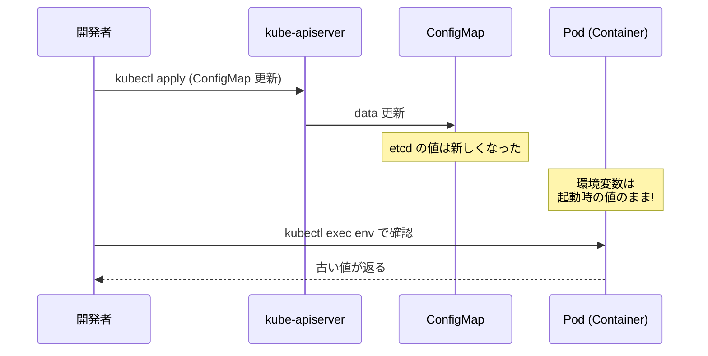
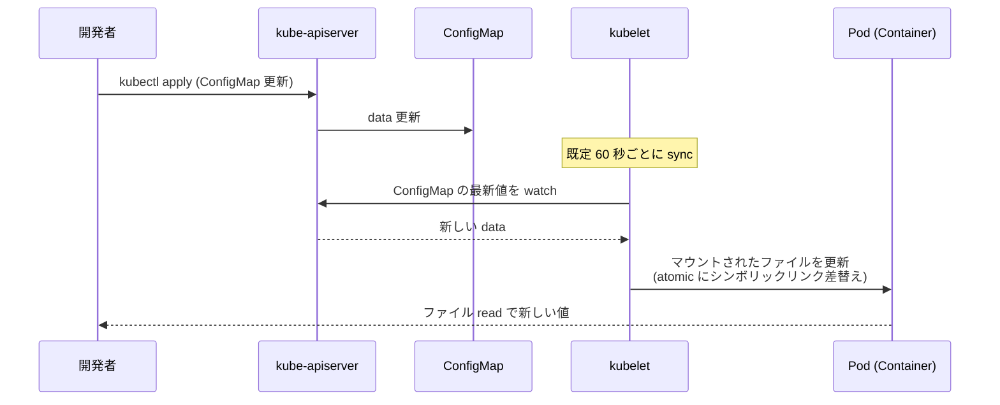
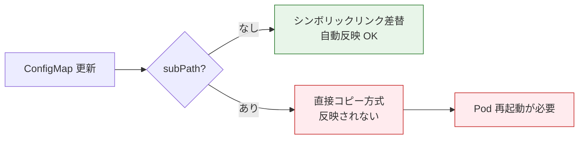
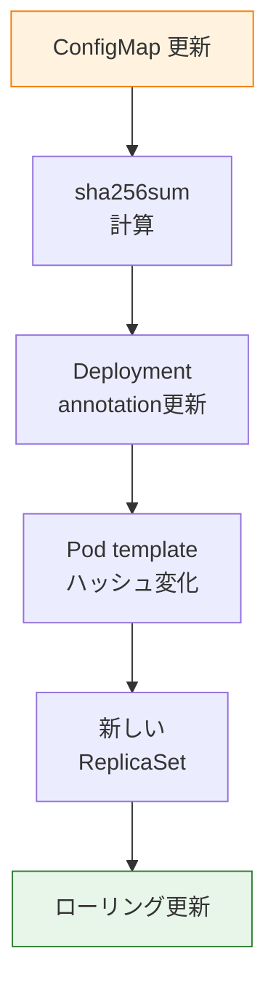
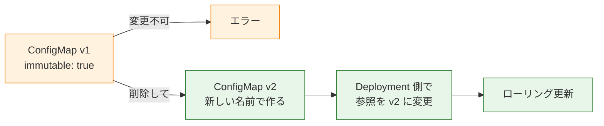
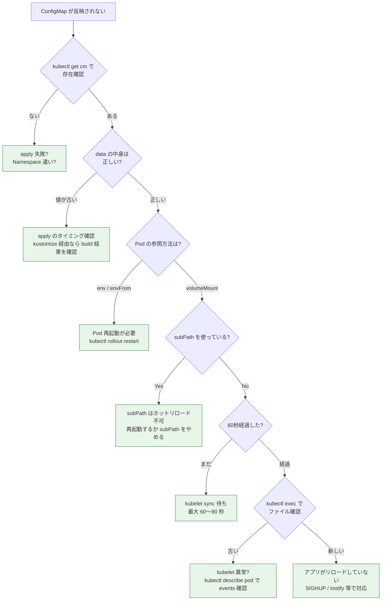
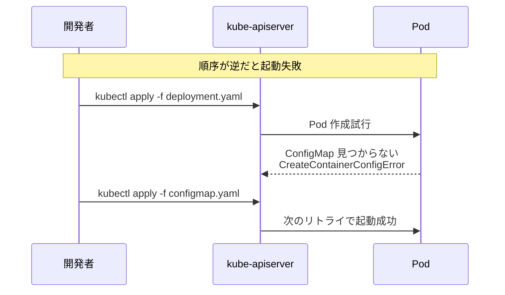

# ConfigMap
{: .no_toc }

## 目次
{: .no_toc .text-delta }

1. TOC
{:toc}

---

## このページのゴール

このページを読み終えると、以下を **自分の言葉で説明できる** ようになります。

- ConfigMap がなぜ Kubernetes 1.2 で導入されたのか、それ以前のアプリ設定管理と比較して説明できる
- ConfigMap の YAML 主要フィールド(`data`, `binaryData`, `immutable`)の意味と制約
- Pod に注入する 3 つの方法(`env`, `envFrom`, `volume mount`)の違いと、どう使い分けるか
- 「ConfigMap を更新したのに反映されない」と言われた時にどこを見ればいいか
- subPath マウントが volumeMount のホットリロードを壊す挙動と、その回避策
- 1 MiB 制限の根拠(etcd と protobuf のサイズ制約)と、超えたい場合の代替手段
- immutable ConfigMap が解決する問題と、運用上の注意点

## ConfigMap の歴史と設計思想

### Kubernetes 1.0 時代 ─ ConfigMap がなかった頃

Kubernetes 1.0 (2015 年 7 月) には ConfigMap が存在しませんでした。当時の Pod に設定値を渡す方法は次の 3 つしかありませんでした。

1. **`env` フィールドへの直書き**: Pod (Deployment) の YAML に `value: "info"` のように直接書く
2. **コンテナイメージへの焼き込み**: `Dockerfile` に `ENV LOG_LEVEL=info` を入れる
3. **ConfigMap 相当を自前実装**: アプリ起動時に S3 や etcd から設定を引いてくる

問題点は明らかでした。

- イメージ焼き込みは「環境ごとに別イメージ」を作る羽目になる(12-Factor の I「コードベース」原則違反)
- env 直書きは Deployment YAML が環境ごとに別になり、テンプレート化が必要
- 自前実装は車輪の再発明で、組織ごとに設定読み込みコードがばらける

### ConfigMap の登場 (1.2, 2016 年 3 月)

[KEP の前身デザインドキュメント](https://github.com/kubernetes/design-proposals-archive/blob/main/auth/configmap.md) では、ConfigMap の設計目標が次のように述べられています。

- 設定値を Pod 定義から **完全に分離** すること
- Secret と同じく etcd に保存される **第一級のリソース** であること
- Pod の `env` `volume` の両方から参照できること
- 既存の Secret と「使い勝手」を揃えること

最後の点が重要です。Secret は当時すでに存在していたので、ConfigMap は「Secret から機密性属性を取り除いたもの」と理解すれば早い、という設計判断がされました。**ConfigMap と Secret はインターフェースが揃っている** のはこのためです。

### Secret と分けた理由

「機密データ用 Secret と非機密データ用 ConfigMap」という分離は、技術的にはほぼ同じデータ構造を 2 つ用意していることになります。なぜ分けたか?



主な理由:

1. **RBAC で粒度の違う制御をしたい**: 開発者は ConfigMap を読めて当然だが、Secret は読めるべきではない。同じリソース種別では分けられない
2. **暗号化対象を明示したい**: etcd 暗号化を有効にしたとき、暗号化したいのは Secret だけ(ConfigMap まで暗号化すると性能影響が大きい)
3. **ログ・監査の扱いを変えたい**: kube-apiserver や kubectl の出力で、Secret の `data` は明示的に伏せ字にする処理が入っている
4. **「誤って機密を ConfigMap に入れてしまう」を防ぎたい**: リソース種別レベルで強制することで、運用の規律を作る

### 1.18 以降の進化

- **1.18 (2020-03)**: `immutable: true` フィールドが GA。一度作った ConfigMap を変更不可にできる
- **1.19 (2020-08)**: `data` の値に長い文字列を入れた際の `kubectl describe` の表示改善
- **1.20 (2020-12)**: ConfigMap として AdmissionWebhook で検証する事例が増え、組織内の利用パターンが定着

## ConfigMap の基本仕様

### YAML 全体像

```yaml
apiVersion: v1
kind: ConfigMap
metadata:
  name: todo-config
  namespace: default
  labels:
    app.kubernetes.io/name: todo
    app.kubernetes.io/part-of: todo
immutable: false                 # true にすると以後変更不可
data:                            # UTF-8 文字列のキー/値
  LOG_LEVEL: "info"
  PORT: "8000"
  app.conf: |
    [server]
    host = 0.0.0.0
    workers = 4
binaryData:                      # base64 エンコードされたバイナリ
  favicon.ico: AAABAAEAEBAAAAEAIABoBAAAFgAAACgAAAAQ...
```

### フィールド一覧

| フィールド | 必須 | 型 | 既定値 | 用途 |
|------------|------|-----|--------|------|
| `apiVersion` | ✓ | string | - | 常に `v1` |
| `kind` | ✓ | string | - | 常に `ConfigMap` |
| `metadata.name` | ✓ | string | - | DNS サブドメイン形式(63 文字以下、英小文字・数字・ハイフン) |
| `metadata.namespace` | - | string | `default` | Namespace |
| `metadata.labels` | - | map | - | セレクタや管理用ラベル |
| `metadata.annotations` | - | map | - | チェックサムなどメタ情報 |
| `immutable` | - | bool | `false` | true で変更不可化 |
| `data` | - | map[string]string | - | UTF-8 のキー/値 |
| `binaryData` | - | map[string][]byte | - | バイナリデータ(base64) |

`data` と `binaryData` の **キーは衝突できません**(両方に同じキーを書くと apply エラー)。

### 制約とサイズ上限

| 項目 | 上限 | 根拠 |
|------|------|------|
| ConfigMap 全体サイズ | **1 MiB (1,048,576 bytes)** | etcd の値サイズ上限 |
| キー名の長さ | 253 文字 | DNS サブドメイン形式 |
| キー名に使える文字 | `[a-zA-Z0-9_.-]` | 環境変数として使える文字制約 |
| 1 Namespace 内の ConfigMap 数 | 実質上限なし | etcd 容量に依存 |

1 MiB の根拠は etcd 側の `--max-request-bytes` (既定 1.5 MiB) と protobuf のオーバーヘッドからきています。実際にはマージン込みで 1 MiB が安全圏です。

{: .warning }
> 1 MiB を超える設定が必要な場合は、ConfigMap ではなく **Volume(NFS, S3 など)からマウント** するか、**設定を複数の ConfigMap に分割** することを検討します。アプリのバンドルされたデフォルト Helm チャートを ConfigMap に詰め込んで失敗するのは典型的なアンチパターンです。

## ConfigMap の作成方法

ConfigMap を作る方法は実は 5 種類以上あります。状況に応じて使い分けます。

### 方法1: kubectl create configmap --from-literal

ワンライナーで作る最も手早い方法です。

```bash
kubectl create configmap todo-config \
  --from-literal=LOG_LEVEL=info \
  --from-literal=PORT=8000 \
  --from-literal=DB_HOST=postgres
```

**何が起きるか**: `default` Namespace に `todo-config` という名前の ConfigMap が作成されます。

**期待される出力**:

```
configmap/todo-config created
```

**確認**:

```bash
kubectl get configmap todo-config -o yaml
```

```yaml
apiVersion: v1
kind: ConfigMap
metadata:
  name: todo-config
  namespace: default
data:
  LOG_LEVEL: info
  PORT: "8000"
  DB_HOST: postgres
```

**失敗するケース**:

| 症状 | 原因 | 対処 |
|------|------|------|
| `error: invalid argument` | `=` を抜かして `LOG_LEVEL info` と書いた | `KEY=VALUE` 形式で書く |
| `Error from server (AlreadyExists)` | 同名 ConfigMap が既存 | `kubectl create cm ... --dry-run=client -o yaml \| kubectl apply -f -` パターンで上書き |
| キー名にコロンを含めて拒否される | `kubectl create configmap` はキー名を厳格にチェック | 名前を `[a-zA-Z0-9_.-]` の範囲にする |

### 方法2: kubectl create configmap --from-file

ファイルから作ります。設定ファイル丸ごと注入したいときに便利です。

```bash
# 単一ファイル
kubectl create configmap nginx-config --from-file=nginx.conf
# → data に "nginx.conf" というキーで内容が入る

# キー名を変える
kubectl create configmap nginx-config --from-file=server.conf=nginx.conf

# ディレクトリ丸ごと
kubectl create configmap app-config --from-file=./config-dir/
# → ディレクトリ内の各ファイル名がキーになる
```

**注意点**:

- バイナリファイルを `--from-file` で読むと、UTF-8 として解釈できない場合は `binaryData` に格納されます
- ファイルサイズ合計が 1 MiB を超えると失敗します

### 方法3: kubectl create configmap --from-env-file

`.env` 形式のファイルから一括で読む方法です。各行の `KEY=VALUE` がそのまま ConfigMap のキー/値になります。

```bash
cat > app.env <<EOF
LOG_LEVEL=info
PORT=8000
DB_HOST=postgres
EOF

kubectl create configmap todo-config --from-env-file=app.env
```

`--from-file` との違い: `--from-file` だとファイル全体が 1 つのキーの値になるのに対し、`--from-env-file` は中身を **パースして個別のキー** にします。

### 方法4: YAML を直接 apply

GitOps やテンプレート化したい場合は、当然これが本命です。

```yaml
# todo-config.yaml
apiVersion: v1
kind: ConfigMap
metadata:
  name: todo-config
data:
  LOG_LEVEL: info
  PORT: "8000"
  DB_HOST: postgres
  app.conf: |
    [server]
    host = 0.0.0.0
    workers = 4
    log_level = info
```

```bash
kubectl apply -f todo-config.yaml
```

**ありがちなミス**:

```yaml
data:
  PORT: 8000          # ← エラー! 数値ではなく文字列にする必要がある
```

`data` の値は **必ず文字列** です。YAML の暗黙の型推論で数値や bool になると apply 時にエラーになります。`PORT: "8000"` のようにクォートします。

### 方法5: Kustomize の configMapGenerator

Kustomize を使う場合(7 章)、**生成器** として ConfigMap を作るのが推奨です。

```yaml
# kustomization.yaml
configMapGenerator:
- name: todo-config
  literals:
  - LOG_LEVEL=info
  - PORT=8000
  files:
  - app.conf
```

Kustomize は内容のハッシュを ConfigMap 名のサフィックスに付与します(`todo-config-h7f4k2m9b8`)。これにより、設定変更=新しい名前の ConfigMap=Deployment の差分=ローリング更新、という流れが自然に作れます(後述の「設定更新を反映させる」の話に直結)。



### Helm の場合

Helm では Chart 内で `templates/configmap.yaml` を書きます。Kustomize のようなハッシュ付与はデフォルトでは行われませんが、Deployment 側に `checksum/config` annotation を入れる定石があります(後述)。

## Pod への注入方法 ─ 3 つのパターン

ConfigMap を Pod から使うには 3 つの方法があります。それぞれ挙動が異なるので使い分けが必要です。



### 方法1: env で個別キーを環境変数に

```yaml
spec:
  containers:
  - name: api
    image: 192.168.56.10:5000/todo-api:0.1.0
    env:
    - name: LOG_LEVEL                # 環境変数名(任意に変えられる)
      valueFrom:
        configMapKeyRef:
          name: todo-config          # 参照する ConfigMap 名
          key: LOG_LEVEL             # ConfigMap 内のキー
          optional: false            # キー欠如時にエラーにするか (既定 false)
    - name: APP_PORT                 # ConfigMap キー名と環境変数名を変えられる
      valueFrom:
        configMapKeyRef:
          name: todo-config
          key: PORT
```

**特徴**:

- 環境変数名と ConfigMap キー名を **別にできる**(リネーム可能)
- 必要な値だけ取り出せる
- `optional: true` にすればキーが無くても起動失敗しない

**いつ使うか**: 「ConfigMap には 30 個のキーがあるけれど、この Pod は 3 つしか使わない」のような選択的な参照に向きます。

### 方法2: envFrom で一括注入

```yaml
spec:
  containers:
  - name: api
    image: 192.168.56.10:5000/todo-api:0.1.0
    envFrom:
    - configMapRef:
        name: todo-config
        optional: false
      prefix: APP_                   # すべてのキーに APP_ プレフィックスを付ける(任意)
```

**特徴**:

- ConfigMap の **すべてのキー** が環境変数として注入される
- キー名 = 環境変数名(`prefix` を付ければ変更可)
- 一発で全部入るので Deployment YAML がスッキリする

**いつ使うか**: 「Pod が ConfigMap のほぼ全キーを使う」場合。サンプル TODO アプリのように、設定値の用途が一目瞭然なときに便利です。

**注意**:

- ConfigMap のキー名が **環境変数として無効な文字**(例: `app.conf` の `.`)を含むと、その個別キーだけスキップされて警告が出ます
- 同名キーの環境変数が `env` と `envFrom` の両方にあると `env` が勝ちます

```yaml
# 例: env が envFrom より優先
envFrom:
- configMapRef:
    name: todo-config       # 内部に LOG_LEVEL=info
env:
- name: LOG_LEVEL
  value: debug              # ← こちらが採用される
```

### 方法3: Volume マウント

ConfigMap の各キーを **ファイルとして** Pod のディレクトリに展開します。

```yaml
spec:
  containers:
  - name: api
    image: 192.168.56.10:5000/todo-api:0.1.0
    volumeMounts:
    - name: config-vol
      mountPath: /etc/app           # コンテナ内のマウント先
      readOnly: true                # 読み取り専用(推奨)
  volumes:
  - name: config-vol
    configMap:
      name: todo-config
      defaultMode: 0444             # ファイルモード(8進数)既定 0644
      items:                        # 一部だけ取り出す場合
      - key: app.conf
        path: app.conf              # マウント先での相対パス
        mode: 0400                  # 個別の権限
      optional: false
```

**結果**: コンテナ内の `/etc/app/app.conf` にファイルが現れます。

**items を省略した場合**: ConfigMap のすべてのキーがファイル名として展開されます。

```bash
# items なし → 全キーが展開
$ ls /etc/app
LOG_LEVEL  PORT  DB_HOST  app.conf
```

**特徴**:

- アプリが「設定ファイル」を読む前提で書かれている場合に最適
- バイナリ(`binaryData`)も扱える
- **更新がほぼリアルタイムで反映される** (これが env との大きな違い、後述)

### env vs envFrom vs volumeMount の使い分け

| 観点 | env (個別) | envFrom (一括) | volume mount |
|------|------------|----------------|--------------|
| 記述量 | 多い | 少ない | 中 |
| 環境変数名のリネーム | 可 | prefix のみ | 不要 |
| 一部キーのみ取り出す | 可 | 不可 | items で可 |
| 値の更新を反映 | **Pod 再起動必要** | **Pod 再起動必要** | **自動反映** |
| バイナリ対応 | 不可 | 不可 | 可 |
| 推奨用途 | 必要キーを明示したい | 全キー使う、簡潔に | ホットリロード or 設定ファイル |

## ConfigMap 更新の反映 ─ ここで一番ハマる

「ConfigMap を `kubectl apply` で更新したら、Pod の値も自動で変わるよね?」と思ったあなた、半分正解で半分間違いです。

### env / envFrom の場合 ─ 反映されない



**理由**: 環境変数は **コンテナ起動時に 1 回だけ** kernel の environ に設定されます。Linux のプロセスモデル上、外から後で書き換えることができません。

**反映する手段**:

1. `kubectl rollout restart deployment/todo-api` ─ 全 Pod を順次再起動(推奨)
2. `kubectl delete pod -l app=todo-api` ─ 全 Pod 削除(Deployment が作り直す、雑な手段)
3. Deployment の annotation にチェックサムを入れて自動再起動(後述)

### Volume mount の場合 ─ 自動反映 (ただし注意点あり)



kubelet は監視している Pod の volumeMounted な ConfigMap を、**既定で 60〜90 秒以内** に更新します。設定値は厳密には:

- `--sync-frequency` (kubelet 起動オプション、既定 60 秒)
- 加えて kubelet 内部のキャッシュ TTL

の合算で、最悪 1〜2 分の遅延があります。即時反映ではない点に注意。

#### atomic 更新の仕組み

kubelet はファイルを直接書き換えるのではなく、新しいディレクトリを作って **シンボリックリンクを差し替える** 形で更新します。

```
/etc/app/
├── ..2024_03_15_10_30_00/        ← 旧バージョン
├── ..2024_03_15_10_31_00/        ← 新バージョン
├── ..data → ..2024_03_15_10_31_00 (シンボリックリンク)
└── app.conf → ..data/app.conf    (シンボリックリンク)
```

これにより、アプリがファイルを読んでいる最中に半端な内容にならない(atomic な切替が保証される)ようになっています。

#### subPath マウントは更新されない

これは典型的な落とし穴です。

```yaml
volumeMounts:
- name: config-vol
  mountPath: /etc/nginx/nginx.conf
  subPath: nginx.conf            # ← これがあると ConfigMap の更新が反映されない
```

`subPath` を使うと、kubelet はシンボリックリンク差し替え方式が使えず、**ファイルを直接コピー** する形になります。結果として ConfigMap が更新されてもファイルは古いままです。



**回避策**:

1. `subPath` を使わず、ディレクトリごとマウントして他のファイルが要らないなら別ディレクトリにする
2. `subPath` のままでよいなら Deployment 再起動を組み合わせる
3. annotation チェックサムによる自動再起動を仕込む(後述)

#### アプリ側のリロード

ファイルが更新されてもアプリがそれを読み直さないと意味がありません。アプリ側の対応が必要です。

- **SIGHUP で reload する系** (Nginx, HAProxy): `kubectl exec` で `kill -HUP 1` するか、Sidecar で監視
- **inotify 監視するアプリ**: ファイル変更を検知して自動リロード
- **何もしないアプリ**: Pod 再起動しかない

### checksum/config パターンによる自動再起動

ConfigMap の中身が変わったら自動で Pod を再起動させたい、というのは Helm のあるあるパターンで、解決策は **annotation にハッシュを埋め込む** ことです。

```yaml
# Helm template
spec:
  template:
    metadata:
      annotations:
        checksum/config: {{ include (print $.Template.BasePath "/configmap.yaml") . | sha256sum }}
```

`Pod template` の中身が変わると Deployment は新しい ReplicaSet を作る、という性質を利用します。ConfigMap が変わると `sha256sum` が変わり、annotation が変わり、Pod template が「変わった」と判定され、ローリング更新が起きる。



これは Helm 公式 Chart で多用されるパターンですが、副作用として「ConfigMap を編集するたびに Pod が再起動する」ことになります。短時間に何度も apply するのは避けるべきです。

### Reloader (Stakater) による自動再起動

Helm のチェックサムパターンを使えない or もっと自動化したい場合は、サードパーティの [Stakater Reloader](https://github.com/stakater/Reloader) を使います。

```yaml
apiVersion: apps/v1
kind: Deployment
metadata:
  name: todo-api
  annotations:
    configmap.reloader.stakater.com/reload: "todo-config"
    secret.reloader.stakater.com/reload: "todo-secret"
```

Reloader はクラスタ内で常駐し、annotation で指定された ConfigMap / Secret の変更を watch して自動で `rollout restart` を実行します。

## 詳細仕様 ─ もっと深く

### `optional: true` の挙動

```yaml
env:
- name: LOG_LEVEL
  valueFrom:
    configMapKeyRef:
      name: todo-config
      key: LOG_LEVEL
      optional: true
```

`optional: true` なら、ConfigMap や該当キーが存在しなくても Pod は起動します。本番では基本 `false` (必須) が推奨です。`true` だと「設定漏れに気づかず動いてしまう」リスクがあります。

### immutable: true

```yaml
apiVersion: v1
kind: ConfigMap
metadata:
  name: todo-config-v1.2.0
immutable: true
data:
  LOG_LEVEL: info
```

**効果**:

- 以後 `data` `binaryData` を変更しようとすると apply エラー
- 削除して作り直すしかない
- kube-apiserver のキャッシュ最適化が効く(変更されないことが保証されるため、watch の負荷が減る)

**ユースケース**:

- バージョン付きの設定: `todo-config-v1.2.0` のように、設定をバージョン管理したい
- 大量の Pod が同じ ConfigMap を参照していて、kube-apiserver の負荷が問題
- 「絶対に変えてほしくない」設定の事故防止

**運用上の注意**:

- 一度 `immutable: true` にすると、`immutable` フィールド自体も変更できない
- 変更したい場合は `kubectl delete` してから作り直し → 参照している Pod も再起動



### binaryData

UTF-8 で表現できないデータ(バイナリファイル、画像、TLS 秘密鍵など)を入れる用途。`data` と `binaryData` で同じキーは禁止。

```yaml
apiVersion: v1
kind: ConfigMap
metadata:
  name: app-resources
binaryData:
  logo.png: iVBORw0KGgoAAAANSUhEUgAAAAEAAAABCAYAAAAfFcSJAAAA...
data:
  app.json: '{"name": "todo"}'
```

`kubectl create configmap` の `--from-file` で読み込んだ際、UTF-8 として解釈できないファイルは自動で `binaryData` に振り分けられます。

### data のキー名規則

| 用途 | 制約 |
|------|------|
| 環境変数として注入する場合 (`envFrom` / `configMapKeyRef`) | `[A-Za-z_][A-Za-z0-9_]*` の C 言語識別子相当 |
| volume mount で使う場合 | `[a-zA-Z0-9._-]` でファイル名として有効な文字 |

`envFrom` で全キーを取り込んだとき、環境変数として無効な文字を含むキーはスキップされて kubelet ログに警告が出ます。

```yaml
data:
  LOG_LEVEL: info       # OK
  app.conf: |...        # envFrom ではスキップ(.が無効)、volume では使える
  9PORT: "8000"         # 環境変数として無効(数字始まり)
```

## 代替手法 ─ ConfigMap を使わない選択肢

ConfigMap が万能ではありません。状況によっては別の手段の方が適切です。

```mermaid
flowchart TB
    Q{設定値の<br/>性質}
    Q --> Q1[機密?]
    Q1 -- Yes --> SEC[Secret]
    Q1 -- No --> Q2[サイズ大?]
    Q2 -- 1MiB超 --> VOL[Volume<br/>(NFS/PVC)]
    Q2 -- 通常 --> Q3[環境ごとに変わる?]
    Q3 -- Yes --> CM[ConfigMap]
    Q3 -- No --> Q4[本当に変える可能性?]
    Q4 -- なし --> IMG[コンテナイメージに焼き込み]
    Q4 -- あり --> CM

    classDef cm fill:#e3f2fd,stroke:#1976d2
    classDef sec fill:#ffebee,stroke:#c62828
    classDef other fill:#fff3e0,stroke:#f57c00
    class CM cm
    class SEC sec
    class VOL,IMG other
```

| 代替手段 | いつ選ぶ | メリット | デメリット |
|----------|----------|----------|------------|
| **コンテナイメージに焼き込み** | 環境ごとに変わらない既定値 | 設定漏れがない、起動が早い | 環境ごとに別イメージが必要に |
| **Pod env への直書き** | 1〜2 個の値、テンプレート化されている | YAML を見れば値が分かる | 環境差を取り回しにくい |
| **Volume (PVC / NFS)** | 巨大な設定ファイル、共有リソース | サイズ無制限、書き込みも可 | 別途プロビジョニングが必要 |
| **Downward API** | Pod 自身の情報を渡す(name, IP, labels) | クラスタ情報を反映できる | 用途が限定的 |
| **外部設定サーバ (Spring Cloud Config 等)** | 動的設定、A/B テスト | 動的に変えられる | クラスタ外依存、複雑 |

### Downward API ─ Pod 自身の情報を環境変数化

ConfigMap の話から少し脇道ですが、Pod の名前や Namespace を環境変数として渡す **Downward API** という機能があります。

```yaml
env:
- name: POD_NAME
  valueFrom:
    fieldRef:
      fieldPath: metadata.name
- name: POD_NAMESPACE
  valueFrom:
    fieldRef:
      fieldPath: metadata.namespace
- name: NODE_NAME
  valueFrom:
    fieldRef:
      fieldPath: spec.nodeName
- name: POD_IP
  valueFrom:
    fieldRef:
      fieldPath: status.podIP
```

ログにポッド名を含めたい、`OTEL_SERVICE_NAME` を Namespace ごとに変えたい、といった用途で重宝します。ConfigMap と Downward API の組み合わせは構造化ログ運用の定番です。

## トラブルシュート

### 調査フローチャート



### エラーメッセージ別対処表

| エラーメッセージ | 原因 | 対処 |
|-----------------|------|------|
| `CreateContainerConfigError` | ConfigMap or キーが存在しない | `kubectl describe pod` で「configmap "xxx" not found」を確認 |
| `Error from server (Invalid): ConfigMap.v1 ... data: Invalid value` | 値が文字列でない、サイズ超過 | YAML の値を必ずクォート、サイズを確認 |
| `Forbidden: this object is immutable` | immutable な ConfigMap を更新しようとした | 削除して作り直し |
| `request entity too large` | 1 MiB 超過 | データを分割するか Volume を使う |
| `couldn't find key XXX in ConfigMap` | configMapKeyRef のキーが存在しない | キー名のタイポ確認、`optional: true` で許容するか |
| envFrom で警告 `key XXX is invalid` | キー名が環境変数として無効 | キー名を `[A-Z_]` に直すか、env で個別取得 |

### よくある失敗ケース

#### ケース1: 「YAMLファイルから ConfigMap を作ったのに値が入らない」

```yaml
data:
  PORT: 8000           # ← NG: 数値として解釈される
  ENABLED: true        # ← NG: bool として解釈される
  IP: 192.168.1.1      # ← NG: yaml の数値型と誤認しないが、quote 推奨
```

**対処**: 値はすべてクォート。

```yaml
data:
  PORT: "8000"
  ENABLED: "true"
  IP: "192.168.1.1"
```

#### ケース2: 「envFrom で注入したのに環境変数に出てこない」

```bash
$ kubectl exec -it todo-api-xxx -- env | grep MY_KEY
# 出力なし
```

ConfigMap 側のキー名を確認:

```bash
$ kubectl get cm todo-config -o yaml
```

```yaml
data:
  my-key: value         # ← NG: ハイフンを含むキー
```

`my-key` は環境変数として無効(`-` は使えない)。`MY_KEY` に直すか、env で個別注入(リネーム)します。

#### ケース3: 「複数行の値で改行が消える」

```yaml
data:
  app.conf: "[server]\nhost = 0.0.0.0\nworkers = 4"   # 文字列リテラル
```

これは「\n」がエスケープされず、そのまま出力される場合があります(YAML パーサ依存)。

**正しい書き方**:

```yaml
data:
  app.conf: |
    [server]
    host = 0.0.0.0
    workers = 4
```

`|` は YAML のブロックスカラー記法で、改行を保持します。`>` だと改行をスペースに変換するので注意。

#### ケース4: 「kustomize edit set で ConfigMap が更新されない」

Kustomize の `configMapGenerator` は、内容が変わるとサフィックスのハッシュが変わるため、参照側の Deployment にも反映の手当が必要です。`generatorOptions.disableNameSuffixHash: true` を付けるとハッシュ無効化できますが、その場合は更新時に Pod の自動再起動が起きないので、別途 annotation チェックサムや Reloader を仕込む必要があります。

#### ケース5: 「コンテナ起動時に ConfigMap が見つからないエラー」

ConfigMap を後から作る運用にしていると、Pod が先に起動して `CreateContainerConfigError` で詰まります。Helm では `helm install` 時に ConfigMap も含めて一括作成されますが、手動で apply している場合は順序に注意。



`kubectl apply -f .` でディレクトリごと apply する場合は、ファイル名のアルファベット順で適用されるため、ConfigMap → Deployment の順になるよう命名するのも 1 つの手です。

## ハンズオン ─ TODO アプリの設定を分離する

### 前提

- Minikube クラスタが動いている(1〜5 章までで構築済み)
- `kubectl` がそのクラスタを向いている

### Step 1: 既存の Deployment を確認

サンプル TODO アプリの API 部分を、設定ベタ書きで動かしている前提とします。

```yaml
# deployment-before.yaml (既存)
apiVersion: apps/v1
kind: Deployment
metadata:
  name: todo-api
spec:
  replicas: 2
  selector:
    matchLabels:
      app.kubernetes.io/name: todo-api
  template:
    metadata:
      labels:
        app.kubernetes.io/name: todo-api
    spec:
      containers:
      - name: api
        image: 192.168.56.10:5000/todo-api:0.1.0
        env:
        - name: LOG_LEVEL
          value: info
        - name: DB_HOST
          value: postgres
        - name: DB_PORT
          value: "5432"
        - name: DB_NAME
          value: todo
        - name: REDIS_HOST
          value: redis
        - name: REDIS_PORT
          value: "6379"
```

### Step 2: ConfigMap に切り出す

設定値を ConfigMap に分離します。

```yaml
# configmap.yaml
apiVersion: v1
kind: ConfigMap
metadata:
  name: todo-config
  labels:
    app.kubernetes.io/name: todo
    app.kubernetes.io/part-of: todo
data:
  LOG_LEVEL: info
  DB_HOST: postgres
  DB_PORT: "5432"
  DB_NAME: todo
  REDIS_HOST: redis
  REDIS_PORT: "6379"
  FEATURE_NOTIFY: "true"
```

```bash
kubectl apply -f configmap.yaml
```

**期待される出力**:

```
configmap/todo-config created
```

確認:

```bash
kubectl describe configmap todo-config
```

```
Name:         todo-config
Namespace:    default
Labels:       app.kubernetes.io/name=todo
              app.kubernetes.io/part-of=todo
Data
====
DB_HOST:        14 bytes
DB_NAME:        4 bytes
DB_PORT:        4 bytes
FEATURE_NOTIFY: 4 bytes
LOG_LEVEL:      4 bytes
REDIS_HOST:     5 bytes
REDIS_PORT:     4 bytes
```

### Step 3: Deployment から envFrom で参照

```yaml
# deployment.yaml
apiVersion: apps/v1
kind: Deployment
metadata:
  name: todo-api
spec:
  replicas: 2
  selector:
    matchLabels:
      app.kubernetes.io/name: todo-api
  template:
    metadata:
      labels:
        app.kubernetes.io/name: todo-api
    spec:
      containers:
      - name: api
        image: 192.168.56.10:5000/todo-api:0.1.0
        envFrom:
        - configMapRef:
            name: todo-config
        # 次の節で Secret を追加する
```

```bash
kubectl apply -f deployment.yaml
```

### Step 4: 環境変数が注入されたか確認

```bash
kubectl exec -it deploy/todo-api -- env | grep -E "LOG_LEVEL|DB_|REDIS_|FEATURE_"
```

**期待される出力**:

```
LOG_LEVEL=info
DB_HOST=postgres
DB_PORT=5432
DB_NAME=todo
REDIS_HOST=redis
REDIS_PORT=6379
FEATURE_NOTIFY=true
```

### Step 5: ConfigMap を更新して反映を確認

```bash
kubectl edit configmap todo-config
# LOG_LEVEL を debug に変更
```

すぐに env を確認しても古いまま:

```bash
kubectl exec -it deploy/todo-api -- env | grep LOG_LEVEL
# LOG_LEVEL=info  ← 古い値
```

**rollout restart で反映**:

```bash
kubectl rollout restart deployment/todo-api
kubectl rollout status deployment/todo-api
```

確認:

```bash
kubectl exec -it deploy/todo-api -- env | grep LOG_LEVEL
# LOG_LEVEL=debug  ← 新しい値
```

### Step 6: 設定ファイルとしてマウントする例

API ではなく Nginx (Frontend) を例に、設定ファイルをマウントします。

```yaml
# nginx-configmap.yaml
apiVersion: v1
kind: ConfigMap
metadata:
  name: todo-frontend-config
data:
  default.conf: |
    server {
      listen 80;
      server_name _;

      location / {
        root /usr/share/nginx/html;
        index index.html;
      }

      location /api/ {
        proxy_pass http://todo-api:8000/;
        proxy_set_header Host $host;
        proxy_set_header X-Real-IP $remote_addr;
      }
    }
---
apiVersion: apps/v1
kind: Deployment
metadata:
  name: todo-frontend
spec:
  replicas: 2
  selector:
    matchLabels:
      app.kubernetes.io/name: todo-frontend
  template:
    metadata:
      labels:
        app.kubernetes.io/name: todo-frontend
    spec:
      containers:
      - name: nginx
        image: 192.168.56.10:5000/todo-frontend:0.1.0
        volumeMounts:
        - name: nginx-config
          mountPath: /etc/nginx/conf.d
          readOnly: true
      volumes:
      - name: nginx-config
        configMap:
          name: todo-frontend-config
```

注意: `mountPath: /etc/nginx/conf.d` でディレクトリ全体をマウントすると、nginx イメージに元から入っていた `default.conf` は **隠されます**。`subPath` で個別ファイルだけマウントしたくなりますが、その場合はホットリロードが効かなくなる点に注意。

### Step 7: 設定変更で nginx をホットリロード

```bash
kubectl edit configmap todo-frontend-config
# proxy_set_header に何か追加
```

数十秒後にファイルが更新されます:

```bash
kubectl exec -it deploy/todo-frontend -- cat /etc/nginx/conf.d/default.conf
# 新しい内容
```

ただし nginx は SIGHUP を受け取らないと設定を読み直しません:

```bash
kubectl exec -it deploy/todo-frontend -- nginx -s reload
```

これで反映されます。本番では Sidecar コンテナで inotify で監視させるか、Reloader を使います。

### Step 8: immutable ConfigMap で本番化

設定が固まったら immutable にして事故を防ぎます。

```yaml
apiVersion: v1
kind: ConfigMap
metadata:
  name: todo-config-v1.0.0
immutable: true
data:
  LOG_LEVEL: info
  # ...
```

そして Deployment は `todo-config-v1.0.0` を参照。次のバージョンを出すときは `todo-config-v1.0.1` を新規作成して Deployment の参照を切り替えます。Kustomize の `configMapGenerator` がほぼ同じことを自動でやってくれます。

## 本番運用での落とし穴

### 1. ConfigMap が 1 MiB を超える

CRD のサンプル YAML を ConfigMap に詰めて配布する、Grafana ダッシュボード JSON を 30 個入れる、といったケースで容量超過します。

**対処**:

- 複数の ConfigMap に分割
- 大きなファイルは ConfigMap ではなく PVC + initContainer で配布
- Helm の `Files.Glob` でマウント時に分割

### 2. ConfigMap の値が長すぎて kubectl describe が見にくい

```bash
kubectl describe cm large-config
# 巨大なログがダーッと
```

**対処**:

- `kubectl get cm large-config -o jsonpath='{.data.app\.conf}'` で個別キーを取り出す
- `k9s` などの TUI を使う

### 3. 「ConfigMap を変更したつもりが Pod が再起動して止まった」

checksum/config パターンや Reloader を入れていると、ConfigMap の変更で本番 Pod が一気に再起動します。Deployment の `strategy: RollingUpdate` 設定と `maxUnavailable` の値が適切でないと、サービス断につながります。

**対処**:

- 重要な変更は Deployment の minReadySeconds と組み合わせて慎重に
- 大規模クラスタでは即時再起動でなく `kubectl rollout restart` を時間差で実行

### 4. 環境変数経由で機密値が `kubectl describe pod` に出る

ConfigMap に機密を入れた場合、`kubectl describe pod` の Environment 欄でフルに表示されます。Secret なら値が伏せられます。**機密は Secret に**(これが分けてある最大の理由の 1 つ)。

### 5. ConfigMap を Namespace 横断で参照したい

ConfigMap は Namespace スコープなので、別 Namespace の Pod から直接参照できません。

**対処**:

- 同じ ConfigMap を各 Namespace に複製(`kubectl get cm -n ns-a -o yaml | sed 's/ns-a/ns-b/' | kubectl apply -f -`)
- Helm の chart で同名 ConfigMap を release する
- [Kyverno](https://kyverno.io/) などで Namespace 作成時に自動生成

## チェックポイント

ここまでで以下を **自分の言葉で** 説明できるか確認してください。

- [ ] ConfigMap が Kubernetes 1.0 になく、1.2 で導入された経緯と、それ以前の代替手段を 2 つ挙げられる
- [ ] `data` と `binaryData` の違いと、両方に同じキーが書けない理由を述べられる
- [ ] env / envFrom / volumeMount の 3 つの注入方法のうち、ホットリロードできるのはどれか説明できる
- [ ] `subPath` マウントが ConfigMap のホットリロードを壊す挙動と、その回避策を 2 つ挙げられる
- [ ] ConfigMap の 1 MiB 制限の根拠(etcd 側の制約)を理解している
- [ ] `immutable: true` の効用と、Kustomize の configMapGenerator がそれを自動で活用する仕組みを説明できる
- [ ] `checksum/config` annotation パターンが何を解決するか説明できる
- [ ] `CreateContainerConfigError` が出た時の調査手順を 3 ステップ以内で説明できる
- [ ] サンプル TODO アプリで「DB ホスト名」を ConfigMap、「DB パスワード」を Secret に分けるべき理由を答えられる

→ 次は [Secret]({{ '/06-config/secret/' | relative_url }})
