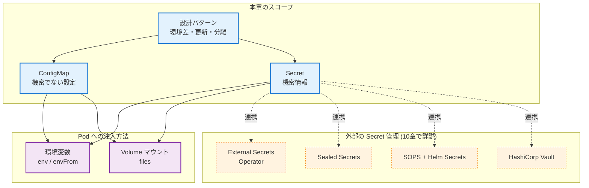
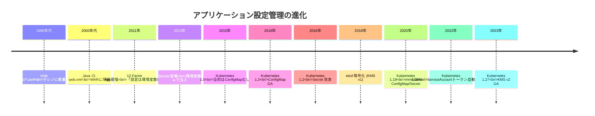
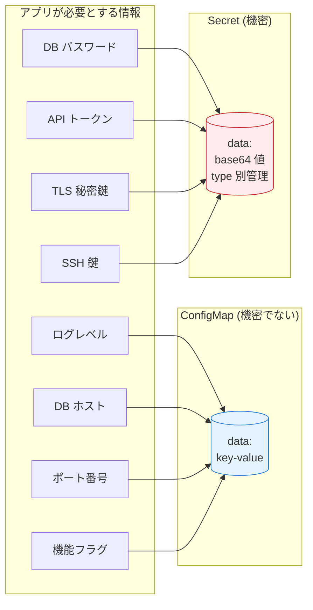

# 06. 設定とSecret
{: .no_toc }

## 目次
{: .no_toc .text-delta }

1. TOC
{:toc}

---

## この章のゴール

この章を読み終えると、以下を **自分の言葉で説明できる** ようになります。

- なぜ Kubernetes が「設定値の注入」を独立したリソース(ConfigMap / Secret)として切り出しているのか、その設計思想と歴史的経緯
- ConfigMap と Secret の違い、それぞれが「何を守り」「何を守らないか」
- ConfigMap / Secret を Pod に注入する3つの方法(env、envFrom、volumeMount)の使い分け
- 設定値の更新を Pod に反映させる代表的な3つのパターン(rollout restart、checksum annotation、外部 Reloader)
- 環境差(dev / stg / prod)の取り回しを Helm / Kustomize / Namespace 分離で設計できる
- 「機密」と「設定」の境界をどこに引くか、組織方針として答えられる
- 本番運用で Secret を漏らさないために、etcd 暗号化と外部 Secret 管理(External Secrets / Sealed Secrets / SOPS)のいずれを選ぶべきかを判断できる

## なぜこの章が独立しているのか

「設定値の管理」は一見地味なテーマです。しかし Kubernetes 運用で **本番障害の上位原因の常連** がここにあります。具体的には、

- DB パスワードを誤って Git に commit してしまい、組織のセキュリティチームから連絡を受ける
- ConfigMap を更新したのに Pod が新しい値で動作していないことに数時間気づかない
- dev で動いていた YAML を prod に流したら、prod の Secret が dev の値で上書きされた
- Sealed Secrets の鍵をクラスタごと吹き飛ばしてしまい、全環境の Secret を作り直す羽目になった

これらは技術というより **設計の失敗** です。本章では「正しい使い方」だけでなく、なぜそれが正しいのか、何を選ばないとどう失敗するのかを、歴史的経緯とともに掘り下げます。

## 章の全体像



## 設定管理の歴史 ─ Kubernetes 以前と以後

ConfigMap や Secret を理解するには、コンテナ以前のアプリ運用がどうやって設定を取り回していたかを振り返るのが近道です。



### 1. 「設定」が散らかっていた時代

Unix サーバ運用では、設定は `/etc` 配下の `.conf` に直書きするのが当然でした。アプリが10台のサーバで動いていれば、10台分の設定を **手動で同期** していた時代があります。Ansible や Chef、Puppet といった構成管理ツールが普及するまでは、これが大真面目に運用されていました。

問題は明確でした:

- どのサーバにどの設定が入っているか、誰も正確に把握していない
- 「dev の設定を本番に反映し忘れた」「本番の DB パスワードが古い」といった事故が日常的に起きる
- 設定を変えるためにサーバに SSH してエディタを開く必要があり、変更履歴が残らない

### 2. 12-Factor App 革命 (2011)

Heroku の創業者らが提唱した [The Twelve-Factor App](https://12factor.net/) の第3項「設定」が、考え方を一変させました。

> 設定は環境変数に格納する。コードと設定は厳密に分離する。

このマニフェストは、SaaS 時代における「アプリの正しい作り方」のデファクトスタンダードになりました。Kubernetes の ConfigMap / Secret 設計は、この 12-Factor の思想を素直に実装したものです。

### 3. Docker 時代 (2013-2015)

Docker は環境変数による設定注入を「-e KEY=VALUE」フラグでサポートし、12-Factor を実装する最も自然な手段になりました。しかし複数コンテナを束ねる仕組みがなく、Docker Compose の `environment:` ブロックで毎回書き並べるのが実情でした。

### 4. Kubernetes 初期 (1.0 〜 1.2)

Kubernetes 1.0 (2015) には、実は **ConfigMap が存在しませんでした**。当初は Pod の `env` セクションに値を直書きするしかなく、設定値とアプリ定義が密結合してしまう問題がありました。

Secret は 1.0 から存在していましたが、これは「コンテナレジストリの認証情報を Pod に渡す」必要があったためで、汎用的な設定リソースとしては設計されていませんでした。

### 5. ConfigMap の登場 (1.2, 2016年3月)

Kubernetes 1.2 で ConfigMap が GA になったのは、コミュニティから「設定だけのリソースが欲しい」という強い要望があったためです。設計議論は KEP (Kubernetes Enhancement Proposal) の前身である `kubernetes/community` のデザインドキュメントに残っています。

ポイントは「Secret と ConfigMap は別物として分けた」という決断です。技術的にはほぼ同じ構造でも、

- Secret は誤って `kubectl get -o yaml` で値を露出させない
- Secret は etcd で別扱い(将来的に暗号化対象にできるように)
- RBAC で `secrets` リソースのみ厳格に制限できる

という運用上の分離を、リソースレベルで強制したかったのです。

### 6. その後の改善

- **1.18 (2020)**: ConfigMap / Secret に `immutable: true` フィールドが追加。kube-apiserver の負荷削減と意図しない変更の防止
- **1.20 (2020)**: `--secret-encryption-config` の改善
- **1.22 (2021)**: Bound ServiceAccount Token (projected token) が GA。Secret に保存される「永久トークン」の依存をなくす方向へ
- **1.24 (2022)**: ServiceAccount 作成時に対応する Secret が **自動生成されなくなった**。projected token への移行を加速
- **1.27 (2023)**: KMS Provider v2 が GA。etcd 暗号化キーのローテーションが大幅に楽に

ここまで読めば、ConfigMap と Secret が「2つに分かれている設計上の理由」と「Secret の暗号化が後付けで進化してきた歴史」が見えてくるはずです。

## ConfigMap と Secret の役割分担



おおざっぱには **「Git に書いてよいかどうか」** が判断基準になります。書いてよいなら ConfigMap、ダメなら Secret です。

ただし「Secret に入れたから安全」ではない、という点が本章で繰り返し強調するポイントです。Secret は base64 エンコードされているだけで、暗号化はされていません。本当の意味で守るには etcd 暗号化や外部 Secret 管理が必要です。

## サンプルアプリ「ミニTODOサービス」での適用

本章のハンズオンを通じて、ミニTODOサービスの設定を ConfigMap / Secret に分離していきます。

```mermaid
flowchart TB
    subgraph "ConfigMap: todo-config"
        CM1[LOG_LEVEL=info]
        CM2[DB_HOST=postgres]
        CM3[DB_PORT=5432]
        CM4[DB_NAME=todo]
        CM5[REDIS_HOST=redis]
        CM6[REDIS_PORT=6379]
        CM7[FEATURE_NOTIFY=true]
    end

    subgraph "Secret: todo-secret"
        S1[DB_USER=todo]
        S2[DB_PASSWORD=*****]
        S3[JWT_SECRET=*****]
        S4[REDIS_PASSWORD=*****]
    end

    subgraph "Secret: regcred"
        S5[type: dockerconfigjson<br/>レジストリ認証]
    end

    subgraph "Pod: todo-api"
        POD[Container]
    end

    CM1 -.envFrom.-> POD
    CM2 -.envFrom.-> POD
    CM3 -.envFrom.-> POD
    CM4 -.envFrom.-> POD
    CM5 -.envFrom.-> POD
    CM6 -.envFrom.-> POD
    CM7 -.envFrom.-> POD
    S1 -.envFrom.-> POD
    S2 -.envFrom.-> POD
    S3 -.envFrom.-> POD
    S4 -.envFrom.-> POD
    S5 -.imagePullSecret.-> POD

    classDef cm fill:#e3f2fd,stroke:#1976d2
    classDef sc fill:#ffebee,stroke:#c62828
    classDef pod fill:#e8f5e9,stroke:#2e7d32
    class CM1,CM2,CM3,CM4,CM5,CM6,CM7 cm
    class S1,S2,S3,S4,S5 sc
    class POD pod
```



DB パスワードや JWT 鍵は Secret に、ログレベルや DB ホスト名は ConfigMap に分離します。私有レジストリの認証情報も Secret(`dockerconfigjson` 型)で扱います。

## 章の読み進め方

```mermaid
flowchart LR
    A[index<br/>(本ページ)] --> B[ConfigMap]
    B --> C[Secret]
    C --> D[設計パターン]
    D --> E[次章: Helm]

    classDef current fill:#fff3e0,stroke:#f57c00,stroke-width:3px
    classDef next fill:#f3e5f5,stroke:#7b1fa2
    class A current
    class E next
```

1. **[ConfigMap]({{ '/06-config/configmap/' | relative_url }})** ─ 機密でない設定値の扱い。3 つの注入方式を網羅
2. **[Secret]({{ '/06-config/secret/' | relative_url }})** ─ 機密情報の扱いと、Kubernetes が「何を守ってくれて何を守ってくれないか」
3. **[設計パターン]({{ '/06-config/patterns/' | relative_url }})** ─ 環境差・更新反映・機密管理の実運用パターン

## 前提とする予備知識

本章を読むには、以下が頭に入っている前提です。もし不安があれば、該当章に一度戻ってください。

- Pod / Deployment の YAML を読み書きできる(2章)
- `kubectl apply -f`, `kubectl describe pod`, `kubectl logs` が手に馴染んでいる(3章)
- Volume と volumeMount の関係(emptyDir / hostPath レベルでよい)(5章)
- Namespace でリソースが分離されること(2章)

## チェックポイント

ここまでで以下を **自分の言葉で** 説明できるか確認してください。先に進む前のセルフチェックです。

- [ ] ConfigMap と Secret は何が同じで何が違うか、3 つ以上挙げられる
- [ ] 12-Factor App の「設定」項が、なぜ Kubernetes の設計に影響したか説明できる
- [ ] Secret は「base64 されているだけ」と聞いてピンとくる
- [ ] サンプル TODO アプリの設定値のうち、どれが ConfigMap でどれが Secret に行くべきか分類できる
- [ ] 環境差(dev / stg / prod)を扱う代表的な手段を 2 つ以上知っている

→ 次は [ConfigMap]({{ '/06-config/configmap/' | relative_url }})
