# 設計パターン
{: .no_toc }

## 目次
{: .no_toc .text-delta }

1. TOC
{:toc}

---

## このページのゴール

このページを読み終えると、以下を **自分の言葉で説明できる** ようになります。

- ConfigMap / Secret の「使い方」と「設計」は別物であり、後者が運用を左右することを理解する
- dev / stg / prod の環境差を扱う 3 大手段(Namespace 分離 / Helm values / Kustomize overlays)の使い分け
- 「ConfigMap を更新したのに反映されない」を防ぐ自動化パターン(`rollout restart` / checksum annotation / Reloader / Kustomize ハッシュ)
- 機密管理ライフサイクル(発行 → 配布 → ローテーション → 失効)を Kubernetes の文脈で設計できる
- 12-Factor App との対応関係を踏まえ、コードと設定を正しく分離できる
- 「ConfigMap か Secret か」を組織方針として答えられるよう、判断基準を持てる
- マルチテナント環境で設定共有・分離をどう設計するかの選択肢を持つ
- Admission Webhook / OPA Gatekeeper / Kyverno を使った設定検証パターンを理解する

## なぜパターンの議論が必要か

ConfigMap と Secret の使い方そのものは前 2 ページで網羅しました。しかし **「使える」と「壊れずに運用できる」は別の話** です。

実際に本番で起きた事故の例:

- 「`kubectl apply -f .` でディレクトリ全体を流したら、別環境用の ConfigMap が上書きされた」
- 「Helm の values.yaml に書いた設定が反映されておらず、3 日経って気づいた」
- 「Sealed Secrets の controller を入れ替えた後、暗号化キーが変わって過去の Secret がすべて復号できなくなった」
- 「dev で `kubectl edit` して直したつもりが、翌日 GitOps の reconcile で元に戻った」
- 「ConfigMap に環境変数 100 個書いたら 1MiB を超えて apply できなくなった」

これらは **設計の失敗** であり、ツールの使い方の問題ではありません。本ページではこうした失敗を予防する設計パターンを集めます。

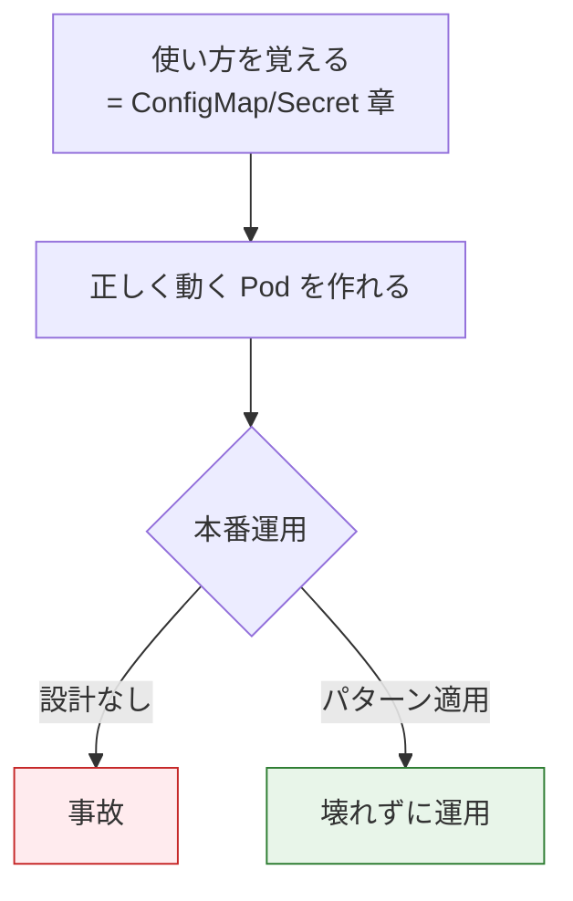

## パターン1: 環境差異の扱い (dev / stg / prod)

最も基本的なパターン。「同じアプリが環境ごとに違う設定で動く」をどう実現するか。

### 選択肢の俯瞰

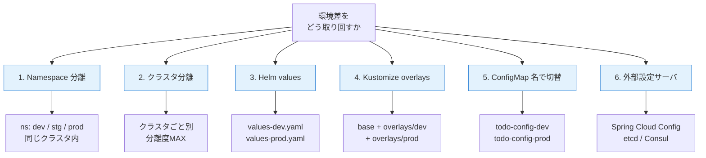

### 1-1. Namespace 分離

同じクラスタ内で `dev`, `stg`, `prod` という Namespace を作り、それぞれに ConfigMap / Secret を持たせる。

```yaml
# dev Namespace
apiVersion: v1
kind: ConfigMap
metadata:
  name: todo-config
  namespace: dev
data:
  LOG_LEVEL: debug
  DB_HOST: postgres-dev.dev.svc.cluster.local
---
# prod Namespace
apiVersion: v1
kind: ConfigMap
metadata:
  name: todo-config
  namespace: prod
data:
  LOG_LEVEL: warn
  DB_HOST: postgres-prod.prod.svc.cluster.local
```

**メリット**:

- シンプル
- 1 つのクラスタで完結
- RBAC で開発者を dev / stg のみに制限可能
- リソース効率が良い

**デメリット**:

- 「prod だけ別マシン」のような物理分離はできない
- prod の障害が dev のリソース不足を引き起こす可能性
- セキュリティ的に「同居」がポリシー違反な組織もある

**いつ選ぶ**:

- 小〜中規模、コストを抑えたい
- dev / stg の信頼性要件がそこまで高くない
- 学習・社内ツール的なクラスタ

### 1-2. クラスタ分離

dev クラスタと prod クラスタを完全に分ける。

**メリット**:

- 物理的な分離(セキュリティ / 障害分離)
- prod の Kubernetes バージョンアップを慎重にできる
- リソース競合なし

**デメリット**:

- コスト増(ただしクラウドなら NodePool 使い分けでマネージドコストは似たような額に)
- マルチクラスタ運用の複雑性(GitOps / マルチクラスタ管理ツール必要)

**いつ選ぶ**:

- 金融・医療など規制要件
- 完全な信頼性分離が必要

VMware kubeadm 環境を使う本教材では、ローカルなので 1 クラスタで Namespace 分離が現実的です。

### 1-3. Helm values

Helm の `values.yaml` で値を切り替えます。

ディレクトリ構成例:

```
charts/todo/
├── Chart.yaml
├── values.yaml             # 既定値
├── values-dev.yaml         # dev 上書き
├── values-stg.yaml
├── values-prod.yaml
└── templates/
    ├── deployment.yaml
    ├── configmap.yaml
    └── secret.yaml
```

`values.yaml`:

```yaml
config:
  logLevel: info
  dbHost: postgres
  dbPort: 5432

resources:
  requests:
    cpu: 100m
    memory: 256Mi

replicas: 2
```

`values-prod.yaml`:

```yaml
config:
  logLevel: warn

resources:
  requests:
    cpu: 500m
    memory: 1Gi
  limits:
    cpu: 1000m
    memory: 2Gi

replicas: 6
```

`templates/configmap.yaml`:

```yaml
apiVersion: v1
kind: ConfigMap
metadata:
  name: {{ .Release.Name }}-config
data:
  LOG_LEVEL: {{ .Values.config.logLevel | quote }}
  DB_HOST: {{ .Values.config.dbHost | quote }}
  DB_PORT: {{ .Values.config.dbPort | quote }}
```

デプロイ:

```bash
helm install todo ./charts/todo -f values-dev.yaml -n dev
helm install todo ./charts/todo -f values-prod.yaml -n prod
```

**メリット**:

- パッケージとしてバージョン管理できる
- helm のリリースとロールバック機能を活用できる
- Helm Hub / OCI レジストリで Chart を配布できる

**デメリット**:

- Go テンプレートの可読性が下がりやすい
- 「YAML を書けば動く」直感性は失われる
- `--dry-run` で出した結果と実際の apply 結果に差が出ることが稀にある

### 1-4. Kustomize overlays

Kustomize は `base` と `overlays` の構造で差分管理します。

```
config/
├── base/
│   ├── kustomization.yaml
│   ├── deployment.yaml
│   └── configmap.yaml
└── overlays/
    ├── dev/
    │   ├── kustomization.yaml
    │   └── configmap-patch.yaml
    ├── stg/
    │   ├── kustomization.yaml
    │   └── configmap-patch.yaml
    └── prod/
        ├── kustomization.yaml
        └── configmap-patch.yaml
```

`base/kustomization.yaml`:

```yaml
apiVersion: kustomize.config.k8s.io/v1beta1
kind: Kustomization
resources:
- deployment.yaml
- configmap.yaml
```

`overlays/prod/kustomization.yaml`:

```yaml
apiVersion: kustomize.config.k8s.io/v1beta1
kind: Kustomization
namespace: prod
resources:
- ../../base
patches:
- path: configmap-patch.yaml
images:
- name: 192.168.56.10:5000/todo-api
  newTag: 0.1.0-prod
```

`overlays/prod/configmap-patch.yaml`:

```yaml
apiVersion: v1
kind: ConfigMap
metadata:
  name: todo-config
data:
  LOG_LEVEL: warn
  DB_HOST: postgres-prod
```

デプロイ:

```bash
kubectl apply -k overlays/prod/
```

**メリット**:

- 純粋な YAML(テンプレート言語なし)
- kubectl にネイティブ統合(`-k` フラグ)
- 差分が patch ファイルで明示される

**デメリット**:

- 大きな差分があると patch ファイルが煩雑になる
- ループや条件分岐が苦手(Helm の方が柔軟)

### 1-5. ConfigMap 名で切替

1 つの Namespace 内で `todo-config-dev` / `todo-config-prod` のように名前を変える。

**お勧めしません**。Pod 側で参照名を切り替える必要があり、Deployment YAML も環境ごとに変わってしまいます。Namespace 分離の劣化版になります。

### 1-6. 外部設定サーバ

[Spring Cloud Config], [etcd], [HashiCorp Consul] などの外部 KV ストアからアプリが起動時 / 動的に取得する。

**メリット**:

- 動的設定変更(Pod 再起動不要)
- 複数クラスタ・複数言語で統一

**デメリット**:

- 外部依存が増える
- 設定の参照履歴を Git で追えない
- アプリ側に設定読み込みクライアントが必要

Kubernetes の ConfigMap で完結できる範囲では、まずそれで十分です。

### 比較表

| 手段 | 分離度 | 運用コスト | テンプレート機能 | 推奨規模 |
|------|--------|------------|------------------|----------|
| Namespace 分離(平 YAML) | △ | 低 | なし(コピペ) | 〜小 |
| Helm | △〜◎ | 中 | 強力(Goテンプレート) | 中〜大 |
| Kustomize | △〜◎ | 低 | 弱(patch のみ) | 小〜中 |
| Helm + Kustomize 併用 | ◎ | 中 | 両者の良いとこ取り | 大 |
| クラスタ分離 | ◎ | 高 | (上の手段と組合せ) | 規制対応 |

本教材では 7 章で Helm と Kustomize の両方を扱います。実務でも併用が普通です(Helm Chart を Kustomize で更にパッチする)。

## パターン2: 設定の更新を反映させる

ConfigMap / Secret を更新しても、env / envFrom 経由の値は Pod 再起動まで反映されません。これを自動化する 4 つのパターン。

### 全体像

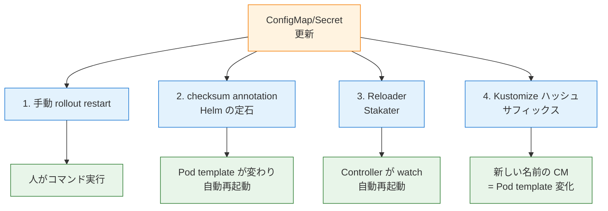

### 2-1. 手動 rollout restart

```bash
kubectl rollout restart deployment/todo-api
kubectl rollout restart statefulset/postgres
```

**動作**: Deployment の Pod template の annotation `kubectl.kubernetes.io/restartedAt` を現在時刻に書き換える → Pod template ハッシュが変わる → 新 ReplicaSet → ローリング更新。

**いつ使うか**: アドホックに更新したいとき、本格的な自動化が要らないとき。

**注意**:

- 「全 Deployment を restart したい」場合は工夫が必要

```bash
# 該当ラベルの全 Deployment を restart
kubectl get deploy -l part-of=todo -o name | xargs -I {} kubectl rollout restart {}
```

### 2-2. checksum annotation (Helm)

Helm の Chart で頻出のパターン。

```yaml
# templates/deployment.yaml
apiVersion: apps/v1
kind: Deployment
metadata:
  name: {{ .Release.Name }}-api
spec:
  template:
    metadata:
      annotations:
        checksum/config: {{ include (print $.Template.BasePath "/configmap.yaml") . | sha256sum }}
        checksum/secret: {{ include (print $.Template.BasePath "/secret.yaml") . | sha256sum }}
```

**仕組み**:

1. ConfigMap YAML をテンプレート展開した文字列を sha256 ハッシュ化
2. annotation の値が変わる
3. Pod template ハッシュが変わる
4. ローリング更新

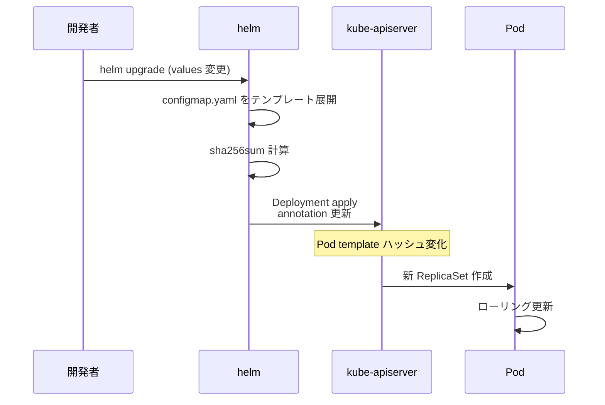

**メリット**:

- Helm Chart 内で完結
- `helm upgrade` 一発で済む
- 中央集権的なコントローラ不要

**デメリット**:

- Helm 専用(plain YAML / Kustomize では使えない)
- ConfigMap が同 Chart 内にないと使えない

### 2-3. Reloader (Stakater)

[stakater/Reloader](https://github.com/stakater/Reloader) はクラスタ内に常駐し、ConfigMap / Secret の変更を watch して該当 Deployment を自動再起動するコントローラ。

インストール:

```bash
helm repo add stakater https://stakater.github.io/stakater-charts
helm install reloader stakater/reloader --namespace kube-system
```

使い方:

```yaml
apiVersion: apps/v1
kind: Deployment
metadata:
  name: todo-api
  annotations:
    # 特定の ConfigMap / Secret を監視
    configmap.reloader.stakater.com/reload: "todo-config"
    secret.reloader.stakater.com/reload: "todo-secret"

    # または「自動検出」モード(envFrom で参照しているものを自動監視)
    reloader.stakater.com/auto: "true"
```

**仕組み**:

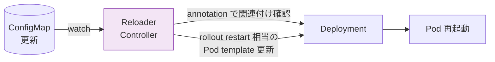

**メリット**:

- どのテンプレートツールでも使える(plain YAML / Helm / Kustomize)
- annotation 一行で済む
- 細かい監視対象の指定が可能

**デメリット**:

- 追加のコントローラを運用する必要がある
- annotation の追加忘れで自動化されない

### 2-4. Kustomize の生成器によるハッシュサフィックス

Kustomize の `configMapGenerator` は、生成する ConfigMap 名に **内容ハッシュのサフィックス** を付けます。

```yaml
# kustomization.yaml
configMapGenerator:
- name: todo-config
  literals:
  - LOG_LEVEL=info
  - DB_HOST=postgres
```

ビルドすると:

```yaml
# kubectl kustomize .
apiVersion: v1
kind: ConfigMap
metadata:
  name: todo-config-h7f4k2m9b8       # ← ハッシュ付き
data:
  LOG_LEVEL: info
  DB_HOST: postgres
```

そして Deployment 側の参照も自動でこの名前に書き換わります(Kustomize の `nameReference` 機能)。

```yaml
# 元の Deployment(変えていない)
spec:
  containers:
  - envFrom:
    - configMapRef:
        name: todo-config            # ← ここ

# kustomize build 後
        name: todo-config-h7f4k2m9b8 # ← 自動置換
```

**仕組み**:

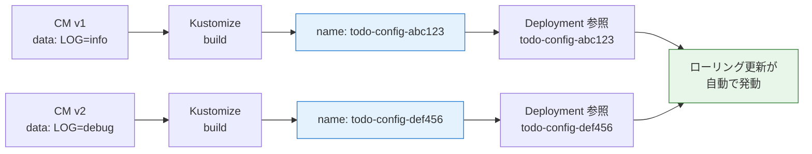

**メリット**:

- Kustomize ネイティブで追加ツール不要
- 古い ConfigMap が「歴史」として残る(ロールバックが楽)
- Deployment YAML を一切変えなくてよい

**デメリット**:

- ConfigMap が増え続ける(GC 機構なし)
- `disableNameSuffixHash: true` にすると効果なし
- 名前を直接参照する他のコンポーネントとの相性

**ハッシュ無効化したい場合**:

```yaml
configMapGenerator:
- name: todo-config
  literals:
  - LOG_LEVEL=info
generatorOptions:
  disableNameSuffixHash: true
```

ただしこれだと自動再起動効果は得られないため、Reloader 等と併用します。

### パターン2の選択指針

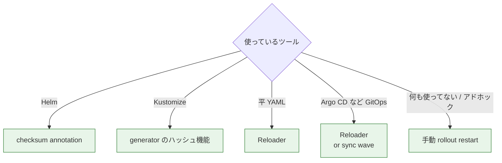

## パターン3: 機密情報の管理ライフサイクル

「Secret を作って apply」だけでは本番運用が回りません。機密情報のライフサイクル全体を設計する必要があります。

### ライフサイクル全体像

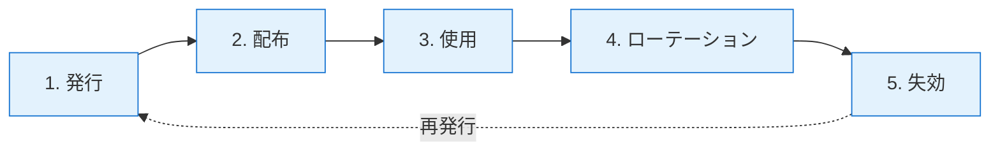

### 3-1. 発行: 機密はどこで作られるか

| 機密の種類 | 発行元 |
|-----------|--------|
| DB パスワード | DBA が手動 / IaC で作成 |
| API トークン | プロバイダーのコンソール |
| TLS 証明書 | cert-manager (Let's Encrypt) / 社内 CA |
| アプリ間の JWT 鍵 | アプリ起動時に生成 / 鍵管理サーバ |
| ServiceAccount トークン | Kubernetes が自動 (1.24 以前) / 手動 |

「Kubernetes の Secret に入れる」のは **配布の手段** であって発行ではない、と区別します。

### 3-2. 配布: Git にどう載せるか

ここが各組織で最も悩む箇所。前 Secret 章のおさらい:

| 手法 | Git 安全 | 復号場所 | 学習コスト |
|------|---------|----------|------------|
| Secret 直書き YAML | ✗ | - | 低 |
| .env を別管理 | △ | 開発者 PC | 低 |
| Sealed Secrets | ◯ | クラスタ controller | 中 |
| SOPS + Helm Secrets | ◯ | helm install 時(KMS復号) | 中 |
| External Secrets Operator | ◯ | クラスタ controller(参照のみ) | 中 |
| Vault Agent Injector | ◯ | Pod sidecar | 高 |

#### Sealed Secrets の仕組み詳解

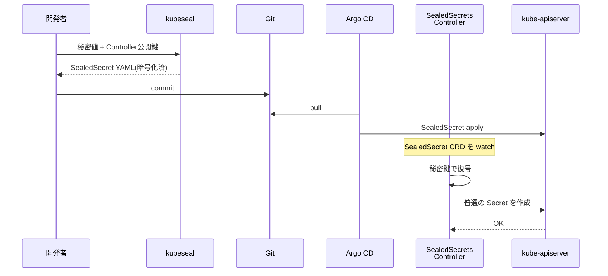

**運用上の重要ポイント**:

- **Controller の秘密鍵を必ずバックアップ**(これを失うと全 SealedSecret が復号不能)
- 鍵ローテーション機能あり(controller が定期更新、過去鍵で復号可能)
- Namespace スコープ:暗号化時に Namespace 名と Secret 名がバインドされる(他 Namespace への流用不可)

#### SOPS の仕組み詳解

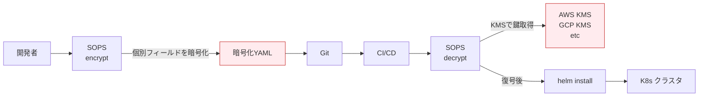

**特徴**:

- ファイル単位ではなく **YAML フィールド単位** で暗号化(`password: ENC[AES256_GCM,...]`)
- KMS / PGP / age 鍵で暗号化
- Git diff で「どこが変わったか」が見える(暗号化値の差分は無意味だが、構造は見える)

#### External Secrets Operator の仕組み詳解

```mermaid
flowchart TB
    subgraph "Git"
        ES[ExternalSecret CR]
    end

    subgraph "クラスタ"
        ESO[ESO Controller]
        SS[SecretStore CR<br/>接続情報]
        SEC[Secret<br/>(自動生成)]
    end

    subgraph "外部"
        VAULT[Vault / AWS SM<br/>GCP Secret Manager]
    end

    ES --> ESO
    SS --> ESO
    ESO -->|認証情報で接続| VAULT
    VAULT -.値.-> ESO
    ESO --> SEC

    classDef cr fill:#e3f2fd,stroke:#1976d2
    classDef ext fill:#fff3e0,stroke:#f57c00
    class ES,SS,ESO cr
    class VAULT ext
```

`ExternalSecret` CR の例:

```yaml
apiVersion: external-secrets.io/v1beta1
kind: ExternalSecret
metadata:
  name: todo-secret
spec:
  refreshInterval: 1h          # 定期リフレッシュ
  secretStoreRef:
    name: vault-backend
    kind: SecretStore
  target:
    name: todo-secret           # 生成される Secret 名
  data:
  - secretKey: DB_PASSWORD
    remoteRef:
      key: secret/data/todo
      property: db_password
  - secretKey: JWT_SECRET
    remoteRef:
      key: secret/data/todo
      property: jwt_secret
```

これを apply すると、ESO が Vault から値を取得して `todo-secret` という名前の通常の Secret を生成します。Pod は普通の Secret として参照すればよく、ESO の存在をアプリは意識しません。

### 3-3. 使用: Pod への注入

これは Secret 章で扱った 3 通り(env, envFrom, volume mount)。本番では Volume mount + tmpfs を推奨。

### 3-4. ローテーション

機密は定期的に更新する必要があります(漏洩のブラスト半径を限定するため)。

| 機密 | 推奨ローテ周期 | 自動化手段 |
|------|----------------|------------|
| TLS 証明書 | 90 日 (Let's Encrypt 既定) | cert-manager |
| DB パスワード | 90 日〜180 日 | Vault Database Engine, Kustomize ハッシュ |
| API トークン | サービス次第 | External Secrets で自動同期 |
| Bound SA Token | 1 時間 (kubelet 自動) | 自動 |
| etcd 暗号化鍵 | 90 日〜年次 | KMS Provider v2 |

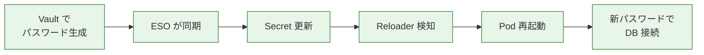

完全自動ローテーションのチェーンは、**Vault → ESO → Reloader → Deployment** という連鎖で構成されます。

### 3-5. 失効: 漏洩時の対処

漏洩は起きるものとして手順を準備します。

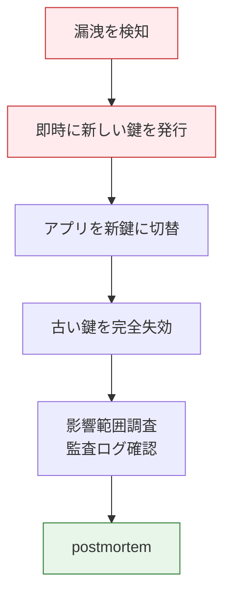

「漏れたのは確実だが、いつから漏れていたかわからない」というケースが大半。**漏洩を検知できる仕組み**(audit log + 不審アクセス検知)を平時から整えるのが本質です。

## パターン4: 12-Factor App との整合

[The Twelve-Factor App](https://12factor.net/) の第 III「設定」項は次のように述べています(意訳):

> 設定は環境変数に格納する。コードと設定を厳密に分離する。
> 「設定」とは、デプロイ間で異なる可能性のあるすべて(DB ハンドル、外部サービスのクレデンシャル、デプロイごとの値)を指す。
> 設定をコードに含めると、コミットで漏れる事故が起きる。
> 設定ファイルにする派もいるが、ファイルは Git に意図せず入る、フォーマットが言語ごとにばらける、といった問題がある。
> 環境変数は OS レベル、言語非依存で標準的なやり方であり、これを推奨する。

Kubernetes の ConfigMap / Secret はこの考えを正しく実装したものです。ただし、12-Factor が書かれた 2011 年から状況は進化しています。

### 12-Factor の現代的解釈

| 12-Factor の主張 | 2025 年の現実 |
|------------------|---------------|
| 設定は環境変数 | 環境変数 + ファイル(volume mount)も可 |
| 設定ファイルはダメ | tmpfs でマウントされる Secret なら OK(ノードに残らない) |
| dotenv は反 12-Factor | dev では便利、prod は ConfigMap/Secret |
| クラウド時代以前 | KMS / Vault との統合が前提 |

### 12-Factor 準拠チェックリスト

- [ ] イメージは環境間で同一(prod / dev で別ビルドしていない)
- [ ] アプリは環境変数 or 標準パスのファイルから設定を読む
- [ ] 設定ファイルが Git に commit されていない(機密値含む)
- [ ] `imagePullPolicy: IfNotPresent` で動く構成(イメージ不変なので)
- [ ] 環境差は ConfigMap / Secret / Helm values で表現(Dockerfile を分けない)

### Configuration as Code との関係

12-Factor の「設定」は値そのものですが、**「設定の定義」(ConfigMap / Secret YAML)もコード** です。これは:

- Git で履歴管理
- PR レビューで変更を承認
- CI/CD でデプロイ
- ロールバック可能

を意味します。GitOps はこの哲学の到達点で、「Git に書いてある状態がクラスタの正」というアプローチを徹底します(8〜9 章で詳説)。

## パターン5: 「設定」と「機密」の境界線

ConfigMap と Secret のどちらに入れるか? 組織方針として答えられる必要があります。

### 分類フローチャート

```mermaid
flowchart TB
    Q[ある値を<br/>どちらに入れるか]

    Q --> Q1{Git に書いて<br/>公開しても OK?}

    Q1 -- 完全に OK --> CM[ConfigMap]
    Q1 -- 微妙 / NG --> Q2{法令・監査要件で<br/>機密扱い?}

    Q2 -- Yes --> SEC[Secret]
    Q2 -- No --> Q3{漏れたら<br/>不便?サービス停止?]

    Q3 -- 不便程度 --> CM
    Q3 -- 停止 / 損害 --> SEC

    classDef cm fill:#e3f2fd,stroke:#1976d2
    classDef sec fill:#ffebee,stroke:#c62828
    class CM cm
    class SEC sec
```

### よくある分類

| 値の例 | 推奨先 | 理由 |
|--------|--------|------|
| ログレベル | ConfigMap | 公開しても損害ゼロ |
| タイムアウト値 | ConfigMap | 設定値、機密性なし |
| 機能フラグ | ConfigMap | 機能の有無は機密でない |
| DB ホスト名 | ConfigMap | サービス名は内部なら通常公開 OK |
| Redis ホスト名 | ConfigMap | 同上 |
| DB ユーザー名 | **組織方針による** | 単独で漏れても無害だが、組織によっては機密扱い |
| DB パスワード | Secret | 言うまでもなく |
| API トークン | Secret | 同上 |
| JWT 署名鍵 | Secret | 漏れたら認証バイパス |
| TLS 秘密鍵 | Secret(`tls`型) | 漏れたら成り済まし可能 |
| 外部 API URL | ConfigMap | 通常は公開 |
| 外部 API URL(認証付き) | URL は ConfigMap、トークンは Secret | 分離する |
| GeoIP DB のパス | ConfigMap | データの場所は機密でない |
| メール送信元アドレス | ConfigMap | |
| メール送信用 SMTP パスワード | Secret | |
| ライセンスキー | Secret | 漏れたら不正利用される |
| Slack Webhook URL | Secret | URL 自体が秘密(URL に認証が含まれる) |

### グレーゾーンの判断

「どっち?」と迷うなら **Secret に入れる** が安全側です。Secret に入れて困ることは少ない(Volume mount で更新が反映される、tmpfs で守られる)、ConfigMap に入れて漏れた時の損害は大きい、という非対称性があります。

### 命名による事故防止

ConfigMap と Secret で同じ「DB 関連の値」を扱う場合、命名で混乱しないようにします。

```yaml
# ConfigMap
data:
  DB_HOST: postgres
  DB_PORT: "5432"
  DB_NAME: todo
  DB_USER: todo

# Secret
data:
  DB_PASSWORD: ...
  # DB_HOST のような非機密はあえて入れない
```

「Secret には機密だけ、ConfigMap には機密でないものだけ」というルールを徹底すると、`grep DB_PASSWORD secret.yaml` で機密だけ追跡できる、運用が楽になります。

### 機密値が ConfigMap に紛れ込んでないかチェック

```bash
# シンプルに目視
kubectl get configmap -A -o yaml | grep -iE "password|token|secret|key" | grep -v "name:"

# Polaris や Kyverno でポリシー化
```

Kyverno のポリシー例:

```yaml
apiVersion: kyverno.io/v1
kind: ClusterPolicy
metadata:
  name: forbid-secrets-in-configmap
spec:
  validationFailureAction: Audit
  rules:
  - name: check-suspicious-keys
    match:
      any:
      - resources:
          kinds: [ConfigMap]
    validate:
      message: "ConfigMap key looks like a secret. Use Secret instead."
      pattern:
        =(data):
          X(*PASSWORD*): ""
          X(*TOKEN*): ""
          X(*SECRET*): ""
```

(完璧ではないが、明らかな事故防止には有効)

## パターン6: マルチテナント設計

複数のテナント(部署、顧客、プロジェクト)が同じクラスタを共有する場合の設定設計。

### 共有 vs 分離の判断

```mermaid
flowchart TB
    Q[ある設定を<br/>どう扱うか]

    Q --> Q1{テナント間で<br/>共通?}

    Q1 -- 共通 --> Q2{機密性は?}
    Q2 -- なし --> SCM[クラスタ全体共有<br/>kube-system等の<br/>ConfigMap]
    Q2 -- あり --> SHS[共有 Secret<br/>を Reflector で配布]

    Q1 -- テナントごと --> Q3{Namespace 分離?}
    Q3 -- Yes --> NCM[Namespace 内に<br/>ConfigMap/Secret]
    Q3 -- No (ラベル分離) --> LCM[ラベルセレクタで分離<br/>(非推奨)]

    classDef opt fill:#e3f2fd,stroke:#1976d2
    class SCM,SHS,NCM,LCM opt
```

### テナントごとに ConfigMap / Secret を持つ場合

各 Namespace = 各テナント、というモデルが基本。

```bash
# テナント A
kubectl create namespace tenant-a
kubectl apply -f configmap.yaml -n tenant-a

# テナント B
kubectl create namespace tenant-b
kubectl apply -f configmap.yaml -n tenant-b
```

Namespace 単位で RBAC を設定し、各テナントが自分の Secret しか触れないようにします。

### 共有設定をどう配布するか

「全テナントが同じレジストリ認証情報を使う」「クラスタ共通のロガーアドレスを ConfigMap で配る」といったケース。

**手段**:

1. **手動で全 Namespace に複製**: 数が少なければ
2. **kubectl loop**: bash スクリプトで apply
3. **[Reflector]**: アノテーション指定で自動複製
4. **External Secrets Operator のテンプレート**: `ClusterExternalSecret` で全 Namespace に配布
5. **Kyverno generate ポリシー**: Namespace 作成時に自動生成

#### Reflector の例

```yaml
apiVersion: v1
kind: Secret
metadata:
  name: regcred
  namespace: kube-system
  annotations:
    reflector.v1.k8s.emberstack.com/reflection-allowed: "true"
    reflector.v1.k8s.emberstack.com/reflection-allowed-namespaces: "tenant-.*"
    reflector.v1.k8s.emberstack.com/reflection-auto-enabled: "true"
type: kubernetes.io/dockerconfigjson
data:
  .dockerconfigjson: ...
```

`tenant-` で始まる全 Namespace に自動で複製されます。

#### Kyverno generate の例

```yaml
apiVersion: kyverno.io/v1
kind: ClusterPolicy
metadata:
  name: sync-regcred
spec:
  rules:
  - name: sync-secret
    match:
      any:
      - resources:
          kinds: [Namespace]
    generate:
      apiVersion: v1
      kind: Secret
      name: regcred
      namespace: "{{request.object.metadata.name}}"
      synchronize: true
      clone:
        namespace: kube-system
        name: regcred
```

新しい Namespace が作られると自動で `regcred` がコピーされます。

## パターン7: 設定の検証

「ConfigMap に間違った値を入れて Pod が落ちる」を未然に防ぐパターン。

### Kubernetes ネイティブの仕組み

Kubernetes 自体は ConfigMap / Secret の **値の中身** は検証しません(キーの形式や型くらい)。「PORT に 'abc' を入れた」「LOG_LEVEL に 'invalid' を入れた」を Kubernetes 側でブロックする標準機能はないのです。

### Admission Webhook による検証

[ValidatingAdmissionWebhook] でカスタム検証を入れられます。OPA Gatekeeper / Kyverno が代表的なツール。

#### Kyverno の例: PORT が数値であることを検証

```yaml
apiVersion: kyverno.io/v1
kind: ClusterPolicy
metadata:
  name: validate-configmap-port
spec:
  validationFailureAction: Enforce
  rules:
  - name: port-must-be-numeric
    match:
      any:
      - resources:
          kinds: [ConfigMap]
          names: ["todo-config"]
    validate:
      message: "PORT must be a numeric string"
      pattern:
        data:
          PORT: "?(0|[1-9][0-9]*)"
```

#### OPA Gatekeeper の例: LOG_LEVEL が許可された値か

```yaml
apiVersion: templates.gatekeeper.sh/v1
kind: ConstraintTemplate
metadata:
  name: validloglevel
spec:
  crd:
    spec:
      names:
        kind: ValidLogLevel
  targets:
    - target: admission.k8s.gatekeeper.sh
      rego: |
        package validloglevel
        valid := {"debug", "info", "warn", "error"}
        violation[{"msg": msg}] {
          input.review.object.kind == "ConfigMap"
          level := input.review.object.data.LOG_LEVEL
          not valid[level]
          msg := sprintf("LOG_LEVEL must be one of %v, got %v", [valid, level])
        }
```

### CI 側での検証

cluster に届く前に CI で検証する方法も。

```yaml
# .github/workflows/lint.yml
- name: Validate ConfigMap
  run: |
    kubectl apply --dry-run=server -f configmap.yaml
    yq '.data.PORT' configmap.yaml | grep -E '^"?[0-9]+"?$' || exit 1
```

CI 側ですべてバリデーションすると、開発者がローカルで早期にエラー検知できます。

## パターン8: GitOps と ConfigMap / Secret

Argo CD / Flux などの GitOps ツールを使う場合、設計上の追加考慮が出てきます。

### GitOps の前提

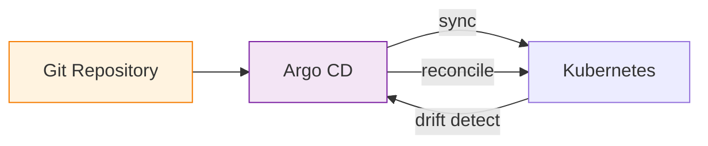

「Git に書いてある状態 = クラスタの正」が原則。`kubectl edit` で直接変更すると、次の reconcile で元に戻されます。

### ConfigMap の更新フロー

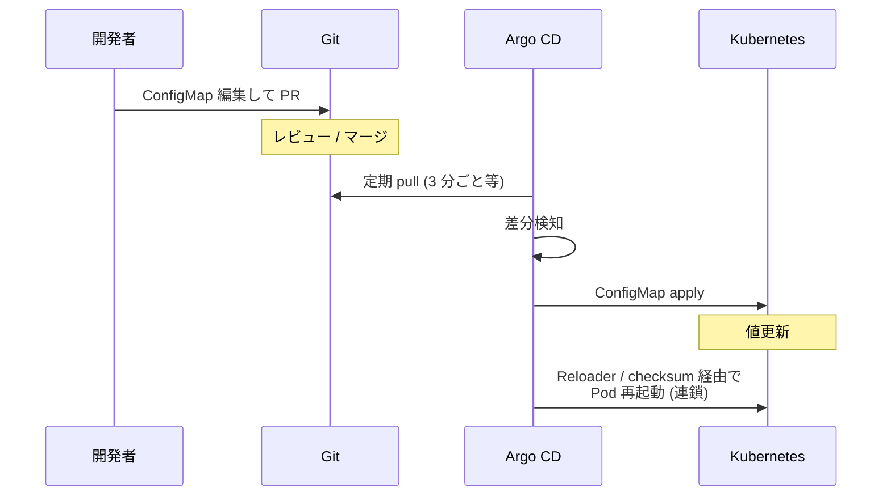

### Secret の扱い ─ Sealed Secrets が定石

GitOps と Secret は本来相性が悪い(Git に Secret を生で置けない)。これを解決するのが Sealed Secrets / SOPS / External Secrets。

```mermaid
flowchart TB
    subgraph "Git"
        SS[SealedSecret YAML<br/>(暗号化済)]
    end

    subgraph "クラスタ"
        ARGO[Argo CD]
        SC[SealedSecrets<br/>Controller]
        SEC[Secret]
        DEP[Deployment]
    end

    SS -->|sync| ARGO
    ARGO --> SC
    SC -->|復号| SEC
    SEC --> DEP

    classDef sec fill:#e8f5e9,stroke:#2e7d32
    class SS,SEC sec
```

### Drift Detection と Secret

Argo CD は ConfigMap / Secret の drift(誰かが手動で変更したこと)を検知し、Git の値に戻します。これは「正規のデプロイが上書きされた」を防ぎますが、

- 緊急時に手動で Secret を直す → 元に戻る → 慌てる
- ESO で動的取得した値を Argo が「drift」と認識 → ループ

といった事故が起きます。対処:

- Argo CD の `ignoreDifferences` で特定の Secret は無視
- ESO で生成される Secret は Argo の管理対象から除外
- 緊急変更時は Argo の sync を一時無効化

```yaml
# Application
apiVersion: argoproj.io/v1alpha1
kind: Application
spec:
  ignoreDifferences:
  - group: ""
    kind: Secret
    jsonPointers:
    - /data
```

## パターン9: 巨大設定への対処

ConfigMap の 1 MiB 制限を超えるケースの設計。

### 戦略

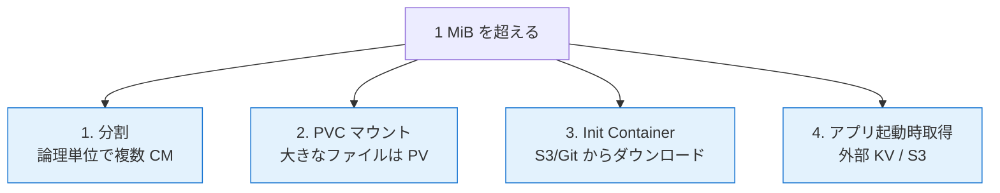

### 分割

論理的にまとまる単位で複数 ConfigMap に分けます。

```yaml
# todo-app-config: アプリ動作設定
data:
  LOG_LEVEL: info
  WORKERS: "4"
---
# todo-db-config: DB 接続情報
data:
  DB_HOST: postgres
  DB_PORT: "5432"
---
# todo-features-config: 機能フラグ
data:
  FEATURE_A: "true"
  FEATURE_B: "false"
```

Pod では複数 ConfigMap を並べて参照:

```yaml
envFrom:
- configMapRef:
    name: todo-app-config
- configMapRef:
    name: todo-db-config
- configMapRef:
    name: todo-features-config
```

### PVC マウント ─ NFS で大規模設定 / データを配布する完全ガイド

ここからは長丁場です。「ConfigMap で配れない大きなデータ(GeoIP DB、機械学習モデル、Grafana ダッシュボード集、大量の static アセット、Web アプリのテーマ素材など)」を **NFS 経由の PersistentVolume(PV)** で扱う方法を、サーバ構築から運用までフル手順で解説します。

なぜ NFS かというと、本教材の VMware kubeadm 環境では `k8s-nfs (192.168.56.30)` を NFS サーバとして使う前提だからです。クラウドの EFS / Filestore / Azure Files も NFS プロトコルなので、ここで学ぶ知識はそのまま流用できます。

#### なぜ NFS を選ぶか ─ 他の選択肢との比較

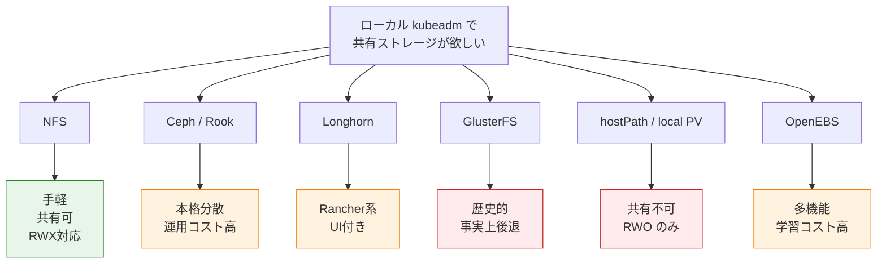

| ストレージ | アクセスモード | 学習コスト | 運用コスト | 本教材での扱い |
|-----------|---------------|------------|------------|----------------|
| **NFS** | **RWX 可** | **低** | **低** | **本章 + 7章で実装** |
| Ceph / Rook | RWX 可 | 高 | 高 | 11章で軽く触れる |
| Longhorn | RWO + RWX | 中 | 中 | 任意演習 |
| GlusterFS | RWX 可 | 中 | 中(衰退傾向) | 扱わない |
| hostPath | RWO のみ | 低 | 中 | 5 章で扱った |
| local PV | RWO のみ | 低 | 中 | 5 章で扱った |
| OpenEBS | 多様 | 高 | 中 | 扱わない |

NFS が選ばれる主な理由:

1. **RWX (ReadWriteMany)** をサポート: 複数の Pod から同時に読み書きできる。ConfigMap の代替として大きなデータを **複数レプリカに同じ内容で見せたい** 用途に適合
2. **設定が単純**: Linux カーネルが標準で持つプロトコル、`/etc/exports` 1 行で公開
3. **クラウドでも使える**: AWS EFS / GCP Filestore / Azure Files (NFS) いずれも NFSv4 互換。学習が無駄にならない
4. **既存資産との親和性**: 社内に既にある NFS サーバを Kubernetes に取り込みやすい

NFS の弱み:

- 単一サーバが SPOF(冗長化は別途、後述)
- レイテンシ重視のワークロード(DB)には向かない
- ロックの仕組みが弱い(`flock` は動くが、SQLite のような細かい排他は壊れることがある)

#### NFS と Kubernetes の関係 ─ アーキテクチャ俯瞰

```mermaid
flowchart TB
    subgraph "NFS サーバ k8s-nfs 192.168.56.30"
        EXP[/srv/nfs/k8s/<br/>共有ディレクトリ]
        EXPORTS[/etc/exports]
        NFSD[nfs-kernel-server]
        EXPORTS --> NFSD
        NFSD --> EXP
    end

    subgraph "Kubernetes クラスタ"
        subgraph "Worker ノード k8s-w1/w2/w3"
            KUBELET[kubelet]
            CSI[NFS-CSI<br/>Node Plugin]
            POD[Pod]
            POD --> CSI
            CSI --> KUBELET
        end

        subgraph "Control Plane"
            APISERVER[kube-apiserver]
            CSICTL[NFS-CSI<br/>Controller Plugin]
            CSICTL --> APISERVER
        end

        SC[StorageClass<br/>nfs]
        PVC[PersistentVolumeClaim]
        PV[PersistentVolume]

        SC --> CSICTL
        CSICTL --> PV
        PVC --> PV
        POD --> PVC
    end

    KUBELET -.NFSv4 mount.-> NFSD

    classDef server fill:#fff3e0,stroke:#f57c00
    classDef k8s fill:#e3f2fd,stroke:#1976d2
    classDef storage fill:#f3e5f5,stroke:#7b1fa2
    class EXP,EXPORTS,NFSD server
    class KUBELET,CSI,CSICTL,APISERVER,POD k8s
    class SC,PVC,PV storage
```

登場人物が多いので整理します。

- **NFS サーバ (k8s-nfs)**: Linux 上で `nfs-kernel-server` を動かし、`/etc/exports` で「どのディレクトリを誰に公開するか」を定義
- **NFS-CSI ドライバ**: Kubernetes に NFS を「動的プロビジョナ」として認識させるためのもの。Controller Plugin と Node Plugin の 2 種類が存在
- **StorageClass**: 「どの NFS サーバの、どのパス配下に、どんなオプションでマウントするか」のテンプレート
- **PV / PVC**: 動的プロビジョニングなら PVC を作るだけで PV が自動生成される
- **Pod**: PVC を参照するだけで、自動的に NFS マウントを使える

これからこの全部を、k8s-nfs (192.168.56.30) と Worker ノード(k8s-w1〜w3)の上に構築していきます。

#### Step 1: NFS サーバ(k8s-nfs)の OS 準備

まず NFS サーバ役の VM `k8s-nfs (192.168.56.30)` に SSH でログインします。

```bash
ssh ubuntu@192.168.56.30
```

ホスト名を確認:

```bash
hostnamectl
```

**期待される出力**:

```
   Static hostname: k8s-nfs
         Icon name: computer-vm
           Chassis: vm
        Machine ID: 5b8f2e3c1d6a4e7b9c0d1e2f3a4b5c6d
           Boot ID: 7e8f9a0b1c2d3e4f5a6b7c8d9e0f1a2b
    Virtualization: vmware
  Operating System: Ubuntu 22.04.4 LTS
            Kernel: Linux 5.15.0-101-generic
      Architecture: x86-64
```

OS バージョンを確認:

```bash
cat /etc/os-release | head -3
```

```
PRETTY_NAME="Ubuntu 22.04.4 LTS"
NAME="Ubuntu"
VERSION_ID="22.04"
```

ディスク容量を確認(NFS で配るデータの容量に応じて十分なボリュームを用意します):

```bash
df -hT
```

**期待される出力**:

```
Filesystem     Type      Size  Used Avail Use% Mounted on
/dev/sda2      ext4       50G  3.5G   44G   8% /
/dev/sda3      ext4      100G  500M   95G   1% /srv
tmpfs          tmpfs     2.0G     0  2.0G   0% /run
```

`/srv` を 100GB の別パーティションにしてあるとあとあと楽です。なければルートに切ります。

#### Step 2: NFS サーバパッケージのインストール

```bash
sudo apt update
sudo apt install -y nfs-kernel-server nfs-common
```

**何が起きるか**: NFS サーバ本体(`nfs-kernel-server`)とクライアントツール(`nfs-common`)がインストールされます。

**期待される出力(末尾抜粋)**:

```
Setting up nfs-common (1:2.6.1-1ubuntu1.2) ...
Created symlink /etc/systemd/system/multi-user.target.wants/nfs-client.target → /lib/systemd/system/nfs-client.target.
...
Setting up nfs-kernel-server (1:2.6.1-1ubuntu1.2) ...
Created symlink /etc/systemd/system/multi-user.target.wants/nfs-server.service → /lib/systemd/system/nfs-server.service.
```

サービスの起動状態を確認:

```bash
systemctl status nfs-kernel-server --no-pager
```

```
● nfs-server.service - NFS server and services
     Loaded: loaded (/lib/systemd/system/nfs-server.service; enabled)
     Active: active (exited) since ...
```

**「Active: active (exited)」** で正常です。NFS サーバは「マウントできるディレクトリがないと exited 状態のまま」で、これは異常ではありません。

#### Step 3: NFS の各種デーモンの確認

NFS サーバは複数のデーモンの集合体です。

```bash
sudo rpcinfo -p localhost
```

**期待される出力**:

```
   program vers proto   port  service
    100000    4   tcp    111  portmapper
    100000    3   tcp    111  portmapper
    100000    2   tcp    111  portmapper
    100024    1   udp  37123  status
    100024    1   tcp  35001  status
    100003    3   tcp   2049  nfs
    100003    4   tcp   2049  nfs
    100227    3   tcp   2049
    100021    1   udp  41201  nlockmgr
    100021    3   udp  41201  nlockmgr
    100021    4   udp  41201  nlockmgr
    100021    1   tcp  39891  nlockmgr
    100021    3   tcp  39891  nlockmgr
    100021    4   tcp  39891  nlockmgr
    100005    1   udp  20048  mountd
    100005    1   tcp  20048  mountd
```

押さえるべきデーモンと役割:

| デーモン | ポート | 役割 |
|---------|--------|------|
| `portmapper` (rpcbind) | 111 (TCP/UDP) | RPC サービスのポート問い合わせ受付 |
| `nfsd` | **2049 (TCP)** | NFS 本体。NFSv4 はこのポート 1 つで完結 |
| `mountd` | 20048(可変) | NFSv3 のマウント要求受付。NFSv4 では使われない |
| `nlockmgr` | 可変 | ファイルロック (NFSv3)。NFSv4 では本体に統合 |
| `statd` | 可変 | クラッシュ時の通知 (NFSv3) |

本教材では **NFSv4 を使う** ので、実用上は `2049/tcp` 1 つだけ開けばよいことになります(NFSv3 を併用するならその他も開放)。

#### Step 4: 共有ディレクトリの作成

Kubernetes 用の共有ルートを `/srv/nfs/k8s` に作ります。

```bash
sudo mkdir -p /srv/nfs/k8s
sudo chown nobody:nogroup /srv/nfs/k8s
sudo chmod 0777 /srv/nfs/k8s
```

`chown nobody:nogroup` の意味:

NFS の `root_squash` というデフォルト挙動により、クライアント側で root ユーザーが書き込むと、サーバ側では `nobody:nogroup` (UID/GID = 65534) として書き込まれます。事前に所有者を `nobody:nogroup` にしておくと、root_squash で書き込み権限の不足が起きにくくなります。

`chmod 0777` は学習用の緩い設定です。本番では用途別に細分化(下記セキュリティ章参照)。

ディレクトリ構造例:

```bash
sudo mkdir -p /srv/nfs/k8s/{configs,assets,models,backups}
ls -la /srv/nfs/k8s/
```

**期待される出力**:

```
total 24
drwxrwxrwx 6 nobody nogroup 4096 Mar 15 10:00 .
drwxr-xr-x 3 root   root    4096 Mar 15 09:55 ..
drwxr-xr-x 2 nobody nogroup 4096 Mar 15 10:00 assets
drwxr-xr-x 2 nobody nogroup 4096 Mar 15 10:00 backups
drwxr-xr-x 2 nobody nogroup 4096 Mar 15 10:00 configs
drwxr-xr-x 2 nobody nogroup 4096 Mar 15 10:00 models
```

#### Step 5: /etc/exports の設定

NFS で公開するディレクトリは `/etc/exports` に書きます。

```bash
sudo tee /etc/exports <<'EOF'
# Kubernetes ノード (192.168.56.0/24) に共有する
/srv/nfs/k8s    192.168.56.0/24(rw,sync,no_subtree_check,no_root_squash,fsid=0)
EOF
```

各オプションの意味を 1 つずつ見ていきます。

| オプション | 意味 | 推奨度 |
|-----------|------|--------|
| `192.168.56.0/24` | 公開対象の IP/サブネット | クラスタ内に絞る |
| `rw` | 読み書き可 | ◯ |
| `ro` | 読み取り専用 | 用途次第 |
| `sync` | 同期書き込み(クライアントへの応答前にディスク書き込み) | データ一貫性◎/性能△ |
| `async` | 非同期書き込み | 性能◎/障害時のデータ損失リスク有 |
| `no_subtree_check` | 親ディレクトリの権限再チェックを省略 | 性能◯/必須 |
| `subtree_check` | 親権限を再チェック | 古い動作 |
| `no_root_squash` | クライアント root をサーバ root として扱う | **危険・本番では避ける** |
| `root_squash` | クライアント root を nobody に変換(既定) | ◎ |
| `all_squash` | すべてのユーザーを nobody に | 共有用途で◯ |
| `anonuid=N` | anonymous の UID 指定 | all_squash と組合せ |
| `fsid=0` | NFSv4 のルートエクスポートを示す | NFSv4 で必須 |
| `crossmnt` | サブマウントも公開 | 必要に応じて |
| `sec=krb5` | Kerberos 認証 | 高セキュリティ環境 |

**`no_root_squash` を学習用に有効化** している点に注意してください。NFS-CSI ドライバ経由で Pod が PVC を作るとき、root として書き込みたい場面があるためですが、本番では `root_squash` のままでアプリ側が UID を合わせる方が安全です。

#### Step 6: エクスポート反映

`/etc/exports` を編集しただけでは反映されません。明示的にリロードします。

```bash
sudo exportfs -ra
```

`-r` は再エクスポート、`-a` は全件、合わせて `-ra`。

エクスポート内容を確認:

```bash
sudo exportfs -v
```

**期待される出力**:

```
/srv/nfs/k8s    192.168.56.0/24(sync,wdelay,hide,no_subtree_check,sec=sys,rw,secure,no_root_squash,no_all_squash,fsid=0)
```

`exportfs -v` は明示的に指定していないオプションも展開されます。`secure`(1024 番未満のポートのみ受付)、`wdelay`(書き込み遅延最適化)が補完されているのがわかります。

#### Step 7: ファイアウォールの設定

Ubuntu の UFW(Uncomplicated FireWall)を有効化している場合、NFS ポートを許可します。

```bash
sudo ufw status
```

無効なら飛ばして OK。有効な場合:

```bash
# NFSv4 だけなら 2049 で済む
sudo ufw allow from 192.168.56.0/24 to any port 2049 proto tcp comment 'NFS v4'

# NFSv3 を併用するなら全部開放
sudo ufw allow from 192.168.56.0/24 to any port 111  proto tcp comment 'rpcbind'
sudo ufw allow from 192.168.56.0/24 to any port 111  proto udp
sudo ufw allow from 192.168.56.0/24 to any port 2049 proto tcp comment 'NFS v3/v4'
sudo ufw allow from 192.168.56.0/24 to any port 2049 proto udp

sudo ufw reload
```

確認:

```bash
sudo ufw status numbered
```

iptables を直接使っている場合は同等のルールを追加します。

VMware の Host-only ネットワークなら、ホスト OS 側のファイアウォールも併せて許可が必要なケースがあります(Windows の場合は Defender ファイアウォール、macOS は pfctl など)。

#### Step 8: NFS サーバ再起動と動作確認

```bash
sudo systemctl restart nfs-kernel-server
sudo systemctl status nfs-kernel-server --no-pager
```

ローカルから NFS マウントを試して、まずは動くことを確かめます。

```bash
sudo showmount -e localhost
```

**期待される出力**:

```
Export list for localhost:
/srv/nfs/k8s 192.168.56.0/24
```

「Export list」に共有ディレクトリが表示されれば OK。

#### Step 9: クライアント側(Worker ノード)からの動作確認

NFS サーバから抜けて、Worker ノードの 1 つ(`k8s-w1`、192.168.56.21)に SSH します。

```bash
ssh ubuntu@192.168.56.21
```

クライアントツールがあるか確認:

```bash
which mount.nfs4
```

なければインストール:

```bash
sudo apt update
sudo apt install -y nfs-common
```

これは **すべての Worker ノード(k8s-w1, k8s-w2, k8s-w3)に必要** です。`nfs-common` がないと kubelet が NFS マウントできません。kubeadm 環境構築時に揃えておくのが理想ですが、漏れていたら今追加します。

公開状況を確認:

```bash
showmount -e 192.168.56.30
```

**期待される出力**:

```
Export list for 192.168.56.30:
/srv/nfs/k8s 192.168.56.0/24
```

「Export list」が見えなければファイアウォール、ネットワーク、`/etc/exports` のいずれかの問題です(後述のトラブルシュート参照)。

実際にマウント:

```bash
sudo mkdir -p /mnt/nfs-test
sudo mount -t nfs4 192.168.56.30:/ /mnt/nfs-test
```

注意: `fsid=0` を付けているため、NFSv4 ではエクスポートのルート(`/srv/nfs/k8s`)が `/` に擬似マッピングされます。だから `/mnt/nfs-test` をマウントするとき指定するパスは `192.168.56.30:/`(ホストパスではなく擬似ルート)です。

確認:

```bash
ls /mnt/nfs-test
```

**期待される出力**:

```
assets  backups  configs  models
```

書き込みテスト:

```bash
echo "hello from $(hostname)" | sudo tee /mnt/nfs-test/hello.txt
cat /mnt/nfs-test/hello.txt
```

```
hello from k8s-w1
```

別の Worker (k8s-w2) から同じファイルが見えるか:

```bash
ssh ubuntu@192.168.56.22 'sudo mkdir -p /mnt/nfs-test && sudo mount -t nfs4 192.168.56.30:/ /mnt/nfs-test && cat /mnt/nfs-test/hello.txt'
```

```
hello from k8s-w1
```

これで Worker 間で NFS 共有が成立しています。

確認が終わったらアンマウント:

```bash
sudo umount /mnt/nfs-test
```

これで「素の NFS としては動く」ことが確認できました。次はこの NFS を Kubernetes から使えるようにします。

#### Step 10: NFS-CSI ドライバを選ぶ ─ in-tree から CSI へ

歴史的経緯を 1 段挟みます。Kubernetes には元々 `nfs` というボリュームタイプ(in-tree volume)が組み込まれていました。

```yaml
# 古い書き方(まだ動くがレガシー)
volumes:
- name: data
  nfs:
    server: 192.168.56.30
    path: /
```

これは **静的プロビジョニング** で、PV を手動で作る必要がありました。動的プロビジョニング(PVC を作るだけで PV が生まれる)はサポートされていませんでした。

```mermaid
timeline
    title NFS と Kubernetes ストレージ統合の進化
    2015 : K8s 1.0 : in-tree nfs ボリューム<br/>静的のみ
    2017 : nfs-client-provisioner<br/>(community プロビジョナ)
    2019 : K8s 1.13 : CSI GA<br/>外部ドライバの標準化
    2020 : NFS-CSI 0.x<br/>kubernetes-sigs に移管
    2022 : NFS-CSI 4.x<br/>本番運用に十分な品質
    2023 : K8s 1.27 : in-tree nfs deprecated 議論
    2024 : NFS-CSI 4.7+<br/>事実上の標準
```

現在の推奨は **NFS-CSI ドライバ** ([kubernetes-csi/csi-driver-nfs](https://github.com/kubernetes-csi/csi-driver-nfs)) を使うことです。これにより:

- StorageClass で動的プロビジョニング(PVC 作成だけで PV 自動生成)
- ボリューム展開、スナップショット(限定)などの CSI 標準機能
- in-tree からの脱却(将来削除されても影響なし)

#### Step 11: NFS-CSI ドライバのインストール(Helm 編)

Helm を使う場合(7 章で Helm を導入したあと推奨):

```bash
helm repo add csi-driver-nfs https://raw.githubusercontent.com/kubernetes-csi/csi-driver-nfs/master/charts
helm repo update

helm install csi-driver-nfs csi-driver-nfs/csi-driver-nfs \
  --namespace kube-system \
  --version v4.7.0 \
  --set kubeletDir=/var/lib/kubelet
```

**何が起きるか**:

- `kube-system` Namespace に `csi-nfs-controller` Deployment(レプリカ 2)
- 各 Worker ノードに `csi-nfs-node` DaemonSet
- 必要な ServiceAccount / ClusterRole / ClusterRoleBinding
- CSIDriver オブジェクト(`nfs.csi.k8s.io`)

確認:

```bash
kubectl -n kube-system get pods -l 'app in (csi-nfs-controller,csi-nfs-node)'
```

**期待される出力**:

```
NAME                                  READY   STATUS    RESTARTS   AGE
csi-nfs-controller-6b8c9d7f5-abc12    4/4     Running   0          2m
csi-nfs-controller-6b8c9d7f5-def34    4/4     Running   0          2m
csi-nfs-node-8h7g6                    3/3     Running   0          2m
csi-nfs-node-9i8h7                    3/3     Running   0          2m
csi-nfs-node-7f6e5                    3/3     Running   0          2m
```

DaemonSet は Worker 数(3)分。各 Pod のコンテナ数はバージョンで変動します。

#### Step 12: NFS-CSI ドライバのインストール(kubectl 編)

Helm を使わずに直接 manifest 適用する場合:

```bash
curl -skSL https://raw.githubusercontent.com/kubernetes-csi/csi-driver-nfs/v4.7.0/deploy/install-driver.sh | bash -s v4.7.0 --
```

このシェルスクリプトは内部で `kubectl apply -f` を複数回実行し、必要なリソースを順次作成します。学習目的では Helm 経由をおすすめします(アンインストールが楽)。

#### Step 13: CSIDriver オブジェクトの確認

```bash
kubectl get csidriver
```

**期待される出力**:

```
NAME             ATTACHREQUIRED   PODINFOONMOUNT   STORAGECAPACITY   TOKENREQUESTS   REQUIRESREPUBLISH   MODES        AGE
nfs.csi.k8s.io   false            false            false             <unset>         false               Persistent   3m
```

`ATTACHREQUIRED: false` が NFS の特徴です。ブロックデバイスと違って NFS は Attach フェーズが不要(NFS は Pod 起動時に直接マウントする)なので、Volume Attach Controller の処理を省けます。

#### Step 14: StorageClass の作成

`StorageClass` は「PVC が来たときにどう PV を作るか」のテンプレートです。

```yaml
# storageclass-nfs.yaml
apiVersion: storage.k8s.io/v1
kind: StorageClass
metadata:
  name: nfs
  annotations:
    storageclass.kubernetes.io/is-default-class: "true"
provisioner: nfs.csi.k8s.io
parameters:
  server: 192.168.56.30
  share: /
  subDir: ${pvc.metadata.namespace}/${pvc.metadata.name}
  mountPermissions: "0777"
reclaimPolicy: Delete
volumeBindingMode: Immediate
mountOptions:
  - nfsvers=4.1
  - rsize=1048576
  - wsize=1048576
  - hard
  - timeo=600
  - retrans=2
  - noresvport
```

各フィールドを 1 つずつ解説します。

##### parameters

| パラメータ | 値 | 意味 |
|-----------|-----|------|
| `server` | `192.168.56.30` | NFS サーバの IP / FQDN |
| `share` | `/` | エクスポートのルートパス。`fsid=0` で擬似ルート化済 |
| `subDir` | `${pvc.metadata.namespace}/${pvc.metadata.name}` | PVC ごとに切るサブディレクトリ |
| `mountPermissions` | `0777` | 自動作成サブディレクトリの権限 |

`subDir` のテンプレート変数:

- `${pvc.metadata.namespace}`
- `${pvc.metadata.name}`
- `${pv.metadata.name}`
- `${pvc.metadata.annotations['key']}`

これにより、`default` Namespace の `large-data-pvc` という PVC を作ると、サーバ側に `/srv/nfs/k8s/default/large-data-pvc/` というディレクトリが自動生成されます。整理がしやすい。

##### reclaimPolicy

| 値 | 挙動 |
|----|------|
| `Delete` | PVC 削除時に PV と背後のディレクトリも削除 |
| `Retain` | PVC 削除しても PV は残る(手動削除) |

学習中は `Delete` で OK ですが、本番のデータ保持用は `Retain` が安全です。

##### volumeBindingMode

| 値 | 挙動 |
|----|------|
| `Immediate` | PVC 作成と同時に PV を作る |
| `WaitForFirstConsumer` | Pod が PVC を使うときまで PV 作成を待つ |

NFS は Worker ノードの位置を選ばないので `Immediate` で問題ありません。ローカル PV など「特定ノードに紐付くストレージ」では `WaitForFirstConsumer` が必須です。

##### mountOptions

NFS マウント時のオプション。各 mount option の意味:

| オプション | 意味 |
|-----------|------|
| `nfsvers=4.1` | NFSv4.1 を使用(NFSv4.2 でも可。古いサーバは 3) |
| `rsize=1048576` | 読み取りバッファサイズ 1 MiB |
| `wsize=1048576` | 書き込みバッファサイズ 1 MiB |
| `hard` | サーバ無応答時、永久に再試行(対義: `soft` は I/O エラー) |
| `timeo=600` | タイムアウト 60 秒(0.1 秒単位) |
| `retrans=2` | リトライ回数 |
| `noresvport` | 1024 番未満ポートでない予約外ポートを使う |

`hard` か `soft` かは設計判断です。

- **`hard`**: サーバが落ちたとき Pod が永久にスタック。データ破損なし
- **`soft`**: タイムアウトで I/O エラー → Pod がエラー終了 → 再起動
- **教科書的には**: 書き込み用途は `hard`、読み取り専用なら `soft` も検討

apply:

```bash
kubectl apply -f storageclass-nfs.yaml
```

確認:

```bash
kubectl get storageclass
```

**期待される出力**:

```
NAME            PROVISIONER       RECLAIMPOLICY   VOLUMEBINDINGMODE   ALLOWVOLUMEEXPANSION   AGE
nfs (default)   nfs.csi.k8s.io    Delete          Immediate           false                  10s
```

`(default)` 表示は `is-default-class: "true"` annotation の効果です。これにより、`storageClassName` を指定しない PVC は自動でこの SC を使います。

#### Step 15: PVC を作って動作確認

```yaml
# test-pvc.yaml
apiVersion: v1
kind: PersistentVolumeClaim
metadata:
  name: test-nfs-pvc
spec:
  accessModes:
    - ReadWriteMany           # NFS の真骨頂
  resources:
    requests:
      storage: 1Gi
  # storageClassName: nfs    省略すれば default が使われる
```

```bash
kubectl apply -f test-pvc.yaml
kubectl get pvc test-nfs-pvc
```

**期待される出力**:

```
NAME           STATUS   VOLUME                                     CAPACITY   ACCESS MODES   STORAGECLASS   AGE
test-nfs-pvc   Bound    pvc-a1b2c3d4-5678-9abc-def0-123456789012   1Gi        RWX            nfs            5s
```

`STATUS: Bound` で PVC と PV が紐付いた状態です。「Pending のままで動かない」なら後述のトラブルシュート参照。

PV も自動で生まれているはず:

```bash
kubectl get pv
```

```
NAME                                       CAPACITY   ACCESS MODES   RECLAIM POLICY   STATUS   CLAIM                  STORAGECLASS   REASON   AGE
pvc-a1b2c3d4-5678-9abc-def0-123456789012   1Gi        RWX            Delete           Bound    default/test-nfs-pvc   nfs                     10s
```

NFS サーバ側に行ってサブディレクトリができているか確認:

```bash
ssh ubuntu@192.168.56.30 'ls -la /srv/nfs/k8s/default/'
```

**期待される出力**:

```
drwxrwxrwx 3 root root 4096 Mar 15 10:30 .
drwxrwxrwx 6 nobody nogroup 4096 Mar 15 10:30 ..
drwxrwxrwx 2 root root 4096 Mar 15 10:30 test-nfs-pvc
```

#### Step 16: Pod から PVC を使う(基本)

簡単なテスト Pod:

```yaml
# test-pod.yaml
apiVersion: v1
kind: Pod
metadata:
  name: test-nfs-pod
spec:
  containers:
  - name: app
    image: busybox:1.36
    command:
    - sh
    - -c
    - "echo hello from $(hostname) > /data/hello.txt && sleep 3600"
    volumeMounts:
    - name: data
      mountPath: /data
  volumes:
  - name: data
    persistentVolumeClaim:
      claimName: test-nfs-pvc
```

```bash
kubectl apply -f test-pod.yaml
kubectl wait --for=condition=Ready pod/test-nfs-pod --timeout=60s
kubectl exec test-nfs-pod -- cat /data/hello.txt
```

**期待される出力**:

```
hello from test-nfs-pod
```

NFS サーバ側で確認:

```bash
ssh ubuntu@192.168.56.30 'cat /srv/nfs/k8s/default/test-nfs-pvc/hello.txt'
```

```
hello from test-nfs-pod
```

完璧に動いています。同じ PVC を **複数 Pod から RWX で使う** のも試します。

```yaml
# multi-pod.yaml
apiVersion: apps/v1
kind: Deployment
metadata:
  name: nfs-rwx-test
spec:
  replicas: 3
  selector:
    matchLabels:
      app: nfs-rwx-test
  template:
    metadata:
      labels:
        app: nfs-rwx-test
    spec:
      containers:
      - name: app
        image: busybox:1.36
        command:
        - sh
        - -c
        - |
          while true; do
            echo "$(date) from $(hostname)" >> /data/log.txt
            sleep 5
          done
        volumeMounts:
        - name: data
          mountPath: /data
      volumes:
      - name: data
        persistentVolumeClaim:
          claimName: test-nfs-pvc
```

```bash
kubectl apply -f multi-pod.yaml
sleep 20
kubectl exec deploy/nfs-rwx-test -- tail -10 /data/log.txt
```

**期待される出力**:

```
Fri Mar 15 10:35:00 UTC 2024 from nfs-rwx-test-7d8f9b6c5d-abc12
Fri Mar 15 10:35:00 UTC 2024 from nfs-rwx-test-7d8f9b6c5d-def34
Fri Mar 15 10:35:00 UTC 2024 from nfs-rwx-test-7d8f9b6c5d-ghi56
Fri Mar 15 10:35:05 UTC 2024 from nfs-rwx-test-7d8f9b6c5d-abc12
...
```

3 つの Pod が同じファイルに同時に書き込んでいます(Pod が異なる Worker ノードに分散しても問題なし)。これが RWX の真価です。

クリーンアップ:

```bash
kubectl delete -f multi-pod.yaml
kubectl delete -f test-pod.yaml
kubectl delete -f test-pvc.yaml
```

#### Step 17: ConfigMap 1 MiB 超え対策としての NFS 利用

ここからが本題。サンプル TODO アプリで「Grafana ダッシュボード集を 50 個配布する」「機械学習による優先度判定モデル(50 MB)を Worker 配信する」といった、ConfigMap では収まらない設定 / データを NFS で配ります。

##### 設計: 配布専用 NFS ディレクトリ

```mermaid
flowchart TB
    subgraph "k8s-nfs:/srv/nfs/k8s"
        D1[/configs/<br/>todo-app-large-config/]
        D2[/assets/<br/>todo-frontend/]
        D3[/models/<br/>todo-priority-model/]
    end

    subgraph "PVC (各 Namespace)"
        PVC1[todo-config-pvc<br/>RWX, ReadOnly Pod 側]
        PVC2[todo-assets-pvc<br/>RWX, ReadOnly]
        PVC3[todo-model-pvc<br/>RWX, ReadOnly]
    end

    subgraph "Pod"
        API[todo-api]
        FE[todo-frontend]
        WK[todo-worker]
    end

    D1 --> PVC1
    D2 --> PVC2
    D3 --> PVC3
    PVC1 --> API
    PVC2 --> FE
    PVC3 --> WK

    classDef nfs fill:#fff3e0,stroke:#f57c00
    classDef pvc fill:#e3f2fd,stroke:#1976d2
    classDef pod fill:#e8f5e9,stroke:#2e7d32
    class D1,D2,D3 nfs
    class PVC1,PVC2,PVC3 pvc
    class API,FE,WK pod
```

##### NFS サーバ側にデータを置く

NFS サーバに SSH してデータを配置します。たとえば大きな YAML 設定ファイル群を配る例:

```bash
ssh ubuntu@192.168.56.30
sudo mkdir -p /srv/nfs/k8s/static/todo-large-config
sudo chmod 0755 /srv/nfs/k8s/static/todo-large-config

# サンプルとして大きなダッシュボード JSON 群を置く
cd /srv/nfs/k8s/static/todo-large-config
for i in $(seq 1 50); do
  sudo tee dashboard-${i}.json > /dev/null <<JSON
{
  "id": ${i},
  "title": "TODO Dashboard ${i}",
  "panels": [
    $(for j in $(seq 1 20); do echo '{"id": '$j', "type": "graph", "title": "Panel '$j'"},'; done | sed '$ s/,$//')
  ]
}
JSON
done

ls /srv/nfs/k8s/static/todo-large-config/ | wc -l
```

**期待される出力**:

```
50
```

合計サイズ:

```bash
du -sh /srv/nfs/k8s/static/todo-large-config/
```

```
1.2M    /srv/nfs/k8s/static/todo-large-config/
```

ConfigMap の 1 MiB 制限を超えるサイズです。

##### 静的 PV / PVC で NFS パスを直接参照

CSI ドライバの動的プロビジョニングは「PVC を作るとサブディレクトリが自動生成される」前提でした。今回は **既存のパスを参照したい** ので、静的 PV を作ります。

```yaml
# static-pv-large-config.yaml
apiVersion: v1
kind: PersistentVolume
metadata:
  name: todo-large-config-pv
spec:
  capacity:
    storage: 5Gi
  accessModes:
    - ReadOnlyMany
  persistentVolumeReclaimPolicy: Retain        # 静的 PV は Retain が安全
  storageClassName: ""                          # 動的 SC とバインドさせない
  csi:
    driver: nfs.csi.k8s.io
    volumeHandle: todo-large-config             # 任意の一意識別子
    volumeAttributes:
      server: 192.168.56.30
      share: /static/todo-large-config
  mountOptions:
    - nfsvers=4.1
    - hard
    - rsize=1048576
    - wsize=1048576
---
apiVersion: v1
kind: PersistentVolumeClaim
metadata:
  name: todo-large-config-pvc
spec:
  accessModes:
    - ReadOnlyMany
  resources:
    requests:
      storage: 5Gi
  storageClassName: ""
  volumeName: todo-large-config-pv             # 明示的に PV を指定
```

```bash
kubectl apply -f static-pv-large-config.yaml
kubectl get pvc todo-large-config-pvc
```

**期待される出力**:

```
NAME                    STATUS   VOLUME                  CAPACITY   ACCESS MODES   STORAGECLASS   AGE
todo-large-config-pvc   Bound    todo-large-config-pv    5Gi        ROX                          5s
```

`storageClassName: ""` で **動的 SC との関連付けを切る** のがポイントです。空文字列にしないと、デフォルト SC (`nfs`) が PV を新規作成しようとして競合します。

##### Deployment から参照

```yaml
# deployment-with-large-config.yaml
apiVersion: apps/v1
kind: Deployment
metadata:
  name: todo-api
spec:
  replicas: 2
  selector:
    matchLabels:
      app.kubernetes.io/name: todo-api
  template:
    metadata:
      labels:
        app.kubernetes.io/name: todo-api
    spec:
      containers:
      - name: api
        image: 192.168.56.10:5000/todo-api:0.1.0
        envFrom:
        - configMapRef:
            name: todo-config
        - secretRef:
            name: todo-secret
        volumeMounts:
        - name: large-config
          mountPath: /etc/todo/large-config
          readOnly: true
      volumes:
      - name: large-config
        persistentVolumeClaim:
          claimName: todo-large-config-pvc
          readOnly: true
```

```bash
kubectl apply -f deployment-with-large-config.yaml
kubectl rollout status deployment/todo-api
```

確認:

```bash
kubectl exec deploy/todo-api -- ls /etc/todo/large-config/ | head
```

**期待される出力**:

```
dashboard-1.json
dashboard-10.json
dashboard-11.json
...
```

```bash
kubectl exec deploy/todo-api -- du -sh /etc/todo/large-config/
```

```
1.2M    /etc/todo/large-config/
```

ConfigMap 上限の 1 MiB を超えるデータが、複数 Pod から共有マウントされている状態が完成しました。

##### NFS サーバ側で更新 → Pod に即反映

```bash
ssh ubuntu@192.168.56.30 'echo "{\"id\": 999}" | sudo tee /srv/nfs/k8s/static/todo-large-config/new-dashboard.json'
kubectl exec deploy/todo-api -- ls /etc/todo/large-config/new-dashboard.json
```

**期待される出力**:

```
/etc/todo/large-config/new-dashboard.json
```

ConfigMap と違って、**サーバ側に書いたら即座に Pod から見える**(NFS のキャッシュ次第で数秒のラグはあり)。これが NFS による設定配布の強みです。

##### アプリ側のリロード

ファイルが更新されてもアプリが読み直さなければ意味がない、という話は ConfigMap と同じです。

- **inotify 監視**: `inotifywait` や Python の watchdog で変更検知
- **SIGHUP リロード**: nginx 系
- **定期スキャン**: 5 分おきにディレクトリを `os.listdir` する素朴な実装
- **Sidecar による reload キック**: 監視 Sidecar がメインコンテナに HTTP で `/reload` を叩く

#### Step 18: NFS のセキュリティ強化

学習用に `no_root_squash, 0777` で緩めにしましたが、本番ではこれは危険です。多層防御で固めます。

##### a. ネットワーク制限

`/etc/exports` で公開先を絞る:

```bash
# 悪い例
/srv/nfs/k8s    *(rw,sync,no_subtree_check,no_root_squash,fsid=0)

# 良い例: クラスタ Worker のみ
/srv/nfs/k8s    192.168.56.21(rw,...)  192.168.56.22(rw,...)  192.168.56.23(rw,...)

# 妥協例: クラスタサブネット限定
/srv/nfs/k8s    192.168.56.0/24(rw,...)
```

複数指定はスペース区切りでホスト/ネットワークごとにオプションを変えられます。

```bash
# 例: control-plane は読み取り専用、Worker は読み書き
/srv/nfs/k8s    192.168.56.11(ro)  192.168.56.21(rw)  192.168.56.22(rw)  192.168.56.23(rw)
```

##### b. root_squash を有効に戻す

```bash
sudo sed -i 's/no_root_squash/root_squash/' /etc/exports
sudo exportfs -ra
```

クライアント側で root として書き込むと、サーバ側では `nobody:nogroup` (UID 65534) として書き込まれます。これにより、

- 万一 Pod がコンテナエスケープしてもサーバの `/etc` などを書き換えられない
- 別 Pod が作ったファイルを違う Pod が消せない、といった分離が可能(UID をきちんと設計する場合)

##### c. Pod の SecurityContext で UID を固定

`root_squash` を入れると今度は「Pod が `nobody` 権限で書き込めない」事故が起きます。Pod の `securityContext` で UID/GID を明示的に NFS 側の owner に合わせます。

```bash
# サーバ側で UID 1000 のユーザーを所有者に
ssh ubuntu@192.168.56.30 'sudo chown -R 1000:1000 /srv/nfs/k8s/static/todo-app/data'
```

```yaml
spec:
  securityContext:
    runAsUser: 1000
    runAsGroup: 1000
    fsGroup: 1000
  containers:
  - ...
```

`fsGroup` が指定されると、NFS 上のマウント済みファイルの GID が(可能な限り)この値に揃うようになります。ただし NFS の場合、kubelet の `fsGroup` 反映は限定的(`fsGroupChangePolicy: OnRootMismatch` でないと毎回 chown が走って性能低下)なので、サーバ側で予め整えるのが王道です。

##### d. Kerberos 認証(本番向け、参考)

セキュリティ要件が厳しい環境では Kerberos でユーザー認証付きの NFS にできます。

```
/srv/nfs/k8s    192.168.56.0/24(rw,sec=krb5p,no_subtree_check,fsid=0)
```

`sec=krb5p` は認証 + 通信暗号化。`krb5` は認証のみ、`krb5i` は完全性チェック付き。実装には KDC(Kerberos Key Distribution Center) のセットアップが必要で、本教材の範囲を超えるので参考までに。

##### e. 共有ディレクトリの分離

「設定配布用」「アプリデータ用」「バックアップ用」を別エクスポートで切り、各 PV / PVC に分離します。

```
/srv/nfs/k8s/configs    192.168.56.0/24(ro,no_subtree_check,fsid=1)
/srv/nfs/k8s/data       192.168.56.0/24(rw,no_subtree_check,fsid=2)
/srv/nfs/k8s/backups    192.168.56.30(rw,no_subtree_check,fsid=3)
```

クラスタからは `configs` は読み取り専用、`data` は書き込み可、`backups` は NFS サーバ自身からのみ書き込み可、と差別化できます。

#### Step 19: パフォーマンスチューニング

NFS の遅さに当たることがあるので、調整ポイントを押さえます。

##### a. rsize / wsize

データ転送のチャンクサイズ。1 MiB が現代のネットワークでは最適に近い:

```yaml
mountOptions:
  - rsize=1048576
  - wsize=1048576
```

小さくすると(8 KiB など)RTT のオーバーヘッドが効いてきます。古いネットワーク機器や高遅延 NAS では小さい方が良い場合もあります。

##### b. async vs sync (サーバ側)

```bash
# /etc/exports
/srv/nfs/k8s    192.168.56.0/24(rw,async,...)
```

`async` だとサーバ側のメモリにバッファしてから応答するので、書き込みスループットが大幅に上がります。ただしサーバが突然落ちると、メモリ上のデータが消えます(クライアントは「書き込み成功」と思っているのに)。

トレードオフ:

- **`sync`**: データ確実、遅い
- **`async`**: 速い、停電時にデータ損失リスク

UPS のあるサーバなら `async` を本気で検討する価値はあります。

##### c. soft vs hard (クライアント側)

| | hard | soft |
|--|------|------|
| サーバ無応答時 | 永久に待つ | timeo 経過後 I/O エラー |
| データ整合性 | ◎ | △ |
| アプリの挙動 | 凍結(復活したら継続) | エラー終了 |

書き込み用途は `hard` 一択。読み取り専用の参照用途で「サーバ落ちたら Pod を CrashLoopBackOff にして K8s に検知させたい」なら `soft` も選択肢。

##### d. NFSv4 のセッションスロット

```yaml
mountOptions:
  - nfsvers=4.1
  - max_connect=8
  - nconnect=4
```

`nconnect` (Linux 5.3+) で 1 マウントあたりの TCP コネクション数を増やせます。並列 I/O が多いワークロードで効きます。

##### e. ローカル DNS or hosts

NFS マウントの度に `192.168.56.30` を逆引きする処理が走ります。クラスタ内 DNS や `/etc/hosts` で `k8s-nfs.local` 等の名前を引けるようにすると、トラブル時の差し替えも楽になります。

```bash
# 各 Worker の /etc/hosts に
192.168.56.30   k8s-nfs.local nfs
```

そして StorageClass:

```yaml
parameters:
  server: k8s-nfs.local        # IP の代わりに名前
```

#### Step 20: バックアップとリストア

NFS サーバの `/srv/nfs/k8s` を **どう守るか** は、コンテナの外側の話ですが必須です。

##### バックアップ戦略の選択肢

```mermaid
flowchart TB
    Q[NFS データを<br/>どう守るか]

    Q --> O1[1. rsnapshot<br/>増分バックアップ]
    Q --> O2[2. Restic<br/>暗号化リモートバックアップ]
    Q --> O3[3. ZFS スナップショット<br/>FS レベル]
    Q --> O4[4. LVM スナップショット<br/>ブロック レベル]
    Q --> O5[5. Velero<br/>K8s ネイティブ]

    classDef opt fill:#e3f2fd,stroke:#1976d2
    class O1,O2,O3,O4,O5 opt
```

##### a. rsnapshot による増分バックアップ

```bash
sudo apt install -y rsnapshot
sudo cp /etc/rsnapshot.conf /etc/rsnapshot.conf.bak
```

`/etc/rsnapshot.conf` (タブ区切りに注意!):

```
config_version	1.2
snapshot_root	/srv/backups/rsnapshot/
no_create_root	1

cmd_cp		/bin/cp
cmd_rm		/bin/rm
cmd_rsync	/usr/bin/rsync

retain	hourly	24
retain	daily	7
retain	weekly	4
retain	monthly	3

backup	/srv/nfs/k8s/	localhost/
```

cron で定期実行:

```bash
sudo tee /etc/cron.d/rsnapshot <<'EOF'
0 *    * * *   root    /usr/bin/rsnapshot hourly
30 3   * * *   root    /usr/bin/rsnapshot daily
0  3   * * 1   root    /usr/bin/rsnapshot weekly
30 2   1 * *   root    /usr/bin/rsnapshot monthly
EOF
```

リストア例:

```bash
sudo cp -r /srv/backups/rsnapshot/daily.0/localhost/srv/nfs/k8s/configs/ /srv/nfs/k8s/configs.restored/
```

##### b. Restic による暗号化バックアップ

リモート(S3, B2, NFS, Azure Blob)に **暗号化された差分バックアップ** を取るツール。

```bash
sudo apt install -y restic
export RESTIC_REPOSITORY="s3:s3.amazonaws.com/my-backup-bucket/k8s-nfs"
export RESTIC_PASSWORD="long-random-password"
export AWS_ACCESS_KEY_ID="..."
export AWS_SECRET_ACCESS_KEY="..."

sudo -E restic init
sudo -E restic backup /srv/nfs/k8s
sudo -E restic snapshots
```

ローカル kubeadm 演習なら、別の VM(`k8s-lb`)を Restic リポジトリにする手も:

```bash
sudo -E restic -r sftp:k8s-lb:/srv/restic-repo backup /srv/nfs/k8s
```

##### c. ZFS スナップショット(推奨)

Ubuntu Server で ZFS を使えば、瞬時にスナップショットが取れて差分も小さい:

```bash
sudo apt install -y zfsutils-linux
sudo zpool create tank /dev/sdb
sudo zfs create tank/k8s
sudo mount --bind /tank/k8s /srv/nfs/k8s     # もしくは最初から /tank/k8s をエクスポート

# スナップショット
sudo zfs snapshot tank/k8s@$(date +%Y%m%d-%H%M)

# 一覧
sudo zfs list -t snapshot

# クローン(リストア用)
sudo zfs clone tank/k8s@20240315-1030 tank/k8s-restored
```

ZFS の `zfs send | zfs receive` を使えば別ホストへの差分転送も高速です。

##### d. Velero との関係

Velero は Kubernetes 上の PVC を含むリソースをまとめてバックアップしますが、**PV の中身**(NFS の実体ファイル)は CSI スナップショットドライバ次第です。NFS-CSI ドライバはスナップショット未対応(2024 時点)なので、Velero では「メタデータだけ」のバックアップになります。Restic 統合(`velero backup --default-volumes-to-restic`)で中身も取れますが、サーバ側でのバックアップと役割を分ける方が明快です。

#### Step 21: NFS の高可用性 ─ 単一障害点をどうするか

`k8s-nfs (192.168.56.30)` 1 台だと、これが落ちると全クラスタの NFS マウントが固まります。本番では HA を考えます。

##### 選択肢

1. **DRBD + Pacemaker / Corosync**: ブロックレベル同期 + フェイルオーバー
2. **NFS Ganesha + CephFS**: Ceph 上で NFS を喋るサーバを多重化
3. **GlusterFS**: 衰退傾向だが既存資産があれば
4. **クラウドのマネージド NFS**: AWS EFS / GCP Filestore HA / Azure Files
5. **アプリ側で別ストレージに移行**: object storage (S3) など

学習環境では「VM のスナップショット + 復元」程度で十分です。本番化時に再検討。

##### DRBD + Pacemaker の概略

```mermaid
flowchart TB
    subgraph "Node A: k8s-nfs1"
        DA[/dev/drbd0]
        NFSA[nfsd]
        VIP1[VIP 192.168.56.30]
    end

    subgraph "Node B: k8s-nfs2"
        DB[/dev/drbd0]
    end

    DA <-.同期.-> DB
    NFSA --> DA
    VIP1 --> NFSA

    NoteA[Pacemaker が VIP と nfsd を<br/>Active 側に固定]
    NoteA -.-> VIP1

    classDef active fill:#e8f5e9,stroke:#2e7d32
    classDef standby fill:#ffebee,stroke:#c62828
    class DA,NFSA,VIP1 active
    class DB standby
```

クライアント(K8s Worker)から見えるのは VIP (192.168.56.30) のみ。フェイルオーバー時に Pacemaker が VIP を別ノードに付け替えます。設定はそれなりに複雑なので、興味があれば別途調査を。

#### Step 22: 監視

NFS の調子を Kubernetes クラスタから見えるようにします。

##### a. NFS サーバ側のメトリクス

`nfs-kernel-server` には `/proc/net/rpc/nfsd` というメトリクスがあります。

```bash
cat /proc/net/rpc/nfsd
```

```
rc 0 12345 67890
fh 0 0 0 0 0
io 1234567890 9876543210
th 8 0 0.000 0.000 ...
ra 32 0 0 0 0 0 0 0 0 0 0 0
net 88888 0 88888 1
rpc 88888 0 0 0 0
proc3 22 0 ...
proc4 2 1 1 0
proc4ops 76 0 0 0 0 ...
```

これを Prometheus で取るなら [node_exporter] にすでに NFS コレクタがあります。

```bash
sudo apt install -y prometheus-node-exporter
sudo systemctl enable --now prometheus-node-exporter
```

`http://192.168.56.30:9100/metrics` で `node_nfsd_*` 系メトリクスが出ます。

##### b. クライアント(Worker)側

`/proc/self/mountstats` に詳細統計があります。これは [node_exporter] の `--collector.mountstats` で公開可能。

##### c. アラート例

```yaml
- alert: NFSMountStalled
  expr: time() - node_nfs_requests_total{server="192.168.56.30"} offset 5m > 300
  for: 5m
  labels:
    severity: critical
  annotations:
    summary: "NFS mount on {{ $labels.instance }} appears stalled"

- alert: NFSServerDown
  expr: probe_success{job="blackbox-nfs"} == 0
  for: 2m
  labels:
    severity: critical
  annotations:
    summary: "NFS server {{ $labels.instance }} is down"
```

[blackbox_exporter] の TCP プローブで 192.168.56.30:2049 を監視するのが手軽です。

#### Step 23: 動作確認の総合フロー

ここまでのまとめとして、新規環境で動作確認するフローを示します。

```mermaid
flowchart TB
    A[NFS サーバ準備完了?] -->|いいえ| A1[Step 1〜9 やり直し]
    A -->|はい| B{showmount -e から見える?}
    B -->|いいえ| B1[firewall / exports / network]
    B -->|はい| C{Worker から手動 mount できる?}
    C -->|いいえ| C1[nfs-common / DNS / fsid]
    C -->|はい| D{CSI ドライバ Running?}
    D -->|いいえ| D1[Helm / kubectl 再適用]
    D -->|はい| E{StorageClass 作成済?}
    E -->|いいえ| E1[storageclass-nfs.yaml apply]
    E -->|はい| F{PVC が Bound?}
    F -->|いいえ| F1[describe pvc で原因特定]
    F -->|はい| G{Pod から /data 見える?}
    G -->|いいえ| G1[describe pod / kubelet log]
    G -->|はい| OK[完了!]

    classDef ok fill:#e8f5e9,stroke:#2e7d32
    classDef ng fill:#ffebee,stroke:#c62828
    class OK ok
    class A1,B1,C1,D1,E1,F1,G1 ng
```

#### Step 24: トラブルシュート

実際に詰まる典型ケースと、対処方法を網羅します。

##### 症状1: PVC が Pending のまま

```bash
kubectl get pvc test-nfs-pvc
```

```
NAME           STATUS    VOLUME   CAPACITY   ACCESS MODES   STORAGECLASS   AGE
test-nfs-pvc   Pending                                       nfs            2m
```

調査:

```bash
kubectl describe pvc test-nfs-pvc
```

イベント例と対処:

| Events | 原因 | 対処 |
|--------|------|------|
| `provisioning failed: ... waitForFirstConsumer` | binding mode が WFC で Pod がまだ無い | Pod を作る |
| `provisioning failed: rpc error: code = Internal desc = mount failed: ...permission denied` | NFS exports でクラスタ IP が許可されていない | `/etc/exports` を確認 |
| `provisioning failed: ... no such file or directory` | NFS サーバ側のパスが存在しない | `share` パスを確認 |
| `failed to provision volume: rpc error: code = Internal desc = mount failed: exit status 32` | mount 失敗(汎用) | CSI コントローラのログ確認 |
| (イベントが空) | StorageClass の typo / プロビジョナ未認識 | `kubectl get sc` |

CSI コントローラのログを確認:

```bash
kubectl -n kube-system logs -l app=csi-nfs-controller --tail=100 -c nfs
```

##### 症状2: Pod が ContainerCreating で止まる

```bash
kubectl describe pod test-nfs-pod
```

イベント例:

```
Warning  FailedMount  ... MountVolume.SetUp failed for volume "pvc-..." :
mount failed: exit status 32
Mounting command: /bin/mount
Mounting arguments: -t nfs4 -o ... 192.168.56.30:/default/test-nfs-pvc /var/lib/kubelet/...
Output: mount.nfs4: Connection timed out
```

対処:

1. Worker から手動マウントできるか:
   ```bash
   ssh ubuntu@192.168.56.21 'showmount -e 192.168.56.30'
   ```
2. ファイアウォール: `192.168.56.21` から `192.168.56.30:2049` が通るか
3. NFS サーバが落ちていないか: `systemctl status nfs-kernel-server`
4. `nfs-common` が Worker に入っているか: `dpkg -l nfs-common`

##### 症状3: Permission denied で書き込めない

```
sh: can't create /data/hello.txt: Permission denied
```

原因と対処:

| 原因 | 対処 |
|------|------|
| `root_squash` 有効、サーバ側 owner と UID 不一致 | サーバ側で `chown 1000:1000`、Pod で `runAsUser: 1000` |
| `/etc/exports` が `ro` | `/etc/exports` を `rw` に |
| マウントオプションが `ro` | StorageClass / PVC / volumeMounts の readOnly を確認 |
| SELinux / AppArmor が阻害 | コンテキスト確認(本教材の Ubuntu はデフォ無効) |

##### 症状4: Stale file handle

```
ls: reading directory '/data': Stale file handle
```

原因: NFS サーバ側で `/srv/nfs/k8s/...` のディレクトリを **削除して再作成** すると inode が変わって発生。

対処:

```bash
# Pod を再起動(再マウントされる)
kubectl delete pod test-nfs-pod
```

予防:

- サーバ側のディレクトリをむやみに rm -rf しない
- 必要なら一旦 PVC を削除してから再作成

##### 症状5: Pod が Terminating で消えない

```bash
kubectl get pod
NAME           READY   STATUS        RESTARTS   AGE
test-nfs-pod   1/1     Terminating   0          1h
```

NFS マウントが応答しないと、kubelet が umount できず Pod が消えません。

確認:

```bash
ssh ubuntu@192.168.56.21 'mount | grep nfs'
ssh ubuntu@192.168.56.21 'ls /var/lib/kubelet/pods/<UID>/volumes/'
# ハングするようなら NFS ハング
```

対処:

1. NFS サーバが復活していれば自然に復旧
2. 強制 umount(危険、データ損失の可能性):
   ```bash
   ssh ubuntu@192.168.56.21 'sudo umount -f -l /var/lib/kubelet/pods/<UID>/...'
   ```
3. 強制 Pod 削除:
   ```bash
   kubectl delete pod test-nfs-pod --grace-period=0 --force
   ```
4. 最悪 Worker ノード再起動

##### 症状6: showmount で No route to host

```
clnt_create: RPC: Port mapper failure - Unable to receive: errno 113 (No route to host)
```

ネットワークの問題。

```bash
# IP 疎通
ping 192.168.56.30

# ポート疎通
nc -zv 192.168.56.30 2049
nc -zv 192.168.56.30 111

# ファイアウォール (NFS サーバ側)
ssh ubuntu@192.168.56.30 'sudo ufw status; sudo iptables -L -n'
```

##### 症状7: I/O が異常に遅い

確認:

```bash
# Worker から
dd if=/dev/zero of=/mnt/nfs-test/perf.bin bs=1M count=1000 oflag=direct
```

原因と対処:

| 原因 | 対処 |
|------|------|
| `rsize/wsize` が小さい | mountOptions を 1MiB に |
| `sync` モード | `async` を検討 |
| ネットワーク帯域が足りない | iperf3 で実測、VM 設定を見直し |
| ディスクが遅い | サーバ側 `iostat -x 1` で確認 |
| `nconnect` 未設定 | mountOptions に `nconnect=4` 追加(Linux 5.3+) |

##### エラーメッセージ別早見表

| エラー | チェック項目 |
|--------|------------|
| `mount.nfs4: Connection timed out` | ネットワーク / ファイアウォール |
| `mount.nfs4: access denied by server while mounting` | `/etc/exports` の対象 IP |
| `mount.nfs4: No such file or directory` | サーバ側のパス、`fsid=0` |
| `Stale file handle` | サーバ側のディレクトリ削除 |
| `Permission denied` | UID / squash / mode |
| `RPC: Program not registered` | NFS デーモンが起動していない |
| `RPC: Port mapper failure` | rpcbind 未起動 / FW |

#### Step 25: クリーンアップ

学習が終わったらリソースを片付けます。

```bash
# Pod / Deployment 削除
kubectl delete deployment todo-api
kubectl delete pod test-nfs-pod --ignore-not-found

# PVC 削除(reclaimPolicy: Delete なら背後の NFS ディレクトリも消える)
kubectl delete pvc test-nfs-pvc todo-large-config-pvc

# 静的 PV 削除
kubectl delete pv todo-large-config-pv

# StorageClass 削除(残しても構わない)
# kubectl delete sc nfs

# CSI ドライバ削除
helm uninstall csi-driver-nfs -n kube-system

# NFS サーバ側でデータ削除
ssh ubuntu@192.168.56.30 'sudo rm -rf /srv/nfs/k8s/default/* /srv/nfs/k8s/static/*'
```

#### NFS と ConfigMap / Secret の使い分けまとめ

```mermaid
flowchart TB
    Q[配布したいもの]

    Q --> Q1{サイズ}
    Q1 -- 〜数十KiB --> Q2{機密?}
    Q1 -- 〜1MiB --> CM2[ConfigMap]
    Q1 -- 1MiB超 --> NFS[NFS PV]

    Q2 -- なし --> CM[ConfigMap]
    Q2 -- あり --> SEC[Secret]

    NFS --> Q3{機密データ含む?}
    Q3 -- なし --> NFS_OK[NFS で OK]
    Q3 -- あり --> NFS_KRB[Kerberos付NFS<br/>or 別途暗号化]

    classDef cm fill:#e3f2fd,stroke:#1976d2
    classDef sec fill:#ffebee,stroke:#c62828
    classDef nfs fill:#fff3e0,stroke:#f57c00
    class CM,CM2 cm
    class SEC,NFS_KRB sec
    class NFS,NFS_OK nfs
```

| 軸 | ConfigMap | Secret | NFS PV |
|----|-----------|--------|--------|
| 上限サイズ | 1 MiB | 1 MiB | 実質無制限 |
| 機密性 | なし | base64 + RBAC | デフォルトなし(暗号化は別途) |
| 更新反映 | env: 再起動必要 / vol: 自動 | 同左 | サーバ側書込で即時 |
| 共有性 | 全 Pod で同じ | 全 Pod で同じ | RWX 可 |
| バイナリ | binaryData 可 | data に base64 で可 | ◎ ネイティブ |
| 推奨用途 | 設定値、機能フラグ | 機密、レジストリ認証 | 大型設定、メディア、モデル |

### Init Container でダウンロード

```yaml
spec:
  initContainers:
  - name: fetch-config
    image: curlimages/curl
    command:
    - sh
    - -c
    - |
      curl -o /shared/config.yaml https://config-server/v1/configs/todo-prod
    volumeMounts:
    - name: shared
      mountPath: /shared
  containers:
  - name: app
    volumeMounts:
    - name: shared
      mountPath: /etc/config
  volumes:
  - name: shared
    emptyDir: {}
```

## パターン10: ConfigMap / Secret のラベル戦略

設定リソースにも適切なラベルを付けると運用が楽になります。

### 推奨ラベル

```yaml
metadata:
  labels:
    app.kubernetes.io/name: todo                    # アプリ名
    app.kubernetes.io/instance: todo-prod            # インスタンス名
    app.kubernetes.io/version: "1.2.0"               # バージョン
    app.kubernetes.io/component: api                 # コンポーネント
    app.kubernetes.io/part-of: todo                  # 上位アプリ
    app.kubernetes.io/managed-by: helm               # 管理ツール
    environment: prod                                # 環境
    cost-center: backend                             # コストセンター
```

これにより:

```bash
# todo アプリの全設定を一覧
kubectl get configmap,secret -l app.kubernetes.io/part-of=todo -A

# prod 環境の Secret だけ確認
kubectl get secret -l environment=prod -A
```

### ラベル一括変更の落とし穴

`kubectl label cm todo-config app.kubernetes.io/version=1.2.1` で変更すると、次の Helm reconcile で上書きされる可能性があります。**ラベルは Source of Truth(Helm values や Git)で管理**。

## ハンズオン ─ パターンの統合適用

### Step 1: ディレクトリ構成

サンプル TODO アプリで Kustomize overlays を構築します。

```
config/
├── base/
│   ├── kustomization.yaml
│   ├── deployment.yaml
│   ├── service.yaml
│   └── configmap.yaml
└── overlays/
    ├── dev/
    │   ├── kustomization.yaml
    │   └── configmap-patch.yaml
    └── prod/
        ├── kustomization.yaml
        ├── configmap-patch.yaml
        └── replicas-patch.yaml
```

### Step 2: base 定義

`config/base/kustomization.yaml`:

```yaml
apiVersion: kustomize.config.k8s.io/v1beta1
kind: Kustomization
resources:
- deployment.yaml
- service.yaml

configMapGenerator:
- name: todo-config
  literals:
  - LOG_LEVEL=info
  - DB_PORT=5432
  - REDIS_PORT=6379
  - FEATURE_NOTIFY=true

secretGenerator:
- name: todo-secret
  literals:
  - DB_USER=todo
  - DB_PASSWORD=changeme

commonLabels:
  app.kubernetes.io/name: todo
  app.kubernetes.io/part-of: todo
  app.kubernetes.io/managed-by: kustomize

images:
- name: 192.168.56.10:5000/todo-api
  newTag: "0.1.0"
```

`config/base/deployment.yaml`:

```yaml
apiVersion: apps/v1
kind: Deployment
metadata:
  name: todo-api
spec:
  replicas: 2
  selector:
    matchLabels:
      app.kubernetes.io/name: todo-api
  template:
    metadata:
      labels:
        app.kubernetes.io/name: todo-api
    spec:
      containers:
      - name: api
        image: 192.168.56.10:5000/todo-api:0.1.0
        envFrom:
        - configMapRef:
            name: todo-config
        - secretRef:
            name: todo-secret
        ports:
        - containerPort: 8000
        resources:
          requests:
            cpu: 100m
            memory: 256Mi
          limits:
            cpu: 500m
            memory: 512Mi
```

### Step 3: overlay (dev)

`config/overlays/dev/kustomization.yaml`:

```yaml
apiVersion: kustomize.config.k8s.io/v1beta1
kind: Kustomization
namespace: todo-dev
resources:
- ../../base

configMapGenerator:
- name: todo-config
  behavior: merge
  literals:
  - LOG_LEVEL=debug
  - DB_HOST=postgres-dev
  - REDIS_HOST=redis-dev

secretGenerator:
- name: todo-secret
  behavior: merge
  literals:
  - DB_PASSWORD=devpass
```

`behavior: merge` で base の値を上書きします。

### Step 4: overlay (prod)

`config/overlays/prod/kustomization.yaml`:

```yaml
apiVersion: kustomize.config.k8s.io/v1beta1
kind: Kustomization
namespace: todo-prod
resources:
- ../../base

configMapGenerator:
- name: todo-config
  behavior: merge
  literals:
  - LOG_LEVEL=warn
  - DB_HOST=postgres-prod
  - REDIS_HOST=redis-prod

secretGenerator:
- name: todo-secret
  behavior: merge
  literals:
  - DB_PASSWORD=PROD_PASSWORD_SHOULD_NOT_BE_HERE  # 実際は SealedSecret に

patches:
- path: replicas-patch.yaml
  target:
    kind: Deployment
    name: todo-api

images:
- name: 192.168.56.10:5000/todo-api
  newTag: "1.2.0"
```

`config/overlays/prod/replicas-patch.yaml`:

```yaml
apiVersion: apps/v1
kind: Deployment
metadata:
  name: todo-api
spec:
  replicas: 6
  template:
    spec:
      containers:
      - name: api
        resources:
          requests:
            cpu: 500m
            memory: 1Gi
          limits:
            cpu: 1000m
            memory: 2Gi
```

### Step 5: ビルドして確認

```bash
kubectl kustomize config/overlays/dev/
```

ConfigMap 名がハッシュ付きになることを確認:

```yaml
apiVersion: v1
kind: ConfigMap
metadata:
  name: todo-config-h2k4m7p9b8       # ハッシュ自動付与
  namespace: todo-dev
data:
  LOG_LEVEL: debug
  DB_HOST: postgres-dev
  ...
```

Deployment 側もこの名前を参照しています。

### Step 6: 適用

```bash
kubectl create namespace todo-dev
kubectl apply -k config/overlays/dev/
```

```bash
kubectl create namespace todo-prod
kubectl apply -k config/overlays/prod/
```

### Step 7: 設定変更時の動作確認

dev の `LOG_LEVEL` を `trace` に変えてみます。

`config/overlays/dev/kustomization.yaml`:

```yaml
configMapGenerator:
- name: todo-config
  behavior: merge
  literals:
  - LOG_LEVEL=trace            # debug → trace
```

```bash
kubectl apply -k config/overlays/dev/
```

新しい ConfigMap 名(ハッシュが変わった)で生成され、Deployment の参照も自動で更新されるため、ローリング更新が走ります。手動 `rollout restart` 不要。

```bash
kubectl get cm -n todo-dev
# 古い todo-config-h2k4m7p9b8 と 新しい todo-config-x5y3z1q9w7 が両方残る
```

古い ConfigMap は手動 GC が必要です:

```bash
kubectl get cm -n todo-dev -o name | grep -v $(kubectl get deploy todo-api -n todo-dev -o jsonpath='{.spec.template.spec.containers[*].envFrom[*].configMapRef.name}')
# 古い CM のリスト → 削除
```

または `kustomize` の generator option で `keepNonHashedConfigMaps: false` 付近の設定で挙動を変えられます。

## まとめ ─ 設計を支える 5 原則

```mermaid
mindmap
    root((設定設計の<br/>5原則))
        分離
            ConfigMap と Secret
            機密と非機密
            環境差は外側
        不変性
            イメージは不変
            設定だけ可変
            immutable で安全
        自動化
            checksum / Reloader
            ハッシュサフィックス
            手動更新を排除
        Source of Truth
            Git 中心
            kubectl edit を避ける
            GitOps reconcile
        防御層
            etcd 暗号化
            RBAC
            監査ログ
            アプリ側マスキング
```

1. **分離**: ConfigMap と Secret、機密と非機密、環境差を別ファイルで管理
2. **不変性**: イメージは環境間で同一、設定だけが環境依存
3. **自動化**: 設定変更で Pod が自動再起動する仕組みを必ず入れる
4. **Source of Truth**: Git に書いてある状態が正、`kubectl edit` を避ける
5. **多層防御**: Secret 機構 + etcd 暗号化 + RBAC + 監査 + アプリ側マスキング

## チェックポイント

ここまでで以下を **自分の言葉で** 説明できるか確認してください。

- [ ] 環境差(dev / stg / prod)を扱う 3 つ以上の手段を、メリット/デメリット込みで説明できる
- [ ] ConfigMap 更新時に Pod を自動再起動させる方法を 4 通り挙げて、どれをいつ選ぶか答えられる
- [ ] checksum/config annotation がどう仕組み上 Pod を再起動させるか述べられる
- [ ] Sealed Secrets と SOPS と External Secrets Operator の違いを 3 つ以上の観点で比較できる
- [ ] 「ConfigMap か Secret か」の判断基準を組織方針として説明できる
- [ ] 12-Factor App の「設定」項が Kubernetes でどう実装されているか説明できる
- [ ] マルチテナント環境で共有 Secret を全 Namespace に配布する方法を 2 つ以上挙げられる
- [ ] サンプル TODO アプリで「DB ホスト名 = ConfigMap、DB パスワード = Secret」とする理由を答えられる
- [ ] Kustomize の configMapGenerator がハッシュサフィックスで自動再起動を実現する仕組みを説明できる
- [ ] GitOps 環境で Secret を扱うときに考慮すべき drift detection の問題と対処を説明できる

## 章のまとめ

第 6 章では設定値とシークレットの扱いを 3 つのページで学びました。

- **ConfigMap**: 機密でない設定値、3 通りの注入、ホットリロードと subPath の罠
- **Secret**: 機密情報、base64 と暗号化の違い、type 別の使い分け、etcd 暗号化、Bound SA Token
- **設計パターン**: 環境差・更新反映・機密管理ライフサイクル・12-Factor との整合・「設定 vs 機密」の境界

サンプル TODO アプリは、この章の終わりに次の状態になっているはずです。

```mermaid
flowchart TB
    subgraph "todo Namespace"
        CM[ConfigMap<br/>todo-config<br/>ログレベル, DB ホスト等]
        SEC[Secret<br/>todo-secret<br/>DB パスワード, JWT 鍵]
        REG[Secret<br/>regcred<br/>レジストリ認証]
        SA[ServiceAccount<br/>default<br/>imagePullSecrets: regcred]

        DEP[Deployment<br/>todo-api]
        DEP -.envFrom.-> CM
        DEP -.envFrom.-> SEC
        DEP -.imagePullSecret.-> REG
        DEP --> SA
    end

    subgraph "管理"
        K[Kustomize<br/>base + overlays]
        K --> CM
        K --> SEC
        K --> DEP
    end

    classDef cm fill:#e3f2fd,stroke:#1976d2
    classDef sec fill:#ffebee,stroke:#c62828
    classDef sa fill:#fff3e0,stroke:#f57c00
    classDef dep fill:#e8f5e9,stroke:#2e7d32
    classDef tool fill:#f3e5f5,stroke:#7b1fa2
    class CM cm
    class SEC,REG sec
    class SA sa
    class DEP dep
    class K tool
```

→ 次は [07. パッケージング (Helm / Kustomize)]({{ '/07-packaging/' | relative_url }}) で、Helm Chart 化と本格的なリリース管理に進みます。
