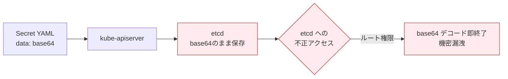
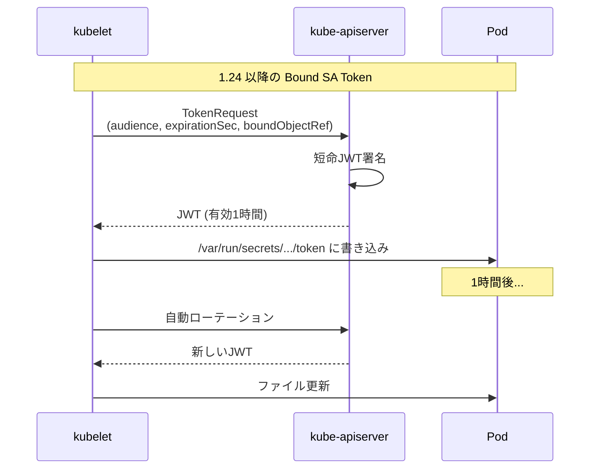
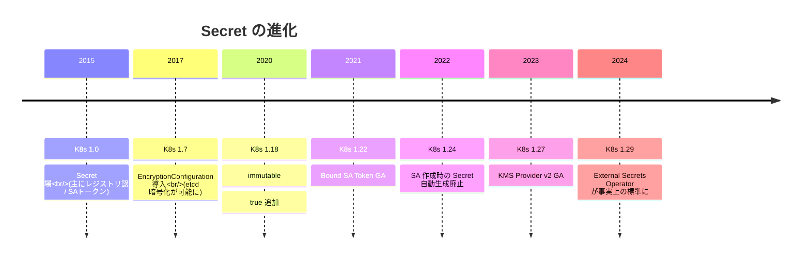
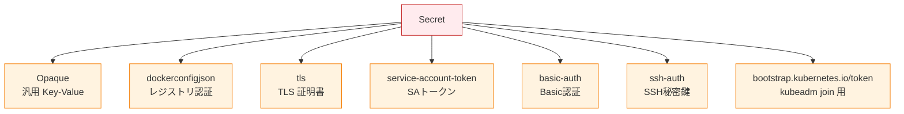
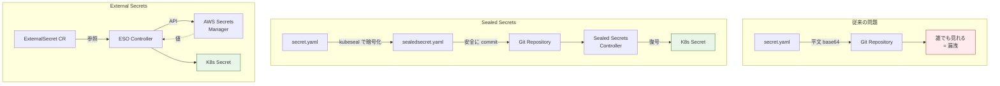
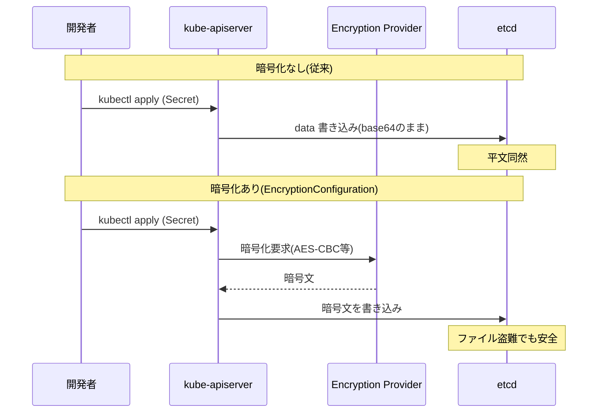
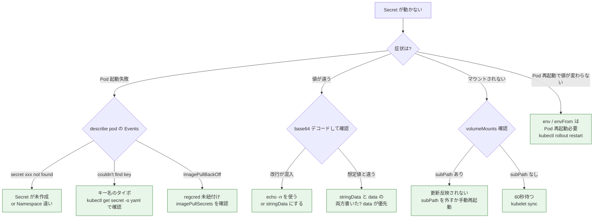
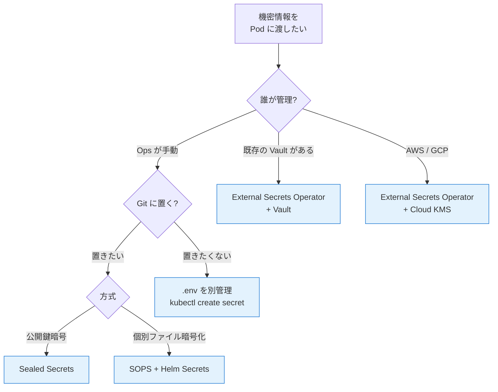

# Secret
{: .no_toc }

## 目次
{: .no_toc .text-delta }

1. TOC
{:toc}

---

## このページのゴール

このページを読み終えると、以下を **自分の言葉で説明できる** ようになります。

- Kubernetes の Secret が「**何で守ってくれて、何で守ってくれないか**」を正確に説明できる
- base64 と暗号化の違いを区別でき、「Secret は base64 されているだけ」が何を意味するかわかる
- Secret の主要 6 種類(Opaque, dockerconfigjson, tls, service-account-token, basic-auth, ssh-auth)の使い分けができる
- etcd 暗号化(EncryptionConfiguration)を有効化する手順と、KMS Provider v1/v2 の違いを説明できる
- ServiceAccount トークンが 1.24 で「Secret 自動生成廃止」になった背景と、projected token (Bound SA Token) への移行を説明できる
- 私有レジストリ認証用の Secret(`dockerconfigjson` 型)を作って Pod に紐付けられる
- Secret の漏洩を防ぐ運用パターン(.gitignore、Sealed Secrets、SOPS、External Secrets)の選択基準を述べられる

## Secret の歴史 ─ 「機密を扱う」設計の試行錯誤

### Kubernetes 1.0 時代の Secret

実は Secret は **ConfigMap より先に存在しました**。Kubernetes 1.0 (2015) には既に Secret があり、初期の主用途は次の 2 つでした:

1. **コンテナレジストリの認証情報**(プライベートレジストリから image pull するため)
2. **ServiceAccount のトークン**(Pod が API サーバへアクセスするため)

つまり、Secret は当初から「汎用的な機密管理リソース」というより「Kubernetes 自身の内部機構が必要とする情報を運ぶためのリソース」として設計されました。これが現在の Secret 設計のあちこちに痕跡として残っています(`type` フィールド、ServiceAccount との紐付き、自動マウント挙動など)。

### 当初の批判 ─ 「Secret なのに暗号化されてない」

Secret が広く使われるようになるにつれ、ある問題が顕在化しました。**Secret の `data` は base64 エンコードされているだけで、etcd には実質平文で保存されていた** のです。



「base64 はエンコーディングであって暗号化ではない」── これは Kubernetes コミュニティで何度も繰り返されたフレーズです。`echo "c3VwZXJzZWNyZXQ=" | base64 -d` で誰でも復元できる。

### EncryptionConfiguration の登場 (1.7, 2017)

この批判を受けて Kubernetes 1.7 で **EncryptionConfiguration** が導入されました。kube-apiserver が etcd へ書き込む直前に Secret を暗号化する機構です。

- **1.7 (2017-06)**: 実験的に導入(provider: `aescbc`, `aesgcm`, `secretbox`)
- **1.10 (2018-03)**: Beta 化、複数キーのローテーション対応
- **1.13 (2018-12)**: 安定化(GA は明示されないが実質的にプロダクション利用可)
- **1.25 (2022-08)**: KMS Provider v2 が Alpha
- **1.27 (2023-04)**: KMS Provider v2 が GA

KMS Provider が登場すると、暗号化キーを etcd ホスト上のファイルに置くのではなく、外部の KMS(AWS KMS, GCP KMS, HashiCorp Vault Transit など)に委譲できるようになりました。本ハンドブックではローカル運用なので KMS は使いませんが、本番運用では推奨です。

### Bound ServiceAccount Token (1.22 GA, 1.24 で挙動変更)

ServiceAccount に紐付く Secret(`type: kubernetes.io/service-account-token`)は、長らく **無期限の永続トークン** をクラスタ内に大量に作っていました。これがいくつかの問題を生んでいました。

- 長期トークンは漏洩時の影響が大きい
- ServiceAccount 数 × Pod 数のトークンが etcd に積もる
- 削除された Pod のトークンも生き続ける

そこで導入されたのが **Bound ServiceAccount Token (Projected Service Account Token)** です。

- Pod の起動時に kubelet が短命のトークンを生成
- 生成は **TokenRequest API** 経由
- Pod の生存期間にバインドされる(Pod が消えるとトークンも無効)
- 1 時間で自動ローテーション



この変更により、

- **1.22 (2021-08)**: Bound SA Token が GA。projected volume として利用可
- **1.24 (2022-05)**: ServiceAccount 作成時に対応する Secret が **自動生成されなくなった**

1.24 以降、ServiceAccount を作っても Secret は作られません。明示的に作りたければ別途 `kubectl apply` する必要があります。

```yaml
# 1.24 以降、明示的に作る場合の Secret
apiVersion: v1
kind: Secret
metadata:
  name: my-sa-token
  annotations:
    kubernetes.io/service-account.name: my-sa
type: kubernetes.io/service-account-token
```

ただしこの「永続トークン Secret」は緊急用と捉え、通常はワークロード側で projected token を使うのが推奨です。

### Secret の進化のまとめ



## Secret の正体 ─ 何で守られているか

これが本ページで一番大切な節です。

### Secret が守ってくれること

```mermaid
flowchart TB
    subgraph "Kubernetes Secret が守ってくれる"
        P1[kubectl describe で値が伏せられる]
        P2[kubectl get 出力でも値は base64<br/>(意図せず Slack に貼っても1ステップ猶予)]
        P3[RBAC で読み取り権限を絞れる]
        P4[etcd 暗号化が可能<br/>(別途設定すれば)]
        P5[コンテナの tmpfs にマウントされる<br/>(ディスクに残らない)]
        P6[ログ・監査で意識的に伏せられる]
    end

    classDef ok fill:#e8f5e9,stroke:#2e7d32
    class P1,P2,P3,P4,P5,P6 ok
```

- **kubectl の出力**: `kubectl describe pod` で env を表示する際、Secret 由来の値は表示されません
- **RBAC**: `secrets` リソースのみ別途 Role を作って制限可能
- **コンテナ内のマウント**: Secret を Volume として使うと、kubelet は **tmpfs (メモリ上のファイルシステム)** にマウントします。Worker ノードのディスクに書き込まれないので、ノードを物理的に持ち去られても残らない
- **kube-apiserver の audit log**: Secret の値そのものは audit log に記録されない設定がデフォルト

### Secret が守ってくれないこと

```mermaid
flowchart TB
    subgraph "Secret が守ってくれない"
        N1[etcd を直接読まれたら平文同然<br/>(暗号化未設定時)]
        N2[Worker ノードに root でログインされたら<br/>tmpfs から読める]
        N3[Pod に exec できれば中身は丸見え]
        N4[Git に commit したら全員に見える]
        N5[kubectl get -o yaml すれば base64 値が取れる]
        N6[ログに環境変数が出力されたら漏れる<br/>(アプリの責任)]
    end

    classDef ng fill:#ffebee,stroke:#c62828
    class N1,N2,N3,N4,N5,N6 ng
```

- **etcd**: EncryptionConfiguration 未設定なら base64 のまま保存。`etcdctl get /registry/secrets/...` で読めてしまう
- **Worker ノード**: Pod が動いているノードに root でログインできれば、tmpfs ファイルにアクセス可能
- **Pod 内**: `kubectl exec` できる権限があれば、`env` や `/var/run/secrets/...` で全部読める
- **Git**: Secret YAML を Git に commit したら base64 値は誰でもデコード可能。これが事故の最大の温床
- **アプリのログ**: アプリが環境変数をログに出してしまえば終了。アプリ側の責任

つまり Secret は **「うっかり露出しないように一段クッションを入れる」程度の機構** であり、本物の暗号化は別途必要です。本番運用では:

1. **etcd 暗号化を必ず有効化**(EncryptionConfiguration)
2. **Git に Secret を生で置かない**(Sealed Secrets / SOPS / External Secrets)
3. **RBAC で `secrets` を厳格に絞る**
4. **アプリにログ出力時のマスキング処理を入れる**

の 4 つを組み合わせるのが定石です。

## Secret の type ─ 6 種類の使い分け

Secret には `type` フィールドがあり、用途ごとに専用の type が用意されています。



### Opaque ─ 汎用

`type` を指定しないか `Opaque` にすると、自由なキー/値が使えます。最もよく使う type です。

```yaml
apiVersion: v1
kind: Secret
metadata:
  name: todo-secret
type: Opaque
data:
  DB_PASSWORD: c3VwZXJzZWNyZXQ=
  JWT_SECRET: YWJjZGVmMTIzNDU2
```

### kubernetes.io/dockerconfigjson ─ プライベートレジストリ認証

private registry から image pull するための認証情報。Pod の `imagePullSecrets` から参照されます。

```bash
kubectl create secret docker-registry regcred \
  --docker-server=192.168.56.10:5000 \
  --docker-username=admin \
  --docker-password=admin \
  --docker-email=admin@example.com
```

YAML としてはこうなります:

```yaml
apiVersion: v1
kind: Secret
metadata:
  name: regcred
type: kubernetes.io/dockerconfigjson
data:
  .dockerconfigjson: ewogICJhdXRocyI6IHsKICAgICIxOTIuMTY4LjU2LjEwOjUwMDAi...
```

`data` のキーは `.dockerconfigjson` 固定。値の中身は Docker クライアントの `~/.docker/config.json` と同形式の JSON を base64 エンコードしたものです。

### kubernetes.io/tls ─ TLS 証明書

TLS 証明書と秘密鍵のペアを格納します。Ingress で HTTPS を使う際の定番。

```bash
kubectl create secret tls todo-tls \
  --cert=path/to/tls.crt \
  --key=path/to/tls.key
```

YAML:

```yaml
apiVersion: v1
kind: Secret
metadata:
  name: todo-tls
type: kubernetes.io/tls
data:
  tls.crt: LS0tLS1CRUdJTi...
  tls.key: LS0tLS1CRUdJTi...
```

`data` のキーは `tls.crt` と `tls.key` の 2 つで固定。Ingress リソースの `spec.tls.secretName` から参照します(8 章で詳説)。

### kubernetes.io/service-account-token ─ ServiceAccount トークン

前述のとおり、1.24 以降は **自動生成されません**。手動で作る場合:

```yaml
apiVersion: v1
kind: Secret
metadata:
  name: ci-bot-token
  annotations:
    kubernetes.io/service-account.name: ci-bot
type: kubernetes.io/service-account-token
```

apply 後、kube-controller-manager が自動で `data.token`, `data.ca.crt`, `data.namespace` を埋めます。

```bash
kubectl get secret ci-bot-token -o jsonpath='{.data.token}' | base64 -d
# → JWT トークン
```

### kubernetes.io/basic-auth ─ Basic 認証

```yaml
apiVersion: v1
kind: Secret
metadata:
  name: registry-auth
type: kubernetes.io/basic-auth
stringData:
  username: admin
  password: hunter2
```

Ingress の `nginx.ingress.kubernetes.io/auth-type: basic` などで参照されます。

### kubernetes.io/ssh-auth ─ SSH 秘密鍵

Argo Workflows などが Git にアクセスする際に SSH 鍵を渡す用途。

```yaml
apiVersion: v1
kind: Secret
metadata:
  name: git-ssh
type: kubernetes.io/ssh-auth
data:
  ssh-privatekey: LS0tLS1CRUdJTi...
```

### type を指定する意味

「Opaque で全部やればいいのでは?」と思うかもしれませんが、type を分ける意味は:

- **必須キーの強制**: `tls` は `tls.crt` と `tls.key` がないと kube-apiserver が拒否
- **使用箇所の明示**: `dockerconfigjson` 型は `imagePullSecrets` から、`tls` は Ingress から、というように用途と紐付く
- **将来の検証強化**: type 別に admission webhook や OPA で検証可能

「中身がレジストリ認証なのに `Opaque` で運用」は、`imagePullSecrets` に指定しても動かないので注意。

## 作成方法 ─ 5 通り

### 方法1: kubectl create secret generic --from-literal

```bash
kubectl create secret generic todo-secret \
  --from-literal=DB_PASSWORD='supersecret' \
  --from-literal=JWT_SECRET='abcdef123456'
```

**期待される出力**:

```
secret/todo-secret created
```

**シェル履歴に注意**: `bash_history` にコマンドが残るため、本番のパスワードを直書きするのは推奨しません。`kubectl create secret generic ... --from-env-file=.env` で `.env` から読む方が安全です。

### 方法2: kubectl create secret generic --from-file

```bash
echo -n 'supersecret' > db-password.txt
kubectl create secret generic todo-secret --from-file=DB_PASSWORD=db-password.txt
rm db-password.txt
```

`echo -n` の `-n` を忘れると改行 (`\n`) が混入します。これでパスワードが間違っているように見えるトラブルが頻発します。

### 方法3: YAML を apply (data フィールド)

```yaml
apiVersion: v1
kind: Secret
metadata:
  name: todo-secret
type: Opaque
data:
  DB_PASSWORD: c3VwZXJzZWNyZXQ=     # base64
  JWT_SECRET: YWJjZGVmMTIzNDU2
```

**base64 化**:

```bash
echo -n 'supersecret' | base64
# c3VwZXJzZWNyZXQ=
```

ここでも `-n` 必須(改行を含めない)。

### 方法4: YAML を apply (stringData フィールド)

base64 化が面倒な場合は `stringData` を使うと、Kubernetes 側が自動でエンコードしてくれます。

```yaml
apiVersion: v1
kind: Secret
metadata:
  name: todo-secret
type: Opaque
stringData:
  DB_PASSWORD: supersecret
  JWT_SECRET: abcdef123456
```

apply 後 `kubectl get secret todo-secret -o yaml` を見ると、`data` フィールドに base64 化された値が入っています。**ただし `stringData` フィールド自体は kube-apiserver の応答からは消えるので、再度 edit するときは base64 値を扱うことになります。**

`stringData` と `data` の両方に同じキーがあると `stringData` が優先されます。

### 方法5: Sealed Secrets / SOPS / External Secrets

本番環境ではこちら推奨。10 章で詳説しますが、一足先に概要だけ:

- **Sealed Secrets**: クラスタ内の controller の公開鍵で暗号化された YAML(`SealedSecret` リソース)を Git に commit。controller が復号して Secret に変換
- **SOPS**: ファイル単位で AES + KMS 暗号化。Helm Secrets プラグインで helm install 時に復号
- **External Secrets Operator**: AWS Secrets Manager / Vault などから動的に値を取得して Secret を生成



## Pod への注入 ─ ConfigMap とほぼ同じ

Secret の注入方法は ConfigMap と完全にパラレルです。ConfigMap の章を理解していれば、`configMapKeyRef` を `secretKeyRef` に、`configMapRef` を `secretRef` に置き換えるだけ。

### env で個別キー

```yaml
spec:
  containers:
  - name: api
    env:
    - name: DB_PASSWORD
      valueFrom:
        secretKeyRef:
          name: todo-secret
          key: DB_PASSWORD
          optional: false
```

### envFrom で一括

```yaml
spec:
  containers:
  - name: api
    envFrom:
    - secretRef:
        name: todo-secret
```

### Volume マウント

```yaml
spec:
  containers:
  - name: api
    volumeMounts:
    - name: secret-vol
      mountPath: /etc/secrets
      readOnly: true
  volumes:
  - name: secret-vol
    secret:
      secretName: todo-secret
      defaultMode: 0400        # 権限を絞る
      items:
      - key: DB_PASSWORD
        path: db-password
        mode: 0400
```

**Volume マウントの利点**:

1. **tmpfs にマウントされる**(ノードのディスクに書かれない)
2. **更新が自動反映**(ConfigMap と同じく atomic な差し替え)
3. **権限を絞れる**(`defaultMode: 0400` でファイル所有者のみ読み取り可能)

`defaultMode` は **8 進数として解釈** されます。YAML パーサによっては `0400` を 8 進数と解釈せず 400 (10 進数 = 0o620) になる事故が起きるため、`mode: 0o400` のように明示するか、`mode: 256` (= 0o400) と 10 進で書くこともあります。

### ConfigMap と Secret の違い (注入面)

| 観点 | ConfigMap | Secret |
|------|-----------|--------|
| Volume の置き場所 | Worker ノードのディスク | **tmpfs (メモリ)** |
| `kubectl describe pod` での表示 | 環境変数の値が見える | 値が伏せられる |
| 既定の権限 | 0644 | 0644(明示的に絞ること推奨) |
| 1 MiB 制限 | あり | あり |
| immutable | 1.18 〜 | 1.18 〜 |

## Projected Volume ─ 複数ソースの統合マウント

複数の ConfigMap / Secret / Downward API を 1 つのディレクトリに統合してマウントできます。

```yaml
spec:
  containers:
  - name: api
    volumeMounts:
    - name: combined
      mountPath: /etc/app
  volumes:
  - name: combined
    projected:
      sources:
      - configMap:
          name: todo-config
          items:
          - key: app.conf
            path: app.conf
      - secret:
          name: todo-secret
          items:
          - key: DB_PASSWORD
            path: secrets/db-password
      - downwardAPI:
          items:
          - path: pod-name
            fieldRef:
              fieldPath: metadata.name
      - serviceAccountToken:
          audience: api.example.com
          expirationSeconds: 3600
          path: token
```

`/etc/app` 配下に:

- `app.conf` (ConfigMap 由来)
- `secrets/db-password` (Secret 由来)
- `pod-name` (Downward API)
- `token` (Bound SA Token)

が混在します。設定ファイルと機密と動的トークンを 1 つのマウントにまとめたい場合に便利。

## etcd 暗号化 (EncryptionConfiguration)

ここからは本番運用に必須の設定です。Minikube では自動で有効化されないので、第 7 章 (kubeadm クラスタ) で実際に手を動かします。

### 仕組み



### 設定ファイル例

```yaml
# /etc/kubernetes/encryption-config.yaml
apiVersion: apiserver.config.k8s.io/v1
kind: EncryptionConfiguration
resources:
- resources:
  - secrets                    # 暗号化対象リソース
  providers:
  - aescbc:                    # AES-CBC 暗号化
      keys:
      - name: key1
        secret: <base64 32 bytes>      # head -c 32 /dev/urandom | base64
  - identity: {}               # フォールバック(平文)
```

### kube-apiserver の起動オプション

`/etc/kubernetes/manifests/kube-apiserver.yaml` の `--encryption-provider-config` を追加:

```yaml
spec:
  containers:
  - command:
    - kube-apiserver
    - --encryption-provider-config=/etc/kubernetes/encryption-config.yaml
    # その他のオプション
```

kubeadm ならこの static pod manifest を直接編集します(7 章でハンズオン)。

### Provider の種類

| Provider | アルゴリズム | 鍵管理 | 推奨度 |
|----------|--------------|--------|--------|
| `identity` | 暗号化なし | - | フォールバック専用 |
| `aescbc` | AES-CBC + PKCS#7 | ファイルに保存 | ◯(古典的) |
| `aesgcm` | AES-GCM | ファイル(要ローテーション) | △(IV再利用注意) |
| `secretbox` | XSalsa20+Poly1305 | ファイルに保存 | ◯(高速) |
| `kms` (v1) | 外部KMS委譲 | KMSで管理 | ◎(古い) |
| `kms` (v2) | 外部KMS委譲 | KMSで管理 | ◎(1.27+ 推奨) |

KMS Provider v2 は鍵ローテーションのオーバーヘッドが大幅に減り、AWS KMS / GCP KMS / HashiCorp Vault Transit エンジンと連携できます。本番では推奨。

### 既存の Secret を暗号化する

`encryption-config.yaml` を有効化しても、**過去に作成された Secret は自動では暗号化されません**。`kubectl get secrets -A -o json | kubectl replace -f -` で全 Secret を再書き込みする必要があります(再書き込み時に新しい Provider で暗号化される)。

```bash
kubectl get secrets --all-namespaces -o json | \
  kubectl replace -f -
```

### キーローテーション

`encryption-config.yaml` の Provider 配列の最初のものが書き込みに使われ、それ以外はフォールバックの読み取り専用になります。ローテーション手順:

1. 新しいキー `key2` を 2 番目に追加して reload
2. すべての kube-apiserver で読めることを確認
3. `key1` と `key2` の順序を入れ替えて、`key2` を先頭に
4. すべての Secret を再書き込み(`kubectl get -o json | kubectl replace -f -`)
5. 古い `key1` を削除

KMS v2 ならこれが大幅に簡素化されます(KMS 側で鍵ローテーション)。

## 私有レジストリ認証 ─ サンプルアプリでの実例

サンプル TODO アプリは `192.168.56.10:5000/todo-api:0.1.0` のように私有レジストリのイメージを使う前提です。Pod がこれを pull するには認証情報の Secret が必要です。

### 認証 Secret の作成

```bash
kubectl create secret docker-registry regcred \
  --docker-server=192.168.56.10:5000 \
  --docker-username=admin \
  --docker-password=admin \
  --docker-email=admin@example.com
```

確認:

```bash
kubectl get secret regcred -o jsonpath='{.data.\.dockerconfigjson}' | base64 -d
```

```json
{
  "auths": {
    "192.168.56.10:5000": {
      "username": "admin",
      "password": "admin",
      "email": "admin@example.com",
      "auth": "YWRtaW46YWRtaW4="
    }
  }
}
```

`auth` フィールドは `username:password` の base64。HTTP Basic 認証ヘッダーと同じ形式です。

### Pod に紐付ける ─ 方法1: imagePullSecrets で明示

```yaml
apiVersion: apps/v1
kind: Deployment
metadata:
  name: todo-api
spec:
  template:
    spec:
      imagePullSecrets:
      - name: regcred
      containers:
      - name: api
        image: 192.168.56.10:5000/todo-api:0.1.0
```

### Pod に紐付ける ─ 方法2: ServiceAccount に紐付け (推奨)

ServiceAccount に `imagePullSecrets` を仕込んでおけば、Pod 個別に書く必要がなくなります。

```yaml
apiVersion: v1
kind: ServiceAccount
metadata:
  name: default                # 既定の SA に紐付け
imagePullSecrets:
- name: regcred
```

その Namespace のすべての Pod が自動で `regcred` を使うようになります。Namespace を作るたびに `regcred` を複製してこの ServiceAccount に紐付ける運用が定石。

### 認証情報を全 Namespace に展開

`regcred` は Namespace スコープなので、Namespace を作るたびに Secret を作り直す必要があります。

```bash
# 既存の Namespace 全部に展開
for ns in $(kubectl get ns -o jsonpath='{.items[*].metadata.name}'); do
  kubectl get secret regcred -o yaml | \
    sed "s/namespace: default/namespace: $ns/" | \
    kubectl apply -f -
done
```

または [Reflector](https://github.com/EmberStack/kubernetes-reflector) や [External Secrets Operator] のテンプレート機能を使うとよりエレガントです。

### 不要になった Secret の削除

```bash
kubectl delete secret regcred -n default
```

参照している Pod は **次の image pull** までエラーになります(既に pull 済みのイメージはキャッシュから利用可能)。

## ServiceAccount トークン詳細

### 1.24 以降の挙動

```bash
kubectl create serviceaccount ci-bot
```

1.24 以降、Secret は **自動生成されません**。確認:

```bash
kubectl get serviceaccount ci-bot -o yaml
```

```yaml
apiVersion: v1
kind: ServiceAccount
metadata:
  name: ci-bot
# secrets: フィールドが空
```

### Pod が SA トークンを使う場合

Pod が SA を使うと、kubelet が **projected volume** で短命トークンを自動マウントします。

```yaml
spec:
  serviceAccountName: ci-bot
  containers:
  - name: app
    # 自動的に /var/run/secrets/kubernetes.io/serviceaccount/{token,ca.crt,namespace} が見える
```

中身:

```bash
$ kubectl exec -it pod -- ls /var/run/secrets/kubernetes.io/serviceaccount/
ca.crt  namespace  token
```

`token` は JWT で、有効期限は 1 時間。kubelet が自動でローテーションします。

### CI / 外部システム用の長期トークン

GitHub Actions などのクラスタ外システムから API を叩きたい場合、長期トークンが必要です。明示的に Secret を作ります:

```yaml
apiVersion: v1
kind: Secret
metadata:
  name: ci-bot-long-token
  annotations:
    kubernetes.io/service-account.name: ci-bot
type: kubernetes.io/service-account-token
```

```bash
kubectl apply -f ci-bot-long-token.yaml
kubectl get secret ci-bot-long-token -o jsonpath='{.data.token}' | base64 -d
```

このトークンを GitHub Secrets などに登録します。**長期トークンはセキュリティリスク** なので、本来は OIDC 連携(GitHub OIDC + AWS IAM Roles for Service Accounts 的なやつ)が推奨です。

### token を取得する別の手段

短命トークンを CLI から取りたい場合:

```bash
kubectl create token ci-bot --duration=1h
# JWT を標準出力
```

これは TokenRequest API 経由で kube-apiserver に署名させる方式で、Secret として保存されません。

## 詳細仕様

### immutable

ConfigMap と同じく、`immutable: true` で変更不可化できます。

```yaml
apiVersion: v1
kind: Secret
metadata:
  name: todo-secret-v1
immutable: true
type: Opaque
data:
  DB_PASSWORD: ...
```

ローテーションは「新しい名前の Secret を作って Deployment の参照を切り替える」運用になります。

### サイズ上限

ConfigMap と同じく **1 MiB** です。TLS 証明書チェーンが大きくて引っかかるケースがあります。

### Secret の Watch / List 制御

`kubectl get secrets -A` を実行すると、すべての Secret のメタデータと **値の base64** が返ります。kube-apiserver 側で値を伏せる仕組みは ない ため、RBAC で `secrets` に対する `get` `list` 権限を厳格に制限することが本物の防御になります。

```yaml
# 例: developer ロールから secrets 読み取り権限を削除
apiVersion: rbac.authorization.k8s.io/v1
kind: Role
metadata:
  name: developer
rules:
- apiGroups: [""]
  resources: ["pods", "configmaps", "services"]
  verbs: ["get", "list", "watch", "create", "update", "patch", "delete"]
- apiGroups: [""]
  resources: ["secrets"]
  verbs: []                              # 何も許可しない
```

## トラブルシュート

### 調査フローチャート



### エラーメッセージ別対処

| エラーメッセージ | 原因 | 対処 |
|------------------|------|------|
| `CreateContainerConfigError: secret "xxx" not found` | Secret が存在しない | `kubectl get secret -A` で確認、Namespace 違いの可能性 |
| `couldn't find key XXX in Secret` | キー名のタイポ | `kubectl get secret xxx -o yaml` でキー名確認 |
| `ImagePullBackOff` | レジストリ認証失敗 | `regcred` の作成と Pod / SA への紐付けを確認 |
| `Forbidden: this object is immutable` | immutable Secret を更新しようとした | 削除して作り直し |
| `data: ... must be a base64 encoded string` | data フィールドに非 base64 値 | `stringData` を使うか正しく base64 化 |
| `decryption failed` (kube-apiserver) | EncryptionConfiguration の鍵が壊れた | バックアップから鍵を復旧、`identity` プロバイダで一時復旧 |

### よくある失敗

#### ケース1: パスワードに `\n` が混入

```bash
# 悪い例
echo 'supersecret' | base64
# c3VwZXJzZWNyZXQK   ← 末尾に K が付く(\n の base64)

# 正しい例
echo -n 'supersecret' | base64
# c3VwZXJzZWNyZXQ=
```

DB に接続したらパスワードが間違っていると言われる…の典型はこれ。`stringData` を使えば回避できます。

#### ケース2: Secret を編集したら値が消えた

`kubectl edit secret` で見えるのは `data` フィールド (base64 値)。誤って `stringData:` を空のまま追加してしまうと、apply 時に `stringData` が優先され値が消えます。

#### ケース3: dockerconfigjson の構造が違う

```bash
kubectl create secret generic regcred --from-file=.dockerconfigjson=config.json
```

`type: Opaque` で作ると `imagePullSecrets` から参照しても認識されません。**必ず `kubectl create secret docker-registry`** で作るか、`type: kubernetes.io/dockerconfigjson` を明示します。

#### ケース4: tls.crt のチェーンが不完全

Ingress で「証明書信頼エラー」が出る場合、tls.crt に **中間 CA まで含まれているか** を確認します。

```bash
kubectl get secret todo-tls -o jsonpath='{.data.tls\.crt}' | base64 -d | openssl x509 -text -noout
```

`Issuer` が信頼された CA でない場合、中間 CA を `tls.crt` の末尾に追加する必要があります(チェーンとして)。

#### ケース5: Secret を別 Namespace から参照したい

不可。Secret は Namespace スコープです。

**対処**:

- 同じ Secret を各 Namespace に複製
- [External Secrets Operator] で同期
- [Reflector] でアノテーション指定で複製

## 代替手法 ─ ネイティブ Secret を使わない選択肢



| 方式 | 鍵の所在 | Git 安全性 | 学習コスト | 本番適性 |
|------|----------|------------|------------|----------|
| Secret 直書き YAML | クラスタ内のみ | ✗(平文) | 低 | ✗ |
| `.env` をローカル管理 | 開発者 PC | △ | 低 | △ |
| Sealed Secrets | クラスタ内 controller | ◯ | 中 | ◯ |
| SOPS + Helm Secrets | KMS (AWS/GCP/Azure) or PGP | ◯ | 中 | ◯ |
| External Secrets Operator | Vault / Secrets Manager | ◯(参照のみ) | 中 | ◎ |
| Vault Agent Injector | Vault | ◯(参照のみ) | 高 | ◎ |

10 章 [Secret管理]({{ '/10-security/secret-management/' | relative_url }}) で実装まで踏み込みます。

## ハンズオン ─ TODO アプリに DB パスワードを Secret で渡す

### Step 1: Secret の作成

```bash
kubectl create secret generic todo-secret \
  --from-literal=DB_USER=todo \
  --from-literal=DB_PASSWORD='S3curePass!' \
  --from-literal=JWT_SECRET='myJwtSigningKey123' \
  --from-literal=REDIS_PASSWORD='redisP@ss'
```

確認:

```bash
kubectl get secret todo-secret
```

```
NAME          TYPE     DATA   AGE
todo-secret   Opaque   4      3s
```

`kubectl describe secret todo-secret`:

```
Name:         todo-secret
Namespace:    default
Type:         Opaque

Data
====
DB_PASSWORD:     11 bytes
DB_USER:         4 bytes
JWT_SECRET:      18 bytes
REDIS_PASSWORD:  9 bytes
```

値は表示されません(これが Secret の効用の 1 つ)。

### Step 2: Deployment に紐付け

ConfigMap の章で作った `todo-api` Deployment に Secret を追加します。

```yaml
apiVersion: apps/v1
kind: Deployment
metadata:
  name: todo-api
spec:
  replicas: 2
  selector:
    matchLabels:
      app.kubernetes.io/name: todo-api
  template:
    metadata:
      labels:
        app.kubernetes.io/name: todo-api
    spec:
      containers:
      - name: api
        image: 192.168.56.10:5000/todo-api:0.1.0
        envFrom:
        - configMapRef:
            name: todo-config
        - secretRef:
            name: todo-secret           # ← 追加
```

```bash
kubectl apply -f deployment.yaml
kubectl rollout status deployment/todo-api
```

### Step 3: Pod 内で確認

```bash
kubectl exec -it deploy/todo-api -- env | grep -E "DB_|JWT|REDIS_PASSWORD"
```

```
DB_USER=todo
DB_PASSWORD=S3curePass!
DB_HOST=postgres                # ConfigMap 由来
DB_PORT=5432                    # ConfigMap 由来
DB_NAME=todo                    # ConfigMap 由来
REDIS_HOST=redis                # ConfigMap 由来
REDIS_PORT=6379                 # ConfigMap 由来
REDIS_PASSWORD=redisP@ss
JWT_SECRET=myJwtSigningKey123
```

ConfigMap (envFrom) と Secret (envFrom) が一緒に注入されています。

### Step 4: kubectl describe pod での見え方を確認

```bash
kubectl describe pod -l app.kubernetes.io/name=todo-api
```

```
Containers:
  api:
    Environment Variables from:
      todo-config       ConfigMap  Optional: false
      todo-secret       Secret     Optional: false
```

値そのものは表示されません(Secret 経由の値も同様)。

### Step 5: 私有レジストリ認証

サンプル TODO アプリは `192.168.56.10:5000/todo-api:0.1.0` を pull するため、認証 Secret が必要です(7 章のクラスタで実施しますが、ここでは concept だけ)。

```bash
kubectl create secret docker-registry regcred \
  --docker-server=192.168.56.10:5000 \
  --docker-username=admin \
  --docker-password=admin
```

`default` ServiceAccount に紐付け:

```bash
kubectl patch serviceaccount default -p '{"imagePullSecrets":[{"name":"regcred"}]}'
```

これで `default` Namespace のすべての Pod が自動で認証情報を使えるようになります。

### Step 6: Volume マウントで Secret を渡す

JWT 鍵をファイルとして渡したい場合:

```yaml
apiVersion: apps/v1
kind: Deployment
metadata:
  name: todo-api
spec:
  template:
    spec:
      containers:
      - name: api
        image: 192.168.56.10:5000/todo-api:0.1.0
        envFrom:
        - configMapRef:
            name: todo-config
        env:
        - name: DB_PASSWORD
          valueFrom:
            secretKeyRef:
              name: todo-secret
              key: DB_PASSWORD
        volumeMounts:
        - name: jwt-key
          mountPath: /etc/secrets
          readOnly: true
      volumes:
      - name: jwt-key
        secret:
          secretName: todo-secret
          defaultMode: 0400
          items:
          - key: JWT_SECRET
            path: jwt.key
```

Pod 内で確認:

```bash
kubectl exec -it deploy/todo-api -- ls -la /etc/secrets/
# -r--------    1 root  root   18 Mar 15 10:30 jwt.key

kubectl exec -it deploy/todo-api -- cat /etc/secrets/jwt.key
# myJwtSigningKey123
```

`-r--------` (0400) になっており、所有者しか読めない権限が反映されています。tmpfs マウントされているのも確認:

```bash
kubectl exec -it deploy/todo-api -- mount | grep secrets
# tmpfs on /etc/secrets type tmpfs (ro,relatime,size=...)
```

`tmpfs` でマウントされており、Worker ノードのディスクに書き込まれていないことがわかります。

### Step 7: Secret の更新と反映

`stringData` で更新:

```yaml
apiVersion: v1
kind: Secret
metadata:
  name: todo-secret
type: Opaque
stringData:
  DB_USER: todo
  DB_PASSWORD: 'NewSecurePass123!'
  JWT_SECRET: 'newJwtKey456'
  REDIS_PASSWORD: 'newRedisPass'
```

```bash
kubectl apply -f secret.yaml
```

env / envFrom で受けている値は更新されないため:

```bash
kubectl rollout restart deployment/todo-api
```

Volume マウントしている JWT 鍵だけは自動更新されます(60 秒以内)。

## 本番運用の落とし穴

### 1. Secret を Git に入れてしまった

リカバリは原則として **値そのものをローテーション** してから対処します。

1. **すぐにパスワード/鍵をローテーション**(漏洩したと仮定)
2. Git の履歴から削除(`git filter-branch` や [git-filter-repo])
3. force push、ただしリモートに既に pull した人がいる前提で考える
4. 再発防止に [pre-commit] のフック、[truffleHog] や [gitleaks] による検出を導入

「コミットしてしまったが直後に削除した」場合でも、**誰かが参照してしまった可能性がある** と考えてローテーションするのが正解です。

### 2. RBAC が緩すぎて Secret が読まれる

開発者ロールから `secrets` の `get` `list` を奪わないと、`kubectl get secrets -A -o yaml` で全社の機密が読めます。

```yaml
# Bad: cluster-admin を全員に
- kind: User
  name: developer-team
  roleRef:
    name: cluster-admin   # ← Secret 含めて全部読める

# Good: 必要最小限
- kind: User
  name: developer-team
  roleRef:
    name: developer       # secrets 除外済みカスタムロール
```

### 3. アプリのログに環境変数が出力されてしまう

Spring Boot の `--debug` モード、Python の `logging.DEBUG` などで起動時に環境変数を全部出力するアプリがあります。`DB_PASSWORD` が CloudWatch / Loki に流れて永遠に残る、という事故。

**対処**:

- アプリ側でマスキング処理(`****` 表示)
- Volume マウントに切り替えて環境変数経由を避ける
- 構造化ログのフィルタ(Fluent Bit / Vector でマスク)

### 4. etcd 暗号化を入れたが鍵をなくした

EncryptionConfiguration で aescbc 等を使っている場合、鍵ファイルをなくすと **すべての Secret が読めなくなり、クラスタ復旧不能** になります。

**対処**:

- 鍵ファイルは別途バックアップ
- KMS Provider v2 を使えば KMS 側で管理されるので安全
- ローテーション手順を文書化、定期演習

### 5. Secret 更新時に依存 Pod が再起動しない

ConfigMap と同じ問題。`checksum/secret` annotation や Reloader で対応します。

```yaml
spec:
  template:
    metadata:
      annotations:
        checksum/secret: {{ include (print $.Template.BasePath "/secret.yaml") . | sha256sum }}
```

### 6. ServiceAccount トークンの長期化

1.24 以降、SA を作っても Secret は自動生成されないので、長期トークンが必要なら明示作成が必要。逆に「自動生成されるはず」と思い込んで仕掛けが動かない、という移行期のトラブルが続いています。

`kubectl create token` で短命トークンを毎回発行する方が安全です。

## チェックポイント

ここまでで以下を **自分の言葉で** 説明できるか確認してください。

- [ ] Secret の `data` は base64 エンコードされているだけで、暗号化はされていないことを説明できる
- [ ] Secret が **守ってくれる 4 つの保護** と、**守ってくれない 4 つの状況** を挙げられる
- [ ] Secret の Volume マウントが tmpfs を使うことの意味を述べられる
- [ ] `dockerconfigjson` 型の Secret を作って Pod の `imagePullSecrets` から使う YAML を書ける
- [ ] EncryptionConfiguration を有効化する理由と、KMS Provider v2 が解決する問題を説明できる
- [ ] 1.24 で「ServiceAccount の Secret 自動生成」がなくなった理由と、Bound SA Token の利点を説明できる
- [ ] `stringData` と `data` の違い、両方書いた時にどちらが勝つかを答えられる
- [ ] Secret を Git に commit してしまった時のリカバリ手順を 4 ステップで説明できる
- [ ] 本番で Secret 管理に使う 3 つの代替手段(Sealed Secrets / SOPS / External Secrets)の違いを述べられる

→ 次は [設計パターン]({{ '/06-config/patterns/' | relative_url }})
