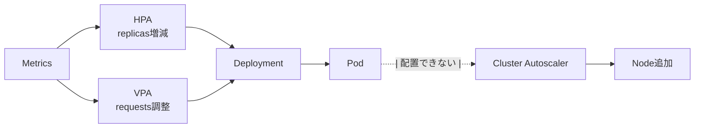

# Autoscaling (HPA/VPA/CA)
{: .no_toc }

## 目次
{: .no_toc .text-delta }

1. TOC
{:toc}

---

Kubernetes には3種類のオートスケーラがあります。

| | 対象 | 何を変える | 主な指標 |
|---|---|---|---|
| **HPA** (Horizontal Pod Autoscaler) | Deployment等の `replicas` | Pod 数 | CPU/Memory/カスタム |
| **VPA** (Vertical Pod Autoscaler) | Pod の `resources` | Requests/Limits | CPU/Memory実測 |
| **Cluster Autoscaler** | クラスタ全体 | ノード数 | スケジュール不可 Pod |



## HPA

最もよく使う。サンプルアプリの API に適用してみます。

```yaml
apiVersion: autoscaling/v2
kind: HorizontalPodAutoscaler
metadata:
  name: todo-api
spec:
  scaleTargetRef:
    apiVersion: apps/v1
    kind: Deployment
    name: todo-api
  minReplicas: 2
  maxReplicas: 10
  metrics:
  - type: Resource
    resource:
      name: cpu
      target:
        type: Utilization
        averageUtilization: 70
  behavior:
    scaleDown:
      stabilizationWindowSeconds: 300
      policies:
      - type: Percent
        value: 50
        periodSeconds: 60
    scaleUp:
      stabilizationWindowSeconds: 0
      policies:
      - type: Percent
        value: 100
        periodSeconds: 30
```

ポイント:

- HPA を動かすには **Metrics Server が必要**
- **Pod に CPU Requests がないと CPU% を計算できない** ので、HPA 使うなら Requests 必須
- `behavior` で「上げは速く、下げはゆっくり」が定石(フラッピング防止)

## カスタムメトリクスでの HPA

Prometheus + prometheus-adapter を使えば、**RPS や Queue Length** で HPA できます。

```yaml
metrics:
- type: Pods
  pods:
    metric:
      name: http_requests_per_second
    target:
      type: AverageValue
      averageValue: 100
```

9 章 [メトリクス]({{ '/09-observability/metrics/' | relative_url }}) で構築します。

## VPA

実測に基づき Pod の Requests を自動調整。

```yaml
apiVersion: autoscaling.k8s.io/v1
kind: VerticalPodAutoscaler
metadata:
  name: todo-api
spec:
  targetRef:
    apiVersion: apps/v1
    kind: Deployment
    name: todo-api
  updatePolicy:
    updateMode: "Auto"     # Off / Initial / Recreate / Auto
```

`updateMode: Off` で **「推奨だけ見る」** にして、`kubectl describe vpa` で値を確認 → 手動で Deployment に反映、が安全な使い方。

{: .warning }
HPA と VPA を **同じリソース(同じ指標で)** に当てると、フィードバックループで暴れることがあります。
HPA は CPU、VPA は Memory といった分担なら共存可能です。

## Cluster Autoscaler

Pod がスケジュールできない(リソース不足)とき、ノードを追加するコンポーネント。
クラウドマネージド(EKS/GKE)では完全自動ですが、**オンプレでは VM の自動プロビジョニング基盤が必要** で、ローカル学習では現実的ではありません。

本教材ローカル環境では、代わりに **「VMをスナップショットから手動でブートしてjoinするスクリプト」** を用意して疑似体験します。

```bash
#!/bin/bash
# scripts/add-worker.sh
VM_NAME=$1
vmrun clone /vm/template/ubuntu-template.vmx /vm/${VM_NAME}.vmx linked
vmrun start /vm/${VM_NAME}.vmx nogui
sleep 30
ssh ${VM_NAME} "kubeadm join k8s-api:6443 --token <TOKEN> --discovery-token-ca-cert-hash sha256:<HASH>"
```

CA の本質は「スケジュール失敗 Pod の検知 → ノード追加」なので、このスクリプトを events を見ながら手動実行する流れで、感覚は掴めます。

## ハンズオン: HPA を動かす

```bash
# 負荷生成
kubectl run -it load-gen --rm --image=williamyeh/hey -- \
  -z 60s -c 50 http://todo-api/api/todos

# 別端末で
kubectl get hpa todo-api -w
kubectl get pods -l app.kubernetes.io/name=todo-api -w
```

## チェックポイント

- [ ] HPA / VPA / CA の役割の違いを言える
- [ ] HPA を動かす前提条件を 2 つ
- [ ] HPA と VPA を同じ Pod に当てるときの注意
