# Autoscaling (HPA/VPA/CA)
{: .no_toc }

## 目次
{: .no_toc .text-delta }

1. TOC
{:toc}

---

Kubernetes には大きく分けて **3 種類のオートスケーラ** があります。それぞれが「何を増減するか」が違います。

| | 対象 | 何を変える | 主な指標 |
|---|---|---|---|
| **HPA**(Horizontal Pod Autoscaler)| Deployment 等の `replicas` | Pod の数 | CPU / Memory / カスタム |
| **VPA**(Vertical Pod Autoscaler)| Pod の `resources` | Requests / Limits | CPU / Memory 実測 |
| **Cluster Autoscaler**(CA)| クラスタ全体 | ノード数 | スケジュール不可 Pod |

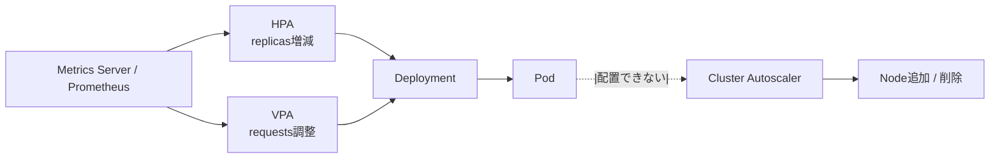
```mermaid
flowchart LR
    metric[Metrics Server / Prometheus] --> hpa[HPA<br>replicas増減]
    hpa --> deploy[Deployment]
    metric --> vpa[VPA<br>requests調整]
    vpa --> deploy
    deploy --> pod[Pod]
    pod -.|配置できない|.-> ca[Cluster Autoscaler]
    ca --> node[Node追加 / 削除]
```

## このページのゴール

このページを読み終えると、以下を **自分の言葉で説明できる** ようになります。

- HPA / VPA / CA の対象と動作原理を区別して説明できる
- HPA のアルゴリズム(`desired = ceil(current * (currentMetric / targetMetric))`)を説明できる
- HPA を動かすために何が必要か(Metrics Server、Pod の Requests)を言える
- HPA と VPA を併用するときの落とし穴を理解している
- カスタムメトリクス(QPS、Queue 長)で HPA を組む方法を知っている
- KEDA がなぜ生まれたか、HPA との違いを説明できる
- Cluster Autoscaler がなぜオンプレで動かしにくいかを説明できる

## なぜオートスケーラが必要か

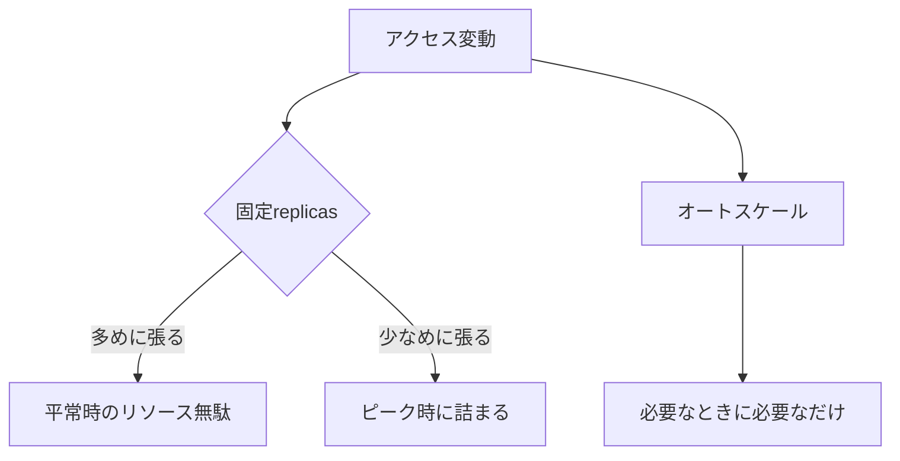
```mermaid
flowchart TB
    A[アクセス変動] --> B{固定replicas}
    B -->|多めに張る| C[平常時のリソース無駄]
    B -->|少なめに張る| D[ピーク時に詰まる]
    A --> E[オートスケール]
    E --> F[必要なときに必要なだけ]
```

「平日 10 時にアクセスが 10 倍になるサービス」を考えます。

- 平常時のキャパに合わせる → ピーク時に潰れる
- ピークに合わせる → 平常時の 90% は遊んでいる(コスト無駄)

オートスケーラは「**今の負荷に合わせて Pod 数を変える**」ことで、両方の問題を解決します。

## HPA(Horizontal Pod Autoscaler)の歴史

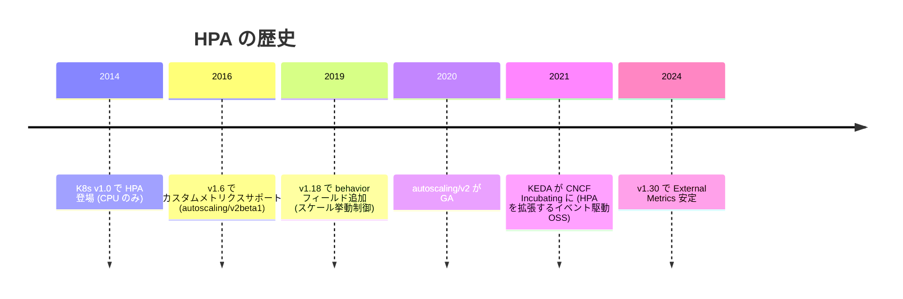
```mermaid
timeline
    title HPA の歴史
    2014 : K8s v1.0 で HPA 登場 (CPU のみ)
    2016 : v1.6 で カスタムメトリクスサポート (autoscaling/v2beta1)
    2019 : v1.18 で behavior フィールド追加 (スケール挙動制御)
    2020 : autoscaling/v2 が GA
    2021 : KEDA が CNCF Incubating に (HPA を拡張するイベント駆動 OSS)
    2024 : v1.30 で External Metrics 安定
```

K8s の HPA は元々「CPU 使用率だけ」の素朴な仕組みでしたが、現在では:

- 複数メトリクスの組み合わせ
- カスタムメトリクス(アプリ独自)
- 外部メトリクス(SQS の長さ、Datadog の値など)
- スケール上昇 / 下降の挙動制御
- 安定化ウィンドウ(フラッピング防止)

までカバーする豊富な機能を持っています。

## HPA の基本

サンプルアプリの API を CPU 使用率で水平スケールします。

```yaml
apiVersion: autoscaling/v2
kind: HorizontalPodAutoscaler
metadata:
  name: todo-api
  namespace: todo
spec:
  scaleTargetRef:
    apiVersion: apps/v1
    kind: Deployment
    name: todo-api
  minReplicas: 2
  maxReplicas: 10
  metrics:
  - type: Resource
    resource:
      name: cpu
      target:
        type: Utilization
        averageUtilization: 70
  behavior:
    scaleDown:
      stabilizationWindowSeconds: 300
      policies:
      - type: Percent
        value: 50
        periodSeconds: 60
    scaleUp:
      stabilizationWindowSeconds: 0
      policies:
      - type: Percent
        value: 100
        periodSeconds: 30
      - type: Pods
        value: 4
        periodSeconds: 30
      selectPolicy: Max
```

### 各フィールドの意味

| フィールド | 意味 |
|----------|------|
| `scaleTargetRef` | スケール対象の Deployment / StatefulSet / ReplicaSet |
| `minReplicas` | 最低レプリカ数(0 にすると Pod ゼロも可、KEDA の世界観)|
| `maxReplicas` | 最大レプリカ数。**安全装置として必須** |
| `metrics` | スケール判断に使うメトリクス(配列、複数指定可)|
| `behavior` | スケールアップ / ダウンの速度・閾値を細かく制御 |

### `metrics` の type

| type | 内容 | 例 |
|------|------|---|
| `Resource` | CPU / Memory(Metrics Server から)| 上記の例 |
| `Pods` | Pod ごとの平均値(カスタム)| RPS / コネクション数 |
| `Object` | 特定オブジェクトの値(Ingress など)| Ingress の RPS |
| `External` | 外部システムの値 | SQS の queue 長 |

### Resource タイプの target

| target.type | 意味 |
|------------|------|
| `Utilization` | Requests に対する % | `averageUtilization: 70` = Requests の 70% |
| `AverageValue` | 絶対値の Pod 平均 | `averageValue: 100m` |

`Utilization` を使うには **Pod に Requests が設定されている必要** があります(分母として使うため)。

## HPA のスケーリングアルゴリズム

これがコアです。

```
desiredReplicas = ceil(currentReplicas × (currentMetricValue / desiredMetricValue))
```

### 例

- 現在の replicas: 3
- 各 Pod の CPU 使用率: 90%(Requests 比)
- 目標: 70%

```
desired = ceil(3 × (90 / 70))
        = ceil(3 × 1.286)
        = ceil(3.857)
        = 4
```

→ 4 Pod に増やす。

逆に CPU が 30% になっていたら:

```
desired = ceil(3 × (30 / 70))
        = ceil(3 × 0.428)
        = ceil(1.286)
        = 2
```

→ 2 Pod に減らす。

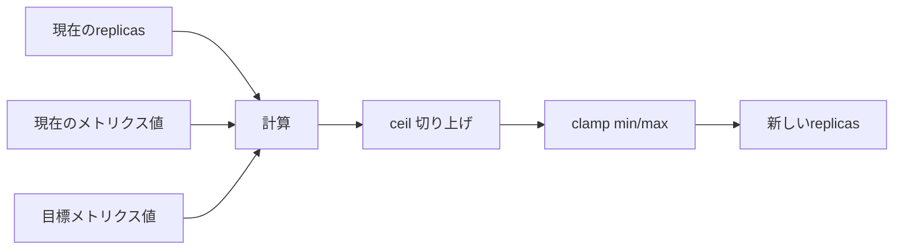
```mermaid
flowchart LR
    A[現在のreplicas] --> C[計算]
    B[現在のメトリクス値] --> C
    D[目標メトリクス値] --> C
    C --> E[ceil 切り上げ]
    E --> F[clamp min/max]
    F --> G[新しいreplicas]
```

### 振動防止の仕組み

このまま動かすと、**ピーク 100% → 1 サイクルで増える → 増えたら使用率下がる → すぐ減らされる → 増減繰り返し** という振動が起きます。

これを防ぐ仕組み:

#### 1. tolerance(許容範囲)

`currentMetric / desiredMetric` が `[0.9, 1.1]` の範囲なら **何もしない**(K8s 内部のデフォルト 10%)。
細かい変動で再計算しない。

#### 2. behavior.stabilizationWindow

過去 N 秒の **最小推奨値**(scaleUp 時)/ **最大推奨値**(scaleDown 時)を採用。

```yaml
behavior:
  scaleDown:
    stabilizationWindowSeconds: 300    # 過去 5 分の最大推奨を採用 = 安全側
  scaleUp:
    stabilizationWindowSeconds: 0      # 即時スケールアップ
```

「**上げは速く、下げはゆっくり**」が定石。アクセス急増時に出遅れると致命傷ですが、収束時に減らすのは慌てなくてよい、という非対称性。

#### 3. behavior.policies

スケール 1 回あたりの増減幅。

```yaml
scaleUp:
  policies:
  - type: Percent
    value: 100        # 既存 replicas の 100%(=倍)
    periodSeconds: 30
  - type: Pods
    value: 4          # 1 度に 4 Pod
    periodSeconds: 30
  selectPolicy: Max   # 上記 2 つの max を選択
```

`selectPolicy`:
- `Max`: 大きい方(攻め)
- `Min`: 小さい方(慎重)
- `Disabled`: スケール禁止

### 複数メトリクスの場合

```yaml
metrics:
- type: Resource
  resource:
    name: cpu
    target: {type: Utilization, averageUtilization: 70}
- type: Resource
  resource:
    name: memory
    target: {type: Utilization, averageUtilization: 80}
```

複数指定時は **それぞれで desired を計算 → 最大値を採用**(=最も多くの Pod が必要なメトリクスに合わせる)。

## HPA の前提条件

HPA を動かすには 2 つが必須です。

### 1. Metrics Server

CPU / Memory メトリクスを集めるコンポーネント。

```bash
kubectl apply -f https://github.com/kubernetes-sigs/metrics-server/releases/latest/download/components.yaml

# ローカルでは kubelet の証明書検証スキップが必要
kubectl edit -n kube-system deployment metrics-server
# args:
# - --kubelet-insecure-tls
```

確認:

```bash
kubectl top pod
kubectl top node
```

これが動かないと HPA は `unknown` のまま動きません。

### 2. Pod に Requests が設定されている

`Utilization` モードは「**Requests の N% 使ってる**」で計算するので、Requests がないと割り算ができません。

```yaml
resources:
  requests:
    cpu: 100m       # ←HPA に必須
```

`AverageValue` モードなら Requests なしでも動きますが、推奨は Requests あり。

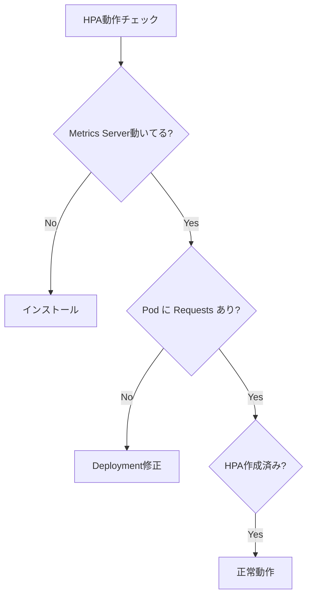
```mermaid
flowchart TB
    A[HPA動作チェック] --> B{Metrics Server動いてる?}
    B -->|No| C[インストール]
    B -->|Yes| D{Pod に Requests あり?}
    D -->|No| E[Deployment修正]
    D -->|Yes| F{HPA作成済み?}
    F -->|Yes| G[正常動作]
```

## HPA の動作確認

```bash
kubectl get hpa
# NAME       REFERENCE              TARGETS   MINPODS   MAXPODS   REPLICAS   AGE
# todo-api   Deployment/todo-api    25%/70%   2         10        2          5m
```

| カラム | 意味 |
|------|------|
| `TARGETS` | 現在値/目標値 |
| `REPLICAS` | 現在の replicas |
| `unknown` だったら | Metrics Server か Requests を確認 |

詳細:

```bash
kubectl describe hpa todo-api
# 直近のスケール判断、エラーがあれば表示される

kubectl get hpa todo-api -o yaml
# status.conditions, status.currentMetrics を見る
```

## カスタムメトリクスでの HPA

CPU / Memory だけでは不十分なケース:

- **Worker キューの長さ** で前段の Worker をスケール
- **HTTP RPS** でフロントエンドをスケール
- **gRPC リクエスト数** で API をスケール

これらは Prometheus + prometheus-adapter で実現します。

### 構成

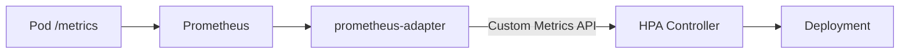
```mermaid
flowchart LR
    pod[Pod /metrics] --> prom[Prometheus]
    prom --> adapter[prometheus-adapter]
    adapter -- Custom Metrics API --> hpa[HPA Controller]
    hpa --> deploy[Deployment]
```

### prometheus-adapter のインストール

```bash
helm repo add prometheus-community https://prometheus-community.github.io/helm-charts
helm install prometheus-adapter prometheus-community/prometheus-adapter \
  --namespace monitoring \
  --set prometheus.url=http://prometheus.monitoring.svc.cluster.local
```

### HPA 定義

```yaml
apiVersion: autoscaling/v2
kind: HorizontalPodAutoscaler
metadata:
  name: todo-api
spec:
  scaleTargetRef: {apiVersion: apps/v1, kind: Deployment, name: todo-api}
  minReplicas: 2
  maxReplicas: 20
  metrics:
  - type: Pods
    pods:
      metric:
        name: http_requests_per_second
      target:
        type: AverageValue
        averageValue: 100      # 1 Pod あたり 100 RPS を目標
```

`http_requests_per_second` はアプリが Prometheus に export している、という前提。FastAPI なら `prometheus-fastapi-instrumentator` を使うのが一般的。

### Object メトリクス(Ingress 単位)

```yaml
metrics:
- type: Object
  object:
    describedObject:
      apiVersion: networking.k8s.io/v1
      kind: Ingress
      name: todo-ingress
    metric:
      name: requests-per-second
    target:
      type: Value
      value: 1k
```

詳細は第 9 章の[メトリクス]({{ '/09-observability/metrics/' | relative_url }})で構築します。

## KEDA(Kubernetes Event-driven Autoscaling)

HPA の弱点:

- スケジュールベースのスケール(平日 9 時に増やす)が書けない
- 外部システム(Kafka、SQS、RabbitMQ、PostgreSQL)の値で直接スケールしにくい
- `replicas: 0` まで縮小できない(Deployment の制約 + HPA の minReplicas 1 以上)

これらを解決するのが **KEDA**(CNCF Incubating)。

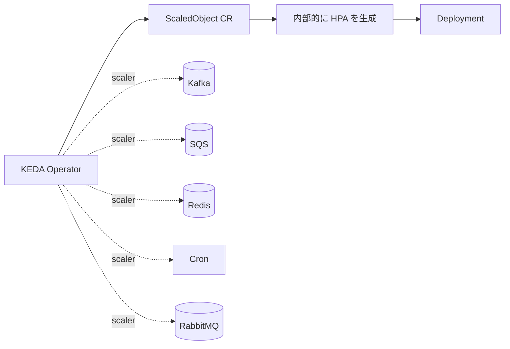
```mermaid
flowchart LR
    keda[KEDA Operator] --> scaledObject[ScaledObject CR]
    scaledObject --> hpa2[内部的に HPA を生成]
    hpa2 --> deploy2[Deployment]
    keda -.scaler.-> kafka[(Kafka)]
    keda -.scaler.-> sqs[(SQS)]
    keda -.scaler.-> redis[(Redis)]
    keda -.scaler.-> cron[Cron]
    keda -.scaler.-> rabbitmq[(RabbitMQ)]
```

KEDA は **HPA を内部生成する**ラッパー。さらに 60 種類以上の scaler(各種メトリクスソース)を持っています。

### KEDA の例(Redis Queue 長)

```yaml
apiVersion: keda.sh/v1alpha1
kind: ScaledObject
metadata:
  name: todo-worker
spec:
  scaleTargetRef:
    name: todo-worker
  minReplicaCount: 0           # ←ゼロまで縮める
  maxReplicaCount: 50
  triggers:
  - type: redis
    metadata:
      address: redis:6379
      listName: queue:notification
      listLength: "10"          # キュー長 10 を目標
```

これだけで「Redis のキューに溜まってきたら Worker 増やす」が実現します。
通常の HPA では難しい構成。

| 比較 | HPA(素のまま)| KEDA |
|------|--------------|------|
| 対応メトリクス | CPU/Mem + カスタム(Prom 経由) | 60+ scaler ネイティブ対応 |
| `replicas: 0` | 不可 | 可能 |
| Cron スケーリング | 不可(別途 CronJob 必要) | 可能 |
| 構成の手数 | adapter 設定必要 | scaler を YAML 1 枚で |

本番ではバッチ系・Worker 系には KEDA、Web 系には HPA、という使い分けがよくあります。

## VPA(Vertical Pod Autoscaler)

実測値に基づいて Pod の Requests を自動調整するコンポーネント。

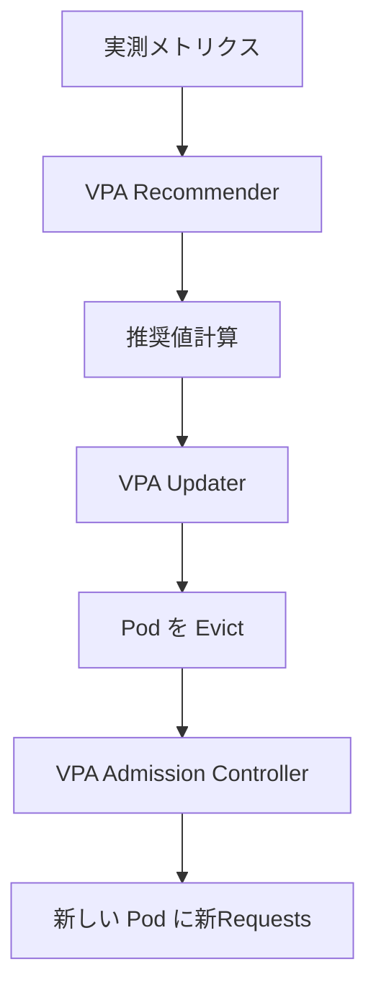
```mermaid
flowchart TB
    metrics[実測メトリクス] --> recommender[VPA Recommender]
    recommender --> recommendation[推奨値計算]
    recommendation --> updater[VPA Updater]
    updater --> evict[Pod を Evict]
    evict --> admission[VPA Admission Controller]
    admission --> newpod[新しい Pod に新Requests]
```

### VPA のコンポーネント

| コンポーネント | 役割 |
|--------------|------|
| **Recommender** | メトリクスから推奨値を計算 |
| **Updater** | 既存 Pod を evict して新値で立ち上げ直し |
| **Admission Plugin** | Pod 生成時に Requests を書き換える |

### updateMode の 4 種類

| モード | 動作 |
|-------|------|
| `Off` | 推奨値を計算するだけ。手動適用前提 |
| `Initial` | 新規 Pod 作成時のみ反映、稼働中は触らない |
| `Recreate` | 旧 Pod を削除して新 Pod を作る(古い)|
| `Auto` | Recreate と同じ(将来 in-place update に置き換え予定)|

### VPA インストール

```bash
git clone https://github.com/kubernetes/autoscaler.git
cd autoscaler/vertical-pod-autoscaler
./hack/vpa-up.sh

kubectl get pods -n kube-system | grep vpa
# vpa-admission-controller-...    Running
# vpa-recommender-...             Running
# vpa-updater-...                 Running
```

### VPA の使い方(推奨だけ見る = Off モード)

```yaml
apiVersion: autoscaling.k8s.io/v1
kind: VerticalPodAutoscaler
metadata:
  name: todo-api
spec:
  targetRef:
    apiVersion: apps/v1
    kind: Deployment
    name: todo-api
  updatePolicy:
    updateMode: "Off"
```

数日動かして:

```bash
kubectl describe vpa todo-api
```

期待される出力:

```
Recommendation:
  Container Recommendations:
    Container Name:  api
    Lower Bound:                # この値以下にしないで(Pod が苦しくなる)
      Cpu:     50m
      Memory:  100Mi
    Target:                     # 推奨値
      Cpu:     150m
      Memory:  200Mi
    Uncapped Target:
      Cpu:     150m
      Memory:  200Mi
    Upper Bound:                # この値以上は不要
      Cpu:     500m
      Memory:  500Mi
```

これを見て、Deployment の Requests を手動で更新するのが安全な使い方。

### VPA の使い方(自動 = Auto モード)

```yaml
spec:
  updatePolicy:
    updateMode: "Auto"
```

VPA Updater が定期的に Pod を evict → 新値で起動。
**動作中の Pod を殺すので、Probe + replicas:2+ + PDB が必須**。

### VPA と HPA の併用 ─ 最大の落とし穴

{: .warning }
**HPA と VPA を「同じリソース」「同じ指標」で運用すると、フィードバックループで暴れます**。

例:

- HPA が CPU 使用率で Pod 増減
- VPA が CPU 使用量で Requests 調整
- VPA が Requests を増やす → 同じ実使用量に対する Utilization 下がる → HPA が Pod を減らす → 1 Pod の負荷上がる → VPA がさらに Requests 増やす → …

組み合わせるなら **指標を分ける**:

```yaml
# HPA: CPU で水平
metrics:
- type: Resource
  resource: {name: cpu, target: {type: Utilization, averageUtilization: 70}}

# VPA: Memory のみ調整
spec:
  resourcePolicy:
    containerPolicies:
    - containerName: api
      controlledResources: ["memory"]    # ←memory のみ VPA が触る
```

## Cluster Autoscaler

Pod がスケジュールできない(ノードリソース不足)とき、ノードを自動で追加するコンポーネント。

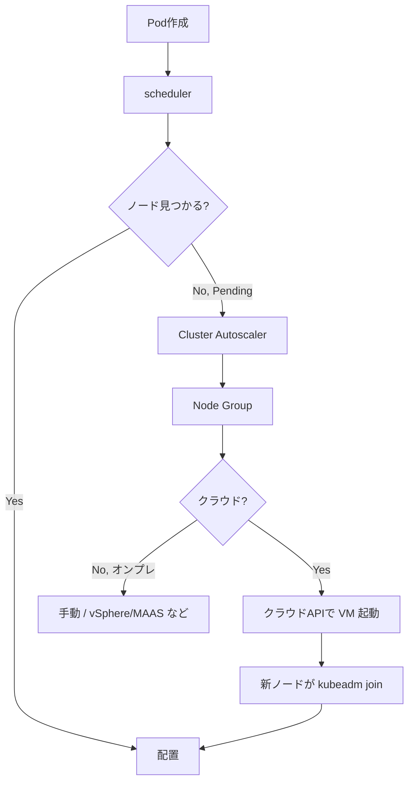
```mermaid
flowchart TB
    pod[Pod作成] --> sched[scheduler]
    sched --> result{ノード見つかる?}
    result -->|Yes| placed[配置]
    result -->|No, Pending| ca[Cluster Autoscaler]
    ca --> ng[Node Group]
    ng --> cloud{クラウド?}
    cloud -->|Yes| api[クラウドAPIで VM 起動]
    cloud -->|No, オンプレ| manual[手動 / vSphere/MAAS など]
    api --> join[新ノードが kubeadm join]
    join --> placed
```

### CA がやっていること

1. **scale up**: Pending な Pod を発見 → ノードグループから VM プロビジョン → kubelet が join するのを待つ → 配置
2. **scale down**: 使用率の低いノードを検出 → そのノードの Pod を別ノードに移動 → ノード削除

### クラウドでの動作

EKS / GKE / AKS では Auto Scaling Group / Managed Instance Group / VMSS に対して動きます。
ノード追加 / 削除がワンコマンドで実現。

### オンプレでの難しさ

オンプレで CA を動かすには「VM の自動プロビジョニング基盤」が必要:

| ベース | 対応 |
|-------|------|
| VMware vSphere | [vsphere-autoscaler](https://github.com/kubernetes/autoscaler/tree/master/cluster-autoscaler/cloudprovider/vsphere) |
| OpenStack | OpenStack provider |
| MAAS | Bare Metal As A Service |
| Cluster API | 標準的な道(K8s で K8s 管理)|

ローカル kubeadm + VMware Workstation では現実的ではないので、**疑似体験** で代用します。

### 疑似 CA: 手動スケールスクリプト

`k8s-lb` 上で:

```bash
#!/bin/bash
# scripts/add-worker.sh
set -e
VM_NAME=${1:-k8s-w$(date +%s)}
TEMPLATE=/vm/template/ubuntu-template.vmx

vmrun clone $TEMPLATE /vm/${VM_NAME}.vmx linked -cloneName=$VM_NAME
vmrun start /vm/${VM_NAME}.vmx nogui

# DHCP / Cloud-init で hostname と IP が設定される前提
sleep 60

JOIN_CMD=$(kubeadm token create --print-join-command)
ssh root@${VM_NAME} "$JOIN_CMD"

echo "Joined: $VM_NAME"
```

```bash
#!/bin/bash
# scripts/remove-worker.sh
NODE=$1

kubectl drain $NODE --ignore-daemonsets --delete-emptydir-data
kubectl delete node $NODE
ssh root@$NODE "kubeadm reset -f"
vmrun stop /vm/${NODE}.vmx
vmrun deleteVM /vm/${NODE}.vmx
```

CA の本質は **「Pending な Pod を検知 → ノード追加」「使用率低いノードを検知 → ノード削除」** です。
events を眺めながら手動で実行することで、感覚は十分掴めます。

## 3 つのオートスケーラの組み合わせ

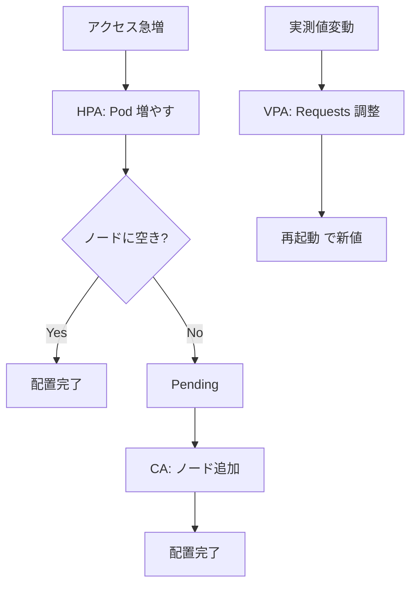
```mermaid
flowchart TB
    A[アクセス急増] --> B[HPA: Pod 増やす]
    B --> C{ノードに空き?}
    C -->|Yes| D[配置完了]
    C -->|No| E[Pending]
    E --> F[CA: ノード追加]
    F --> G[配置完了]
    H[実測値変動] --> I[VPA: Requests 調整]
    I --> J[再起動 で新値]
```

理想形:

- **VPA(Off モード)** で Requests の妥当値を見つける
- **HPA** で水平スケール
- **CA** でノード自動拡張

## ハンズオン

### 1. HPA を動かす

Metrics Server がインストール済み・サンプル API に Requests あり、を前提。

```yaml
# hpa.yaml
apiVersion: autoscaling/v2
kind: HorizontalPodAutoscaler
metadata:
  name: todo-api
  namespace: todo
spec:
  scaleTargetRef:
    apiVersion: apps/v1
    kind: Deployment
    name: todo-api
  minReplicas: 2
  maxReplicas: 10
  metrics:
  - type: Resource
    resource:
      name: cpu
      target:
        type: Utilization
        averageUtilization: 50
```

```bash
kubectl apply -f hpa.yaml
kubectl get hpa todo-api
# todo-api  Deployment/todo-api  3%/50%  2  10  2  10s
```

### 2. 負荷生成

```bash
# williamyeh/hey は HTTP ベンチツール
kubectl run -it loadgen --rm --image=williamyeh/hey -- \
  -z 60s -c 50 -q 100 http://todo-api/api/todos
```

別端末で:

```bash
kubectl get hpa todo-api -w
# todo-api  Deployment/todo-api  72%/50%   2  10  2   1m
# todo-api  Deployment/todo-api  72%/50%   2  10  3   1m
# todo-api  Deployment/todo-api  88%/50%   2  10  3   2m
# todo-api  Deployment/todo-api  88%/50%   2  10  6   2m
# todo-api  Deployment/todo-api  45%/50%   2  10  6   3m

kubectl get pods -l app.kubernetes.io/name=todo-api -w
# todo-api-xxx  1/1  Running  0  10s     ←新規作成された Pod
```

### 3. 負荷停止

負荷を止めると、CPU が下がってきます。

```bash
# 5 分くらい待つと(stabilizationWindowSeconds=300 のため)
kubectl get hpa todo-api
# todo-api  Deployment/todo-api  3%/50%  2  10  2  10m
# ←minReplicas に戻った
```

### 4. behavior の効果を観察

`stabilizationWindowSeconds: 0` と `300` の違いを試して、減速の挙動を比較。

### 5. VPA(Off モード)で推奨値

VPA を入れて 1 日動かす:

```bash
kubectl apply -f vpa.yaml         # updateMode: Off
# 24 時間後
kubectl describe vpa todo-api | grep -A 20 Recommendation
```

Lower Bound / Target / Upper Bound を Deployment に手動反映。

### 6. 疑似 CA を体験

`replicas: 30` などの大きな値で Deployment 更新 → Pending Pod が出る → スクリプトで Worker 追加 → 配置されることを確認。

## トラブルシューティング

### 症状: HPA が `<unknown>/<target>` のまま

```bash
kubectl describe hpa todo-api
```

ありがちなメッセージ:

| メッセージ | 原因 | 対処 |
|----------|------|------|
| `failed to get cpu utilization: missing request for cpu` | Pod に CPU Requests なし | Deployment 修正 |
| `unable to fetch metrics from resource metrics API` | Metrics Server 不調 | `kubectl top pod` 確認 |
| `the HPA was unable to compute the replica count: did not receive metrics` | しばらく待つ(初期化中) | 1〜2 分待つ |
| `failed to get pod metrics ...` | RBAC | metrics-server の RBAC 確認 |

### 症状: HPA がスケールしない

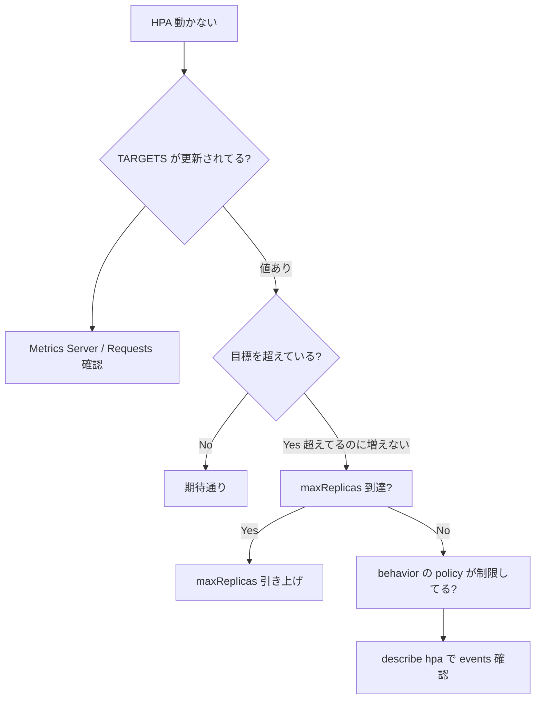
```mermaid
flowchart TB
    A[HPA 動かない] --> B{TARGETS が更新されてる?}
    B -->|<unknown>| C[Metrics Server / Requests 確認]
    B -->|値あり| D{目標を超えている?}
    D -->|No| E[期待通り]
    D -->|Yes 超えてるのに増えない| F[maxReplicas 到達?]
    F -->|Yes| G[maxReplicas 引き上げ]
    F -->|No| H[behavior の policy が制限してる?]
    H --> I[describe hpa で events 確認]
```

### 症状: HPA が暴れる(増減を繰り返す)

→ `stabilizationWindow` を伸ばす、`tolerance` を超える値で目標を再設定。

### 症状: VPA で Pod が頻繁に再起動

→ `updateMode: Off` か `Initial` に。Auto は本番ですぐ使うべきではない。

### 症状: CA がノード追加しない

→ `cluster-autoscaler` のログを見る。Cloud Provider のクオータ枯渇、Pod の `nodeSelector` で配置できるノードがない、などが原因。

## 主要コマンドと期待出力

```bash
kubectl get hpa
# 全 HPA 一覧

kubectl describe hpa todo-api
# 詳細(直近の判断、events 含む)

kubectl get hpa todo-api -o yaml
# 完全な状態

# 強制的にスケールしてテスト
kubectl scale deployment todo-api --replicas=5     # ←HPA より優先
kubectl get hpa                                     # HPA は維持しようとする

# HPA を一時無効化
kubectl annotate hpa todo-api autoscaling.alpha.kubernetes.io/scale-down-disabled=true
```

## 代替手法・関連

| ツール | 用途 |
|-------|------|
| **HPA**(K8s 標準)| 一般的な水平スケール |
| **KEDA** | イベント駆動・ゼロスケール |
| **VPA** | Requests の自動調整 |
| **Cluster Autoscaler** | ノード数自動調整 |
| **Karpenter**(AWS 発祥)| CA の置き換え。より柔軟 |
| **CAS / GAS** | 複数クラスタ across |
| **Knative** | サーバーレス、ゼロスケール |
| **OpenKruise CloneSet** | より細かいスケール戦略 |

### Karpenter

AWS が開発、Apache 2.0。CA と違い「Node Group」概念がなく、Pod 要件から最適な VM タイプを動的に選んで起動。
オンプレ対応はまだ限定的。

## 本番運用のベストプラクティス

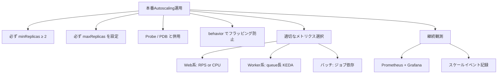
```mermaid
flowchart TB
    A[本番Autoscaling運用] --> B[必ず minReplicas ≥ 2]
    A --> C[必ず maxReplicas を設定]
    A --> D[Probe / PDB と併用]
    A --> E[behavior でフラッピング防止]
    A --> F[適切なメトリクス選択]
    F --> F1[Web系: RPS or CPU]
    F --> F2[Worker系: queue長 KEDA]
    F --> F3[バッチ: ジョブ依存]
    A --> G[継続観測]
    G --> G1[Prometheus + Grafana]
    G --> G2[スケールイベント記録]
```

## チェックポイント

- [ ] HPA / VPA / CA の役割の違いを言える
- [ ] HPA を動かす前提条件を 2 つ言える
- [ ] HPA のスケール計算式を空で書ける
- [ ] `behavior.scaleUp` と `behavior.scaleDown` を非対称にする理由
- [ ] HPA と VPA を同じ Pod に当てるときの注意
- [ ] カスタムメトリクスでの HPA 構成図を書ける
- [ ] KEDA が解決する課題を 3 つ挙げられる
- [ ] VPA の updateMode 4 種類を言える
- [ ] Cluster Autoscaler がオンプレで動かしにくい理由を説明できる
- [ ] 「HPA がスケールしない」のときの調査手順を言える

→ 次は [Scheduling (Affinity/PDB/Taint)]({{ '/07-production/scheduling/' | relative_url }})
