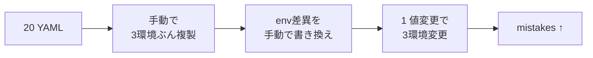
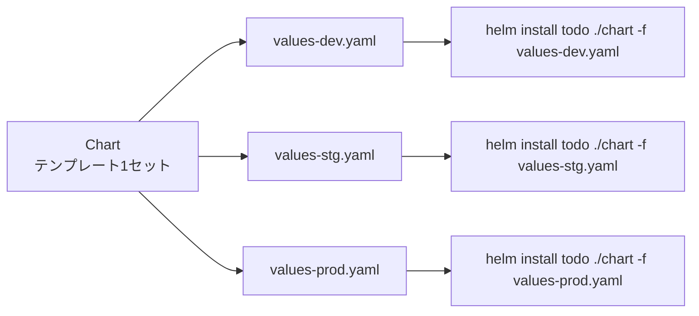
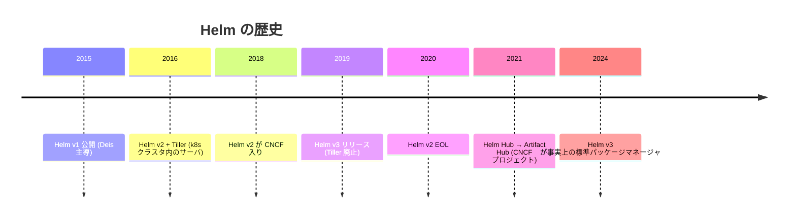
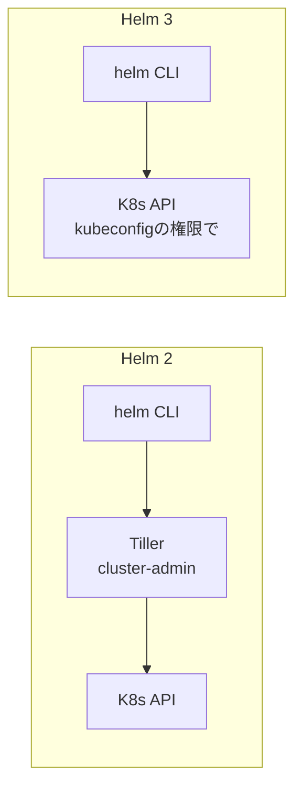
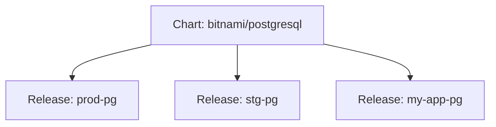
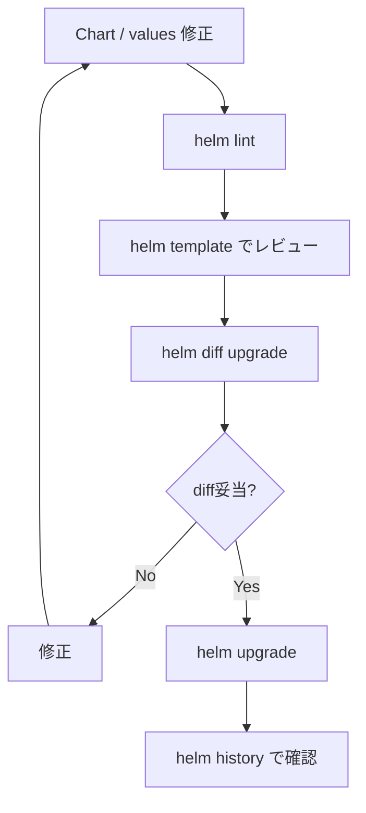
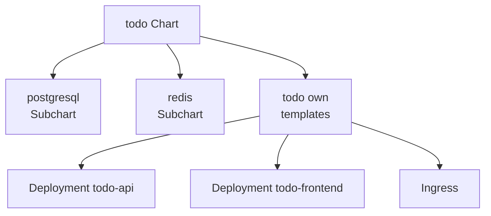
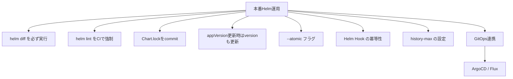

# Helm
{: .no_toc }

## 目次
{: .no_toc .text-delta }

1. TOC
{:toc}

---

**Helm** は Kubernetes のパッケージマネージャです。
1 つのアプリに必要な複数の YAML をまとめてテンプレート化し、`values.yaml` でパラメタライズします。
Linux で言えば apt や yum、Mac の brew、Node.js の npm に相当する位置付けです。

## このページのゴール

このページを読み終えると、以下を **自分の言葉で説明できる** ようになります。

- Helm が解決する課題(命名規則、環境差異、配布)を説明できる
- Chart / Release / Repository の関係を図にできる
- Go template の主要構文を読める / 書ける
- `helm upgrade` で何が起きるか、ロールバックの仕組みを説明できる
- Helm 2 から 3 で Tiller がなくなった理由(セキュリティ問題)を説明できる
- Subchart / Dependency の構造を理解している
- Helm と Kustomize を併用する典型パターンを説明できる
- `helm template` / `helm diff` を使った安全な運用ができる

## なぜ Helm が必要か

サンプル TODO アプリを K8s にデプロイするために必要な YAML を数えてみます。

| リソース | 必要数 |
|---------|------|
| Deployment(api / frontend / worker) | 3 |
| StatefulSet(postgres / redis) | 2 |
| Service(api / frontend / postgres / redis) | 4 |
| ConfigMap | 2 |
| Secret | 2 |
| Ingress | 1 |
| HPA | 1 |
| PDB | 2 |
| ServiceAccount | 1 |
| RBAC | 1 |
| **合計** | **約 20** |

これを dev / stg / prod の 3 環境に展開すると **60 ファイル**。さらに「prod の API は replicas を増やしたい」「stg は HPA 無効」など、**環境差異** が出てきます。



これを Helm で書けば:



テンプレートは 1 セット。環境ごとに値だけ変える。

## Helm の歴史



### Helm 2 から 3 への移行(Tiller 廃止)

Helm 2 はクラスタ内に **Tiller** というサーバを動かしていました。`helm install` するとクライアント(`helm` CLI)が Tiller に依頼し、Tiller が cluster-admin 権限で K8s API を叩く構成でした。



Tiller の問題点:

- **セキュリティ**: Tiller は cluster-admin 権限で動く。Tiller への gRPC 接続を奪われたら全クラスタ掌握
- **冗長**: kubeconfig の認証情報があるなら直接 API 叩けばよい
- **可視性**: Tiller の動作が見えない

Helm 3 はこれを廃止し、CLI が直接 K8s API を叩くアーキテクチャに。**インストールも管理も簡単**に。

参考: [Helm v3.0.0 has been released!](https://helm.sh/blog/helm-3-released/)

## 基本概念

| | 意味 | 例 |
|---|------|---|
| **Chart** | パッケージ(テンプレート + デフォルト values + メタ情報)| `bitnami/postgresql` |
| **Release** | クラスタにインストールしたインスタンス | `my-pg`(prod の Postgres)|
| **Repository** | Chart の配布元 | `https://charts.bitnami.com/bitnami` |
| **Artifact Hub** | Chart の検索ポータル | <https://artifacthub.io/> |

Chart は「クラス」、Release は「インスタンス」と覚えるとわかりやすいです。同じ Chart から異なる名前で複数 Release を作れます。



## Helm のインストール

```bash
# macOS
brew install helm

# Linux (script)
curl https://raw.githubusercontent.com/helm/helm/main/scripts/get-helm-3 | bash

# Windows
choco install kubernetes-helm

# 確認
helm version
# version.BuildInfo{Version:"v3.14.x",...}
```

シェル補完:

```bash
# bash
helm completion bash > /etc/bash_completion.d/helm
# zsh
helm completion zsh > "${fpath[1]}/_helm"
```

## サードパーティ Chart の利用

最も気軽な使い方。Bitnami の PostgreSQL を入れる例:

```bash
helm repo add bitnami https://charts.bitnami.com/bitnami
helm repo update

# 検索
helm search repo postgres
# NAME                CHART VERSION  APP VERSION  DESCRIPTION
# bitnami/postgresql  15.5.0         16.2.0       PostgreSQL...

# 値の確認
helm show values bitnami/postgresql > postgres-values.yaml

# インストール
helm install my-pg bitnami/postgresql -n cache --create-namespace \
  --set auth.password=secret123 \
  --set primary.persistence.size=10Gi

# 一覧
helm list -A
# NAME    NAMESPACE  REVISION  UPDATED  STATUS    CHART
# my-pg   cache      1         ...      deployed  postgresql-15.5.0

# アップグレード(設定変更)
helm upgrade my-pg bitnami/postgresql -n cache --reuse-values \
  --set primary.persistence.size=20Gi

# 履歴
helm history my-pg -n cache
# REVISION  UPDATED  STATUS    CHART
# 1         ...      deployed  postgresql-15.5.0
# 2         ...      deployed  postgresql-15.5.0    ←サイズ変更後

# ロールバック
helm rollback my-pg 1 -n cache

# 削除
helm uninstall my-pg -n cache
```

各コマンドの主要オプション:

### helm install

| フラグ | 意味 |
|-------|------|
| `--namespace` (`-n`) | デプロイ先 Namespace |
| `--create-namespace` | Namespace がなければ作成 |
| `--set key=value` | values の上書き(複数指定可)|
| `--values` (`-f`) | values ファイル指定(複数指定可、後勝ち)|
| `--version` | 特定の Chart バージョン |
| `--wait` | 全リソース Ready まで待つ |
| `--timeout 5m` | wait の上限 |
| `--atomic` | 失敗時に自動 rollback |
| `--dry-run` | 実行せず YAML 表示 |
| `--debug` | 詳細ログ |

### helm upgrade

| フラグ | 意味 |
|-------|------|
| `--install` | リリースなければ install と同じに |
| `--reuse-values` | 既存 values を引き継ぐ |
| `--reset-values` | values をリセット |
| `--force` | 強制再作成(immutable フィールド変更時)|

`helm upgrade --install` のパターンは CI/CD で頻出。リリース有無を気にしなくていい。

## サンプルアプリを Chart 化

`helm create` でテンプレート生成。

```bash
helm create todo
```

生成される構造:

```
todo/
├── Chart.yaml              # メタ情報
├── values.yaml             # デフォルト値
├── .helmignore             # パッケージング除外
├── charts/                 # Subchart 置き場
└── templates/
    ├── deployment.yaml
    ├── service.yaml
    ├── ingress.yaml
    ├── serviceaccount.yaml
    ├── hpa.yaml
    ├── _helpers.tpl        # template ヘルパー
    ├── NOTES.txt           # install 後に表示するメッセージ
    └── tests/
        └── test-connection.yaml
```

### Chart.yaml

```yaml
apiVersion: v2
name: todo
description: A Helm chart for the todo sample app
type: application

# Chart 自身のバージョン(Helm に渡す)
version: 0.1.0

# パッケージされる app のバージョン
appVersion: "0.1.0"

dependencies: []

keywords:
- todo
- sample

home: https://example.com/todo
sources:
- https://github.com/example/todo

maintainers:
- name: Your Name
  email: you@example.com
```

| フィールド | 意味 |
|---------|------|
| `apiVersion` | `v2`(Helm 3 系)|
| `version` | Chart のバージョン。**Chart 内容を変えるたびに上げる** |
| `appVersion` | パッケージするアプリのバージョン |
| `type` | `application`(普通)/ `library`(他 Chart から呼ばれる用)|

### values.yaml

```yaml
replicaCount: 2

image:
  repository: 192.168.56.10:5000/todo-api
  tag: "0.1.0"
  pullPolicy: IfNotPresent

service:
  type: ClusterIP
  port: 80
  targetPort: 8000

ingress:
  enabled: true
  className: nginx
  annotations: {}
  hosts:
  - host: todo.local
    paths:
    - path: /
      pathType: Prefix
  tls: []

resources:
  requests:
    cpu: 100m
    memory: 128Mi
  limits:
    memory: 256Mi

probe:
  liveness:
    path: /healthz
    initialDelaySeconds: 0
    periodSeconds: 10
  readiness:
    path: /readyz
    periodSeconds: 5

postgres:
  enabled: true
  password: changeme
  storageSize: 5Gi

redis:
  enabled: true

autoscaling:
  enabled: false
  minReplicas: 2
  maxReplicas: 10
  targetCPUUtilizationPercentage: 70

podDisruptionBudget:
  enabled: false
  minAvailable: 1

nodeSelector: {}
tolerations: []
affinity: {}
```

### _helpers.tpl(共通ロジック)

```
{{/*
名前生成
*/}}
{{- define "todo.fullname" -}}
{{- if .Values.fullnameOverride }}
{{- .Values.fullnameOverride | trunc 63 | trimSuffix "-" }}
{{- else }}
{{- $name := default .Chart.Name .Values.nameOverride }}
{{- if contains $name .Release.Name }}
{{- .Release.Name | trunc 63 | trimSuffix "-" }}
{{- else }}
{{- printf "%s-%s" .Release.Name $name | trunc 63 | trimSuffix "-" }}
{{- end }}
{{- end }}
{{- end }}

{{/*
Chart 名
*/}}
{{- define "todo.name" -}}
{{- default .Chart.Name .Values.nameOverride | trunc 63 | trimSuffix "-" }}
{{- end }}

{{/*
共通ラベル
*/}}
{{- define "todo.labels" -}}
helm.sh/chart: {{ include "todo.chart" . }}
{{ include "todo.selectorLabels" . }}
{{- if .Chart.AppVersion }}
app.kubernetes.io/version: {{ .Chart.AppVersion | quote }}
{{- end }}
app.kubernetes.io/managed-by: {{ .Release.Service }}
{{- end }}

{{/*
selector ラベル
*/}}
{{- define "todo.selectorLabels" -}}
app.kubernetes.io/name: {{ include "todo.name" . }}
app.kubernetes.io/instance: {{ .Release.Name }}
{{- end }}

{{- define "todo.chart" -}}
{{- $name := printf "%s-%s" .Chart.Name .Chart.Version }}
{{- $name | replace "+" "_" | trunc 63 | trimSuffix "-" }}
{{- end }}
```

これらは `templates/*.yaml` から `{{ include "todo.fullname" . }}` などで呼び出します。

### templates/deployment.yaml

```yaml
apiVersion: apps/v1
kind: Deployment
metadata:
  name: {{ include "todo.fullname" . }}
  labels:
    {{- include "todo.labels" . | nindent 4 }}
spec:
  {{- if not .Values.autoscaling.enabled }}
  replicas: {{ .Values.replicaCount }}
  {{- end }}
  selector:
    matchLabels:
      {{- include "todo.selectorLabels" . | nindent 6 }}
  template:
    metadata:
      annotations:
        checksum/config: {{ include (print $.Template.BasePath "/configmap.yaml") . | sha256sum }}
        checksum/secret: {{ include (print $.Template.BasePath "/secret.yaml") . | sha256sum }}
      labels:
        {{- include "todo.selectorLabels" . | nindent 8 }}
    spec:
      {{- with .Values.imagePullSecrets }}
      imagePullSecrets:
        {{- toYaml . | nindent 8 }}
      {{- end }}
      containers:
      - name: api
        image: "{{ .Values.image.repository }}:{{ .Values.image.tag | default .Chart.AppVersion }}"
        imagePullPolicy: {{ .Values.image.pullPolicy }}
        ports:
        - containerPort: {{ .Values.service.targetPort }}
          name: http
        livenessProbe:
          httpGet:
            path: {{ .Values.probe.liveness.path }}
            port: http
          initialDelaySeconds: {{ .Values.probe.liveness.initialDelaySeconds }}
          periodSeconds: {{ .Values.probe.liveness.periodSeconds }}
        readinessProbe:
          httpGet:
            path: {{ .Values.probe.readiness.path }}
            port: http
          periodSeconds: {{ .Values.probe.readiness.periodSeconds }}
        resources:
          {{- toYaml .Values.resources | nindent 10 }}
        envFrom:
        - configMapRef:
            name: {{ include "todo.fullname" . }}
        - secretRef:
            name: {{ include "todo.fullname" . }}-secret
      {{- with .Values.nodeSelector }}
      nodeSelector:
        {{- toYaml . | nindent 8 }}
      {{- end }}
      {{- with .Values.affinity }}
      affinity:
        {{- toYaml . | nindent 8 }}
      {{- end }}
      {{- with .Values.tolerations }}
      tolerations:
        {{- toYaml . | nindent 8 }}
      {{- end }}
```

ポイント:

- `{{ }}` で囲んで Go テンプレートを書く
- `.Values.foo` で values.yaml の値、`.Chart.foo` で Chart.yaml、`.Release.foo` で Release 情報
- `nindent N` は改行 + N 個の indent
- `toYaml` は構造を YAML 化
- `with` は値があれば代入、なければスキップ
- `default` はデフォルト値
- `include` は他テンプレート呼び出し

### checksum アノテーションのテクニック

```yaml
template:
  metadata:
    annotations:
      checksum/config: {{ include (print $.Template.BasePath "/configmap.yaml") . | sha256sum }}
```

ConfigMap / Secret の内容が変わると、Pod template の annotation が変わる → Deployment の rolloutUpdate が走る。
これがないと「ConfigMap 更新したのに Pod に反映されない」事故になります。

## Go テンプレートの主要構文

### 値参照

```
{{ .Values.replicaCount }}            # values.yaml の値
{{ .Chart.Name }}                     # Chart.yaml の name
{{ .Release.Name }}                   # `helm install` 時に指定した名前
{{ .Release.Namespace }}              # デプロイ先
```

### 条件分岐

```
{{- if .Values.ingress.enabled }}
... ingress 関連 ...
{{- end }}

{{- if eq .Values.service.type "LoadBalancer" }}
{{- end }}

{{- if and .Values.foo.enabled .Values.bar.enabled }}
{{- end }}
```

### ループ

```
{{- range .Values.ingress.hosts }}
- host: {{ .host | quote }}
  http:
    paths:
    {{- range .paths }}
    - path: {{ .path }}
      pathType: {{ .pathType }}
    {{- end }}
{{- end }}
```

### パイプ

```
{{ .Values.foo | upper }}
{{ .Values.foo | default "bar" }}
{{ .Values.foo | quote }}
{{ .Values.foo | toYaml | nindent 4 }}
```

### `-` の意味

```
{{- if foo -}}
```

`{{-` は左の空白を削除、`-}}` は右の空白を削除。テンプレート結果の余分な空行を除去。

## 環境ごとの values

```bash
# values の優先順位(後勝ち):
# 1. Chart 同梱の values.yaml
# 2. -f で渡したファイル(複数指定可、後ろが優先)
# 3. --set / --set-file / --set-string

helm install todo ./todo -n prod --create-namespace \
  -f values-prod.yaml \
  --set image.tag=1.2.3
```

`values-dev.yaml`:

```yaml
replicaCount: 1
resources:
  requests: {cpu: 50m, memory: 64Mi}
ingress:
  hosts:
  - host: todo.dev.local
    paths: [{path: /, pathType: Prefix}]
postgres:
  storageSize: 1Gi
autoscaling:
  enabled: false
```

`values-prod.yaml`:

```yaml
replicaCount: 3
resources:
  requests: {cpu: 200m, memory: 256Mi}
  limits: {memory: 512Mi}
ingress:
  hosts:
  - host: todo.example.com
    paths: [{path: /, pathType: Prefix}]
  tls:
  - hosts: [todo.example.com]
    secretName: todo-tls
postgres:
  storageSize: 50Gi
autoscaling:
  enabled: true
  minReplicas: 3
  maxReplicas: 20
podDisruptionBudget:
  enabled: true
  minAvailable: 2
affinity:
  podAntiAffinity:
    requiredDuringSchedulingIgnoredDuringExecution:
    - labelSelector:
        matchLabels:
          app.kubernetes.io/name: todo
      topologyKey: kubernetes.io/hostname
```

## デバッグ:インストール前の確認

### helm template

YAML をレンダリングして表示(クラスタへ送信しない):

```bash
helm template todo ./todo -f values-prod.yaml > rendered.yaml
# rendered.yaml に最終 YAML が出る
```

### --dry-run --debug

```bash
helm install todo ./todo --dry-run --debug -f values-prod.yaml
# values の解釈、テンプレートの結果、API への送信内容(送信はしない)
```

### helm lint

Chart 自体の構文・推奨事項チェック:

```bash
helm lint ./todo
# ==> Linting ./todo
# 1 chart(s) linted, 0 chart(s) failed
```

### helm diff(プラグイン)

```bash
helm plugin install https://github.com/databus23/helm-diff

helm diff upgrade todo ./todo -f values-prod.yaml -n prod
# 適用したら何が変わるかの diff(色付き)
```

`helm diff` は **本番運用で必須レベル**。upgrade 前に diff を取って予期しない変更がないか確認するのが安全。



## ロールバックと履歴

```bash
helm history todo -n prod
# REVISION  UPDATED              STATUS      CHART       APP VERSION  DESCRIPTION
# 1         2024-03-01 10:00:00  superseded  todo-0.1.0  0.1.0        Install complete
# 2         2024-03-01 12:00:00  superseded  todo-0.1.0  0.1.0        Upgrade complete
# 3         2024-03-01 14:00:00  deployed    todo-0.2.0  0.2.0        Upgrade complete

helm rollback todo 1 -n prod
# Rollback was a success! Happy Helming!
```

`helm rollback` は **revision を指定して** 過去の状態に戻す機能。
リリース履歴は K8s の Secret として保存されています(デフォルトで `sh.helm.release.v1.<release>.v<rev>`)。

```bash
kubectl get secrets -n prod -l owner=helm
```

履歴の保存数を制限:

```bash
helm install todo ./todo --history-max 10
```

## Subchart と Dependency

サブモジュール的に他の Chart を取り込めます。

### Chart.yaml に dependency

```yaml
# Chart.yaml
apiVersion: v2
name: todo
version: 0.1.0
appVersion: "0.1.0"

dependencies:
- name: postgresql
  version: 15.5.0
  repository: https://charts.bitnami.com/bitnami
  condition: postgres.enabled
- name: redis
  version: 19.0.0
  repository: https://charts.bitnami.com/bitnami
  condition: redis.enabled
```

```bash
helm dependency update
# charts/ ディレクトリに postgresql-15.5.0.tgz、redis-19.0.0.tgz が download される

helm dependency build
# Chart.lock を作成
```

### Subchart の値を渡す

values.yaml:

```yaml
postgres:
  enabled: true

postgresql:           # ←Subchart 名がキー
  auth:
    username: todo
    password: changeme
    database: todo
  primary:
    persistence:
      enabled: true
      size: 5Gi

redis:
  enabled: true

# Subchart 名そのものをキーにする
# Bitnami の chart 名は `redis` なので↑のキーで渡る
```

これで「API + Frontend + Postgres + Redis」を 1 Chart で一括デプロイ可能に。



### condition と tags

```yaml
dependencies:
- name: postgresql
  condition: postgres.enabled       # values の値で有効/無効
- name: redis
  tags:
    - cache                         # tags で複数 Chart を一括有効化
```

```yaml
# values.yaml
tags:
  cache: true
```

## Repository とリリース

自分で作った Chart を配布するには:

### 1. パッケージング

```bash
helm package ./todo
# todo-0.1.0.tgz が生成
```

### 2. リポジトリの index 作成

```bash
mkdir -p /var/www/charts
cp todo-0.1.0.tgz /var/www/charts/
helm repo index /var/www/charts --url https://charts.example.com/
# index.yaml が生成
```

### 3. 公開

S3 / GCS / GitHub Pages / Nginx などで `index.yaml` と `.tgz` を HTTP 公開。

```bash
helm repo add my-charts https://charts.example.com/
helm install todo my-charts/todo
```

### OCI レジストリでの配布(Helm 3.8+)

最近の Helm は OCI レジストリ(Docker Registry)で Chart を配布できます。

```bash
helm registry login 192.168.56.10:5000

helm package ./todo
helm push todo-0.1.0.tgz oci://192.168.56.10:5000/charts

helm install todo oci://192.168.56.10:5000/charts/todo --version 0.1.0
```

これにより `index.yaml` が不要、コンテナイメージと同じレジストリで Chart も管理。
本教材のローカルレジストリ(`k8s-lb:5000`)はこの用途にも使えます。

## Hooks

Chart の install / upgrade / delete 時に特定タイミングで実行されるリソース。

```yaml
apiVersion: batch/v1
kind: Job
metadata:
  name: db-migration
  annotations:
    "helm.sh/hook": pre-install,pre-upgrade
    "helm.sh/hook-weight": "1"
    "helm.sh/hook-delete-policy": before-hook-creation,hook-succeeded
spec:
  template:
    spec:
      restartPolicy: Never
      containers:
      - name: migrate
        image: 192.168.56.10:5000/todo-api:0.1.0
        command: ["alembic", "upgrade", "head"]
```

| Hook | タイミング |
|------|----------|
| `pre-install` | install 前(リソース作成前)|
| `post-install` | install 後 |
| `pre-upgrade` / `post-upgrade` | upgrade 系 |
| `pre-delete` / `post-delete` | uninstall 系 |
| `pre-rollback` / `post-rollback` | rollback 系 |
| `test` | `helm test` で実行 |

DB マイグレーション、初期データ投入、smoke test などに。

## Helm vs Kustomize

両方使えますが、思想が違います。

| | Helm | Kustomize |
|---|------|----------|
| アプローチ | テンプレート + values | base + overlay(パッチ)|
| 学習コスト | テンプレート言語が独特 | YAML のみ |
| 配布 | repository / OCI あり | なし(git で配布)|
| サードパーティ | 圧倒的(Bitnami / Artifact Hub)| 比較的少ない |
| 環境差 | values で | overlays で |
| ランタイム情報 | Release.Name 等が使える | 静的 |

**サードパーティアプリは Helm、自社アプリは Kustomize、または両者の併用** がよくあるパターン。

### 併用パターン

#### 1. Helm Chart を Kustomize から呼ぶ

```yaml
# kustomization.yaml
helmCharts:
- name: postgresql
  repo: https://charts.bitnami.com/bitnami
  version: 15.5.0
  releaseName: my-pg
  namespace: db
  valuesFile: values-pg.yaml
```

```bash
kubectl kustomize --enable-helm overlays/prod
```

#### 2. Helm の上から Kustomize でパッチ

```bash
helm template todo ./chart -f values.yaml | kubectl kustomize - | kubectl apply -f -
```

これで「Helm Chart の YAML 出力に Kustomize で env 別パッチ」が可能。

## 主要コマンドと期待出力

### helm install

```bash
helm install todo ./todo -n todo --create-namespace -f values-prod.yaml
```

**期待される出力**:

```
NAME: todo
LAST DEPLOYED: Sat Mar  1 10:00:00 2024
NAMESPACE: todo
STATUS: deployed
REVISION: 1
NOTES:
1. Get the application URL by running these commands:
  http://todo.local
```

### helm list

```bash
helm list -A
```

**期待される出力**:

```
NAME    NAMESPACE  REVISION  UPDATED              STATUS    CHART         APP VERSION
todo    todo       1         2024-03-01 10:00:00  deployed  todo-0.1.0    0.1.0
my-pg   cache      1         2024-03-01 09:00:00  deployed  postgresql-15.5.0  16.2.0
```

### helm get values

```bash
helm get values todo -n todo
# 適用されている values
helm get values todo -n todo -a
# Chart のデフォルト含めた全 values
```

### helm get manifest

```bash
helm get manifest todo -n todo
# 実際にクラスタに適用された YAML 全体
```

## トラブルシューティング

### 症状: `Error: UPGRADE FAILED: cannot patch ...`

immutable フィールドの変更が原因。Service の `clusterIP`、StatefulSet の selector など。

対処:
- `--force` で強制再作成(データ損失リスクあり)
- 該当リソースを手動 delete してから upgrade

### 症状: `Error: rendered manifests contain a resource that already exists`

該当リソースが既に手動で作られている。

対処:
- 既存リソースを delete してから install
- annotation で Helm 管理に取り込む([Helm の adoption](https://helm.sh/docs/chart_best_practices/labels/#kubernetes-labels)、煩雑)

### 症状: テンプレートエラー

```
Error: parse error at (todo/templates/deployment.yaml:23): unclosed action
```

→ `{{` 〜 `}}` の対応漏れ、`if` の `end` 漏れ。`helm template` で確認。

### 症状: values が反映されない

```bash
helm get values <release>
# ←ここに反映されている?
```

`-f values.yaml` のパスミス、`--set` のキーミス、Subchart 名の取り違いが定番。

### 症状: helm upgrade 後 Pod が再起動しない

ConfigMap だけ変えると、Pod は気づかない。`checksum/config` annotation で対策(前述)。

### エラー対応表

| エラー | 原因 | 対処 |
|--------|------|------|
| `Error: failed pre-install: ...` | pre-install Hook 失敗 | Hook の Job ログ確認 |
| `release foo failed, and has been uninstalled` | `--atomic` で自動 rollback | エラー原因を直す |
| `another operation (install/upgrade/rollback) is in progress` | 直前操作が pending | `helm rollback` か Secret を手動 delete |
| `chart "x" not found` | repo update 漏れ | `helm repo update` |
| `forbidden: User "system:serviceaccount:..." cannot ...` | RBAC 不足 | kubeconfig 権限確認 |

## ハンズオン

### 1. サンプル Chart の生成と install

```bash
helm create todo
helm lint ./todo
helm template todo ./todo
helm install todo ./todo -n todo --create-namespace
helm list -A
helm get manifest todo -n todo | head -50
```

### 2. values 上書き

```bash
helm upgrade todo ./todo -n todo --set replicaCount=3
kubectl get deploy -n todo
# REPLICAS が 3 になる
```

### 3. dependencies 追加

`Chart.yaml` に postgres / redis を足して:

```bash
helm dependency update ./todo
ls ./todo/charts/
# postgresql-15.5.0.tgz  redis-19.0.0.tgz
helm upgrade todo ./todo -n todo
kubectl get pods -n todo
# postgres / redis が増える
```

### 4. ロールバック

```bash
helm history todo -n todo
helm rollback todo 1 -n todo
helm history todo -n todo
# REVISION 4 として「rollback to 1」が記録される
```

### 5. helm diff の体験

```bash
helm plugin install https://github.com/databus23/helm-diff
helm diff upgrade todo ./todo -n todo --set replicaCount=10
# 差分が色付きで出る
```

### 6. パッケージング

```bash
helm package ./todo
# todo-0.1.0.tgz

# 別の場所にインストール
helm install todo2 ./todo-0.1.0.tgz -n todo
```

## 本番運用のベストプラクティス



### Chart 設計の Tips

- **values は階層化**: `image.repository` のように
- **defaults は安全側**: 開発で動く前提でなく、本番で動く前提
- **共通ロジックは _helpers.tpl**: ラベル、名前生成
- **Subchart は最小限**: 過度な依存は upgrade を辛くする
- **resources の中身を toYaml**: ユーザが自由に書けるように
- **Schema(values.schema.json)で values 検証**: typo 防止

## チェックポイント

- [ ] Chart 化のメリットを 3 つ以上挙げられる
- [ ] Chart / Release / Repository の関係を図にできる
- [ ] Helm 2 から 3 で Tiller がなくなった理由を説明できる
- [ ] `.Values` / `.Chart` / `.Release` の意味を区別して言える
- [ ] `nindent` / `toYaml` / `default` / `quote` の用途
- [ ] `checksum/config` annotation の役割
- [ ] `helm diff` を使った安全なアップグレードフロー
- [ ] 既存 Helm Chart に依存(dependency)を追加できる
- [ ] Subchart の値を values.yaml から渡す書き方
- [ ] Helm Hook の使いどころを 3 つ以上挙げられる
- [ ] Helm と Kustomize を併用するパターンを説明できる

→ 次は [Kustomize]({{ '/07-production/kustomize/' | relative_url }})
