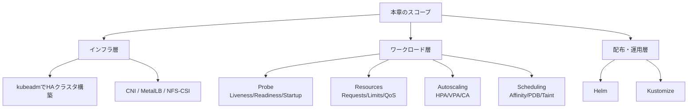
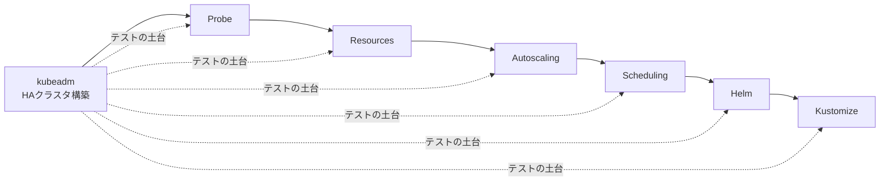
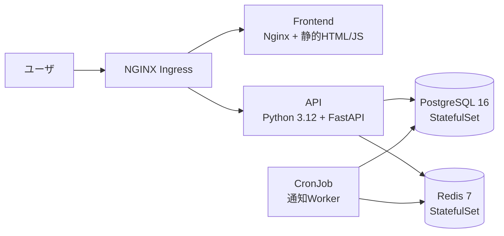
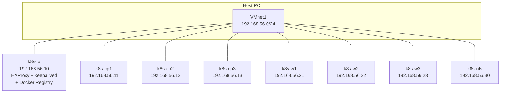
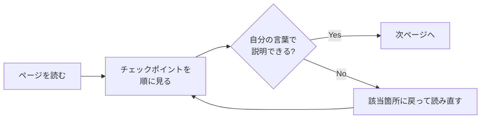

# 07. 本番運用

ここからが本教材の核心です。第 1 章から第 6 章までは Minikube という「お一人様用」の K8s で基本概念を一通り学んできました。この第 7 章からは、ローカル PC の VMware Workstation 上に kubeadm で **HA(High Availability、高可用性)構成のクラスタを自前構築** し、Probe・リソース管理・Autoscaling・スケジューリング・Helm・Kustomize までを段階的に学んでいきます。

{: .important }
> 第 6 章までと第 7 章以降は **学習環境が違います**。
> 第 6 章までは Minikube(単一ノード)、第 7 章からは VMware 上の kubeadm HA クラスタ(マスター 3 + ワーカー 3)を使います。
> 第 7 章のはじめでクラスタを組み立てるため、それ以降の章は構築済みのクラスタ前提で進みます。

## 本章で扱うトピック



各ページは独立して読めるようにしてありますが、本章の流れとしては **「土台 → アプリの正しさ → 規模対応 → 配置制御 → 配布」** の順になっています。
特に kubeadm によるクラスタ構築 (`kubeadm.md`) は時間がかかるので、ここを乗り切れば残りは各論で消化できます。

## このページのゴール

このページを読み終えると、以下を **自分の言葉で説明できる** ようになります。

- 第 7 章全体の構成と、各ページの依存関係を説明できる
- 「Minikube から HA クラスタへ移行する」ことの目的を説明できる
- 本章を通じて使う VM 構成と命名規則を頭に入れている
- サンプルアプリ「ミニ TODO サービス」の全体構成を把握している
- 各ページのチェックポイントを使った自己確認の進め方を理解している
- 本番運用で使われる用語(HA、QoS、PDB、Drain、ロールアウト戦略など)に親しんでいる

## なぜ本章があるのか

第 1 章で「Kubernetes は宣言的にコンテナを動かすシステム」と説明しました。第 2〜6 章では Pod・Service・Deployment・Ingress などの主要リソースを Minikube で動かしてきました。

しかしこれだけでは **本番運用には不十分** です。本番では以下のような問いに答える必要があります。

| 問い | 該当ページ |
|------|----------|
| マスターノードが落ちたらクラスタ全体は止まらないか? | `kubeadm.md`(HA構成) |
| Pod が刺さって応答しないとき、自動復旧されるか? | `probe.md`(Liveness Probe) |
| デプロイ直後の Pod に、まだ準備できていないのにトラフィックが流れ込まないか? | `probe.md`(Readiness Probe) |
| 1 つの Pod がメモリを食い潰してノード全体を落とさないか? | `resources.md`(Limits/QoS) |
| 突発的なアクセス増に Pod 数が自動追従するか? | `autoscaling.md`(HPA) |
| 同じアプリの Pod を複数のノードに散らせているか? | `scheduling.md`(podAntiAffinity) |
| ノードのメンテナンスでサービスが止まらないか? | `scheduling.md`(PDB / Drain) |
| 開発・ステージング・本番で設定値だけを差し替えられるか? | `helm.md` / `kustomize.md` |

本章はこれらの問いに **一つずつ機械的に答えていく** 章です。読了後にはサンプルアプリ「ミニ TODO サービス」が、Probe を持ち、リソース要求が定義され、HPA で水平スケールし、PDB で安全にメンテナンスでき、Helm Chart として配布できる状態になります。

## 本章のページ構成と読む順番

| 順 | ページ | 主な内容 | 所要時間目安 |
|----|--------|---------|-------------|
| 1 | `kubeadm.md` | HA クラスタ構築(本章で一番重い) | 4〜8 時間 |
| 2 | `probe.md` | Liveness / Readiness / Startup Probe | 2 時間 |
| 3 | `resources.md` | Requests / Limits / QoS Class | 2 時間 |
| 4 | `autoscaling.md` | HPA / VPA / Cluster Autoscaler | 3 時間 |
| 5 | `scheduling.md` | Affinity / PDB / Taint / Topology Spread | 3 時間 |
| 6 | `helm.md` | Helm Chart 化、テンプレート、リポジトリ | 3 時間 |
| 7 | `kustomize.md` | base / overlays、Generator、SMP / JSON6902 | 2 時間 |



特に注意してほしいのは「`kubeadm.md` は他のすべての前提」だということです。
ここで構築するクラスタが、後続のページの実験場になります。**`kubeadm.md` を完全にスキップして他のページから入るのは推奨しません**。後で「Minikube ではこの実験は再現できない」「StorageClass がないので試せない」「LoadBalancer がないので Ingress が組めない」といった壁に何度も当たることになります。

## 学習環境のハードウェア要件

第 7 章以降を進めるには、PC に余裕のあるリソースが必要です。

| 項目 | 推奨 | 最低 |
|------|------|------|
| CPU | 物理 8 コア以上(仮想化対応・VT-x/AMD-V 有効) | 4 コア |
| メモリ | 32 GB(できれば 64 GB) | 16 GB |
| ストレージ | NVMe SSD 200 GB 以上の空き | SSD 100 GB |
| ネットワーク | (構築中に Docker Hub / GitHub から大量 pull するため有線 100 Mbps 以上が快適) | - |
| 仮想化ソフト | VMware Workstation Pro 17 以降 / VMware Fusion | VirtualBox 7 でも一応可 |

メモリの内訳は次のとおりです。

```
k8s-lb       1 GB
k8s-cp1〜3   4 GB × 3 = 12 GB
k8s-w1〜3    4 GB × 3 = 12 GB
k8s-nfs      2 GB
合計         27 GB
```

ホスト OS にも 8 GB 程度は残したいので、**実メモリ 32 GB 以上が事実上の必須ライン** です。
16 GB しかない場合は、Worker を 2 台に減らす(2vCPU 2GB ずつ)、Control Plane を 1 台に減らして HA 構成を諦める、などの緊縮構成を取ります。これらは本章末の「リソース不足時の縮退構成」で別途案内します。

## サンプルアプリ「ミニ TODO サービス」

教材を通じて使うアプリの構成は以下です。



| コンポーネント | イメージ | 種類 | 役割 |
|----------------|---------|------|------|
| Frontend | `192.168.56.10:5000/todo-frontend:0.1.0` | Deployment | 静的ファイル配信(後段で API 呼び出し) |
| API | `192.168.56.10:5000/todo-api:0.1.0` | Deployment | TODO の CRUD、認証 |
| PostgreSQL | `postgres:16` | StatefulSet | TODO データの永続化 |
| Redis | `redis:7` | StatefulSet | セッション、ジョブキュー |
| Worker | `192.168.56.10:5000/todo-worker:0.1.0` | CronJob | 期限切れ TODO の通知バッチ |
| Ingress | NGINX Ingress Controller | Deployment(別 Namespace) | L7 ルーティング |

**ラベル付けの規約**:

```yaml
metadata:
  labels:
    app.kubernetes.io/name: todo-api          # 個別コンポーネント名
    app.kubernetes.io/instance: todo-prod     # インスタンス識別
    app.kubernetes.io/version: "0.1.0"        # アプリのバージョン
    app.kubernetes.io/component: api          # 役割
    app.kubernetes.io/part-of: todo           # アプリスイート全体名
    app.kubernetes.io/managed-by: kustomize   # 管理ツール (helm / kustomize / argocd)
```

これは Kubernetes 公式の [Recommended Labels](https://kubernetes.io/docs/concepts/overview/working-with-objects/common-labels/) に従ったものです。第 7 章以降の YAML すべてでこの規約を守ります。

## VMware kubeadm 環境の確定情報



| ホスト名 | IP | 役割 | 備考 |
|---------|----|----|------|
| `k8s-lb` | 192.168.56.10 | HAProxy + keepalived + Docker Registry | API VIP も同 IP |
| `k8s-cp1` | 192.168.56.11 | Control Plane #1 | etcd メンバ #1 |
| `k8s-cp2` | 192.168.56.12 | Control Plane #2 | etcd メンバ #2 |
| `k8s-cp3` | 192.168.56.13 | Control Plane #3 | etcd メンバ #3 |
| `k8s-w1` | 192.168.56.21 | Worker #1 | |
| `k8s-w2` | 192.168.56.22 | Worker #2 | |
| `k8s-w3` | 192.168.56.23 | Worker #3 | |
| `k8s-nfs` | 192.168.56.30 | NFS サーバ | StorageClass=nfs のバックエンド |

その他の確定パラメータ:

| 項目 | 値 |
|------|---|
| ネットワーク | VMware Host-only(VMnet1)で 192.168.56.0/24 |
| OS | Ubuntu 22.04 LTS Server |
| コンテナランタイム | containerd |
| CNI | Calico(VXLAN モード) |
| Pod CIDR | 10.244.0.0/16 |
| Service CIDR | 10.96.0.0/12(kubeadm デフォルト) |
| ストレージ | NFS-CSI、StorageClass=nfs(default) |
| LoadBalancer | MetalLB(192.168.56.200-250 プール) |
| Kubernetes バージョン | v1.30 |
| ドメイン | `todo.local`(`/etc/hosts` で解決) |

## 各ページのチェックポイントの活用

各ページの末尾には「チェックポイント」というセクションがあり、**自分の言葉で説明できるか**を確認するための項目が並んでいます。
これは単なる「読んだか」のチェックリストではなく、**「読んだあと、誰かに説明する場面を想像して、できるか?」** を問うものです。



このループを回せていないと、章の終盤で「あれ、Probe の話どうだったっけ?」と立ち止まることが頻繁に起きます。

## 本章を読み終えると

- マスター 3 + ワーカー 3 の HA クラスタを kubeadm で構築できる(`kubeadm.md`)
- 適切な Probe とリソース要求を設計できる(`probe.md` / `resources.md`)
- HPA / VPA / Cluster Autoscaler の役割を理解できる(`autoscaling.md`)
- スケジューリングを Affinity / PDB / Taint で制御できる(`scheduling.md`)
- Helm Chart 化、Kustomize 化したサンプルアプリをデプロイできる(`helm.md` / `kustomize.md`)
- これらを組み合わせて「ローカル kubeadm クラスタで本番に近い構成を再現」できる

状態になります。

## 本章を読む前に

第 1〜6 章の以下のページを既読であることを前提にしています。

- 第 1 章: `01-introduction/k8s.md`(Kubernetes の概要)
- 第 2 章: `02-resources/pod.md` / `deployment.md` / `service.md` / `configmap-secret.md`
- 第 3 章: `03-storage/pv-pvc.md` / `storageclass.md`
- 第 4 章: `04-networking/service.md` / `ingress.md`
- 第 5 章: `05-security/rbac.md` / `serviceaccount.md`
- 第 6 章: `06-workloads/job-cronjob.md` / `statefulset.md`

特に StatefulSet と PV/PVC の知識は本章のあちこちで前提とされます。

→ 次は [kubeadmで自前クラスタ構築 (HA)]({{ '/07-production/kubeadm/' | relative_url }})
